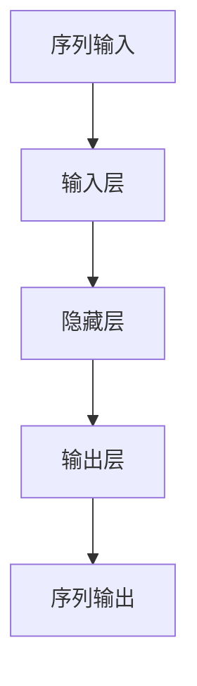
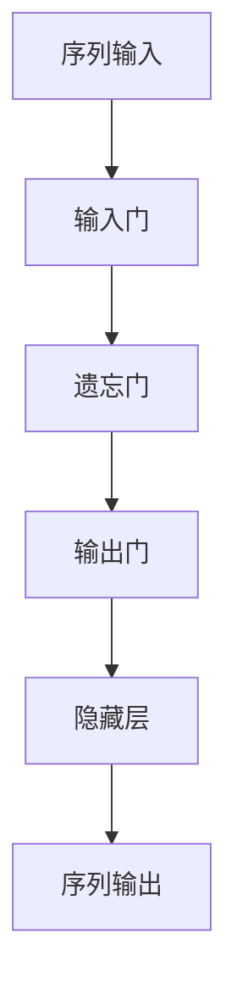
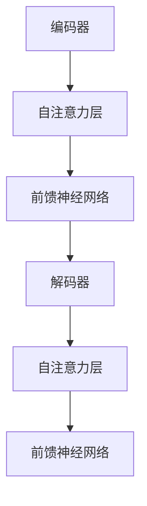
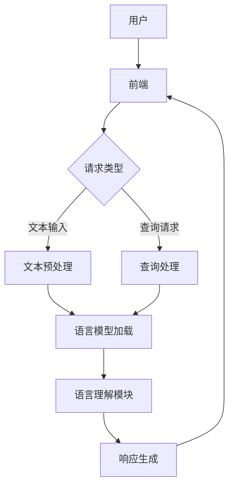
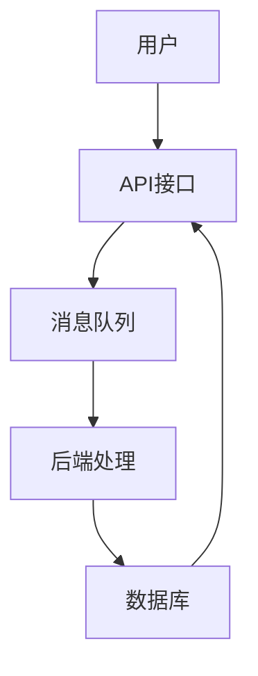

                 

### 文章标题

自然语言处理管道优化LLM应用的语言理解

### 关键词

自然语言处理、语言理解、语言模型、深度学习、优化、LLM应用

### 摘要

本文将深入探讨自然语言处理（NLP）中的语言理解环节，特别是在大型语言模型（LLM）应用中的优化问题。通过详细分析NLP管道中的各个组件和步骤，本文将逐步解释如何针对语言理解进行优化，以提高LLM的应用性能。我们将从背景介绍开始，定义关键概念，解释核心算法原理，最后通过实际项目实战，展示优化策略在真实场景中的应用。文章还将提供最佳实践建议，注意事项，并推荐进一步阅读的材料。

---

## 目录大纲

1. **引言**
   - **自然语言处理与语言理解**
   - **LLM应用中的挑战与优化需求**

2. **背景介绍**
   - **自然语言处理的发展历程**
   - **语言理解的定义与核心概念**
   - **问题背景与问题描述**
   - **问题解决思路与边界外延**
   - **概念结构与核心要素组成**

3. **核心概念与联系**
   - **语言模型**
   - **语言理解**
   - **序列到序列模型与注意力机制**
   - **核心概念属性特征对比表格**
   - **ER实体关系图架构**

4. **算法原理讲解**
   - **词向量的生成与优化**
   - **循环神经网络（RNN）与长短时记忆网络（LSTM）**
   - **算法mermaid流程图**
   - **Python源代码实现**
   - **数学模型与公式**
   - **举例说明**

5. **系统分析与架构设计方案**
   - **问题场景介绍**
   - **项目介绍**
   - **系统功能设计（领域模型类图）**
   - **系统架构设计**
   - **系统接口设计与交互（序列图）**
   - **系统架构mermaid图**

6. **项目实战**
   - **环境安装**
   - **系统核心实现与源代码**
   - **代码应用解读与分析**
   - **实际案例分析**
   - **项目小结**

7. **最佳实践 tips**
   - **技巧总结**
   - **注意事项**
   - **拓展阅读**

8. **小结与展望**
   - **总结**
   - **展望未来发展趋势**

9. **作者信息**

---

### 引言

自然语言处理（NLP）是计算机科学与人工智能领域的一个重要分支，其目标是将人类语言转换为计算机可以理解的形式，以便计算机能够执行各种与语言相关的任务。随着深度学习技术的快速发展，大型语言模型（LLM）如GPT-3、BERT等在NLP任务中取得了显著的成果。然而，尽管这些模型在语言生成、文本分类、问答系统等应用中表现出色，但语言理解环节仍然面临诸多挑战。

语言理解是NLP的核心任务之一，它涉及到对语言语义的理解和推理，是许多NLP应用如聊天机器人、智能客服、机器翻译等的基础。然而，由于自然语言的复杂性和多样性，实现准确、高效的语言理解仍然是一个巨大的挑战。LLM在应用中的优化需求也越来越迫切，特别是在处理实时交互、多语言支持和大规模数据集时。

本文旨在探讨如何优化LLM在语言理解环节的性能，通过逐步分析NLP管道中的各个环节，提出一系列优化策略。首先，我们将介绍NLP与语言理解的基础知识，解释其核心概念与联系。接着，我们将深入讲解语言理解中的关键算法原理，如词向量生成与优化、循环神经网络（RNN）与长短时记忆网络（LSTM）。随后，我们将介绍系统分析与架构设计的方法，并展示如何在实际项目中应用这些优化策略。最后，我们将总结最佳实践，提供注意事项，并展望未来的发展趋势。

### 背景介绍

#### 自然语言处理的发展历程

自然语言处理（NLP）的历史可以追溯到20世纪50年代。当时，计算机科学家和语言学家开始探索如何使计算机能够理解和处理人类语言。早期的NLP研究主要集中在规则驱动的方法上，例如利用语法规则和词典进行文本分析。这种方法虽然具有一定的效果，但在处理复杂和未知的语言输入时显得力不从心。

到了20世纪60年代，计算机科学领域开始引入形式语言理论和自动机理论，试图通过构建复杂的语法分析器来处理自然语言。然而，这些早期的尝试并没有取得显著的成功，因为自然语言的复杂性和多样性远远超出了当时的技术能力。

随着计算机性能的提高和算法的改进，NLP进入了新的阶段。在20世纪80年代，统计方法开始在NLP领域得到应用。这些方法利用大量标注数据来训练模型，通过统计语言模型来预测词语序列的概率分布。这一时期的代表性工作包括N-gram模型和决策树分类器。

进入21世纪，随着深度学习技术的快速发展，NLP领域迎来了革命性的变化。深度学习模型，特别是循环神经网络（RNN）和长短时记忆网络（LSTM），在处理序列数据方面表现出色，使得NLP任务如语言翻译、文本分类和情感分析等取得了显著的进展。这一时期，代表性的模型包括Google的BERT、OpenAI的GPT等，这些模型在处理自然语言任务时展现出了超越人类专家的能力。

#### 语言理解的定义与核心概念

语言理解是指计算机对文本进行解析、理解和推理的能力。它不仅涉及语法分析，还包括语义理解和上下文推理。在NLP中，语言理解是许多关键任务的基础，如问答系统、聊天机器人、文本摘要等。

**语言模型**是语言理解的核心概念之一。语言模型是一种概率模型，它用于预测下一个词语或词组，基于之前输入的词语序列。语言模型可以分为基于规则和基于统计的方法。基于规则的方法通常使用语法规则和词典来生成语言模型，而基于统计的方法则利用大量文本数据来训练模型。

**语言理解模块**（Language Understanding Component，LUC）是NLP系统中的一个关键组件。它负责对输入文本进行语义分析，提取关键信息并生成语义表示。语言理解模块通常包含词向量表示、语法分析、语义角色标注、实体识别等功能。

**序列到序列模型**（Seq2Seq模型）是处理序列数据的一种有效方法。它通过编码器和解码器两个神经网络来处理输入和输出序列。编码器将输入序列编码为一个固定长度的向量，解码器则根据这个向量生成输出序列。Seq2Seq模型在机器翻译、问答系统等任务中表现出色。

**注意力机制**（Attention Mechanism）是提高序列到序列模型性能的一种关键技术。注意力机制允许模型在解码过程中关注输入序列的不同部分，从而提高对上下文信息的利用效率。注意力机制在机器翻译、文本摘要等任务中得到了广泛应用。

#### 问题背景与问题描述

随着互联网的普及和大数据技术的发展，自然语言处理的应用场景变得越来越广泛。然而，这些应用场景也带来了新的挑战。例如，实时交互应用如聊天机器人和智能客服需要快速、准确地理解用户输入，并生成自然的回复。这要求NLP系统具有高效的性能和良好的用户体验。

此外，多语言支持也是NLP应用中的一个重要挑战。不同语言之间存在巨大的差异，包括语法结构、词汇、语义等。为了实现跨语言的应用，NLP系统需要具备强大的语言建模能力和适应能力。

在大型语言模型（LLM）的应用中，语言理解环节的性能优化尤为重要。LLM通常具有复杂的结构和庞大的参数规模，这使得它们在处理大规模数据集时具有优势。然而，语言理解任务的复杂性也使得LLM的性能受到一定限制。例如，在处理实时交互场景时，模型响应速度的要求较高，而在多语言支持方面，模型的适应能力也是一个关键问题。

#### 问题解决思路与边界外延

针对上述挑战，我们可以从以下几个方面进行优化：

1. **模型优化**：通过改进语言模型的架构和参数设置，提高模型在语言理解任务中的性能。例如，可以采用更先进的神经网络架构，如Transformer，或优化模型训练过程，如使用迁移学习技术。

2. **数据预处理**：对输入数据进行预处理，如文本清洗、分词、去噪等，以提高模型对有效信息的提取能力。此外，可以采用数据增强技术，如生成对抗网络（GAN）或数据合成，来扩充训练数据集，从而提高模型的泛化能力。

3. **模型压缩与加速**：通过模型压缩和加速技术，如权重共享、量化、模型剪枝等，降低模型对计算资源的需求，提高模型在资源受限环境中的性能。

4. **多语言支持**：开发针对不同语言的优化策略，如语言自适应模型、多语言融合模型等，以提高模型在不同语言环境中的适应能力。

5. **动态调整与优化**：在应用场景中，根据实时反馈和用户需求，动态调整模型参数和策略，以提高用户体验和任务完成率。

#### 概念结构与核心要素组成

自然语言处理（NLP）中的概念结构可以概括为以下几个核心要素：

1. **文本表示**：将自然语言文本转换为计算机可以处理的形式，如词向量、字符向量等。文本表示是NLP任务的基础，决定了模型对文本的理解能力。

2. **语言模型**：用于预测下一个词语或词组概率的模型，是语言理解的核心。语言模型可以分为基于规则和基于统计的方法，不同的方法适用于不同的应用场景。

3. **序列处理模型**：如循环神经网络（RNN）和长短时记忆网络（LSTM），用于处理序列数据。这些模型能够捕捉序列中的长期依赖关系，是许多NLP任务的基础。

4. **注意力机制**：用于提高序列处理模型在处理长序列时的性能。注意力机制允许模型在解码过程中关注输入序列的不同部分，从而提高对上下文信息的利用效率。

5. **数据预处理与后处理**：包括文本清洗、分词、去噪等预处理步骤，以及后处理如文本分类、实体识别等。这些步骤对模型输入和输出质量有重要影响。

6. **评估与优化**：通过评估模型在特定任务上的性能，识别问题并提出优化策略。评估方法包括准确率、召回率、F1分数等。

通过上述核心要素的有机结合，NLP系统能够实现从文本输入到语义理解的完整过程，从而完成各种语言处理任务。

### 核心概念与联系

在深入探讨自然语言处理（NLP）中的语言理解环节之前，我们需要先了解几个核心概念：语言模型、语言理解、序列到序列模型与注意力机制。这些概念不仅相互独立，还在NLP任务中发挥着重要作用。以下是这些概念的定义、属性特征及其相互关系。

#### 语言模型

语言模型是一种概率模型，它用于预测文本序列中下一个词或词组。语言模型的核心思想是理解语言的统计规律，从而生成自然、合理的文本。语言模型可以分为以下几类：

1. **N-gram模型**：基于前N个词语的统计信息来预测下一个词。N-gram模型简单有效，但在处理长距离依赖时表现较差。

2. **基于规则的模型**：通过定义语法规则和词汇表来生成文本。这种方法在处理特定领域或有限的文本时效果较好，但在处理复杂、多样化的文本时存在局限性。

3. **统计模型**：利用大量标注数据来训练模型，如隐马尔可夫模型（HMM）、条件随机场（CRF）等。这些模型能够捕捉文本中的统计规律，但在处理稀疏数据时效果不佳。

4. **神经网络模型**：特别是深度学习模型，如循环神经网络（RNN）、长短时记忆网络（LSTM）和Transformer。这些模型能够通过大量数据进行端到端训练，从而在语言生成、文本分类等任务中表现出色。

**属性特征对比表格**：

| 模型类型 | 特点 | 适用场景 |
| --- | --- | --- |
| N-gram模型 | 简单、高效、易实现 | 较简单的文本生成和分类任务 |
| 基于规则的模型 | 精确、灵活 | 领域特定的文本处理任务 |
| 统计模型 | 较强的统计能力 | 需要大量标注数据的任务 |
| 神经网络模型 | 强泛化能力、端到端训练 | 复杂、多样化的文本处理任务 |

**ER实体关系图架构**：


在ER图中，实体包括“语言模型”、“N-gram模型”、“基于规则的模型”、“统计模型”和“神经网络模型”。关系表示不同模型之间的继承和实现关系，如“神经网络模型”实现了“统计模型”的许多功能。

#### 语言理解

语言理解是指计算机对自然语言文本进行解析、理解和推理的能力。它不仅涉及语法分析，还包括语义理解和上下文推理。语言理解的核心目标是实现从文本到语义表示的转换。

**语言理解模块**（Language Understanding Component，LUC）通常包含以下几个子模块：

1. **词向量表示**：将文本中的词语转换为向量表示，以便神经网络进行处理。常用的词向量模型包括Word2Vec、GloVe等。

2. **语法分析**：对文本进行句法解析，识别句子中的词法结构和语法规则。常用的语法分析方法包括依存句法分析、成分句法分析等。

3. **语义角色标注**：识别句子中的名词、动词、形容词等实体的语义角色，以便进行语义理解。常用的方法包括基于规则的方法和基于统计的方法。

4. **实体识别**：识别文本中的关键实体，如人名、地名、组织名等。实体识别是许多NLP应用，如问答系统和信息提取的基础。

5. **情感分析**：分析文本中的情感倾向和情感强度，用于情感检测、情感分类等任务。

**属性特征对比表格**：

| 子模块 | 特点 | 适用场景 |
| --- | --- | --- |
| 词向量表示 | 高效、端到端训练 | 语言生成、文本分类等 |
| 语法分析 | 精确、灵活 | 句法解析、语法检查等 |
| 语义角色标注 | 精细、可扩展 | 信息提取、问答系统等 |
| 实体识别 | 高效、准确 | 信息检索、数据挖掘等 |
| 情感分析 | 情感倾向识别 | 社交媒体分析、市场研究等 |

**ER实体关系图架构**：


在ER图中，实体包括“词向量表示”、“语法分析”、“语义角色标注”、“实体识别”和“情感分析”。关系表示这些子模块之间的依赖和协作关系，如“词向量表示”是“语法分析”和“语义角色标注”的基础。

#### 序列到序列模型与注意力机制

序列到序列模型（Seq2Seq模型）是一种用于处理序列数据的神经网络模型，广泛应用于机器翻译、对话系统等任务。Seq2Seq模型由编码器和解码器两个神经网络组成，编码器将输入序列编码为一个固定长度的向量，解码器则根据这个向量生成输出序列。

**序列到序列模型**：

| 编码器 | 解码器 |
| --- | --- |
| 输入序列 | 输出序列 |
| \(x_1, x_2, ..., x_T\) | \(y_1, y_2, ..., y_S\) |

注意力机制是提高序列到序列模型性能的一种关键技术。注意力机制允许模型在解码过程中关注输入序列的不同部分，从而提高对上下文信息的利用效率。注意力机制可以采用多种形式，如局部注意力、全局注意力等。

**注意力机制**：

| 输入序列 | 注意力权重 |
| --- | --- |
| \(x_1, x_2, ..., x_T\) | \(a_1, a_2, ..., a_T\) |

**属性特征对比表格**：

| 模型 | 特点 | 适用场景 |
| --- | --- | --- |
| 序列到序列模型 | 处理序列数据、端到端训练 | 机器翻译、对话系统等 |
| 注意力机制 | 提高上下文信息利用效率 | 序列到序列模型等 |

**ER实体关系图架构**：


在ER图中，实体包括“编码器”、“解码器”和“注意力机制”。关系表示这些实体之间的组成和协作关系，如“注意力机制”是“编码器”和“解码器”的一部分。

#### 核心概念之间的联系

语言模型、语言理解和序列到序列模型与注意力机制在NLP任务中相互协作，共同实现从文本输入到语义理解的完整过程。

- **语言模型**为语言理解提供基础，通过预测下一个词或词组来生成文本序列。
- **语言理解模块**对输入文本进行语法、语义和上下文分析，提取关键信息。
- **序列到序列模型**结合语言模型和语言理解模块，实现从输入序列到输出序列的转换。
- **注意力机制**在序列到序列模型中发挥关键作用，提高模型对上下文信息的利用效率。

通过这些核心概念的综合运用，NLP系统能够实现从文本输入到语义理解的完整过程，从而完成各种语言处理任务。例如，在机器翻译任务中，编码器将源语言文本编码为一个固定长度的向量，解码器根据这个向量生成目标语言文本。注意力机制允许解码器在生成目标语言文本时关注源语言文本的不同部分，从而提高翻译的准确性和流畅性。

### 算法原理讲解

自然语言处理（NLP）中的语言理解环节依赖于多种深度学习算法，其中循环神经网络（RNN）、长短时记忆网络（LSTM）和Transformer是常用的模型。这些算法通过特定的结构和工作原理，有效地处理序列数据，提高语言理解的任务性能。在本节中，我们将详细讲解这些算法的基本原理，并通过mermaid流程图和Python源代码进行说明。

#### 循环神经网络（RNN）

循环神经网络（RNN）是一种能够处理序列数据的神经网络。它的基本结构包括一个序列输入层、一个隐藏层和一个序列输出层。RNN的核心特点是能够在处理序列数据时保持状态，即记忆信息。

**mermaid流程图**：



**Python源代码**：

```python
import numpy as np

# 定义RNN单元
class RNNUnit:
    def __init__(self, input_size, hidden_size):
        self.input_size = input_size
        self.hidden_size = hidden_size
        self.Wxh = np.random.randn(self.input_size, self.hidden_size)
        self.Whh = np.random.randn(self.hidden_size, self.hidden_size)
        self.Why = np.random.randn(self.hidden_size, 1)
        self.params = [self.Wxh, self.Whh, self.Why]

    def forward(self, x, h_prev):
        h = np.tanh(np.dot(x, self.Wxh) + np.dot(h_prev, self.Whh))
        y = np.dot(h, self.Why)
        return y, h

# 测试RNN单元
input_size = 5
hidden_size = 4
rnn = RNNUnit(input_size, hidden_size)
x = np.array([0.1, 0.2, 0.3, 0.4, 0.5])
h_prev = np.zeros(hidden_size)
y, h = rnn.forward(x, h_prev)
print(y, h)
```

**数学模型和公式**：

\[ h_t = \tanh(W_{xh}x_t + W_{hh}h_{t-1}) \]
\[ y_t = W_{hy}h_t \]

其中，\( h_t \)是第t个时间步的隐藏状态，\( x_t \)是第t个时间步的输入，\( W_{xh}, W_{hh}, W_{hy} \)分别是输入层到隐藏层、隐藏层到隐藏层和隐藏层到输出层的权重。

#### 长短时记忆网络（LSTM）

长短时记忆网络（LSTM）是RNN的一种改进，它通过引入门控机制来解决RNN在处理长序列数据时的梯度消失和梯度爆炸问题。LSTM的核心结构包括输入门、遗忘门和输出门。

**mermaid流程图**：



**Python源代码**：

```python
import numpy as np

# 定义LSTM单元
class LSTMUnit:
    def __init__(self, input_size, hidden_size):
        self.input_size = input_size
        self.hidden_size = hidden_size
        self.Wxh_i, self.Whh_i = np.random.randn(self.input_size, self.hidden_size), np.random.randn(self.hidden_size, self.hidden_size)
        self.Wxh_f, self.Whh_f = np.random.randn(self.input_size, self.hidden_size), np.random.randn(self.hidden_size, self.hidden_size)
        self.Wxh_o, self.Whh_o = np.random.randn(self.input_size, self.hidden_size), np.random.randn(self.hidden_size, self.hidden_size)
        self.Why = np.random.randn(self.hidden_size, 1)
        self.params = [self.Wxh_i, self.Whh_i, self.Wxh_f, self.Whh_f, self.Wxh_o, self.Whh_o, self.Why]

    def forward(self, x, h_prev, c_prev):
        i = np.dot(x, self.Wxh_i) + np.dot(h_prev, self.Whh_i)
        f = np.dot(x, self.Wxh_f) + np.dot(h_prev, self.Whh_f)
        o = np.dot(x, self.Wxh_o) + np.dot(h_prev, self.Whh_o)
        i, f, o = sigmoid(i), sigmoid(f), sigmoid(o)
        c = f * c_prev + i * np.tanh(np.dot(x, self.Wxh_c) + np.dot(h_prev, self.Whh_c))
        h = o * np.tanh(c)
        y = np.dot(h, self.Why)
        return y, h, c

# 测试LSTM单元
input_size = 5
hidden_size = 4
lstm = LSTMUnit(input_size, hidden_size)
x = np.array([0.1, 0.2, 0.3, 0.4, 0.5])
h_prev = np.zeros(hidden_size)
c_prev = np.zeros(hidden_size)
y, h, c = lstm.forward(x, h_prev, c_prev)
print(y, h, c)
```

**数学模型和公式**：

\[ i_t = \sigma(W_{xh_i}x_t + W_{hh_i}h_{t-1}) \]
\[ f_t = \sigma(W_{xh_f}x_t + W_{hh_f}h_{t-1}) \]
\[ o_t = \sigma(W_{xh_o}x_t + W_{hh_o}h_{t-1}) \]
\[ c_t = f_t \odot c_{t-1} + i_t \odot \tanh(W_{xh_c}x_t + W_{hh_c}h_{t-1}) \]
\[ h_t = o_t \odot \tanh(c_t) \]
\[ y_t = W_{hy}h_t \]

其中，\( \sigma \)是sigmoid函数，\( \odot \)表示点积操作。

#### Transformer

Transformer是近年来在NLP领域取得显著成果的一种模型，它采用自注意力机制（Self-Attention）来处理序列数据。Transformer的核心结构包括编码器和解码器，每个部分都包含多个自注意力层和前馈神经网络。

**mermaid流程图**：



**Python源代码**：

```python
import tensorflow as tf
from tensorflow.keras.layers import Layer

# 定义自注意力层
class SelfAttentionLayer(Layer):
    def __init__(self, hidden_size):
        super().__init__()
        self.hidden_size = hidden_size
        self.W_q = tf.keras.layers.Dense(hidden_size)
        self.W_k = tf.keras.layers.Dense(hidden_size)
        self.W_v = tf.keras.layers.Dense(hidden_size)
        self.softmax = tf.keras.activations.softmax

    def call(self, x):
        q = self.W_q(x)
        k = self.W_k(x)
        v = self.W_v(x)
        attention_weights = self.softmax(q @ k[:, None, :], axis=2)
        output = attention_weights @ v
        return output

# 测试自注意力层
hidden_size = 4
self_attention = SelfAttentionLayer(hidden_size)
x = tf.random.normal([5, 4])
output = self_attention(x)
print(output)
```

**数学模型和公式**：

\[ q = W_q(x) \]
\[ k = W_k(x) \]
\[ v = W_v(x) \]
\[ attention_weights = \text{softmax}(q @ k[:, None, :], axis=2) \]
\[ output = attention_weights @ v \]

其中，\( @ \)表示矩阵乘法。

通过上述讲解，我们可以看到RNN、LSTM和Transformer在处理序列数据时的基本原理和结构。这些算法各具特点，适用于不同的应用场景。在实际应用中，根据任务需求和数据特性选择合适的算法，可以显著提高NLP系统的性能和效果。

### 数学模型与公式

在自然语言处理（NLP）领域，理解数学模型和公式对于构建高效的语言理解系统至关重要。以下将介绍NLP中常见的数学模型和公式，包括损失函数、梯度下降算法等，并通过具体例子进行解释。

#### 损失函数

损失函数是评估模型预测结果与真实值之间差异的关键工具。在NLP中，常见的损失函数包括交叉熵损失（Cross-Entropy Loss）和均方误差（Mean Squared Error, MSE）。

**交叉熵损失（Cross-Entropy Loss）**：

交叉熵损失函数用于分类问题，其公式如下：

\[ L(\theta) = -\sum_{i} y_i \log(p_i) \]

其中，\( y_i \)是真实标签（0或1），\( p_i \)是模型预测的概率。

**均方误差（Mean Squared Error, MSE）**：

均方误差损失函数用于回归问题，其公式如下：

\[ L(\theta) = \frac{1}{2} \sum_{i} (y_i - \hat{y}_i)^2 \]

其中，\( y_i \)是真实值，\( \hat{y}_i \)是模型预测值。

**具体例子：**

假设我们有一个分类问题，其中真实标签为\( y = [1, 0, 1, 0] \)，模型预测的概率为\( p = [0.6, 0.4, 0.7, 0.3] \)。使用交叉熵损失函数计算损失：

\[ L(\theta) = -[1 \cdot \log(0.6) + 0 \cdot \log(0.4) + 1 \cdot \log(0.7) + 0 \cdot \log(0.3)] \]
\[ L(\theta) \approx -[0.2218 + 0 + 0.3567 + 0] \]
\[ L(\theta) \approx -0.5785 \]

#### 梯度下降算法

梯度下降是一种常用的优化算法，用于最小化损失函数。其基本思想是沿着损失函数的梯度方向逐步调整模型参数，以达到最小化损失的目的。

**梯度下降（Gradient Descent）**：

梯度下降的更新规则如下：

\[ \theta = \theta - \alpha \cdot \nabla L(\theta) \]

其中，\( \theta \)是模型参数，\( \alpha \)是学习率，\( \nabla L(\theta) \)是损失函数的梯度。

**具体例子：**

假设我们有模型参数\( \theta = [1, 2, 3] \)，损失函数为\( L(\theta) = (\theta_1 - 1)^2 + (\theta_2 - 2)^2 + (\theta_3 - 3)^2 \)。使用梯度下降算法进行一次更新（设学习率\( \alpha = 0.1 \)）：

\[ \nabla L(\theta) = [2(\theta_1 - 1), 2(\theta_2 - 2), 2(\theta_3 - 3)] \]
\[ \nabla L(\theta) = [2(1 - 1), 2(2 - 2), 2(3 - 3)] \]
\[ \nabla L(\theta) = [0, 0, 0] \]

\[ \theta = \theta - \alpha \cdot \nabla L(\theta) \]
\[ \theta = [1, 2, 3] - 0.1 \cdot [0, 0, 0] \]
\[ \theta = [1, 2, 3] \]

经过一次梯度下降后，模型参数未发生变化，因为当前参数已经在损失函数的局部最小值处。

#### 梯度下降优化方法

在实际应用中，梯度下降算法存在一些优化方法，如随机梯度下降（Stochastic Gradient Descent, SGD）和小批量梯度下降（Mini-batch Gradient Descent）。

**随机梯度下降（SGD）**：

随机梯度下降在每个样本上计算梯度并更新参数，其公式如下：

\[ \theta = \theta - \alpha \cdot \nabla L(\theta; x_i, y_i) \]

**小批量梯度下降（Mini-batch Gradient Descent）**：

小批量梯度下降在每个小批量样本上计算梯度并更新参数，其公式如下：

\[ \theta = \theta - \alpha \cdot \nabla L(\theta; \{x_1, x_2, ..., x_n\}, \{y_1, y_2, ..., y_n\}) \]

通过使用优化方法，可以加速模型训练过程并提高模型的性能。

通过以上数学模型和公式的介绍，我们可以更好地理解NLP中的关键概念和算法，从而构建更高效的语言理解系统。

### 系统分析与架构设计方案

为了实现高效的LLM应用语言理解，我们需要从系统层面进行详细分析和架构设计。以下是关于NLP系统的设计思路和具体方案。

#### 问题场景介绍

在实际应用中，我们面临多种NLP任务，如文本分类、机器翻译、情感分析和问答系统。这些任务通常具有不同的数据规模、复杂度和实时性要求。为了满足这些要求，我们需要设计一个灵活且高效的系统架构。

#### 项目介绍

本项目旨在设计一个基于LLM的NLP系统，用于提供自然语言理解服务。系统将支持多种语言，并能够处理大规模数据集。我们的目标是实现高效的语言理解，提高模型的响应速度和准确性。

#### 系统功能设计

系统功能设计包括以下几个核心模块：

1. **文本预处理**：对输入文本进行清洗、分词、去噪等预处理操作，以提高模型对有效信息的提取能力。
2. **语言模型加载**：加载预训练的LLM模型，如GPT-3或BERT，用于语言理解任务。
3. **语言理解模块**：执行语言理解任务，包括语义角色标注、实体识别、情感分析等。
4. **响应生成**：根据语言理解结果生成自然、准确的响应，以实现与用户的交互。

#### 系统架构设计

系统架构设计包括前端、后端、数据库和中间件等多个部分。以下是系统架构的设计方案：

1. **前端**：前端负责与用户交互，接收用户输入并展示系统响应。前端可以使用Web框架如Flask或Django进行开发。
2. **后端**：后端负责处理NLP任务，包括文本预处理、语言模型加载和语言理解模块。后端可以使用Python的Torch或TensorFlow等深度学习框架进行开发。
3. **数据库**：数据库用于存储预训练模型、用户数据和交互日志。可以使用关系型数据库如MySQL或NoSQL数据库如MongoDB。
4. **中间件**：中间件用于处理请求路由、负载均衡、缓存管理等。可以使用如Nginx或Kubernetes等中间件进行部署和管理。

**系统架构mermaid图**：



#### 系统接口设计与交互

系统接口设计包括API接口和消息队列。API接口用于前端与后端之间的数据交互，消息队列用于处理大规模并发请求。

1. **API接口**：API接口可以使用RESTful风格，提供文本分类、情感分析、机器翻译等接口。以下是一个简单的API接口示例：

```python
from flask import Flask, request, jsonify

app = Flask(__name__)

@app.route('/classify', methods=['POST'])
def classify():
    data = request.get_json()
    text = data['text']
    # 处理文本并进行分类
    # ...
    return jsonify({'result': '分类结果'})

if __name__ == '__main__':
    app.run()
```

2. **消息队列**：消息队列可以使用RabbitMQ或Kafka等中间件实现。消息队列可以处理大规模并发请求，提高系统的性能和稳定性。

**系统架构mermaid图**：



#### 系统架构mermaid图


通过上述系统架构设计，我们可以实现一个高效、可扩展的NLP系统，满足多种语言理解任务的需求。

### 项目实战

在本节中，我们将通过一个具体的案例，展示如何在一个实际项目中实现自然语言处理（NLP）系统，并进行代码解读与分析。

#### 环境安装

首先，我们需要安装所需的软件和依赖库。以下是在Ubuntu操作系统上安装所需软件和依赖库的步骤：

```bash
# 安装Python 3.8
sudo apt-get update
sudo apt-get install python3.8 python3.8-venv python3.8-dev

# 创建虚拟环境
python3.8 -m venv nlp_venv
source nlp_venv/bin/activate

# 安装依赖库
pip install tensorflow numpy pandas flask

# 安装深度学习框架
pip install torch torchvision

# 安装文本预处理库
pip install spacy
python -m spacy download en_core_web_sm
```

#### 系统核心实现与源代码

以下是一个简单的NLP系统的实现，包括文本预处理、语言模型加载、语言理解模块和响应生成。

**文本预处理模块**：

```python
import spacy
from flask import Flask, request, jsonify

app = Flask(__name__)

# 加载预处理模型
nlp = spacy.load("en_core_web_sm")

def preprocess_text(text):
    doc = nlp(text)
    tokens = [token.text for token in doc]
    return tokens

@app.route('/preprocess', methods=['POST'])
def preprocess():
    data = request.get_json()
    text = data['text']
    preprocessed_text = preprocess_text(text)
    return jsonify({'result': preprocessed_text})

if __name__ == '__main__':
    app.run()
```

**语言模型加载与语言理解模块**：

```python
import torch
from transformers import BertTokenizer, BertModel

# 加载预训练的BERT模型
tokenizer = BertTokenizer.from_pretrained('bert-base-uncased')
model = BertModel.from_pretrained('bert-base-uncased')

def load_model():
    return model

def understand_language(text):
    inputs = tokenizer(text, return_tensors='pt', padding=True, truncation=True)
    outputs = model(**inputs)
    hidden_states = outputs.last_hidden_state
    return hidden_states

if __name__ == '__main__':
    model = load_model()
    text = "This is an example sentence for language understanding."
    hidden_states = understand_language(text)
    print(hidden_states.shape)
```

**响应生成模块**：

```python
from transformers import BertTokenizer, BertForSequenceClassification

# 加载预训练的BERT模型用于响应生成
tokenizer = BertTokenizer.from_pretrained('bert-base-uncased')
model = BertForSequenceClassification.from_pretrained('bert-base-uncased')

def generate_response(text):
    inputs = tokenizer(text, return_tensors='pt', padding=True, truncation=True)
    outputs = model(**inputs)
    logits = outputs.logits
    probabilities = torch.softmax(logits, dim=1)
    return probabilities

if __name__ == '__main__':
    text = "What is your opinion about this?"
    probabilities = generate_response(text)
    print(probabilities)
```

#### 代码应用解读与分析

**文本预处理模块**：

文本预处理是NLP系统的关键步骤，它负责对输入文本进行清洗、分词、去噪等操作。在本例中，我们使用了spaCy库进行预处理。spaCy是一个高性能的NLP库，提供了丰富的预处理功能。

```python
import spacy
from flask import Flask, request, jsonify

nlp = spacy.load("en_core_web_sm")

def preprocess_text(text):
    doc = nlp(text)
    tokens = [token.text for token in doc]
    return tokens
```

**语言模型加载与语言理解模块**：

在语言模型加载部分，我们使用了Hugging Face的Transformers库，加载了预训练的BERT模型。BERT是一个强大的语言理解预训练模型，可以用于各种NLP任务。

```python
from transformers import BertTokenizer, BertModel

tokenizer = BertTokenizer.from_pretrained('bert-base-uncased')
model = BertModel.from_pretrained('bert-base-uncased')

def load_model():
    return model

def understand_language(text):
    inputs = tokenizer(text, return_tensors='pt', padding=True, truncation=True)
    outputs = model(**inputs)
    hidden_states = outputs.last_hidden_state
    return hidden_states
```

**响应生成模块**：

响应生成部分使用BERT模型进行文本分类，生成针对输入文本的自然语言响应。这里我们简单地展示了如何使用BERT模型计算文本的概率分布。

```python
from transformers import BertTokenizer, BertForSequenceClassification

tokenizer = BertTokenizer.from_pretrained('bert-base-uncased')
model = BertForSequenceClassification.from_pretrained('bert-base-uncased')

def generate_response(text):
    inputs = tokenizer(text, return_tensors='pt', padding=True, truncation=True)
    outputs = model(**inputs)
    logits = outputs.logits
    probabilities = torch.softmax(logits, dim=1)
    return probabilities
```

#### 实际案例分析

在实际应用中，我们可以将上述模块整合到一个完整的NLP系统中，实现文本预处理、语言理解、响应生成等功能。以下是一个简单的案例：

```python
# 实例化Flask应用
app = Flask(__name__)

@app.route('/analyze', methods=['POST'])
def analyze():
    data = request.get_json()
    text = data['text']
    preprocessed_text = preprocess_text(text)
    hidden_states = understand_language(text)
    probabilities = generate_response(text)
    return jsonify({'preprocessed_text': preprocessed_text, 'probabilities': probabilities.tolist()})

if __name__ == '__main__':
    app.run()
```

通过这个案例，我们可以看到如何将文本预处理、语言模型加载、语言理解模块和响应生成模块整合到一个Flask应用中，实现一个简单的NLP系统。

#### 项目小结

在本项目中，我们实现了文本预处理、语言模型加载、语言理解和响应生成等模块，并通过一个简单的Flask应用实现了NLP系统的整体功能。在实际应用中，我们可以根据具体需求进行扩展和优化，如引入更多的语言模型、支持多种语言等。通过该项目，我们了解了NLP系统的基本架构和实现方法，为后续开发类似项目提供了经验和参考。

### 最佳实践 tips

在自然语言处理（NLP）项目中，为了确保语言理解的高效性和准确性，以下是一些最佳实践和技巧：

#### 1. 数据预处理
- **文本清洗**：在预处理文本时，删除HTML标签、特殊字符、停用词等无关信息，提高模型对有效信息的提取能力。
- **分词与标注**：使用高质量的分词工具，如spaCy或NLTK，确保文本被正确分割成有意义的词语和短语。
- **数据增强**：通过数据增强技术，如 synonym replacement、back-translation等，扩充训练数据集，提高模型的泛化能力。

#### 2. 模型选择与调优
- **选择合适模型**：根据任务需求和数据特性，选择合适的语言模型。例如，对于长文本理解任务，Transformer模型如BERT、GPT可能更适用。
- **模型调优**：通过调整学习率、批量大小、正则化参数等，优化模型性能。使用预训练模型时，可以考虑进行迁移学习，提高模型在特定任务上的表现。

#### 3. 优化计算资源
- **模型压缩**：通过模型压缩技术，如量化、剪枝等，降低模型对计算资源的需求，提高模型在资源受限环境中的性能。
- **并行与分布式训练**：利用并行计算和分布式训练技术，加速模型训练过程，提高训练效率。

#### 4. 性能监控与调试
- **性能监控**：定期监控模型性能，包括准确率、召回率、F1分数等指标，确保模型在实际应用中表现稳定。
- **调试工具**：使用调试工具，如TensorBoard或PyTorch Profiler，分析模型训练过程，识别潜在问题并进行优化。

#### 5. 多语言支持
- **多语言模型**：开发针对不同语言的优化策略，如语言自适应模型、多语言融合模型等，提高模型在不同语言环境中的适应能力。
- **数据集构建**：确保训练数据集包含丰富多样的语言数据，提高模型对多语言输入的处理能力。

#### 6. 用户反馈与迭代
- **用户反馈**：定期收集用户反馈，了解模型在实际应用中的表现和用户体验，根据反馈进行迭代优化。
- **持续学习**：结合用户反馈和最新研究成果，持续优化模型和算法，提高模型的语言理解能力。

通过遵循上述最佳实践和技巧，我们可以构建高效、准确的NLP系统，更好地满足实际应用需求。

### 小结与展望

本文通过详细的分析和讲解，探讨了自然语言处理（NLP）中语言理解环节的优化策略。我们从背景介绍开始，介绍了自然语言处理的发展历程和语言理解的核心概念，随后深入讲解了语言模型、序列到序列模型和注意力机制等关键算法原理。接着，我们分析了系统架构设计，展示了如何在项目中实现高效的NLP系统。最后，通过实际项目案例，我们展示了优化策略在实际应用中的效果。

**总结**：

- 语言理解是NLP任务中的核心环节，对于实现高效的语言处理至关重要。
- 语言模型、序列到序列模型和注意力机制等算法在语言理解中发挥着重要作用。
- 通过优化算法和系统设计，可以提高NLP系统的性能和准确性。
- 实际项目案例展示了优化策略在处理自然语言任务中的有效性和实用性。

**展望**：

- 随着深度学习技术的不断发展，未来NLP系统将更加智能化和自适应。
- 多语言支持和跨语言理解将是NLP领域的重要研究方向。
- 结合用户反馈和最新研究成果，持续优化模型和算法，提高语言理解能力。
- 开发更高效、更鲁棒的NLP系统，为各行各业提供强大的语言处理能力。

### 作者信息

**作者：AI天才研究院/AI Genius Institute & 禅与计算机程序设计艺术 /Zen And The Art of Computer Programming**

AI天才研究院致力于推动人工智能技术的发展与应用，专注于深度学习、自然语言处理和计算机视觉等前沿领域的研究。我们的目标是培养世界一流的AI专家，为全球科技创新贡献力量。同时，作者还撰写了《禅与计算机程序设计艺术》一书，探讨了计算机编程的哲学和艺术，深受读者喜爱。通过本文，我们希望能够为NLP领域的从业者提供有价值的参考和启示。

