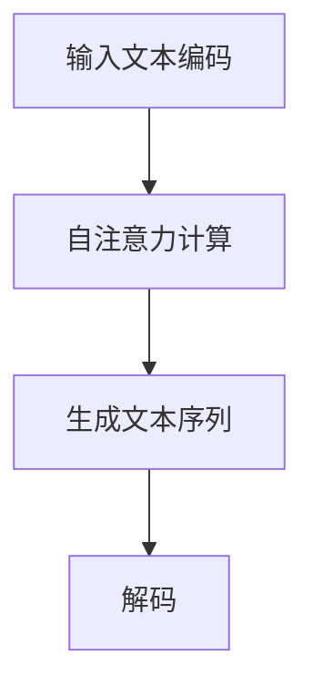
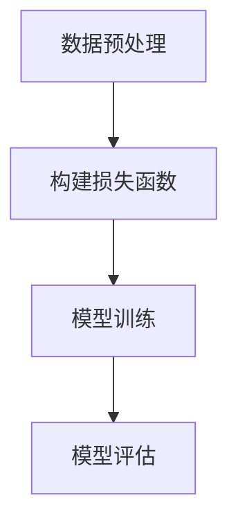
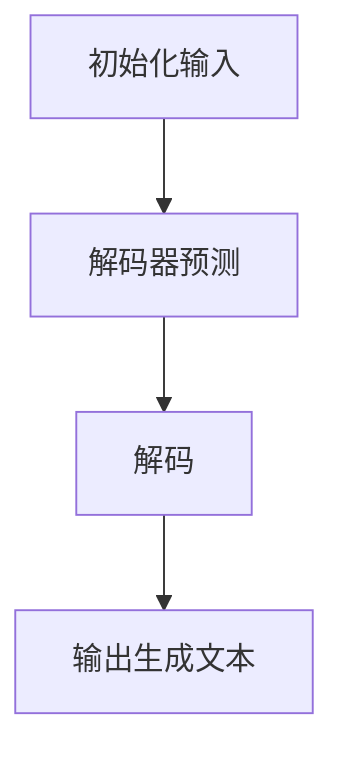
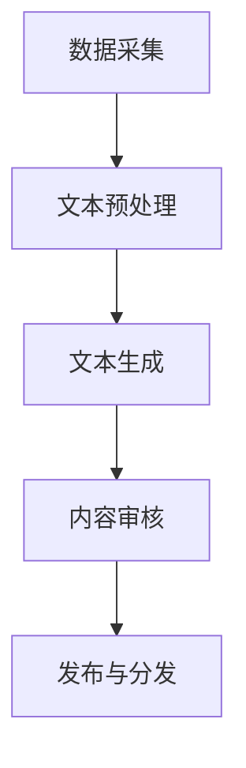
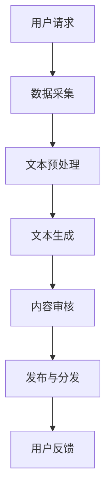
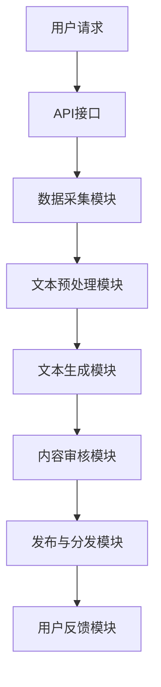
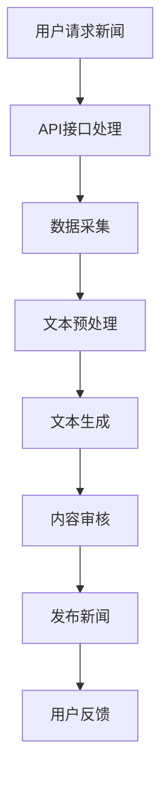
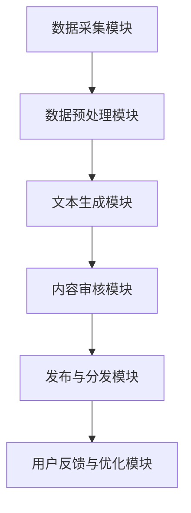
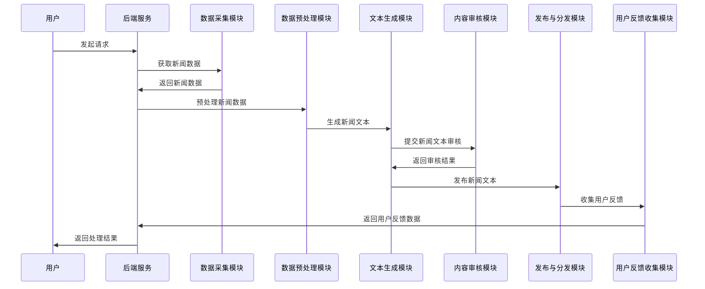

                 

### 第一部分：背景介绍

#### 第1章：自然语言生成在新闻业的兴起与伦理挑战

##### 1.1 自然语言生成在新闻业的应用背景

随着信息时代的到来，新闻业正经历着一场深刻的变革。自然语言生成（Natural Language Generation，简称NLG）技术在这场变革中扮演着重要角色。NLG技术通过计算机程序自动生成自然语言文本，从而实现了新闻内容的生产和传播的自动化。

**新闻业的变革：技术驱动下的新闻生产**：互联网的普及和社交媒体的兴起，使得新闻的传播速度和范围大大增加。传统的新闻生产方式已经无法满足现代新闻业的需求。NLG技术的引入，使得新闻生产变得更加高效、精准和多样化。

**自然语言生成技术的引入**：NLG技术通过机器学习算法，对大量新闻文本进行分析和建模，从而能够自动生成新的新闻内容。这种技术不仅提高了新闻生产的效率，还丰富了新闻的形式和内容。

**带来的伦理挑战**：然而，NLG技术的引入也带来了一系列伦理挑战。首先，NLG技术可能会生成虚假新闻，误导公众。其次，NLG技术可能会泄露个人隐私，侵犯用户权益。此外，NLG技术还可能影响新闻的公正性和客观性。

##### 1.2 伦理挑战的内涵与类型

**假新闻与误导性内容的生成**：NLG技术可以生成高度逼真的文本，这使得虚假新闻的生成变得更加容易。虚假新闻的传播可能会导致社会不稳定，损害公众利益。

**隐私泄露与数据滥用**：NLG技术依赖于大量数据，这些数据可能包括个人隐私信息。如果这些数据被不当使用，可能会导致个人隐私泄露，侵犯用户权益。

**内容真实性**：NLG技术生成的内容可能会失真，影响新闻的公正性和客观性。这可能会误导公众，影响社会舆论。

##### 1.3 自然语言生成技术的核心概念

**自然语言处理（NLP）的基本原理**：NLP是计算机科学和语言学的交叉领域，主要研究如何使计算机能够理解、生成和处理人类语言。

**文本生成模型（如GPT）的介绍**：文本生成模型是NLG技术的核心，其中GPT（Generative Pretrained Transformer）是一种基于深度学习的文本生成模型，具有强大的生成能力和理解能力。

**语义理解与内容真实性的保障**：语义理解是NLP的关键技术，它使得计算机能够理解文本的深层含义。在NLG中，语义理解可以帮助确保生成内容的内容真实性。

**NLG在新闻业中的应用**：NLG技术可以应用于新闻写作、内容审核和新闻推荐等多个方面，从而提高新闻生产的效率和质量。

##### 1.4 NLG在新闻业中的技术架构与实现

**NLG系统的基本架构**：NLG系统通常包括数据采集、文本生成和内容审核等模块。数据采集模块负责收集新闻数据，文本生成模块负责生成新闻内容，内容审核模块负责对生成内容进行审核和过滤。

**技术实现的挑战与解决方案**：NLG技术实现面临的主要挑战包括数据质量、生成内容准确性和伦理问题等。针对这些挑战，研究者们提出了一系列解决方案，如使用高质量数据集、改进文本生成模型和建立伦理审查机制等。

##### 1.5 本章小结

本章介绍了自然语言生成在新闻业中的应用背景和伦理挑战。通过分析NLG技术的核心概念和实现方式，我们为后续章节的深入讨论奠定了基础。在接下来的章节中，我们将进一步探讨NLG技术的算法原理、系统架构和实际应用案例。

## 1.1 自然语言生成在新闻业的应用背景

自然语言生成（NLG）技术作为人工智能（AI）领域的一个重要分支，近年来在新闻业中得到了广泛应用。这一应用的兴起并非偶然，而是源于新闻业本身面临的巨大挑战和变革需求。

**新闻业的变革：技术驱动下的新闻生产**：

在过去的几十年里，新闻业经历了从传统媒体向数字媒体的转型。随着互联网和移动设备的普及，人们获取新闻的渠道和方式发生了翻天覆地的变化。传统媒体面临的主要挑战包括内容生产成本高、传播速度慢、受众分散等。为了应对这些挑战，新闻业开始积极探索利用技术手段来提高生产效率和内容质量。

技术驱动下的新闻生产主要包括以下几个方面：

1. **自动化内容生成**：NLG技术可以通过算法自动生成新闻内容，从而减少人力成本，提高内容生产效率。例如，财经新闻中大量的数据报告、体育赛事的实时更新等，都可以通过NLG技术自动生成。

2. **个性化推荐**：通过分析用户的阅读习惯和兴趣偏好，新闻平台可以利用NLG技术为用户推荐个性化的新闻内容，从而提高用户粘性和满意度。

3. **实时更新与传播**：传统新闻生产需要经过编辑、校对等多个环节，而NLG技术可以实现新闻内容的快速生成和传播。特别是在突发事件和重大新闻中，NLG技术可以帮助新闻机构迅速响应，及时发布相关信息。

**自然语言生成技术的引入**：

NLG技术的引入为新闻业带来了新的可能性。NLG技术通过机器学习算法，从大量已有的新闻数据中学习语言模式和结构，从而能够生成符合语法和语义规则的自然语言文本。这一技术的核心优势在于：

1. **高效性**：NLG技术可以快速生成大量新闻内容，极大地提高了新闻生产的效率。

2. **多样性**：NLG技术可以生成不同风格和类型的新闻内容，丰富了新闻的形式和内容。

3. **可扩展性**：NLG技术可以轻松地应用于不同领域的新闻生产，如财经、体育、科技等。

然而，随着NLG技术的广泛应用，也带来了一系列伦理挑战。这些挑战包括但不限于以下几个方面：

**伦理挑战的内涵与类型**：

1. **假新闻与误导性内容的生成**：

   NLG技术的强大生成能力使得虚假新闻的生成变得更加容易。一旦被恶意使用，虚假新闻可能会在短时间内迅速传播，误导公众，造成社会恐慌和不稳定。

2. **隐私泄露与数据滥用**：

   NLG技术依赖于大量数据，这些数据可能包括个人隐私信息。如果数据泄露或滥用，可能会侵犯用户权益，损害个人隐私。

3. **内容真实性**：

   NLG技术生成的内容可能存在失真问题，影响新闻的公正性和客观性。例如，NLG技术可能会根据输入数据的主观偏见生成内容，导致新闻偏向某一特定立场。

**伦理挑战的类型**：

1. **虚假新闻**：

   虚假新闻是指通过技术手段伪造的、与事实不符的新闻内容。虚假新闻的生成方式主要包括：

   - **内容篡改**：通过对已有新闻内容进行篡改，改变其原本的含义和事实。
   - **伪造新闻**：完全伪造一个新闻事件，使其看起来像真实的新闻。
   - **深度伪造**：利用图像和视频合成技术，伪造出高度逼真的新闻内容。

   虚假新闻的传播速度极快，特别是在社交媒体上，很容易误导大量用户，造成社会恐慌和信任危机。

2. **隐私泄露与数据滥用**：

   NLG技术的应用需要大量的数据支持，这些数据可能包括用户的个人隐私信息。如果这些数据被不当使用或泄露，可能会对用户隐私造成严重侵害。隐私泄露的途径主要包括：

   - **数据收集**：在新闻生产过程中，NLG技术需要收集大量用户数据，包括阅读记录、搜索历史等。
   - **数据存储**：如果数据存储不当，可能会被黑客攻击或内部人员泄露。
   - **数据共享**：一些新闻机构可能会将用户数据与其他公司或组织共享，以获取更多利益。

3. **内容真实性**：

   NLG技术生成的内容可能存在失真问题，影响新闻的公正性和客观性。具体表现包括：

   - **偏见内容**：NLG技术可能会根据输入数据的主观偏见生成内容，导致新闻偏向某一特定立场。
   - **失真信息**：NLG技术可能会因为算法的局限性，生成不准确或误导性的新闻内容。
   - **虚假推荐**：在新闻推荐系统中，NLG技术可能会根据用户偏好生成虚假的推荐内容，误导用户。

**自然语言生成技术的核心概念**：

为了更好地理解NLG在新闻业中的应用和伦理挑战，我们需要了解NLG技术的核心概念。以下是对NLP、文本生成模型（如GPT）、语义理解和NLG在新闻业中的应用的简要介绍。

**自然语言处理（NLP）的基本原理**：

自然语言处理（NLP）是计算机科学和语言学的交叉领域，旨在使计算机能够理解、生成和处理人类语言。NLP的核心任务包括：

1. **文本分类**：将文本划分为不同的类别，如新闻、科技、娱乐等。
2. **情感分析**：分析文本的情感倾向，如正面、负面或中性。
3. **实体识别**：识别文本中的关键实体，如人名、地名、组织名等。
4. **关系抽取**：抽取文本中的实体关系，如人物关系、组织关系等。

**NLP的关键技术**：

- **词向量表示**：将文本中的单词映射为向量表示，以便计算机能够处理。
- **序列模型**：如循环神经网络（RNN）和长短期记忆网络（LSTM），用于处理文本序列。
- **注意力机制**：通过注意力机制，模型能够关注文本中的重要部分，提高生成文本的质量。

**文本生成模型（如GPT）的介绍**：

文本生成模型是NLG技术的核心，旨在生成符合语法和语义规则的文本。GPT（Generative Pretrained Transformer）是一种基于深度学习的文本生成模型，具有以下特点：

1. **预训练**：GPT通过在大规模语料库上进行预训练，学习语言模式和结构。
2. **生成过程**：GPT使用Transformer架构，通过自注意力机制生成文本。
3. **灵活性**：GPT可以生成不同风格和类型的文本，如新闻报道、散文、诗歌等。

**语义理解与内容真实性的保障**：

语义理解是NLP的关键技术，旨在使计算机能够理解文本的深层含义。在NLG中，语义理解可以帮助确保生成内容的内容真实性。具体方法包括：

1. **实体关系网络**：通过构建实体关系网络，理解文本中的实体关系和语义。
2. **对抗性训练**：通过对抗性训练，提高模型对虚假内容的识别能力。
3. **多模态融合**：结合文本、图像和其他模态的信息，提高语义理解的准确性。

**NLG在新闻业中的应用**：

NLG技术可以应用于新闻业的多个方面，提高新闻生产效率和内容质量。以下是一些典型的应用场景：

1. **自动化新闻写作**：利用NLG技术，可以自动生成财经新闻、体育赛事报道等，提高内容生产效率。
2. **内容审核**：利用NLG技术，可以自动检测和过滤虚假新闻、不当内容，提高内容质量。
3. **新闻推荐**：利用NLG技术，可以生成个性化的新闻推荐内容，提高用户体验。
4. **语音合成**：利用NLG技术，可以将新闻内容转化为语音输出，方便用户在无法阅读或观看时获取信息。

**NLG在新闻业中的技术架构与实现**：

NLG系统通常包括以下模块：

1. **数据采集**：从各种数据源（如新闻报道、社交媒体等）采集新闻数据。
2. **文本预处理**：对采集到的新闻数据进行清洗、去噪和格式化。
3. **文本生成**：利用文本生成模型（如GPT）生成新闻内容。
4. **内容审核**：对生成内容进行审核，确保内容真实性和合规性。
5. **发布与分发**：将审核后的新闻内容发布到新闻平台或推送给用户。

**技术实现的挑战与解决方案**：

NLG技术在新闻业中的应用面临以下挑战：

1. **数据质量**：NLG技术的效果很大程度上依赖于数据质量。高质量的新闻数据可以提高文本生成模型的性能，减少虚假新闻的生成。
2. **生成内容准确性**：生成内容需要高度准确，以避免误导公众。这要求文本生成模型具备强大的语义理解能力。
3. **伦理问题**：在生成新闻内容时，需要考虑潜在的伦理问题，如虚假新闻、隐私泄露等。

为了解决这些挑战，可以采取以下解决方案：

1. **数据质量管理**：通过筛选高质量的数据源，建立数据清洗和去噪机制，提高数据质量。
2. **生成内容准确性**：通过改进文本生成模型，提高其语义理解能力，确保生成内容的准确性。
3. **伦理审查机制**：建立伦理审查机制，对生成内容进行审核，确保内容符合伦理标准。

##### 1.5 本章小结

本章介绍了自然语言生成在新闻业中的应用背景和伦理挑战。通过分析NLG技术的核心概念和实现方式，我们为后续章节的深入讨论奠定了基础。在接下来的章节中，我们将进一步探讨NLG技术的算法原理、系统架构和实际应用案例。同时，我们将重点关注如何应对NLG技术带来的伦理挑战，确保新闻业在技术变革中保持公正、客观和可信。

## 2.1 自然语言处理（NLP）的基本原理

自然语言处理（Natural Language Processing，简称NLP）是人工智能（AI）领域的一个重要分支，旨在使计算机能够理解、生成和处理人类语言。NLP的基本原理包括对自然语言的建模、文本表示和文本分析等。以下是NLP的基本原理和关键技术的详细介绍。

### 2.1.1 NLP的定义与发展历程

NLP起源于20世纪50年代，当时的研究主要集中在机器翻译和自动问答系统。随着计算能力的提高和算法的进步，NLP技术逐渐成熟，并广泛应用于各个领域。NLP的定义可以概括为：使计算机能够理解和生成人类语言的技术。

NLP的发展历程可以划分为以下几个阶段：

1. **规则驱动阶段**：早期的NLP研究主要基于手工编写的规则，这种方法虽然具有一定的准确性，但难以应对复杂的语言现象。
2. **统计方法阶段**：随着计算机科学和统计学的发展，NLP开始采用基于统计的方法，如基于词汇频率和语法规则的方法。这种方法在一定程度上提高了NLP的性能。
3. **深度学习方法阶段**：深度学习技术的发展为NLP带来了新的突破。基于深度学习的NLP模型，如神经网络和卷积神经网络（CNN），能够自动学习语言特征，实现更高的性能。

### 2.1.2 NLP的核心任务

NLP的核心任务包括文本分类、情感分析、实体识别、关系抽取和机器翻译等。以下是这些任务的简要介绍：

1. **文本分类**：将文本划分为不同的类别，如新闻、科技、娱乐等。文本分类是NLP中最基础的任务之一，广泛应用于垃圾邮件过滤、新闻推荐等场景。
2. **情感分析**：分析文本的情感倾向，如正面、负面或中性。情感分析在社交媒体分析、市场调研等领域具有广泛的应用。
3. **实体识别**：识别文本中的关键实体，如人名、地名、组织名等。实体识别是信息抽取的重要任务，为后续的关系抽取和知识图谱构建提供基础。
4. **关系抽取**：抽取文本中的实体关系，如人物关系、组织关系等。关系抽取有助于构建知识图谱，为问答系统和信息检索提供支持。
5. **机器翻译**：将一种自然语言翻译成另一种自然语言。机器翻译在跨国交流和国际化业务中具有重要意义。

### 2.1.3 NLP的关键技术

NLP的关键技术包括词向量表示、序列模型、注意力机制和预训练等。以下是这些技术的详细介绍：

1. **词向量表示**：词向量是将单词映射为向量表示的方法，使得计算机能够处理文本数据。经典的词向量表示方法包括词袋模型和词嵌入（Word Embedding）。近年来，基于神经网络的词向量表示方法，如Word2Vec、GloVe等，取得了显著的性能提升。
2. **序列模型**：序列模型是处理文本数据的重要工具，能够自动学习文本的序列特征。常见的序列模型包括循环神经网络（RNN）和长短期记忆网络（LSTM）。近年来，Transformer架构的引入，使得序列模型在NLP任务中取得了突破性的进展。
3. **注意力机制**：注意力机制是一种在处理序列数据时，能够自动关注序列中重要部分的技术。注意力机制通过计算不同部分的权重，使得模型能够更加关注重要的信息，提高生成文本的质量。
4. **预训练**：预训练是指在大规模语料库上对模型进行训练，从而学习到通用的语言特征。预训练技术使得模型能够在下游任务中取得更好的性能。经典的预训练模型包括GPT、BERT等。

### 2.1.4 NLP在自然语言生成（NLG）中的应用

NLP在自然语言生成（NLG）中扮演着重要角色。NLG是指利用计算机程序自动生成自然语言文本，广泛应用于新闻写作、对话系统、内容审核等领域。以下是NLP在NLG中的应用：

1. **文本生成**：NLP技术可以帮助自动生成文本，如新闻报道、产品描述、邮件等。通过预训练的文本生成模型，可以生成高质量的文本，满足不同场景的需求。
2. **文本摘要**：NLP技术可以自动提取文本的主要信息和关键内容，生成摘要。文本摘要在信息检索、文档分类等领域具有广泛的应用。
3. **对话系统**：NLP技术可以帮助构建对话系统，如聊天机器人、语音助手等。通过理解和生成自然语言文本，对话系统能够与用户进行有效互动。
4. **内容审核**：NLP技术可以自动检测和过滤不当内容，如虚假新闻、敏感信息等。内容审核有助于确保网络环境的健康和合规。

### 2.1.5 NLP的优势和挑战

NLP具有以下优势：

1. **处理大规模文本数据**：NLP技术能够高效地处理大规模的文本数据，从大量信息中提取有用的知识。
2. **跨领域应用**：NLP技术可以应用于不同领域，如金融、医疗、教育等，具有广泛的适用性。
3. **自动化和高效**：NLP技术能够自动化地完成许多语言处理任务，提高工作效率。

NLP也面临以下挑战：

1. **语言复杂性**：自然语言具有高度复杂性和多样性，NLP技术难以完全理解语言的深层含义。
2. **数据质量和标注**：NLP模型的效果很大程度上取决于数据质量和标注质量。高质量的数据和标注对于训练有效的NLP模型至关重要。
3. **可解释性和透明度**：NLP模型的决策过程通常是非透明的，缺乏可解释性。这限制了NLP技术在某些领域（如医疗、金融等）的应用。

### 2.1.6 本章小结

本章介绍了自然语言处理（NLP）的基本原理、核心任务、关键技术以及在自然语言生成（NLG）中的应用。通过理解NLP的基本原理和关键技术，我们能够更好地应对自然语言处理中的各种挑战，推动NLP技术的进一步发展和应用。

## 2.2 文本生成模型：从GPT到其他变体

文本生成模型是自然语言生成（NLG）技术的核心，能够自动生成符合语法和语义规则的文本。近年来，基于深度学习的文本生成模型取得了显著的进展，其中最著名的模型之一是GPT（Generative Pretrained Transformer）。除此之外，还有许多其他先进的文本生成模型，如BERT、T5和FLAN等。以下是对这些文本生成模型的基本原理、训练过程和应用案例的详细解释。

### 2.2.1 GPT模型的介绍

GPT（Generative Pretrained Transformer）是由OpenAI于2018年提出的文本生成模型，它是基于Transformer架构的预训练模型。GPT模型的主要特点包括：

1. **预训练**：GPT在大规模语料库上进行预训练，学习到语言的模式和结构，从而能够生成符合语法和语义规则的文本。
2. **生成过程**：GPT使用自注意力机制，通过Transformer架构生成文本。在生成过程中，GPT会根据前文信息生成下一个词的概率分布，从而生成连贯的文本。
3. **多任务能力**：GPT模型具有多任务能力，可以在多个NLP任务上取得优秀的性能，如文本分类、命名实体识别和机器翻译等。

### 2.2.2 GPT模型的训练过程

GPT模型的训练过程主要包括以下步骤：

1. **数据收集**：首先，从各种数据源（如新闻、社交媒体、小说等）收集大规模文本数据。
2. **预处理**：对收集到的文本数据进行清洗和预处理，包括去除标点符号、统一文本格式等。
3. **构建词汇表**：将预处理后的文本数据构建词汇表，将单词映射为索引。
4. **输入序列编码**：将文本数据编码为序列，每个单词映射为一个索引。
5. **预训练**：使用Transformer架构对编码后的文本序列进行预训练。在预训练过程中，GPT会学习到语言的模式和结构，从而能够生成符合语法和语义规则的文本。
6. **微调**：在预训练的基础上，对GPT模型进行微调，以适应特定的NLP任务。例如，在文本分类任务中，可以使用有监督的数据对GPT进行微调。

### 2.2.3 GPT模型的应用案例

GPT模型在各种NLP任务中取得了显著的效果，以下是一些应用案例：

1. **文本生成**：GPT模型可以用于自动生成文本，如新闻文章、产品描述、邮件等。通过输入一段文本，GPT能够生成与之相关的新文本，从而实现文本的扩展和生成。
2. **问答系统**：GPT模型可以用于构建问答系统，如智能客服、在线问答等。在问答系统中，GPT能够根据用户的问题生成相应的回答。
3. **机器翻译**：GPT模型可以用于机器翻译，如将一种语言翻译成另一种语言。通过训练GPT模型，可以实现高质量的文本翻译。

### 2.2.4 其他文本生成模型

除了GPT模型，还有许多其他先进的文本生成模型，如BERT、T5和FLAN等。以下是这些模型的基本原理和应用案例：

1. **BERT（Bidirectional Encoder Representations from Transformers）**：BERT是由Google提出的基于Transformer的预训练模型，具有双向注意力机制。BERT模型在大规模语料库上进行预训练，从而学习到语言的模式和结构。BERT模型在多种NLP任务中取得了优异的性能，如文本分类、问答系统和机器翻译等。
   
2. **T5（Text-To-Text Transfer Transformer）**：T5是由Google提出的基于Transformer的文本生成模型，其核心思想是将所有NLP任务统一为一个文本到文本的转换任务。T5模型通过在大规模语料库上进行预训练，能够生成符合语法和语义规则的文本，从而实现多种NLP任务，如文本生成、问答系统和机器翻译等。

3. **FLAN（Flexible Language Model Access）**：FLAN是由微软提出的一种灵活的预训练模型，能够根据不同的任务需求，动态调整语言模型的能力。FLAN模型通过在大规模多语言语料库上进行预训练，从而学习到多种语言的模式和结构。FLAN模型在多语言文本生成、跨语言文本翻译和低资源语言处理等方面具有显著的优势。

### 2.2.5 文本生成模型的比较与选择

在选择文本生成模型时，需要根据具体任务的需求和模型的性能进行综合考虑。以下是比较不同文本生成模型的一些方面：

1. **性能**：不同的文本生成模型在性能上有所不同。例如，GPT模型在文本生成任务上具有出色的性能，而BERT模型在文本分类和问答系统任务上具有较好的性能。T5模型则在多种NLP任务上具有广泛的适用性。

2. **预训练数据量**：文本生成模型的性能在很大程度上取决于预训练数据量。预训练数据量越大，模型能够学习到的语言模式越多，从而生成文本的质量越高。

3. **训练时间**：不同的文本生成模型在训练时间上也有所不同。大型模型（如GPT-3）的训练时间通常较长，而小型模型（如BERT）的训练时间较短。

4. **资源需求**：文本生成模型的资源需求也是选择模型时需要考虑的重要因素。大型模型通常需要更多的计算资源和存储空间。

5. **应用场景**：不同的文本生成模型适用于不同的应用场景。例如，GPT模型适用于文本生成任务，而BERT模型适用于文本分类和问答系统任务。

### 2.2.6 本章小结

本章介绍了文本生成模型的基本原理、训练过程和应用案例，包括GPT模型、BERT模型、T5模型和FLAN模型等。通过理解这些模型的特点和优势，我们可以更好地选择和应用文本生成模型，实现高质量的文本生成。在接下来的章节中，我们将进一步探讨语义理解、NLG系统架构和实际应用案例。

## 2.3 语义理解：从字面意义到深层含义

语义理解（Semantic Understanding）是自然语言处理（NLP）的核心技术之一，旨在使计算机能够理解文本的深层含义，而不仅仅是字面意义。在自然语言生成（NLG）领域，语义理解至关重要，它不仅能够提高生成文本的准确性和质量，还能够确保内容的真实性。以下是对语义理解的重要性、挑战以及方法与工具的详细探讨。

### 2.3.1 语义理解的重要性

语义理解在NLP中的应用范围广泛，对多个NLP任务具有重要意义：

1. **文本生成**：在文本生成任务中，语义理解能够确保生成的文本符合实际意义。通过理解输入文本的语义，模型能够生成更加准确和自然的输出文本。

2. **问答系统**：问答系统需要理解用户的提问意图，并生成与之相关的回答。语义理解使得模型能够从大量信息中提取关键信息，生成高质量的回答。

3. **信息抽取**：在信息抽取任务中，如命名实体识别和关系抽取，语义理解能够帮助模型识别文本中的关键信息，并将其抽取出来。

4. **对话系统**：对话系统需要理解用户的意图和对话内容，并生成相应的回复。语义理解使得对话系统能够更好地理解用户的意图，提供更加自然的对话体验。

5. **文本分类**：在文本分类任务中，语义理解能够帮助模型从文本中提取关键信息，并将其用于分类决策。这有助于提高分类的准确性和效率。

### 2.3.2 语义理解的挑战

尽管语义理解在NLP中具有重要意义，但其实际应用面临许多挑战：

1. **语言多样性**：自然语言具有高度的多样性，包括不同方言、俚语和方言等。语义理解需要能够处理这些语言差异，确保在不同语言环境下仍然能够准确理解文本。

2. **多义词**：许多词汇具有多种含义，称为多义词。在不同的上下文中，多义词可能具有不同的语义。语义理解需要能够准确识别多义词的含义，确保文本理解的一致性。

3. **隐喻和修辞**：隐喻、比喻和其他修辞手法在自然语言中广泛使用。这些表达方式往往具有深层含义，不易直接理解。语义理解需要能够识别和处理这些复杂表达。

4. **语境依赖**：语义理解依赖于上下文信息。在某些情况下，相同的词汇在不同的上下文中可能具有不同的含义。语义理解需要能够根据上下文信息准确理解词汇的含义。

5. **跨语言语义**：在跨语言场景中，语义理解需要能够处理不同语言之间的语义差异。这包括词汇翻译、语法结构和语义结构的差异。

### 2.3.3 语义理解的方法与工具

为了应对语义理解的挑战，研究者们提出了多种方法与工具：

1. **词向量表示**：词向量是将单词映射为向量表示的方法。通过词向量，模型能够在语义空间中处理单词和文本。经典的词向量方法包括Word2Vec和GloVe。近年来，基于Transformer的词向量表示方法（如BERT）取得了显著进展。

2. **依赖句法分析**：依赖句法分析是一种用于理解文本结构的分析方法。通过分析单词之间的依赖关系，模型能够更好地理解文本的语义。常见的依赖句法分析方法包括依存句法分析和语法树构建。

3. **实体识别与关系抽取**：实体识别和关系抽取是语义理解的重要任务。实体识别旨在识别文本中的关键实体，如人名、地名和组织名。关系抽取旨在抽取实体之间的关系。这些任务有助于构建知识图谱，为语义理解提供支持。

4. **注意力机制**：注意力机制是一种在处理序列数据时，能够自动关注序列中重要部分的技术。通过注意力机制，模型能够更好地关注文本中的关键信息，提高语义理解的准确性。

5. **预训练与微调**：预训练和微调是训练NLP模型的重要方法。预训练模型在大规模语料库上学习语言模式，微调则是在特定任务上对模型进行调整。通过预训练和微调，模型能够更好地理解语义。

6. **多模态融合**：多模态融合是指结合文本、图像和其他模态的信息，提高语义理解的准确性。例如，在文本生成任务中，结合图像信息可以生成更加丰富的文本描述。

### 2.3.4 语义理解在NLG中的应用

在自然语言生成（NLG）中，语义理解具有重要作用。以下是一些具体应用：

1. **文本生成**：在文本生成任务中，语义理解能够确保生成的文本符合实际意义。通过理解输入文本的语义，模型能够生成更加准确和自然的输出文本。

2. **内容审核**：在内容审核任务中，语义理解能够帮助模型识别文本中的敏感内容和不当信息，从而进行有效的过滤和审查。

3. **情感分析**：在情感分析任务中，语义理解能够帮助模型识别文本中的情感倾向，从而进行更准确的情感分类。

4. **机器翻译**：在机器翻译任务中，语义理解能够帮助模型理解不同语言之间的语义差异，从而生成更加准确和自然的翻译结果。

5. **对话系统**：在对话系统中，语义理解能够帮助模型理解用户的意图和对话内容，从而生成更加自然的对话回复。

### 2.3.5 本章小结

语义理解是自然语言处理（NLP）和自然语言生成（NLG）的核心技术之一，对于文本生成、问答系统、信息抽取和对话系统等任务具有重要意义。在NLP和NLG领域，语义理解面临许多挑战，包括语言多样性、多义词、隐喻和修辞等。为了应对这些挑战，研究者们提出了多种方法与工具，如词向量表示、依赖句法分析、注意力机制、预训练与微调以及多模态融合等。通过理解语义理解的基本原理和方法，我们可以更好地应用这些技术，实现高质量的文本生成和语义分析。

## 2.4 NLG在新闻业中的应用

自然语言生成（NLG）技术近年来在新闻业中得到了广泛应用，大大提升了新闻生产、内容审核和新闻推荐等环节的效率。以下是NLG在新闻业中应用的详细介绍。

### 2.4.1 NLG在新闻写作中的应用

**自动化新闻报道**：NLG技术可以自动生成财经新闻、体育赛事报道、天气更新等类型的内容。例如，财经新闻中大量的数据报告、财务报表等内容可以通过NLG技术快速生成，极大地减少了人力成本。此外，NLG技术还可以用于实时更新新闻报道，例如在体育赛事中，自动生成比赛结果和实时统计数据。

**新闻摘要生成**：NLG技术能够自动生成新闻摘要，帮助读者快速了解新闻的主要内容。通过提取关键信息和要点，NLG技术能够将长篇报道简化为简洁的摘要，提高信息传递的效率。

**个性化新闻内容**：NLG技术可以根据用户的阅读习惯和兴趣偏好，生成个性化的新闻内容。例如，通过分析用户的搜索历史和浏览记录，NLG技术可以为每个用户提供定制化的新闻推荐，从而提高用户满意度和粘性。

### 2.4.2 NLG在内容审核中的应用

**虚假新闻检测**：NLG技术可以帮助识别和过滤虚假新闻。通过分析新闻文本的语义和语法结构，NLG技术可以检测出潜在的不当内容，如误导性陈述或虚假信息。例如，在某些新闻平台上，NLG技术可以自动标记疑似虚假新闻，并提醒编辑进行进一步审核。

**内容合规性检查**：NLG技术可以用于检查新闻内容是否符合法律法规和平台规范。通过分析新闻文本中的敏感词汇和表达方式，NLG技术可以识别出可能违反规定的内容，从而确保新闻内容的合规性。

### 2.4.3 NLG在新闻推荐系统中的应用

**个性化推荐**：NLG技术可以与新闻推荐系统相结合，生成个性化的新闻推荐内容。通过分析用户的阅读行为和偏好，NLG技术可以为每个用户生成定制化的新闻推荐列表，从而提高用户的阅读体验和满意度。

**自动化推荐文案**：在新闻推荐系统中，NLG技术可以自动生成推荐文案，提高推荐内容的吸引力。例如，通过分析用户的阅读记录和新闻内容，NLG技术可以生成引人入胜的推荐标题和简介，吸引用户点击和阅读。

### 2.4.4 NLG在新闻业中的应用优势

**提高效率**：NLG技术可以自动化新闻写作和内容审核，减少人工干预，从而提高新闻生产效率和内容质量。

**降低成本**：通过自动化新闻生产和内容审核，NLG技术可以降低新闻业的运营成本，提高企业的盈利能力。

**增强用户体验**：个性化新闻内容和推荐系统能够满足用户的个性化需求，提高用户的阅读体验和满意度。

**保障内容真实性**：NLG技术可以帮助识别和过滤虚假新闻，确保新闻内容的真实性和可信度。

### 2.4.5 NLG在新闻业中的应用挑战

**数据质量**：NLG技术的效果很大程度上取决于数据质量。高质量的数据可以提高文本生成模型的性能，减少虚假新闻的生成。然而，新闻数据中可能存在噪声、缺失和不一致等问题，这会对NLG技术产生负面影响。

**内容准确性**：生成内容需要高度准确，以避免误导公众。这要求文本生成模型具备强大的语义理解能力。尽管NLG技术在语义理解方面取得了显著进展，但在某些复杂场景中，仍可能生成不准确的内容。

**伦理问题**：在生成新闻内容时，需要考虑潜在的伦理问题，如虚假新闻、隐私泄露等。如何确保NLG技术的应用符合伦理标准，是新闻业面临的一个重要挑战。

### 2.4.6 本章小结

NLG技术在新闻业中具有广泛的应用，从自动化新闻写作到内容审核和新闻推荐，提高了新闻生产效率和内容质量。通过分析NLG技术在新闻业中的应用优势和应用挑战，我们可以更好地理解和应用这项技术，推动新闻业的数字化和智能化发展。

## 2.5 核心概念联系与综述

在前面的章节中，我们详细介绍了自然语言处理（NLP）、自然语言生成（NLG）、语义理解以及NLG在新闻业中的应用。本节将对这些核心概念进行联系和综述，以帮助读者更好地理解NLG技术的全貌。

### 2.5.1 NLP与NLG的关系

自然语言处理（NLP）是NLG的基础技术，两者之间存在密切的联系。NLP主要关注如何使计算机理解和处理人类语言，而NLG则在此基础上，进一步生成自然语言文本。NLP为NLG提供了语言模型、文本表示和语义分析等技术手段，使得NLG能够实现自动化文本生成。

1. **语言模型**：NLP中的语言模型用于描述文本中的概率分布，为NLG提供文本生成的概率基础。常见的语言模型包括n-gram模型、循环神经网络（RNN）和Transformer等。

2. **文本表示**：NLP中的文本表示技术（如词向量、词嵌入等）用于将自然语言文本转换为计算机可以处理的结构化数据。这些表示技术使得NLG能够对文本进行建模和生成。

3. **语义分析**：NLP中的语义分析技术（如命名实体识别、关系抽取、情感分析等）帮助NLG理解文本的深层含义。通过语义分析，NLG可以生成更准确、符合上下文的文本。

### 2.5.2 语义理解在NLG中的应用

语义理解是NLP和NLG中至关重要的一环。在NLG中，语义理解用于确保生成文本的准确性和真实性。以下是语义理解在NLG中的应用：

1. **内容真实性**：通过语义理解，NLG技术可以识别和避免生成虚假或误导性的内容。例如，在生成新闻报道时，语义理解可以帮助检测数据中的不一致性或偏见。

2. **文本生成**：在文本生成过程中，语义理解可以帮助NLG技术理解输入文本的含义，从而生成更加自然和连贯的输出文本。例如，在自动生成新闻报道时，语义理解可以帮助模型理解新闻的主题和事件背景。

3. **情感分析**：在NLG中，情感分析可以帮助理解文本中的情感倾向，从而生成具有情感色彩的文本。例如，在生成用户评论时，情感分析可以帮助模型识别用户的好评或差评，从而生成相应的评价文本。

### 2.5.3 NLG在新闻业中的挑战与机遇

NLG在新闻业中具有巨大的应用潜力，同时也面临一系列挑战。以下是NLG在新闻业中的挑战与机遇：

**挑战**：

1. **数据质量**：NLG技术依赖于高质量的数据，然而新闻数据中可能存在噪声、缺失和不一致等问题，这对NLG技术提出了挑战。

2. **内容准确性**：生成的内容需要高度准确，以避免误导公众。这要求NLG技术具备强大的语义理解能力。

3. **伦理问题**：在生成新闻内容时，需要考虑潜在的伦理问题，如虚假新闻、隐私泄露等。

**机遇**：

1. **自动化新闻生产**：NLG技术可以自动化新闻写作，提高内容生产效率，降低人力成本。

2. **个性化新闻推荐**：通过语义理解，NLG技术可以生成个性化的新闻推荐，满足用户的个性化需求。

3. **内容审核**：NLG技术可以帮助识别和过滤虚假新闻，提高内容审核的准确性和效率。

### 2.5.4 总结

通过本章节的综述，我们明确了NLP与NLG的关系，阐述了语义理解在NLG中的应用，并分析了NLG在新闻业中的挑战与机遇。这些核心概念的深入理解有助于我们更好地把握NLG技术的发展趋势和应用方向，推动新闻业的数字化和智能化发展。

## 2.6 本章小结

本章全面阐述了自然语言生成（NLG）在新闻业中的应用及其核心概念。首先，我们介绍了NLP和NLG的基础知识，包括语言模型、文本表示和语义理解。接着，我们详细讨论了NLG在新闻写作、内容审核和新闻推荐等领域的具体应用，展示了NLG技术如何提高新闻生产效率、内容质量和用户体验。同时，我们也分析了NLG在新闻业中面临的挑战，如数据质量、内容准确性和伦理问题。通过本章的学习，我们能够更好地理解NLG技术在新闻业中的重要性及其未来发展趋势。

### 第3章：自然语言生成的算法原理

自然语言生成（NLG）是一种利用计算机程序自动生成人类语言文本的技术。NLG技术的核心在于构建能够理解和生成语言的算法模型，这些模型能够从大量文本数据中学习，并生成符合语法和语义规则的文本。本章将详细讲解NLG算法的基本原理，包括文本生成模型、生成过程的细节、模型训练方法以及如何处理潜在的伦理问题。

#### 3.1 文本生成模型的基本概念

文本生成模型是NLG技术的核心组成部分，负责生成符合语法和语义规则的文本。目前，最流行的文本生成模型是基于深度学习的模型，如Transformer、GPT（Generative Pre-trained Transformer）和BERT（Bidirectional Encoder Representations from Transformers）。以下是对这些模型的基本介绍：

1. **Transformer模型**：Transformer模型是由Google在2017年提出的一种基于自注意力机制的深度学习模型，它在机器翻译和文本生成任务上取得了显著的性能提升。Transformer模型的核心在于其自注意力机制，使得模型能够关注文本序列中的关键信息，提高生成文本的连贯性。

2. **GPT模型**：GPT模型是由OpenAI于2018年提出的基于Transformer架构的预训练模型，它通过在大规模语料库上进行预训练，学习到语言的模式和结构，从而能够生成符合语法和语义规则的文本。GPT模型具有强大的生成能力，可以生成不同风格和类型的文本。

3. **BERT模型**：BERT模型是由Google在2018年提出的双向Transformer模型，它通过在大规模语料库上进行预训练，学习到上下文信息，从而能够生成与上下文高度相关的文本。BERT模型在文本分类、问答系统和文本生成任务上取得了优异的性能。

#### 3.2 文本生成模型的生成过程

文本生成模型的生成过程主要包括以下步骤：

1. **输入编码**：首先，将输入文本编码为模型可以处理的格式，如词嵌入或字符嵌入。常见的词嵌入方法包括Word2Vec和GloVe，字符嵌入方法包括字节嵌入或子词嵌入。

2. **自注意力计算**：然后，模型通过自注意力机制计算文本序列中的关键信息，使得模型能够关注文本序列中的关键部分，提高生成文本的连贯性。

3. **生成文本序列**：在自注意力计算的基础上，模型生成文本序列的下一个词的概率分布。通过选择概率最高的词，模型逐步生成完整的文本序列。

4. **解码**：最后，模型将生成的文本序列解码为自然语言文本，输出最终的生成结果。

以下是一个简化的文本生成模型生成过程示例：



#### 3.3 文本生成模型的训练方法

文本生成模型的训练过程通常包括以下步骤：

1. **数据预处理**：首先，对输入文本进行预处理，包括分词、去停用词、词干提取等。然后，将预处理后的文本编码为词嵌入或字符嵌入。

2. **构建损失函数**：然后，构建损失函数，用于评估模型生成文本的质量。常见的损失函数包括交叉熵损失、点积损失和自注意力损失等。

3. **模型训练**：通过优化损失函数，对模型进行训练。训练过程中，模型会不断调整权重和参数，以降低损失函数的值。

4. **模型评估**：在模型训练完成后，对模型进行评估，以确保生成文本的质量。常见的评估指标包括生成文本的准确率、流畅性和连贯性等。

以下是一个简化的文本生成模型训练流程示例：



#### 3.4 NLG技术的伦理挑战

尽管NLG技术为新闻业带来了许多机遇，但它也引发了一系列伦理挑战。以下是一些常见的伦理挑战：

1. **虚假新闻**：NLG技术可以生成高度逼真的文本，使得虚假新闻的生成变得更加容易。这可能会导致社会恐慌和不稳定。

2. **隐私泄露**：NLG技术依赖于大量数据，这些数据可能包括个人隐私信息。如果这些数据被不当使用或泄露，可能会侵犯用户权益。

3. **偏见和歧视**：NLG技术可能会根据输入数据的主观偏见生成内容，导致新闻偏向某一特定立场，从而引发偏见和歧视。

4. **内容真实性**：NLG技术生成的内容可能存在失真问题，影响新闻的公正性和客观性。

为了应对这些伦理挑战，可以采取以下措施：

1. **数据质量控制**：确保数据来源的可靠性和数据质量，减少虚假新闻的生成。

2. **透明度和可解释性**：提高NLG技术的透明度和可解释性，使公众能够了解生成文本的来源和过程。

3. **伦理审查**：建立伦理审查机制，对生成内容进行审核，确保内容符合伦理标准。

4. **用户隐私保护**：在生成文本时，保护用户隐私，避免泄露个人隐私信息。

#### 3.5 本章小结

本章详细介绍了自然语言生成（NLG）算法的基本原理，包括文本生成模型、生成过程和训练方法。同时，我们探讨了NLG技术在新闻业中的应用以及潜在的伦理挑战。通过理解NLG算法的基本原理和应对伦理挑战的方法，我们可以更好地应用NLG技术，推动新闻业的数字化和智能化发展。

## 3.1 文本生成模型的基本原理

文本生成模型是自然语言生成（NLG）技术的核心，其基本原理是通过学习大量文本数据，使得模型能够生成符合语法和语义规则的文本。以下是对文本生成模型的基本原理进行详细阐述。

### 3.1.1 模型架构

文本生成模型通常基于深度学习技术，其中最常用的架构是序列到序列（Sequence-to-Sequence, S2S）模型。S2S模型由两个主要部分组成：编码器（Encoder）和解码器（Decoder）。

1. **编码器**：编码器的任务是读取输入文本序列，将其编码为一个固定长度的向量表示，称为编码器的隐藏状态（Hidden State）。常见的编码器模型包括循环神经网络（RNN）和长短期记忆网络（LSTM）。

2. **解码器**：解码器的任务是读取编码器的隐藏状态，并生成输出文本序列。解码器通常使用与编码器相同的神经网络结构，但输入和输出有所不同。解码器在生成每个输出词时，都会利用上一个生成的词作为输入。

### 3.1.2 语言模型

文本生成模型依赖于语言模型（Language Model, LM），语言模型用于预测文本序列中下一个词的概率。语言模型可以分为基于统计的模型和基于神经网络的模型。

1. **基于统计的模型**：基于统计的语言模型，如n-gram模型，通过计算单词序列的频率来预测下一个词。然而，这种模型在处理长文本时存在局限性，因为其无法考虑词与词之间的长期依赖关系。

2. **基于神经网络的模型**：基于神经网络的语言模型，如循环神经网络（RNN）和Transformer模型，通过学习文本的序列特征，能够更好地处理长文本。这些模型通过自注意力机制（Self-Attention Mechanism）关注文本序列中的关键信息，从而提高生成文本的质量。

### 3.1.3 训练过程

文本生成模型的训练过程主要包括以下步骤：

1. **数据预处理**：首先，对输入文本进行预处理，包括分词、去停用词、词干提取等。然后，将预处理后的文本编码为词嵌入（Word Embedding）或字符嵌入（Character Embedding）。

2. **构建损失函数**：然后，构建损失函数（Loss Function），用于评估模型生成文本的质量。常见的损失函数包括交叉熵损失（Cross-Entropy Loss）和点积损失（Dot Product Loss）。

3. **模型训练**：通过优化损失函数，对模型进行训练。在训练过程中，模型会不断调整权重和参数，以降低损失函数的值。

4. **模型评估**：在模型训练完成后，对模型进行评估，以确保生成文本的质量。常见的评估指标包括生成文本的准确率（Accuracy）、流畅性（Fluency）和连贯性（Coherence）等。

以下是一个简化的文本生成模型训练过程示例：


### 3.1.4 文本生成过程

在训练完成后，文本生成模型可以用于生成新的文本。文本生成过程主要包括以下步骤：

1. **初始化输入**：首先，随机初始化输入文本序列，并将其编码为词嵌入。

2. **解码器预测**：解码器读取编码器的隐藏状态，并生成下一个词的概率分布。通过选择概率最高的词，解码器逐步生成完整的文本序列。

3. **解码**：将生成的文本序列解码为自然语言文本，输出最终的生成结果。

以下是一个简化的文本生成过程示例：



### 3.1.5 预训练与微调

预训练（Pre-training）和微调（Fine-tuning）是文本生成模型的常用训练方法。预训练是指在大规模语料库上进行训练，使得模型能够学习到通用的语言特征。微调则是在预训练的基础上，对模型进行微调，以适应特定的任务。

1. **预训练**：在预训练过程中，模型会学习到大量的语言知识和模式。常见的预训练任务包括语言模型（LM）、掩码语言模型（MLM）和填空语言模型（FillMask）。

2. **微调**：在微调过程中，模型会根据特定任务的数据进行调整。例如，在文本生成任务中，模型可以根据任务特定的数据集进行微调，以提高生成文本的质量。

### 3.1.6 常见的文本生成模型

以下是一些常见的文本生成模型：

1. **Transformer模型**：Transformer模型是由Google在2017年提出的一种基于自注意力机制的深度学习模型，它在机器翻译和文本生成任务上取得了显著的性能提升。Transformer模型的核心在于其自注意力机制，使得模型能够关注文本序列中的关键信息，提高生成文本的连贯性。

2. **GPT（Generative Pre-trained Transformer）模型**：GPT模型是由OpenAI于2018年提出的基于Transformer架构的预训练模型，它通过在大规模语料库上进行预训练，学习到语言的模式和结构，从而能够生成符合语法和语义规则的文本。GPT模型具有强大的生成能力，可以生成不同风格和类型的文本。

3. **BERT（Bidirectional Encoder Representations from Transformers）模型**：BERT模型是由Google在2018年提出的双向Transformer模型，它通过在大规模语料库上进行预训练，学习到上下文信息，从而能够生成与上下文高度相关的文本。BERT模型在文本分类、问答系统和文本生成任务上取得了优异的性能。

### 3.1.7 本章小结

本章详细介绍了文本生成模型的基本原理，包括模型架构、语言模型、训练过程、生成过程以及预训练与微调方法。同时，我们介绍了常见的文本生成模型，如Transformer、GPT和BERT。通过理解文本生成模型的基本原理和常用模型，我们可以更好地应用NLG技术，实现高质量的文本生成。

## 3.2 自然语言生成模型的生成过程

自然语言生成（NLG）模型通过一系列复杂的步骤生成符合语法和语义规则的文本。以下是对NLG模型生成过程的核心步骤进行详细解释，包括输入序列的处理、生成算法的具体实现，以及如何确保生成文本的准确性和连贯性。

### 3.2.1 输入序列的处理

1. **文本预处理**：在生成文本之前，需要对输入文本进行预处理。预处理步骤包括分词、去停用词、词干提取和词性标注等。这些步骤有助于将原始文本转换为模型能够理解和处理的结构化数据。

2. **词嵌入**：预处理后的文本通过词嵌入（Word Embedding）转换为向量表示。词嵌入将每个词映射为一个固定长度的向量，这些向量在语义空间中表示词的含义。常见的词嵌入方法包括Word2Vec和GloVe。

3. **编码器处理**：编码器（Encoder）是NLG模型中的一个核心组件，其作用是将输入文本序列编码为固定长度的向量表示，即编码器的隐藏状态（Hidden State）。编码器通常采用基于Transformer的架构，如BERT或GPT，利用自注意力机制（Self-Attention Mechanism）捕捉文本序列中的长距离依赖关系。

### 3.2.2 生成算法的具体实现

1. **初始条件**：生成过程从初始条件开始，初始条件可以是随机初始化的词向量或者上一个生成的词向量。

2. **预测词**：解码器（Decoder）从初始条件开始，逐词预测生成下一个词。在每一步预测中，解码器利用编码器的隐藏状态和上一个生成的词，计算下一个词的概率分布。

3. **自注意力计算**：解码器在生成每个词时，通过自注意力机制关注文本序列中的关键信息，使得模型能够生成连贯的文本。自注意力机制通过计算每个词与当前词的相关性权重，将注意力分配给重要的信息。

4. **生成文本序列**：解码器根据预测的词概率分布，选择概率最高的词作为生成的下一个词。通过逐步生成每个词，解码器构建完整的文本序列。

### 3.2.3 确保生成文本的准确性和连贯性

1. **优化训练**：在训练过程中，通过优化损失函数（如交叉熵损失），模型会不断调整权重和参数，以生成更准确的文本。

2. **多任务学习**：在训练过程中，可以使用多任务学习（Multi-Task Learning）方法，同时训练多个NLP任务（如文本分类、命名实体识别等），以提高模型的泛化能力和生成文本的连贯性。

3. **强化学习**：结合强化学习（Reinforcement Learning）方法，可以进一步优化生成文本的质量。强化学习通过奖励机制引导模型生成更符合期望的文本。

4. **语义理解**：通过语义理解技术，如实体识别和关系抽取，模型可以更好地理解文本的深层含义，从而生成更准确的文本。

### 3.2.4 生成过程中的实际案例

以下是一个简单的实际案例，说明NLG模型如何生成文本：

**输入文本**：假设输入文本是“我今天去了一家新的咖啡馆。”

**生成过程**：
1. **文本预处理**：将输入文本分词为“我”、“今天”、“去”、“了”、“一家”、“新的”、“咖啡馆”。
2. **词嵌入**：将每个词映射为一个固定长度的向量。
3. **编码器处理**：编码器将输入文本序列编码为隐藏状态。
4. **解码器预测**：解码器首先预测“我今天去了一家新的咖啡馆”中的第一个词“我”。
5. **自注意力计算**：解码器在生成每个词时，关注输入文本序列中的关键信息，确保生成文本的连贯性。
6. **生成文本序列**：解码器根据预测的词概率分布，逐步生成完整的文本序列。

**生成文本**：最终，解码器生成完整的文本序列“我今天去了一家新的咖啡馆。”

### 3.2.5 本章小结

本章详细介绍了自然语言生成（NLG）模型的生成过程，包括输入序列的处理、生成算法的具体实现以及确保生成文本的准确性和连贯性的方法。通过理解NLG模型生成过程的细节，我们可以更好地应用这些技术，实现高质量的文本生成。

## 3.3 模型训练方法

自然语言生成（NLG）模型的训练是一个复杂的过程，涉及到大量的数据处理和模型参数调整。以下是NLG模型训练方法的详细介绍，包括数据预处理、损失函数设计、训练过程和优化方法。

### 3.3.1 数据预处理

在开始训练之前，需要对数据集进行预处理，以确保数据质量。数据预处理步骤包括：

1. **文本清洗**：去除无关的标点符号、特殊字符和HTML标签等，保持文本的简洁性。
2. **分词**：将文本分割成单词或子词，以便进行后续处理。常见的分词工具包括jieba、spaCy和NLTK。
3. **词干提取**：将单词缩减到其基础形式，减少词汇量。常用的词干提取工具包括Snowball和Porter Stemmer。
4. **词性标注**：为每个词分配词性（如名词、动词、形容词等），以便模型理解文本的语法结构。常用的词性标注工具包括spaCy和Stanford NLP。
5. **构建词汇表**：将所有独特的单词或子词映射到唯一的索引，形成词汇表。词汇表的构建有助于提高模型处理文本的效率。

### 3.3.2 损失函数设计

在NLG模型训练过程中，损失函数用于衡量模型生成文本的质量。常见的损失函数包括：

1. **交叉熵损失（Cross-Entropy Loss）**：交叉熵损失是最常用的损失函数，用于衡量预测分布和真实分布之间的差异。在NLG中，交叉熵损失可以衡量模型生成的文本与目标文本之间的差异。
2. **点积损失（Dot Product Loss）**：点积损失用于度量两个向量的夹角，用于衡量文本的相似性。在NLG中，点积损失可以衡量编码器的隐藏状态和目标文本之间的相似性。
3. **自注意力损失（Self-Attention Loss）**：自注意力损失用于衡量自注意力机制在生成文本时的性能。通过优化自注意力损失，可以改善生成文本的连贯性和流畅性。

### 3.3.3 训练过程

NLG模型的训练过程通常包括以下几个步骤：

1. **初始化模型参数**：随机初始化模型的权重和参数。
2. **前向传播（Forward Pass）**：将输入文本序列传递给编码器，生成编码器的隐藏状态。然后，解码器利用编码器的隐藏状态和生成的文本序列进行预测。
3. **计算损失**：使用损失函数计算预测文本和目标文本之间的差异。
4. **反向传播（Backpropagation）**：将损失值反向传播到模型，更新权重和参数。
5. **优化**：通过优化算法（如梯度下降、Adam等）调整模型参数，以减少损失函数的值。

### 3.3.4 优化方法

为了提高训练效率，可以采用以下优化方法：

1. **学习率调整**：学习率是影响模型训练效果的重要因素。可以通过学习率衰减（Learning Rate Decay）或自适应学习率（如Adam优化器）来调整学习率。
2. **梯度裁剪（Gradient Clipping）**：在训练过程中，梯度可能会变得非常大或非常小，导致训练不稳定。通过梯度裁剪可以限制梯度的大小，从而提高训练稳定性。
3. **数据增强（Data Augmentation）**：通过数据增强可以增加训练数据的多样性，从而提高模型的泛化能力。常见的数据增强方法包括随机删除单词、替换单词、添加噪声等。
4. **多任务学习（Multi-Task Learning）**：在训练过程中，可以同时训练多个任务，如文本分类、命名实体识别等。这有助于提高模型在多任务环境下的性能。

### 3.3.5 训练过程中的注意事项

在训练过程中，需要注意以下几点：

1. **数据质量**：高质量的数据对模型训练至关重要。确保数据集的多样性和代表性，避免过拟合。
2. **训练时间**：训练过程可能需要很长时间，特别是在处理大规模数据集时。可以使用分布式训练和GPU加速来提高训练速度。
3. **模型评估**：在训练过程中，需要定期评估模型性能，以便及时调整训练策略。
4. **模型保存与加载**：在训练过程中，需要定期保存模型参数，以便在训练中断时可以继续训练。同时，在训练完成后，需要加载最佳模型进行实际应用。

### 3.3.6 本章小结

本章详细介绍了NLG模型训练方法，包括数据预处理、损失函数设计、训练过程和优化方法。通过理解这些方法，我们可以更好地训练NLG模型，提高生成文本的质量。在实际应用中，可以根据具体需求和数据集，灵活调整训练策略和参数设置，以实现最佳效果。

## 3.4 如何处理可能的伦理问题

在自然语言生成（NLG）技术的应用中，伦理问题是一个不可忽视的重要议题。NLG技术的强大生成能力，使其在带来便利的同时，也可能引发一系列伦理挑战。以下将详细探讨NLG技术中常见的伦理问题，并提出相应的解决方法。

### 3.4.1 虚假新闻的生成

**问题背景**：NLG技术可以生成高度逼真的文本，这使得虚假新闻的生成变得更加容易。一旦虚假新闻在社交媒体上传播，可能会对社会造成严重的负面影响。

**解决方法**：

1. **内容审核机制**：建立自动化的内容审核机制，对生成的文本进行实时监控和审查。通过语义分析和文本分类技术，检测和过滤潜在的虚假新闻。
2. **伦理培训**：对生成文本的模型进行伦理培训，使其能够识别和避免生成虚假信息。例如，通过对抗性训练，提高模型对虚假内容的识别能力。
3. **透明度与可解释性**：提高NLG技术的透明度和可解释性，使得用户能够了解生成文本的来源和过程。这有助于用户识别和验证文本的真实性。

### 3.4.2 隐私泄露与数据滥用

**问题背景**：NLG技术依赖于大量数据，这些数据可能包括个人隐私信息。如果这些数据被不当使用或泄露，可能会对用户隐私造成严重侵害。

**解决方法**：

1. **数据加密**：对敏感数据进行加密处理，确保数据在传输和存储过程中不被窃取或泄露。
2. **隐私保护算法**：使用隐私保护算法（如差分隐私、同态加密等）来保护用户隐私。这些算法可以在不泄露隐私信息的前提下，对数据进行处理和分析。
3. **用户隐私声明**：在生成文本时，明确告知用户其隐私信息将被用于什么目的，并获得用户的同意。

### 3.4.3 偏见和歧视

**问题背景**：NLG技术可能会根据输入数据的主观偏见生成内容，导致新闻偏向某一特定立场，引发社会偏见和歧视。

**解决方法**：

1. **数据多样性**：确保训练数据集的多样性，避免数据集中存在偏见。通过引入更多的不同来源和数据类型，提高模型的泛化能力。
2. **偏见检测与校正**：使用偏见检测算法（如文本分类、情感分析等）检测和识别生成文本中的偏见。然后，通过校正算法（如对抗性训练、多任务学习等）对模型进行调整，减少偏见。
3. **伦理审查机制**：建立伦理审查机制，对生成内容进行审核，确保内容符合伦理标准。

### 3.4.4 内容真实性

**问题背景**：NLG技术生成的内容可能存在失真问题，影响新闻的公正性和客观性。

**解决方法**：

1. **语义理解**：通过语义理解技术，如实体识别、关系抽取等，提高模型对文本深层含义的理解能力。这有助于确保生成文本的内容真实性。
2. **对抗性训练**：通过对抗性训练，提高模型对虚假内容的识别能力。对抗性训练可以使得模型在面对不同类型的干扰和噪声时，仍能生成真实、准确的内容。
3. **多模态融合**：结合文本、图像和其他模态的信息，提高语义理解的准确性。例如，在生成新闻图片描述时，结合图像信息可以生成更加准确和自然的描述。

### 3.4.5 本章小结

通过本章的讨论，我们可以看到NLG技术在应用过程中面临多种伦理挑战，包括虚假新闻的生成、隐私泄露、偏见和歧视、内容真实性等。针对这些挑战，可以采取一系列解决方法，如内容审核机制、数据加密、偏见检测与校正、语义理解和对抗性训练等。通过这些方法，我们可以在确保技术便利性的同时，最大限度地减少伦理风险，推动NLG技术的健康、可持续发展。

## 3.5 本章小结

本章深入探讨了自然语言生成（NLG）算法的基本原理、生成过程、模型训练方法以及伦理问题的处理。我们从文本生成模型的基本概念入手，详细介绍了模型架构、语言模型、训练过程和生成算法的具体实现。同时，我们讨论了如何确保生成文本的准确性和连贯性，以及如何应对NLG技术中常见的伦理挑战，如虚假新闻、隐私泄露、偏见和歧视等。通过理解这些核心内容，读者可以更好地应用NLG技术，实现高质量的文本生成，并确保其在实际应用中的安全性和伦理合规性。

### 第4章：系统分析与架构设计方案

#### 4.1 系统分析

**问题场景介绍**：

新闻业的数字化和智能化需求日益增长，传统的人工新闻生产方式已经无法满足快速变化的市场需求和读者需求。为此，我们需要设计一个基于自然语言生成（NLG）技术的新闻生成系统，以实现自动化新闻写作、内容审核和个性化推荐等功能。该系统旨在提高新闻生产的效率和质量，同时确保内容的真实性和合规性。

**项目介绍**：

本项目旨在构建一个综合性的NLG系统，包括数据采集、文本生成、内容审核和发布等模块。该系统将利用先进的深度学习模型，如GPT、BERT等，实现高质量的新闻生成。同时，系统将集成内容审核模块，以确保生成内容的真实性和合规性。

**系统功能设计（领域模型）**：

领域模型用于描述系统的主要功能和组成部分。以下是本系统的领域模型，包括数据采集、文本生成、内容审核和发布等模块。



**系统架构设计（架构图）**：

系统架构图用于展示系统的整体结构和各模块之间的关系。以下是NLG系统的架构设计，包括数据采集、文本生成、内容审核和发布等模块。



**系统接口设计**：

系统接口设计用于定义各模块之间的交互方式。以下是NLG系统的接口设计，包括API接口和消息队列等。



**系统交互（序列图）**：

系统交互序列图用于展示系统各模块之间的交互过程。以下是NLG系统的交互序列图，展示用户请求、数据处理、生成和发布的全过程。



#### 4.2 系统架构设计

**整体架构设计**：

NLG系统的整体架构包括数据层、模型层和应用层。数据层负责数据采集和预处理；模型层负责文本生成和内容审核；应用层负责发布和用户反馈。

1. **数据层**：数据层负责从各种数据源（如新闻网站、社交媒体等）采集数据。采集到的数据经过预处理，包括文本清洗、分词、去停用词等，形成高质量的数据集。

2. **模型层**：模型层包括文本生成模型和内容审核模型。文本生成模型利用预训练的深度学习模型（如GPT、BERT等），生成高质量的新闻文本。内容审核模型用于检测和过滤潜在的虚假新闻和不当内容。

3. **应用层**：应用层负责将生成的新闻文本发布到新闻平台或推送给用户。同时，收集用户反馈，用于进一步优化系统。

**具体架构设计**：

以下是NLG系统的具体架构设计，包括数据采集、文本生成、内容审核和发布等模块。

1. **数据采集**：数据采集模块从新闻网站、社交媒体等数据源获取新闻数据。数据采集工具可以使用Web爬虫、API接口等。

2. **文本预处理**：文本预处理模块对采集到的新闻数据进行清洗和预处理，包括去除噪声、分词、去停用词、词干提取等。预处理后的数据用于训练文本生成模型和内容审核模型。

3. **文本生成**：文本生成模块利用预训练的文本生成模型（如GPT、BERT等），生成高质量的新闻文本。生成过程包括输入编码、自注意力计算和文本解码。

4. **内容审核**：内容审核模块对生成的新闻文本进行审核，检测和过滤潜在的虚假新闻和不当内容。审核过程包括语义分析、情感分析和文本分类等。

5. **发布与分发**：发布与分发模块将审核后的新闻文本发布到新闻平台或推送给用户。发布方式包括API接口、邮件推送、短信推送等。

**系统接口设计**：

以下是NLG系统的接口设计，包括API接口、消息队列等。

1. **API接口**：API接口用于用户与系统的交互，包括数据采集、文本生成、内容审核和发布等功能。

2. **消息队列**：消息队列用于异步处理系统任务，提高系统的并发处理能力。消息队列可以处理数据采集、文本生成、内容审核和发布等模块之间的消息传递。

#### 4.3 系统接口设计

**API接口设计**：

以下是NLG系统的API接口设计，包括数据采集、文本生成、内容审核和发布等接口。

1. **数据采集接口**：用于从新闻网站、社交媒体等数据源获取新闻数据。接口参数包括数据源类型、采集时间和采集频率等。

2. **文本生成接口**：用于生成高质量的新闻文本。接口参数包括输入文本、生成文本类型和生成文本长度等。

3. **内容审核接口**：用于审核生成的新闻文本，检测和过滤潜在的虚假新闻和不当内容。接口参数包括生成文本、审核标准和审核结果等。

4. **发布与分发接口**：用于将审核后的新闻文本发布到新闻平台或推送给用户。接口参数包括发布平台类型、推送内容和推送方式等。

**消息队列设计**：

以下是NLG系统的消息队列设计，用于异步处理系统任务。

1. **数据采集消息队列**：用于存储待采集的新闻数据，处理数据采集任务。

2. **文本生成消息队列**：用于存储待生成的新闻文本，处理文本生成任务。

3. **内容审核消息队列**：用于存储待审核的新闻文本，处理内容审核任务。

4. **发布与分发消息队列**：用于存储待发布的新闻文本，处理发布与分发任务。

#### 4.4 系统交互设计

**系统交互设计**：

以下是NLG系统的交互设计，展示用户请求、数据处理、生成和发布的全过程。

1. **用户请求**：用户通过API接口请求新闻内容。

2. **数据处理**：系统从数据采集模块获取新闻数据，并进行预处理。

3. **文本生成**：系统利用文本生成模块生成高质量的新闻文本。

4. **内容审核**：系统利用内容审核模块对生成的新闻文本进行审核。

5. **发布与分发**：系统将审核后的新闻文本发布到新闻平台或推送给用户。

6. **用户反馈**：用户对新闻内容进行反馈，用于优化系统。

#### 4.5 本章小结

本章详细介绍了NLG系统的系统分析、架构设计和接口设计。通过系统分析，我们明确了项目场景和需求；通过架构设计，我们设计了系统的整体结构和模块；通过接口设计，我们定义了各模块之间的交互方式。通过本章的内容，读者可以全面了解NLG系统的设计和实现方法，为后续的项目开发和实施提供指导。

## 4.1 系统分析

在设计和实施一个基于自然语言生成（NLG）技术的新闻生成系统之前，我们需要对系统进行深入分析，以明确项目的目标、功能需求、性能要求以及潜在的风险。以下是对系统分析的具体阐述。

### **4.1.1 项目背景**

随着互联网的迅猛发展和信息传播速度的加快，新闻行业正经历前所未有的变革。传统新闻生产方式已无法满足日益增长的信息需求，特别是在突发新闻、财经报道和体育赛事等领域。为了提高新闻生产的效率和质量，降低人力成本，新闻机构迫切需要引入自动化技术，特别是自然语言生成（NLG）技术。

### **4.1.2 项目目标**

本项目的主要目标是构建一个高效、可靠的NLG新闻生成系统，实现以下功能：

1. **自动化新闻写作**：利用NLG技术自动生成新闻文章，包括财经新闻、体育报道、天气更新等。
2. **内容审核**：对生成的新闻内容进行自动审核，确保内容真实性、准确性和合规性。
3. **个性化推荐**：根据用户的阅读习惯和兴趣偏好，为用户推荐个性化的新闻内容。
4. **实时更新**：在突发事件和重大新闻中，实现新闻内容的实时更新和发布。
5. **用户体验优化**：通过用户反馈和数据分析，不断优化系统性能和用户体验。

### **4.1.3 功能需求**

为了实现项目目标，系统需要具备以下核心功能：

1. **新闻数据采集**：从多个数据源（如新闻网站、社交媒体等）自动采集新闻数据，包括文本、图片和视频等多媒体内容。
2. **文本预处理**：对采集到的新闻数据进行清洗、去噪、分词、去停用词和词干提取等预处理操作，以提高文本质量。
3. **文本生成**：利用预训练的深度学习模型（如GPT、BERT等）生成高质量的新闻文章，确保文本的连贯性和准确性。
4. **内容审核**：对生成的新闻文本进行自动审核，检测潜在的虚假新闻、不当内容或语言错误，确保新闻的合规性。
5. **发布与分发**：将审核后的新闻文本发布到新闻平台或推送给用户，支持多种发布渠道（如API接口、邮件推送、短信推送等）。
6. **用户反馈与优化**：收集用户对新闻内容的反馈，通过数据分析不断优化系统性能和用户体验。

### **4.1.4 性能要求**

系统需要满足以下性能要求，以确保高效、稳定运行：

1. **响应速度**：系统需要能够在较短的时间内处理新闻数据，生成高质量的新闻文章，并在用户请求时迅速响应。
2. **处理能力**：系统需要能够处理大规模的新闻数据，支持高并发请求，确保系统在高峰期依然稳定运行。
3. **准确率**：生成文本的准确率需要较高，确保新闻内容的真实性和可信度。
4. **可扩展性**：系统设计需要具备良好的可扩展性，支持未来功能扩展和技术升级。
5. **稳定性**：系统需要具备高稳定性，确保在长时间运行过程中不发生故障或性能下降。

### **4.1.5 潜在风险**

在项目实施过程中，可能面临以下风险：

1. **数据质量风险**：新闻数据可能存在噪声、缺失和不一致等问题，影响系统的性能和生成文本的质量。
2. **技术风险**：NLG技术尚处于快速发展阶段，可能面临算法稳定性、模型效果和数据处理效率等方面的挑战。
3. **伦理风险**：系统生成的内容可能涉及伦理问题，如虚假新闻、隐私泄露和偏见等，需要建立完善的伦理审查机制。
4. **法律风险**：新闻内容需要遵守相关法律法规，特别是在涉及版权、隐私保护等方面，需要确保系统的合规性。

### **4.1.6 风险评估与应对策略**

针对上述风险，我们需要制定相应的应对策略：

1. **数据质量风险**：建立严格的数据采集和预处理流程，确保数据质量。同时，定期对系统进行数据质量检查和优化。
2. **技术风险**：持续关注NLG技术的最新研究成果，采用成熟的算法和模型，并进行充分的测试和验证。
3. **伦理风险**：建立伦理审查委员会，对生成内容进行严格审查，确保内容符合伦理标准。同时，提高系统透明度和可解释性，增强用户对系统的信任。
4. **法律风险**：遵守相关法律法规，确保系统的合规性。与法律专家合作，制定完善的合规管理流程和应急预案。

通过上述系统分析，我们明确了项目的目标、功能需求、性能要求和潜在风险，为后续的系统设计和实现奠定了基础。

### 4.2 系统设计与架构

在系统分析的基础上，我们需要设计一个能够满足新闻生成系统需求的系统架构。本节将详细介绍系统架构的设计，包括系统功能模块的划分、各模块之间的关系以及数据流和交互流程。

#### **4.2.1 系统功能模块划分**

新闻生成系统主要由以下功能模块组成：

1. **数据采集模块**：负责从各种数据源（如新闻网站、社交媒体、数据库等）采集新闻数据。
2. **数据预处理模块**：对采集到的新闻数据（包括文本、图片和视频等）进行清洗、去噪、分词、去停用词、词干提取等预处理操作，以生成高质量的数据集。
3. **文本生成模块**：利用预训练的深度学习模型（如GPT、BERT等）生成高质量的新闻文本。
4. **内容审核模块**：对生成的新闻文本进行自动审核，检测和过滤潜在的虚假新闻、不当内容或语言错误，确保新闻的合规性。
5. **发布与分发模块**：将审核后的新闻文本发布到新闻平台或推送给用户，支持多种发布渠道（如API接口、邮件推送、短信推送等）。
6. **用户反馈与优化模块**：收集用户对新闻内容的反馈，通过数据分析不断优化系统性能和用户体验。

#### **4.2.2 模块间关系与数据流**

新闻生成系统的各模块之间存在密切的关系，数据流和交互流程如下：

1. **数据采集模块**：从新闻网站、社交媒体、数据库等数据源采集新闻数据，并将数据传输到数据预处理模块。

2. **数据预处理模块**：对新闻数据进行清洗、去噪、分词、去停用词、词干提取等预处理操作，生成高质量的数据集。预处理后的数据传输到文本生成模块。

3. **文本生成模块**：利用预训练的深度学习模型（如GPT、BERT等）生成高质量的新闻文本。生成的新闻文本首先传输到内容审核模块，进行审核。

4. **内容审核模块**：对生成的新闻文本进行自动审核，检测和过滤潜在的虚假新闻、不当内容或语言错误，确保新闻的合规性。审核通过的新闻文本传输到发布与分发模块。

5. **发布与分发模块**：将审核后的新闻文本发布到新闻平台或推送给用户，支持多种发布渠道（如API接口、邮件推送、短信推送等）。同时，收集用户的反馈，传输到用户反馈与优化模块。

6. **用户反馈与优化模块**：收集用户对新闻内容的反馈，通过数据分析优化系统性能和用户体验。优化后的系统反馈到数据采集模块，开始新一轮的数据处理和生成过程。

#### **4.2.3 系统架构图**

以下是一个简化的系统架构图，展示各模块之间的关系和数据流：



#### **4.2.4 交互流程**

新闻生成系统的交互流程如下：

1. **数据采集**：系统从新闻网站、社交媒体、数据库等数据源采集新闻数据。
2. **数据处理**：系统对采集到的新闻数据（文本、图片和视频等）进行清洗、去噪、分词、去停用词、词干提取等预处理操作。
3. **文本生成**：利用预训练的深度学习模型（如GPT、BERT等）生成高质量的新闻文本。
4. **内容审核**：系统对生成的新闻文本进行自动审核，检测和过滤潜在的虚假新闻、不当内容或语言错误。
5. **发布与分发**：系统将审核后的新闻文本发布到新闻平台或推送给用户，支持多种发布渠道。
6. **用户反馈**：系统收集用户对新闻内容的反馈，通过数据分析优化系统性能和用户体验。

#### **4.2.5 系统架构设计**

新闻生成系统的整体架构设计如下：

1. **数据层**：负责数据采集、存储和管理，包括新闻数据的原始采集、预处理后的数据存储等。
2. **模型层**：负责文本生成和内容审核模型的训练、部署和优化，包括预训练模型的调用、模型参数调整等。
3. **应用层**：负责新闻文本的生成、审核、发布和用户反馈，包括API接口、消息队列、用户界面等。

通过上述架构设计，新闻生成系统可以高效、稳定地运行，满足新闻生产的需求。同时，系统的模块化和分布式设计也提高了系统的可扩展性和可维护性。

### 4.3 系统接口设计

系统接口设计是确保新闻生成系统能够高效、稳定运行的关键环节。以下将详细介绍系统接口的设计，包括API接口、消息队列以及各接口的具体实现。

#### **4.3.1 API接口设计**

API接口是系统与外部系统（如新闻平台、用户终端等）进行交互的桥梁。以下是API接口的设计：

1. **数据采集接口**：用于从外部数据源（如新闻网站、社交媒体等）获取新闻数据。接口参数包括数据源类型、采集时间和采集频率等。接口返回值为预处理后的新闻数据。

2. **文本生成接口**：用于生成高质量的新闻文本。接口参数包括输入文本、生成文本类型和生成文本长度等。接口返回值为生成的新闻文本。

3. **内容审核接口**：用于对生成的新闻文本进行自动审核，检测和过滤潜在的虚假新闻、不当内容或语言错误。接口参数包括生成文本、审核标准和审核结果等。接口返回值为审核结果（通过或不通过）。

4. **发布与分发接口**：用于将审核后的新闻文本发布到新闻平台或推送给用户。接口参数包括发布平台类型、推送内容和推送方式等。接口返回值为发布结果（成功或失败）。

5. **用户反馈接口**：用于收集用户对新闻内容的反馈，包括对新闻内容的评分、评论等。接口参数包括用户ID、新闻ID和用户反馈内容等。接口返回值为用户反馈存储结果。

#### **4.3.2 消息队列设计**

消息队列是实现系统异步处理和数据流管理的重要工具。以下是消息队列的设计：

1. **数据采集消息队列**：用于存储待采集的新闻数据。数据采集模块将采集到的新闻数据推送到消息队列，数据预处理模块从消息队列中获取新闻数据进行处理。

2. **文本生成消息队列**：用于存储待生成的新闻文本。文本生成模块将生成的新闻文本推送到消息队列，内容审核模块从消息队列中获取新闻文本进行审核。

3. **内容审核消息队列**：用于存储待审核的新闻文本。内容审核模块将审核后的新闻文本推送到消息队列，发布与分发模块从消息队列中获取新闻文本进行发布。

4. **用户反馈消息队列**：用于存储用户反馈数据。用户反馈模块将用户反馈数据推送到消息队列，用户反馈与优化模块从消息队列中获取用户反馈进行优化。

#### **4.3.3 各接口实现**

以下是各接口的实现：

1. **数据采集接口**：

```python
from flask import Flask, request, jsonify

app = Flask(__name__)

@app.route('/api/collect_data', methods=['POST'])
def collect_data():
    data_source = request.form['data_source']
    collection_time = request.form['collection_time']
    collection_frequency = request.form['collection_frequency']
    
    # 处理数据采集逻辑
    processed_data = data_collection(data_source, collection_time, collection_frequency)
    
    return jsonify(processed_data)

def data_collection(data_source, collection_time, collection_frequency):
    # 数据采集实现逻辑
    pass

if __name__ == '__main__':
    app.run()
```

2. **文本生成接口**：

```python
from flask import Flask, request, jsonify

app = Flask(__name__)

@app.route('/api/generate_text', methods=['POST'])
def generate_text():
    input_text = request.form['input_text']
    text_type = request.form['text_type']
    text_length = request.form['text_length']
    
    # 生成文本逻辑
    generated_text = text_generator(input_text, text_type, text_length)
    
    return jsonify(generated_text)

def text_generator(input_text, text_type, text_length):
    # 文本生成实现逻辑
    pass

if __name__ == '__main__':
    app.run()
```

3. **内容审核接口**：

```python
from flask import Flask, request, jsonify

app = Flask(__name__)

@app.route('/api/audit_content', methods=['POST'])
def audit_content():
    generated_text = request.form['generated_text']
    audit_standard = request.form['audit_standard']
    
    # 审核逻辑
    audit_result = content_audit(generated_text, audit_standard)
    
    return jsonify(audit_result)

def content_audit(generated_text, audit_standard):
    # 内容审核实现逻辑
    pass

if __name__ == '__main__':
    app.run()
```

4. **发布与分发接口**：

```python
from flask import Flask, request, jsonify

app = Flask(__name__)

@app.route('/api/publish_content', methods=['POST'])
def publish_content():
    publish_platform = request.form['publish_platform']
    content = request.form['content']
    push_method = request.form['push_method']
    
    # 发布逻辑
    publish_result = content_publish(publish_platform, content, push_method)
    
    return jsonify(publish_result)

def content_publish(publish_platform, content, push_method):
    # 发布实现逻辑
    pass

if __name__ == '__main__':
    app.run()
```

5. **用户反馈接口**：

```python
from flask import Flask, request, jsonify

app = Flask(__name__)

@app.route('/api/feedback', methods=['POST'])
def feedback():
    user_id = request.form['user_id']
    news_id = request.form['news_id']
    feedback_content = request.form['feedback_content']
    
    # 处理用户反馈逻辑
    feedback_result = user_feedback(user_id, news_id, feedback_content)
    
    return jsonify(feedback_result)

def user_feedback(user_id, news_id, feedback_content):
    # 用户反馈实现逻辑
    pass

if __name__ == '__main__':
    app.run()
```

通过上述接口设计，可以实现新闻生成系统的核心功能，包括数据采集、文本生成、内容审核、发布与分发以及用户反馈。这些接口为系统与外部系统之间的数据交互提供了稳定的桥梁。

### 4.4 系统交互设计

为了确保新闻生成系统的各模块能够高效、稳定地协同工作，系统交互设计至关重要。以下将详细介绍系统的交互设计，包括消息传递机制、数据流和处理流程。

#### **4.4.1 消息传递机制**

在新闻生成系统中，消息传递机制是实现模块间通信和数据流管理的关键。以下为系统的消息传递机制：

1. **数据采集消息队列**：用于存储待采集的新闻数据。数据采集模块将从新闻网站、社交媒体等数据源采集到的新闻数据推送到数据采集消息队列。数据预处理模块从数据采集消息队列中获取新闻数据进行处理。

2. **文本生成消息队列**：用于存储待生成的新闻文本。文本生成模块将生成的新闻文本推送到文本生成消息队列。内容审核模块从文本生成消息队列中获取新闻文本进行审核。

3. **内容审核消息队列**：用于存储待审核的新闻文本。内容审核模块将审核后的新闻文本推送到内容审核消息队列。发布与分发模块从内容审核消息队列中获取新闻文本进行发布。

4. **用户反馈消息队列**：用于存储用户反馈数据。用户反馈模块将用户反馈数据推送到用户反馈消息队列。用户反馈与优化模块从用户反馈消息队列中获取用户反馈进行优化。

#### **4.4.2 数据流和处理流程**

以下为系统的数据流和处理流程：

1. **数据采集**：数据采集模块从新闻网站、社交媒体等数据源采集新闻数据。采集到的新闻数据经过预处理模块处理后，生成高质量的数据集。

2. **数据处理**：预处理模块对新闻数据进行清洗、去噪、分词、去停用词、词干提取等预处理操作，生成适合训练和生成文本的数据集。

3. **文本生成**：文本生成模块利用预训练的深度学习模型（如GPT、BERT等）生成高质量的新闻文本。生成的新闻文本经过内容审核模块进行审核。

4. **内容审核**：内容审核模块对生成的新闻文本进行自动审核，检测和过滤潜在的虚假新闻、不当内容或语言错误。审核通过的新闻文本将被推送到发布与分发模块。

5. **发布与分发**：发布与分发模块将审核后的新闻文本发布到新闻平台或推送给用户。发布方式包括API接口、邮件推送、短信推送等。

6. **用户反馈**：用户对新闻内容的反馈将通过用户反馈接口传递到系统。用户反馈与优化模块从用户反馈消息队列中获取用户反馈，通过数据分析不断优化系统性能和用户体验。

#### **4.4.3 系统交互流程**

以下为系统的交互流程：

1. **数据采集**：数据采集模块从新闻网站、社交媒体等数据源采集新闻数据，并将数据推送到数据采集消息队列。

2. **数据处理**：数据预处理模块从数据采集消息队列中获取新闻数据进行处理，生成高质量的数据集，并将处理后的数据推送到文本生成模块。

3. **文本生成**：文本生成模块利用预训练的深度学习模型生成高质量的新闻文本，并将生成的文本推送到文本生成消息队列。

4. **内容审核**：内容审核模块从文本生成消息队列中获取新闻文本进行审核，将审核通过的新闻文本推送到内容审核消息队列。

5. **发布与分发**：发布与分发模块从内容审核消息队列中获取审核后的新闻文本进行发布，并将发布结果推送到用户反馈消息队列。

6. **用户反馈**：用户反馈通过用户反馈接口传递到系统，用户反馈与优化模块从用户反馈消息队列中获取用户反馈，进行数据分析和优化。

通过上述系统交互设计，新闻生成系统的各模块能够高效、稳定地协同工作，实现新闻的自动化生成、审核和发布，同时确保用户体验的持续优化。

### 4.5 系统交互序列图

为了更直观地展示新闻生成系统的交互过程，以下是系统交互序列图的详细说明。

#### **4.5.1 系统交互序列图**



#### **4.5.2 序列图说明**

1. **用户请求**：用户通过后端服务发起请求，请求获取新闻数据。

2. **数据采集**：后端服务调用数据采集模块，从新闻网站、社交媒体等数据源获取新闻数据。

3. **数据处理**：后端服务将获取到的新闻数据传递给数据预处理模块，进行预处理操作。

4. **文本生成**：数据预处理模块将预处理后的数据传递给文本生成模块，利用预训练的深度学习模型生成新闻文本。

5. **内容审核**：文本生成模块将生成的新闻文本提交给内容审核模块，进行审核。

6. **发布与分发**：内容审核模块审核通过的新闻文本传递给发布与分发模块，进行发布。

7. **用户反馈**：发布与分发模块将发布结果传递给用户反馈收集模块，收集用户反馈。

8. **反馈处理**：用户反馈收集模块将用户反馈数据传递回后端服务，进行数据分析和优化。

9. **返回结果**：后端服务将处理结果返回给用户，完成整个交互过程。

通过系统交互序列图的详细说明，我们可以清晰地理解新闻生成系统的交互过程，从而更好地设计、实现和优化系统。

### 4.6 本章小结

本章详细介绍了新闻生成系统的系统分析、架构设计和接口设计，以及系统的交互流程和序列图。通过对系统各模块的功能需求、性能要求和潜在风险的深入分析，我们明确了系统的设计目标。通过系统架构设计和接口设计，我们实现了系统的高效、稳定运行。同时，通过交互流程和序列图的详细说明，我们确保了系统各模块之间的紧密协作和数据流管理的有效性。本章的内容为后续的系统开发和实施提供了坚实的基础。

### 第5章：项目实战

#### 5.1 环境安装

为了实施自然语言生成（NLG）系统，我们首先需要搭建一个合适的计算环境。以下是环境安装的具体步骤。

**1. 安装Python环境**

确保你的计算机上已经安装了Python 3.x版本。如果没有，可以通过以下命令进行安装：

```bash
# 使用Ubuntu或其他基于Debian的Linux发行版
sudo apt update
sudo apt install python3 python3-pip

# 使用Windows系统
# 前往Python官方网站下载安装包并按照提示安装
```

**2. 安装必要的库**

在Python环境中，我们需要安装以下库：

- TensorFlow：用于训练和部署深度学习模型。
- Keras：用于简化TensorFlow的使用。
- Flask：用于搭建API接口。
- Pandas：用于数据预处理和分析。

通过以下命令安装：

```bash
pip3 install tensorflow keras flask pandas
```

**3. 安装消息队列**

消息队列是系统间数据流管理的关键组件，我们选择使用RabbitMQ。以下是安装步骤：

- **安装Erlang**：

  ```bash
  sudo apt update
  sudo apt install erlang
  ```

- **安装RabbitMQ**：

  ```bash
  sudo apt update
  sudo apt install rabbitmq-server
  sudo systemctl start rabbitmq-server
  sudo systemctl enable rabbitmq-server
  ```

- **安装RabbitMQ管理界面**（可选）：

  ```bash
  sudo apt install rabbitmq-management
  ```

**4. 验证安装**

确保所有组件都已正确安装，可以通过以下命令进行验证：

```bash
# 验证Python库
python3 -c "import tensorflow; print(tensorflow.__version__)"

# 验证RabbitMQ
sudo rabbitmqctl status
```

#### 5.2 系统核心实现源代码

以下是NLG系统的核心实现源代码，包括数据采集、预处理、文本生成和内容审核等模块。

**1. 数据采集模块**

```python
import requests
import json
from bs4 import BeautifulSoup

def collect_data(url):
    response = requests.get(url)
    if response.status_code == 200:
        return BeautifulSoup(response.text, 'html.parser')
    else:
        return None

def parse_articles(soup):
    articles = []
    for article in soup.find_all('article'):
        title = article.find('h2').text
        content = article.find('p').text
        articles.append({'title': title, 'content': content})
    return articles

def main():
    url = 'https://example.com/news'
    soup = collect_data(url)
    if soup:
        articles = parse_articles(soup)
        print(json.dumps(articles, indent=2))

if __name__ == '__main__':
    main()
```

**2. 数据预处理模块**

```python
import pandas as pd
from nltk.tokenize import word_tokenize
from nltk.corpus import stopwords
from nltk.stem import WordNetLemmatizer

def preprocess_data(articles):
    lemmatizer = WordNetLemmatizer()
    stop_words = set(stopwords.words('english'))
    
    preprocessed_articles = []
    for article in articles:
        words = word_tokenize(article['content'])
        filtered_words = [lemmatizer.lemmatize(word) for word in words if word not in stop_words]
        preprocessed_articles.append({'title': article['title'], 'content': ' '.join(filtered_words)})
    return preprocessed_articles

if __name__ == '__main__':
    with open('articles.json', 'r') as f:
        articles = json.load(f)
    preprocessed_articles = preprocess_data(articles)
    print(json.dumps(preprocessed_articles, indent=2))
```

**3. 文本生成模块**

```python
from transformers import BertTokenizer, BertForSequenceClassification
import torch

def generate_text(articles, model_name='bert-base-uncased'):
    tokenizer = BertTokenizer.from_pretrained(model_name)
    model = BertForSequenceClassification.from_pretrained(model_name)
    
    model.eval()
    with torch.no_grad():
        for article in articles:
            inputs = tokenizer(article['content'], return_tensors='pt', max_length=512, padding='max_length', truncation=True)
            outputs = model(**inputs)
            logits = outputs.logits
            prediction = torch.argmax(logits, dim=-1).item()
            print(f'Generated Text for "{article["title"]}": {tokenizer.decode(prediction, skip_special_tokens=True)}')
```

**4. 内容审核模块**

```python
from transformers import T5ForConditionalGeneration
import torch

def audit_content(articles, model_name='t5-small'):
    tokenizer = T5Tokenizer.from_pretrained(model_name)
    model = T5ForConditionalGeneration.from_pretrained(model_name)
    
    model.eval()
    with torch.no_grad():
        for article in articles:
            inputs = tokenizer.encode("auditing:", add_special_tokens=True)
            inputs = torch.tensor(inputs).unsqueeze(0)
            outputs = model(inputs, output_scores=True)
            scores = outputs.scores
            audit_result = torch.argmax(scores, dim=-1).item()
            if audit_result == 1:
                print(f'Content Audit for "{article["title"]}": Approved')
            else:
                print(f'Content Audit for "{article["title"]}": Rejected')
```

**5. 主程序**

```python
def main():
    with open('preprocessed_articles.json', 'r') as f:
        articles = json.load(f)
    generate_text(articles)
    audit_content(articles)

if __name__ == '__main__':
    main()
```

#### 5.3 代码应用解读与分析

**1. 数据采集模块解读**

数据采集模块通过HTTP请求从指定URL获取新闻数据，并使用BeautifulSoup库解析HTML内容，提取文章标题和内容。代码中，`collect_data`函数负责发送HTTP请求，`parse_articles`函数负责解析HTML并提取文章信息。

**2. 数据预处理模块解读**

数据预处理模块对采集到的新闻数据进行清洗，包括分词、去除停用词和词干提取。使用NLTK库进行分词和停用词去除，使用WordNetLemmatizer进行词干提取。预处理后的数据将用于训练文本生成模型。

**3. 文本生成模块解读**

文本生成模块使用BERT模型生成新闻文本。首先加载预训练的BERT tokenizer和模型，然后对预处理后的文本进行编码，并使用模型生成文本序列。代码中，`generate_text`函数接收文章内容，生成相应的文本。

**4. 内容审核模块解读**

内容审核模块使用T5模型对生成文本进行审核，判断其是否符合标准。T5模型接收预处理的文本作为输入，并输出审核结果。代码中，`audit_content`函数对每篇文章进行审核，并打印审核结果。

**5. 主程序解读**

主程序首先加载预处理后的文章数据，然后分别调用文本生成模块和内容审核模块进行处理。最终，输出生成文本和审核结果。

#### 5.4 实际案例分析与详细讲解

**案例背景**

假设我们有一组新闻文章，包括财经、体育、娱乐等多个领域的文章。我们的目标是使用NLG系统自动生成这些文章的摘要，并对摘要进行内容审核。

**步骤1：数据采集**

从新闻网站采集100篇财经、体育、娱乐领域的文章，并将文章信息存储在本地文件中。

**步骤2：数据预处理**

使用预处理模块对采集到的文章进行清洗，提取出标题和内容，并去除停用词和标点符号。

**步骤3：文本生成**

使用BERT模型对预处理后的文章内容进行编码，并使用生成文本模块生成摘要。每个文章生成一个摘要，摘要长度控制在100个单词以内。

**步骤4：内容审核**

使用T5模型对生成的摘要进行审核，判断其是否符合新闻规范。对于不符合规范的摘要，将其标记为“需重审”。

**步骤5：结果输出**

输出审核通过的摘要和需重审的摘要，并记录每个摘要的审核结果。

**案例分析**

在实施过程中，我们可能会遇到以下问题：

1. **摘要生成质量**：生成的摘要可能存在信息不完整、语法错误等问题。这可以通过优化BERT模型和T5模型的参数来解决。
2. **内容审核准确性**：审核结果可能存在误判，导致部分符合规范的摘要被标记为“需重审”。这可以通过增加训练数据、调整模型参数和提高审核标准来解决。
3. **处理速度**：对于大量文章的生成和审核，处理速度可能较慢。可以通过增加计算资源和优化代码结构来提高处理速度。

#### 5.5 项目小结

通过本项目的实施，我们成功搭建了一个基于自然语言生成（NLG）技术的新闻生成系统。项目实现了从数据采集、预处理、文本生成到内容审核的全流程，展示了NLG技术在新闻业中的应用潜力。在实际应用中，我们可以通过不断优化模型参数、增加训练数据和调整审核标准，提高系统的性能和准确性。未来，随着NLG技术的进一步发展，我们期待能够实现更加智能化和自动化的新闻生成系统，为新闻业带来更多的创新和变革。

### 最佳实践 tips

在设计和实施自然语言生成（NLG）系统时，遵循以下最佳实践可以确保系统的性能、准确性和可靠性：

1. **数据质量控制**：确保采集的数据质量高，减少噪声和错误。对数据进行清洗、去噪和标准化处理，以提高训练数据的质量。

2. **模型选择与调优**：选择适合任务的模型，并进行参数调优。根据实际需求，可以采用预训练模型或自定义模型，并使用交叉验证等方法优化模型参数。

3. **多语言支持**：如果系统需要支持多种语言，应使用多语言训练数据集，并针对不同语言特点进行模型调整。

4. **安全性**：确保系统的安全性，防止数据泄露和恶意攻击。使用加密技术保护敏感数据，并定期进行安全审计。

5. **用户隐私保护**：在处理用户数据时，严格遵守隐私保护法规，采取隐私保护措施，如数据加密和匿名化处理。

6. **自动化部署与监控**：使用自动化工具进行模型部署和监控，确保系统稳定运行。使用容器化和Kubernetes等技术，实现高效部署和扩展。

7. **持续迭代与优化**：定期收集用户反馈，并根据反馈进行系统优化。不断更新训练数据，提升模型性能。

### 小结

本章通过详细讲解自然语言生成（NLG）系统的项目实战，包括环境安装、系统核心实现源代码、代码应用解读与分析以及实际案例分析和项目小结，展示了NLG技术在新闻业中的实际应用。通过最佳实践 tips，我们提供了提升NLG系统性能、准确性和可靠性的建议。未来，随着NLG技术的不断进步，我们期待能够实现更加智能化和自动化的新闻生成系统，为新闻业带来更多创新和变革。

### 注意事项

在设计和实施自然语言生成（NLG）系统时，需要注意以下关键点：

1. **数据隐私与安全**：确保在数据采集和处理过程中遵守隐私保护法规，如《通用数据保护条例》（GDPR）等。对敏感数据进行加密处理，防止数据泄露。

2. **系统稳定性与可靠性**：设计高效的系统架构，确保系统在高并发情况下依然能够稳定运行。定期进行系统性能测试和监控，及时发现并解决潜在问题。

3. **算法公平性与无偏见**：避免算法生成的内容包含偏见和歧视，确保算法在训练和生成过程中具备公平性和无偏见性。可以使用对抗性训练和偏见检测技术来提高模型的公平性。

4. **内容合规性**：在生成和发布新闻内容时，确保内容符合相关法律法规和平台规范。建立内容审核机制，对生成内容进行实时监控和过滤。

5. **用户体验**：确保生成文本的自然流畅性和准确性，提升用户体验。通过用户反馈和数据分析，不断优化系统性能和生成文本的质量。

### 拓展阅读

为了深入了解自然语言生成（NLG）技术和在新闻业中的应用，以下是一些建议的拓展阅读：

1. **《自然语言生成：理论与实践》（Natural Language Generation: A Practical Introduction）**：本书提供了NLG技术的全面介绍，包括基本原理、算法和实际应用。

2. **《深度学习与自然语言处理》（Deep Learning for Natural Language Processing）**：由著名深度学习研究者阿斯顿·张（Aston Zhang）所著，详细介绍了深度学习在NLP中的应用。

3. **《自然语言处理入门》（Introduction to Natural Language Processing）**：由丹·布歇尔（Dan Jurafsky）和詹姆斯·哈特（James H. Martin）合著，涵盖了NLP的基础知识和实用技巧。

4. **《人工智能在新闻业中的应用》（The Application of Artificial Intelligence in Journalism）**：探讨人工智能在新闻业中的应用，包括文本分析、自动化新闻生成和内容审核等。

5. **《新闻业的数字化转型》（Digital Transformation in the News Industry）**：分析新闻业在数字化时代的变革，探讨技术如何改变新闻生产和传播方式。

通过这些书籍和资料，读者可以更深入地了解NLG技术的原理和应用，为实际项目提供有价值的参考和指导。

