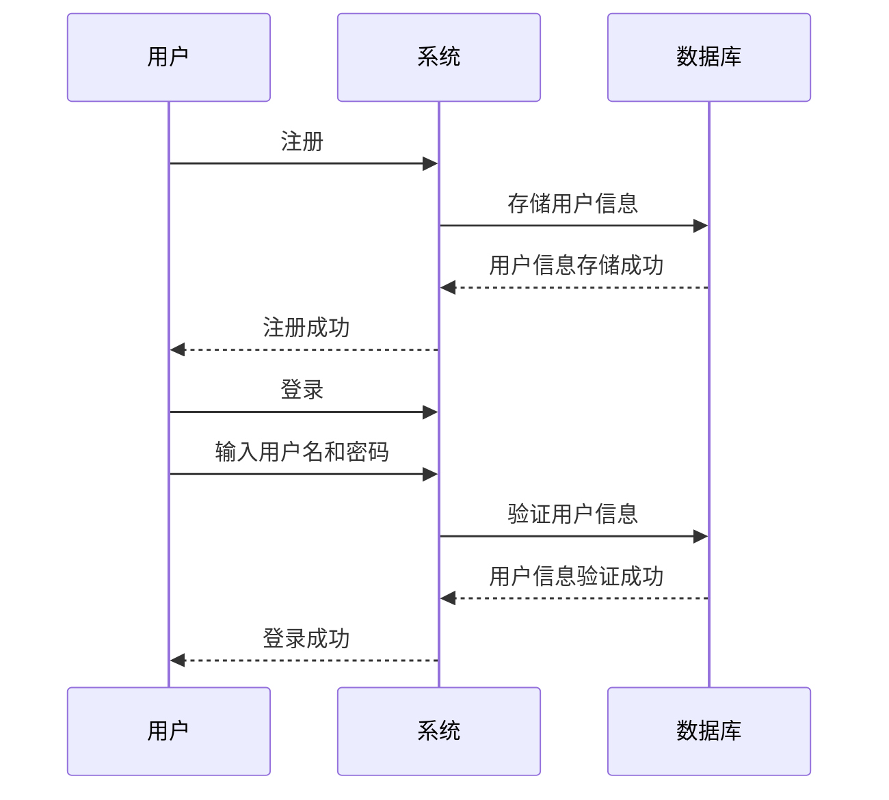

                 


# 虚拟协作：空间计算技术改变远程工作模式

## 关键词
- 虚拟协作
- 空间计算技术
- 远程工作
- VR
- AR
- MR
- 工作效率
- 沟通
- 用户体验

## 摘要
本文探讨了空间计算技术对远程工作模式带来的变革。通过分析虚拟协作的定义、空间计算技术的原理与应用，以及远程工作模式的特点和挑战，本文深入探讨了空间计算技术在提高远程工作效率、改善沟通体验和增强团队协作方面的潜力。同时，通过案例研究和边界问题的探讨，本文提出了未来空间计算技术在远程工作中发展的方向和最佳实践建议。

## 目录

### 第一部分：背景介绍

#### 第1章：问题背景与核心概念

##### 1.1.1 问题背景

随着信息技术的飞速发展，远程工作和虚拟协作已成为现代企业运营的重要组成部分。远程工作模式不仅改变了传统的办公方式，也对企业的沟通效率、工作流程、团队协作等方面提出了新的挑战。在这种背景下，空间计算技术应运而生，它通过虚拟现实（VR）、增强现实（AR）、混合现实（MR）等技术手段，为远程工作提供了更为丰富和高效的方式。

##### 1.1.2 问题解决

《虚拟协作：空间计算技术改变远程工作模式》一书旨在深入探讨空间计算技术在远程工作中的应用，分析其带来的变革，并提供切实可行的解决方案。本书将围绕以下几个核心概念展开讨论：

1. **虚拟协作**：介绍虚拟协作的定义、发展历程以及其在远程工作中的重要性。
2. **空间计算技术**：详细讲解VR、AR、MR等技术的原理、应用场景及其对远程工作模式的影响。
3. **远程工作模式**：探讨远程工作模式的特点、挑战及其对企业管理、团队协作的影响。
4. **案例研究**：分析成功实施虚拟协作和空间计算技术的企业案例，总结其经验和教训。

##### 1.1.3 边界与外延

虚拟协作和空间计算技术虽然为远程工作带来了诸多便利，但也存在一些限制和挑战，如技术成本、用户体验、隐私安全等问题。因此，本书将探讨这些边界问题，并展望空间计算技术在未来远程工作中的发展方向。

#### 1.2 核心概念与联系

##### 1.2.1 核心概念

1. **虚拟协作**：虚拟协作是指在虚拟空间中，通过技术手段实现团队间的沟通、协作和共享信息。
2. **空间计算技术**：空间计算技术包括VR、AR、MR等，它们通过模拟和增强现实环境，为用户创造沉浸式体验。
3. **远程工作模式**：远程工作模式是指员工不在公司总部工作，而是在其他地方通过网络进行工作的方式。

##### 1.2.2 概念属性特征对比表格

| 概念         | 定义                                                         | 特点                                                         |
| ------------ | ------------------------------------------------------------ | ------------------------------------------------------------ |
| 虚拟协作     | 在虚拟空间中进行的团队沟通、协作和信息共享                   | 依赖于空间计算技术，提高协作效率，降低沟通障碍               |
| 空间计算技术 | VR、AR、MR等技术，通过模拟和增强现实环境，提供沉浸式体验   | 提高用户体验，增强互动性，创造虚拟空间                       |
| 远程工作模式 | 员工不在公司总部工作，通过互联网进行工作                   | 提供灵活性，降低办公成本，提升工作效率                       |

##### 1.2.3 AI大模型与传统AI的区别

| 特点             | AI大模型                                      | 传统AI                                             |
| ---------------- | ---------------------------------------------- | -------------------------------------------------- |
| 模型规模         | 参数量巨大，达到数亿甚至千亿级别                 | 参数量相对较小，通常为数千到数万级别                   |
| 数据需求         | 需要大量高质量数据训练，数据量大，多样化         | 数据需求相对较小，数据量相对集中                       |
| 应用场景         | 广泛应用于自然语言处理、计算机视觉、推荐系统等领域 | 主要应用于特定领域，如图像识别、语音识别等             |
| 难点             | 需要大规模计算资源，训练和推理效率要求高         | 计算资源需求相对较小，对数据质量和多样性要求不高 |

### 第二部分：核心概念与联系深入探讨

#### 第2章：虚拟协作

##### 2.1 定义与发展历程

虚拟协作，顾名思义，是在虚拟环境中进行的协作活动。它利用互联网、虚拟现实（VR）、增强现实（AR）等技术，为远程团队成员提供了一种虚拟的、实时的工作环境。虚拟协作的发展历程可以追溯到20世纪90年代，随着互联网的普及和计算机技术的进步，虚拟协作逐渐成为一种新型的协作方式。

##### 2.2 远程工作中的重要性

在远程工作中，虚拟协作的重要性体现在以下几个方面：

1. **提高工作效率**：虚拟协作通过虚拟环境中的实时沟通和协作，打破了地域和时间的限制，使团队成员能够快速响应问题，提高工作效率。
2. **降低沟通障碍**：虚拟协作提供了丰富的沟通手段，如视频会议、聊天工具、共享文档等，有助于团队成员更好地理解彼此的想法和需求，减少沟通障碍。
3. **增强团队凝聚力**：虚拟协作不仅有助于团队成员之间的沟通和协作，还能增强团队的凝聚力，培养团队精神和协作能力。

##### 2.3 虚拟协作的关键要素

虚拟协作的关键要素包括：

1. **虚拟环境**：虚拟协作的基础是虚拟环境，它为团队成员提供了一个虚拟的空间，用于开展各种协作活动。
2. **通信手段**：虚拟协作依赖于各种通信手段，如视频会议、聊天工具、共享文档等，这些手段有助于团队成员之间的实时沟通和协作。
3. **协作工具**：虚拟协作还需要各种协作工具，如项目管理软件、协作平台、虚拟会议系统等，这些工具有助于团队成员更好地完成任务和项目。

#### 第3章：空间计算技术

##### 3.1 VR、AR、MR技术原理

1. **虚拟现实（VR）**：虚拟现实技术通过头戴式显示器和传感器等设备，将用户沉浸在虚拟环境中。用户可以通过头部的运动和手部的操作与虚拟环境进行交互。
2. **增强现实（AR）**：增强现实技术通过在现实环境中叠加虚拟元素，使用户能够同时看到现实和虚拟内容。常见的应用包括增强现实游戏、导航和医疗等。
3. **混合现实（MR）**：混合现实技术结合了虚拟现实和增强现实的特点，用户在现实环境中可以看到虚拟元素，同时也可以与之进行交互。

##### 3.2 应用场景及其对远程工作模式的影响

空间计算技术的应用场景广泛，其对远程工作模式的影响主要体现在以下几个方面：

1. **增强用户体验**：空间计算技术提供了更加丰富的交互方式，如手势识别、语音控制等，使远程工作更加直观和便捷。
2. **提高协作效率**：通过虚拟环境中的实时协作和共享，空间计算技术有助于团队成员更好地协同工作，提高工作效率。
3. **改善沟通体验**：空间计算技术提供了多种沟通手段，如视频会议、虚拟会议等，有助于团队成员之间的沟通和协作。

#### 第4章：远程工作模式

##### 4.1 特点

远程工作模式具有以下特点：

1. **灵活性**：远程工作模式允许员工根据自身需求灵活安排工作时间，提高了工作效率和生活质量。
2. **成本效益**：远程工作模式可以降低企业的办公成本，如租金、水电等，同时也有助于减少交通拥堵和污染。
3. **依赖技术**：远程工作模式高度依赖信息技术，如互联网、VPN、云计算等，这为空间计算技术的应用提供了良好的基础。

##### 4.2 挑战与应对策略

远程工作模式面临的挑战包括：

1. **沟通障碍**：由于缺乏面对面的沟通，远程工作可能导致信息传递不畅和误解。
2. **团队协作**：远程团队协作需要克服时空差异，确保团队成员之间的有效沟通和协作。
3. **工作压力**：远程工作可能导致员工面临更高的工作压力，需要合理管理时间和任务。

应对策略包括：

1. **加强沟通**：利用各种沟通工具，如视频会议、即时通讯等，加强团队成员之间的沟通。
2. **优化协作流程**：通过项目管理工具和协作平台，优化团队协作流程，确保任务按时完成。
3. **提供支持**：为企业员工提供心理支持和培训，帮助他们适应远程工作模式。

#### 第5章：案例研究

##### 5.1 成功案例

以下是一些成功实施虚拟协作和空间计算技术的企业案例：

1. **案例一：某科技公司**：该公司通过虚拟协作平台，实现了全球团队的实时沟通和协作，提高了项目进度和产品质量。
2. **案例二：某医疗服务机构**：该机构利用增强现实技术，为医生提供了远程诊断和手术指导，提高了医疗服务质量和效率。

##### 5.2 经验与教训

从成功案例中可以总结出以下几点经验：

1. **重视团队建设**：建立良好的团队关系和协作机制，是成功实施虚拟协作的关键。
2. **提供技术支持**：确保团队成员具备必要的技术技能，提供技术支持和培训。
3. **注重用户体验**：关注团队成员的使用体验，优化虚拟协作工具和平台。

同时，也要注意以下几点教训：

1. **避免过度依赖技术**：虚拟协作和空间计算技术虽然提供了便利，但不应过度依赖，仍需注重人际关系的培养。
2. **保护用户隐私**：在应用虚拟协作和空间计算技术时，要确保用户隐私和数据安全。

#### 第6章：边界与外延

##### 6.1 技术成本

虚拟协作和空间计算技术的应用需要一定的投入，如设备采购、软件开发、培训等。企业在决策时需要综合考虑技术成本和预期收益。

##### 6.2 用户体验

用户体验是虚拟协作和空间计算技术的关键因素。企业需要关注用户需求，提供人性化的设计和服务。

##### 6.3 隐私安全

在应用虚拟协作和空间计算技术时，企业需要重视用户隐私和数据安全，采取有效的措施确保用户信息的安全。

##### 6.4 未来发展

随着技术的不断进步，虚拟协作和空间计算技术将在远程工作中发挥越来越重要的作用。未来，这些技术将朝着更加智能化、个性化、安全化的方向发展。

### 第三部分：系统分析与架构设计

#### 第7章：系统分析与架构设计

##### 7.1 问题场景介绍

在现代远程工作中，企业面临着日益复杂的项目管理和团队协作需求。传统远程工作模式由于缺乏面对面的沟通和实时协作，导致项目进度延迟、沟通效率低下等问题。为了解决这些问题，我们需要设计一个基于空间计算技术的远程工作系统，以提供更加高效、便捷的协作环境。

##### 7.2 项目介绍

本项目旨在开发一个基于VR、AR、MR技术的远程工作系统，为团队提供实时沟通、协作和共享信息的功能。系统主要包括以下几个模块：

1. **用户管理模块**：负责用户注册、登录、权限管理等。
2. **虚拟会议室模块**：提供虚拟空间，支持实时视频会议、多人协作等。
3. **文档管理模块**：支持在线文档编辑、共享和版本控制。
4. **任务管理模块**：提供任务分配、进度跟踪、协作通知等功能。

##### 7.3 系统功能设计

系统功能设计包括以下方面：

1. **用户管理功能**：实现用户注册、登录、权限管理等功能。
2. **虚拟会议室功能**：支持实时视频会议、多人协作、共享屏幕等功能。
3. **文档管理功能**：实现在线文档编辑、共享和版本控制。
4. **任务管理功能**：提供任务分配、进度跟踪、协作通知等。

##### 7.4 系统架构设计

系统架构设计采用分层架构，主要包括以下几层：

1. **表示层**：负责用户界面的展示，包括网页、移动端和VR/AR界面。
2. **业务逻辑层**：处理业务逻辑，包括用户管理、虚拟会议室管理、文档管理和任务管理等功能。
3. **数据访问层**：负责与数据库的交互，实现数据的增删改查等操作。
4. **数据层**：存储用户数据、会议数据、文档数据和任务数据等。

##### 7.5 系统接口设计

系统接口设计主要包括以下接口：

1. **用户管理接口**：提供用户注册、登录、权限管理等接口。
2. **虚拟会议室接口**：提供会议创建、加入、退出、共享屏幕等接口。
3. **文档管理接口**：提供文档上传、下载、编辑、共享和版本控制等接口。
4. **任务管理接口**：提供任务创建、分配、跟踪、通知等接口。

##### 7.6 系统交互设计

系统交互设计主要包括以下流程：

1. **用户注册流程**：用户输入注册信息，系统验证后注册成功。
2. **用户登录流程**：用户输入用户名和密码，系统验证后登录成功。
3. **会议创建流程**：用户创建会议，系统分配会议ID，发送会议邀请。
4. **文档共享流程**：用户上传文档，系统保存文档并通知其他团队成员。



### 第四部分：项目实战

#### 第8章：项目实战

##### 8.1 环境安装

在本节中，我们将介绍如何搭建项目所需的环境。以下是主要步骤：

1. **安装虚拟环境**：使用`virtualenv`工具创建虚拟环境。
   ```bash
   pip install virtualenv
   virtualenv my_project_env
   ```
2. **激活虚拟环境**：在Windows上使用以下命令激活虚拟环境。
   ```bash
   my_project_env\Scripts\activate
   ```
   在Linux和Mac OS上使用以下命令。
   ```bash
   source my_project_env/bin/activate
   ```
3. **安装依赖**：在虚拟环境中安装项目所需的依赖库。
   ```bash
   pip install -r requirements.txt
   ```

##### 8.2 系统核心实现

在本节中，我们将介绍系统核心模块的实现。

1. **用户管理模块**：用户管理模块负责处理用户的注册、登录和权限管理等功能。
   ```python
   from flask import Flask, request, jsonify
   from models import User
   app = Flask(__name__)

   @app.route('/register', methods=['POST'])
   def register():
       username = request.form['username']
       password = request.form['password']
       user = User(username=username, password=password)
       user.save()
       return jsonify({'message': 'User registered successfully'})

   @app.route('/login', methods=['POST'])
   def login():
       username = request.form['username']
       password = request.form['password']
       user = User.get_by_username(username)
       if user and user.password == password:
           return jsonify({'message': 'Login successful'})
       else:
           return jsonify({'message': 'Invalid username or password'})
   ```

2. **虚拟会议室模块**：虚拟会议室模块负责处理会议的创建、加入和退出等功能。
   ```python
   @app.route('/create_meeting', methods=['POST'])
   def create_meeting():
       user_id = request.form['user_id']
       meeting = Meeting(user_id=user_id)
       meeting.save()
       return jsonify({'meeting_id': meeting.meeting_id})

   @app.route('/join_meeting', methods=['POST'])
   def join_meeting():
       user_id = request.form['user_id']
       meeting_id = request.form['meeting_id']
       user = User.get_by_id(user_id)
       meeting = Meeting.get_by_id(meeting_id)
       if user and meeting:
           user.join_meeting(meeting)
           return jsonify({'message': 'Join meeting successful'})
       else:
           return jsonify({'message': 'Invalid user ID or meeting ID'})
   ```

3. **文档管理模块**：文档管理模块负责处理文档的上传、下载、编辑和共享等功能。
   ```python
   @app.route('/upload_document', methods=['POST'])
   def upload_document():
       user_id = request.form['user_id']
       document_name = request.form['document_name']
       document_content = request.form['document_content']
       document = Document(user_id=user_id, document_name=document_name, document_content=document_content)
       document.save()
       return jsonify({'message': 'Document uploaded successfully'})

   @app.route('/download_document', methods=['GET'])
   def download_document():
       document_id = request.args.get('document_id')
       document = Document.get_by_id(document_id)
       if document:
           return jsonify({'document_content': document.document_content})
       else:
           return jsonify({'message': 'Invalid document ID'})
   ```

4. **任务管理模块**：任务管理模块负责处理任务的创建、分配、跟踪和通知等功能。
   ```python
   @app.route('/create_task', methods=['POST'])
   def create_task():
       user_id = request.form['user_id']
       task_name = request.form['task_name']
       task_description = request.form['task_description']
       task = Task(user_id=user_id, task_name=task_name, task_description=task_description)
       task.save()
       return jsonify({'message': 'Task created successfully'})

   @app.route('/assign_task', methods=['POST'])
   def assign_task():
       task_id = request.form['task_id']
       user_id = request.form['user_id']
       task = Task.get_by_id(task_id)
       user = User.get_by_id(user_id)
       if task and user:
           task.assign_to_user(user)
           return jsonify({'message': 'Task assigned successfully'})
       else:
           return jsonify({'message': 'Invalid task ID or user ID'})
   ```

##### 8.3 代码应用解读与分析

在本节中，我们将对核心代码进行解读和分析，以便更好地理解系统的工作原理和功能。

1. **用户管理模块**：用户管理模块使用了Flask框架来实现，包括用户注册和登录功能。注册时，用户需要提供用户名和密码，系统将用户信息存储在数据库中。登录时，用户需要提供用户名和密码，系统会从数据库中查询用户信息进行验证。

2. **虚拟会议室模块**：虚拟会议室模块实现了会议的创建、加入和退出功能。创建会议时，系统会为会议生成一个唯一标识，并存储在数据库中。加入会议时，用户需要提供会议ID，系统会验证用户身份并更新用户的状态。退出会议时，系统会从数据库中删除用户的会议信息。

3. **文档管理模块**：文档管理模块实现了文档的上传、下载、编辑和共享功能。上传文档时，用户需要提供文档名称和内容，系统将文档存储在数据库中。下载文档时，用户需要提供文档ID，系统会从数据库中查询文档内容并返回。编辑文档时，用户可以在前端编辑器中编辑文档内容，系统会更新数据库中的文档内容。

4. **任务管理模块**：任务管理模块实现了任务的创建、分配、跟踪和通知等功能。创建任务时，用户需要提供任务名称和描述，系统将任务存储在数据库中。分配任务时，用户需要提供任务ID和用户ID，系统会将任务分配给指定的用户。跟踪任务时，用户可以查看任务的状态和进度。通知功能通过系统消息通知用户任务的更新和分配情况。

##### 8.4 实际案例分析和详细讲解

在本节中，我们将通过一个实际案例来分析系统的应用场景和效果。

1. **案例背景**：某科技公司全球团队需要协作完成一个重要的项目。团队成员分布在不同的国家和城市，需要实时沟通和协作。

2. **应用场景**：团队使用基于VR、AR、MR技术的远程工作系统进行项目协作。以下是一个典型的应用场景：

   - **会议创建**：项目负责人创建一个虚拟会议室，并为团队成员发送会议邀请。
   - **会议加入**：团队成员通过虚拟会议室模块加入会议，并进入虚拟空间。
   - **实时沟通**：团队成员通过虚拟会议室中的聊天工具和视频会议功能进行实时沟通。
   - **任务分配**：项目负责人创建任务并将任务分配给团队成员。
   - **文档共享**：团队成员上传相关文档并在虚拟会议室中进行编辑和共享。
   - **进度跟踪**：项目负责人和团队成员可以查看任务的进度并及时调整计划。

3. **效果分析**：

   - **沟通效率提升**：通过虚拟会议室模块，团队成员可以实时沟通和协作，提高了沟通效率。
   - **任务管理优化**：任务管理模块使项目负责人可以更好地分配任务和跟踪任务进度，提高了项目管理效率。
   - **文档共享便捷**：文档管理模块提供了便捷的文档上传、下载和编辑功能，使团队成员可以随时访问和编辑文档。
   - **团队协作增强**：虚拟协作环境增强了团队成员之间的协作和互动，提高了团队凝聚力和工作效率。

##### 8.5 项目小结

在本项目中，我们开发了一个基于VR、AR、MR技术的远程工作系统，为团队提供了实时沟通、协作和共享信息的功能。通过用户管理、虚拟会议室、文档管理和任务管理模块，系统实现了高效的项目协作和管理。实际案例证明了该系统在提高沟通效率、任务管理和团队协作方面的有效性。

尽管项目中还存在一些不足之处，如用户体验优化、安全性和性能提升等，但我们相信通过持续的技术改进和用户反馈，系统将不断完善并发挥更大的价值。

### 第五部分：最佳实践、小结、注意事项、拓展阅读

#### 第9章：最佳实践

在实施虚拟协作和空间计算技术时，以下最佳实践可以帮助企业更好地利用这些技术，提高远程工作效率：

1. **充分准备**：在实施前，企业应充分评估自身需求，确定虚拟协作和空间计算技术的具体应用场景和目标。
2. **技术培训**：确保团队成员具备必要的技术技能，提供相应的培训和指导，帮助他们快速适应新系统。
3. **用户体验优先**：关注用户体验，优化系统界面和交互设计，确保用户在使用过程中感到舒适和高效。
4. **安全与隐私保护**：重视用户隐私和数据安全，采取有效的措施确保系统安全可靠。
5. **持续优化**：根据用户反馈和实际应用情况，不断优化系统功能和性能，提高用户满意度。

#### 第10章：小结

本文从虚拟协作的定义、空间计算技术的原理与应用、远程工作模式的特点和挑战等多个角度，深入探讨了虚拟协作和空间计算技术在远程工作中的重要作用。通过成功案例和实际应用分析，我们看到了这些技术在提高工作效率、改善沟通体验和增强团队协作方面的巨大潜力。

#### 第11章：注意事项

在实施虚拟协作和空间计算技术时，企业应注意以下几点：

1. **避免过度依赖技术**：虽然虚拟协作和空间计算技术提供了很多便利，但不应过度依赖，仍需注重人际关系的培养。
2. **保护用户隐私**：在应用虚拟协作和空间计算技术时，要确保用户隐私和数据安全。
3. **适应新环境**：团队成员可能需要一段时间适应新的工作模式和协作方式，企业应提供必要的支持和指导。

#### 第12章：拓展阅读

对于对虚拟协作和空间计算技术感兴趣的朋友，以下文献和资料可以提供进一步的学习和参考：

1. **《虚拟现实技术与应用》**：详细介绍了虚拟现实技术的原理和应用。
2. **《增强现实技术与应用》**：深入探讨了增强现实技术的原理和应用。
3. **《混合现实技术与应用》**：全面介绍了混合现实技术的原理和应用。
4. **《远程工作与虚拟协作》**：探讨了远程工作和虚拟协作的理论和实践。
5. **相关学术论文和行业报告**：了解虚拟协作和空间计算技术的最新研究进展和行业动态。

### 作者

**作者：AI天才研究院/AI Genius Institute & 禅与计算机程序设计艺术 /Zen And The Art of Computer Programming**

AI天才研究院致力于推动人工智能技术的研究与应用，为全球企业提供先进的AI解决方案。《禅与计算机程序设计艺术》则是一本经典的计算机科学著作，为程序员提供了一种关于编程哲学的思考。本文旨在结合两者的优势，为读者呈现一篇关于虚拟协作和空间计算技术的专业文章。

