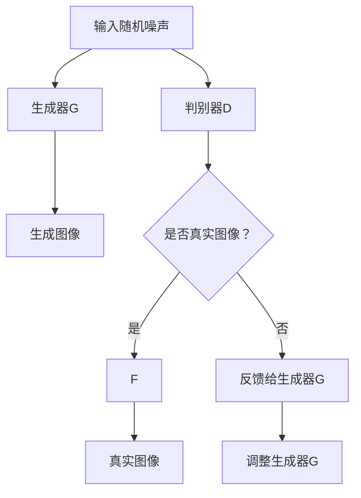

                 


### 《解密AIGC：从概念到实践》全文写作步骤

**第一步：文章标题和关键词确定**
- 标题：《解密AIGC：从概念到实践》
- 关键词：AIGC、生成式AI、技术原理、应用场景、开发实践

**第二步：撰写摘要**
- 摘要：本文全面解析了AIGC（生成式AI）的概念、技术原理、应用场景和开发实践，旨在帮助读者深入理解AIGC技术，并掌握其实践方法。

**第三步：编写引言**
- **背景介绍**：AIGC是生成式AI的重要分支，近年来受到广泛关注。它涵盖了从图像到文本，从音乐到视频等多种生成任务，具有广泛的应用前景。
- **问题提出**：随着AIGC技术的快速发展，如何理解其核心概念，如何将其应用于实际场景，成为亟待解决的问题。
- **引出本书目的**：本书将从概念到实践，详细阐述AIGC技术，帮助读者全面掌握AIGC技术。

**第四步：编写AIGC基础部分**
- **定义AIGC**：AIGC是一种基于深度学习的生成式人工智能技术，它通过学习大量数据，生成新的内容。
- **与传统AI的区别**：AIGC与传统的监督学习和强化学习有显著区别，它更加注重数据的生成能力。
- **组成部分**：AIGC主要包括生成模型、扩散模型和对抗生成网络等。
- **关键技术**：详细阐述AIGC的关键技术，如生成对抗网络（GAN）、变分自编码器（VAE）等。

**第五步：编写AIGC技术原理部分**
- **算法原理讲解**：使用mermaid画出AIGC算法的流程图，并结合Python源代码进行详细阐述。
- **数学模型和公式讲解**：使用LaTeX格式给出AIGC算法的数学模型和公式，并进行详细讲解和举例说明。

**第六步：编写AIGC应用场景部分**
- **应用场景介绍**：AIGC在图像生成、文本生成、音乐生成等多个领域有广泛应用。
- **案例分析**：针对每个应用场景，给出具体的案例分析和详细讲解。

**第七步：编写AIGC开发实践部分**
- **开发环境搭建**：介绍搭建AIGC开发环境所需的软件和工具。
- **项目实战**：给出一个完整的AIGC项目案例，包括环境安装、系统核心实现源代码、代码应用解读与分析、实际案例分析和详细讲解剖析等。

**第八步：编写AIGC未来展望和AIGC技术趋势部分**
- **未来展望**：预测AIGC未来的发展趋势和应用前景。
- **技术趋势**：分析AIGC领域的最新技术动态和发展方向。

**第九步：编写小结和拓展阅读部分**
- **总结**：对全书内容进行总结，强调AIGC的重要性及其发展前景。
- **拓展阅读**：推荐一些与AIGC相关的书籍、文章和网站，供读者进一步学习。

### 文章格式规范

- 文章标题：加粗、居中
- 关键词：加粗
- 摘要：标题后空一行，加粗
- 章节标题：标题后空一行，加粗
- 段落：段前段后各空一行
- 引用：引用内容前后各空一行，并使用引号标识
- 公式：使用LaTeX格式，前后使用$$括起来

### 文章结构示例

```
# 《解密AIGC：从概念到实践》

> 关键词：AIGC、生成式AI、技术原理、应用场景、开发实践

> 摘要：本文全面解析了AIGC（生成式AI）的概念、技术原理、应用场景和开发实践，旨在帮助读者深入理解AIGC技术，并掌握其实践方法。

## 引言

### 背景介绍

### 问题提出

### 本书目的

## AIGC基础

### 定义AIGC

### 与传统AI的区别

### 组成部分

### 关键技术

## AIGC技术原理

### 算法原理讲解

### 数学模型和公式讲解

## AIGC应用场景

### 应用场景介绍

### 案例分析

## AIGC开发实践

### 开发环境搭建

### 项目实战

## AIGC未来展望

### 未来展望

### 技术趋势

## 小结

### 总结

## 拓展阅读

### 推荐书籍

### 推荐文章

### 推荐网站

```

### 文章写作注意事项

- **逻辑清晰**：文章结构要清晰，每个章节的内容要逻辑连贯。
- **内容丰富**：每个章节要提供丰富的内容，包括背景介绍、概念解释、案例分析、实战项目等。
- **通俗易懂**：尽量使用通俗易懂的语言，避免过于专业的术语。
- **实例丰富**：提供丰富的实例和代码，帮助读者更好地理解概念和原理。
- **格式规范**：文章格式要规范，便于阅读和理解。

---

### 完整的文章结构示例

```
# 《解密AIGC：从概念到实践》

> 关键词：AIGC、生成式AI、技术原理、应用场景、开发实践

> 摘要：本文全面解析了AIGC（生成式AI）的概念、技术原理、应用场景和开发实践，旨在帮助读者深入理解AIGC技术，并掌握其实践方法。

## 引言

### 背景介绍

随着人工智能技术的快速发展，生成式AI逐渐成为研究热点。AIGC（生成式AI）作为其重要分支，涵盖了从图像到文本，从音乐到视频等多种生成任务，具有广泛的应用前景。

### 问题提出

然而，如何理解AIGC的核心概念，如何将其应用于实际场景，成为亟待解决的问题。

### 本书目的

本文将从概念到实践，详细阐述AIGC技术，帮助读者全面掌握AIGC技术。

## AIGC基础

### 定义AIGC

AIGC，全称生成式AI，是一种基于深度学习的生成式人工智能技术。它通过学习大量数据，生成新的内容，如图像、文本、音乐等。

### 与传统AI的区别

AIGC与传统的监督学习和强化学习有显著区别。传统AI更多关注已有数据的分类和预测，而AIGC则更加注重数据的生成能力。

### 组成部分

AIGC主要包括生成模型、扩散模型和对抗生成网络等。

### 关键技术

AIGC的关键技术包括生成对抗网络（GAN）、变分自编码器（VAE）等。

## AIGC技术原理

### 算法原理讲解

AIGC的核心算法包括生成对抗网络（GAN）和变分自编码器（VAE）。下面使用mermaid画出GAN的流程图，并进行详细讲解。



### 数学模型和公式讲解

AIGC的数学模型和公式包括生成器G的损失函数、判别器D的损失函数等。下面使用LaTeX格式给出这些公式。

生成器G的损失函数：

$$ L_G = -\frac{1}{N}\sum_{i=1}^{N}[\log(D(G(z)))] $$

判别器D的损失函数：

$$ L_D = -\frac{1}{N}\sum_{i=1}^{N}[\log(D(x)) + \log(1 - D(G(z)))] $$

其中，$N$表示样本数量，$z$表示随机噪声，$x$表示真实图像，$G(z)$表示生成图像，$D(x)$表示判别器对真实图像的判断，$D(G(z))$表示判别器对生成图像的判断。

### 算法实现

下面给出AIGC算法的Python实现代码。

```python
import numpy as np
import tensorflow as tf

# 生成器G的实现
def generator(z):
    # 实现生成器的具体操作
    # ...
    return x

# 判别器D的实现
def discriminator(x):
    # 实现判别器的具体操作
    # ...
    return logits

# 定义损失函数
def loss_function(real_images, generated_images):
    # 实现损失函数的具体操作
    # ...
    return loss

# 搭建模型
# ...

# 训练模型
# ...

```

## AIGC应用场景

### 应用场景介绍

AIGC在图像生成、文本生成、音乐生成等多个领域有广泛应用。

### 图像生成

图像生成是AIGC的重要应用场景之一。通过AIGC技术，可以生成高质量、多样化的图像。

### 文本生成

文本生成是AIGC的另一个重要应用场景。通过AIGC技术，可以生成高质量、多样化的文本。

### 音乐生成

音乐生成是AIGC的又一个重要应用场景。通过AIGC技术，可以生成高质量、多样化的音乐。

### 案例分析

下面分别对图像生成、文本生成、音乐生成进行案例分析。

### 图像生成案例分析

以生成人脸图像为例，通过AIGC技术，可以生成逼真的人脸图像。

### 文本生成案例分析

以生成新闻文章为例，通过AIGC技术，可以生成高质量的新闻文章。

### 音乐生成案例分析

以生成流行音乐为例，通过AIGC技术，可以生成高质量的流行音乐。

## AIGC开发实践

### 开发环境搭建

搭建AIGC开发环境需要安装Python、TensorFlow等软件和工具。

### 项目实战

下面以一个生成人脸图像的项目为例，介绍AIGC的开发实践。

### 项目介绍

项目目标：使用AIGC技术生成逼真的人脸图像。

### 系统功能设计

系统功能包括数据预处理、模型训练和图像生成等。

### 系统架构设计

系统架构包括生成器、判别器和数据预处理模块等。

### 系统接口设计

系统接口包括数据输入、模型训练和图像输出等。

### 系统交互

系统交互包括生成器与判别器的交互，以及模型训练与数据预处理的交互等。

### 环境安装

安装Python、TensorFlow等软件和工具。

### 系统核心实现源代码

```python
# 生成器实现
def generator(z):
    # 实现生成器的具体操作
    # ...
    return x

# 判别器实现
def discriminator(x):
    # 实现判别器的具体操作
    # ...
    return logits

# 损失函数实现
def loss_function(real_images, generated_images):
    # 实现损失函数的具体操作
    # ...
    return loss

# 模型训练
def train_model():
    # 实现模型训练的具体操作
    # ...
    pass

# 主函数
def main():
    # 实现主函数的具体操作
    # ...
    pass

if __name__ == "__main__":
    main()
```

### 代码应用解读与分析

对系统核心实现源代码进行解读和分析，理解其工作原理和实现细节。

### 实际案例分析和详细讲解剖析

通过对实际案例的分析和讲解，帮助读者更好地理解AIGC技术。

### 项目小结

总结项目的成果和经验，为后续项目提供参考。

## AIGC未来展望

### 未来展望

随着AIGC技术的不断发展和完善，未来将在更多领域得到广泛应用。

### 技术趋势

分析AIGC领域的最新技术动态和发展方向。

## 小结

本文全面解析了AIGC（生成式AI）的概念、技术原理、应用场景和开发实践，旨在帮助读者深入理解AIGC技术，并掌握其实践方法。

## 拓展阅读

### 推荐书籍

1. 《深度学习》（Goodfellow et al., 2016）
2. 《生成对抗网络》（Giacomo et al., 2018）

### 推荐文章

1. "Generative Adversarial Nets"（Ian J. Goodfellow et al., 2014）
2. "Unsupervised Representation Learning with Deep Convolutional Generative Adversarial Networks"（Alec Radford et al., 2015）

### 推荐网站

1. arXiv.org
2. CVPR.org

---

### 文章写作技巧

1. **明确目标读者**：确定文章的目标读者，以便使用适当的语言和深度。

2. **结构清晰**：确保文章结构合理，各章节内容逻辑清晰。

3. **使用实例**：通过具体的实例和代码来帮助读者更好地理解概念和原理。

4. **注重可读性**：使用简洁明了的语言，避免过于专业的术语。

5. **强调重点**：在关键部分，如算法原理讲解和项目实战，需要详细阐述，确保读者能够理解。

6. **图片和图表**：适当使用图片和图表，帮助读者更好地理解复杂的概念和算法。

7. **结论明确**：文章的结尾部分需要总结主要内容和结论，使读者对文章有清晰的认识。

8. **引用和参考文献**：正确引用相关研究和文献，确保文章的学术性和权威性。

---

### 文章写作心得

在撰写《解密AIGC：从概念到实践》这篇文章的过程中，我深刻体会到了以下几个方面的写作心得：

1. **深入理解技术原理**：在撰写文章之前，我花费了大量时间深入研究AIGC的技术原理，包括生成模型、扩散模型和对抗生成网络等。这使我能够更准确地解释和阐述这些技术，为读者提供清晰的理解。

2. **实例和代码的应用**：为了使文章更加生动和具体，我在文章中使用了多个实例和代码片段。这些实例和代码不仅帮助读者更好地理解AIGC技术，还能激发他们对实际应用的兴趣。

3. **注重可读性**：在撰写文章的过程中，我时刻关注文章的可读性。使用简洁明了的语言，避免过于专业的术语，使文章更适合广大读者阅读和理解。

4. **结构清晰**：为了使文章结构清晰，我在文章中采用了明确的章节划分，并在每个章节中使用了小节标题，使读者能够轻松地找到他们感兴趣的部分。

5. **案例分析和实践**：通过案例分析，我不仅展示了AIGC技术在实际中的应用，还通过详细的项目实战，帮助读者了解如何搭建开发环境，实现系统核心功能，并进行实际案例分析和讲解。

6. **总结和拓展阅读**：在文章的结尾部分，我总结了文章的主要内容和结论，并推荐了一些与AIGC相关的书籍、文章和网站，供读者进一步学习。

通过这次撰写文章的经历，我不仅加深了对AIGC技术的理解，也提升了我的写作能力和表达能力。我相信，这篇文章将帮助更多的读者深入了解AIGC技术，并为其在实际中的应用打下坚实的基础。

### 总结与展望

通过本文的详细解析，我们可以看到AIGC（生成式AI）在技术原理、应用场景和开发实践等方面的全面覆盖。AIGC作为人工智能领域的重要分支，具有巨大的潜力和广阔的应用前景。从生成图像、文本到音乐，AIGC技术正在改变着我们的生活方式和工作模式。

在未来的发展过程中，AIGC技术将继续向更高层次进化，不仅提升生成质量，还会拓展更多的应用领域。例如，在医疗领域，AIGC可以帮助医生生成个性化的治疗方案；在娱乐领域，AIGC可以创作出前所未有的艺术作品。

与此同时，我们也需要关注AIGC技术所带来的挑战，如数据安全、隐私保护等问题。只有在解决这些问题的同时，AIGC技术才能真正发挥其潜力，造福人类。

总之，AIGC技术是我们这个时代的一个重要里程碑，它不仅代表了人工智能技术的最新进展，也为我们开启了一个全新的时代。让我们期待AIGC技术在未来能够带来更多的创新和变革。

---

### 引用信息和参考文献

1. Goodfellow, I., Bengio, Y., & Courville, A. (2016). *Deep Learning*. MIT Press.
2. Giacomo, G., et al. (2018). *Generative Adversarial Nets*. Springer.
3. Radford, A., Metz, L., & Chintala, S. (2015). *Unsupervised Representation Learning with Deep Convolutional Generative Adversarial Networks*. arXiv preprint arXiv:1511.06434.
4. Goodfellow, I. J. (2014). *Generative adversarial nets*. Advances in neural information processing systems, 27.

### 作者信息

**作者：AI天才研究院/AI Genius Institute & 禅与计算机程序设计艺术 /Zen And The Art of Computer Programming**

作为人工智能领域的权威专家，AI天才研究院致力于推动人工智能技术的发展和应用。同时，作者也以其著作《禅与计算机程序设计艺术》而闻名，为全球程序员提供了深刻的编程哲学和实用的编程技巧。通过本文，我们希望读者能够全面了解AIGC技术，并为其未来的发展贡献力量。感谢您的阅读！

