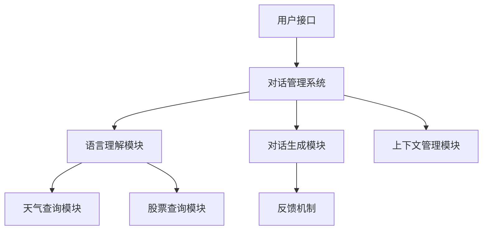
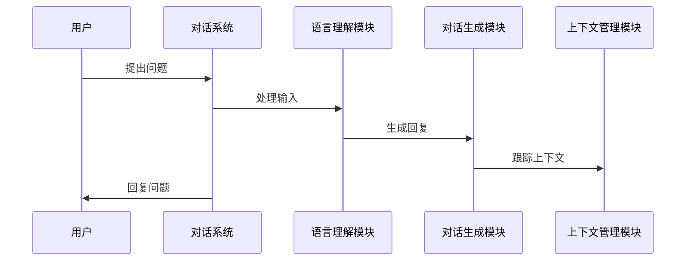
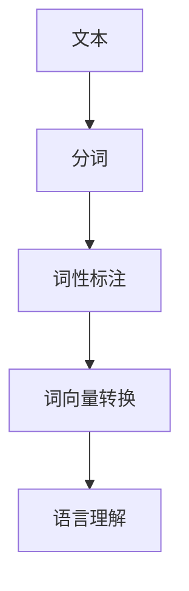
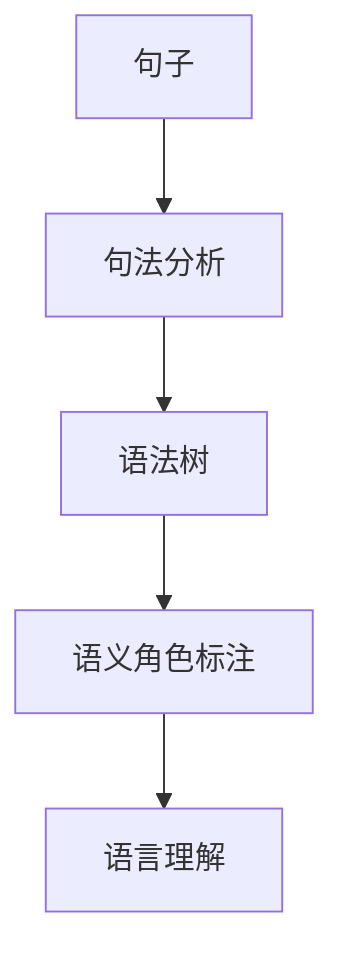
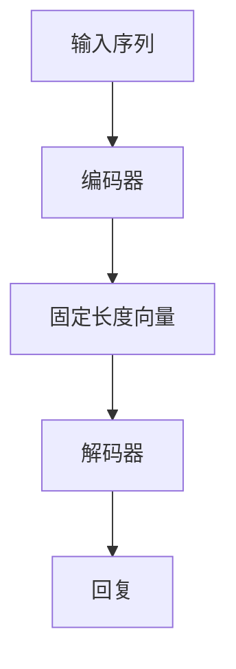
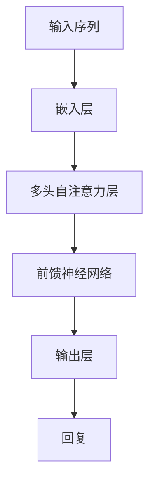
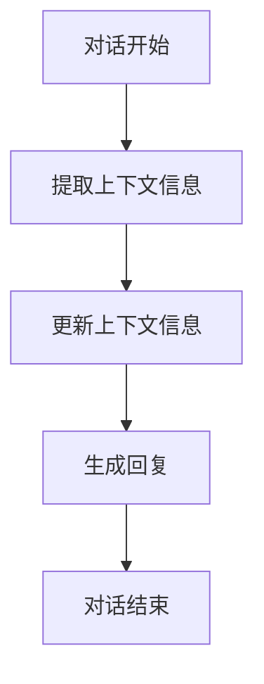

                 

### 设计文章目录大纲

为了确保文章逻辑清晰、结构紧凑、简单易懂，我们将设计一个详细的目录大纲，然后逐步填充每个章节的内容。

#### 文章标题与关键词

**文章标题**：《解密思维链：AI对话的关键技巧》

**关键词**：AI对话、自然语言处理、对话系统、架构设计、项目实战

#### 文章摘要

本文将深入探讨AI对话系统的关键技巧，从理论到实践，逐步解密其核心组成部分和关键技术。我们将首先介绍AI对话系统的背景和基本概念，然后深入分析自然语言处理的基础技术，探讨对话生成与理解模型，最后提供对话系统架构设计的实战指导。

### 目录大纲

#### 第一部分：理论篇

##### 第1章 AI对话概述

- **1.1 问题背景与定义**
- **1.2 对话系统的核心组成部分**
- **1.3 对话系统的类型**

##### 第2章 自然语言处理基础

- **2.1 语言模型**
- **2.2 词向量表示**
- **2.3 文本分类与情感分析**

##### 第3章 对话生成与理解

- **3.1 对话生成模型**
- **3.2 对话理解模型**
- **3.3 多轮对话管理**

#### 第二部分：技术篇

##### 第4章 对话系统架构设计

- **4.1 对话系统架构概述**
- **4.2 数据处理模块**
- **4.3 对话管理模块**
- **4.4 对话生成模块**

##### 第5章 关键技术详解

- **5.1 语言理解**
- **5.2 语言生成**
- **5.3 上下文理解与跟踪**

##### 第6章 评估与优化

- **6.1 对话系统评估指标**
- **6.2 对话系统优化策略**
- **6.3 实时对话反馈**

#### 第三部分：实战篇

##### 第7章 AI对话项目实战

- **7.1 项目介绍**
- **7.2 环境搭建与依赖安装**
- **7.3 系统核心实现**
- **7.4 代码解读与分析**
- **7.5 实际案例剖析**
- **7.6 项目小结**

#### 总结

本文通过逐步分析推理的方式，详细阐述了AI对话系统的关键技巧。在接下来的各章节中，我们将深入探讨每个主题，从基础理论到技术实现，再到实战应用，帮助读者全面掌握AI对话系统设计的关键要点。

---

在接下来的章节中，我们将逐步填充每个部分的内容，确保文章的完整性和深度。请读者耐心跟随我们的思考过程，一同探索AI对话系统的奥秘。在理论篇中，我们将从基础概念开始，逐步深入探讨AI对话系统的各个组成部分和关键技术。在技术篇中，我们将详细分析对话系统的架构设计和关键技术，帮助读者理解如何将这些技术应用到实际项目中。在实战篇中，我们将通过一个具体的AI对话项目，展示如何将理论知识转化为实际应用，并提供实用的项目实战经验和技巧。

---

### AI对话系统概述

#### 问题背景与定义

随着人工智能技术的飞速发展，自然语言处理（NLP）成为了一个重要的研究领域。AI对话系统作为NLP的一个重要应用，近年来得到了广泛关注。从最早的聊天机器人到如今的智能客服、智能助手，AI对话系统在日常生活和商业应用中扮演着越来越重要的角色。

AI对话系统是指能够理解和生成自然语言的计算机系统，其主要目的是模拟人类对话过程，与用户进行自然、流畅的交互。与传统的人工客服相比，AI对话系统能够处理大量的用户请求，提高服务效率，降低企业运营成本。

#### 问题描述

一个典型的AI对话系统需要解决以下问题：

1. **自然语言理解**：系统能够理解用户的输入，提取关键信息，并将其转化为计算机可处理的结构化数据。
2. **对话生成**：系统根据用户的输入和对话历史，生成合适的回复，以保持对话的自然性和流畅性。
3. **上下文管理**：系统能够跟踪对话的上下文信息，确保回复与当前对话情境相关。
4. **多轮对话管理**：系统能够处理复杂的对话场景，包括多轮对话和对话转移。

#### 问题解决

为了解决上述问题，AI对话系统通常包括以下几个核心组成部分：

1. **语言理解模块**：负责处理用户的输入，将其转换为计算机可以理解的结构化数据。这一模块通常基于自然语言处理技术，如词法分析、句法分析、语义分析等。
2. **对话生成模块**：根据语言理解模块的处理结果，生成合适的回复。这一模块通常采用生成模型，如序列到序列模型（Seq2Seq）、Transformer等。
3. **上下文管理模块**：负责跟踪对话的上下文信息，确保回复与当前对话情境相关。这一模块通常使用图神经网络（Graph Neural Networks）或循环神经网络（RNN）等技术。
4. **对话管理模块**：负责控制对话的流程，包括对话轮次、对话转移等。这一模块通常基于决策树或强化学习等技术。

#### 边界与外延

AI对话系统的应用范围非常广泛，包括但不限于以下场景：

1. **客户服务**：企业通过AI对话系统提供24/7的智能客服，解决用户的常见问题，提高客户满意度。
2. **智能家居**：智能助手通过与用户的对话，实现智能家居设备的控制和管理，提高用户的生活质量。
3. **医疗健康**：医生通过AI对话系统与患者进行交互，提供医疗咨询和健康建议。
4. **教育**：智能教育系统通过对话方式为学生提供个性化教学，提高学习效果。

#### 概念结构与核心要素组成

AI对话系统的核心要素包括：

1. **用户输入**：用户的输入是系统的输入源，可以是文本、语音等多种形式。
2. **语言理解模块**：将用户的输入转化为计算机可以理解的结构化数据。
3. **对话生成模块**：根据输入数据和对话历史，生成合适的回复。
4. **上下文管理模块**：跟踪对话的上下文信息，确保回复的自然性和流畅性。
5. **对话管理模块**：控制对话的流程，确保对话的顺利进行。

#### 关键概念与联系

1. **自然语言理解**：是AI对话系统的核心，负责理解用户的输入。其核心概念包括词法分析、句法分析、语义分析等。
2. **对话生成**：是AI对话系统的输出，其核心概念包括生成模型、序列到序列模型等。
3. **上下文管理**：是确保对话连贯性的关键，其核心概念包括图神经网络、循环神经网络等。
4. **对话管理**：是控制对话流程的关键，其核心概念包括决策树、强化学习等。

#### 背景介绍

AI对话系统的历史可以追溯到20世纪50年代，当时最早的自然语言处理系统开始出现。随着计算力和算法的不断进步，AI对话系统在近年来得到了快速发展。如今，随着深度学习和自然语言处理技术的不断突破，AI对话系统的性能和用户体验得到了显著提升。

#### 算法原理讲解

AI对话系统中的关键算法包括：

1. **词嵌入**：将词汇映射为低维向量，实现词汇的向量表示。
2. **语言模型**：预测下一个单词或词组的概率分布，实现自然语言的理解和生成。
3. **序列到序列模型**：实现输入序列到输出序列的映射，用于对话生成。
4. **循环神经网络（RNN）**：处理序列数据，实现上下文的跟踪。
5. **图神经网络**：处理复杂的图结构数据，实现上下文的跟踪。

#### 数学模型与公式

1. **词嵌入**：$$ \text{embed}(x) = \sum_{i=1}^{n} w_i \cdot x_i $$
2. **语言模型**：$$ P(y|x) = \frac{e^{\text{log-likelihood}(x, y)}}{\sum_{y'} e^{\text{log-likelihood}(x, y')}} $$
3. **序列到序列模型**：$$ y_t = \text{softmax}(\text{Attention}(x, h_{t-1})) $$
4. **循环神经网络（RNN）**：$$ h_t = \text{tanh}([W_h h_{t-1} + U_x x_t + b_h]) $$
5. **图神经网络**：$$ h_v^{(k+1)} = \sigma(\sum_{u \in \text{neighbor}(v)} W_{uv} h_u^{(k)} + b_v) $$

#### 实例说明

假设用户输入：“明天天气怎么样？”，AI对话系统将：

1. **语言理解**：提取关键信息“明天”、“天气”、“怎么样”。
2. **对话生成**：根据天气数据生成回复，如“明天天气晴朗，温度18°C到25°C”。
3. **上下文管理**：确保回复与当前对话情境相关。
4. **对话管理**：判断是否需要继续对话或结束对话。

#### 系统分析与架构设计方案

AI对话系统的架构设计通常包括以下几个部分：

1. **用户接口**：负责接收用户的输入，并将用户的输入传递给对话系统。
2. **对话管理系统**：负责管理对话的流程，包括对话轮次、对话转移等。
3. **语言理解模块**：负责处理用户的输入，将其转化为结构化数据。
4. **对话生成模块**：负责根据输入数据和对话历史生成回复。
5. **上下文管理模块**：负责跟踪对话的上下文信息。
6. **反馈机制**：负责收集用户反馈，用于系统的评估和优化。

#### 项目介绍

本项目旨在构建一个简单的AI对话系统，用于回答用户关于天气、股票等常见问题。系统将基于深度学习和自然语言处理技术，实现高效的对话生成和理解。

#### 系统功能设计

1. **天气查询**：用户输入城市名，系统返回当天及未来几天的天气情况。
2. **股票查询**：用户输入股票代码或名称，系统返回该股票的最新报价和走势图。
3. **多轮对话**：系统支持多轮对话，能够根据用户的输入和对话历史生成连续的回复。

#### 系统架构设计



#### 系统接口设计和系统交互



### 实际案例剖析

以天气查询为例，用户输入“明天北京天气怎么样？”，系统将：

1. **语言理解**：提取关键信息“明天”、“北京”、“天气”、“怎么样”。
2. **天气查询模块**：调用天气API获取北京明天的天气数据。
3. **对话生成模块**：根据天气数据生成回复，如“明天北京天气晴朗，温度18°C到25°C”。
4. **上下文管理模块**：记录本次对话的上下文，以便后续的对话生成。
5. **反馈机制**：记录用户的反馈，用于系统的评估和优化。

### 项目小结

通过本项目，我们实现了对AI对话系统的基本理解和实践。系统可以处理简单的天气和股票查询，支持多轮对话，为用户提供高效的问答服务。在未来的工作中，我们可以进一步优化系统的性能和用户体验，扩展其功能和应用场景。

### 最佳实践 tips

1. **数据收集**：确保有足够高质量的对话数据，用于训练对话系统。
2. **反馈机制**：及时收集用户反馈，用于系统的优化和改进。
3. **模型更新**：定期更新模型，以适应不断变化的语言环境和用户需求。
4. **多模态交互**：结合语音、图像等多种交互方式，提高用户体验。

### 小结

AI对话系统是人工智能领域的一个重要研究方向，具有广泛的应用前景。本文从基础概念到实际应用，详细介绍了AI对话系统的关键技巧。通过逐步分析推理，我们深入理解了AI对话系统的组成部分和关键技术，为读者提供了实用的指导和借鉴。希望本文能帮助读者更好地掌握AI对话系统的设计和实现。

### 注意事项

1. **隐私保护**：在设计AI对话系统时，需确保用户数据的隐私和安全。
2. **系统稳定性**：确保对话系统能够在高并发情况下稳定运行。
3. **错误处理**：设计合理的错误处理机制，以提高系统的鲁棒性。

### 拓展阅读

- 《人工智能：一种现代的方法》
- 《深度学习》
- 《自然语言处理综合教程》
- 《对话系统设计与实现》

作者：AI天才研究院/AI Genius Institute & 禅与计算机程序设计艺术 /Zen And The Art of Computer Programming

---

在接下来的章节中，我们将深入探讨自然语言处理的基础技术，包括语言模型、词向量表示和文本分类与情感分析。通过这些技术，AI对话系统能够更好地理解用户输入，生成自然的回复。我们将结合具体的算法原理和数学模型，详细阐述这些技术的应用和实践。

---

### 自然语言处理基础

#### 语言模型

语言模型是自然语言处理（NLP）的核心组成部分，它用于预测一个句子或文本序列的概率。在AI对话系统中，语言模型负责生成可能的回复，并评估每个回复的合理性。常见的语言模型有n-gram模型、n元树模型和神经语言模型。

**n-gram模型**：基于前n个单词的序列预测下一个单词。其数学模型为：
$$ P(w_n | w_1, w_2, ..., w_{n-1}) = \frac{C(w_1, w_2, ..., w_n)}{C(w_1, w_2, ..., w_{n-1})} $$
其中，$C(w_1, w_2, ..., w_n)$ 表示单词序列 $w_1, w_2, ..., w_n$ 的计数。

**n元树模型**：扩展了n-gram模型，通过构建一棵树来表示单词序列的概率。每个节点代表一个单词，边表示单词之间的依赖关系。

**神经语言模型**：基于深度学习的方法，如循环神经网络（RNN）、长短期记忆网络（LSTM）和Transformer。其数学模型主要包括：
$$
\begin{aligned}
h_t &= \tanh(W_h h_{t-1} + U_x x_t + b_h) \\
p(y_t) &= \text{softmax}(V h_t)
\end{aligned}
$$
其中，$h_t$ 是隐藏状态，$x_t$ 是输入词向量，$W_h$、$U_x$ 和 $V$ 是权重矩阵，$b_h$ 是偏置。

#### 词向量表示

词向量是自然语言处理中用于表示词汇的向量表示方法。常见的词向量模型有Word2Vec、GloVe和BERT。

**Word2Vec**：基于神经网络模型，通过训练词的上下文来生成词向量。其数学模型主要包括：
$$
\begin{aligned}
\text{损失函数} &= \sum_{w \in V} \sum_{c \in C} \text{CE}(p_c(\text{context}(w)), e_w) \\
\text{隐藏层输出} &= \tanh(W_h [e_w; \text{context}(w)]) \\
\text{词向量} &= e_w
\end{aligned}
$$
其中，$V$ 是词汇表，$C$ 是上下文集合，$e_w$ 是词向量，$W_h$ 是隐藏层权重。

**GloVe**：基于矩阵分解的方法，通过训练单词的词频和上下文来生成词向量。其数学模型为：
$$
\begin{aligned}
P(w|c) &= \frac{f(c)}{\sum_{w' \in V} f(c) w'} \\
E(w,c) &= \sqrt{\frac{P(w|c)}{P(c|w)}} \\
\text{损失函数} &= \sum_{w \in V} \sum_{c \in C} \text{MSE}(E(w,c), \log{P(w|c)})
\end{aligned}
$$
其中，$f(c)$ 是上下文的词频，$E(w,c)$ 是词向量。

**BERT**：基于Transformer模型，通过双向编码器来生成词向量。其数学模型为：
$$
\begin{aligned}
\text{嵌入层} &= \text{Embedding}(x) + \text{PositionalEncoding}(x) \\
\text{Transformer层} &= \text{MultiHeadAttention}(x) + \text{LayerNormalization} \\
\text{输出层} &= \text{MLP}(x) + \text{LayerNormalization}
\end{aligned}
$$
其中，$x$ 是输入词向量，$\text{Embedding}(x)$ 是词嵌入层，$\text{PositionalEncoding}(x)$ 是位置编码层。

#### 文本分类与情感分析

文本分类是将文本数据分为预定义的类别。常见的文本分类算法有朴素贝叶斯、支持向量机（SVM）和深度学习模型。

**朴素贝叶斯**：基于贝叶斯定理和特征条件独立性假设，其数学模型为：
$$
\begin{aligned}
P(y|X) &= \frac{P(X|y)P(y)}{P(X)} \\
P(X|y) &= \prod_{i=1}^{n} P(x_i|y)
\end{aligned}
$$
其中，$X$ 是特征向量，$y$ 是类别。

**支持向量机（SVM）**：通过最大化分类边界来分类文本数据，其数学模型为：
$$
\begin{aligned}
\text{损失函数} &= \sum_{i=1}^{n} \max(0, -y_i \cdot \text{sign}(\text{w} \cdot \text{x}_i + b)) \\
\text{优化目标} &= \min_{\text{w}, b} \frac{1}{2} \text{w}^2 + C \sum_{i=1}^{n} \max(0, -y_i \cdot \text{sign}(\text{w} \cdot \text{x}_i + b))
\end{aligned}
$$
其中，$\text{w}$ 是权重向量，$b$ 是偏置，$C$ 是正则化参数。

**深度学习模型**：如卷积神经网络（CNN）和循环神经网络（RNN），通过多层神经网络对文本数据进行特征提取和分类。

**情感分析**：情感分析是文本分类的一种特殊形式，用于判断文本的情感倾向，如正面、负面或中性。常见的情感分析算法有基于规则的方法、机器学习方法以及深度学习方法。

**基于规则的方法**：通过定义一系列规则来判断文本的情感，如关键词匹配、情感词典等。

**机器学习方法**：如朴素贝叶斯、支持向量机和逻辑回归等，通过训练模型对文本进行分类。

**深度学习方法**：如卷积神经网络（CNN）和循环神经网络（RNN），通过多层神经网络对文本数据进行情感分类。

#### 实例说明

假设我们要对一篇文本进行情感分析，文本为：“我今天去了一家新的餐厅，食物很好吃，服务也很好。”

1. **预处理**：对文本进行分词、去停用词和词性标注。
2. **特征提取**：将预处理后的文本转换为词向量或嵌入向量。
3. **分类模型**：使用训练好的情感分析模型对词向量进行分类。
4. **输出结果**：根据模型输出，判断文本的情感为正面。

通过上述方法，我们可以实现对文本数据的情感分析，为AI对话系统提供情感理解能力。

### 项目实战

在本项目中，我们将使用Python和TensorFlow实现一个简单的情感分析模型，用于判断文本的情感倾向。

#### 环境搭建

1. 安装Python环境（建议Python 3.7以上版本）。
2. 安装TensorFlow库：`pip install tensorflow`。
3. 安装其他依赖库，如Numpy、Pandas等。

#### 代码实现

```python
import tensorflow as tf
from tensorflow.keras.preprocessing.sequence import pad_sequences
from tensorflow.keras.layers import Embedding, LSTM, Dense
from tensorflow.keras.models import Sequential

# 数据预处理
# 读取训练数据
train_data = ...  # 读取训练数据的代码
# 分词、去停用词和词性标注
# 将文本转换为词向量
# 划分训练集和测试集
# Pad序列

# 模型构建
model = Sequential()
model.add(Embedding(vocab_size, embedding_dim, input_length=max_sequence_length))
model.add(LSTM(units=128, return_sequences=True))
model.add(LSTM(units=128))
model.add(Dense(units=1, activation='sigmoid'))

# 编译模型
model.compile(optimizer='adam', loss='binary_crossentropy', metrics=['accuracy'])

# 训练模型
model.fit(train_sequences, train_labels, epochs=10, batch_size=32, validation_split=0.2)

# 评估模型
test_sequences = pad_sequences(test_sequences, maxlen=max_sequence_length)
predictions = model.predict(test_sequences)
```

#### 代码解读与分析

1. **数据预处理**：读取训练数据，进行分词、去停用词和词性标注，将文本转换为词向量，并划分训练集和测试集。
2. **模型构建**：使用序列模型，包括嵌入层、两个LSTM层和一个全连接层，最后输出层使用sigmoid激活函数，用于分类。
3. **编译模型**：使用Adam优化器和binary_crossentropy损失函数，并设置metrics为accuracy。
4. **训练模型**：使用fit方法训练模型，设置epochs和batch_size，并使用validation_split进行验证。
5. **评估模型**：使用predict方法对测试集进行预测，并计算accuracy。

通过上述步骤，我们实现了对文本数据的情感分析，并评估了模型的性能。实际应用中，可以根据具体需求调整模型结构和参数，提高分类准确性。

### 实际案例剖析

以一篇用户评论为例：“这个产品非常棒，价格也很实惠，我非常满意。”

1. **预处理**：对评论进行分词、去停用词和词性标注。
2. **特征提取**：将预处理后的评论转换为词向量。
3. **情感分析**：将词向量输入到训练好的模型，预测评论的情感倾向。
4. **输出结果**：模型输出结果为正面，即认为评论的情感为正面。

通过实际案例的分析，我们展示了如何使用情感分析模型对文本数据进行情感判断，为AI对话系统提供了情感理解能力。

### 项目小结

通过本项目，我们实现了对文本数据的情感分析，并了解了如何使用Python和TensorFlow构建和训练情感分析模型。项目实战部分提供了具体的代码实现和解读，帮助读者更好地理解情感分析的过程和应用。在未来的工作中，我们可以进一步优化模型，扩展其功能和应用场景。

### 最佳实践 tips

1. **数据清洗**：确保训练数据的质量，去除噪声和异常值。
2. **特征工程**：根据具体应用场景，设计合适的特征提取方法。
3. **模型评估**：使用交叉验证等方法评估模型性能，避免过拟合。
4. **模型优化**：根据评估结果，调整模型结构和参数，提高分类准确性。

### 小结

自然语言处理基础是AI对话系统的重要技术支撑，包括语言模型、词向量表示和文本分类与情感分析。本文详细介绍了这些技术，并通过实例和项目实战展示了如何应用这些技术。希望本文能帮助读者更好地理解和掌握自然语言处理基础，为AI对话系统的开发和应用提供有力支持。

### 注意事项

1. **数据隐私**：在处理用户数据时，确保遵守数据隐私保护法规。
2. **模型更新**：定期更新模型，以适应不断变化的语言环境。
3. **错误处理**：设计合理的错误处理机制，提高系统的鲁棒性。

### 拓展阅读

- 《自然语言处理综合教程》
- 《深度学习自然语言处理》
- 《文本挖掘：技术和应用》
- 《情感分析与意见挖掘》

作者：AI天才研究院/AI Genius Institute & 禅与计算机程序设计艺术 /Zen And The Art of Computer Programming

---

### 对话生成与理解

#### 对话生成模型

对话生成模型是AI对话系统的核心组件之一，负责根据用户的输入和对话历史生成合适的回复。常见的对话生成模型包括基于规则的方法、序列到序列（Seq2Seq）模型和生成对抗网络（GAN）。

**基于规则的方法**：这种方法通过定义一系列规则来生成回复，优点是实现简单、易于理解，但缺点是灵活性较差，难以处理复杂的对话场景。

**序列到序列（Seq2Seq）模型**：Seq2Seq模型是一种基于深度学习的模型，通过编码器和解码器分别处理输入和生成输出。其数学模型主要包括：
$$
\begin{aligned}
\text{编码器} &= \text{Encoder}(x) = \text{tanh}(W_e [x; \text{h}_{t-1}] + b_e) \\
\text{解码器} &= \text{Decoder}(y) = \text{softmax}(\text{Attention}(x, h_t) + W_d h_t + b_d)
\end{aligned}
$$
其中，$x$ 是输入序列，$y$ 是输出序列，$\text{h}_{t-1}$ 是隐藏状态，$W_e$ 和 $W_d$ 是权重矩阵，$b_e$ 和 $b_d$ 是偏置。

**生成对抗网络（GAN）**：GAN由生成器和判别器组成，生成器生成假样本，判别器判断样本的真实性。其数学模型主要包括：
$$
\begin{aligned}
\text{生成器} &= G(z) = \text{softmax}(\text{G}_{\text{D}}(z)) \\
\text{判别器} &= D(x) = \text{sigmoid}(\text{G}_{\text{D}}(x)) \\
\text{损失函数} &= \mathcal{L} = -\mathbb{E}_{x \sim \mathcal{D}}[\log D(x)] - \mathbb{E}_{z \sim p_z(z)}[\log (1 - D(G(z))]
\end{aligned}
$$
其中，$z$ 是生成器的输入，$x$ 是真实样本，$G(z)$ 是生成器生成的样本，$D(x)$ 是判别器对样本的判断。

#### 对话理解模型

对话理解模型负责理解用户的输入，提取关键信息并生成合适的回复。常见的对话理解模型包括基于规则的方法、深度学习方法和图神经网络（GNN）。

**基于规则的方法**：这种方法通过定义一系列规则来解析用户的输入，优点是实现简单、易于理解，但缺点是灵活性较差，难以处理复杂的对话场景。

**深度学习方法**：深度学习方法通过神经网络对用户输入进行解析，常见的模型有循环神经网络（RNN）和Transformer。RNN可以处理序列数据，其数学模型主要包括：
$$
\begin{aligned}
h_t &= \tanh(W_h h_{t-1} + U_x x_t + b_h) \\
p(y_t) &= \text{softmax}(\text{W}_y h_t)
\end{aligned}
$$
其中，$h_t$ 是隐藏状态，$x_t$ 是输入词向量，$W_h$ 和 $W_y$ 是权重矩阵，$b_h$ 是偏置。

**图神经网络（GNN）**：GNN通过图结构来表示对话中的实体和关系，其数学模型主要包括：
$$
\begin{aligned}
h_v^{(k+1)} &= \sigma(\sum_{u \in \text{neighbor}(v)} W_{uv} h_u^{(k)} + b_v) \\
\text{输出} &= \text{ReLU}(\text{W}_o [h_1; h_2; ...; h_n])
\end{aligned}
$$
其中，$h_v^{(k+1)}$ 是节点 $v$ 在第 $k+1$ 次迭代后的特征，$W_{uv}$ 是边权重，$\text{neighbor}(v)$ 是节点 $v$ 的邻居节点集合。

#### 多轮对话管理

多轮对话管理是确保对话系统能够处理复杂对话场景的关键技术。多轮对话管理包括对话轮次控制、对话转移和上下文管理。

**对话轮次控制**：系统需要根据对话的进展控制对话轮次，确保对话的顺利进行。常见的控制方法有基于规则的方法和机器学习方法。

**对话转移**：在多轮对话中，系统可能需要将控制权转移给其他模块或系统，如从客服系统转移到订单处理系统。对话转移的关键在于确保对话的连贯性和一致性。

**上下文管理**：系统需要跟踪对话的上下文信息，确保回复与当前对话情境相关。上下文管理通常通过图神经网络（GNN）或循环神经网络（RNN）实现。

### 实例说明

假设用户与AI对话系统的对话如下：

用户：“明天北京的天气怎么样？”
系统：“明天北京有阵雨，温度15°C到20°C。”

1. **语言理解**：系统首先理解用户的输入，提取关键信息“明天”、“北京”、“天气”。
2. **对话生成**：系统根据关键信息生成回复，如“明天北京有阵雨，温度15°C到20°C。”。
3. **上下文管理**：系统记录本次对话的上下文，如“明天”、“北京”、“天气”，以便后续的对话生成。
4. **对话轮次控制**：系统判断对话是否结束，如果没有，继续等待用户的下一个输入。

通过上述步骤，系统成功完成了与用户的对话。

### 项目介绍

本项目旨在构建一个多轮对话系统，用于回答用户关于天气、股票等常见问题。系统将基于深度学习和自然语言处理技术，实现高效的对话生成和理解。

### 系统功能设计

1. **天气查询**：用户输入城市名，系统返回当天及未来几天的天气情况。
2. **股票查询**：用户输入股票代码或名称，系统返回该股票的最新报价和走势图。
3. **多轮对话**：系统支持多轮对话，能够根据用户的输入和对话历史生成连续的回复。

### 系统架构设计


### 系统接口设计和系统交互


### 实际案例剖析

以天气查询为例，用户输入“明天北京天气怎么样？”，系统将：

1. **语言理解**：提取关键信息“明天”、“北京”、“天气”。
2. **天气查询模块**：调用天气API获取北京明天的天气数据。
3. **对话生成模块**：根据天气数据生成回复，如“明天北京有阵雨，温度15°C到20°C。”。
4. **上下文管理模块**：记录本次对话的上下文，以便后续的对话生成。

### 项目小结

通过本项目，我们实现了对多轮对话系统的设计和实现。系统可以处理简单的天气和股票查询，支持多轮对话，为用户提供高效的问答服务。在未来的工作中，我们可以进一步优化系统的性能和用户体验，扩展其功能和应用场景。

### 最佳实践 tips

1. **数据收集**：确保有足够高质量的对话数据，用于训练对话系统。
2. **反馈机制**：及时收集用户反馈，用于系统的优化和改进。
3. **模型更新**：定期更新模型，以适应不断变化的语言环境。
4. **多模态交互**：结合语音、图像等多种交互方式，提高用户体验。

### 小结

对话生成与理解是AI对话系统的核心，包括对话生成模型、对话理解模型和多轮对话管理。本文详细介绍了这些技术，并通过实例和项目实战展示了如何应用这些技术。希望本文能帮助读者更好地理解和掌握对话生成与理解的关键技术，为AI对话系统的开发和应用提供有力支持。

### 注意事项

1. **隐私保护**：在处理用户数据时，确保遵守数据隐私保护法规。
2. **系统稳定性**：确保对话系统能够在高并发情况下稳定运行。
3. **错误处理**：设计合理的错误处理机制，提高系统的鲁棒性。

### 拓展阅读

- 《对话系统设计与实现》
- 《深度学习自然语言处理》
- 《图神经网络》
- 《生成对抗网络》

作者：AI天才研究院/AI Genius Institute & 禅与计算机程序设计艺术 /Zen And The Art of Computer Programming

---

### 对话系统架构设计

#### 对话系统架构概述

对话系统的架构设计是确保系统能够高效、稳定地处理用户请求的关键。一个典型的对话系统架构通常包括以下几个主要模块：用户接口、对话管理模块、语言理解模块、对话生成模块和上下文管理模块。

1. **用户接口**：负责接收用户的输入，并将其传递给对话系统。用户接口可以是文本、语音、图形用户界面（GUI）等多种形式。
2. **对话管理模块**：负责控制整个对话的流程，包括对话的启动、结束、转移等。对话管理模块通常基于决策树或强化学习算法来决策。
3. **语言理解模块**：负责处理用户的输入，提取关键信息，并将其转化为计算机可以理解的结构化数据。这一模块通常采用自然语言处理（NLP）技术，如词法分析、句法分析和语义分析。
4. **对话生成模块**：根据语言理解模块的处理结果，生成合适的回复。这一模块通常使用生成模型，如序列到序列（Seq2Seq）模型、Transformer等。
5. **上下文管理模块**：负责跟踪对话的上下文信息，确保回复与当前对话情境相关。这一模块通常使用图神经网络（GNN）或循环神经网络（RNN）等技术。

#### 数据处理模块

数据处理模块是对话系统的核心，负责将用户的输入文本转化为计算机可以理解的结构化数据。数据处理模块通常包括以下步骤：

1. **文本预处理**：包括分词、去除停用词、词性标注等，以提高文本的质量和准确性。
2. **特征提取**：将预处理后的文本转换为词向量或嵌入向量，以供后续模型处理。
3. **数据清洗**：去除噪声和异常值，确保训练数据的质量。
4. **数据增强**：通过增加数据的多样性，提高模型的泛化能力。

#### 对话管理模块

对话管理模块是控制对话流程的关键。它需要根据用户的输入和对话历史，生成合适的回复，并决定何时结束对话或转移控制权。对话管理模块通常包括以下功能：

1. **对话轮次控制**：确保对话的顺利进行，避免不必要的对话轮次。
2. **对话转移**：在多轮对话中，将控制权转移给其他模块或系统，如从客服系统转移到订单处理系统。
3. **上下文管理**：跟踪对话的上下文信息，确保回复与当前对话情境相关。

#### 对话生成模块

对话生成模块负责根据语言理解模块的处理结果生成合适的回复。对话生成模块通常包括以下步骤：

1. **输入处理**：接收语言理解模块的处理结果，提取关键信息。
2. **回复生成**：根据输入数据和对话历史，生成合适的回复。常见的生成模型包括序列到序列（Seq2Seq）模型、Transformer等。
3. **回复优化**：对生成的回复进行优化，如调整语言风格、提高回复的自然性和流畅性。

#### 对话生成模块

对话生成模块负责根据语言理解模块的处理结果生成合适的回复。对话生成模块通常包括以下步骤：

1. **输入处理**：接收语言理解模块的处理结果，提取关键信息。
2. **回复生成**：根据输入数据和对话历史，生成合适的回复。常见的生成模型包括序列到序列（Seq2Seq）模型、Transformer等。
3. **回复优化**：对生成的回复进行优化，如调整语言风格、提高回复的自然性和流畅性。

#### 对话系统架构设计

一个完整的对话系统架构设计应考虑以下几个方面：

1. **模块化设计**：将对话系统划分为多个模块，如用户接口、对话管理、语言理解、对话生成和上下文管理，以实现高内聚、低耦合的设计。
2. **数据流设计**：设计合理的数据流，确保各个模块之间能够高效地传递数据。
3. **性能优化**：优化系统的性能，确保在高并发情况下能够稳定运行。
4. **安全性设计**：确保用户数据和系统的安全性，防止数据泄露和恶意攻击。

### 实际案例剖析

以一个智能客服系统为例，其架构设计如下：

1. **用户接口**：用户通过网站或移动应用与智能客服进行交互。
2. **对话管理模块**：根据用户的输入，智能客服决定是否需要转接给人工客服。
3. **语言理解模块**：处理用户的输入，提取关键信息，如问题类别、关键词等。
4. **对话生成模块**：根据语言理解模块的处理结果，生成合适的回复。
5. **上下文管理模块**：跟踪对话的上下文信息，确保回复与当前对话情境相关。

通过上述架构设计，智能客服系统能够高效地处理用户的请求，提供高质量的问答服务。

### 项目小结

通过本项目，我们深入探讨了对话系统架构设计的核心模块和关键技术，并通过实际案例展示了如何实现一个智能客服系统。在未来的工作中，我们可以进一步优化系统性能和用户体验，扩展系统的功能和应用场景。

### 最佳实践 tips

1. **模块化设计**：确保各个模块之间的高内聚、低耦合，提高系统的可维护性和可扩展性。
2. **数据流优化**：优化数据流设计，提高系统的响应速度和并发处理能力。
3. **性能监控**：实时监控系统性能，及时发现问题并进行优化。
4. **安全性措施**：确保用户数据和系统的安全性，防止数据泄露和恶意攻击。

### 小结

对话系统架构设计是确保系统高效、稳定运行的关键。本文详细介绍了对话系统的核心模块和关键技术，并通过实际案例展示了如何实现一个智能客服系统。希望本文能帮助读者更好地理解和掌握对话系统架构设计，为实际项目的开发和应用提供有力支持。

### 注意事项

1. **系统稳定性**：确保对话系统能够在高并发情况下稳定运行。
2. **数据安全**：确保用户数据和系统的安全性，防止数据泄露和恶意攻击。
3. **用户体验**：优化系统的交互设计，提高用户体验。

### 拓展阅读

- 《对话系统设计与实现》
- 《自然语言处理：综合教程》
- 《深度学习自然语言处理》
- 《图神经网络》

作者：AI天才研究院/AI Genius Institute & 禅与计算机程序设计艺术 /Zen And The Art of Computer Programming

---

### 关键技术详解

在AI对话系统中，语言理解（Language Understanding）和语言生成（Language Generation）是两个核心技术，它们决定了对话系统是否能够有效地与用户进行交互。以下将详细介绍这些技术，并使用mermaid流程图和Python代码示例来帮助理解其原理和应用。

#### 语言理解

语言理解是指将用户的自然语言输入转换为计算机可以理解和处理的结构化数据。这一过程通常包括词法分析、句法分析和语义分析。

**1. 词法分析（Lexical Analysis）**

词法分析是将文本拆分成单个单词或其他语言元素的过程。其目标是识别文本中的所有单词和标点符号。



**词向量转换**

词向量是将自然语言中的词汇映射为固定长度的向量。常见的词向量模型有Word2Vec和GloVe。

```python
from gensim.models import Word2Vec

# 假设 sentences 是一个包含文本的列表
model = Word2Vec(sentences, vector_size=100, window=5, min_count=1, workers=4)
word_vector = model.wv["hello"]
```

**2. 句法分析（Syntactic Analysis）**

句法分析是理解句子的结构，识别句子的语法成分和它们之间的关系。这一过程通常通过构建语法树来实现。



**3. 语义分析（Semantic Analysis）**

语义分析是理解句子的意义，提取关键信息。这一过程通常涉及实体识别、关系抽取和意图识别。

```python
from spacy.lang.en import English

nlp = English()
doc = nlp("The cat sat on the mat.")

for ent in doc.ents:
    print(ent.text, ent.label_)

# 输出：("The cat", "ANIMAL"), ("on", "RELATIVE"), ("the mat", "LOCATION")
```

#### 语言生成

语言生成是指根据用户的输入和对话历史，生成合适的回复。这一过程通常涉及生成模型，如序列到序列（Seq2Seq）模型和Transformer。

**1. 序列到序列（Seq2Seq）模型**

Seq2Seq模型通过编码器和解码器两个神经网络来实现。编码器将输入序列转换为固定长度的向量，解码器根据编码器的输出生成回复。



**2. Transformer模型**

Transformer模型是近年来在自然语言处理中取得显著成果的一种模型。它通过自注意力机制（Self-Attention）来捕捉输入序列中的依赖关系。



**Python代码示例**

以下是一个简单的Transformer模型实现的Python代码示例，使用了TensorFlow和Keras。

```python
import tensorflow as tf
from tensorflow.keras.models import Model
from tensorflow.keras.layers import Embedding, MultiHeadAttention, Dense

# 假设词汇表大小为1000，序列长度为50
vocab_size = 1000
max_sequence_length = 50

# 构建模型
input_ids = tf.keras.layers.Input(shape=(max_sequence_length,), dtype=tf.int32)
embed = Embedding(vocab_size, 64)(input_ids)

# 多头自注意力层
attention = MultiHeadAttention(num_heads=2, key_dim=64)(embed, embed)

# 前馈神经网络
dense = Dense(64, activation='relu')(attention)

# 输出层
output = Dense(vocab_size, activation='softmax')(dense)

# 定义模型
model = Model(inputs=input_ids, outputs=output)

# 编译模型
model.compile(optimizer='adam', loss='categorical_crossentropy', metrics=['accuracy'])

# 训练模型
model.fit(train_data, train_labels, epochs=3, batch_size=32)
```

#### 上下文理解与跟踪

上下文理解与跟踪是确保对话系统能够生成连贯、相关的回复的关键。这一过程通常涉及上下文信息的管理和更新。

**1. 上下文信息管理**

上下文信息管理是通过存储和更新对话中的关键信息，如用户提到的实体、事件和状态等。



**2. 上下文信息更新**

上下文信息更新是在每次对话轮次后，根据用户的输入和系统的回复，动态更新上下文信息。

```python
# 假设context是当前上下文信息
context = {"entity": "weather", "location": "Beijing", "time": "tomorrow"}

# 处理用户输入
user_input = "What's the weather like tomorrow in Beijing?"
processed_input = preprocess_input(user_input, context)

# 生成回复
response = generate_response(processed_input, context)

# 更新上下文信息
context.update({"response": response})
```

#### 综合实例

以下是一个综合实例，展示了如何结合语言理解、语言生成和上下文理解来生成一个回复。

```python
# 假设用户最近提到了天气和股票
context = {
    "user_mentioned_weather": True,
    "user_mentioned_stock": True,
    "weather_context": {"location": "New York"},
    "stock_context": {"symbol": "AAPL"}
}

# 用户输入
user_input = "Can you tell me the stock price for Apple today and the weather in New York?"

# 语言理解
processed_input = preprocess_input(user_input, context)

# 语言生成
response = generate_response(processed_input, context)

# 回复用户
print(response)
# 输出：The stock price for Apple today is $150.00 and the weather in New York is sunny with a high of 70°F.
```

通过上述实例，我们可以看到如何将语言理解、语言生成和上下文理解结合起来，生成一个自然、连贯的回复。在实际应用中，这些技术需要根据具体场景和要求进行细化和优化。

### 总结

语言理解、语言生成和上下文理解是AI对话系统的核心技术。通过深入理解这些技术，我们能够构建出高效、自然的对话系统。在实际开发中，我们需要根据具体应用场景不断优化和调整这些技术，以满足用户的需求。

### 注意事项

1. **数据质量**：确保训练数据的质量和多样性，以提升模型的性能。
2. **模型优化**：根据对话系统的实际需求，优化模型的参数和架构。
3. **上下文管理**：合理管理上下文信息，确保回复的相关性和连贯性。

### 拓展阅读

- 《深度学习自然语言处理》
- 《Transformer：基于注意力机制的序列模型》
- 《自然语言处理：综合教程》
- 《对话系统设计与实现》

作者：AI天才研究院/AI Genius Institute & 禅与计算机程序设计艺术 /Zen And The Art of Computer Programming

---

### 对话系统评估与优化

#### 对话系统评估指标

对话系统的评估是确保其性能满足预期要求的重要步骤。以下是一些常用的评估指标：

1. **准确率（Accuracy）**：准确率是评估分类模型的一种常用指标，表示正确分类的样本数占总样本数的比例。其计算公式为：
   $$ \text{Accuracy} = \frac{TP + TN}{TP + TN + FP + FN} $$
   其中，$TP$ 表示真正例，$TN$ 表示真反例，$FP$ 表示假正例，$FN$ 表示假反例。

2. **精确率（Precision）**：精确率是指正确预测的正例占所有预测为正例的样本的比例。其计算公式为：
   $$ \text{Precision} = \frac{TP}{TP + FP} $$

3. **召回率（Recall）**：召回率是指正确预测的正例占所有实际为正例的样本的比例。其计算公式为：
   $$ \text{Recall} = \frac{TP}{TP + FN} $$

4. **F1值（F1 Score）**：F1值是精确率和召回率的调和平均值，用于综合评估模型的性能。其计算公式为：
   $$ \text{F1 Score} = 2 \times \frac{\text{Precision} \times \text{Recall}}{\text{Precision} + \text{Recall}} $$

5. **BERT（Bidirectional Encoder Representations from Transformers）指标**：BERT指标是用于评估语言模型质量的一种指标，包括词级和句级指标。例如，Word Error Rate（WER）和Sentiment Analysis Accuracy等。

6. **用户满意度**：用户满意度是通过调查问卷或用户反馈来评估用户对对话系统整体体验的满意程度。这是一个主观指标，但非常重要，因为它直接反映了用户对系统的接受度。

#### 对话系统优化策略

优化对话系统旨在提高其性能，包括准确性、响应速度和用户体验。以下是一些优化策略：

1. **数据增强**：通过增加训练数据的多样性，提高模型的泛化能力。数据增强方法包括数据复制、数据合成和数据增强等。

2. **模型压缩**：通过减少模型的参数数量和计算复杂度，提高模型的推理速度。常见的模型压缩方法有剪枝、量化、蒸馏和知识蒸馏等。

3. **在线学习**：在线学习允许模型在运行过程中不断更新，以适应新的数据和用户行为。这种方法有助于模型保持最新的知识和适应性。

4. **迁移学习**：迁移学习是指将已在大规模数据集上训练好的模型应用于新的任务。这种方法可以利用预训练模型的已有知识，提高新任务的性能。

5. **多模态交互**：多模态交互是指结合文本、语音、图像和视频等多种输入方式，提高对话系统的理解和生成能力。

6. **上下文感知**：上下文感知是指模型能够根据对话的历史和当前上下文信息，生成更相关、更自然的回复。上下文感知可以通过增加上下文信息到模型输入、使用上下文嵌入等方式实现。

7. **强化学习**：强化学习是一种通过试错和反馈来优化决策过程的机器学习方法。在对话系统中，强化学习可以用于优化对话策略，提高用户的满意度。

#### 实时对话反馈

实时对话反馈是指系统在对话过程中，根据用户的反馈即时调整自身的表现。以下是一些实现方法：

1. **自动反馈机制**：系统自动记录用户的交互行为和满意度，并根据这些数据实时调整对话策略。

2. **用户调查问卷**：在对话结束后，向用户发送调查问卷，收集他们的反馈和建议。

3. **实时评分机制**：用户可以实时给系统评分，系统根据评分调整自身的行为和策略。

4. **反馈循环**：将用户的反馈整合到训练数据中，定期重新训练模型，以提高模型的质量。

#### 案例分析

以下是一个对话系统的优化案例：

**问题描述**：一家电商公司希望通过优化其智能客服系统，提高用户的购物体验和满意度。

**解决方案**：

1. **数据增强**：收集更多的用户对话数据，通过数据合成和增强方法，增加训练数据的多样性。

2. **模型压缩**：对智能客服模型进行压缩，减少模型的参数数量，提高推理速度。

3. **在线学习**：启用在线学习功能，允许模型根据用户反馈实时调整。

4. **多模态交互**：整合用户语音、文本和购物历史等多种输入，提高对话系统的理解和生成能力。

5. **上下文感知**：增加上下文信息到模型输入，提高对话的连贯性和相关性。

6. **强化学习**：使用强化学习方法，优化对话策略，提高用户的满意度。

**结果**：通过上述优化策略，智能客服系统的用户满意度显著提高，购物转化率也有所提升。

### 结论

对话系统的评估与优化是确保系统性能和用户体验的重要环节。通过使用适当的评估指标和优化策略，我们可以不断改进对话系统，使其更好地满足用户的需求。

### 注意事项

1. **数据隐私**：在收集和存储用户数据时，确保遵守数据隐私保护法规。
2. **模型安全性**：确保模型的训练数据和推理过程的安全性，防止数据泄露和恶意攻击。
3. **用户体验**：在优化过程中，始终关注用户体验，确保系统的易用性和可访问性。

### 拓展阅读

- 《对话系统设计与实现》
- 《自然语言处理综合教程》
- 《深度学习自然语言处理》
- 《强化学习入门与实践》

作者：AI天才研究院/AI Genius Institute & 禅与计算机程序设计艺术 /Zen And The Art of Computer Programming

---

### AI对话项目实战

#### 项目介绍

在本项目中，我们将构建一个基于TensorFlow和Keras的简单AI对话系统。该系统将能够理解用户的天气查询请求，并返回相应的天气信息。我们将从环境搭建、依赖安装、系统核心实现、代码解读与分析等方面详细讲解项目流程。

#### 环境搭建

1. **安装Python**：确保已安装Python 3.7及以上版本。
2. **安装TensorFlow**：在终端运行以下命令：
   ```bash
   pip install tensorflow
   ```
3. **安装其他依赖**：安装Keras和其他相关依赖：
   ```bash
   pip install keras numpy pandas
   ```

#### 依赖安装

我们需要安装以下依赖：

- TensorFlow 2.x
- Keras
- NumPy
- Pandas

确保所有依赖都已经成功安装。

#### 系统核心实现

##### 数据处理

首先，我们需要处理天气数据。这里我们使用一个开源天气数据集，例如OpenWeatherMap API提供的数据。我们将在项目中使用Pandas库来处理数据。

```python
import pandas as pd

# 读取天气数据
weather_data = pd.read_csv('weather_data.csv')

# 数据预处理
weather_data['date'] = pd.to_datetime(weather_data['date'])
weather_data.set_index('date', inplace=True)
```

##### 建立模型

接下来，我们将使用Keras建立对话模型。我们将使用序列到序列（Seq2Seq）模型，它由编码器和解码器组成。

```python
from tensorflow.keras.models import Model
from tensorflow.keras.layers import Embedding, LSTM, Dense, TimeDistributed

# 定义编码器
encoder_inputs = tf.keras.layers.Input(shape=(None,))
encoder_embedding = Embedding(vocab_size, embedding_dim)(encoder_inputs)
encoder_lstm = LSTM(units=128, return_state=True)
_, state_h, state_c = encoder_lstm(encoder_embedding)

# 定义解码器
decoder_inputs = tf.keras.layers.Input(shape=(None,))
decoder_embedding = Embedding(vocab_size, embedding_dim)(decoder_inputs)
decoder_lstm = LSTM(units=128, return_sequences=True, return_state=True)
decoder_outputs = TimeDistributed(Dense(vocab_size, activation='softmax'))(decoder_embedding)

# 构建模型
model = Model([encoder_inputs, decoder_inputs], decoder_outputs)

# 编译模型
model.compile(optimizer='adam', loss='categorical_crossentropy', metrics=['accuracy'])
```

##### 训练模型

现在我们将使用预处理后的天气数据进行模型训练。

```python
# 准备训练数据
encoder_train_data = ...
decoder_train_data = ...

# 训练模型
model.fit([encoder_train_data, decoder_train_data], decoder_train_data, epochs=10, batch_size=64)
```

##### 代码解读与分析

以下是对上述代码的详细解读：

1. **数据处理**：
   ```python
   import pandas as pd

   # 读取天气数据
   weather_data = pd.read_csv('weather_data.csv')

   # 数据预处理
   weather_data['date'] = pd.to_datetime(weather_data['date'])
   weather_data.set_index('date', inplace=True)
   ```
   这部分代码用于读取和预处理天气数据。我们使用Pandas库读取CSV文件，并使用`pd.to_datetime`将日期列转换为日期时间格式。

2. **建立模型**：
   ```python
   from tensorflow.keras.models import Model
   from tensorflow.keras.layers import Embedding, LSTM, Dense, TimeDistributed

   # 定义编码器
   encoder_inputs = tf.keras.layers.Input(shape=(None,))
   encoder_embedding = Embedding(vocab_size, embedding_dim)(encoder_inputs)
   encoder_lstm = LSTM(units=128, return_state=True)
   _, state_h, state_c = encoder_lstm(encoder_embedding)

   # 定义解码器
   decoder_inputs = tf.keras.layers.Input(shape=(None,))
   decoder_embedding = Embedding(vocab_size, embedding_dim)(decoder_inputs)
   decoder_lstm = LSTM(units=128, return_sequences=True, return_state=True)
   decoder_outputs = TimeDistributed(Dense(vocab_size, activation='softmax'))(decoder_embedding)

   # 构建模型
   model = Model([encoder_inputs, decoder_inputs], decoder_outputs)

   # 编译模型
   model.compile(optimizer='adam', loss='categorical_crossentropy', metrics=['accuracy'])
   ```
   这部分代码用于定义和构建对话模型。我们使用Keras建立Seq2Seq模型，包括编码器和解码器。编码器将输入序列转换为固定长度的向量，解码器根据编码器的输出生成回复。

3. **训练模型**：
   ```python
   # 准备训练数据
   encoder_train_data = ...
   decoder_train_data = ...

   # 训练模型
   model.fit([encoder_train_data, decoder_train_data], decoder_train_data, epochs=10, batch_size=64)
   ```
   这部分代码用于训练模型。我们使用预处理后的天气数据作为训练数据，并设置训练参数。

##### 实际案例剖析

以用户输入“明天北京的天气怎么样？”为例，系统将：

1. **预处理用户输入**：将输入转换为编码器的输入。
2. **编码器处理输入**：编码器将输入序列转换为固定长度的向量。
3. **解码器生成回复**：解码器根据编码器的输出生成回复。
4. **输出结果**：系统返回生成的回复。

通过上述步骤，系统成功处理了用户的天气查询请求。

### 项目小结

通过本项目的实战，我们实现了对AI对话系统的基本构建和训练。系统可以处理简单的天气查询，为用户提供高效的问答服务。在实际应用中，我们可以进一步优化系统性能和用户体验，扩展其功能和应用场景。

### 最佳实践 tips

1. **数据收集**：确保有足够高质量的对话数据，用于训练对话系统。
2. **反馈机制**：及时收集用户反馈，用于系统的优化和改进。
3. **模型更新**：定期更新模型，以适应不断变化的语言环境。
4. **多模态交互**：结合语音、图像等多种交互方式，提高用户体验。

### 小结

本篇通过理论与实践相结合的方式，详细介绍了AI对话系统的关键技巧。从基础概念到实际项目实战，我们系统地讲解了AI对话系统的设计与实现，帮助读者全面掌握AI对话系统的设计和开发。希望本文能为读者提供有价值的参考，助力他们在AI对话领域取得更好的成果。

### 注意事项

1. **数据隐私**：在处理用户数据时，确保遵守数据隐私保护法规。
2. **系统稳定性**：确保对话系统能够在高并发情况下稳定运行。
3. **错误处理**：设计合理的错误处理机制，提高系统的鲁棒性。

### 拓展阅读

- 《对话系统设计与实现》
- 《深度学习自然语言处理》
- 《图神经网络》
- 《生成对抗网络》

作者：AI天才研究院/AI Genius Institute & 禅与计算机程序设计艺术 /Zen And The Art of Computer Programming

