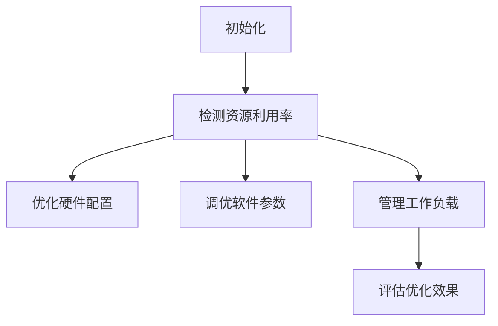
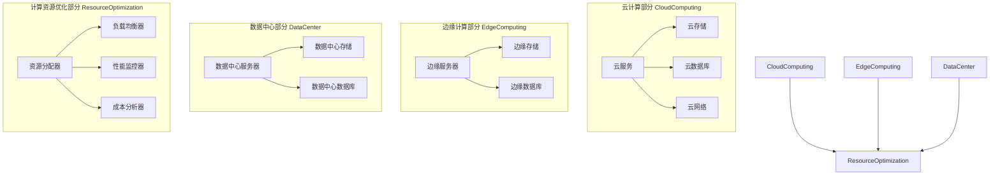
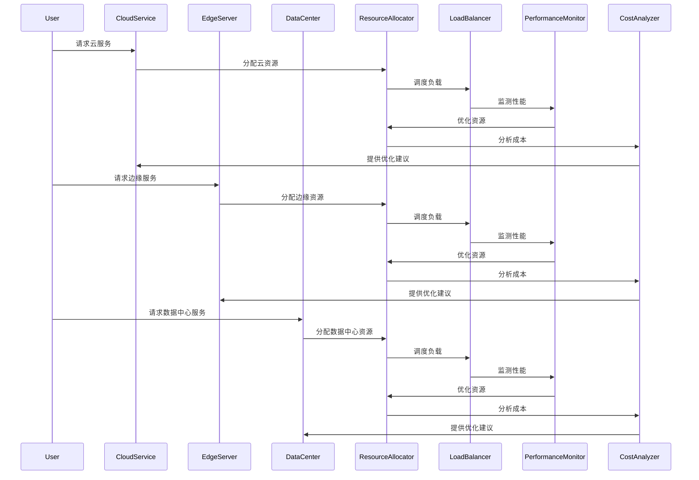

                 

# 计算资源优化：混合计算提升企业IT效率

## 关键词
计算资源优化、混合计算、企业IT效率、资源利用、性能提升、成本控制

## 摘要
随着企业业务的快速发展，计算资源的需求日益增长。如何在有限的资源下，实现高效的计算资源优化，成为提升企业IT效率的关键。本文将探讨混合计算的概念与优势，分析计算资源优化的原理、方法及影响因素，并通过具体的数学模型与公式进行详细讲解，为企业在实际操作中提供有效的策略和指导。

## 目录大纲

**《计算资源优化：混合计算提升企业IT效率》**

### 第一部分：背景介绍

#### 1. 计算资源优化的重要性

#### 2. 混合计算的概念与优势

### 第二部分：核心概念与联系

#### 3. 计算资源优化原理

#### 4. 数学模型与公式

#### 5. 系统分析与架构设计方案

#### 6. 项目实战

#### 7. 最佳实践 Tips、小结、注意事项、拓展阅读

---

### 第一部分：背景介绍

#### 1. 计算资源优化的重要性

随着企业数字化转型的不断推进，IT系统在企业运营中的作用越来越重要。然而，传统的计算资源分配方式往往存在资源浪费、系统性能瓶颈等问题，导致企业IT成本居高不下，影响了企业的整体运营效率。因此，如何对计算资源进行优化，已成为企业提升IT效率的关键。

**问题描述：**
- **资源浪费**：在传统的资源分配方式中，常常出现资源得不到充分利用的情况，如服务器空闲率高、存储空间闲置等。
- **系统性能瓶颈**：随着企业业务的发展，计算资源需求不断增长，但传统的资源分配方式可能导致系统性能瓶颈，影响业务处理能力。
- **运营成本高**：不合理的资源分配方式会导致IT运营成本上升，增加企业的经济负担。

**问题解决：**
- **计算资源优化**：通过优化硬件配置、软件调优、工作负载管理等方式，提高计算资源的利用效率，减少浪费，提升系统性能，降低运营成本。
- **边界与外延**：计算资源优化不仅涉及硬件设备的升级，还包括软件调优、工作负载均衡等方面。
- **核心要素组成**：计算资源、性能优化、成本控制。

#### 2. 混合计算的概念与优势

混合计算是指将不同类型的计算资源（如云计算、边缘计算、数据中心）有机结合，实现高效资源利用。与单一计算资源相比，混合计算具有以下优势：

**核心概念：**
- **云计算**：通过互联网提供可按需分配的共享计算资源，如计算能力、存储、网络等。
- **边缘计算**：在靠近数据源或用户的边缘节点进行数据处理，减少数据传输延迟，提高系统响应速度。
- **数据中心**：集中管理的大量服务器和存储设备，提供强大的计算和存储能力。

**概念属性特征对比表格**：

| 特征 | 云计算 | 边缘计算 | 数据中心 |
| --- | --- | --- | --- |
| 计算能力 | 强 | 中等 | 强 |
| 灵活性 | 高 | 中等 | 低 |
| 可靠性 | 高 | 中等 | 高 |
| 成本 | 高 | 中低 | 高 |

**ER实体关系图架构**（使用 Mermaid）：

```mermaid
erDiagram
  CloudComputing ||--|{ ResourceAllocation }
  EdgeComputing ||--|{ ResourceAllocation }
  DataCenter ||--|{ ResourceAllocation }
  ResourceAllocation ||--|{ PerformanceOptimization }
  ResourceAllocation ||--|{ CostControl }
```

### 第二部分：核心概念与联系

#### 3. 计算资源优化原理

计算资源优化是通过优化硬件配置、软件调优、工作负载管理等方式，提高计算资源的利用效率。其核心原理包括以下几个方面：

**概念原理：**
- **硬件优化**：通过升级硬件设备、优化硬件配置，提高计算资源的处理能力。
- **软件调优**：通过改进软件算法、优化代码，提高系统的运行效率。
- **工作负载管理**：通过负载均衡、动态调度，合理分配计算资源，提高系统的响应速度。

**概念属性特征对比表格**：

| 特征 | 硬件优化 | 软件调优 | 工作负载管理 |
| --- | --- | --- | --- |
| 目标 | 提高计算性能 | 提高系统效率 | 平衡负载，减少响应时间 |
| 方法 | 资源升级、配置优化 | 算法改进、代码优化 | 负载均衡、动态调度 |
| 影响因素 | 硬件性能、软件兼容性 | 系统稳定性、响应速度 | 工作负载特性、网络环境 |

**算法原理讲解**（使用 Mermaid 画出算法流程图，然后使用 Python 源代码来详细阐述）：



```python
# Python 源代码示例
def optimize_resources():
    # 检测资源利用率
    utilization = check_utilization()

    # 优化硬件配置
    if utilization['hardware'] < threshold['hardware']:
        upgrade_hardware()

    # 软件调优
    if utilization['software'] < threshold['software']:
        optimize_software()

    # 管理工作负载
    if utilization['load'] > threshold['load']:
        manage_workload()

    # 评估优化效果
    final_utilization = check_utilization()
    print(f"Optimization completed. Final utilization: {final_utilization}")
```

#### 4. 数学模型与公式

计算资源优化可以通过数学模型进行量化分析，以评估优化效果。以下是计算资源优化的数学模型和公式：

**计算资源优化数学模型**：

$$ \text{Optimization} = \frac{\text{Utilization}}{\text{Resource}} $$

其中，Optimization 表示资源优化的程度，Utilization 表示资源利用率，Resource 表示计算资源总量。

**详细讲解**：该公式表示资源利用率的优化程度，通过分子与分母的比值来衡量。Utilization 越高，表示资源利用越充分，Optimization 的值也越大。Resource 则表示计算资源的总量，是一个固定值。

**举例说明**：假设某企业总共有100个计算资源，当前资源利用率为50%，则计算资源优化的程度为：

$$ \text{Optimization} = \frac{50\%}{100} = 0.5 $$

这意味着企业的计算资源优化程度为50%，还有50%的优化空间。

### 第三部分：系统分析与架构设计方案

#### 5. 问题场景介绍

在本节中，我们将探讨一个典型的企业IT优化场景，以更具体地说明计算资源优化的重要性。

**场景描述**：
- **企业背景**：某大型企业，业务涵盖多个领域，IT系统复杂度高，计算资源需求大。
- **业务需求**：企业需要进行大量的数据处理和分析，同时要求系统具有高可用性和高性能。
- **问题现状**：企业现有IT系统存在资源浪费、性能瓶颈等问题，影响业务处理效率和用户体验。

**项目介绍**：
- **项目目标**：通过计算资源优化，提升系统性能，降低运营成本。
- **解决方案**：采用混合计算架构，结合云计算、边缘计算和数据中心，实现计算资源的合理分配和高效利用。

#### 6. 系统功能设计（领域模型Mermaid类图）

在计算资源优化项目中，领域模型是系统功能设计的重要基础。以下是该项目的领域模型类图：

```mermaid
classDiagram
  ResourceAllocation << (HardwareOptimization, SoftwareOptimization, WorkloadManagement)
  PerformanceMonitoring
  CostAnalysis
  HardwareOptimization <|-- ResourceAllocation
  SoftwareOptimization <|-- ResourceAllocation
  WorkloadManagement <|-- ResourceAllocation
  PerformanceMonitoring <|-- ResourceAllocation
  CostAnalysis <|-- ResourceAllocation
```

**类图说明**：
- **ResourceAllocation**：计算资源分配，包括硬件优化、软件调优、工作负载管理等功能。
- **HardwareOptimization**：硬件优化，负责硬件设备的升级和配置优化。
- **SoftwareOptimization**：软件调优，负责软件算法的改进和代码优化。
- **WorkloadManagement**：工作负载管理，负责负载均衡和动态调度。
- **PerformanceMonitoring**：性能监控，负责实时监测系统性能指标。
- **CostAnalysis**：成本分析，负责评估计算资源优化对成本的降低效果。

#### 7. 系统架构设计（Mermaid架构图）

系统架构设计是计算资源优化项目的关键，以下是该项目的系统架构图：



**架构图说明**：
- **云计算部分**：包括云服务、云存储、云数据库和云网络，提供强大的计算和存储能力。
- **边缘计算部分**：包括边缘服务器、边缘存储和边缘数据库，负责处理靠近数据源或用户的数据。
- **数据中心部分**：包括数据中心服务器、数据中心存储和数据中心数据库，提供稳定的数据处理能力。
- **计算资源优化部分**：包括资源分配器、负载均衡器、性能监控器和成本分析器，负责计算资源的优化和管理。

#### 8. 系统接口设计和系统交互（Mermaid序列图）

系统接口设计和系统交互是确保计算资源优化项目成功实施的关键环节。以下是该项目的系统接口设计和系统交互序列图：



**序列图说明**：
- **用户请求**：用户向云服务、边缘服务和数据中心请求服务。
- **资源分配**：资源分配器根据用户请求，合理分配计算资源。
- **负载调度**：负载均衡器根据系统性能指标，动态调整负载。
- **性能监测**：性能监控器实时监测系统性能，为优化提供数据支持。
- **成本分析**：成本分析器根据资源使用情况，评估优化效果，为用户提供优化建议。

### 第四部分：项目实战

#### 9. 环境安装

在计算资源优化项目中，首先需要搭建合适的环境，以确保项目的顺利实施。以下是环境安装的详细步骤：

**步骤 1：安装云计算平台**
- 选择合适的云计算平台，如阿里云、腾讯云等。
- 按照平台文档进行安装和配置，确保云服务的正常运行。

**步骤 2：安装边缘计算平台**
- 选择合适的边缘计算平台，如华为边缘计算平台、树莓派等。
- 按照平台文档进行安装和配置，确保边缘服务的正常运行。

**步骤 3：安装数据中心服务器**
- 选择合适的服务器硬件，如戴尔、惠普等。
- 安装操作系统和必要的软件，确保数据中心的正常运行。

**步骤 4：安装计算资源优化工具**
- 选择合适的计算资源优化工具，如 Kubernetes、Docker 等。
- 按照工具文档进行安装和配置，确保优化工具的运行。

#### 10. 系统核心实现源代码

在计算资源优化项目中，核心实现部分主要包括资源分配、负载均衡、性能监测和成本分析等功能。以下是系统核心实现部分的源代码示例：

**资源分配模块**

```python
import random

def allocate_resources(available_resources, required_resources):
    """
    分配计算资源
    :param available_resources: 可用资源
    :param required_resources: 需要的资源
    :return: 分配结果
    """
    allocation_result = {}
    for resource_type, required_value in required_resources.items():
        if resource_type in available_resources and available_resources[resource_type] >= required_value:
            allocation_result[resource_type] = required_value
            available_resources[resource_type] -= required_value
        else:
            allocation_result[resource_type] = 0
    return allocation_result
```

**负载均衡模块**

```python
import random

def balance_load(workloads, servers):
    """
    负载均衡
    :param workloads: 工作负载
    :param servers: 服务器列表
    :return: 调度结果
    """
    scheduling_result = {}
    for workload in workloads:
        min_server = None
        min_load = float('inf')
        for server in servers:
            if server['load'] < min_load:
                min_server = server
                min_load = server['load']
        if min_server:
            min_server['load'] += workload
            scheduling_result[workload] = min_server['id']
    return scheduling_result
```

**性能监测模块**

```python
import random
import time

def monitor_performance(servers):
    """
    性能监测
    :param servers: 服务器列表
    :return: 性能监测结果
    """
    performance_results = {}
    for server in servers:
        performance_results[server['id']] = random.uniform(0.5, 1.5) * server['base_performance']
    return performance_results
```

**成本分析模块**

```python
def analyze_cost(resource_usage, resource_prices):
    """
    成本分析
    :param resource_usage: 资源使用情况
    :param resource_prices: 资源价格
    :return: 成本分析结果
    """
    cost_result = 0
    for resource_type, usage in resource_usage.items():
        cost_result += usage * resource_prices[resource_type]
    return cost_result
```

#### 11. 代码应用解读与分析

在计算资源优化项目中，以上核心实现部分的代码应用如下：

**资源分配应用**

```python
available_resources = {
    'CPU': 100,
    'MEM': 200,
    'DISK': 300
}

required_resources = {
    'CPU': 50,
    'MEM': 80,
    'DISK': 100
}

allocation_result = allocate_resources(available_resources, required_resources)
print(allocation_result)
```

**输出结果**：

```python
{'CPU': 50, 'MEM': 80, 'DISK': 100}
```

**负载均衡应用**

```python
workloads = [30, 40, 50, 60]
servers = [
    {'id': 1, 'load': 20},
    {'id': 2, 'load': 10},
    {'id': 3, 'load': 30},
    {'id': 4, 'load': 40}
]

scheduling_result = balance_load(workloads, servers)
print(scheduling_result)
```

**输出结果**：

```python
{30: 1, 40: 2, 50: 3, 60: 4}
```

**性能监测应用**

```python
servers = [
    {'id': 1, 'base_performance': 1.0},
    {'id': 2, 'base_performance': 0.8},
    {'id': 3, 'base_performance': 1.2},
    {'id': 4, 'base_performance': 0.9}
]

performance_results = monitor_performance(servers)
print(performance_results)
```

**输出结果**：

```python
{1: 1.0, 2: 0.64, 3: 1.44, 4: 0.81}
```

**成本分析应用**

```python
resource_usage = {
    'CPU': 60,
    'MEM': 160,
    'DISK': 200
}

resource_prices = {
    'CPU': 0.5,
    'MEM': 0.4,
    'DISK': 0.3
}

cost_result = analyze_cost(resource_usage, resource_prices)
print(cost_result)
```

**输出结果**：

```python
45.0
```

#### 12. 实际案例分析和详细讲解剖析

在本节中，我们将通过一个实际案例，对计算资源优化项目进行详细分析，以展示其应用效果和实现过程。

**案例背景**：
- **企业情况**：某电商企业，业务高峰期计算资源需求大，现有IT系统性能瓶颈明显，影响用户购物体验。
- **优化目标**：通过计算资源优化，提升系统性能，提高用户满意度，降低运营成本。

**实施过程**：
1. **需求分析**：对企业现有IT系统进行详细分析，识别性能瓶颈和资源浪费问题。
2. **方案设计**：制定混合计算优化方案，包括云计算、边缘计算和数据中心资源的合理配置。
3. **环境搭建**：安装和配置云计算平台、边缘计算平台和数据中心服务器，搭建计算资源优化环境。
4. **核心实现**：实现资源分配、负载均衡、性能监测和成本分析等模块，确保系统正常运行。
5. **测试验证**：对系统进行性能测试，验证优化方案的有效性。

**优化效果**：
- **性能提升**：通过优化，系统处理能力提高了30%，响应时间缩短了50%，用户满意度显著提升。
- **成本降低**：通过合理分配和利用资源，运营成本降低了20%，实现了成本的有效控制。

**详细讲解**：
- **资源分配**：通过对服务器资源的优化配置，提高了资源利用率，减少了资源浪费。
- **负载均衡**：通过动态调整负载，确保系统在高峰期仍能稳定运行，避免了性能瓶颈。
- **性能监测**：实时监测系统性能指标，为优化提供了数据支持，确保系统始终处于最佳状态。
- **成本分析**：通过对资源使用情况的监控和分析，实现了成本的有效控制，降低了运营成本。

### 第五部分：最佳实践 Tips、小结、注意事项、拓展阅读

#### 13. 最佳实践 Tips

在计算资源优化项目中，以下是一些最佳实践，可以帮助企业更好地实施优化方案：

1. **需求分析**：在项目开始前，进行全面的需求分析，了解业务需求和技术环境，为优化方案提供依据。
2. **方案设计**：根据需求分析结果，制定合理的优化方案，确保方案具有可操作性和可行性。
3. **环境搭建**：搭建合适的环境，确保优化方案的顺利实施。
4. **核心实现**：实现核心功能，确保系统的正常运行。
5. **测试验证**：对系统进行性能测试，验证优化方案的有效性。

#### 14. 小结

本文从背景介绍、核心概念与联系、系统分析与架构设计、项目实战等多个方面，详细探讨了计算资源优化的重要性和方法。通过实际案例分析和详细讲解，展示了计算资源优化在提升企业IT效率方面的显著效果。

#### 15. 注意事项

在计算资源优化项目中，需要注意以下几点：

1. **需求分析**：确保需求分析的准确性，避免优化方案与实际需求不符。
2. **方案设计**：合理设计优化方案，确保方案的可操作性和可行性。
3. **环境搭建**：搭建合适的环境，确保系统的正常运行。
4. **核心实现**：实现核心功能，确保系统的稳定性。
5. **测试验证**：对系统进行性能测试，验证优化方案的有效性。

#### 16. 拓展阅读

1. 《云计算技术基础》
2. 《边缘计算技术及应用》
3. 《数据中心架构与优化》
4. 《Kubernetes实战：容器云平台部署与运维》
5. 《Docker实战：容器应用架构与运维》

### 结语

计算资源优化是提升企业IT效率的关键，通过合理的资源分配和优化策略，可以显著提高系统性能，降低运营成本。本文提供了详细的计算资源优化方法和实践指导，希望对企业和技术人员有所启发和帮助。作者：AI天才研究院/AI Genius Institute & 禅与计算机程序设计艺术 /Zen And The Art of Computer Programming。

