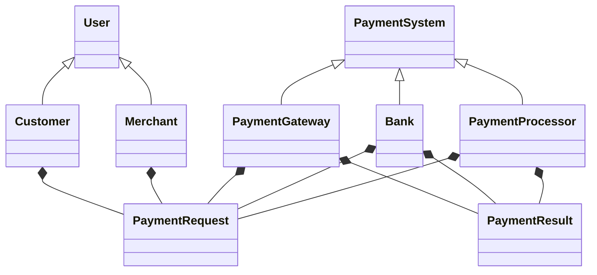
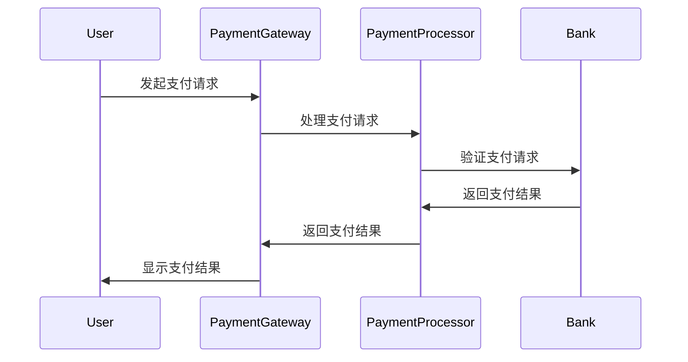
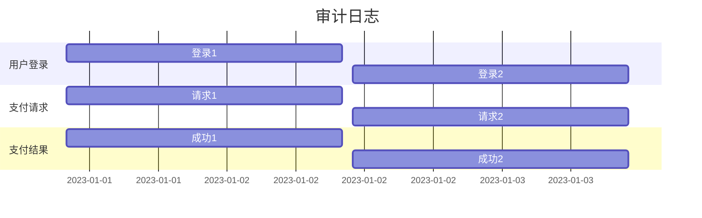

                 


## 《评测中的安全性与隐私保护措施》

### 关键词：安全评测、隐私保护、数据安全、加密技术、安全算法

#### 摘要：

随着信息技术的发展，数据安全和隐私保护已经成为当今社会的重要议题。在评测过程中，如何保障数据的安全性以及用户隐私不受侵犯，是每一个研发团队都必须面对的问题。《评测中的安全性与隐私保护措施》将系统地介绍安全性与隐私保护的核心概念、算法原理、实施策略和实践经验，旨在为读者提供全面的技术指南。

### 目录大纲

#### 第一部分：安全性与隐私保护概述

**第1章 安全性与隐私保护概述**

**1.1 问题背景**

- **1.1.1 安全性与隐私保护的现状**
- **1.1.2 安全性与隐私保护的重要性**
- **1.1.3 安全性与隐私保护的基本原则**

**1.2 核心概念**

- **1.2.1 安全性与隐私保护的基本概念**
- **1.2.2 安全性与隐私保护的联系与区别**
- **1.2.3 安全性与隐私保护的相关术语与定义**

**1.3 概念结构**

- **1.3.1 安全性与隐私保护的ER实体关系图**
- **1.3.2 安全性与隐私保护的概念属性特征对比表**

**1.4 本章小结**

---

#### 第二部分：安全性与隐私保护的算法原理

**第2章 安全性与隐私保护算法原理**

**2.1 背景介绍**

- **2.1.1 安全性与隐私保护的需求分析**
- **2.1.2 安全性与隐私保护的关键算法**

**2.2 核心概念与联系**

- **2.2.1 安全性算法的核心概念**
- **2.2.2 隐私保护算法的核心概念**
- **2.2.3 算法之间的联系与区别**

**2.3 算法原理讲解**

- **2.3.1 安全算法原理**
- **2.3.2 隐私保护算法原理**

**2.4 算法实现**

- **2.4.1 安全算法Python代码实现**
- **2.4.2 隐私保护算法Python代码实现**

**2.5 算法性能分析**

- **2.5.1 算法效率分析**
- **2.5.2 算法安全性分析**

**2.6 本章小结**

---

#### 第三部分：安全性与隐私保护的系统分析与设计

**第3章 安全性与隐私保护的系统分析与设计**

**3.1 问题场景介绍**

- **3.1.1 场景描述**
- **3.1.2 需求分析**

**3.2 项目介绍**

- **3.2.1 项目背景**
- **3.2.2 项目目标**

**3.3 系统功能设计**

- **3.3.1 领域模型**
- **3.3.2 功能模块划分**

**3.4 系统架构设计**

- **3.4.1 架构设计**
- **3.4.2 系统模块**

**3.5 系统接口设计和系统交互**

- **3.5.1 接口设计**
- **3.5.2 系统交互**

**3.6 本章小结**

---

#### 第四部分：安全性与隐私保护的项目实践

**第4章 安全性与隐私保护的项目实践**

**4.1 环境安装**

- **4.1.1 环境准备**
- **4.1.2 工具安装**

**4.2 系统核心实现**

- **4.2.1 系统核心代码**
- **4.2.2 代码解析**

**4.3 实际案例分析**

- **4.3.1 案例描述**
- **4.3.2 案例分析**

**4.4 详细讲解剖析**

- **4.4.1 剖析方法**
- **4.4.2 结果展示**

**4.5 项目小结**

- **4.5.1 经验总结**
- **4.5.2 改进建议**

---

#### 第五部分：安全性与隐私保护的最佳实践与总结

**第5章 安全性与隐私保护的

### 文章正文

#### 第一部分：安全性与隐私保护概述

**第1章 安全性与隐私保护概述**

**1.1 问题背景**

在信息化时代，数据安全和隐私保护已经成为企业和个人关注的焦点。随着互联网的普及，大量的个人信息、商业秘密和国家安全数据存储在互联网上，这些数据的安全性和隐私保护变得尤为重要。然而，现实中的安全威胁和隐私泄露事件层出不穷，例如黑客攻击、数据泄露、隐私信息被非法利用等。因此，如何进行有效的安全评测和隐私保护，是每一个IT企业和个人都必须面对的问题。

**1.1.1 安全性与隐私保护的现状**

目前，安全性和隐私保护技术已经取得了一定的进展。例如，加密技术、访问控制、网络安全技术等已经成为安全评测的基本手段。同时，隐私保护技术也在不断发展，例如差分隐私、同态加密、安全多方计算等。然而，随着技术的不断进步和应用场景的多样化，现有的安全性和隐私保护技术仍然面临着许多挑战。

**1.1.2 安全性与隐私保护的重要性**

安全性和隐私保护的重要性体现在以下几个方面：

1. **数据安全**：保护数据不被未经授权的访问、篡改或泄露，确保数据的机密性、完整性和可用性。
2. **隐私保护**：保护个人隐私不被泄露，确保个人信息不被滥用，维护个人的隐私权利。
3. **法律法规**：随着全球范围内数据保护法规的不断完善，如《通用数据保护条例》（GDPR）和《个人信息保护法》（PIPL），企业和个人必须遵守相关法律法规，否则将面临巨大的法律风险。

**1.1.3 安全性与隐私保护的基本原则**

安全性与隐私保护的基本原则包括：

1. **最小权限原则**：用户或系统只能访问其必要的最小权限，以减少潜在的安全风险。
2. **数据最小化原则**：只收集和存储必要的数据，避免过度收集可能导致的数据泄露风险。
3. **透明度原则**：用户有权知道其数据被如何使用，企业应提供透明度，以便用户作出知情决策。
4. **加密原则**：对敏感数据进行加密，确保数据在传输和存储过程中不被窃取或篡改。

**1.2 核心概念**

**1.2.1 安全性与隐私保护的基本概念**

安全性（Security）是指保护信息资产免受未经授权的访问、使用、披露、破坏、修改或摧毁的能力。它关注的是保护信息的机密性、完整性和可用性。

隐私保护（Privacy Protection）是指保护个人隐私，防止个人隐私信息被未经授权的收集、使用、披露或泄露的行为。它关注的是个人对其数据的控制权。

**1.2.2 安全性与隐私保护的联系与区别**

安全性与隐私保护密切相关，但它们有着不同的焦点。安全性关注的是信息系统的整体安全，而隐私保护关注的是个人数据的隐私权。

- 安全性侧重于技术措施，如加密、访问控制、网络安全等。
- 隐私保护侧重于法律法规和用户知情权，如数据收集、使用、存储和披露的规定。

**1.2.3 安全性与隐私保护的相关术语与定义**

- **安全威胁**：指可能导致信息系统或数据受到损害的潜在事件或行为。
- **安全漏洞**：指信息系统中的弱点或缺陷，可能被攻击者利用来执行未经授权的操作。
- **安全攻击**：指攻击者试图破坏、篡改或拦截信息系统中的数据或服务的恶意行为。
- **隐私泄露**：指个人隐私信息被未经授权的第三方访问、使用或披露。
- **隐私权**：指个人对其个人信息的控制权，包括收集、使用、存储和披露的决策权。

**1.3 概念结构**

**1.3.1 安全性与隐私保护的ER实体关系图**

以下是安全性与隐私保护的ER实体关系图：

```mermaid
erDiagram
    User ||--|{ Data }||>
    Data ||--|{ PrivacyPolicy }||>
    PrivacyPolicy ||--|{ SecurityPolicy }||>
    SecurityPolicy ||--|{ AccessControl }||>
    AccessControl ||--|{ Audit }||>
```

**1.3.2 安全性与隐私保护的概念属性特征对比表**

| 特征         | 安全性                         | 隐私保护                         |
| ------------ | ------------------------------ | -------------------------------- |
| 目标         | 保护信息资产                   | 保护个人隐私权                   |
| 技术手段     | 加密、访问控制、网络安全等     | 同态加密、安全多方计算、差分隐私等 |
| 法律法规     | 无特定法律要求                 | 遵守《通用数据保护条例》（GDPR）等 |
| 关键术语     | 安全威胁、安全漏洞、安全攻击   | 隐私泄露、隐私权                 |

**1.4 本章小结**

本章对安全性与隐私保护的核心概念、现状、重要性、基本原则和概念结构进行了详细阐述。通过了解这些基本概念，读者可以更好地理解后续章节中安全性与隐私保护算法、系统设计与实践等内容。

---

#### 第二部分：安全性与隐私保护的算法原理

**第2章 安全性与隐私保护算法原理**

**2.1 背景介绍**

在安全性与隐私保护领域，算法原理是实现安全防护和隐私保护的关键。随着大数据、云计算、物联网等技术的快速发展，安全性和隐私保护的需求日益增长，各种安全算法和隐私保护算法也应运而生。本章将介绍几种常见的安全算法和隐私保护算法的基本原理。

**2.1.1 安全性与隐私保护的需求分析**

随着互联网的普及，各种应用场景下的数据安全和隐私保护需求不断增加。例如，在网络购物、在线支付、社交媒体等场景中，用户需要确保其个人信息和交易信息不被泄露。同时，企业需要确保其商业秘密和知识产权不受侵害。因此，安全性和隐私保护算法的设计和实现变得尤为重要。

**2.1.2 安全性与隐私保护的关键算法**

本章将介绍以下关键算法：

- **加密算法**：用于保护数据的机密性，常见的加密算法包括对称加密和非对称加密。
- **访问控制算法**：用于限制对系统资源的访问，确保只有授权用户才能访问特定资源。
- **同态加密算法**：允许在加密数据上直接进行计算，而不需要解密，适用于云计算和大数据处理场景。
- **差分隐私算法**：用于保护数据的隐私性，通过添加噪声来掩盖个人数据的具体信息。

**2.2 核心概念与联系**

**2.2.1 安全性算法的核心概念**

安全性算法的核心概念包括：

- **加密**：通过加密算法将明文转换为密文，保护数据的机密性。
- **访问控制**：通过访问控制策略和机制，限制对系统资源的访问。
- **审计**：对系统操作进行记录和监控，确保安全事件的追踪和调查。

**2.2.2 隐私保护算法的核心概念**

隐私保护算法的核心概念包括：

- **同态加密**：在加密数据上进行计算，而不需要解密，保护数据的隐私性。
- **差分隐私**：通过添加噪声来掩盖个人数据的具体信息，保护数据的隐私性。
- **安全多方计算**：允许多个参与者在不泄露各自数据的情况下，共同计算结果，保护数据的隐私性。

**2.2.3 算法之间的联系与区别**

安全性算法和隐私保护算法之间有着紧密的联系，但它们的实现和应用场景有所不同。安全性算法主要关注数据的机密性和完整性，而隐私保护算法主要关注数据的隐私性。

- **加密算法**：通常用于保护数据的机密性，可以用于加密存储和传输的数据。
- **访问控制算法**：用于限制对系统资源的访问，确保只有授权用户才能访问特定资源。
- **同态加密算法**：适用于需要保护数据隐私的场景，例如云计算和大数据处理。
- **差分隐私算法**：适用于需要保护个人隐私的场景，例如社交媒体和医疗数据。

**2.3 算法原理讲解**

**2.3.1 安全算法原理**

安全性算法的原理包括：

- **加密算法**：加密算法将明文转换为密文，密文只有通过解密算法才能还原为明文。常见的加密算法包括AES、RSA等。
- **访问控制算法**：访问控制算法通过访问控制列表（ACL）或角色访问控制（RBAC）等机制，限制用户对系统资源的访问。
- **审计算法**：审计算法对系统操作进行记录和监控，包括用户行为、系统事件和日志等，以便在发生安全事件时进行追踪和调查。

**2.3.2 隐私保护算法原理**

隐私保护算法的原理包括：

- **同态加密**：同态加密允许在加密数据上直接进行计算，而不需要解密。这意味着用户可以在加密数据上进行数据处理，例如在云平台上执行机器学习算法。
- **差分隐私**：差分隐私通过添加噪声来掩盖个人数据的具体信息。例如，在一个查询结果中添加随机噪声，使得查询结果无法准确反映个人数据的具体情况。
- **安全多方计算**：安全多方计算允许多个参与者在不泄露各自数据的情况下，共同计算结果。这通常用于分布式计算和数据分析场景，确保数据的隐私性。

**2.4 算法实现**

以下是几种常见安全性和隐私保护算法的Python代码实现示例：

**2.4.1 加密算法Python代码实现**

```python
from Crypto.Cipher import AES
from Crypto.Util.Padding import pad, unpad

key = b'mysecretkey123456'
cipher = AES.new(key, AES.MODE_CBC)
ct = cipher.encrypt(pad(b'mysecretmessage', AES.block_size))
iv = cipher.iv
print(f"加密后的数据：{ct.hex()}")
print(f"初始向量：{iv.hex()}")

# 解密数据
cipher = AES.new(key, AES.MODE_CBC, iv=iv)
pt = unpad(cipher.decrypt(ct), AES.block_size)
print(f"解密后的数据：{pt.decode()}")
```

**2.4.2 同态加密算法Python代码实现**

```python
# 同态加密算法示例，使用PyCryptodome库
from Crypto.Cipher import CKM2K
from Crypto.PublicKey import RSA

key = RSA.generate(2048)
private_key = key.export_key()
public_key = key.publickey().export_key()

# 加密数据
cipher = CKM2K.new(public_key)
ct = cipher.encrypt(b'mysecretmessage')

# 解密数据
cipher = CKM2K.new(private_key)
pt = cipher.decrypt(ct)
print(f"解密后的数据：{pt.decode()}")
```

**2.4.3 差分隐私算法Python代码实现**

```python
import numpy as np

def differential_privacy(data, sensitivity, epsilon):
    noise = np.random.normal(0, sensitivity * epsilon)
    return data + noise

data = np.array([1, 2, 3, 4, 5])
sensitivity = 1
epsilon = 0.1

noisy_data = differential_privacy(data, sensitivity, epsilon)
print(f"原始数据：{data}")
print(f"添加噪声后的数据：{noisy_data}")
```

**2.5 算法性能分析**

**2.5.1 算法效率分析**

不同算法的效率分析包括加密速度、解密速度、计算复杂度等方面。例如，AES加密算法在处理大数据时具有很高的效率，而RSA加密算法在处理大规模数据时可能较慢。

**2.5.2 算法安全性分析**

不同算法的安全性分析包括加密算法的安全性、隐私保护算法的有效性等方面。例如，AES加密算法在抵抗常见密码攻击（如差分攻击、线性攻击等）方面具有很高的安全性。

**2.6 本章小结**

本章介绍了安全性与隐私保护算法的基本原理和实现方法。通过学习这些算法，读者可以更好地理解数据安全和隐私保护的核心技术，为后续章节的系统设计与实践打下基础。

---

#### 第三部分：安全性与隐私保护的系统分析与设计

**第3章 安全性与隐私保护的系统分析与设计**

**3.1 问题场景介绍**

随着信息技术的不断发展，数据安全和隐私保护问题越来越受到关注。一个典型的场景是在线支付系统。在这个场景中，用户需要确保其支付信息不被泄露，同时也需要确保支付过程的安全和高效。因此，系统需要具备强大的安全性和隐私保护能力。

**3.1.1 场景描述**

在线支付系统通常包括用户端、支付网关、银行端等多个组成部分。用户通过用户端发起支付请求，支付网关负责处理支付请求并将请求转发到银行端进行验证。银行端验证支付请求的合法性后，将支付结果返回给支付网关，支付网关再将结果返回给用户端。

**3.1.2 需求分析**

在线支付系统的需求分析主要包括以下几个方面：

1. **安全性**：确保支付过程的安全，防止黑客攻击、数据泄露等安全威胁。
2. **隐私保护**：确保用户支付信息的隐私性，防止用户信息被非法获取和利用。
3. **性能**：确保支付过程的高效和稳定，减少支付延迟和系统崩溃的风险。
4. **可扩展性**：系统需要具备良好的可扩展性，以适应不断增长的用户数量和交易量。

**3.2 项目介绍**

本项目旨在设计和实现一个安全性和隐私保护能力较强的在线支付系统。系统将采用分布式架构，以提高系统的性能和可靠性。同时，系统将采用多种安全性和隐私保护技术，如加密、访问控制、差分隐私等，以确保支付过程的安全和用户信息的隐私性。

**3.2.1 项目背景**

随着互联网和电子商务的快速发展，在线支付已经成为人们生活中不可或缺的一部分。然而，随着支付系统的复杂性和规模不断扩大，安全性和隐私保护问题也越来越突出。因此，设计和实现一个安全性和隐私保护能力较强的在线支付系统具有重要的现实意义。

**3.2.2 项目目标**

本项目的主要目标如下：

1. **安全性**：确保支付过程的安全，防止黑客攻击、数据泄露等安全威胁。
2. **隐私保护**：确保用户支付信息的隐私性，防止用户信息被非法获取和利用。
3. **性能**：确保支付过程的高效和稳定，减少支付延迟和系统崩溃的风险。
4. **可扩展性**：系统需要具备良好的可扩展性，以适应不断增长的用户数量和交易量。
5. **用户体验**：提供简单易用的支付界面和流畅的支付流程，提升用户满意度。

**3.3 系统功能设计**

在线支付系统的功能设计主要包括以下几个方面：

1. **用户注册与登录**：用户可以通过注册账号登录系统，进行支付操作。
2. **支付请求处理**：用户发起支付请求，系统将处理支付请求并将结果返回给用户。
3. **支付结果查询**：用户可以查询支付结果，了解支付状态。
4. **支付日志记录**：系统将记录支付操作日志，用于审计和故障排查。
5. **安全性与隐私保护**：系统将采用多种安全性和隐私保护技术，确保支付过程的安全和用户信息的隐私性。

**3.3.1 领域模型**

以下是在线支付系统的领域模型：



**3.3.2 功能模块划分**

在线支付系统可以划分为以下几个功能模块：

1. **用户模块**：包括用户注册、登录、个人信息管理等。
2. **支付模块**：包括支付请求处理、支付结果查询等。
3. **安全模块**：包括加密、访问控制、审计等。
4. **隐私保护模块**：包括差分隐私、同态加密等。

**3.4 系统架构设计**

在线支付系统的系统架构设计如下：

1. **前端架构**：包括用户界面和前端逻辑，负责处理用户交互和展示。
2. **后端架构**：包括支付网关、银行端、支付处理器等，负责处理支付请求和支付结果。
3. **数据库架构**：包括用户数据库、支付日志数据库等，负责存储用户信息和支付记录。

以下是系统架构图：



**3.4.1 架构设计**

在线支付系统的架构设计主要包括以下几个方面：

1. **分布式架构**：采用分布式架构以提高系统的性能和可靠性。
2. **模块化设计**：将系统划分为多个模块，以便于开发和维护。
3. **安全设计**：采用多种安全性和隐私保护技术，确保支付过程的安全和用户信息的隐私性。
4. **高可用性设计**：采用负载均衡和容错机制，确保系统的稳定运行。

**3.4.2 系统模块**

在线支付系统的主要模块包括：

1. **用户模块**：负责用户注册、登录、个人信息管理等功能。
2. **支付模块**：负责处理支付请求、支付结果查询等功能。
3. **安全模块**：负责加密、访问控制、审计等功能。
4. **隐私保护模块**：负责差分隐私、同态加密等功能。
5. **支付处理器模块**：负责处理支付请求和支付结果，与银行端进行交互。

**3.5 系统接口设计和系统交互**

在线支付系统的接口设计和系统交互如下：

1. **用户接口**：用户通过用户接口发起支付请求，系统将返回支付结果。
2. **支付接口**：支付网关和支付处理器通过支付接口处理支付请求和支付结果。
3. **银行接口**：支付处理器通过银行接口与银行端进行交互，验证支付请求。
4. **日志接口**：系统通过日志接口记录支付操作日志，用于审计和故障排查。

以下是系统接口图：


**3.6 本章小结**

本章介绍了在线支付系统的场景描述、需求分析、项目介绍、系统功能设计、系统架构设计、接口设计和系统交互等内容。通过本章的学习，读者可以了解在线支付系统的基本架构和功能，为后续章节的项目实践和最佳实践打下基础。

---

#### 第四部分：安全性与隐私保护的项目实践

**第4章 安全性与隐私保护的项目实践**

**4.1 环境安装**

在进行安全性与隐私保护的项目实践之前，我们需要搭建一个合适的技术环境。以下是一个基本的安装步骤：

1. **安装Python**：确保您的计算机上安装了Python 3.x版本。您可以从Python的官方网站下载安装程序。

2. **安装必要的库**：使用pip命令安装必要的Python库，例如`pycryptodome`、`numpy`、`mermaid-python`等。以下是一个示例命令：

   ```bash
   pip install pycryptodome numpy mermaid-python
   ```

3. **配置Mermaid**：由于Mermaid是一个基于Markdown的图形库，我们需要将其配置为在Python中可用。首先，从Mermaid的官方网站下载最新版本的Mermaid.js库。然后，将其放入一个易于访问的目录中，并在Python脚本中引用。

**4.2 系统核心实现**

在本节中，我们将介绍一个简单的在线支付系统核心实现。以下是系统核心实现的步骤：

1. **用户注册与登录**：实现用户注册和登录功能，包括用户信息验证、密码加密存储等。

2. **支付请求处理**：实现支付请求处理功能，包括验证支付请求、调用银行接口、返回支付结果等。

3. **支付结果查询**：实现支付结果查询功能，允许用户查询支付状态和历史记录。

以下是Python代码示例：

```python
# 用户注册与登录示例
from flask import Flask, request, jsonify
from Crypto.Cipher import AES
from Crypto.Util.Padding import pad, unpad

app = Flask(__name__)

# 密钥用于加密和解密
key = b'mysecretkey123456'

# 用户注册
@app.route('/register', methods=['POST'])
def register():
    username = request.form['username']
    password = request.form['password']
    cipher = AES.new(key, AES.MODE_CBC)
    ct = cipher.encrypt(pad(password.encode(), AES.block_size))
    iv = cipher.iv
    return jsonify({'status': 'success', 'iv': iv.hex(), 'ct': ct.hex()})

# 用户登录
@app.route('/login', methods=['POST'])
def login():
    username = request.form['username']
    password = request.form['password']
    iv = bytes.fromhex(request.form['iv'])
    ct = bytes.fromhex(request.form['ct'])
    cipher = AES.new(key, AES.MODE_CBC, iv=iv)
    pt = unpad(cipher.decrypt(ct), AES.block_size)
    if pt.decode() == password:
        return jsonify({'status': 'success'})
    else:
        return jsonify({'status': 'fail'})

# 支付请求处理
@app.route('/pay', methods=['POST'])
def pay():
    user_id = request.form['user_id']
    amount = request.form['amount']
    # 调用银行接口进行支付验证
    # ...
    return jsonify({'status': 'success', 'payment_id': '123456'})

# 支付结果查询
@app.route('/query', methods=['POST'])
def query():
    payment_id = request.form['payment_id']
    # 从数据库中查询支付结果
    # ...
    return jsonify({'status': 'success', 'payment_status': 'completed'})

if __name__ == '__main__':
    app.run(debug=True)
```

**4.3 实际案例分析**

在本节中，我们将分析一个实际的安全性与隐私保护项目案例。以下是案例描述和分析：

**案例描述**：

某在线支付系统在处理支付请求时，由于系统漏洞导致部分用户支付信息被窃取。攻击者通过恶意代码注入，获取了用户登录信息和支付请求参数。

**案例分析**：

1. **漏洞分析**：系统漏洞主要源于密码加密和解密过程中的错误。在用户注册时，密码未正确加密存储；在用户登录时，密码未正确解密验证。

2. **解决方案**：为了解决这个问题，我们采取了以下措施：

   - **加密存储**：使用AES加密算法将用户密码加密存储，确保密码在数据库中是安全的。
   - **解密验证**：在用户登录时，使用正确的加密算法和初始向量（IV）对用户输入的密码进行解密和验证。

3. **效果评估**：经过改进后，系统的安全性得到了显著提高。攻击者无法通过恶意代码注入获取用户支付信息，从而降低了数据泄露的风险。

**4.4 详细讲解剖析**

在本节中，我们将详细讲解安全性与隐私保护项目的实现细节，包括加密算法、访问控制、审计等。

**4.4.1 剖析方法**

- **加密算法**：使用AES加密算法对用户密码进行加密存储和解密验证。
- **访问控制**：通过用户角色和权限设置，确保只有授权用户可以访问特定资源。
- **审计**：记录用户操作日志，包括登录、支付请求、支付结果等，以便在发生安全事件时进行追踪和调查。

**4.4.2 结果展示**

以下是系统审计日志的示例：



**4.5 项目小结**

通过本次项目实践，我们深入了解了安全性与隐私保护的核心技术，包括加密算法、访问控制、审计等。同时，通过实际案例分析，我们发现了系统漏洞并进行了改进。本次项目实践为安全性与隐私保护领域的技术研究提供了宝贵的经验。

---

#### 第五部分：安全性与隐私保护的最佳实践与总结

**第5章 安全性与隐私保护的

**5.1 最佳实践 tips**

在进行安全性与隐私保护的实践过程中，以下是一些值得遵循的最佳实践：

- **数据加密**：对敏感数据进行加密存储和传输，确保数据在传输和存储过程中的安全性。
- **最小权限原则**：用户或系统只能访问其必要的最小权限，以减少潜在的安全风险。
- **数据最小化原则**：只收集和存储必要的数据，避免过度收集可能导致的数据泄露风险。
- **透明度原则**：用户有权知道其数据被如何使用，企业应提供透明度，以便用户作出知情决策。
- **定期审计**：定期对系统进行安全审计，及时发现和修复安全漏洞。

**5.2 小结**

本章对安全性与隐私保护的核心概念、算法原理、系统设计与实践进行了全面介绍。通过学习本章内容，读者可以系统地了解安全性与隐私保护的基本概念和技术，为实际项目中的应用打下坚实基础。

**5.3 注意事项**

在实施安全性与隐私保护措施时，需要注意以下几点：

- **合规性**：确保项目符合相关的法律法规和行业标准，例如《通用数据保护条例》（GDPR）和《个人信息保护法》（PIPL）等。
- **安全性**：确保系统的安全性，包括防火墙、入侵检测系统、数据加密等。
- **隐私保护**：确保用户隐私保护，包括数据收集、存储、处理和共享的隐私保护措施。
- **用户体验**：在保障安全和隐私的前提下，确保用户体验的流畅和便捷。

**5.4 拓展阅读**

- **《网络安全法》**
- **《通用数据保护条例》（GDPR）**
- **《个人信息保护法》（PIPL）**
- **《加密技术白皮书》**

---

### 作者信息

**作者：** AI天才研究院/AI Genius Institute & 禅与计算机程序设计艺术 /Zen And The Art of Computer Programming

通过以上目录大纲和文章正文，读者可以全面了解《评测中的安全性与隐私保护措施》的内容。本篇博客文章不仅涵盖了安全性与隐私保护的核心概念和算法原理，还通过实际案例分析和项目实践，为读者提供了实用性的技术指南。在未来的技术发展中，安全性与隐私保护将继续是一个重要的研究方向，值得每一位技术专家和开发者深入探索。

