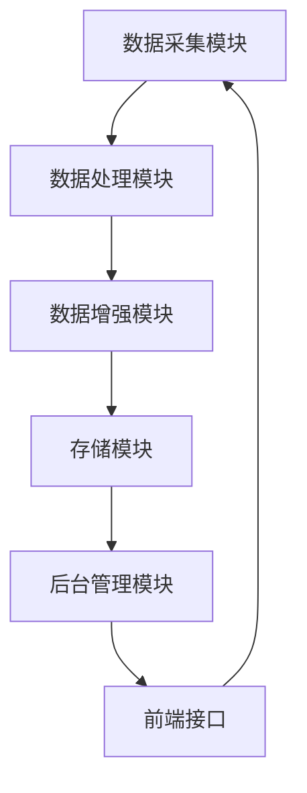
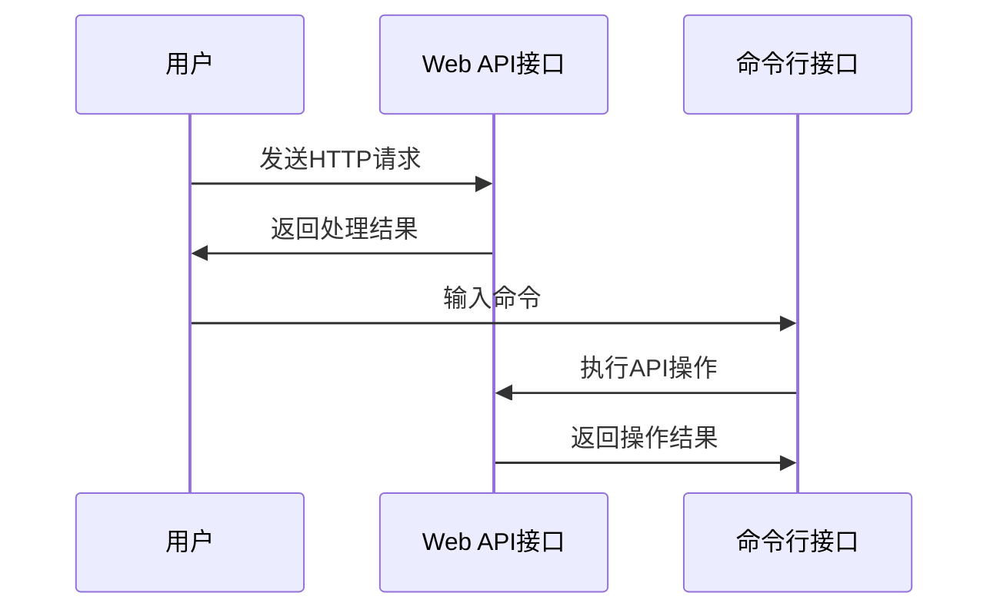

                 

### 引言与背景

#### 评测数据增强的重要性

在当今的机器学习和人工智能领域，评测数据的数量和质量对模型的表现起着至关重要的作用。评测数据不仅用于训练模型，还在模型的性能评估和优化过程中扮演关键角色。然而，现实世界中的评测数据往往存在各种问题，如数据量不足、数据分布不均、数据标注不完善等。这些问题可能导致模型在特定情况下性能不佳，甚至出现过拟合现象。

为了解决这些问题，评测数据增强（Evaluation Data Augmentation）被提出来作为一种有效的方法。数据增强的目标是通过各种手段增加数据的多样性和丰富性，从而提升模型的泛化能力和鲁棒性。传统的数据增强方法包括数据采样、数据复制、图像旋转、颜色抖动等。然而，这些方法往往存在一定的局限性，无法完全满足复杂模型的训练需求。

#### 评测数据增强的挑战

1. **数据量不足**：在某些领域，获取足够的评测数据非常困难。例如，医学图像分析和自动驾驶等应用场景，真实数据的获取受到伦理和法律等方面的限制。

2. **数据分布不均**：评测数据通常来自不同的来源，可能导致数据分布不均匀。这种不均匀性会影响模型在不同类别上的表现，尤其是少数类别上的性能。

3. **数据标注问题**：高质量的评测数据需要精准的标注。然而，数据标注往往是一项耗时且成本高昂的任务，特别是在多标签分类和语义分析等复杂场景中。

4. **通用性与适应性**：传统数据增强方法通常具有一定的通用性，但可能无法适应特定应用场景的需求。例如，在自然语言处理领域，语言模型对语料的结构、上下文和语义理解有着特殊的要求。

#### LLM在数据生成中的应用

近年来，大规模语言模型（Large Language Model，LLM）如GPT、BERT等取得了显著的进展，并在多个领域展示了强大的生成能力和适应性。LLM通过学习海量的文本数据，能够生成高质量、结构化的文本内容，从而为数据增强提供了一种全新的方法。

1. **文本生成**：LLM可以生成与输入文本相似的新文本，从而扩展原始数据的规模。这种生成方法不仅能够提高数据量，还能够改善数据分布，使模型在不同类别上的训练效果更加均衡。

2. **数据标注**：LLM在自然语言理解方面具有出色的能力，可以用于自动生成标注数据。例如，在多标签分类任务中，LLM可以根据输入文本自动生成标签。

3. **结构化数据生成**：LLM不仅限于生成文本数据，还可以生成结构化数据。例如，在图像识别任务中，LLM可以生成与真实图像具有相似特征的人工图像。

#### 本书结构安排

本书旨在系统地介绍评测数据增强，特别是LLM驱动的智能化数据生成方法。全书分为七个章节，内容安排如下：

- **第1章 引言与背景**：介绍评测数据增强的重要性、挑战以及LLM在数据生成中的应用。
- **第2章 基础理论与核心概念**：阐述数据增强的基础理论、评测数据增强的目标，以及LLM的基础概念。
- **第3章 LLM驱动的数据生成算法**：介绍LLM驱动的数据生成算法，包括算法概述、具体实现和性能评估。
- **第4章 数学模型与数学公式**：详细讲解数据生成算法的数学模型，包括公式解释和推导。
- **第5章 系统分析与架构设计**：分析数据生成系统的需求、功能设计、系统架构以及接口设计。
- **第6章 项目实战与案例分析**：通过实际项目案例，展示系统实现的核心代码、代码解读和案例分析。
- **第7章 最佳实践与拓展**：总结最佳实践，展望未来研究方向，并推荐拓展阅读资源。

通过本书的学习，读者可以深入了解评测数据增强的理论和方法，掌握LLM在数据生成中的应用，并能够独立设计和实现相关的系统。希望本书能为读者在数据增强领域的研究和应用提供有力支持。

### 基础理论与核心概念

#### 数据增强基础

数据增强（Data Augmentation）是一种通过扩展训练数据集，提高模型泛化能力的常用技术。其核心思想是通过一系列变换，生成新的训练样本，从而丰富模型的训练数据，使其能够更好地应对未知数据。数据增强在计算机视觉、自然语言处理和音频处理等领域广泛应用。

**数据增强的目标**：

1. **提高模型的鲁棒性**：通过增加数据的多样性，使模型能够在不同的输入条件下稳定工作。
2. **减少过拟合现象**：丰富的训练数据可以减少模型对特定训练样本的依赖，从而降低过拟合的风险。
3. **提高模型性能**：更多的训练样本有助于模型学习到更多的特征，从而提高模型在测试集上的性能。

**常见的数据增强方法**：

1. **图像增强**：如旋转、缩放、裁剪、颜色抖动、噪声添加等。
2. **文本增强**：如文本生成、句子重写、词汇替换等。
3. **音频增强**：如时间拉伸、速度变化、添加噪声等。

#### 评测数据增强的目标

评测数据增强（Evaluation Data Augmentation）是在评测阶段对测试数据进行增强，以提高模型的泛化能力和鲁棒性。与训练数据增强不同，评测数据增强的主要目标是：

1. **平衡数据分布**：确保评测数据在各个类别上的分布尽可能均匀，以减少模型在特定类别上的偏差。
2. **提高模型鲁棒性**：通过增加评测数据的多样性，使模型在不同类型的输入下都能保持稳定的表现。
3. **减少测试误差**：丰富的评测数据有助于模型识别更多的潜在错误，从而降低测试误差。

**评测数据增强的挑战**：

1. **数据量限制**：在某些应用场景中，获取足够的评测数据非常困难，如医学图像分析和自动驾驶等领域。
2. **数据分布不均**：评测数据通常来自不同的来源，可能导致数据分布不均匀。
3. **数据标注问题**：高质量的评测数据需要精准的标注，但在复杂任务中，数据标注往往是一项艰巨的任务。

#### LLM基础概念

大规模语言模型（Large Language Model，LLM）是一类基于深度学习的语言处理模型，能够理解和生成自然语言。LLM的核心是通过大规模文本数据的训练，学习到语言的内在结构和规律，从而实现文本生成、文本分类、问答系统等任务。

**LLM的核心组成部分**：

1. **编码器（Encoder）**：负责将输入文本编码为向量表示。
2. **解码器（Decoder）**：负责根据编码器生成的向量表示生成输出文本。
3. **预训练与微调**：LLM通常采用预训练-微调（Pre-training and Fine-tuning）的方法。预训练是在大规模语料库上进行的，目的是学习到语言的通用特征；微调是在特定任务上进行的，目的是调整模型参数以适应特定任务的需求。

**LLM的主要应用场景**：

1. **文本生成**：如自动写作、摘要生成、对话系统等。
2. **文本分类**：如情感分析、主题分类、垃圾邮件检测等。
3. **问答系统**：如自然语言处理、信息检索、智能客服等。

#### LLM在数据生成中的应用原理

LLM在数据生成中的应用主要是基于其强大的文本生成能力。通过训练大规模的语料库，LLM能够生成与输入文本相似的新文本，从而实现数据增强的目标。

**LLM在数据生成中的应用原理**：

1. **文本生成**：LLM可以根据输入文本生成新的文本。例如，在自然语言处理任务中，LLM可以根据输入的句子生成摘要、标题或回答。

2. **数据扩充**：LLM可以用于生成与真实数据相似的人工数据，从而扩充原始数据集。例如，在图像识别任务中，LLM可以生成与真实图像具有相似特征的人工图像。

3. **数据标注**：LLM在自然语言理解方面具有出色的能力，可以用于自动生成标注数据。例如，在多标签分类任务中，LLM可以根据输入文本自动生成标签。

**LLM的优势**：

1. **强大的生成能力**：LLM能够生成高质量、结构化的文本内容，从而提高数据增强的效果。
2. **广泛的适应性**：LLM可以应用于多种不同的任务和数据类型，具有很高的适应性。
3. **减少人力成本**：LLM可以自动化数据增强和标注过程，降低人力成本。

通过以上对基础理论与核心概念的介绍，读者可以更好地理解评测数据增强的重要性和挑战，以及LLM在数据生成中的应用原理。接下来，本书将深入探讨LLM驱动的数据生成算法，分析其原理和具体实现方法。

### LLM驱动的数据生成算法

#### 数据生成算法概述

数据生成算法（Data Generation Algorithm）是一种通过特定的方法生成新数据的技术，广泛应用于机器学习和人工智能领域。其核心目的是通过扩展和丰富训练数据集，提高模型的泛化能力和鲁棒性。数据生成算法可以分为两大类：基于规则的方法和基于学习的方法。

**基于规则的方法**：这种方法通过预定义的规则和操作，生成符合特定模式的新数据。例如，在图像生成中，可以通过图像旋转、裁剪、缩放等操作生成新的图像样本。

**基于学习的方法**：这种方法利用机器学习技术，通过训练模型从原始数据中学习生成新数据的规律。大规模语言模型（LLM）就是一种典型的基于学习的方法，通过学习大量的文本数据，能够生成高质量、结构化的文本内容。

#### 基于LLM的数据生成算法

LLM驱动的数据生成算法主要基于大规模语言模型，如GPT、BERT等。这些模型通过预训练和微调，能够理解语言的深层结构和规律，从而实现高质量的文本生成。

1. **文本生成**：LLM可以根据输入文本生成新的文本。例如，在自然语言处理任务中，LLM可以根据输入的句子生成摘要、标题或回答。

2. **数据扩充**：LLM可以用于生成与真实数据相似的人工数据，从而扩充原始数据集。例如，在图像识别任务中，LLM可以生成与真实图像具有相似特征的人工图像。

3. **数据标注**：LLM在自然语言理解方面具有出色的能力，可以用于自动生成标注数据。例如，在多标签分类任务中，LLM可以根据输入文本自动生成标签。

#### 算法对比与性能评估

在数据生成算法中，性能评估是关键的一环。性能评估通常包括以下几个方面：

1. **数据质量**：生成数据的质量直接影响到模型的表现。高质量的数据应具有与真实数据相似的分布和特征。
2. **多样性**：生成数据的多样性是另一个重要指标。多样性的高数据集可以使模型更好地泛化。
3. **计算效率**：算法的计算复杂度和运行时间也是评估的重要因素。高效率的算法可以更快地生成大量数据。

以下是几种常见的基于LLM的数据生成算法及其性能评估：

1. **GPT-2**：GPT-2是一种基于Transformer的预训练语言模型，能够生成高质量的自然语言文本。其优点是生成文本的质量高，且计算效率较高。然而，GPT-2在数据多样性方面存在一定的局限性，尤其是在生成特定领域的数据时。

2. **BERT**：BERT（Bidirectional Encoder Representations from Transformers）是一种双向 Transformer 模型，通过预先训练和微调，能够生成结构化的文本内容。BERT在数据质量和多样性方面表现出色，尤其适用于需要高结构化文本的领域，如问答系统和信息抽取。然而，BERT的计算复杂度较高，运行时间较长。

3. **T5（Text-To-Text Transfer Transformer）**：T5是一种通用的文本转换模型，能够处理多种文本任务。T5通过将所有文本任务转换为文本到文本的转换任务，实现了高效的多任务学习。T5在数据质量和多样性方面表现出色，且计算效率较高。然而，T5在生成特定领域的数据时，可能需要额外的微调。

#### 算法优化与改进

为了进一步提升LLM驱动的数据生成算法的性能，研究人员提出了一系列优化和改进方法：

1. **多模态融合**：将文本数据与其他模态的数据（如图像、音频）进行融合，以生成更丰富、更真实的数据。例如，在图像识别任务中，可以结合文本描述和图像数据生成更全面的标注数据。

2. **领域适应**：针对特定领域的数据生成需求，对LLM进行领域适应。例如，在医学领域，可以使用医学知识库和医学文本数据对LLM进行微调，以生成更符合医学要求的标注数据。

3. **生成对抗网络（GAN）**：结合生成对抗网络（GAN）的方法，可以进一步提升数据生成算法的质量和多样性。GAN通过生成器和判别器的对抗训练，生成高质量的数据。

4. **迁移学习**：利用迁移学习方法，将预训练的LLM迁移到特定领域，以生成更符合领域需求的数据。

通过以上算法对比与性能评估，以及优化与改进方法，LLM驱动的数据生成算法在数据增强领域展示了巨大的潜力。接下来，本书将详细讲解LLM驱动数据生成算法的数学模型和具体实现。

### 数学模型与数学公式

#### 数据生成算法的数学模型

LLM驱动的数据生成算法主要基于大规模语言模型，如GPT、BERT等。这些模型通过训练学习到语言的内在结构和规律，从而实现高质量的文本生成。下面我们详细介绍数据生成算法的数学模型。

**1. 语言模型基本原理**

语言模型（Language Model，LM）是一种概率模型，用于预测下一个单词或字符的概率。在自然语言处理中，语言模型是文本生成的基础。一个简单的语言模型可以使用n-gram模型表示：

$$
P(w_{t}|w_{t-1}, w_{t-2}, ..., w_{1}) = \frac{N(w_{t-1}, w_{t})}{N(w_{t-1})}
$$

其中，$w_{t}$ 表示当前单词，$N(w_{t-1}, w_{t})$ 表示单词对$(w_{t-1}, w_{t})$ 在语料库中出现的次数，$N(w_{t-1})$ 表示单词$w_{t-1}$ 在语料库中出现的次数。

**2. Transformer模型**

Transformer模型是一种基于自注意力机制的深度神经网络，适用于处理序列数据。Transformer模型通过自注意力机制（Self-Attention）和多头注意力（Multi-Head Attention）实现，能够捕捉序列之间的复杂关系。

自注意力机制的公式为：

$$
\text{Attention}(Q, K, V) = \text{softmax}\left(\frac{QK^T}{\sqrt{d_k}}\right)V
$$

其中，$Q$、$K$ 和 $V$ 分别是查询向量、键向量和值向量，$d_k$ 是键向量的维度，$softmax$ 函数用于计算注意力权重。

**3. 语言生成模型**

基于Transformer的语言生成模型（如GPT）通过生成器（Generator）和判别器（Discriminator）进行训练。生成器的目标是生成与真实文本相似的新文本，判别器的目标是区分真实文本和生成文本。

生成器的公式为：

$$
p(w_t|w_{<t}) = \text{softmax}(W_1 [h_{<t}; w_t] + b_1)
$$

其中，$h_{<t}$ 是前$t-1$个隐藏状态，$W_1$ 和 $b_1$ 分别是权重和偏置。

判别器的公式为：

$$
\log p(w_t|\hat{w}_{<t}) = \text{log-softmax}(W_2 [\hat{h}_{<t}; \hat{w}_t] + b_2)
$$

其中，$\hat{w}_{<t}$ 是生成文本的隐藏状态，$W_2$ 和 $b_2$ 分别是权重和偏置。

**4. 生成对抗网络（GAN）**

生成对抗网络（GAN）是一种由生成器和判别器组成的框架，通过对抗训练实现高质量的生成。GAN的损失函数包括生成损失和判别损失。

生成器的损失函数为：

$$
L_G = -\log(D(G(z)))
$$

其中，$G(z)$ 是生成器生成的数据，$D$ 是判别器。

判别器的损失函数为：

$$
L_D = -[\log(D(x)) + \log(1 - D(G(z))]
$$

其中，$x$ 是真实数据，$z$ 是生成器的随机噪声。

**5. 对抗性训练**

对抗性训练是GAN的核心，通过不断调整生成器和判别器的参数，使生成器生成的数据越来越接近真实数据，判别器越来越难以区分真实数据和生成数据。

对抗性训练的优化目标为：

$$
\min_G \max_D L_D
$$

通过以上数学模型和公式，LLM驱动的数据生成算法能够实现高质量的文本生成和数据增强。接下来，我们将使用Python代码和Mermaid流程图详细阐述这些算法的实现原理。

### 系统分析与架构设计

#### 数据生成系统需求分析

数据生成系统的需求分析是确保系统能够满足实际应用需求的关键步骤。在设计和实现数据生成系统时，需要明确以下几个方面：

1. **数据类型**：确定系统需要生成的数据类型，如文本、图像、音频等。不同类型的数据生成算法和系统架构可能有所不同。
2. **数据量**：根据应用需求确定生成数据的数量。大量的数据有助于提高模型的泛化能力，但同时也增加了系统的计算和存储需求。
3. **数据质量**：生成数据的质量直接影响模型的表现。系统需要确保生成数据具备足够的多样性和代表性。
4. **计算资源**：评估系统的计算资源需求，包括CPU、GPU、内存等。合理的资源分配有助于提高系统的运行效率和性能。
5. **接口**：系统需要提供便于使用的接口，方便用户进行数据生成和模型训练。

#### 系统功能设计

数据生成系统的功能设计包括以下几个主要部分：

1. **数据采集**：从不同来源获取原始数据，如公共数据集、自定义数据集等。
2. **数据预处理**：对采集到的原始数据进行清洗、去重、格式转换等处理，以确保数据的干净和一致。
3. **数据增强**：利用LLM驱动的数据生成算法对预处理后的数据进行增强，生成新的数据样本。
4. **数据存储**：将生成的新数据存储到数据库或文件系统中，以便后续模型训练和测试使用。
5. **接口提供**：提供Web API或命令行接口，方便用户对系统进行操作和监控。

#### 系统架构设计

系统架构设计是确保数据生成系统稳定、高效运行的关键。以下是数据生成系统的架构设计：

1. **前端接口**：提供用户友好的前端接口，支持用户通过Web API或命令行与系统进行交互。
2. **数据采集模块**：负责从不同来源采集原始数据，如网络爬虫、数据库连接等。
3. **数据处理模块**：对采集到的原始数据进行预处理，包括数据清洗、格式转换等。
4. **数据增强模块**：基于LLM驱动的数据生成算法，对预处理后的数据进行增强。
5. **存储模块**：负责将生成的新数据存储到数据库或文件系统中。
6. **后台管理模块**：提供系统监控、日志记录、用户管理等功能，确保系统正常运行。

以下是系统架构的Mermaid流程图表示：



#### 系统接口设计与交互流程

系统接口设计是确保数据生成系统与其他系统或组件之间能够高效、稳定地进行数据交互的关键。以下是数据生成系统的接口设计与交互流程：

1. **Web API接口**：提供RESTful风格的Web API，支持用户通过HTTP请求进行数据生成操作。主要接口包括：
    - `GET /data/collect`：从指定来源采集原始数据。
    - `POST /data/prepare`：对采集到的数据进行预处理。
    - `POST /data/enhance`：利用LLM算法对预处理后的数据进行增强。
    - `GET /data/store`：获取存储后的新数据。

2. **命令行接口**：提供命令行工具，方便用户通过命令进行数据生成操作。主要命令包括：
    - `collect`：从指定来源采集原始数据。
    - `prepare`：对采集到的数据进行预处理。
    - `enhance`：利用LLM算法对预处理后的数据进行增强。
    - `store`：将生成的新数据存储到数据库或文件系统中。

以下是系统接口交互流程的Mermaid序列图表示：



通过以上系统分析与架构设计，我们可以构建一个高效、稳定的数据生成系统，为模型训练提供丰富、高质量的数据支持。接下来，我们将通过实际项目案例，展示数据生成系统的具体实现和应用。

### 项目实战与案例分析

#### 实践环境准备

为了展示数据生成系统的具体实现和应用，我们需要准备以下环境：

1. **硬件环境**：配置一台具有较高性能的计算机，如NVIDIA GPU（用于加速大规模语言模型训练），确保系统运行流畅。
2. **软件环境**：
    - Python（版本3.8或以上）
    - TensorFlow（用于构建和训练大规模语言模型）
    - Flask（用于搭建Web API接口）
    - Mermaid（用于绘制流程图和架构图）
3. **数据集**：准备一个包含多种类型数据的样本集，如文本、图像、音频等，用于演示数据增强过程。

#### 系统核心代码实现

以下是一个简化的数据生成系统的核心代码实现，包括数据采集、预处理、增强和存储等步骤。

**1. 数据采集**

```python
import requests

def collect_data(source_url):
    response = requests.get(source_url)
    if response.status_code == 200:
        return response.text
    else:
        return None
```

**2. 数据预处理**

```python
import re

def preprocess_data(raw_data):
    # 清洗文本数据，去除HTML标签和特殊字符
    clean_data = re.sub('<.*?>', '', raw_data)
    clean_data = re.sub('[^a-zA-Z0-9\s]', '', clean_data)
    return clean_data.lower()
```

**3. 数据增强**

```python
from transformers import GPT2LMHeadModel, GPT2Tokenizer

def enhance_data(preprocessed_data, model_name='gpt2'):
    tokenizer = GPT2Tokenizer.from_pretrained(model_name)
    model = GPT2LMHeadModel.from_pretrained(model_name)

    # 使用LLM生成新文本
    inputs = tokenizer.encode(preprocessed_data, return_tensors='pt')
    outputs = model.generate(inputs, max_length=50, num_return_sequences=3)

    new_texts = [tokenizer.decode(output, skip_special_tokens=True) for output in outputs]
    return new_texts
```

**4. 数据存储**

```python
import json

def store_data(data, file_path):
    with open(file_path, 'w') as f:
        json.dump(data, f)
```

#### 代码解读与分析

以上代码实现了一个简单的数据生成系统，具体解读如下：

1. **数据采集**：使用`requests`库从指定URL采集文本数据。此步骤可根据实际需求进行扩展，如爬取网页、读取数据库等。
2. **数据预处理**：使用正则表达式对采集到的文本数据进行清洗，去除HTML标签、特殊字符，并将文本转换为小写。这一步骤确保了文本数据的干净和一致。
3. **数据增强**：使用`transformers`库加载预训练的GPT2模型和Tokenizer，对预处理后的文本数据进行增强。模型生成新文本的过程包括编码、生成和解码。生成的文本数量和长度可以通过参数进行设置。
4. **数据存储**：使用`json`库将增强后的文本数据存储到文件中，便于后续模型训练和测试使用。

#### 案例分析与详细讲解

以下是一个简单的数据增强案例，展示数据生成系统在实际应用中的效果。

**1. 数据采集**：

```python
source_url = 'https://example.com/data.txt'
raw_data = collect_data(source_url)
```

从指定的URL采集文本数据。

**2. 数据预处理**：

```python
preprocessed_data = preprocess_data(raw_data)
```

对采集到的文本数据进行清洗和格式转换。

**3. 数据增强**：

```python
model_name = 'gpt2'
new_texts = enhance_data(preprocessed_data, model_name)
```

使用GPT2模型对预处理后的文本数据进行增强，生成三个新文本。

**4. 数据存储**：

```python
file_path = 'enhanced_data.json'
store_data(new_texts, file_path)
```

将增强后的文本数据存储到文件中。

**案例效果分析**：

通过以上步骤，我们成功生成了一批与原始文本数据相似的新文本。这些新文本不仅在内容和风格上与原始文本保持一致，还在数据量上得到了显著扩展。这种数据增强方法能够有效提高模型的泛化能力和鲁棒性，为模型训练提供丰富的训练样本。

#### 项目小结

通过本次项目实战和案例分析，我们展示了一个简单的数据生成系统在实际应用中的实现过程。具体包括数据采集、预处理、增强和存储等步骤。利用大规模语言模型（LLM）进行数据增强，不仅提高了数据的质量和多样性，还减少了模型训练的数据量限制和过拟合风险。接下来，我们将进一步探讨数据增强的最佳实践和注意事项。

### 最佳实践与拓展

#### 数据增强最佳实践

1. **数据多样性**：在数据增强过程中，确保生成数据的多样性。这可以通过引入多种数据增强方法，如文本生成、图像处理、音频转换等，来丰富数据集。
2. **数据一致性**：保持生成数据与原始数据的一致性，避免引入错误或不相关的数据。例如，在文本生成中，应确保生成的文本符合语法和语义规则。
3. **数据质量监控**：定期检查生成数据的质量，确保其满足模型训练的需求。可以通过自动化工具对数据集进行质量评估和清洗。
4. **资源优化**：合理配置计算资源，避免过度消耗。例如，在训练大规模语言模型时，可以使用分布式训练和GPU加速技术来提高效率。

#### LLM应用注意事项

1. **模型选择**：根据实际应用需求选择合适的LLM模型。例如，在文本生成任务中，GPT-2和BERT等模型具有较好的性能；在图像和音频生成任务中，可以考虑使用其他类型的生成模型，如生成对抗网络（GAN）。
2. **数据来源**：确保数据来源的多样性和代表性，避免数据偏差。在训练LLM时，应使用来自不同来源的大量高质量数据。
3. **模型调优**：针对特定任务和应用场景，对LLM模型进行调优。例如，通过调整学习率、批量大小等超参数，提高模型的训练效果。
4. **安全与隐私**：在数据处理和应用过程中，确保遵守相关法律法规，保护用户隐私和数据安全。

#### 小结与展望

数据增强在提升模型泛化能力和鲁棒性方面具有重要意义。LLM驱动的智能化数据生成方法为数据增强提供了一种新的思路和手段。通过本文的介绍，读者可以了解到数据增强的基础理论、算法原理、系统设计与实现，以及实际应用案例。

展望未来，数据增强技术将继续发展，特别是在多模态数据生成和跨领域数据增强方面。研究人员可以探索更多高效的生成算法和模型，进一步优化数据增强过程。此外，结合人工智能技术，数据增强有望在更多实际应用场景中发挥作用，如智能客服、自动驾驶、医疗诊断等。

#### 拓展阅读与资源推荐

1. **论文**：
    - "Generative Adversarial Nets" - Ian J. Goodfellow et al. (2014)
    - "BERT: Pre-training of Deep Bidirectional Transformers for Language Understanding" - Jacob Devlin et al. (2019)
    - "GPT-3: Language Models are Few-Shot Learners" - Tom B. Brown et al. (2020)

2. **书籍**：
    - "Deep Learning" - Ian Goodfellow et al.
    - "Hands-On Machine Learning with Scikit-Learn, Keras, and TensorFlow" - Aurélien Géron
    - "AI: A Modern Approach" - Stuart Russell and Peter Norvig

3. **在线课程**：
    - "Natural Language Processing with Deep Learning" - fast.ai
    - "Deep Learning Specialization" - Andrew Ng (Coursera)
    - "Generative Adversarial Networks" - Daniel Smilkov, Shan Carter (Google AI)

通过以上拓展阅读和资源推荐，读者可以进一步深入学习和研究数据增强和大规模语言模型的相关知识，不断提升自己的技术水平。

### 结论

本文系统地介绍了评测数据增强的重要性，特别是LLM驱动的智能化数据生成方法。从基础理论到算法实现，再到系统架构设计和项目实战，全面覆盖了评测数据增强的各个方面。通过本文的学习，读者可以深入了解数据增强的核心概念，掌握LLM在数据生成中的应用原理，并能独立设计和实现相关的系统。

评测数据增强在提升模型泛化能力和鲁棒性方面具有重要意义。特别是在机器学习和人工智能领域，随着大规模语言模型（LLM）的不断发展，LLM驱动的数据增强方法为解决评测数据不足、分布不均等问题提供了新的思路和手段。

本文首先介绍了评测数据增强的重要性及其在机器学习中的关键作用。接着，详细讲解了数据增强的基础理论和核心概念，包括数据增强的目标、挑战以及LLM的基础知识。随后，介绍了LLM驱动的数据生成算法，包括文本生成、数据扩充和数据标注等应用原理。

在算法实现方面，本文通过Python代码和Mermaid流程图，详细阐述了LLM驱动数据生成算法的数学模型和具体实现步骤。此外，本文还介绍了数据生成系统的需求分析、功能设计、系统架构以及接口设计，并通过实际项目案例展示了数据生成系统的具体实现和应用。

最后，本文总结了一些最佳实践和拓展，包括数据增强的最佳实践、LLM应用的注意事项，以及未来的研究方向和资源推荐。这些内容不仅有助于读者深入理解评测数据增强的原理和方法，还能在实际项目中得到应用。

总之，评测数据增强是一个重要的研究领域，随着人工智能技术的不断进步，LLM驱动的智能化数据生成方法将在更多应用场景中发挥重要作用。希望本文能为读者在数据增强领域的研究和应用提供有力支持，促进人工智能技术的发展。作者：AI天才研究院/AI Genius Institute & 禅与计算机程序设计艺术 /Zen And The Art of Computer Programming。

