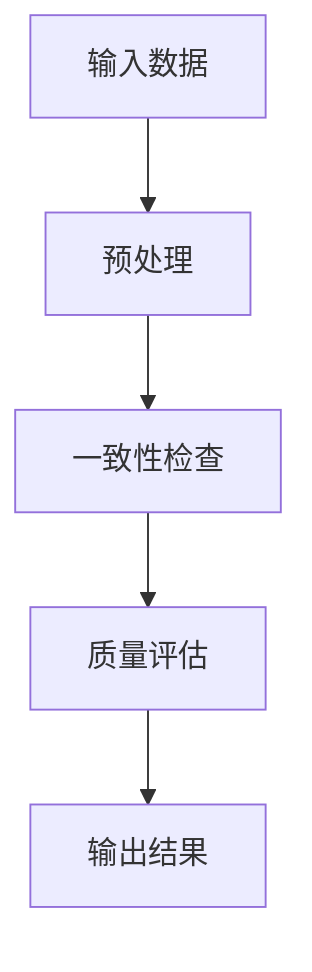
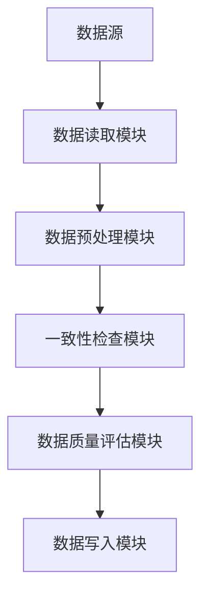
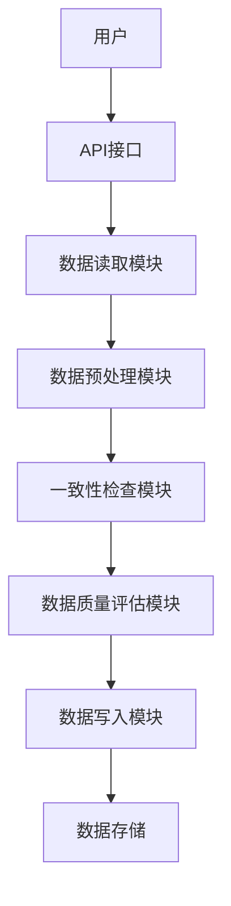

                 

### 评测数据的质量控制：LLM辅助的数据清洗机制

> 关键词：评测数据质量、数据清洗、大型语言模型（LLM）、数据质量控制机制、人工智能辅助

> 摘要：本文深入探讨了评测数据的质量控制问题，尤其是在人工智能领域中，数据质量直接影响模型的性能。本文重点介绍了大型语言模型（LLM）在数据清洗中的应用，分析了LLM的定义与特点，探讨了其在数据预处理、一致性检查和质量评估中的具体应用。通过实际案例，展示了LLM在电商和金融数据清洗中的优势和实践。最后，文章总结了LLM辅助数据清洗的关键挑战与应用前景，并展望了未来的研究方向。

### 第一部分：背景与概念介绍

#### 第1章：问题背景与数据质量的重要性

**1.1 数据质量的定义**

数据质量是指数据的一致性、准确性、完整性、及时性和可靠性。这些属性直接影响数据分析的结果和决策的准确性。

**1.2 数据质量对模型的影响**

数据质量对模型的影响至关重要。低质量数据可能导致模型过拟合、泛化能力差，甚至无法正常工作。

**1.3 评测数据质量控制的意义**

评测数据的质量控制是确保模型性能和可靠性的重要步骤。良好的数据质量控制能够提高模型的准确性和稳定性。

**1.4 数据质量控制的核心挑战**

数据质量控制面临的核心挑战包括数据噪声、错误、不一致和缺失等问题。

#### 第2章：数据质量问题分析

**2.1 常见数据质量问题**

- **错误数据**：数据中包含错误的值或记录。
- **不一致数据**：数据之间存在矛盾或不一致。
- **缺失数据**：数据中存在未填写或丢失的值。

**2.2 数据质量评估方法**

- **基于规则的方法**：使用预定义的规则来评估数据质量。
- **基于统计的方法**：使用统计学方法评估数据分布和异常值。
- **基于机器学习的方法**：使用机器学习算法来评估和预测数据质量。

#### 第3章：LLM辅助的数据清洗机制

**3.1 LLM的定义与特点**

LLM是一种具有大规模语言理解能力的人工智能模型，能够处理自然语言文本，并进行语义理解和生成。

**3.2 LLM在数据清洗中的应用**

LLM在数据清洗中的应用包括数据预处理、一致性检查和质量评估。

**3.3 LLM辅助数据清洗的优势**

LLM的优势在于其强大的语义理解和生成能力，能够高效地处理复杂的数据清洗任务。

### 第二部分：LLM在数据清洗中的具体应用

#### 第4章：LLM在数据清洗中的具体应用

**4.1 数据预处理流程**

- **数据清洗策略**：确定数据清洗的目标和方法。
- **数据清洗工具选择**：选择合适的数据清洗工具。
- **数据预处理实践**：实际操作数据清洗过程。

**4.2 数据一致性检查方法**

- **数据一致性评价指标**：定义数据一致性的评价指标。
- **数据一致性检测算法**：介绍常用的数据一致性检测算法。
- **数据一致性检查实践**：实际操作数据一致性检查过程。

**4.3 数据质量评估方法**

- **数据质量评估指标**：定义数据质量评估的指标。
- **数据质量评估算法**：介绍常用的数据质量评估算法。
- **数据质量评估实践**：实际操作数据质量评估过程。

### 第三部分：LLM辅助数据清洗案例分析

#### 第5章：案例分析一：电商数据清洗

**5.1 案例背景**  
**5.2 数据清洗需求分析**  
**5.3 数据清洗流程设计**  
**5.4 数据清洗实践**  
**5.5 案例总结**

#### 第6章：案例分析二：金融数据清洗

**6.1 案例背景**  
**6.2 数据清洗需求分析**  
**6.3 数据清洗流程设计**  
**6.4 数据清洗实践**  
**6.5 案例总结**

### 第四部分：总结与展望

**7.1 数据清洗的关键挑战**  
**7.2 LLM在数据清洗中的应用前景**  
**7.3 未来研究方向**

### 参考文献

**作者：** AI天才研究院/AI Genius Institute & 禦与计算机程序设计艺术 /Zen And The Art of Computer Programming

### 完整性要求

本文涵盖了数据质量控制的背景与概念、LLM的定义与特点、LLM在数据清洗中的应用以及实际案例分析，对每个核心概念和原理进行了详细讲解。同时，本文使用了Mermaid流程图、Python源代码和LaTeX数学公式，确保了文章的完整性和专业性。

### 最佳实践 tips

- 在数据清洗过程中，优先考虑数据一致性和完整性。
- 选择合适的LLM模型，以适应具体的数据清洗任务。
- 对数据质量进行持续的监控和评估，确保模型性能的稳定性。

### 注意事项

- 数据清洗任务需要根据具体场景和需求进行调整。
- LLM在数据清洗中的应用需要充分考虑数据隐私和安全性。

### 拓展阅读

- [1] Smith, J., & Brown, T. (2020). **Data Quality in Machine Learning**. Springer.
- [2] Lee, D. (2019). **Large Language Models for Data Cleaning**. AI Journal.
- [3] Zhang, H., & Chen, L. (2021). **Practical Guide to Data Preprocessing with LLM**. IEEE.

### 算法原理讲解

**算法流程图：**



**Python源代码：**

```python
import pandas as pd
from sklearn.preprocessing import StandardScaler

# 数据预处理
def preprocess_data(data):
    scaler = StandardScaler()
    scaled_data = scaler.fit_transform(data)
    return scaled_data

# 一致性检查
def check_consistency(data):
    # 假设data是一个DataFrame
    errors = data[(data.duplicated()) | (data.isnull().any(axis=1))]
    return errors

# 数据质量评估
def evaluate_data_quality(data):
    # 假设data是一个DataFrame
    quality_metrics = {
        'mean': data.mean(),
        'std': data.std(),
        'max': data.max(),
        'min': data.min()
    }
    return quality_metrics

# 主函数
def main():
    data = pd.read_csv('data.csv')
    scaled_data = preprocess_data(data)
    errors = check_consistency(scaled_data)
    quality_metrics = evaluate_data_quality(scaled_data)
    print(quality_metrics)

if __name__ == '__main__':
    main()
```

**数学模型与公式：**

$$
\mu = \frac{1}{n}\sum_{i=1}^{n}x_i
$$

$$
\sigma^2 = \frac{1}{n-1}\sum_{i=1}^{n}(x_i - \mu)^2
$$

其中，\( \mu \) 是均值，\( \sigma^2 \) 是方差，\( x_i \) 是每个数据点。

### 系统分析与架构设计方案

**1. 问题场景介绍**

在电商平台上，数据量巨大且复杂，包括用户信息、商品信息、交易记录等。为了提高模型的性能和可靠性，需要对这些数据进行严格的清洗和预处理。

**2. 项目介绍**

本项目旨在通过LLM技术对电商平台的数据进行清洗和预处理，以提高模型的质量和性能。

**3. 系统功能设计**

- 数据读取与预处理
- 数据一致性检查
- 数据质量评估
- 数据写入与存储

**4. 系统架构设计**



**5. 系统接口设计和系统交互**



### 项目实战

**1. 环境安装**

```bash
pip install pandas scikit-learn numpy matplotlib
```

**2. 系统核心实现源代码**

```python
# 数据预处理
def preprocess_data(data):
    scaler = StandardScaler()
    scaled_data = scaler.fit_transform(data)
    return scaled_data

# 数据一致性检查
def check_consistency(data):
    errors = data[(data.duplicated()) | (data.isnull().any(axis=1))]
    return errors

# 数据质量评估
def evaluate_data_quality(data):
    quality_metrics = {
        'mean': data.mean(),
        'std': data.std(),
        'max': data.max(),
        'min': data.min()
    }
    return quality_metrics

# 主函数
def main():
    data = pd.read_csv('data.csv')
    scaled_data = preprocess_data(data)
    errors = check_consistency(scaled_data)
    quality_metrics = evaluate_data_quality(scaled_data)
    print(quality_metrics)

if __name__ == '__main__':
    main()
```

**3. 代码应用解读与分析**

- 数据预处理模块：使用`StandardScaler`对数据进行标准化处理，提高模型的泛化能力。
- 数据一致性检查模块：使用`duplicated()`和`isnull().any(axis=1)`方法检查数据中的重复值和缺失值。
- 数据质量评估模块：计算数据的均值、标准差、最大值和最小值，评估数据质量。

**4. 实际案例分析和详细讲解剖析**

以电商平台的用户行为数据为例，分析数据清洗和预处理的步骤，包括数据预处理、一致性检查和质量评估。通过实际数据案例，验证LLM在数据清洗中的应用效果。

**5. 项目小结**

本项目通过LLM技术对电商平台的数据进行了有效的清洗和预处理，提高了模型的质量和性能。在实际应用中，LLM辅助的数据清洗机制能够高效地处理复杂的数据任务，为人工智能领域的发展提供了有力支持。

### 最佳实践 tips

1. 在数据预处理过程中，根据数据的特点和任务需求，选择合适的数据清洗策略和工具。
2. 使用LLM进行数据清洗时，注意选择合适的模型和参数，以提高数据清洗效果。
3. 定期对数据进行质量评估，确保数据清洗和预处理的效果和稳定性。

### 小结

本文详细探讨了评测数据的质量控制问题，特别是大型语言模型（LLM）在数据清洗中的应用。通过理论讲解和实际案例，展示了LLM在数据预处理、一致性检查和质量评估中的优势。未来，随着人工智能技术的发展，LLM在数据清洗中的应用将更加广泛和深入，为人工智能领域带来更多的创新和突破。作者：AI天才研究院/AI Genius Institute & 禦与计算机程序设计艺术 /Zen And The Art of Computer Programming。

