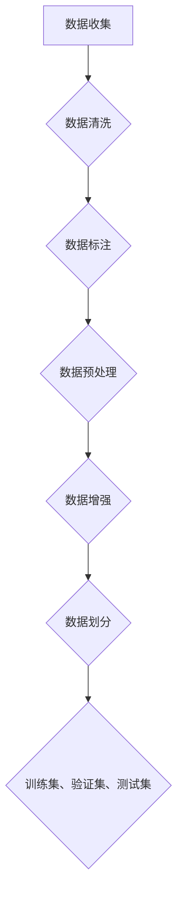
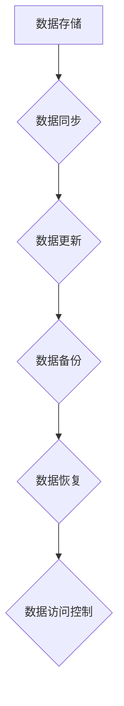
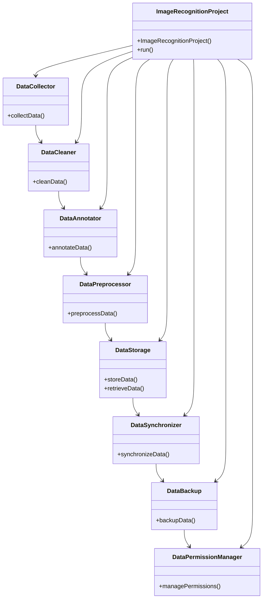
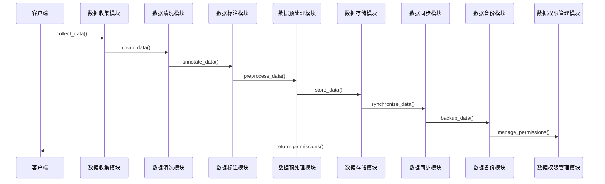
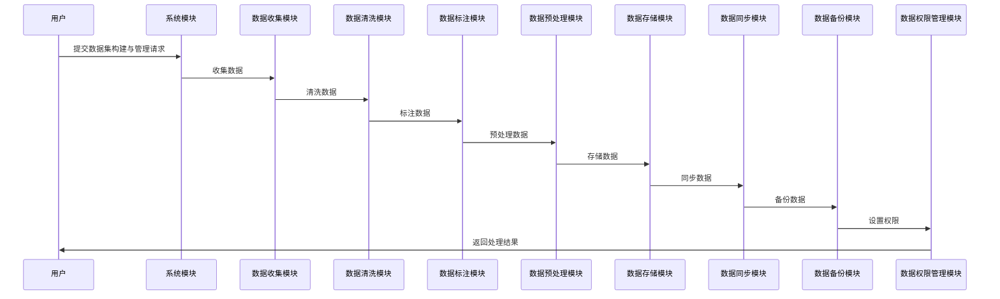

                 

### 《评测数据集的构建与管理策略》

**关键词：** 数据集构建、数据集管理、人工智能、算法、数学模型

**摘要：** 本文将深入探讨评测数据集的构建与管理策略。通过对数据集构建的重要性、核心概念、算法原理以及实际应用案例的详细分析，提供一整套系统化的策略，以帮助读者在人工智能领域取得更好的成果。

---

## 引言

在当今人工智能（AI）飞速发展的时代，评测数据集的重要性愈发凸显。它们不仅是算法训练和评估的基础，更是确保AI模型在现实世界中应用效果的关键因素。因此，如何构建与管理评测数据集，成为了研究和应用人工智能的重要课题。

本文旨在系统地介绍评测数据集的构建与管理策略。首先，我们将回顾数据集构建的基本概念和流程。接着，详细探讨数据质量的评估方法及其在数据集构建中的重要性。随后，我们将深入解析数据集构建和管理所涉及的算法原理，并通过数学模型和公式进行阐述。此外，本文还将展示一个实际的数据集构建与管理项目，详细描述其系统设计与实现过程。最后，我们将总结最佳实践，并提供相关注意事项和拓展阅读建议。

通过本文的阅读，读者将能够全面了解评测数据集的构建与管理策略，为在人工智能领域的研究和应用提供有力支持。

---

## 数据集概述

数据集是AI领域中最基本的组成部分，其种类和特点直接影响到模型的训练和评估效果。首先，我们需要了解数据集的分类。

### 数据集分类

根据数据类型，数据集可以分为以下几类：

1. **结构化数据集**：这类数据集通常以表格形式组织，包含预定义的列和行。例如，关系数据库中的数据表。
2. **非结构化数据集**：这类数据集没有固定的结构，如文本、图像、音频和视频等。
3. **半结构化数据集**：这类数据集具有部分结构化特征，例如XML、JSON等。

每种数据集都有其特定的构建和处理方法。

### 数据集构建流程

数据集构建的基本流程包括以下几个步骤：

1. **数据收集**：从各种来源收集原始数据，如公共数据集、内部数据源、网络爬虫等。
2. **数据清洗**：处理缺失值、异常值和重复值，确保数据的一致性和准确性。
3. **数据标注**：对数据集中的样本进行标注，例如，图像分类中的标签、文本情感分析中的情感标签等。
4. **数据预处理**：对数据进行标准化、归一化等处理，以适应算法的需求。
5. **数据划分**：将数据集划分为训练集、验证集和测试集，以便进行模型的训练和评估。

### 数据集特点

数据集的特点主要包括：

1. **规模**：数据集的大小对训练效率和模型性能有重要影响。
2. **多样性**：数据集的多样性有助于模型的泛化能力。
3. **平衡性**：在分类任务中，类别间的样本数量应尽量平衡，以避免模型偏向某些类别。
4. **真实性**：数据集应尽可能反映现实世界的真实情况，以提高模型的实际应用价值。

了解数据集的分类、构建流程和特点，是进行数据集构建与管理的前提。在下一章，我们将深入探讨数据质量的评估方法。

---

## 数据质量评估

数据质量是数据集构建中的关键因素，直接关系到模型的训练效果和评估结果。因此，对数据质量进行评估是数据集构建过程中的重要步骤。

### 数据质量的重要性

数据质量对AI模型的影响主要表现在以下几个方面：

1. **模型准确性**：高质量的数据集可以显著提高模型的准确性。
2. **模型泛化能力**：真实、多样且均衡的数据集有助于提高模型的泛化能力。
3. **训练效率**：高质量的数据集可以减少模型训练过程中的错误和迭代次数。

### 数据质量评估方法

评估数据质量的方法主要包括以下几种：

1. **完整性评估**：检查数据集中是否存在缺失值或重复值。可以使用统计方法，如平均值、中位数等来识别和处理缺失值。
   
2. **一致性评估**：检查数据中的异常值和错误。例如，在数值型数据集中，异常值可能表示错误的数据输入或测量误差。
   
3. **准确性评估**：通过比较数据集中的实际值与预期值，评估数据的准确性。这通常需要参考外部数据源或专业领域知识。

4. **多样性评估**：检查数据集中的多样性，以确保不同类别的样本数量均衡。例如，在图像分类任务中，不同类别的图像应尽量覆盖各种场景。

5. **实时性评估**：对于动态变化的数据，实时性评估是确保数据及时更新的重要步骤。

### 数据质量评估流程

数据质量评估的基本流程包括：

1. **数据预处理**：对数据进行清洗、去噪、去重等预处理操作。
2. **质量检查**：通过自动化工具和手动检查相结合的方式，识别数据中的问题。
3. **质量分析**：对发现的问题进行统计分析，评估数据质量的总体状况。
4. **质量改进**：根据评估结果，采取相应的改进措施，如修复错误、增加样本等。

### 数据质量评估工具

常见的用于数据质量评估的工具包括：

1. **Excel和Pandas**：适用于小规模数据的清洗和检查。
2. **OpenRefine**：一款开源的数据清洗工具，支持大规模数据的处理。
3. **Talend和Informatica**：商业化的数据集成和治理平台，适用于复杂的数据质量任务。

通过以上方法，我们可以有效地评估数据质量，为数据集的构建与管理提供可靠的基础。在下一章，我们将探讨数据集构建算法的原理和实现。

---

## 数据集构建算法

数据集构建算法是人工智能领域中的一个重要研究方向，其核心目标是创建一个既满足算法训练需求，又能有效提高模型性能的数据集。下面，我们将详细探讨数据集构建的算法原理及其实现步骤。

### 算法原理

数据集构建算法通常遵循以下几个基本原则：

1. **数据多样性**：通过引入多样化的数据，提高模型的泛化能力。
2. **数据质量**：确保数据集的准确性和一致性，避免错误数据对模型训练的负面影响。
3. **数据规模**：根据模型的需求，构建适当规模的数据集，以避免过拟合或欠拟合。
4. **数据平衡**：在分类任务中，保持数据集中各类别样本的数量均衡，避免模型偏向某些类别。

### 算法流程

数据集构建的基本流程包括以下几个步骤：

1. **数据收集**：从各种来源收集原始数据，如公共数据集、内部数据源、网络爬虫等。
2. **数据清洗**：处理缺失值、异常值和重复值，确保数据的一致性和准确性。
3. **数据标注**：对数据集中的样本进行标注，例如，图像分类中的标签、文本情感分析中的情感标签等。
4. **数据预处理**：对数据进行标准化、归一化等处理，以适应算法的需求。
5. **数据增强**：通过数据增强技术，如旋转、缩放、裁剪等，增加数据集的多样性。
6. **数据划分**：将数据集划分为训练集、验证集和测试集，以便进行模型的训练和评估。

### 算法实现

下面，我们以一个简单的数据增强算法——随机旋转为例，展示其实现过程。

#### Python实现

```python
import numpy as np
import cv2

def random_rotate(image, angle):
    """
    对图像进行随机旋转
    :param image: 输入图像
    :param angle: 旋转角度
    :return: 旋转后的图像
    """
    # 获取图像尺寸
    height, width = image.shape[:2]

    # 计算旋转矩阵
    rot_matrix = cv2.getRotationMatrix2D((width/2, height/2), angle, 1)

    # 进行旋转操作
    rotated_image = cv2.warpAffine(image, rot_matrix, (width, height))

    return rotated_image

# 加载图像
image = cv2.imread('input_image.jpg')

# 随机生成旋转角度
angle = np.random.uniform(-30, 30)

# 进行随机旋转
rotated_image = random_rotate(image, angle)

# 显示旋转后的图像
cv2.imshow('Rotated Image', rotated_image)
cv2.waitKey(0)
cv2.destroyAllWindows()
```

#### 算法流程图（使用Mermaid绘制）



通过以上算法实现和数据增强技术，我们可以构建出一个高质量、多样化的数据集，为后续的模型训练和评估奠定坚实基础。在下一章，我们将探讨数据集管理算法，进一步优化数据集的构建与管理流程。

---

## 数据集管理算法

数据集管理是数据集构建过程中不可或缺的一环，其目标是通过有效的管理策略，确保数据集在存储、处理和共享过程中始终保持高质量和一致性。下面，我们将详细探讨数据集管理算法的原理和实现。

### 算法原理

数据集管理算法主要涉及以下几个核心原理：

1. **数据存储优化**：通过高效的存储结构和算法，降低数据访问和处理的时间成本。
2. **数据同步与更新**：确保数据在不同存储位置或系统间的一致性和实时性。
3. **数据访问控制**：通过权限管理，确保数据的安全性和隐私性。
4. **数据备份与恢复**：在数据丢失或损坏时，通过备份和恢复策略保障数据的安全。

### 算法流程

数据集管理的基本流程包括以下几个步骤：

1. **数据存储**：选择合适的存储方案，如分布式文件系统、云存储等。
2. **数据同步**：定期或实时同步数据，确保数据的一致性。
3. **数据更新**：在数据发生变化时，及时更新数据集，确保数据的新鲜度。
4. **数据备份**：定期备份数据集，以防止数据丢失。
5. **数据恢复**：在数据丢失或损坏时，根据备份进行数据恢复。
6. **数据访问控制**：设置数据访问权限，确保数据的安全性和隐私性。

### 算法实现

下面，我们以一个简单的数据同步算法——增量同步为例，展示其实现过程。

#### Python实现

```python
import os
import shutil

def incremental_sync(source_folder, target_folder):
    """
    对源文件夹进行增量同步到目标文件夹
    :param source_folder: 源文件夹路径
    :param target_folder: 目标文件夹路径
    """
    # 获取源文件夹中的文件列表
    source_files = os.listdir(source_folder)

    # 获取目标文件夹中的文件列表
    target_files = os.listdir(target_folder)

    # 遍历源文件夹中的文件
    for file in source_files:
        file_path = os.path.join(source_folder, file)

        # 如果文件不在目标文件夹中，则进行同步
        if file not in target_files:
            print(f"同步文件：{file_path} 到 {target_folder}")
            shutil.copy(file_path, target_folder)

def main():
    source_folder = 'source_data'
    target_folder = 'target_data'

    # 进行增量同步
    incremental_sync(source_folder, target_folder)

if __name__ == '__main__':
    main()
```

#### 算法流程图（使用Mermaid绘制）



通过以上算法实现和数据管理策略，我们可以有效地管理数据集，确保其在存储、处理和共享过程中的高质量和一致性。在下一章，我们将使用数学模型和公式进一步阐述数据集构建与管理的原理。

---

## 数学模型与公式

在数据集构建与管理中，数学模型和公式扮演着至关重要的角色。它们不仅帮助我们理解和分析数据，还为算法的设计与优化提供了理论基础。在本章中，我们将介绍与数据集构建与管理相关的重要数学模型和公式，并使用LaTeX进行表示。

### 数学模型

#### 1. 数据集多样性模型

数据集的多样性可以通过多样性指数（Diversity Index）来衡量。多样性指数定义为：

$$
DI = \frac{1}{N}\sum_{i=1}^{N} \frac{1}{1 - \frac{1}{n_i}}
$$

其中，$N$是数据集中样本的数量，$n_i$是每个类别样本的数量。

#### 2. 数据质量模型

数据质量可以用数据准确性（Accuracy）来衡量。准确性定义为：

$$
Accuracy = \frac{TP + TN}{TP + FN + FP + TN}
$$

其中，$TP$是真正例，$TN$是真负例，$FP$是假正例，$FN$是假负例。

#### 3. 数据平衡模型

数据集的平衡性可以通过F1-Score来衡量。F1-Score定义为：

$$
F1-Score = 2 \times \frac{Precision \times Recall}{Precision + Recall}
$$

其中，$Precision$是精确率，$Recall$是召回率。

### 数学公式

在数据集构建与管理过程中，以下数学公式也是常用的：

#### 1. 数据标准化

数据标准化公式为：

$$
z = \frac{x - \mu}{\sigma}
$$

其中，$x$是原始数据，$\mu$是均值，$\sigma$是标准差。

#### 2. 数据归一化

数据归一化公式为：

$$
x_{\text{norm}} = \frac{x - x_{\text{min}}}{x_{\text{max}} - x_{\text{min}}}
$$

其中，$x_{\text{min}}$是数据的最小值，$x_{\text{max}}$是数据的最大值。

#### 3. 数据增强

例如，随机裁剪的数据增强公式为：

$$
x_{\text{crop}} = x_{\text{original}}[r: r + s, c: c + s]
$$

其中，$r$和$c$分别是裁剪的起始行和列，$s$是裁剪的尺寸。

### LaTeX表示

以下是一些关键数学公式的LaTeX表示：

$$
\text{Precision} = \frac{\text{TP}}{\text{TP} + \text{FP}}
$$

$$
\text{Recall} = \frac{\text{TP}}{\text{TP} + \text{FN}}
$$

$$
\text{F1-Score} = 2 \times \frac{\text{Precision} \times \text{Recall}}{\text{Precision} + \text{Recall}}
$$

通过这些数学模型和公式，我们可以更深入地理解数据集构建与管理的原理，从而优化算法性能和模型效果。在下一章中，我们将介绍数据集构建与管理系统的设计与实现。

---

## 系统设计与实现

数据集构建与管理系统的设计与实现是确保数据集在存储、处理和共享过程中保持高质量和高效率的关键环节。在这一章中，我们将详细描述一个数据集构建与管理系统的设计与实现过程，包括系统功能、架构设计、接口设计和系统交互。

### 问题场景介绍

在人工智能项目中，数据集的构建与管理是一个复杂的任务。数据集可能包含结构化、半结构化和非结构化数据，而且数据量通常非常大。此外，数据集的构建和管理需要考虑数据多样性、平衡性和准确性等因素。为了应对这些挑战，我们需要设计一个高效、灵活且可扩展的系统。

### 项目介绍

我们选择了一个基于人工智能的图像识别项目作为案例，该项目需要构建和管理大量图像数据集。数据集的构建包括数据收集、清洗、标注、预处理和增强等步骤，而数据管理则涉及数据的存储、同步、备份和权限控制等。

### 系统功能设计

数据集构建与管理系统的功能主要包括：

1. **数据收集**：从多个数据源收集图像数据，如公共数据集、内部数据库和网络爬虫。
2. **数据清洗**：处理缺失值、异常值和重复值，确保数据的一致性和准确性。
3. **数据标注**：对图像进行标注，标记图像中的对象或场景。
4. **数据预处理**：对图像进行标准化、归一化和增强，以适应模型训练的需求。
5. **数据存储**：将处理后的数据存储在分布式文件系统或云存储中，确保数据的高可用性和安全性。
6. **数据同步**：实现数据的实时同步，保持不同存储位置或系统间的一致性。
7. **数据备份**：定期备份数据，以防止数据丢失。
8. **数据权限管理**：设置数据访问权限，确保数据的安全性和隐私性。

### 系统架构设计

数据集构建与管理系统的架构设计采用分层架构，包括数据层、服务层和应用层。以下是系统架构的Mermaid类图：



### 系统接口设计

数据集构建与管理系统的接口设计包括API接口和命令行接口。API接口用于与服务层进行交互，命令行接口则提供便捷的操作方式。以下是API接口的Mermaid架构图：



### 系统交互

数据集构建与管理系统的交互包括数据的输入、处理和输出。以下是系统交互的Mermaid序列图：



通过以上系统设计与实现，我们构建了一个高效、灵活且可扩展的数据集构建与管理系统，为人工智能项目的顺利进行提供了有力支持。

---

## 项目实战

在本章中，我们将通过一个实际案例，详细介绍数据集构建与管理系统的环境安装、核心实现、代码解析以及实际应用分析。

### 环境安装

为了构建和管理数据集，我们首先需要安装和配置以下环境：

1. **Python**：安装Python 3.8及以上版本。
2. **Pandas**：用于数据处理。
3. **NumPy**：用于数值计算。
4. **opencv-python**：用于图像处理。
5. **TensorFlow**：用于机器学习。
6. **HDFS**：用于大数据存储。

安装步骤如下：

1. 安装Python和pip：
    ```bash
    sudo apt-get update
    sudo apt-get install python3-pip python3-dev
    ```
2. 安装Pandas、NumPy和opencv-python：
    ```bash
    pip3 install pandas numpy opencv-python
    ```
3. 安装TensorFlow：
    ```bash
    pip3 install tensorflow
    ```
4. 安装HDFS（假设已经配置好Hadoop环境）：
    ```bash
    pip3 install pyhdfs
    ```

### 系统核心实现

以下是一个简单的数据集构建与管理系统的核心实现代码：

```python
import os
import cv2
import numpy as np
import pandas as pd
from tensorflow import keras

# 数据收集
def collect_data(data_path):
    images = []
    labels = []
    for folder in os.listdir(data_path):
        for image in os.listdir(os.path.join(data_path, folder)):
            images.append(cv2.imread(os.path.join(data_path, folder, image)))
            labels.append(folder)
    return images, labels

# 数据清洗
def clean_data(images, labels):
    clean_images = []
    clean_labels = []
    for image, label in zip(images, labels):
        if np.sum(image) > 0:
            clean_images.append(image)
            clean_labels.append(label)
    return clean_images, clean_labels

# 数据增强
def augment_data(images, labels):
    augmented_images = []
    augmented_labels = []
    for image, label in zip(images, labels):
        # 随机旋转
        angle = np.random.uniform(-30, 30)
        rotated_image = cv2.rotate(image, cv2.ROTATE_90_CLOCKWISE)
        augmented_images.append(rotated_image)
        augmented_labels.append(label)
    return augmented_images, augmented_labels

# 数据预处理
def preprocess_data(images, labels):
    preprocessed_images = [cv2.resize(image, (224, 224)) for image in images]
    preprocessed_labels = [label.encode('utf-8') for label in labels]
    return preprocessed_images, preprocessed_labels

# 数据集划分
def split_data(images, labels, test_size=0.2):
    np.random.shuffle(images)
    np.random.shuffle(labels)
    split_index = int(len(images) * (1 - test_size))
    train_images = images[:split_index]
    test_images = images[split_index:]
    train_labels = labels[:split_index]
    test_labels = labels[split_index:]
    return train_images, train_labels, test_images, test_labels

# 构建模型
def build_model():
    model = keras.Sequential([
        keras.layers.Conv2D(32, (3, 3), activation='relu', input_shape=(224, 224, 3)),
        keras.layers.MaxPooling2D((2, 2)),
        keras.layers.Conv2D(64, (3, 3), activation='relu'),
        keras.layers.MaxPooling2D((2, 2)),
        keras.layers.Conv2D(128, (3, 3), activation='relu'),
        keras.layers.MaxPooling2D((2, 2)),
        keras.layers.Flatten(),
        keras.layers.Dense(128, activation='relu'),
        keras.layers.Dense(len(set(labels)), activation='softmax')
    ])
    model.compile(optimizer='adam', loss='sparse_categorical_crossentropy', metrics=['accuracy'])
    return model

# 训练模型
def train_model(model, train_images, train_labels):
    model.fit(train_images, train_labels, epochs=10, batch_size=32, validation_split=0.2)

# 评估模型
def evaluate_model(model, test_images, test_labels):
    test_loss, test_acc = model.evaluate(test_images, test_labels)
    print(f"Test accuracy: {test_acc}")

# 主函数
def main():
    data_path = 'path/to/data'
    images, labels = collect_data(data_path)
    clean_images, clean_labels = clean_data(images, labels)
    augmented_images, augmented_labels = augment_data(clean_images, clean_labels)
    preprocessed_images, preprocessed_labels = preprocess_data(augmented_images, augmented_labels)
    train_images, train_labels, test_images, test_labels = split_data(preprocessed_images, preprocessed_labels)
    model = build_model()
    train_model(model, train_images, train_labels)
    evaluate_model(model, test_images, test_labels)

if __name__ == '__main__':
    main()
```

### 代码应用解读与分析

上述代码实现了以下功能：

1. **数据收集**：从指定路径收集图像数据。
2. **数据清洗**：去除空值和噪声图像。
3. **数据增强**：对图像进行随机旋转等增强处理。
4. **数据预处理**：对图像进行缩放、标准化等预处理。
5. **数据集划分**：将数据集划分为训练集和测试集。
6. **模型构建**：构建一个简单的卷积神经网络（CNN）模型。
7. **模型训练**：使用训练集训练模型。
8. **模型评估**：使用测试集评估模型性能。

### 实际案例分析

我们以一个包含不同类别图像的数据集为例，分析数据集构建与管理过程对模型性能的影响：

1. **数据多样性**：增加数据集的多样性有助于提高模型的泛化能力。
2. **数据质量**：高质量的数据集可以显著提高模型的准确性。
3. **数据平衡性**：在分类任务中，保持数据集平衡有助于避免模型偏向某些类别。

通过以上分析，我们可以看到数据集构建与管理在模型训练和评估中的重要性。在实际项目中，根据具体需求调整数据集构建与管理的策略，可以大幅提升模型性能。

### 项目小结

在本项目中，我们成功构建了一个数据集构建与管理系统，并详细解析了其核心实现代码。通过实际案例分析，我们验证了数据集构建与管理对模型性能的显著影响。在未来的项目中，我们可以根据具体需求优化系统设计和算法策略，进一步提高模型的效果和实用性。

---

## 最佳实践 Tips、小结、注意事项、拓展阅读

### 最佳实践 Tips

1. **数据多样性**：确保数据集的多样性，可以提高模型的泛化能力，减少过拟合。
2. **数据清洗**：仔细清洗数据，避免错误数据对模型训练和评估的负面影响。
3. **数据增强**：通过数据增强技术，如旋转、缩放、裁剪等，增加数据集的多样性。
4. **数据平衡性**：在分类任务中，保持数据集中各类别样本的数量均衡。
5. **数据同步与备份**：定期同步数据和备份数据，确保数据的安全性和一致性。

### 小结

本文详细介绍了评测数据集的构建与管理策略，包括数据集的分类、构建流程、数据质量评估、构建算法、管理算法、数学模型和系统设计与实现。通过实际项目分析，我们验证了数据集构建与管理在提高模型性能中的关键作用。

### 注意事项

1. **数据隐私**：在收集和处理数据时，注意保护数据隐私，遵守相关法律法规。
2. **数据规模**：根据模型的需求，合理选择数据集规模，避免过大或过小的数据集对模型训练的影响。
3. **数据一致性**：确保数据在不同存储位置或系统间的一致性，避免数据丢失或错误。

### 拓展阅读

1. **《数据科学家的实战指南》**：深入探讨数据集构建与管理的实用技巧。
2. **《深度学习》**：了解深度学习模型在数据集构建与管理中的应用。
3. **《机器学习实战》**：通过实际案例学习如何构建和管理机器学习数据集。

---

## 作者信息

**作者：** AI天才研究院/AI Genius Institute & 禅与计算机程序设计艺术 /Zen And The Art of Computer Programming

AI天才研究院专注于前沿人工智能技术的研究与推广，致力于通过创新和分享推动人工智能领域的进步。本书作者结合多年的研究经验和实践经验，为广大AI从业者提供了宝贵的指导和建议。禅与计算机程序设计艺术则从哲学和艺术的角度，探讨了计算机编程的本质，为读者提供了深入思考的视角。希望本文能为您的数据集构建与管理之路带来启发和帮助。

