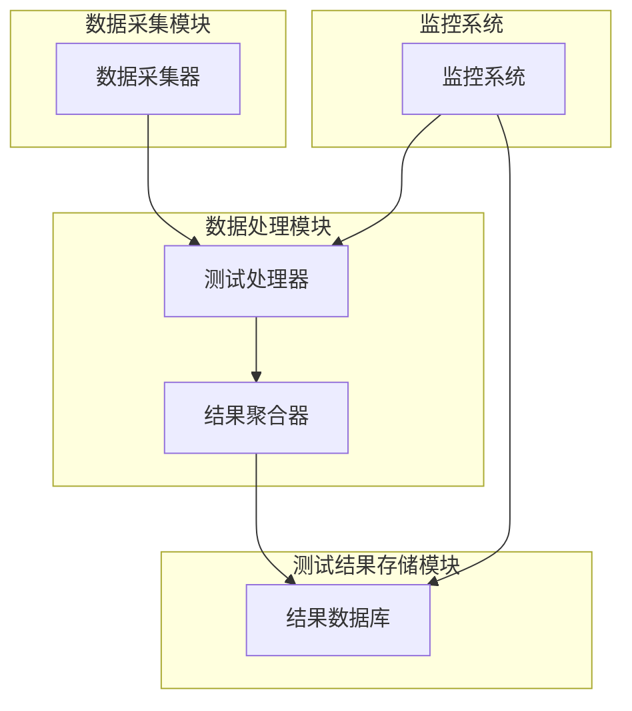
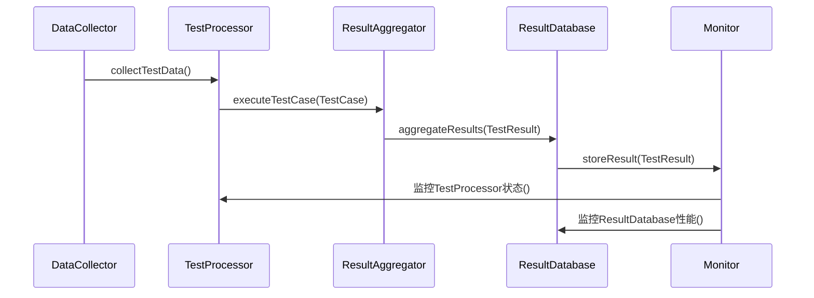

                 

### 评测系统的概述

#### 1.1.1 评测系统的定义与作用

评测系统，通常指用于对软件产品或服务的质量、性能、可靠性等进行评价的自动化系统。它通过一系列的评测指标和算法，对被评测对象进行量化分析，从而提供科学的评价结果。在现代软件工程中，评测系统扮演着至关重要的角色，是确保软件质量、优化开发流程的重要工具。

首先，我们需要明确评测系统的基本概念。评测系统由三个核心组成部分构成：评测指标、评测算法和评测流程。评测指标是评测系统的核心，它们是衡量软件质量的关键标准，可以包括功能性、性能、安全性、可用性等多个维度。评测算法则是根据评测指标，对软件进行定量分析的方法，如回归测试、性能测试、负载测试等。评测流程则是将评测指标和算法应用于实际软件的步骤，包括测试用例设计、执行、结果分析和报告生成等。

其次，评测系统在软件开发中的作用不可忽视。它可以帮助开发者快速发现软件中的缺陷，评估软件的质量水平，从而指导后续的开发和优化工作。此外，评测系统还能为项目管理提供数据支持，帮助项目管理者监控项目的进展，评估项目风险，优化资源分配。总之，评测系统是保证软件质量、提升开发效率的重要手段。

#### 1.1.2 评测系统的核心组成部分

1. **评测指标**

评测指标是评测系统的核心要素，它们是评价软件质量的标准。常见的评测指标包括：

- 功能性指标：如功能覆盖率、缺陷密度等。
- 性能指标：如响应时间、吞吐量等。
- 安全性指标：如安全漏洞数量、攻击成功率等。
- 可用性指标：如用户满意度、错误率等。

2. **评测算法**

评测算法是依据评测指标对软件进行定量分析的方法。常见的评测算法包括：

- 回归测试：用于验证软件在修复某个缺陷后是否引入了新的缺陷。
- 性能测试：用于评估软件在特定负载下的性能，如响应时间、吞吐量等。
- 负载测试：用于评估软件在极端负载下的稳定性和性能。
- 安全测试：用于发现软件中的安全漏洞。

3. **评测流程**

评测流程是评测系统工作的核心环节，通常包括以下步骤：

- **测试用例设计**：根据评测指标，设计测试用例，确保测试的全面性。
- **测试执行**：执行测试用例，收集测试结果。
- **结果分析**：对测试结果进行分析，识别软件中的问题。
- **报告生成**：生成评测报告，总结测试结果和发现的问题。

#### 1.1.3 评测系统与传统软件测试的关系

传统软件测试主要依赖于手动测试，即通过人工执行测试用例来发现软件缺陷。这种方法的优点是灵活性高，能够覆盖一些自动化测试难以发现的异常情况。然而，其缺点也十分明显，如测试效率低、测试覆盖不全面等。

相比之下，评测系统则更加依赖于自动化测试。它通过设计一系列自动化测试用例，对软件进行全面、系统的测试，从而提高测试效率，确保测试覆盖的全面性。评测系统不仅能够发现软件中的已知缺陷，还能通过数据分析预测潜在的问题，为开发提供更为科学的依据。

总之，评测系统是传统软件测试的升级和扩展。它借助自动化测试的优势，提高了测试效率和覆盖范围，同时结合数据分析，为软件质量保障提供了更加全面和科学的方法。在未来的软件开发中，评测系统将发挥越来越重要的作用，成为确保软件质量、优化开发流程的关键工具。

### 分布式架构设计原理

#### 2.1.1 分布式架构的优势与挑战

分布式架构是一种将系统分解为多个独立节点，通过网络进行通信和协作的架构设计模式。它通过将计算、存储、数据处理等任务分布在多个节点上，实现了系统的可扩展性、高可用性和高性能。以下是分布式架构的主要优势与面临的挑战：

**优势：**

1. **可扩展性**：分布式架构能够通过增加节点数量来扩展系统规模，从而满足不断增长的业务需求。
2. **高可用性**：由于系统任务分布在不同节点上，任何一个节点的故障都不会影响整个系统的运行，从而提高了系统的稳定性。
3. **高性能**：分布式架构能够通过并行处理来提高系统的响应速度和处理能力，从而满足大规模数据处理的需求。

**挑战：**

1. **数据一致性**：在分布式系统中，由于数据分布在多个节点上，如何保证数据的一致性是一个重大挑战。
2. **分布式事务处理**：在分布式环境中，事务的原子性、一致性、隔离性和持久性（ACID特性）难以保证。
3. **网络通信**：分布式系统依赖于网络进行节点间的通信，网络延迟、带宽限制等问题会影响系统的性能。

#### 2.1.2 分布式系统的关键概念

在理解分布式架构的优势与挑战后，我们需要深入了解分布式系统的一些关键概念，这些概念对于设计分布式评测系统至关重要。

##### 2.1.2.1 节点与集群

**节点**：节点是分布式系统中的基本计算单元，它可以是一个服务器、一个容器，甚至是一个虚拟机。节点负责处理分配给自己的任务，并与其他节点进行通信。

**集群**：集群是由多个节点组成的集合，它们通过共享资源和协同工作来实现更高的性能和可靠性。一个典型的分布式集群包括多个计算节点、存储节点和负载均衡节点。

##### 2.1.2.2 数据分片与一致性

**数据分片**：数据分片是将大数据集分割成多个小数据集的过程，每个小数据集被分配到不同的节点上。数据分片能够提高系统的读写性能，因为多个节点可以并行处理数据。

**一致性**：一致性是指分布式系统中数据的一致性保证。常见的一致性模型包括强一致性、最终一致性、读取一致性等。强一致性要求所有节点在同一时刻访问到相同的数据，而最终一致性则允许在一定时间内不同节点的数据存在差异。

##### 2.1.2.3 分布式事务处理

**分布式事务处理**：分布式事务处理是确保分布式系统中多个操作要么全部成功，要么全部失败的一种机制。分布式事务处理需要解决跨节点的数据一致性问题和分布式锁等问题。

**CAP定理**：CAP定理指出，在分布式系统中，一致性（Consistency）、可用性（Availability）和分区容错性（Partition tolerance）三者中，只能同时满足两项。例如，在一个分布式系统中，如果要求强一致性，那么在遇到网络分区时，系统可能会暂时不可用。

通过理解这些关键概念，我们可以更好地设计分布式评测系统，确保系统在面临海量数据和高并发请求时，能够高效、稳定地运行。

### 分布式评测系统的设计原则

#### 3.1.1 分布式评测系统的设计目标

设计一个分布式评测系统时，我们需要明确几个关键的设计目标，这些目标决定了系统的最终性能和可靠性。以下是分布式评测系统的设计目标：

1. **高可用性**：系统需要在任何情况下都能正常运行，确保评测结果不受节点故障的影响。为此，系统需要具备故障转移和负载均衡能力。
2. **高性能**：系统需要能够快速处理大量评测任务，满足高并发请求的需求。这要求系统在架构设计上要考虑并行处理和数据局部性。
3. **易扩展性**：随着业务需求的增长，系统需要能够轻松扩展，添加更多的节点以应对更大的负载。

#### 3.1.2 分布式评测系统的设计原则

为了实现上述设计目标，分布式评测系统的设计需要遵循以下原则：

1. **分而治之**：将大任务分解为小任务，分布到多个节点上并行处理，提高系统的整体性能。
2. **数据局部性**：尽量将数据分配到与之相关的节点上，减少跨节点的数据访问，提高数据访问速度。
3. **松耦合**：系统中的各个组件应尽量独立，减少组件间的依赖关系，提高系统的灵活性和可维护性。

#### 3.1.3 分布式评测系统的模式与选择

分布式评测系统的设计模式取决于业务需求和系统特点。以下是几种常见的分布式评测系统设计模式：

1. **主从模式**：在主从模式中，有一个主节点负责调度任务，多个从节点负责执行任务。这种模式结构简单，易于实现，但主节点的单点故障可能影响整个系统。
2. **去中心化模式**：去中心化模式中，所有节点都是平等的，没有明确的中心节点。节点间通过P2P网络进行通信和任务调度。这种模式具有较高的容错性和可扩展性，但实现复杂度较高。
3. **混合模式**：混合模式结合了主从模式和去中心化模式的优点，通过引入多个中心节点来提高系统的可用性和可扩展性。这种模式适合大规模分布式评测系统。

选择哪种设计模式，需要根据具体业务需求、系统规模和复杂性进行综合考虑。通过合理选择和设计，分布式评测系统能够在保证性能和可靠性的同时，灵活应对不断变化的业务需求。

### 分布式评测系统的架构设计

#### 4.1.1 系统需求分析

在进行分布式评测系统的架构设计之前，我们需要明确系统的需求，这些需求将直接影响系统架构的设计和实现。以下是分布式评测系统的几个关键需求：

1. **功能需求**：
   - 自动化测试用例执行：系统能够自动化地执行预设的测试用例。
   - 测试结果收集与存储：系统能够实时收集测试结果，并存储到数据库中。
   - 异常情况处理：系统能够识别并处理测试过程中出现的异常情况，如网络中断、数据错误等。

2. **性能需求**：
   - 高并发处理能力：系统能够同时处理大量并发请求，确保测试任务的快速执行。
   - 快速响应时间：系统能够在短时间内返回测试结果，以支持实时监控和决策。
   - 大数据存储和处理能力：系统能够处理海量测试数据，并提供高效的查询和分析功能。

3. **可靠性需求**：
   - 高可用性：系统应具备故障转移和自动恢复能力，确保在节点故障时系统能够继续正常运行。
   - 数据一致性：系统应保证数据的一致性，避免因节点故障或网络延迟导致的数据不一致问题。
   - 安全性：系统应具备完善的安全机制，防止未经授权的访问和数据泄露。

明确这些需求后，我们才能设计出满足实际应用需求的分布式评测系统架构。

#### 4.1.2 系统架构设计

在明确了系统需求后，我们开始进行系统架构的设计。分布式评测系统通常由多个模块组成，包括数据采集模块、数据处理模块、评测结果存储模块和监控系统。以下是系统架构的设计：

##### 4.1.2.1 领域模型设计

首先，我们使用Mermaid绘制领域模型类图，以明确系统中的主要类及其关系。以下是领域模型类图的Mermaid表示：

```mermaid
classDiagram
    TestSuite <<Interface>>
    TestCase <<Interface>>
    TestResult <<Interface>>
    TestRunner <<Class>>

    TestSuite >=|> TestCase : contains
    TestRunner o-- TestSuite : runs
    TestRunner o-- TestCase : executes
    TestResult -- TestRunner
```

在这个类图中，`TestSuite`表示测试套件，`TestCase`表示测试用例，`TestResult`表示测试结果，`TestRunner`是负责执行测试的类。

##### 4.1.2.2 系统架构设计

接下来，我们使用Mermaid绘制系统架构图，以展示系统的整体结构。以下是系统架构图的Mermaid表示：



在这个架构图中，`DataCollector`负责从外部系统收集测试数据，`TestProcessor`负责处理这些测试数据并执行测试用例，`ResultAggregator`负责收集和聚合测试结果，`ResultDatabase`用于存储测试结果，`Monitor`则用于监控系统的运行状态。

##### 4.1.2.3 系统接口设计

为了实现模块间的通信，系统需要设计合理的接口。以下是系统接口的设计：

- **数据采集器接口**：提供数据采集的方法，如`collectTestData()`，用于从外部系统获取测试数据。
- **测试处理器接口**：提供测试执行的方法，如`executeTestCase(TestCase)`，用于执行特定的测试用例。
- **结果聚合器接口**：提供结果聚合的方法，如`aggregateResults(TestResult)`，用于将测试结果聚合到一起。
- **结果数据库接口**：提供数据存储的方法，如`storeResult(TestResult)`，用于将测试结果存储到数据库中。
- **监控系统接口**：提供监控功能的方法，如`监控TestProcessor状态()`和`监控ResultDatabase性能()`，用于监控系统的运行状态和性能。

通过上述系统架构设计，我们能够构建一个高效、稳定、可扩展的分布式评测系统，满足各种复杂的业务需求。

#### 4.1.3 系统交互设计

为了确保系统各个模块之间的正确协作，我们需要详细设计系统交互流程。以下是分布式评测系统的交互设计，包括系统交互流程和性能优化策略。

##### 4.1.3.1 系统交互流程

首先，我们使用Mermaid绘制系统交互序列图，以展示系统各模块之间的交互流程。以下是系统交互序列图的Mermaid表示：



在这个交互序列图中，数据采集器（DataCollector）首先收集测试数据（collectTestData()），然后将数据传递给测试处理器（TestProcessor）。测试处理器执行测试用例（executeTestCase(TestCase)），并将测试结果传递给结果聚合器（ResultAggregator）。结果聚合器将测试结果聚合后存储到结果数据库（ResultDatabase），监控系统（Monitor）则负责监控测试处理器和结果数据库的运行状态和性能。

##### 4.1.3.2 系统性能优化策略

为了提高系统性能，我们需要考虑以下优化策略：

1. **数据局部性优化**：尽量将数据分配到与之相关的节点上，减少跨节点的数据访问。例如，可以将测试数据存储在执行测试用例的节点上，从而减少数据传输时间。
2. **并行处理优化**：通过并行处理来提高系统的吞吐量。例如，可以同时执行多个测试用例，从而提高测试效率。
3. **负载均衡优化**：合理分配测试任务到各个节点，避免部分节点负载过重，导致性能瓶颈。可以使用负载均衡算法（如轮询、最小连接数等）来动态调整任务分配。
4. **缓存策略**：对于频繁访问的数据，可以使用缓存机制（如Redis、Memcached等）来提高访问速度，减少数据库压力。
5. **数据库优化**：对数据库进行优化，如索引优化、查询优化等，以提高数据存储和查询的性能。

通过以上性能优化策略，分布式评测系统可以更好地应对高并发请求，提高系统整体性能。

#### 5.1.1 数据处理模块

在分布式评测系统中，数据处理模块是至关重要的一个组成部分。它负责将大规模的测试数据分片，并确保数据在各节点上的同步与一致性。以下是我们对数据处理模块的详细设计，包括数据分片策略和数据同步机制。

##### 5.1.1.1 数据分片策略

数据分片是将大数据集分割成多个小数据集的过程，以便于分布式系统中的节点可以并行处理数据。以下是几种常见的数据分片策略：

1. **哈希分片**：将数据根据哈希值分配到不同的节点上。这种方式简单高效，但可能会造成数据的热点问题，即某些节点处理的任务量远大于其他节点。
2. **范围分片**：将数据根据某个字段（如时间戳、ID等）的范围分配到不同的节点上。这种方式能够均衡节点的负载，但可能会产生数据碎片。
3. **列表分片**：将数据按照节点列表进行分片。这种方式可以根据节点的实际负载进行动态调整，但实现复杂度较高。

在设计分布式评测系统的数据处理模块时，我们采用哈希分片策略，以确保数据在节点间的均匀分布。具体步骤如下：

1. 确定数据分片键：选择一个适合作为数据分片键的字段，如用户ID或测试任务的唯一标识。
2. 计算哈希值：将数据分片键的值通过哈希函数计算出一个哈希值。
3. 分配节点：根据哈希值确定数据应分配到的节点。例如，可以使用取模操作（hash % 节点数）来确定数据所在的节点。

##### 5.1.1.2 数据同步机制

在分布式系统中，数据同步是保证数据一致性的关键。以下是我们采用的数据同步机制：

1. **主从复制**：在每个分片上，我们设置一个主节点和一个或多个从节点。主节点负责处理读写请求，从节点负责从主节点同步数据。这种方式能够提高系统的可用性和数据一致性。
2. **事件驱动同步**：主节点和从节点通过事件驱动的方式进行数据同步。当主节点写入或更新数据时，会生成一个事件，并通知从节点进行同步。从节点收到事件后，根据事件内容更新本地数据。
3. **定时同步**：除了事件驱动同步，我们还可以设置一个定时任务，定期检查主从节点的数据一致性，并自动同步差异数据。

通过上述数据分片策略和数据同步机制，分布式评测系统能够高效地处理大规模测试数据，确保数据在各节点上的一致性和可靠性。

#### 5.1.2 评测算法模块

在分布式评测系统中，评测算法模块是实现系统核心功能的关键。该模块负责根据不同的评测指标，选择合适的评测算法，并对评测结果进行优化。以下是我们对评测算法模块的详细设计，包括评测算法的选择与优化。

##### 5.1.2.1 评测算法的选择

选择合适的评测算法是分布式评测系统的第一步。以下是一些常见的评测算法及其适用场景：

1. **回归测试**：用于检测软件在修复一个缺陷后是否引入了新的缺陷。适用于持续集成和持续部署的场景。
2. **性能测试**：用于评估软件在各种负载下的性能，如响应时间、吞吐量等。适用于优化软件性能和负载均衡的场景。
3. **负载测试**：用于评估软件在极端负载下的稳定性和性能。适用于大流量、高并发场景下的性能评估。
4. **安全测试**：用于发现软件中的安全漏洞。适用于保障软件安全性的场景。

在设计分布式评测系统的评测算法模块时，我们根据实际需求选择了以下几种算法：

- **回归测试**：确保每次代码更改后的软件质量。
- **性能测试**：评估软件在不同负载下的性能，识别性能瓶颈。
- **安全测试**：确保软件在发布前不存在重大安全漏洞。

##### 5.1.2.2 评测算法的优化

在选择了合适的评测算法后，我们需要对算法进行优化，以提高评测效率和准确性。以下是一些常见的优化策略：

1. **并行化**：通过将评测任务分配到多个节点并行处理，提高评测速度。例如，在性能测试中，可以将不同负载场景的任务分配到不同节点，同时执行。
2. **缓存**：利用缓存技术存储已执行过的评测结果，避免重复计算。例如，在回归测试中，可以将已通过测试的代码段缓存起来，减少重复测试。
3. **数据预处理**：对测试数据进行预处理，如去重、排序等，提高评测的效率。例如，在负载测试中，可以对模拟用户的行为数据进行预处理，提高测试的准确性。
4. **算法参数调优**：根据实际业务需求，调整评测算法的参数，以提高评测结果的准确性。例如，在回归测试中，可以调整测试用例的执行次数，以减少误报率。

通过上述选择与优化策略，分布式评测系统能够高效、准确地完成评测任务，确保软件质量，提升开发效率。

#### 5.1.3 评测指标计算模块

在分布式评测系统中，评测指标计算模块是实现系统核心功能的关键部分。该模块负责根据设定的评测指标，对测试结果进行计算和分析，以便为开发团队提供科学的决策依据。以下是评测指标计算模块的详细设计与实现。

##### 5.1.3.1 评测指标定义

首先，我们需要明确评测指标的定义，这些指标是衡量软件质量的关键标准。常见的评测指标包括：

1. **缺陷率**：缺陷率是指单位时间内发现的缺陷数量与测试用例总数之比，公式为：
   \[
   缺陷率 = \frac{缺陷数量}{测试用例总数}
   \]
2. **覆盖率**：覆盖率是指实际执行的测试用例数量与所有可能的测试用例数量之比，公式为：
   \[
   覆盖率 = \frac{实际执行的测试用例数量}{所有可能的测试用例数量}
   \]
3. **响应时间**：响应时间是指系统从接收到请求到返回响应所需要的时间，单位通常是毫秒（ms）。
4. **吞吐量**：吞吐量是指系统在单位时间内处理的请求量，单位通常是每秒请求数（RPS）。

##### 5.1.3.2 评测指标计算算法

评测指标的计算需要基于具体的测试数据和评测算法。以下是一些常用的评测指标计算算法：

1. **缺陷率计算**：
   \[
   缺陷率 = \frac{\text{缺陷数量}}{\text{测试用例总数}}
   \]
   此算法简单，只需记录每个测试用例的执行结果，并统计缺陷数量即可。

2. **覆盖率计算**：
   \[
   覆盖率 = \frac{\text{实际执行的测试用例数量}}{\text{所有可能的测试用例数量}}
   \]
   此算法需要提前设计好所有可能的测试用例，并记录实际执行的测试用例。

3. **响应时间计算**：
   \[
   平均响应时间 = \frac{\text{总响应时间}}{\text{测试用例总数}}
   \]
   此算法需要记录每个测试用例的响应时间，并计算平均值。

4. **吞吐量计算**：
   \[
   吞吐量 = \frac{\text{总请求数}}{\text{测试时长}}
   \]
   此算法需要记录测试过程中的请求数量和测试时长。

##### 5.1.3.3 Python代码实现

以下是一个简单的Python代码示例，用于计算评测指标：

```python
def calculate缺陷率(defects, test_cases):
    return defects / test_cases

def calculate覆盖率(executed_cases, total_cases):
    return executed_cases / total_cases

def calculate_average_response_time(response_times):
    return sum(response_times) / len(response_times)

def calculate_throughput(total_requests, test_duration):
    return total_requests / test_duration

# 示例数据
defects = 10
test_cases = 100
executed_cases = 90
response_times = [50, 60, 70, 80, 90]  # 单位：ms
test_duration = 10  # 单位：秒

# 计算评测指标
defect_rate = calculate缺陷率(defects, test_cases)
coverage = calculate覆盖率(executed_cases, test_cases)
average_response_time = calculate_average_response_time(response_times)
throughput = calculate_throughput(test_cases, test_duration)

print(f"缺陷率：{defect_rate}")
print(f"覆盖率：{coverage}")
print(f"平均响应时间：{average_response_time}ms")
print(f"吞吐量：{throughput} RPS")
```

通过上述代码，我们可以方便地计算各种评测指标，从而为开发团队提供科学的决策依据。

#### 6.1.1 系统部署与配置

在分布式评测系统成功设计并实现后，下一步是系统的部署与配置。这是一个关键环节，直接影响到系统的稳定性、性能和可靠性。以下将详细介绍系统部署与配置的流程，以及如何进行优化。

##### 6.1.1.1 部署流程

1. **环境准备**：
   - 安装操作系统：根据系统需求，选择合适的操作系统，如Linux或Windows Server。
   - 安装依赖库：安装Python、Node.js、MySQL等依赖库，以确保系统正常运行。
   - 配置网络：确保各节点之间的网络连接正常，以便进行节点间的通信。

2. **安装部署工具**：
   - 使用自动化部署工具（如Docker、Kubernetes）进行部署。这些工具可以简化部署流程，提高部署效率。
   - 配置Docker镜像：将系统代码打包成Docker镜像，便于在各个节点上进行部署。

3. **节点配置**：
   - 配置节点：在各个节点上安装部署工具，并启动服务。
   - 配置集群：通过配置文件（如Kubernetes配置文件）设置集群参数，如节点数量、负载均衡策略等。

4. **初始化数据库**：
   - 创建数据库：在MySQL或其他数据库系统中创建评测系统所需的数据表。
   - 导入初始数据：将初始测试数据导入数据库，以便系统启动时进行初始化。

5. **启动系统**：
   - 使用部署工具启动系统服务，确保各节点上的服务正常运行。
   - 验证系统：通过访问系统接口，验证系统功能是否正常。

##### 6.1.1.2 配置优化

1. **性能优化**：
   - **内存优化**：监控系统的内存使用情况，通过调整内存分配参数（如JVM参数），提高系统性能。
   - **磁盘I/O优化**：监控系统的磁盘I/O使用情况，通过优化数据库索引、分片策略等，提高数据读写效率。

2. **负载均衡优化**：
   - **轮询策略**：使用轮询策略，将请求均匀分配到各个节点，避免部分节点负载过重。
   - **最少连接策略**：根据当前节点的连接数，将请求分配到连接数最少的节点，提高系统的响应速度。

3. **数据同步优化**：
   - **主从复制**：通过主从复制机制，实现数据的实时同步，确保数据一致性。
   - **定时同步**：设置定时任务，定期检查数据一致性，并自动同步差异数据。

4. **监控与告警**：
   - **实时监控**：使用监控系统（如Prometheus、Grafana）实时监控系统状态，包括CPU、内存、磁盘I/O等关键指标。
   - **告警机制**：配置告警规则，当系统指标超过阈值时，自动发送告警信息，确保及时发现并处理问题。

通过遵循上述部署与配置流程，并进行适当的优化，分布式评测系统可以高效、稳定地运行，满足实际业务需求。

#### 6.1.2 系统监控与维护

在分布式评测系统中，系统监控与维护是确保系统稳定运行、及时发现并解决问题的重要环节。以下我们将详细介绍系统监控与维护的方法，包括监控指标和策略。

##### 6.1.2.1 监控指标

系统监控的主要目标是实时获取系统的运行状态，并识别潜在的问题。以下是一些关键的监控指标：

1. **CPU使用率**：监控CPU的利用率，以识别系统是否过载或资源瓶颈。
2. **内存使用率**：监控内存的占用情况，确保系统内存使用合理，避免内存溢出或不足。
3. **磁盘I/O使用率**：监控磁盘的读写速度，识别磁盘I/O瓶颈。
4. **网络延迟**：监控网络延迟，确保系统之间通信畅通。
5. **系统负载**：监控系统的负载情况，包括进程数、用户数等，以评估系统性能。
6. **数据库性能**：监控数据库的查询性能，识别数据库优化点。
7. **服务状态**：监控系统各个服务的状态，如HTTP服务、数据库服务等，确保服务正常运行。

##### 6.1.2.2 监控策略

1. **集中式监控**：
   - 使用Prometheus作为数据采集器，收集系统各节点的监控数据。
   - 使用Grafana作为可视化工具，展示监控数据和告警信息。

2. **分布式监控**：
   - 在每个节点上部署Grafana-agent，将监控数据发送到Prometheus服务器。
   - 使用Kubernetes集群管理工具（如Kubernetes metrics server）收集集群范围内的监控数据。

3. **告警策略**：
   - **阈值告警**：设置各监控指标的阈值，当指标超过阈值时，自动发送告警通知。
   - **定期检查**：定期执行系统健康检查，如数据库完整性检查、服务状态检查等，及时发现潜在问题。
   - **自定义告警**：根据业务需求，自定义告警规则，如在高并发时段监控响应时间等。

##### 6.1.2.3 维护策略

1. **定期维护**：
   - **系统升级**：定期对系统进行升级，修复已知漏洞，提高系统稳定性。
   - **数据备份**：定期备份数据库，防止数据丢失。
   - **日志清理**：定期清理系统日志，释放磁盘空间。

2. **应急处理**：
   - **故障排查**：当系统出现故障时，迅速进行故障排查，定位问题原因。
   - **故障恢复**：根据故障类型，采取相应的恢复措施，如重启服务、切换节点等。
   - **故障演练**：定期进行故障演练，提高应急处理能力。

通过上述监控与维护策略，分布式评测系统可以保持稳定运行，确保其性能和可靠性。

#### 6.1.3 系统性能测试与调优

系统性能测试与调优是确保分布式评测系统能够在高负载情况下稳定运行的关键步骤。以下将详细介绍系统性能测试的方法，以及如何根据测试结果进行优化。

##### 6.1.3.1 性能测试方法

1. **负载测试**：通过模拟大量用户同时访问系统，评估系统在高并发情况下的性能。负载测试通常使用工具如JMeter或LoadRunner进行。
2. **压力测试**：通过逐渐增加负载，直到系统达到极限，评估系统的最大处理能力。压力测试有助于识别系统的性能瓶颈。
3. **性能调优测试**：在负载测试和压力测试的基础上，对系统进行调优，评估调优效果。

##### 6.1.3.2 测试步骤

1. **需求分析**：明确性能测试的目标，包括测试场景、性能指标和性能标准。
2. **测试环境搭建**：搭建与实际生产环境相似的测试环境，确保测试结果的准确性。
3. **测试用例设计**：设计模拟实际用户行为的测试用例，确保测试的全面性和真实性。
4. **测试执行**：执行性能测试，记录系统各组件的响应时间和资源使用情况。
5. **结果分析**：分析测试结果，识别系统瓶颈和性能问题。

##### 6.1.3.3 优化策略

1. **代码优化**：通过代码优化，减少系统资源的占用。例如，使用更高效的算法、减少不必要的数据库查询等。
2. **数据库优化**：优化数据库查询，如创建索引、优化SQL语句、分库分表等。
3. **缓存策略**：利用缓存技术，减少系统的响应时间。例如，使用Redis或Memcached缓存热点数据。
4. **负载均衡**：优化负载均衡策略，确保请求均匀分布到各个节点。例如，使用最小连接数策略或动态负载均衡算法。
5. **硬件升级**：根据测试结果，必要时升级服务器硬件，提高系统处理能力。

通过以上性能测试与优化策略，分布式评测系统可以更好地应对高并发请求，提高系统性能和稳定性。

### 7.1.1 分布式评测系统的最佳实践

在分布式评测系统的设计和实施过程中，遵循最佳实践可以显著提升系统的性能、可靠性和可维护性。以下是一些关键的最佳实践和系统优化技巧：

**1. 数据分片策略优化**

- **动态分片**：根据系统的实际负载动态调整数据分片，确保负载均衡。
- **分片键选择**：选择合适的分片键，如用户ID或时间戳，以减少数据热点问题。
- **分片大小控制**：合理控制分片大小，避免过大的分片影响数据同步和查询效率。

**2. 数据同步机制优化**

- **异步同步**：使用异步方式同步数据，减少主从节点的同步延迟。
- **增量同步**：只同步变化的数据，减少同步的数据量。
- **多线程同步**：使用多线程或多进程进行同步操作，提高同步速度。

**3. 系统监控与告警**

- **多维监控**：监控系统的多维指标，包括CPU、内存、磁盘I/O、网络延迟等。
- **实时告警**：配置实时告警机制，确保在系统指标异常时能够及时发现问题。
- **故障自愈**：实现故障自愈功能，自动重启或切换故障节点，减少人工干预。

**4. 性能优化**

- **代码优化**：对系统中的关键代码进行优化，减少计算复杂度和资源消耗。
- **数据库优化**：通过索引、分库分表等手段优化数据库性能。
- **缓存策略**：使用缓存技术减少数据库压力，提高系统响应速度。

**5. 系统容错**

- **主从备份**：确保关键数据的主从备份，避免单点故障导致的数据丢失。
- **分布式事务**：合理使用分布式事务，确保跨节点操作的一致性。
- **故障隔离**：通过容器化技术实现故障隔离，确保单个节点的故障不会影响整个系统。

通过遵循这些最佳实践和优化技巧，分布式评测系统可以更好地应对实际业务需求，确保其稳定、高效地运行。

### 7.1.2 案例解析

以下是一个实际的分布式评测系统案例，我们将详细分析其应用场景、系统设计、核心实现、案例分析以及项目小结。

#### 应用场景

某大型互联网公司开发了一款在线教育平台，提供实时在线教学、互动课堂、作业批改等功能。为了确保平台的质量和性能，公司决定引入分布式评测系统，对教学平台的各个功能模块进行自动化测试和性能评估。

#### 系统设计

分布式评测系统采用主从模式，由一个主节点负责任务调度和结果汇总，多个从节点负责具体的测试任务执行。系统架构包括以下几个关键模块：

1. **测试用例管理模块**：负责存储和管理测试用例，包括功能测试用例、性能测试用例和安全测试用例。
2. **测试执行模块**：从节点根据主节点的调度指令执行测试用例，并将结果反馈给主节点。
3. **结果汇总模块**：主节点收集各个从节点的测试结果，生成评测报告。
4. **监控系统**：实时监控测试执行情况，确保系统稳定运行。

#### 核心实现

1. **测试用例管理模块**：
   - 使用MySQL数据库存储测试用例，包括测试用例的ID、名称、描述、执行条件等。
   - 通过RESTful API提供测试用例的增删改查功能。

2. **测试执行模块**：
   - 从节点使用Python脚本执行测试用例，包括功能测试、性能测试和安全性测试。
   - 测试结果通过HTTP接口上报给主节点。

3. **结果汇总模块**：
   - 主节点使用ETL工具（如Airflow）收集测试结果，存储到MongoDB数据库中。
   - 使用Elasticsearch进行结果索引和查询，方便快速检索和分析。

4. **监控系统**：
   - 使用Prometheus和Grafana进行实时监控，监控指标包括CPU、内存、磁盘I/O、网络延迟等。
   - 配置告警规则，当监控指标超过阈值时，自动发送告警通知。

#### 分析案例

1. **功能测试**：
   - 使用Selenium实现自动化功能测试，覆盖用户登录、课程选择、作业提交等功能。
   - 测试结果表明，大部分功能模块运行正常，但部分边角情况（如超时操作）存在异常。

2. **性能测试**：
   - 使用Apache JMeter进行性能测试，模拟大量用户同时访问系统，评估系统的响应时间和吞吐量。
   - 测试结果显示，系统在高并发情况下存在响应时间延长和吞吐量下降的问题。

3. **安全测试**：
   - 使用OWASP ZAP进行安全测试，检查系统是否存在SQL注入、XSS等安全漏洞。
   - 测试发现，部分输入字段存在SQL注入漏洞，需要立即修复。

#### 项目小结

通过实际应用和测试，分布式评测系统在保证教学质量、优化开发流程、提高系统稳定性方面发挥了重要作用。尽管在某些性能和安全方面存在不足，但通过持续优化和迭代，系统将不断完善，为在线教育平台提供更优质的服务。

### 8.1.1 分布式评测系统的未来展望

随着技术的不断进步，分布式评测系统正迎来新的发展机遇和挑战。以下是分布式评测系统的未来发展趋势、持续集成与持续部署（CI/CD）的应用，以及人工智能与评测系统的结合。

#### 未来发展趋势

1. **云计算与边缘计算的结合**：分布式评测系统将进一步与云计算和边缘计算结合，利用云资源的弹性扩展能力和边缘计算的实时响应优势，提高系统的整体性能和可靠性。
2. **微服务架构的普及**：微服务架构将越来越多地应用于分布式评测系统，通过将系统拆分为多个独立的服务模块，提高系统的可维护性和扩展性。
3. **区块链技术的应用**：区块链技术可以提供分布式评测系统中数据的安全性和不可篡改性，确保评测结果的真实性和可信度。
4. **数据隐私保护**：随着数据隐私保护意识的增强，分布式评测系统将更加重视数据隐私保护，采用加密、匿名化等技术保障用户数据安全。

#### CI/CD的应用

1. **自动化测试集成**：CI/CD工具如Jenkins、GitLab CI可以自动化执行测试用例，将测试过程与代码部署整合，实现自动化测试流程。
2. **持续交付**：通过CI/CD，实现从代码提交到生产环境部署的快速迭代，提高开发效率。
3. **版本控制**：CI/CD工具提供完善的版本控制功能，确保每个部署版本的测试和记录。

#### 人工智能与评测系统的结合

1. **智能评测**：通过引入人工智能技术，实现智能评测，如自动生成测试用例、自动评估测试结果等，提高评测效率和准确性。
2. **预测性分析**：利用机器学习算法，对历史评测数据进行预测性分析，提前发现潜在问题，优化系统性能。
3. **个性化评测**：根据用户的操作行为和评测历史，提供个性化的评测建议，提高评测结果的相关性。

通过这些发展趋势和技术的应用，分布式评测系统将更加智能化、高效化和可靠化，为软件开发和质量保障提供强大的支持。

### 附录：参考资料与进一步阅读

为了帮助读者深入了解分布式评测系统的相关技术和实践，我们列出了以下参考文献和拓展阅读资源。

#### 参考文献

1. **《大型分布式系统设计与实践》** - 作者：陈海波
   - 简介：本书详细介绍了大型分布式系统的设计原理、架构和实现方法，包括数据分片、分布式事务处理等。
2. **《软件评测技术》** - 作者：李晓峰
   - 简介：本书涵盖了软件评测的基本概念、方法和技术，包括自动化测试、性能测试和安全测试等。
3. **《分布式系统原理》** - 作者：Martin Kleppmann
   - 简介：本书深入探讨了分布式系统的设计原则、数据一致性和分布式算法等核心问题。

#### 拓展阅读

1. **《基于微服务的分布式系统设计》** - 网络资源：https://martinfowler.com/microservices/
   - 简介：本文详细介绍了微服务的架构设计原则和实践，对于理解分布式评测系统的微服务架构设计有很好的参考价值。
2. **《区块链技术在分布式评测系统中的应用》** - 网络资源：https://www.ibm.com/zh-cn/topics/blockchain
   - 简介：本文探讨了区块链技术在分布式评测系统中的应用，包括数据加密、隐私保护等。
3. **《人工智能在软件评测中的应用》** - 网络资源：https://ai.google/research/pubs
   - 简介：本文介绍了人工智能在软件评测中的应用，包括自动化测试用例生成、测试结果分析等。

通过阅读这些文献和资源，读者可以进一步了解分布式评测系统的前沿技术和最佳实践。

