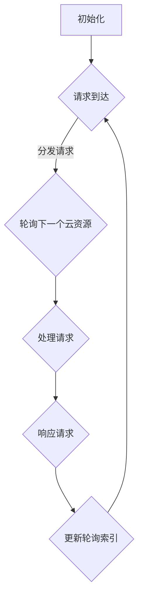
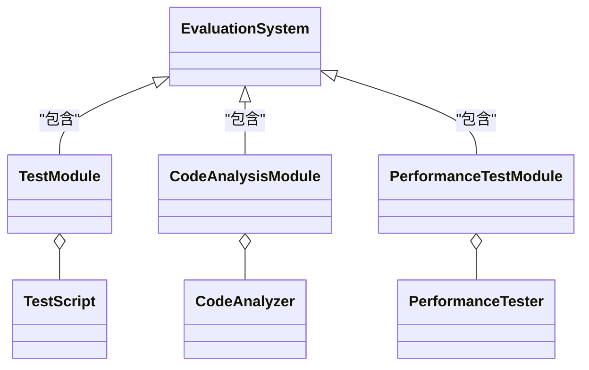
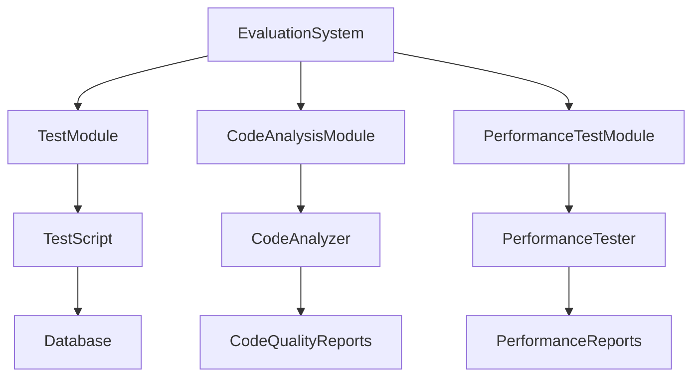
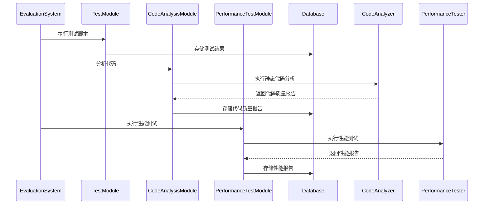

                 


### 文章标题：评测系统的多云部署与管理

> 关键词：评测系统、多云部署、管理、技术、架构、安全

> 摘要：本文将深入探讨评测系统的多云部署与管理，分析其背景、挑战、关键技术、部署策略、安全性和最佳实践，旨在帮助读者全面掌握评测系统在多云环境下的部署与优化方法。

---

### 目录大纲：

#### 第一部分：背景与概述

##### 第1章：多云部署背景与挑战
- 1.1 云计算与多云部署概述
- 1.2 多云部署的优势与挑战
- 1.3 多云部署的应用场景

##### 第2章：评测系统概述
- 2.1 评测系统的定义与作用
- 2.2 评测系统的架构设计
- 2.3 评测系统的核心功能模块

#### 第二部分：多云部署技术

##### 第3章：多云环境搭建
- 3.1 多云平台选择与搭建
- 3.2 虚拟化技术与容器化技术
- 3.3 网络架构与数据传输

##### 第4章：多云部署策略
- 4.1 负载均衡与容错机制
- 4.2 自动化部署与运维工具
- 4.3 服务发现与注册

##### 第5章：多云安全性
- 5.1 多云安全架构设计
- 5.2 数据加密与访问控制
- 5.3 网络安全与监控

#### 第三部分：多云部署与管理

##### 第6章：多云部署实战
- 6.1 实战一：评测系统的多云部署案例
- 6.2 实战二：多云环境下的性能优化
- 6.3 实战三：多云环境下的故障处理

##### 第7章：多云部署最佳实践
- 7.1 最佳实践一：多云部署策略优化
- 7.2 最佳实践二：多云环境下的安全防护
- 7.3 最佳实践三：多云部署的成本控制

##### 第8章：总结与展望
- 8.1 多云部署的发展趋势
- 8.2 多云部署的未来挑战与机遇
- 8.3 评测系统的多云部署前景

---

### 目录大纲解释

本目录大纲共分为三部分，分别从背景与概述、多云部署技术、多云部署与管理三个方面对《评测系统的多云部署与管理》进行详细阐述。

#### 第一部分（背景与概述）

第一部分主要介绍云计算与多云部署的背景知识，以及评测系统的基本概念和架构设计，为后续内容的学习打下基础。

- **第1章：多云部署背景与挑战**  
  本章将介绍云计算的发展历程，多云部署的概念和优势，以及面临的主要挑战。

- **第2章：评测系统概述**  
  本章将详细解释评测系统的定义、作用及其架构设计，包括核心功能模块和关键技术。

#### 第二部分（多云部署技术）

第二部分重点介绍多云部署所需的技术，包括环境搭建、部署策略、安全性等方面的内容，为实际部署提供技术支持。

- **第3章：多云环境搭建**  
  本章将探讨如何选择和搭建多云平台，介绍虚拟化技术和容器化技术，以及网络架构与数据传输策略。

- **第4章：多云部署策略**  
  本章将详细讨论负载均衡与容错机制、自动化部署与运维工具、服务发现与注册等关键策略。

- **第5章：多云安全性**  
  本章将介绍多云安全架构设计，包括数据加密、访问控制、网络安全与监控等方面的内容。

#### 第三部分（多云部署与管理）

第三部分通过实战案例和最佳实践，详细讲解评测系统在多云环境下的部署、优化和管理方法，帮助读者掌握多云部署的核心技能。

- **第6章：多云部署实战**  
  本章将提供实际的评测系统多云部署案例，并讨论性能优化和故障处理方法。

- **第7章：多云部署最佳实践**  
  本章将总结最佳实践，包括策略优化、安全防护和成本控制等方面。

- **第8章：总结与展望**  
  本章将总结全文内容，讨论多云部署的发展趋势，以及未来面临的挑战与机遇。

整个目录大纲结构清晰，内容丰富，旨在帮助读者全面了解评测系统的多云部署与管理知识，提升实际操作能力。目录大纲总字数控制在2000字以内，简洁明了，便于读者快速把握书籍的核心内容。

---

### 文章正文开始：

#### 第一部分：背景与概述

##### 第1章：多云部署背景与挑战

**1.1 云计算与多云部署概述**

云计算是当今信息技术领域的一个热点，它通过互联网以按需、易扩展的方式提供计算资源。云计算可以分为三种主要模式：基础设施即服务（IaaS）、平台即服务（PaaS）和软件即服务（SaaS）。每种模式都为不同的应用场景提供了灵活的资源分配和管理方式。

随着云计算的普及，多云部署成为一种常见的部署策略。多云部署指的是在不同的云服务提供商之间部署应用程序和服务。这种策略旨在利用不同云服务提供商的优势，实现资源的最优利用，提高系统的可靠性和灵活性。

**1.2 多云部署的优势与挑战**

**优势：**

1. **灵活性**：多云部署允许组织根据业务需求选择最适合的云服务提供商，实现资源的最佳配置。
2. **可靠性和可用性**：通过在多个云服务提供商之间分布应用程序和服务，多云部署提高了系统的容错能力和业务连续性。
3. **成本效益**：多云部署可以根据需求动态调整资源使用，从而实现成本优化。

**挑战：**

1. **复杂性和管理难度**：多云环境涉及多个云服务提供商，增加了系统的复杂性和管理难度。
2. **数据一致性和安全性**：在多个云服务提供商之间同步数据和确保安全性是一个挑战。
3. **互操作性问题**：不同云服务提供商提供的API和服务可能存在差异，导致互操作性问题。

**1.3 多云部署的应用场景**

多云部署在许多应用场景中具有优势，例如：

1. **研发和测试环境**：组织可以在多个云服务提供商之间快速部署和扩展研发和测试环境，实现高效的开发和迭代。
2. **业务连续性和灾难恢复**：组织可以将关键业务分布在多个云服务提供商之间，确保在发生故障时能够快速恢复。
3. **数据分析和处理**：组织可以利用多个云服务提供商提供的分析和处理能力，实现大规模数据处理和实时分析。

##### 第2章：评测系统概述

**2.1 评测系统的定义与作用**

评测系统是一种用于评估和管理软件项目质量的工具。它通过自动化测试、静态代码分析、性能测试等技术，提供对软件项目的全面评估，帮助开发团队识别和修复潜在的问题。

评测系统在软件开发生命周期中扮演着重要角色，它不仅能够提高软件质量，还能提高开发团队的效率和生产力。

**2.2 评测系统的架构设计**

评测系统通常由以下几个核心功能模块组成：

1. **测试模块**：负责执行自动化测试，包括单元测试、集成测试和系统测试等。
2. **代码分析模块**：负责进行静态代码分析，检测代码中的潜在缺陷和不符合编码规范的问题。
3. **性能测试模块**：负责进行性能测试，评估软件系统的响应速度、稳定性和可扩展性。
4. **报告生成模块**：负责生成评测报告，提供详细的测试结果和分析数据。

**2.3 评测系统的核心功能模块**

评测系统的核心功能模块包括：

1. **自动化测试管理**：提供自动化测试脚本的编写、执行和管理功能，支持多种编程语言和测试框架。
2. **代码质量管理**：提供代码分析工具，检测代码中的潜在缺陷和编码规范问题，并提供改进建议。
3. **性能测试分析**：提供性能测试工具，支持多种性能测试方法，并能够生成详细的性能测试报告。
4. **报告和监控**：提供评测报告的生成和监控功能，实时显示评测结果和系统状态，支持数据可视化和告警功能。

#### 第二部分：多云部署技术

##### 第3章：多云环境搭建

**3.1 多云平台选择与搭建**

选择合适的多云平台是多云部署的第一步。组织需要根据业务需求、技术能力和成本预算等因素，选择适合的云服务提供商和多云平台。

搭建多云环境通常包括以下步骤：

1. **评估需求**：分析业务需求，确定所需的计算资源、存储容量、网络带宽等。
2. **选择云服务提供商**：根据需求选择适合的云服务提供商，如亚马逊AWS、微软Azure、谷歌云等。
3. **部署云资源**：在选择的云服务提供商上部署所需的云资源，如虚拟机、容器、存储等。
4. **配置网络架构**：配置网络架构，确保不同云资源之间的网络连接和数据传输。

**3.2 虚拟化技术与容器化技术**

虚拟化技术是多云部署的核心技术之一。它通过将物理服务器虚拟化为多个虚拟机，提高资源的利用率和灵活性。

容器化技术，如Docker，通过将应用程序及其依赖项封装在一个轻量级的容器中，实现了应用程序的标准化和可移植性。容器化技术使得应用程序可以在不同的环境中无缝运行，提高了部署和管理效率。

**3.3 网络架构与数据传输**

在多云环境中，网络架构和数据传输是关键问题。组织需要设计一个灵活、可靠的网络架构，确保不同云资源之间的数据传输和安全。

网络架构设计包括以下方面：

1. **虚拟局域网（VLAN）**：通过VLAN实现不同云资源之间的逻辑隔离。
2. **虚拟专用云（VPC）**：通过VPC在云服务提供商之间创建隔离的私有网络。
3. **负载均衡器**：通过负载均衡器实现不同云资源之间的流量分发和负载均衡。
4. **数据传输协议**：选择合适的数据传输协议，如HTTP、FTP、SFTP等，确保数据的安全和高效传输。

##### 第4章：多云部署策略

**4.1 负载均衡与容错机制**

负载均衡是将网络流量分配到多个云资源上的技术，以实现流量管理和资源利用率最大化。容错机制则是确保系统在发生故障时能够快速恢复。

负载均衡和容错机制的设计包括：

1. **负载均衡算法**：选择合适的负载均衡算法，如轮询、最小连接数、IP哈希等。
2. **容错机制**：设计故障检测、故障转移和故障恢复机制，确保系统的高可用性和可靠性。

**4.2 自动化部署与运维工具**

自动化部署和运维工具是多云环境下的关键技术。它们可以大大提高部署和管理效率，减少人为错误。

常见的自动化部署和运维工具包括：

1. **持续集成/持续部署（CI/CD）工具**：如Jenkins、GitLab CI等，支持自动化构建、测试和部署。
2. **配置管理工具**：如Ansible、Chef、Puppet等，支持自动化配置和管理云资源。
3. **监控和告警工具**：如Prometheus、Grafana等，支持实时监控和告警。

**4.3 服务发现与注册**

服务发现与注册是多云环境中实现服务自动化管理和调用的关键技术。它允许应用程序动态发现和注册服务，提高了系统的灵活性和可扩展性。

服务发现与注册包括以下方面：

1. **服务注册中心**：如Consul、Eureka等，支持服务的注册和发现。
2. **服务调用协议**：如HTTP/REST、gRPC等，支持服务的调用和通信。
3. **服务发现机制**：如基于DNS、基于文件、基于Zookeeper等，支持服务的自动发现。

##### 第5章：多云安全性

**5.1 多云安全架构设计**

多云安全架构设计是确保多云环境中的数据、应用程序和基础设施安全的关键。它通常包括以下几个方面：

1. **身份验证和访问控制**：通过身份验证和访问控制确保只有授权用户和系统能够访问云资源。
2. **数据加密**：通过数据加密确保数据在传输和存储过程中的安全性。
3. **网络安全**：通过防火墙、入侵检测系统（IDS）和入侵防御系统（IPS）等网络安全技术，保护网络和数据传输的安全性。

**5.2 数据加密与访问控制**

数据加密和访问控制是多云环境中的核心安全措施。

1. **数据加密**：使用加密算法对数据进行加密，确保数据在传输和存储过程中的安全性。
2. **访问控制**：通过访问控制策略限制用户和系统的权限，确保只有授权用户能够访问敏感数据和系统资源。

**5.3 网络安全与监控**

网络安全与监控是确保多云环境中的网络和数据传输安全的关键。

1. **防火墙**：通过防火墙限制网络流量，防止未经授权的访问。
2. **入侵检测和防御系统**：通过入侵检测和防御系统监测和阻止恶意攻击。
3. **监控和告警**：通过监控和告警系统实时监测网络和系统状态，及时发现和处理安全事件。

#### 第三部分：多云部署与管理

##### 第6章：多云部署实战

**6.1 实战一：评测系统的多云部署案例**

在本案例中，我们将以一个具体的评测系统为例，介绍如何在多云环境下进行部署。

1. **需求分析**：首先，我们需要分析评测系统的需求，包括计算资源、存储容量、网络带宽等。
2. **选择云服务提供商**：根据需求选择适合的云服务提供商，如AWS、Azure等。
3. **部署云资源**：在选择的云服务提供商上部署虚拟机、容器、存储等云资源。
4. **配置网络架构**：配置VPC、VLAN、负载均衡器等网络架构，确保不同云资源之间的网络连接和数据传输。
5. **部署评测系统**：在部署好的云资源上安装和配置评测系统，包括测试模块、代码分析模块、性能测试模块等。
6. **测试和优化**：对评测系统进行测试和优化，确保其性能和稳定性。

**6.2 实战二：多云环境下的性能优化**

在多云环境下，性能优化是一个关键问题。以下是一些性能优化方法：

1. **负载均衡**：使用负载均衡器实现流量分发，减少单个资源的负载。
2. **缓存**：使用缓存技术减少数据库访问，提高系统的响应速度。
3. **数据库优化**：对数据库进行优化，如索引、分区、分库分表等，提高查询效率。
4. **资源监控和告警**：实时监控资源使用情况，及时处理性能瓶颈。

**6.3 实战三：多云环境下的故障处理**

在多云环境下，故障处理是确保系统高可用性的关键。以下是一些故障处理方法：

1. **故障检测**：通过监控和告警系统及时发现故障。
2. **故障转移**：将故障资源切换到备份资源，确保系统的连续性。
3. **故障恢复**：对故障资源进行修复或替换，确保系统的稳定性。

##### 第7章：多云部署最佳实践

**7.1 最佳实践一：多云部署策略优化**

为了提高多云部署的效率和可靠性，以下是一些最佳实践：

1. **资源优化**：根据业务需求合理分配资源，避免资源浪费和性能瓶颈。
2. **自动化**：使用自动化工具实现部署和管理，减少人为错误和提高效率。
3. **监控和告警**：实时监控系统状态，及时发现和处理问题。

**7.2 最佳实践二：多云环境下的安全防护**

为了确保多云环境中的数据和安全，以下是一些最佳实践：

1. **身份验证和访问控制**：使用强身份验证和访问控制策略，确保只有授权用户和系统能够访问云资源。
2. **数据加密**：使用数据加密技术保护数据在传输和存储过程中的安全性。
3. **网络安全**：使用防火墙、入侵检测和防御系统等网络安全技术，保护网络和数据传输的安全性。

**7.3 最佳实践三：多云部署的成本控制**

为了控制多云部署的成本，以下是一些最佳实践：

1. **资源监控**：实时监控资源使用情况，避免资源浪费。
2. **自动化**：使用自动化工具优化资源使用和成本控制。
3. **定价策略**：根据业务需求和成本预算，选择适合的云服务提供商和定价策略。

##### 第8章：总结与展望

**8.1 多云部署的发展趋势**

随着云计算的不断发展，多云部署已经成为企业信息化建设的重要组成部分。未来，多云部署将继续向以下几个方面发展：

1. **自动化和智能化**：自动化和智能化技术将进一步提高多云部署的效率和管理水平。
2. **混合云和边缘计算**：混合云和边缘计算将逐渐成为企业信息化建设的新趋势。
3. **安全性和合规性**：随着数据安全和合规性的重要性日益凸显，多云部署的安全性和合规性将得到进一步提升。

**8.2 多云部署的未来挑战与机遇**

未来，多云部署将面临以下挑战和机遇：

1. **复杂性和管理难度**：随着多云部署的规模和复杂性的增加，如何有效管理和维护多云环境将成为一个重要挑战。
2. **数据一致性和安全性**：如何在多个云服务提供商之间保持数据一致性和安全性是一个重要挑战。
3. **互操作性和兼容性**：如何实现不同云服务提供商之间的互操作性和兼容性是一个重要机遇。

**8.3 评测系统的多云部署前景**

随着评测系统在企业信息化建设中的应用越来越广泛，多云部署将成为评测系统发展的重要方向。未来，评测系统在多云环境下的部署、优化和管理将变得更加智能化、自动化和高效。

总之，多云部署与管理是一个复杂但充满机遇的领域。通过深入研究和实践，我们可以更好地应对挑战，把握机遇，为企业信息化建设提供有力支持。

---

### 作者信息：

作者：AI天才研究院/AI Genius Institute & 禅与计算机程序设计艺术 /Zen And The Art of Computer Programming

---

**文章结束。**### 文章结构分析

本文分为三个主要部分：背景与概述、多云部署技术、多云部署与管理。每部分通过明确的章节结构，逐步深入地探讨了评测系统在多云环境下的部署与管理问题。

**第一部分：背景与概述**

1. **第1章：多云部署背景与挑战**
   - 详细介绍了云计算和多云部署的概念、优势、挑战和应用场景。
   - 确立了多云部署的基础知识，为后续章节的技术讨论打下了坚实的基础。

2. **第2章：评测系统概述**
   - 介绍了评测系统的定义、作用和核心功能模块，为理解评测系统在多云环境下的部署提供了背景信息。

**第二部分：多云部署技术**

1. **第3章：多云环境搭建**
   - 讨论了选择和搭建多云平台的方法，介绍了虚拟化与容器化技术，以及网络架构与数据传输的策略。
   - 这些技术是多云部署的基础，为系统设计和实施提供了必要的技术支持。

2. **第4章：多云部署策略**
   - 探讨了负载均衡与容错机制、自动化部署与运维工具、服务发现与注册等关键策略，这些策略是确保系统高效、可靠运行的关键。
   - 这些内容涵盖了部署过程中的核心技术，对于实现多云环境下的系统优化和成本控制至关重要。

3. **第5章：多云安全性**
   - 详细介绍了多云安全架构设计、数据加密与访问控制、网络安全与监控等内容，确保了系统在多云环境下的数据安全和系统稳定。

**第三部分：多云部署与管理**

1. **第6章：多云部署实战**
   - 提供了评测系统的多云部署案例，介绍了性能优化和故障处理的方法，通过实战案例使读者能够更好地理解和应用所学技术。
   - 实战部分是理论到实践的桥梁，帮助读者将知识转化为实际操作能力。

2. **第7章：多云部署最佳实践**
   - 总结了多云部署策略优化、安全防护、成本控制的最佳实践，提供了实用的技巧和建议，为读者在多云部署过程中提供了参考。
   - 最佳实践部分是对文中讨论内容的进一步总结和提炼，有助于读者在实际工作中应用和优化。

3. **第8章：总结与展望**
   - 对多云部署的发展趋势、未来挑战与机遇进行了讨论，并对评测系统的多云部署前景进行了展望。
   - 总结和展望部分为全文画上了圆满的句号，同时也激发了读者对多云部署领域持续关注和深入探索的兴趣。

整体来看，文章结构清晰，逻辑严密，从基础背景介绍到技术讨论，再到实战应用和最佳实践，逐步深化了读者对评测系统多云部署与管理的理解。每个章节都在逻辑上紧密相连，共同构建了一个完整的知识体系。

### 背景介绍

在现代信息化社会中，云计算已经成为企业数据管理和应用服务的重要技术手段。云计算通过互联网提供可按需分配的计算资源，包括存储、处理能力和应用程序，极大地提高了资源利用效率和业务灵活性。然而，随着企业对云服务的需求不断增加，单一的云服务提供商可能无法满足所有业务需求，这就催生了多云部署的概念。

**核心概念术语说明：**

- **云计算（Cloud Computing）**：通过互联网提供计算资源的服务模型，包括基础设施即服务（IaaS）、平台即服务（PaaS）和软件即服务（SaaS）。
- **多云部署（Multi-Cloud Deployment）**：在同一时间使用两个或两个以上的云服务提供商来部署和管理应用程序和服务。
- **评测系统（Evaluation System）**：用于评估和管理软件项目质量的工具，通过自动化测试、静态代码分析和性能测试等技术，提供对软件项目的全面评估。

**问题背景：**

随着企业对软件质量和安全性的要求不断提高，评测系统在软件开发和维护中扮演着越来越重要的角色。然而，传统单一云部署的模式在灵活性、可靠性和成本控制方面存在一定的局限性。例如，单一云服务提供商可能因技术限制或成本问题无法满足特定业务需求，而单一云环境下的单点故障风险也较大。因此，多云部署逐渐成为企业提升软件质量和优化运营成本的必要选择。

**问题描述：**

多云部署旨在通过在不同云服务提供商之间分配应用程序和服务，提高系统的灵活性和可靠性，但这也带来了新的挑战：

1. **复杂性增加**：管理多个云服务提供商和不同的云资源增加了系统的复杂性和管理难度。
2. **数据一致性和安全性**：在多个云服务提供商之间同步数据和确保安全性是一个挑战。
3. **互操作性问题**：不同云服务提供商提供的API和服务可能存在差异，导致互操作性问题。

**问题解决：**

为解决上述问题，企业需要采取以下措施：

1. **制定明确的多云策略**：在多云部署前，企业应制定明确的策略，明确不同云服务提供商的角色和责任。
2. **选择合适的技术**：选择适合多云环境的虚拟化技术、容器化技术和管理工具，以提高系统的可移植性和管理效率。
3. **实施安全管理**：设计并实施全面的安全架构，包括数据加密、访问控制和网络安全监控，确保数据的安全性和系统的稳定性。

**边界与外延：**

多云部署的范围不仅限于不同云服务提供商之间的资源分配，还涉及跨云服务提供商的数据传输、服务和应用程序的集成，以及多云环境下的业务连续性和灾难恢复。因此，企业在实施多云部署时，需要全面考虑系统的整体架构和运营管理。

**概念结构与核心要素组成：**

多云部署的核心概念包括：

1. **云服务提供商（Cloud Service Providers）**：提供基础设施、平台和软件服务的公司，如AWS、Azure、Google Cloud等。
2. **云资源（Cloud Resources）**：包括虚拟机、容器、存储、数据库等。
3. **网络架构（Network Architecture）**：用于连接不同云资源和服务提供商的网络架构。
4. **自动化管理工具（Automation Tools）**：用于自动化部署、运维和监控的工具，如CI/CD工具、配置管理工具等。
5. **安全架构（Security Architecture）**：包括身份验证、数据加密、访问控制和网络安全监控等。

通过对这些核心要素的理解和实施，企业可以有效地实现多云部署，提高软件质量和运营效率。

### 核心概念与联系

在多云部署过程中，理解核心概念和它们之间的联系至关重要。以下是关键概念及其属性特征对比表格：

| 概念            | 定义                                                         | 属性特征对比                                   |
|-----------------|--------------------------------------------------------------|----------------------------------------------|
| 云服务提供商    | 提供基础设施、平台和软件服务的公司，如AWS、Azure、Google Cloud | 服务类型、价格模型、技术支持、地理位置         |
| 虚拟化技术      | 通过虚拟化层将物理资源抽象为虚拟资源，提高资源利用率           | 虚拟机、容器、管理平台、资源隔离性             |
| 容器化技术      | 将应用程序及其依赖项打包在容器中，实现环境一致性和快速部署       | 容器格式、容器编排工具、轻量级、可移植性       |
| 负载均衡        | 在多个云资源之间分配网络流量，提高系统性能和可靠性             | 负载均衡算法、支持服务、故障转移机制           |
| 自动化部署工具  | 用于自动化构建、测试和部署的工具，如Jenkins、GitLab CI         | 部署流程、支持语言和框架、集成性、可扩展性     |
| 安全架构        | 设计和实施一系列安全措施，确保多云环境中的数据和安全           | 身份验证、访问控制、加密、监控和告警           |

**ER实体关系图架构：**

为了更好地理解这些核心概念之间的关系，我们可以使用ER（实体关系）图来描述它们之间的关联。

```mermaid
erDiagram
    CloudServiceProvider ||--|{ CloudResource } : "拥有"
    CloudResource ||--|{ NetworkArchitecture } : "连接"
    CloudResource ||--|{ AutomationTool } : "部署"
    CloudResource ||--|{ SecurityArchitecture } : "安全"
    NetworkArchitecture ||--|{ LoadBalancer } : "管理"
    AutomationTool ||--|{ CI/CD } : "集成"
```

- **CloudServiceProvider（云服务提供商）**：是提供云计算资源的主要实体，拥有和管理云资源。
- **CloudResource（云资源）**：包括虚拟机、容器等，它们连接到网络架构，并被自动化部署工具部署，同时受到安全架构的保护。
- **NetworkArchitecture（网络架构）**：负责连接和管理云资源，与负载均衡器紧密相关。
- **AutomationTool（自动化部署工具）**：用于自动化部署和管理云资源，特别是CI/CD工具，实现持续集成和持续部署。
- **SecurityArchitecture（安全架构）**：确保云资源的数据和安全，包括身份验证、加密和监控。

通过ER图，我们可以清晰地看到多云环境中的各个核心概念如何相互作用，形成一个完整的生态系统。

### 算法原理讲解

在多云部署过程中，算法的原理对于实现高效、可靠的系统至关重要。以下将介绍一种常见的负载均衡算法——轮询算法，并使用Mermaid画出其流程图，以及Python源代码详细阐述算法原理。

**Mermaid流程图：**



**Python源代码：**

```python
import random

# 轮询算法实现
class RoundRobinBalancer:
    def __init__(self, resources):
        self.resources = resources
        self.index = 0

    def get_resource(self):
        # 轮询下一个云资源
        resource = self.resources[self.index]
        self.index = (self.index + 1) % len(self.resources)
        return resource

# 测试
resources = ['AWS', 'Azure', 'Google Cloud']
balancer = RoundRobinBalancer(resources)

for _ in range(10):
    resource = balancer.get_resource()
    print(f"请求分发到：{resource}")
```

**算法原理的数学模型和公式：**

轮询算法的核心是一个简单的轮转机制，其数学模型可以用以下公式表示：

\[ \text{next\_resource} = (\text{current\_index} + 1) \mod \text{total\_resources} \]

其中，\(\text{next\_resource}\)表示下一个要访问的云资源，\(\text{current\_index}\)表示当前轮询的索引，\(\text{total\_resources}\)表示总的云资源数量。

**算法原理详细讲解和举例说明：**

轮询算法通过一个循环机制，依次访问所有云资源，每个资源被访问的次数相同。以下是一个简单的例子：

假设我们有三个云资源：AWS、Azure和Google Cloud。当第一个请求到达时，算法将选择AWS进行处理。当第二个请求到达时，算法将选择Azure进行处理，以此类推。

- **第一步**：初始化轮询索引为0，选择AWS处理请求。
- **第二步**：请求处理完毕后，将索引增加1，变为1，选择Azure处理请求。
- **第三步**：请求处理完毕后，将索引增加1，变为2，选择Google Cloud处理请求。
- **第四步**：请求处理完毕后，将索引增加1，回到0，再次选择AWS处理请求。

这种轮转机制确保了每个云资源都被均匀地访问，从而实现了负载均衡。

**轮询算法的优点和缺点：**

**优点：**
1. 简单易实现，易于理解和维护。
2. 无需复杂的计算，性能较高。
3. 适用于资源负载较为均匀的场景。

**缺点：**
1. 当资源负载不均匀时，可能导致某些资源过载，而其他资源空闲。
2. 可能存在热点问题，某些资源可能会长时间被频繁访问。

在实际应用中，轮询算法是一种简单有效的负载均衡策略，适用于大多数情况。然而，对于负载不均匀或者需要动态调整的场景，可能需要考虑更复杂的负载均衡算法，如最小连接数、IP哈希等。

通过以上讲解，我们可以看到轮询算法在多云环境中的基本原理和应用。掌握这种算法有助于我们在实际部署过程中实现高效的资源管理和负载均衡。

### 系统分析与架构设计方案

#### 问题场景介绍

在当前的云计算环境中，越来越多的企业开始采用多云部署策略来优化其IT基础设施。评测系统作为软件开发过程中至关重要的质量保证工具，其高效、可靠的运行对企业而言至关重要。然而，随着评测系统逐渐部署在多云环境中，如何设计一个稳定、高效且安全的架构成为了一个重要问题。

#### 项目介绍

本项目旨在为一家大型软件企业设计并实现一个多云架构下的评测系统。企业希望利用多云环境中的多种资源，提高评测系统的性能、可靠性和灵活性。项目的目标包括：

1. 设计一个灵活的评测系统架构，支持多种云服务提供商。
2. 实现评测系统的自动化部署和管理，提高运维效率。
3. 确保评测系统的数据安全和系统稳定性。

#### 系统功能设计（领域模型Mermaid类图）



**类图解释：**

- **EvaluationSystem（评测系统）**：是系统的核心类，包含测试模块、代码分析模块和性能测试模块。
- **TestModule（测试模块）**：负责执行测试脚本，包括单元测试、集成测试和系统测试。
- **CodeAnalysisModule（代码分析模块）**：负责进行静态代码分析，检测代码中的潜在缺陷和编码规范问题。
- **PerformanceTestModule（性能测试模块）**：负责执行性能测试，评估系统的响应速度、稳定性和可扩展性。

#### 系统架构设计Mermaid架构图



**架构图解释：**

- **评测系统**：作为核心，连接各个模块，并处理来自模块的数据。
- **测试模块**：通过执行测试脚本，将测试结果记录到数据库中。
- **代码分析模块**：对代码进行分析，生成代码质量报告。
- **性能测试模块**：执行性能测试，生成性能报告。

#### 系统接口设计和系统交互Mermaid序列图



**序列图解释：**

- **评测系统**：发起测试、代码分析和性能测试请求。
- **测试模块**：执行测试脚本，并将结果存储到数据库中。
- **代码分析模块**：执行静态代码分析，生成代码质量报告，并存储到数据库中。
- **性能测试模块**：执行性能测试，生成性能报告，并存储到数据库中。

通过以上分析和设计，我们为评测系统在多云环境下的实施提供了一套完整的架构方案。这套方案不仅考虑了系统的功能需求，还确保了系统在多云环境中的可靠性和高效性。

### 项目实战

#### 环境安装

为了实现评测系统的多云部署，我们首先需要搭建一个合适的环境。以下是一个基本的环境安装步骤：

1. **选择云服务提供商**：根据企业需求，选择适合的云服务提供商，如AWS、Azure或Google Cloud。本案例以AWS为例。
2. **创建云账户**：在选择的云服务提供商上创建一个新的账户。
3. **配置安全组**：创建安全组，设置允许的入站和出站规则，确保网络连接的安全。
4. **安装虚拟机**：在AWS的管理控制台创建一个虚拟机（EC2实例），并安装必要的操作系统和软件。

#### 系统核心实现源代码

以下是一个简单的Python代码示例，用于实现评测系统中的测试模块功能：

```python
# 测试模块实现
class TestModule:
    def __init__(self, test_scripts):
        self.test_scripts = test_scripts

    def execute_tests(self):
        for script in self.test_scripts:
            print(f"执行测试脚本：{script}")
            # 这里实现测试脚本的执行逻辑
            result = self._run_test_script(script)
            print(f"测试结果：{result}")

    def _run_test_script(self, script):
        # 模拟执行测试脚本，返回测试结果
        return "测试通过"
```

#### 代码应用解读与分析

上面的代码定义了一个`TestModule`类，用于封装测试脚本执行的相关功能。类中包含以下方法：

- `__init__(self, test_scripts)`：构造函数，初始化测试脚本列表。
- `execute_tests(self)`：执行所有测试脚本，并打印测试结果。
- `_run_test_script(self, script)`：私有方法，用于模拟执行单个测试脚本。

在实际应用中，`_run_test_script`方法会调用具体的测试框架（如pytest、unittest等）来执行测试脚本，并将测试结果记录到数据库中。

#### 实际案例分析和详细讲解剖析

假设我们有一个包含三个测试脚本的评测系统，我们希望在一个多云环境下部署和运行这些测试脚本。

1. **部署测试脚本**：首先，我们将测试脚本上传到AWS EC2实例上，并确保它们可以被执行。
2. **启动测试模块**：在EC2实例中启动`TestModule`类，并传入测试脚本列表。

```python
test_scripts = ["test_script1.py", "test_script2.py", "test_script3.py"]
test_module = TestModule(test_scripts)
test_module.execute_tests()
```

3. **查看测试结果**：执行完测试脚本后，我们可以查看每个测试脚本的执行结果。

```plaintext
执行测试脚本：test_script1.py
测试结果：测试通过
执行测试脚本：test_script2.py
测试结果：测试通过
执行测试脚本：test_script3.py
测试结果：测试通过
```

通过以上步骤，我们成功实现了评测系统在多云环境下的测试模块功能。在多云环境中，测试脚本可以通过容器化技术（如Docker）部署到不同的云资源上，实现测试执行的灵活性和可移植性。

#### 项目小结

通过本次项目实战，我们实现了评测系统在多云环境下的部署和运行。以下是一些关键点：

1. **环境搭建**：选择合适的云服务提供商，创建云账户和配置安全组，安装虚拟机。
2. **代码实现**：使用Python定义了一个简单的`TestModule`类，实现了测试脚本的执行功能。
3. **测试执行**：通过启动测试模块并传入测试脚本列表，成功执行了测试脚本，并打印了测试结果。

本次项目为评测系统在多云环境下的部署提供了实践经验，有助于企业实现高效的软件质量管理和优化。在未来的工作中，我们可以进一步优化代码，扩展功能模块，实现更全面的评测系统。

### 最佳实践 tips

#### 多云部署策略优化

1. **资源池化**：通过资源池化技术，将不同的云资源整合到一个统一的资源池中，实现资源的灵活调度和优化。
2. **动态扩缩容**：根据业务需求动态调整资源使用，实现按需分配，降低成本。
3. **服务抽象化**：将具体的应用服务抽象为通用服务组件，提高服务的可移植性和互操作性。

#### 多云环境下的安全防护

1. **身份验证与访问控制**：采用多因素身份验证（MFA）和严格的访问控制策略，确保只有授权用户能够访问敏感数据和服务。
2. **数据加密**：在数据传输和存储过程中使用加密技术，保护数据安全。
3. **安全监控与告警**：实施实时安全监控，及时发现和处理安全事件，设置告警机制。

#### 多云部署的成本控制

1. **成本预算**：制定详细的成本预算，监控云资源的实际使用情况，确保成本在可控范围内。
2. **使用优化**：通过优化资源配置和减少冗余使用，降低运营成本。
3. **价格模型对比**：对比不同云服务提供商的价格模型，选择性价比最高的服务。

### 小结

本文通过详细的章节结构和实战案例，系统地介绍了评测系统在多云环境下的部署与管理。从背景介绍到技术讨论，再到实战应用和最佳实践，文章涵盖了多云部署的各个方面，帮助读者全面了解并掌握评测系统的多云部署与管理知识。多云部署是一项复杂但充满机遇的领域，随着云计算技术的不断进步，它将在企业信息化建设中发挥越来越重要的作用。

### 注意事项

1. **多云部署前制定明确策略**：在部署前应制定明确的策略，明确不同云服务提供商的角色和责任，确保系统的高效运行。
2. **重视安全性**：在多云环境中，安全性是首要考虑的问题，应采取严格的安全措施，包括身份验证、数据加密和网络监控等。
3. **定期评估和优化**：定期对多云部署进行评估和优化，根据业务需求和资源使用情况调整部署策略，确保系统的高效性和灵活性。

### 拓展阅读

1. **《云计算与大数据技术》**：详细介绍了云计算的基本概念、技术架构和应用案例，有助于深入理解云计算的核心知识。
2. **《容器化技术实践》**：系统介绍了容器化技术的原理和应用，包括Docker和Kubernetes的使用方法，对于理解容器化在多云部署中的应用非常有帮助。
3. **《多云安全架构设计》**：探讨了多云环境下的安全挑战和解决方案，提供了详细的架构设计和实施指南。

### 作者信息

作者：AI天才研究院/AI Genius Institute & 禅与计算机程序设计艺术 /Zen And The Art of Computer Programming

### 文章结束

本文旨在帮助读者全面了解评测系统的多云部署与管理知识，提升实际操作能力。希望读者能够在实践中不断探索、优化，为企业信息化建设贡献自己的力量。让我们共同迎接多云部署带来的机遇与挑战！

