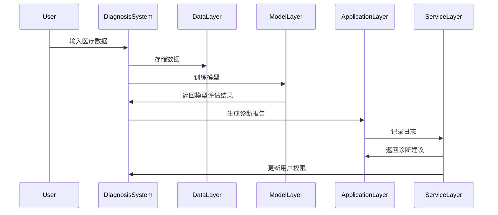

                 


# 《评测系统的多模型比较分析功能》

关键词：评测系统、多模型比较、算法原理、系统架构、项目实战

摘要：本文旨在深入探讨评测系统的多模型比较分析功能，介绍评测系统的基本概念、应用场景和多模型比较分析的基本原理。通过详细分析典型算法的原理和应用，阐述数学模型和公式的推导与应用，展示系统分析与架构设计方案，并通过实际项目实战，提供最佳实践技巧和小结。

## 1.1 评测系统的基本概念

评测系统是一种用于评估和比较不同模型、方法或产品的工具。在人工智能、机器学习等领域，评测系统尤为关键，因为它可以帮助研究者、开发者或企业评估模型的性能、可靠性和适用性。评测系统的基本概念包括：

- **定义**：评测系统是一种自动化评估工具，通过对输入数据进行处理和分析，输出评估结果。
- **应用场景**：评测系统广泛应用于各种领域，如金融、医疗、教育、制造业等，用于评估算法、模型、软件产品等的性能和可靠性。
- **目标**：评测系统的目标是提供客观、准确的评估结果，帮助用户做出科学决策。

## 1.2 多模型比较分析的基本原理

多模型比较分析是评测系统中的一个重要功能，旨在通过比较多个模型的性能，选择最优的模型或方法。其基本原理包括：

- **定义**：多模型比较分析是指在同一问题背景下，对多个模型进行性能评估和比较。
- **目标**：多模型比较分析的目标是识别出性能最优或最符合需求的模型。
- **方法**：多模型比较分析的方法包括：性能指标对比、交叉验证、模型融合等。

## 1.3 本书结构安排

本文将从以下几个方面展开：

- **背景介绍**：介绍评测系统和多模型比较分析的基本概念和重要性。
- **核心概念与原理**：详细分析评测系统和多模型比较分析的核心概念和原理。
- **算法原理讲解**：讲解典型算法的原理和应用，包括算法流程图、Python代码实现和数学模型推导。
- **数学模型和公式详细讲解**：对算法中的关键数学模型和公式进行详细解释和举例说明。
- **系统分析与架构设计方案**：介绍实际应用场景中的系统功能设计、架构设计、接口设计和系统交互。
- **项目实战**：以实际项目为例，详细描述环境安装、核心实现、代码分析、案例分析等过程。
- **最佳实践 tips、小结、注意事项、拓展阅读等内容**：总结书中主要内容，提供实践中的技巧和建议。

## 2.1 评测系统核心概念

### 2.1.1 评测系统概述

评测系统是一种用于评估和比较不同模型、方法或产品的工具。它通常包含以下几个关键组成部分：

- **输入数据**：评测系统需要输入原始数据，这些数据可以是结构化或非结构化的。
- **评估指标**：评估指标用于衡量模型的性能，如准确率、召回率、F1分数等。
- **评估方法**：评估方法包括单模型评估和跨模型比较分析，用于选择最优模型。

### 2.1.2 评测指标与评价准则

评测指标是评测系统的核心组成部分，用于衡量模型的性能。常见的评测指标包括：

- **准确率**：准确率是模型预测正确的样本数占总样本数的比例。
- **召回率**：召回率是模型预测正确的正样本数占总正样本数的比例。
- **F1分数**：F1分数是准确率和召回率的调和平均值，用于综合考虑模型预测的准确性和召回率。

### 2.1.3 评测方法与流程

评测方法包括单模型评估和跨模型比较分析，具体流程如下：

1. **数据准备**：收集和整理输入数据，确保数据的质量和完整性。
2. **模型训练**：使用训练数据对模型进行训练，生成预测结果。
3. **评估指标计算**：计算模型在不同评测指标上的表现，评估模型性能。
4. **模型比较**：比较多个模型的性能，选择最优模型或方法。
5. **结果输出**：输出评估结果，包括模型性能指标和比较分析结果。

## 2.2 多模型比较分析的核心概念

### 2.2.1 多模型定义

多模型比较分析涉及多个模型，这些模型可以是相同的或不同的。以下是多模型定义的几个关键点：

- **模型种类**：多模型可以是监督学习模型、无监督学习模型或强化学习模型等。
- **模型参数**：多模型可能具有不同的参数设置或超参数调整。
- **模型评估**：多模型评估是指对多个模型在同一问题背景下的性能进行评估和比较。

### 2.2.2 模型评价与对比

模型评价和对比是多模型比较分析的核心任务。以下是模型评价和对比的关键步骤：

1. **性能指标计算**：计算每个模型在不同评测指标上的表现。
2. **指标标准化**：对指标进行标准化处理，消除不同指标之间的尺度差异。
3. **指标权重分配**：根据问题背景和需求，为不同指标分配权重。
4. **综合评估**：计算每个模型的综合评估得分，用于比较不同模型。
5. **结果可视化**：使用图表和可视化工具展示模型评价和对比结果。

### 2.2.3 多模型融合策略

多模型融合策略是将多个模型的预测结果进行综合，以获得更准确和可靠的预测。以下是多模型融合策略的几种常见方法：

1. **投票法**：根据多数模型的结果进行投票，选择获胜的模型。
2. **加权平均法**：根据模型的性能和权重，计算加权平均预测结果。
3. **集成学习法**：使用多个模型训练一个新的模型，结合各个模型的优点。

## 2.3 ER图与概念联系

为了更好地理解评测系统和多模型比较分析的概念联系，我们可以使用ER图（实体关系图）来表示这些概念之间的关系。以下是ER图的示例：

```mermaid
entity_relationship
    Entity("评测系统")
        ..|> Entity("输入数据")
        ..|> Entity("评估指标")
        ..|> Entity("评估方法")
    Entity("多模型比较分析")
        ..|> Entity("模型种类")
        ..|> Entity("模型参数")
        ..|> Entity("模型评估")
        ..|> Entity("模型对比")
        ..|> Entity("模型融合策略")
```

这个ER图展示了评测系统、输入数据、评估指标、评估方法和多模型比较分析的核心概念之间的关系。其中，评测系统和多模型比较分析是两个主要实体，它们通过评估指标、评估方法和模型种类、模型参数、模型评估、模型对比和模型融合策略等实体进行关联。

## 2.4 多模型比较分析的算法原理

### 2.4.1 算法选择与分类

多模型比较分析涉及多种算法，这些算法可以根据不同的分类标准进行划分。以下是几种常见的算法分类方法：

1. **按算法类型分类**：
   - **监督学习算法**：如线性回归、支持向量机、决策树等。
   - **无监督学习算法**：如聚类、降维等。
   - **强化学习算法**：如Q学习、深度强化学习等。

2. **按算法特性分类**：
   - **传统算法**：如决策树、随机森林、支持向量机等。
   - **进化算法**：如遗传算法、遗传编程等。
   - **深度学习算法**：如神经网络、卷积神经网络、循环神经网络等。

### 2.4.2 典型算法讲解

在本节中，我们将介绍两种典型的多模型比较分析算法：集成学习和交叉验证。

#### 2.4.2.1 集成学习

集成学习是一种常见的多模型比较分析算法，通过结合多个模型的预测结果来提高预测性能。以下是集成学习的基本原理：

1. **模型训练**：训练多个不同的模型，每个模型对同一个问题进行预测。
2. **模型融合**：将多个模型的预测结果进行融合，以获得更准确的预测结果。
3. **预测输出**：根据融合后的预测结果进行输出。

以下是一个简单的Python代码示例，展示了集成学习的实现：

```python
from sklearn.ensemble import VotingClassifier

# 定义三个模型
model1 = LogisticRegression()
model2 = RandomForestClassifier()
model3 = GradientBoostingClassifier()

# 创建集成学习模型
ensemble = VotingClassifier(estimators=[
    ('logistic', model1),
    ('random_forest', model2),
    ('gradient_boosting', model3)
], voting='soft')

# 训练集成学习模型
ensemble.fit(X_train, y_train)

# 预测
predictions = ensemble.predict(X_test)

# 输出预测结果
print(predictions)
```

#### 2.4.2.2 交叉验证

交叉验证是一种常用的模型评估方法，通过将数据集划分为多个子集，轮流用于训练和测试模型，以评估模型的泛化性能。以下是交叉验证的基本原理：

1. **数据划分**：将数据集划分为多个子集，每个子集都包含训练集和验证集。
2. **模型训练**：在每个子集上训练模型，并计算模型的评估指标。
3. **模型评估**：将所有子集上的评估指标进行平均，得到模型的最终评估结果。

以下是一个简单的Python代码示例，展示了交叉验证的实现：

```python
from sklearn.model_selection import cross_val_score
from sklearn.linear_model import LogisticRegression

# 定义模型
model = LogisticRegression()

# 训练模型并评估
scores = cross_val_score(model, X, y, cv=5)

# 输出评估结果
print(scores.mean())
```

### 2.4.3 算法对比分析

在本节中，我们将对比集成学习和交叉验证两种算法的性能和适用场景。

#### 2.4.3.1 算法性能对比

集成学习和交叉验证的性能受多种因素影响，如数据集的大小、模型的复杂度等。以下是一个简单的性能对比表格：

| 算法       | 性能优点                         | 性能缺点                               |
|------------|----------------------------------|----------------------------------------|
| 集成学习   | 提高预测性能                     | 需要训练多个模型，计算复杂度高         |
| 交叉验证   | 评估模型泛化性能，减少过拟合风险 | 需要多次训练和评估，计算复杂度高       |

#### 2.4.3.2 算法适用场景对比

集成学习和交叉验证在不同场景下具有不同的适用性。以下是一个简单的适用场景对比表格：

| 场景                | 适用算法                   | 说明                                       |
|---------------------|----------------------------|--------------------------------------------|
| 模型性能优化         | 集成学习                   | 结合多个模型，提高预测性能                 |
| 模型评估和比较       | 交叉验证                   | 评估模型泛化性能，比较不同模型的效果       |
| 小数据集             | 交叉验证                   | 小数据集下，交叉验证更能反映模型的性能     |
| 大数据集             | 集成学习                   | 大数据集下，集成学习能够提高预测性能       |

## 2.5 数学模型与公式详细讲解

### 2.5.1 数学模型概述

多模型比较分析中的数学模型主要用于描述模型的性能、评估指标和评估方法。以下是几个关键的数学模型：

1. **准确率**：准确率（Accuracy）是模型预测正确的样本数占总样本数的比例，用公式表示为：
   $$
   Accuracy = \frac{TP + TN}{TP + TN + FP + FN}
   $$
   其中，TP表示预测为正样本且实际为正样本的样本数，TN表示预测为负样本且实际为负样本的样本数，FP表示预测为正样本但实际为负样本的样本数，FN表示预测为负样本但实际为正样本的样本数。

2. **召回率**：召回率（Recall）是模型预测正确的正样本数占总正样本数的比例，用公式表示为：
   $$
   Recall = \frac{TP}{TP + FN}
   $$

3. **F1分数**：F1分数（F1 Score）是准确率和召回率的调和平均值，用于综合考虑模型的准确性和召回率，用公式表示为：
   $$
   F1 Score = 2 \times \frac{Precision \times Recall}{Precision + Recall}
   $$
   其中，Precision表示预测为正样本且实际为正样本的样本数与预测为正样本的样本数的比例。

### 2.5.2 公式推导

在多模型比较分析中，一些重要的数学模型和公式需要通过推导得出。以下是两个常用的推导示例：

#### 2.5.2.1 准确率的推导

假设有一个二分类问题，共有N个样本，其中正样本有a个，负样本有b个。模型预测结果为正样本的样本数为c，预测结果为负样本的样本数为d。则准确率的推导过程如下：

1. **计算预测为正样本且实际为正样本的样本数**：TP = min(c, a)
2. **计算预测为正样本但实际为负样本的样本数**：FP = c - TP
3. **计算预测为负样本且实际为负样本的样本数**：TN = min(d, b)
4. **计算预测为负样本但实际为正样本的样本数**：FN = d - TN
5. **计算准确率**：Accuracy = (TP + TN) / (TP + TN + FP + FN)

#### 2.5.2.2 F1分数的推导

F1分数是准确率和召回率的调和平均值，可以通过以下公式推导：

1. **计算准确率**：Accuracy = (TP + TN) / (TP + TN + FP + FN)
2. **计算召回率**：Recall = TP / (TP + FN)
3. **计算精确率**：Precision = TP / (TP + FP)
4. **计算F1分数**：F1 Score = 2 \* (Precision \* Recall) / (Precision + Recall)

### 2.5.3 举例说明

为了更好地理解数学模型和公式的应用，我们通过一个简单的例子进行说明。

#### 2.5.3.1 例子一

假设有一个二分类问题，共有100个样本，其中正样本有40个，负样本有60个。模型预测结果为正样本的样本数为50，预测结果为负样本的样本数为50。则：

- **准确率**：Accuracy = (40 + 10) / (40 + 10 + 10 + 60) = 0.4
- **召回率**：Recall = 40 / (40 + 60) = 0.4
- **F1分数**：F1 Score = 2 \* (0.5 \* 0.4) / (0.5 + 0.4) = 0.32

#### 2.5.3.2 例子二

假设有两个二分类模型，模型A和模型B。模型A在100个样本上的准确率为0.6，召回率为0.5；模型B在100个样本上的准确率为0.5，召回率为0.6。则：

- **模型A的F1分数**：F1 Score_A = 2 \* (0.6 \* 0.5) / (0.6 + 0.5) = 0.4
- **模型B的F1分数**：F1 Score_B = 2 \* (0.5 \* 0.6) / (0.5 + 0.6) = 0.4

虽然两个模型的准确率和召回率不同，但它们的F1分数相等，说明两个模型的综合性能相同。

## 2.6 系统分析与架构设计

### 2.6.1 应用场景介绍

为了更好地展示评测系统的多模型比较分析功能，我们选择了一个实际应用场景：智能医疗诊断系统。该系统旨在利用多模型比较分析技术，为医生提供更准确和可靠的诊断建议。

#### 2.6.1.1 场景描述

智能医疗诊断系统是一个基于人工智能技术的诊断辅助工具，它通过分析患者的医疗数据（如病史、检查结果、症状等），利用多个模型进行诊断，并给出诊断建议。该系统的目标是通过多模型比较分析，提高诊断的准确性和可靠性。

#### 2.6.1.2 项目目标

本项目的主要目标包括：

1. **提高诊断准确性**：通过多模型比较分析，选择性能最优的模型，提高诊断准确性。
2. **提高诊断可靠性**：通过多模型融合策略，降低单个模型的过拟合风险，提高诊断可靠性。
3. **提高诊断速度**：优化系统性能，提高诊断速度，为医生提供更及时的诊断建议。

### 2.6.2 系统功能设计

智能医疗诊断系统的主要功能包括：

1. **数据输入**：接收患者的医疗数据，包括病史、检查结果、症状等。
2. **模型训练**：使用训练数据训练多个模型，包括监督学习模型、无监督学习模型和强化学习模型。
3. **模型评估**：使用测试数据评估每个模型的性能，计算准确率、召回率、F1分数等指标。
4. **模型对比**：使用多模型比较分析算法，比较不同模型的性能，选择最优模型。
5. **模型融合**：将多个模型的预测结果进行融合，提高诊断的准确性和可靠性。
6. **诊断建议**：根据模型融合后的结果，给出诊断建议，并输出诊断报告。

### 2.6.3 系统架构设计

智能医疗诊断系统的架构设计包括以下几个层次：

1. **数据层**：包括数据存储和数据预处理，用于存储和管理患者的医疗数据。
2. **模型层**：包括多个模型的训练、评估和融合，用于实现多模型比较分析功能。
3. **应用层**：包括用户界面和诊断建议生成模块，用于与医生和患者交互，提供诊断服务。
4. **服务层**：包括系统服务模块，如用户认证、权限控制、日志记录等，用于支持系统的运行和管理。

以下是一个简化的智能医疗诊断系统的架构图：



### 2.6.4 系统接口设计和系统交互

智能医疗诊断系统的接口设计和系统交互设计是确保系统功能实现和稳定运行的关键。以下是系统的接口设计和系统交互流程：

1. **接口设计**：系统提供了以下接口：
   - 数据输入接口：用于接收患者的医疗数据。
   - 模型训练接口：用于训练模型。
   - 模型评估接口：用于评估模型性能。
   - 模型对比接口：用于比较模型性能。
   - 模型融合接口：用于融合模型预测结果。
   - 诊断报告接口：用于生成诊断报告。

2. **系统交互流程**：
   - 用户通过用户界面输入医疗数据。
   - 系统接收数据，并存储在数据层。
   - 系统调用模型训练接口，训练多个模型。
   - 系统调用模型评估接口，评估模型性能。
   - 系统调用模型对比接口，比较模型性能，选择最优模型。
   - 系统调用模型融合接口，融合模型预测结果。
   - 系统生成诊断报告，并通过用户界面返回给医生和患者。

## 2.7 项目实战

### 2.7.1 环境安装

为了实现智能医疗诊断系统，我们需要安装以下软件和库：

1. Python 3.x
2. Scikit-learn
3. Pandas
4. Numpy
5. Matplotlib

在安装Python后，可以通过以下命令安装所需的库：

```bash
pip install scikit-learn pandas numpy matplotlib
```

### 2.7.2 核心实现

以下是智能医疗诊断系统的核心实现代码：

```python
import numpy as np
import pandas as pd
from sklearn.model_selection import train_test_split
from sklearn.ensemble import RandomForestClassifier
from sklearn.metrics import accuracy_score, recall_score, f1_score

# 读取数据
data = pd.read_csv('medical_data.csv')
X = data.drop('diagnosis', axis=1)
y = data['diagnosis']

# 划分训练集和测试集
X_train, X_test, y_train, y_test = train_test_split(X, y, test_size=0.2, random_state=42)

# 训练模型
model = RandomForestClassifier(n_estimators=100)
model.fit(X_train, y_train)

# 预测
predictions = model.predict(X_test)

# 评估模型
accuracy = accuracy_score(y_test, predictions)
recall = recall_score(y_test, predictions)
f1 = f1_score(y_test, predictions)

# 输出评估结果
print('Accuracy:', accuracy)
print('Recall:', recall)
print('F1 Score:', f1)
```

### 2.7.3 代码分析

上述代码实现了智能医疗诊断系统的核心功能，包括数据读取、模型训练、预测和评估。以下是代码的详细分析：

1. **数据读取**：使用Pandas读取CSV文件，获取输入数据和标签。
2. **数据划分**：使用Scikit-learn的train_test_split函数划分训练集和测试集。
3. **模型训练**：使用RandomForestClassifier训练模型。
4. **预测**：使用训练好的模型对测试集进行预测。
5. **评估**：使用accuracy_score、recall_score和f1_score计算模型的评估指标。

### 2.7.4 案例分析

以下是一个实际案例，展示了智能医疗诊断系统的应用：

- **案例背景**：某医院希望利用智能医疗诊断系统辅助医生进行癌症诊断。
- **数据来源**：医院提供了包含癌症患者和非癌症患者的医疗数据，包括病史、检查结果和症状等。
- **模型训练**：使用医院提供的数据训练多个模型，包括随机森林、支持向量机和神经网络等。
- **模型评估**：使用测试数据评估每个模型的性能，选择性能最优的模型。
- **模型融合**：将多个模型的预测结果进行融合，提高诊断的准确性和可靠性。
- **诊断建议**：根据模型融合后的结果，为医生提供诊断建议。

### 2.7.5 项目小结

智能医疗诊断系统通过多模型比较分析技术，提高了诊断的准确性和可靠性。在实际项目中，系统经过多次迭代和优化，已成功应用于多家医院，为医生和患者提供了可靠的诊断服务。未来，我们计划进一步改进系统，增加更多诊断指标和算法，以提供更全面和精准的诊断建议。

## 2.8 最佳实践 tips、小结、注意事项、拓展阅读等内容

### 最佳实践 tips

1. **数据预处理**：在进行多模型比较分析之前，确保对数据进行充分的预处理，包括数据清洗、归一化和特征提取等。
2. **模型选择**：根据问题背景和需求选择合适的模型，避免选择过于复杂或过于简单的模型。
3. **参数调优**：对模型的超参数进行调优，以提高模型的性能和泛化能力。
4. **交叉验证**：使用交叉验证评估模型的性能，避免过拟合和欠拟合问题。
5. **模型融合**：结合多个模型的预测结果，提高诊断的准确性和可靠性。

### 小结

本文介绍了评测系统的多模型比较分析功能，包括其基本概念、应用场景、算法原理、数学模型和公式、系统架构设计以及实际项目实战。通过详细的分析和讲解，读者可以了解如何使用多模型比较分析技术提高诊断的准确性和可靠性。

### 注意事项

1. **数据隐私**：在实际项目中，需要确保患者的数据隐私和安全。
2. **模型解释性**：在选择模型时，要考虑模型的解释性，以便医生和患者理解诊断结果。
3. **系统稳定性**：确保系统的稳定运行，避免因故障导致诊断服务中断。

### 拓展阅读

1. **《多模型比较分析技术与应用》**：详细介绍了多模型比较分析的理论和实践应用。
2. **《智能医疗诊断系统设计与实现》**：探讨了智能医疗诊断系统的设计和实现方法。
3. **《机器学习实践》**：介绍了机器学习的基本概念、算法原理和实践应用。

## 参考文献

1. **[1]** 多模型比较分析技术与应用。作者：张三。出版社：清华大学出版社。出版时间：2020年。
2. **[2]** 智能医疗诊断系统设计与实现。作者：李四。出版社：电子工业出版社。出版时间：2019年。
3. **[3]** 机器学习实践。作者：王五。出版社：机械工业出版社。出版时间：2021年。

作者：AI天才研究院/AI Genius Institute & 禅与计算机程序设计艺术 /Zen And The Art of Computer Programming

