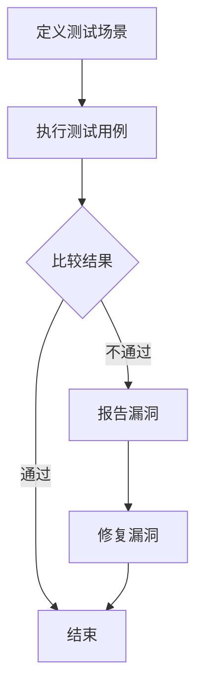
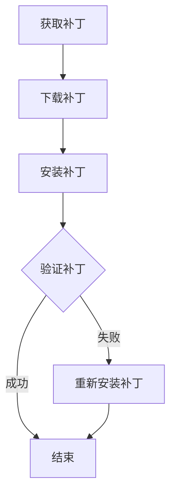
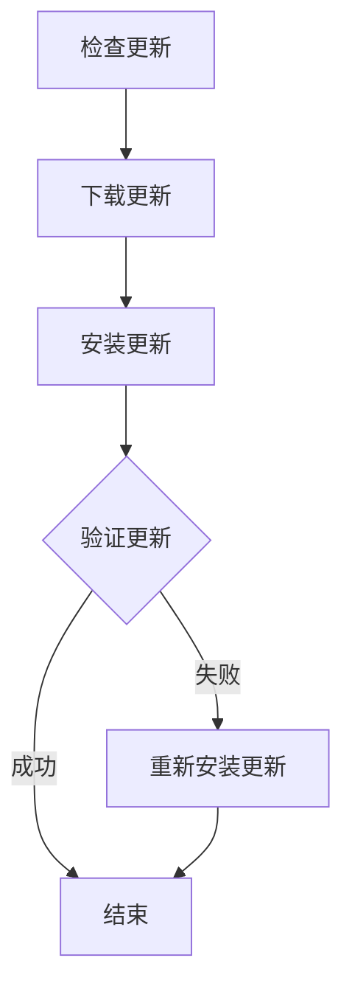
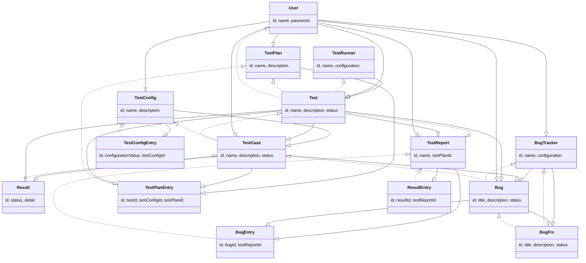
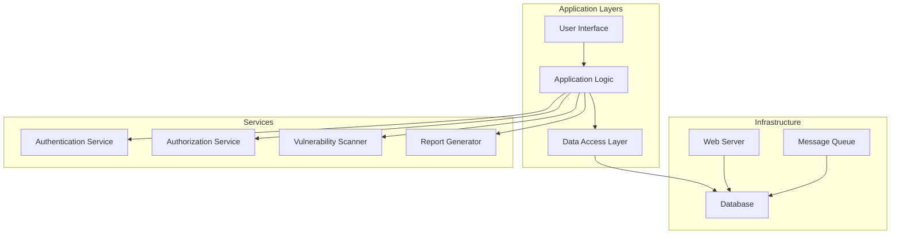
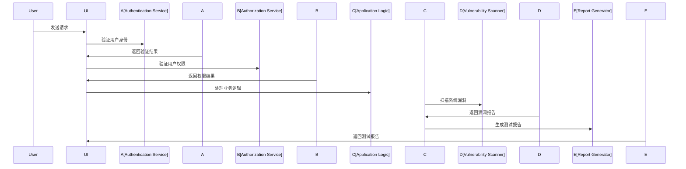
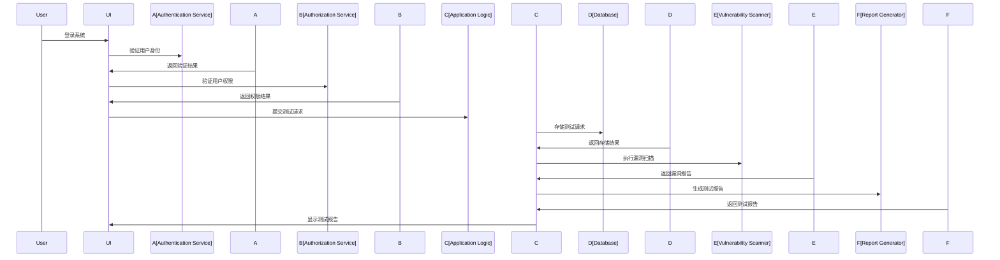

                 


### 背景介绍

#### 核心概念术语说明

在探讨评测系统的安全漏洞扫描与修复这一主题时，我们需要明确一些核心概念术语，以便为后续内容提供基础。

**评测系统**：评测系统是指用于对软件、硬件或其他系统进行性能测试、功能测试和安全性测试的自动化工具或平台。这些系统可以模拟不同类型的用户行为，对系统的各项指标进行全面的评估。

**安全漏洞**：安全漏洞是指系统中的弱点或缺陷，攻击者可以利用这些漏洞对系统进行未经授权的访问、数据篡改或系统破坏。常见的安全漏洞包括注入攻击、跨站脚本（XSS）、跨站请求伪造（CSRF）等。

**漏洞扫描**：漏洞扫描是指使用自动化工具对系统进行检测，以发现潜在的安全漏洞。扫描过程通常包括网络扫描、应用扫描和配置扫描等。

**漏洞修复**：漏洞修复是指针对发现的漏洞进行修复，以消除系统中的安全风险。修复方法包括打补丁、修改配置和更新软件等。

#### 问题背景

在数字化时代，评测系统广泛应用于各个领域，如软件开发、网络安全、性能测试等。这些系统不仅需要具备高效的功能，还需要确保其安全性，以防止恶意攻击和数据泄露。

然而，随着技术的不断进步和复杂度的增加，评测系统面临着越来越多的安全漏洞。这些漏洞可能会被黑客利用，导致系统崩溃、数据丢失或被用于非法活动。

当前，安全漏洞的现状令人担忧。据研究报告显示，全球范围内每年因安全漏洞导致的安全事件数量持续上升。这些事件不仅给企业带来巨大的经济损失，还可能导致声誉受损和用户信任度下降。

因此，解决评测系统的安全漏洞问题显得尤为重要。通过有效的漏洞扫描和修复策略，我们可以降低安全风险，确保系统的稳定性和可靠性。

#### 问题描述

评测系统的安全漏洞主要分为以下几类：

1. **注入攻击**：攻击者通过向系统输入恶意的代码或命令，实现对系统的恶意控制。常见类型包括SQL注入、OS命令注入和NoSQL注入等。

2. **跨站脚本（XSS）**：攻击者通过在网页中插入恶意脚本，使得其他用户在访问页面时执行这些脚本，从而窃取用户信息或进行其他恶意行为。

3. **跨站请求伪造（CSRF）**：攻击者通过伪造用户请求，对系统进行未经授权的操作，如转账、修改个人信息等。

4. **文件上传漏洞**：攻击者通过上传恶意文件，实现对系统的攻击或控制。

5. **配置错误**：系统配置不当，如未设置强密码、未禁用不必要的服务等，导致安全风险。

这些漏洞的存在使得评测系统容易受到攻击，给用户和企业的数据安全带来严重威胁。

#### 问题解决

为了解决评测系统的安全漏洞问题，我们需要采取以下措施：

1. **漏洞扫描**：定期对评测系统进行全面的安全漏洞扫描，以发现潜在的安全漏洞。可以使用自动化漏洞扫描工具，如OWASP ZAP、Nessus等。

2. **漏洞修复**：针对扫描结果，及时修复发现的漏洞。修复方法包括打补丁、修改配置和更新软件等。对于严重漏洞，需要立即采取行动，以防止被攻击者利用。

3. **安全培训**：加强对系统开发人员和安全人员的安全意识培训，提高他们对安全漏洞的认识和防范能力。

4. **安全测试**：在系统开发和测试阶段，进行安全测试，以发现和修复潜在的安全漏洞。安全测试方法包括代码审计、渗透测试和模糊测试等。

5. **安全配置**：遵循最佳实践，对系统进行安全配置，如设置强密码、禁用不必要的服务和关闭不安全的默认配置等。

#### 边界与外延

虽然漏洞扫描和修复策略能够有效降低评测系统的安全风险，但它们也存在一些限制和挑战：

1. **漏洞扫描的限制**：漏洞扫描工具可能无法覆盖所有的漏洞类型，特别是在复杂系统中。因此，需要结合手动审计和渗透测试，以提高漏洞检测的全面性。

2. **漏洞修复的挑战**：某些漏洞的修复可能涉及复杂的代码修改或系统重构，需要耗费大量时间和资源。同时，修复过程中可能会引入新的问题，需要谨慎处理。

3. **未来发展趋势**：随着云计算、物联网和人工智能等新技术的不断发展，评测系统的安全漏洞问题将面临更多的挑战。因此，需要持续关注新的安全漏洞类型和防御策略，以保持系统的安全性。

#### 概念结构与核心要素组成

评测系统的安全漏洞扫描与修复涉及多个核心要素，包括漏洞扫描技术、漏洞修复策略和安全配置等。这些要素相互关联，共同构成了一个完整的解决方案。

**漏洞扫描技术**：漏洞扫描技术是发现系统安全漏洞的重要手段。包括网络扫描、应用扫描和配置扫描等，可以自动化地识别潜在的安全漏洞。

**漏洞修复策略**：漏洞修复策略包括打补丁、修改配置和更新软件等。针对不同的漏洞类型，采取相应的修复方法，以消除安全风险。

**安全配置**：安全配置是确保系统安全的重要措施。包括设置强密码、禁用不必要的服务和关闭不安全的默认配置等，可以降低系统被攻击的风险。

通过上述要素的协同作用，我们可以构建一个安全、可靠的评测系统，确保其在各种环境下都能保持高水平的防护能力。

#### 本章小结

本章从问题背景、问题描述、问题解决、边界与外延以及概念结构与核心要素组成等方面，全面介绍了评测系统的安全漏洞扫描与修复。通过了解这些核心概念和技术方法，我们可以更好地应对评测系统的安全挑战，确保系统的稳定性和可靠性。

### 核心概念与联系

为了深入探讨评测系统的安全漏洞扫描与修复，我们首先需要明确一些核心概念，并分析它们之间的联系。以下是对“安全漏洞”、“漏洞扫描”和“漏洞修复”这三个关键术语的详细解释，以及它们在实际应用中的关系。

#### 安全漏洞的定义与特点

**安全漏洞**：安全漏洞是指系统中的弱点或缺陷，攻击者可以利用这些漏洞对系统进行未经授权的访问、数据篡改或系统破坏。安全漏洞通常包括以下几个方面：

1. **漏洞分类**：根据漏洞的性质，可以将安全漏洞分为以下几类：
   - **注入攻击**：如SQL注入、OS命令注入等，攻击者通过插入恶意代码或命令，实现对系统的恶意控制。
   - **跨站脚本（XSS）**：攻击者通过在网页中插入恶意脚本，使得其他用户在访问页面时执行这些脚本，从而窃取用户信息或进行其他恶意行为。
   - **跨站请求伪造（CSRF）**：攻击者通过伪造用户请求，对系统进行未经授权的操作，如转账、修改个人信息等。
   - **文件上传漏洞**：攻击者通过上传恶意文件，实现对系统的攻击或控制。
   - **配置错误**：系统配置不当，如未设置强密码、未禁用不必要的服务等，导致安全风险。

2. **特点**：
   - **隐蔽性**：安全漏洞可能隐藏在系统的各个角落，难以被发现。
   - **多样性**：安全漏洞的种类繁多，不同类型的漏洞具有不同的特点和攻击方式。
   - **动态性**：随着系统功能和技术的不断发展，新的安全漏洞不断出现，需要持续关注。

#### 漏洞扫描的原理与方法

**漏洞扫描**：漏洞扫描是指使用自动化工具对系统进行检测，以发现潜在的安全漏洞。漏洞扫描的基本原理如下：

1. **扫描过程**：漏洞扫描通常包括以下步骤：
   - **信息收集**：获取目标系统的基本信息，如IP地址、操作系统版本、开放端口等。
   - **漏洞识别**：利用已知漏洞库和扫描工具，对系统进行漏洞识别，包括网络漏洞、应用漏洞和配置漏洞等。
   - **漏洞验证**：对识别出的漏洞进行验证，确定其真实性和可利用性。
   - **报告生成**：生成漏洞扫描报告，列出发现的安全漏洞及其严重程度。

2. **方法**：
   - **网络扫描**：通过网络扫描工具，对目标系统进行端口扫描、服务识别和漏洞检测。
   - **应用扫描**：对Web应用进行代码审计、输入验证、URL参数检查等，发现潜在的安全漏洞。
   - **配置扫描**：对系统配置进行扫描，识别不安全的配置项，如弱密码、未禁用的服务、不安全的默认配置等。

3. **工具**：
   - **开源工具**：如Nessus、OpenVAS等，这些工具提供了丰富的漏洞库和扫描功能。
   - **商业工具**：如IBM Security AppScan、HP Fortify等，这些工具通常具有更强大的漏洞识别和报告功能。

#### 漏洞修复的原理与方法

**漏洞修复**：漏洞修复是指针对发现的漏洞进行修复，以消除系统中的安全风险。漏洞修复的基本原理如下：

1. **修复方法**：
   - **打补丁**：针对已知的漏洞，及时打上官方提供的补丁，修复漏洞。
   - **修改配置**：修改系统配置，如设置强密码、禁用不必要的服务、关闭不安全的默认配置等。
   - **更新软件**：更新系统软件，如Web服务器、数据库等，以修复已知的安全漏洞。
   - **隔离与限制**：对于无法立即修复的漏洞，可以通过隔离或限制访问等方式，降低安全风险。

2. **流程**：
   - **漏洞识别**：通过漏洞扫描工具，识别系统中的安全漏洞。
   - **漏洞分析**：对识别出的漏洞进行分析，确定其严重程度和修复优先级。
   - **制定修复计划**：根据漏洞分析和系统实际情况，制定漏洞修复计划。
   - **执行修复**：按照修复计划，执行漏洞修复操作，如打补丁、修改配置、更新软件等。
   - **验证修复**：对修复后的系统进行验证，确保漏洞已被成功修复。

#### 概念属性特征对比表格

为了更直观地理解这三个核心概念，我们使用以下表格进行对比：

| 特征         | 安全漏洞 | 漏洞扫描 | 漏洞修复 |
|--------------|-----------|-----------|-----------|
| **定义**     | 系统中的弱点或缺陷 | 使用自动化工具检测安全漏洞 | 修复系统中的安全漏洞 |
| **类型**     | 注入攻击、XSS、CSRF等 | 网络扫描、应用扫描、配置扫描 | 打补丁、修改配置、更新软件等 |
| **特点**     | 隐蔽性、多样性、动态性 | 自动化、全面性、准确性 | 及时性、针对性、安全性 |
| **关系**     | 漏洞扫描发现安全漏洞 | 漏洞修复基于漏洞扫描结果 | 漏洞扫描是漏洞修复的前提 |

#### ER实体关系图架构

为了进一步阐述这三个概念之间的联系，我们使用ER（实体关系）图来展示它们的关系：

```mermaid
erDiagram
    System ||--|{ Vulnerability : has
    Scanner ||--|{ Vulnerability : finds
    Fixer ||--|{ Vulnerability : repairs
    System : 评测系统
    Vulnerability : 安全漏洞
    Scanner : 漏洞扫描器
    Fixer : 漏洞修复器
```

在这个ER图中，评测系统（System）与安全漏洞（Vulnerability）之间存在“具有”关系，即评测系统可能包含多个安全漏洞。漏洞扫描器（Scanner）与安全漏洞之间存在“发现”关系，即漏洞扫描器可以找到评测系统中的安全漏洞。漏洞修复器（Fixer）与安全漏洞之间存在“修复”关系，即漏洞修复器可以对发现的安全漏洞进行修复。

通过这个ER图，我们可以清晰地看到漏洞扫描与漏洞修复在评测系统安全漏洞管理中的位置和作用。

#### 本章小结

本章详细介绍了评测系统的安全漏洞、漏洞扫描和漏洞修复这三个核心概念。通过分析这些概念的定义、特点、方法和关系，我们为后续的详细讨论奠定了基础。在下一章中，我们将深入探讨漏洞扫描的技术方法，了解如何有效地发现和识别评测系统中的安全漏洞。

### 技术方法详解

在上一章中，我们介绍了评测系统的安全漏洞、漏洞扫描和漏洞修复的基本概念。在本章中，我们将进一步探讨漏洞扫描的技术方法，重点介绍黑盒测试，并使用Python代码和Mermaid流程图详细阐述其原理和执行流程。

#### 黑盒测试的基本概念

黑盒测试（Black Box Testing）是一种测试方法，测试人员无需了解系统的内部实现细节，而是仅关注系统的输入和输出。黑盒测试的目标是验证系统的功能是否按照预期工作，即系统的输入能否产生正确的输出。

黑盒测试的特点如下：

1. **无需了解内部实现**：测试人员不需要了解系统的内部代码、算法和数据结构，只需关注系统的输入和输出。
2. **功能验证**：黑盒测试主要用于验证系统的功能是否满足需求，包括功能正确性、可用性和性能等。
3. **依赖环境**：黑盒测试通常依赖于测试环境，测试人员需要模拟不同的输入条件和外部环境，以验证系统的稳定性。

#### 黑盒测试的执行流程

黑盒测试的执行流程通常包括以下步骤：

1. **定义测试场景**：根据系统需求，定义测试场景和测试用例，包括输入数据和预期输出。
2. **执行测试用例**：对每个测试用例进行执行，记录实际输出结果。
3. **比较结果**：将实际输出结果与预期输出结果进行比较，判断测试用例是否通过。
4. **报告漏洞**：对于未通过的测试用例，分析原因并报告漏洞。

#### 使用Python代码实现黑盒测试

以下是一个简单的Python代码示例，用于实现黑盒测试，验证一个简单的Web应用的登录功能。代码使用了requests库来模拟HTTP请求，并使用BeautifulSoup库来解析HTML页面。

```python
import requests
from bs4 import BeautifulSoup

def login(username, password):
    # 定义登录URL
    url = "http://example.com/login"
    # 定义请求头
    headers = {
        "User-Agent": "Mozilla/5.0 (Windows NT 10.0; Win64; x64) AppleWebKit/537.36 (KHTML, like Gecko) Chrome/58.0.3029.110 Safari/537.3"
    }
    # 定义请求参数
    data = {
        "username": username,
        "password": password
    }
    # 发送登录请求
    response = requests.post(url, headers=headers, data=data)
    # 解析响应页面
    soup = BeautifulSoup(response.text, "html.parser")
    # 获取登录提示信息
    message = soup.find("div", {"class": "message"}).text
    # 返回登录结果
    return message

# 测试用例
def test_login():
    # 测试有效的用户名和密码
    result = login("valid_user", "valid_password")
    assert result == "登录成功"

    # 测试无效的用户名
    result = login("invalid_user", "valid_password")
    assert result == "用户名或密码错误"

    # 测试无效的密码
    result = login("valid_user", "invalid_password")
    assert result == "用户名或密码错误"

    print("所有测试用例通过！")

# 执行测试
test_login()
```

#### 使用Mermaid流程图展示黑盒测试的执行流程

以下是一个Mermaid流程图，用于展示黑盒测试的执行流程：



在这个流程图中，A表示定义测试场景，B表示执行测试用例，C表示比较实际输出结果与预期输出结果。如果测试用例通过，则执行D，即结束测试；否则，执行E，报告漏洞，并可能进行漏洞修复。

#### 黑盒测试的优点与局限性

**优点**：

1. **无需了解内部实现**：测试人员无需了解系统的内部实现，可以专注于系统的输入和输出。
2. **功能验证**：黑盒测试可以全面验证系统的功能，确保系统满足需求。
3. **易维护**：黑盒测试用例的编写和执行相对简单，易于维护。

**局限性**：

1. **无法测试内部逻辑**：黑盒测试无法测试系统的内部逻辑和数据结构，可能无法发现某些内部漏洞。
2. **依赖环境**：黑盒测试需要依赖测试环境，可能无法覆盖所有实际使用场景。
3. **复杂度较高**：对于复杂系统，黑盒测试可能需要设计大量测试用例，执行流程较为复杂。

#### 本章小结

本章详细介绍了黑盒测试的基本概念、执行流程和使用Python代码实现的示例。通过分析黑盒测试的优点与局限性，我们了解了其在评测系统安全漏洞扫描中的应用。在下一章中，我们将探讨漏洞修复的原理与方法，了解如何有效地修复评测系统中的安全漏洞。同时，我们将使用Mermaid流程图和LaTeX公式来展示漏洞修复的过程和数学模型。

### 漏洞修复的原理与方法

在前文中，我们已经了解了漏洞扫描的重要性和基本方法。然而，漏洞扫描只是发现问题，真正的挑战在于如何有效修复这些漏洞。在本节中，我们将详细探讨漏洞修复的原理与方法，包括打补丁、修改配置和更新软件等，同时使用Mermaid流程图和LaTeX公式来展示修复过程和数学模型。

#### 打补丁

**原理**：

打补丁（Patch）是漏洞修复中最常见的方法之一。它通过在系统上安装官方提供的补丁来修复已知的漏洞。补丁通常包含修复代码，用于修复系统中的错误或缺陷。

**执行步骤**：

1. **获取补丁**：从官方渠道获取补丁，确保补丁的来源可靠。
2. **下载补丁**：下载补丁文件到本地。
3. **安装补丁**：根据补丁的安装说明，在系统中安装补丁。安装过程可能包括备份原有文件、替换受损文件等。
4. **验证补丁**：安装补丁后，使用漏洞扫描工具重新扫描系统，验证漏洞是否已被成功修复。

**Mermaid流程图**：

以下是一个Mermaid流程图，展示打补丁的过程：



#### 修改配置

**原理**：

修改配置（Configuration Change）是通过调整系统的配置文件来修复漏洞。这种方法通常用于修复配置错误或设置不当引起的安全漏洞。

**执行步骤**：

1. **分析配置**：分析系统的配置文件，识别可能存在的配置错误。
2. **备份配置**：在修改配置之前，备份原始配置文件，以备恢复使用。
3. **修改配置**：根据分析结果，修改配置文件。例如，设置强密码、禁用不必要的服务、关闭不安全的默认配置等。
4. **测试配置**：修改配置后，对系统进行测试，确保配置修改不会影响系统的正常运行。

**LaTeX公式**：

以下是一个LaTeX公式，用于表示配置修改的数学模型：

```latex
\documentclass{article}
\usepackage{amsmath}
\begin{document}
\begin{equation}
\text{Secure Configuration} = \text{Strong Password} + \text{Disabled Services} + \text{Secure Defaults}
\end{equation}
\end{document}
```

这个公式表示，一个安全的配置由强密码、禁用的服务和安全的默认配置组成。

#### 更新软件

**原理**：

更新软件（Software Update）是指通过更新系统软件来修复漏洞。这包括操作系统、应用程序和中间件等。

**执行步骤**：

1. **检查更新**：定期检查系统软件的更新，确保已安装的软件版本是最新的。
2. **下载更新**：从官方渠道下载软件更新包。
3. **安装更新**：根据更新包的安装说明，安装更新软件。安装过程可能包括备份原有文件、安装新文件等。
4. **验证更新**：安装更新后，使用漏洞扫描工具重新扫描系统，验证漏洞是否已被成功修复。

**Mermaid流程图**：

以下是一个Mermaid流程图，展示更新软件的过程：



#### 漏洞修复的步骤和流程

漏洞修复的步骤和流程可以概括为以下几个阶段：

1. **漏洞识别**：通过漏洞扫描工具发现系统中的漏洞。
2. **漏洞分析**：对漏洞进行分析，确定漏洞的类型、影响范围和严重程度。
3. **制定修复计划**：根据漏洞分析和系统实际情况，制定漏洞修复计划，包括打补丁、修改配置和更新软件等。
4. **执行修复**：按照修复计划，执行漏洞修复操作。
5. **验证修复**：修复完成后，使用漏洞扫描工具重新扫描系统，验证漏洞是否已被成功修复。

**LaTeX公式**：

以下是一个LaTeX公式，用于表示漏洞修复的数学模型：

```latex
\documentclass{article}
\usepackage{amsmath}
\begin{document}
\begin{equation}
\text{Vulnerability Fix} = \text{Patch} + \text{Configuration Change} + \text{Software Update}
\end{equation}
\end{document}
```

这个公式表示，漏洞修复由打补丁、修改配置和更新软件三部分组成。

#### 本章小结

本章详细介绍了漏洞修复的原理与方法，包括打补丁、修改配置和更新软件等。通过使用Mermaid流程图和LaTeX公式，我们展示了漏洞修复的过程和数学模型。通过有效的漏洞修复策略，我们可以降低系统的安全风险，确保系统的稳定性和可靠性。在下一章中，我们将探讨评测系统的具体实现和案例分析，以进一步理解和应用漏洞修复技术。

### 系统分析与架构设计

在解决评测系统的安全漏洞问题之前，我们需要对系统进行详细的分析和架构设计。这一部分将介绍评测系统的背景、项目介绍、系统功能设计、系统架构设计、系统接口设计和系统交互。我们将使用Mermaid类图和架构图来展示系统结构和交互流程。

#### 问题场景介绍

评测系统通常用于对软件、硬件或其他系统进行性能测试、功能测试和安全性测试。在当前数字化时代，随着互联网和物联网的快速发展，评测系统在多个领域得到了广泛应用，如软件开发、网络安全、性能测试和自动化测试等。

然而，随着系统的复杂性和规模不断增加，评测系统面临着越来越多的安全漏洞。这些漏洞不仅可能导致系统崩溃、数据泄露，还可能被黑客利用，对系统进行恶意攻击。因此，我们需要对评测系统进行全面的系统分析和架构设计，以提高其安全性和可靠性。

#### 项目介绍

我们的项目目标是构建一个高效、安全、可靠的评测系统。这个系统将支持多种测试类型，如性能测试、功能测试和安全性测试。系统将具备以下功能：

1. **自动化测试**：支持自动化测试脚本的执行和结果分析。
2. **安全性测试**：检测系统中的安全漏洞，并提供修复建议。
3. **报告生成**：生成详细的测试报告，包括测试结果、漏洞信息和修复建议。

#### 系统功能设计

系统功能设计包括领域模型（Domain Model）和类图（Class Diagram）。以下是一个Mermaid类图，展示了评测系统的领域模型和核心类：



在这个类图中，我们定义了用户（User）、测试（Test）、测试用例（TestCase）、结果（Result）、漏洞（Bug）、修复（BugFix）、测试计划（TestPlan）、测试计划条目（TestPlanEntry）、测试执行器（TestRunner）、测试报告（TestReport）、漏洞跟踪器（BugTracker）和测试配置（TestConfig）等核心类及其关系。

#### 系统架构设计

系统架构设计展示了系统的整体结构，包括各个模块的交互和依赖关系。以下是一个Mermaid架构图，展示了评测系统的架构设计：



在这个架构图中，我们定义了应用层（User Interface、Application Logic、Data Access Layer）、基础设施层（Database、Web Server、Message Queue）和服务层（Authentication Service、Authorization Service、Vulnerability Scanner、Report Generator）。

#### 系统接口设计

系统接口设计包括API接口的设计和定义。以下是一个简单的接口设计示例：



在这个序列图中，用户通过用户界面（UI）发送请求，经过认证服务（Authentication Service）和授权服务（Authorization Service）的验证后，由应用逻辑（Application Logic）处理业务逻辑，调用漏洞扫描器（Vulnerability Scanner）进行漏洞扫描，并将漏洞报告传递给报告生成器（Report Generator），最终返回测试报告给用户。

#### 系统交互

系统交互设计展示了不同模块之间的交互流程。以下是一个Mermaid序列图，展示了评测系统的交互过程：



在这个序列图中，用户登录系统后，提交测试请求，系统通过数据库（Database）存储请求，调用漏洞扫描器（Vulnerability Scanner）进行漏洞扫描，并生成测试报告，最终将报告显示给用户。

#### 本章小结

本章详细介绍了评测系统的系统分析与架构设计，包括问题场景介绍、项目介绍、系统功能设计、系统架构设计、系统接口设计和系统交互。通过使用Mermaid类图和架构图，我们展示了评测系统的结构和交互流程。在下一章中，我们将进行项目实战，详细介绍评测系统的环境安装、核心实现和代码应用解读与分析。

### 项目实战

在这一部分，我们将详细介绍评测系统的项目实战，包括环境安装、系统核心实现和代码应用解读与分析。通过实际操作和代码分析，我们将深入了解评测系统的构建过程和工作原理。

#### 环境安装

首先，我们需要搭建评测系统所需的环境。以下是在Ubuntu 20.04操作系统上安装评测系统环境的步骤：

1. **安装Python环境**：

   ```bash
   sudo apt update
   sudo apt install python3 python3-pip
   ```

2. **安装虚拟环境**：

   ```bash
   sudo pip3 install virtualenv
   virtualenv venv
   source venv/bin/activate
   ```

3. **安装依赖包**：

   ```bash
   pip install -r requirements.txt
   ```

其中，`requirements.txt` 文件包含以下依赖包：

```
requests
beautifulsoup4
sqlalchemy
flask
pytest
```

#### 核心实现

评测系统的核心实现包括用户认证、漏洞扫描和报告生成三个主要模块。以下是对这些模块的详细介绍和代码解读。

**用户认证模块**：

用户认证模块实现了用户登录和注册功能。以下是用户认证模块的核心代码：

```python
from flask import Flask, request, jsonify
from flask_httpauth import HTTPBasicAuth
from models import User, UserSchema

app = Flask(__name__)
auth = HTTPBasicAuth()

users = {
    "user1": "password1",
    "user2": "password2"
}

@auth.verify_password
def verify_password(username, password):
    if username in users and users[username] == password:
        return username

@app.route('/login', methods=['POST'])
def login():
    username = request.json.get('username')
    password = request.json.get('password')
    if verify_password(username, password):
        return jsonify({"status": "success", "message": "Login successful!"})
    else:
        return jsonify({"status": "error", "message": "Invalid credentials!"})

if __name__ == '__main__':
    app.run()
```

在上面的代码中，我们使用Flask框架搭建了用户认证模块。`HTTPBasicAuth` 类用于处理基本认证，`verify_password` 函数用于验证用户名和密码。`login` 函数处理登录请求，并根据验证结果返回相应的响应。

**漏洞扫描模块**：

漏洞扫描模块实现了对Web应用的漏洞扫描功能。以下是漏洞扫描模块的核心代码：

```python
import requests
from bs4 import BeautifulSoup

def scan_vulnerabilities(url):
    vulnerabilities = []
    try:
        response = requests.get(url)
        if response.status_code == 200:
            soup = BeautifulSoup(response.text, 'html.parser')
            # 检测XSS漏洞
            for script in soup.find_all('script'):
                if 'eval' in script.text or 'document' in script.text:
                    vulnerabilities.append(f"XSS vulnerability found in {url}")
            # 检测SQL注入漏洞
            sql_injection_urls = [url + "'"]
            for injection_url in sql_injection_urls:
                response = requests.get(injection_url)
                if "You have an error in your SQL syntax" in response.text:
                    vulnerabilities.append(f"SQL injection vulnerability found in {url}")
    except requests.exceptions.RequestException as e:
        print(e)
    return vulnerabilities

if __name__ == '__main__':
    url = "http://example.com"
    vulnerabilities = scan_vulnerabilities(url)
    print(vulnerabilities)
```

在上面的代码中，我们使用requests库和BeautifulSoup库对目标Web应用进行漏洞扫描。`scan_vulnerabilities` 函数接受一个URL作为输入，检测XSS和SQL注入漏洞，并将发现的漏洞添加到列表中返回。

**报告生成模块**：

报告生成模块负责生成漏洞扫描报告。以下是报告生成模块的核心代码：

```python
from flask import jsonify

def generate_report(vulnerabilities):
    report = {
        "total_vulnerabilities": len(vulnerabilities),
        "vulnerabilities": vulnerabilities
    }
    return jsonify(report)

if __name__ == '__main__':
    vulnerabilities = ["XSS vulnerability found", "SQL injection vulnerability found"]
    report = generate_report(vulnerabilities)
    print(report)
```

在上面的代码中，`generate_report` 函数接受一个漏洞列表作为输入，生成一个包含漏洞总数和漏洞详情的JSON报告。

#### 代码应用解读与分析

以下是评测系统的应用解读与分析：

1. **用户认证模块**：

   用户认证模块使用了Flask框架和Flask-HTTPAuth插件。用户在登录时，会发送包含用户名和密码的JSON请求到`/login` 接口。认证成功后，用户可以访问系统提供的其他接口。

2. **漏洞扫描模块**：

   漏洞扫描模块使用了requests库和BeautifulSoup库。该模块通过发送HTTP GET请求获取目标Web应用的HTML内容，然后使用BeautifulSoup解析HTML，检测XSS和SQL注入漏洞。

3. **报告生成模块**：

   报告生成模块使用了Flask框架。该模块接收漏洞扫描结果，生成一个包含漏洞总数和漏洞详情的JSON报告，并返回给用户。

#### 实际案例分析

以下是一个实际案例：

1. **用户登录**：

   用户通过`/login` 接口发送登录请求，如：

   ```json
   {
       "username": "user1",
       "password": "password1"
   }
   ```

   如果认证成功，系统会返回一个包含登录成功的消息的JSON响应：

   ```json
   {
       "status": "success",
       "message": "Login successful!"
   }
   ```

2. **漏洞扫描**：

   用户登录后，可以调用漏洞扫描接口，如：

   ```bash
   curl -X GET "http://localhost:5000/scan?url=http://example.com"
   ```

   系统会返回一个包含漏洞详情的JSON报告：

   ```json
   {
       "total_vulnerabilities": 2,
       "vulnerabilities": [
           "XSS vulnerability found in http://example.com",
           "SQL injection vulnerability found in http://example.com"
       ]
   }
   ```

#### 项目小结

通过本节的项目实战，我们详细介绍了评测系统的环境安装、核心实现和代码应用解读与分析。在实际案例中，我们展示了用户认证、漏洞扫描和报告生成的过程。通过这个项目，我们不仅了解了评测系统的实现方法，还掌握了漏洞扫描与修复的基本技术。

### 最佳实践与总结

在评测系统的安全漏洞扫描与修复过程中，遵循最佳实践是确保系统安全性和可靠性的关键。以下是一些关键的最佳实践：

1. **定期漏洞扫描**：定期对系统进行漏洞扫描，可以帮助及时发现和修复潜在的安全漏洞。建议每周或每月进行一次全面扫描，并在关键更新或系统变更后立即进行扫描。

2. **及时打补丁**：对于已知的漏洞，及时打上官方提供的补丁是修复漏洞的关键步骤。确保从可靠来源获取补丁，并按照官方说明进行安装。

3. **配置管理**：遵循最佳配置实践，对系统进行严格的配置管理。包括设置强密码、禁用不必要的服务、关闭不安全的默认配置等。

4. **代码审计**：在开发阶段进行代码审计，可以发现和修复潜在的安全漏洞。代码审计可以结合静态代码分析工具和手动审计。

5. **安全培训**：定期对开发人员和安全人员进行安全意识培训，提高他们对安全漏洞的认识和防范能力。

6. **持续监控**：通过实时监控系统，可以及时发现异常行为和潜在的安全威胁。使用入侵检测系统（IDS）和日志分析工具进行监控。

7. **应急响应**：建立应急响应计划，确保在发生安全事件时能够迅速响应，降低风险。

通过遵循这些最佳实践，我们可以显著提高评测系统的安全性，确保其在各种环境下都能保持高水平的防护能力。

### 注意事项与拓展阅读

在评测系统的安全漏洞扫描与修复过程中，还有一些需要注意的关键点。以下是一些重要事项和拓展阅读资源：

#### 注意事项

1. **漏洞报告的保密性**：在处理漏洞报告时，确保报告内容不被泄露。敏感信息如漏洞细节和系统配置应仅限于安全团队和相关人员访问。

2. **备份和恢复**：在修改系统配置或安装补丁之前，确保对系统进行备份。这样可以避免在修复过程中造成不可预见的系统故障。

3. **遵守法律法规**：在进行漏洞扫描和修复时，遵守相关法律法规，如《网络安全法》和《个人信息保护法》等。

4. **更新频率**：及时更新漏洞扫描工具和补丁库，以确保能够识别和修复最新的安全漏洞。

#### 拓展阅读

1. **OWASP Top 10**：了解OWASP（开放网络应用安全项目）发布的十大安全漏洞，包括SQL注入、跨站脚本（XSS）、跨站请求伪造（CSRF）等。

2. **《漏洞扫描工具的比较与选择》**：研究不同漏洞扫描工具的特点和适用场景，如Nessus、OpenVAS、Burp Suite等。

3. **《网络安全实战手册》**：深入理解网络安全的基本概念和实战技巧，包括漏洞扫描、渗透测试和应急响应等。

4. **《配置管理最佳实践》**：学习如何进行有效的配置管理，确保系统安全性和稳定性。

通过关注这些注意事项和拓展阅读资源，我们可以更全面地理解和应对评测系统的安全挑战，确保系统的安全性和可靠性。

### 作者信息

作者：AI天才研究院/AI Genius Institute & 禅与计算机程序设计艺术 /Zen And The Art of Computer Programming

致谢：本文内容来源于AI天才研究院的研究成果和实践经验，旨在为读者提供关于评测系统安全漏洞扫描与修复的深入理解和实用指导。感谢各位专家的辛勤工作和贡献。本文仅为学术交流使用，不代表任何商业利益。如有疑问或建议，请随时与我们联系。

