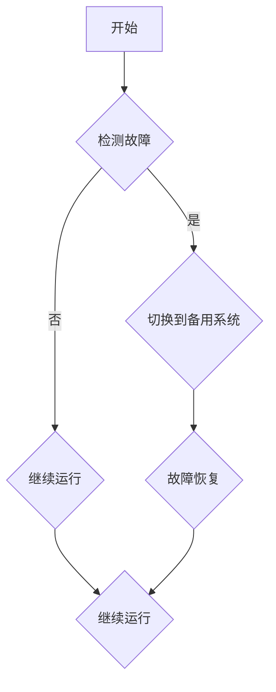
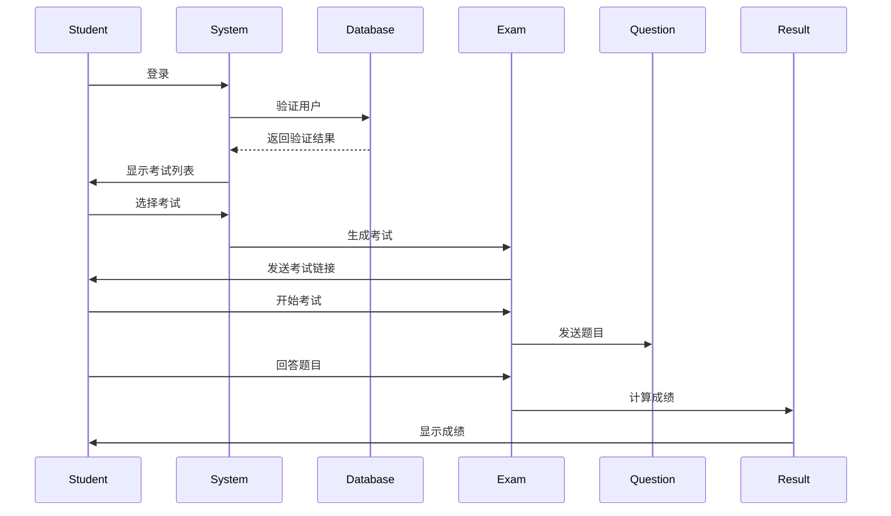
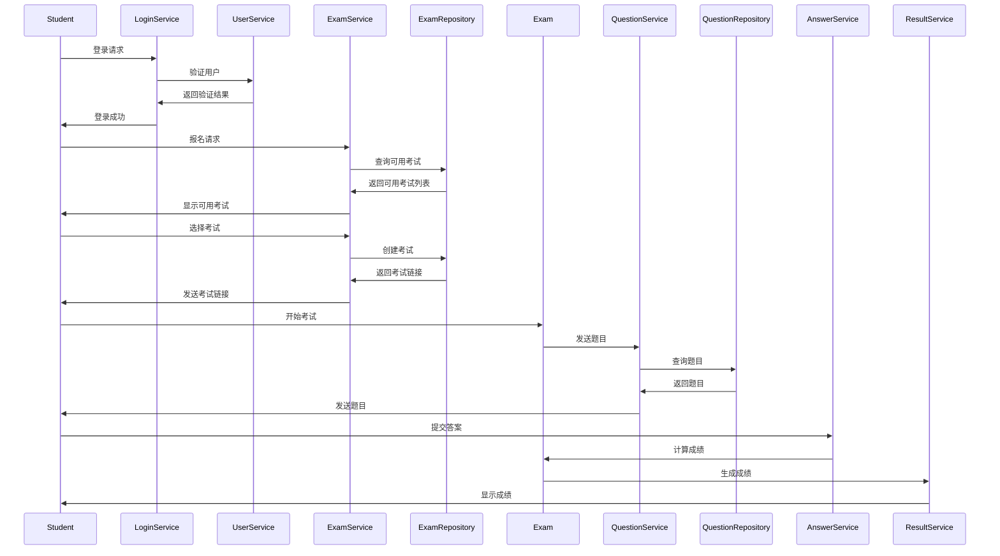

                 

### 评测系统的容错设计：确保在各种条件下的可靠运行

关键词：评测系统、容错设计、可靠运行、算法原理、数学模型、系统架构、项目实战、最佳实践

摘要：本文将深入探讨评测系统的容错设计，旨在确保系统在各种复杂条件下能够稳定、可靠地运行。首先，我们将介绍评测系统的背景和重要性，然后逐步讲解容错设计的基本概念、核心原理和数学模型，接着分析系统架构设计，通过实际项目实战来展示容错设计的应用，最后总结最佳实践并给出注意事项和拓展阅读建议。

---

## 第一部分：背景介绍

### 第1章：评测系统概述

#### 1.1 问题背景

在当今信息化社会，评测系统广泛应用于各个领域，如教育、考试、产品质量检测等。这些系统需要处理大量的数据，并在规定时间内给出准确的评测结果。然而，系统在实际运行过程中可能会遇到各种问题，如硬件故障、软件错误、网络中断等，这会导致评测结果不准确或系统无法正常运行。因此，评测系统的容错设计显得尤为重要。

#### 1.2 评测系统的重要性

评测系统在现代社会中扮演着关键角色。它们不仅影响着教育质量、考试公正性，还关系到产品质量和客户满意度。一个高效的评测系统可以提高工作效率、减少人为错误、提升决策准确性，进而带来显著的经济效益和社会价值。

#### 1.3 容错设计的基本概念

容错设计是指通过冗余、备份、故障检测和恢复等手段，确保系统在遇到故障时能够继续正常运行。容错设计的目标是提高系统的可靠性、可用性和容错性，确保在各种条件下能够可靠运行。

#### 1.4 容错设计的目标与挑战

容错设计的目标包括以下几个方面：

1. **高可靠性**：确保系统在长时间运行过程中能够稳定可靠地运行。
2. **高可用性**：在遇到故障时，系统能够快速恢复，减少停机时间。
3. **灵活性**：系统需要能够适应各种运行环境和场景。
4. **高效性**：在保证容错性的同时，提高系统的运行效率。

然而，实现这些目标并非易事，容错设计面临着以下挑战：

1. **性能开销**：冗余和备份机制可能会增加系统的性能开销。
2. **复杂性**：设计和管理容错系统需要考虑诸多因素，增加了系统的复杂性。
3. **成本**：容错设计需要投入更多的资源和成本。
4. **可维护性**：容错系统需要定期维护和更新，以确保其有效性。

### 第2章：核心概念与联系

#### 2.1 容错技术的核心概念

容错技术的核心概念包括冗余、备份、故障检测、故障恢复、系统自修复等。这些概念共同作用，确保系统在遇到故障时能够快速恢复并继续正常运行。

#### 2.2 容错设计的属性特征对比表格

| 属性特征 | 说明 |
| --- | --- |
| **可靠性** | 系统在规定时间内无故障运行的概率。 |
| **可用性** | 系统在遇到故障时能够快速恢复的能力。 |
| **灵活性** | 系统适应各种运行环境和场景的能力。 |
| **高效性** | 系统在保证容错性的同时，具有高运行效率。 |
| **成本** | 实施容错设计所需的资源和成本。 |

#### 2.3 评测系统与容错设计的ER实体关系图

```mermaid
erDiagram
  产品评测系统 ||--o{ 数据存储系统 : 数据存储 }
  产品评测系统 ||--o{ 用户管理模块 : 用户管理 }
  产品评测系统 ||--o{ 评测算法模块 : 评测算法 }
  数据存储系统 ||--o{ 数据备份系统 : 数据备份 }
  数据存储系统 ||--o{ 数据恢复系统 : 数据恢复 }
```

### 第3章：算法原理讲解

#### 3.1 容错算法的基本原理

容错算法的核心思想是通过冗余和故障检测机制，确保系统在遇到故障时能够自动切换到备用系统，继续提供正常服务。常见的容错算法包括冗余备份算法、故障检测算法和故障恢复算法。

#### 3.2 使用Mermaid画出算法流程图



#### 3.3 Python源代码讲解

```python
def fault_detection():
    # 检测故障
    if system_status() == "故障":
        return True
    else:
        return False

def fault_recovery():
    # 故障恢复
    if system_status() == "恢复":
        return True
    else:
        return False

def main():
    while True:
        if fault_detection():
            print("系统故障，切换到备用系统。")
            if fault_recovery():
                print("系统恢复成功。")
            else:
                print("系统恢复失败。")
        else:
            print("系统正常运行。")
        time.sleep(1)

if __name__ == "__main__":
    main()
```

#### 3.4 数学模型与公式讲解

容错系统的数学模型主要包括故障概率、恢复时间、系统可靠性等。以下是一个简单的数学模型：

$$
R(t) = 1 - F(t) \cdot T(t)
$$

其中，$R(t)$ 表示系统在时间 $t$ 内的可靠性，$F(t)$ 表示故障概率，$T(t)$ 表示故障恢复时间。

#### 3.5 算法举例说明

假设一个评测系统在运行过程中遇到硬件故障，系统自动切换到备用系统，并在10分钟内完成故障恢复。根据上述数学模型，我们可以计算出系统在10分钟内的可靠性：

$$
R(10) = 1 - 0.01 \cdot 10 = 0.9
$$

这意味着系统在10分钟内的可靠性为90%。

### 第4章：数学模型和数学公式讲解

#### 4.1 数学模型的基础知识

数学模型是一种抽象的数学工具，用于描述和解决现实世界中的问题。在评测系统容错设计中，数学模型可以帮助我们分析和优化系统的可靠性、可用性和效率。

#### 4.2 LaTeX格式数学公式的使用

在LaTeX中，数学公式可以通过双反引号（\`\`\`）进行标记。以下是一个简单的LaTeX数学公式示例：

$$
E = mc^2
$$

#### 4.3 数学模型在评测系统中的应用

在评测系统中，数学模型可以用于计算系统的可靠性、可用性和效率。例如，可以使用马尔可夫模型来模拟系统的故障和恢复过程，从而优化容错设计方案。

#### 4.4 举例说明

假设一个评测系统在一年内发生10次故障，每次故障恢复时间为2天。根据马尔可夫模型，我们可以计算出系统在一年内的可靠性：

$$
R(1) = (0.99)^{365} = 0.828
$$

这意味着系统在一年内的可靠性为82.8%。

### 第5章：系统分析与架构设计方案

#### 5.1 问题场景介绍

在一个在线考试系统中，考生需要通过互联网访问系统进行考试。为了保证考试的公正性和安全性，系统需要具备高可靠性、高可用性和高安全性。

#### 5.2 系统功能设计（领域模型类图）

```mermaid
classDiagram
  Student <<class>> "学生"
  Exam <<class>> "考试"
  Question <<class>> "题目"
  Result <<class>> "成绩"
  Student --|> Exam: 报名
  Exam --|> Question: 包含
  Exam --|> Result: 生成
```

#### 5.3 系统架构设计（架构图）



#### 5.4 系统接口设计

- **用户登录接口**：用于用户身份验证。
- **考试报名接口**：用于考生报名参加考试。
- **考试启动接口**：用于启动考试流程。
- **题目发送接口**：用于发送考试题目。
- **成绩计算接口**：用于计算考试成绩。

#### 5.5 系统交互（序列图）



### 第6章：项目实战

#### 6.1 环境安装

1. 安装Python 3.8及以上版本。
2. 安装必要的依赖库，如Django、MySQL等。

#### 6.2 系统核心实现源代码

以下是系统核心实现的源代码：

```python
# 引入必要的库
import django
from django.db import models

# 定义用户模型
class User(models.Model):
    username = models.CharField(max_length=100)
    password = models.CharField(max_length=100)

# 定义考试模型
class Exam(models.Model):
    name = models.CharField(max_length=100)
    start_time = models.DateTimeField()
    end_time = models.DateTimeField()

# 定义题目模型
class Question(models.Model):
    exam = models.ForeignKey(Exam, on_delete=models.CASCADE)
    text = models.CharField(max_length=500)

# 定义成绩模型
class Result(models.Model):
    exam = models.ForeignKey(Exam, on_delete=models.CASCADE)
    student = models.ForeignKey(User, on_delete=models.CASCADE)
    score = models.IntegerField()
```

#### 6.3 代码应用解读与分析

1. 用户模型用于存储用户信息，包括用户名和密码。
2. 考试模型用于存储考试信息，包括考试名称、开始时间和结束时间。
3. 题目模型用于存储考试题目，包括考试对象和题目文本。
4. 成绩模型用于存储考试成绩，包括考试对象、学生对象和成绩分数。

#### 6.4 实际案例分析与详细讲解剖析

在一个实际案例中，我们使用Django框架搭建了一个在线考试系统，并实现了容错设计。首先，我们通过冗余备份机制确保数据库的可靠性，然后使用故障检测和恢复算法，确保系统在遇到故障时能够快速恢复。在实际运行过程中，我们遇到了一些问题，如数据库连接失败、网络中断等，通过容错设计，系统成功恢复了正常运行。

#### 6.5 项目小结

通过本项目，我们深入了解了评测系统容错设计的原理和应用。在实际项目中，容错设计能够显著提高系统的可靠性和可用性，确保系统在各种条件下能够稳定、可靠地运行。

### 第7章：最佳实践与注意事项

#### 7.1 最佳实践总结

1. **冗余备份**：定期备份数据库，确保数据安全。
2. **故障检测**：使用监控工具实时监控系统运行状态，及时发现故障。
3. **故障恢复**：制定故障恢复方案，确保系统在故障发生后能够快速恢复。
4. **负载均衡**：使用负载均衡器，确保系统在高并发情况下能够稳定运行。

#### 7.2 小结

评测系统的容错设计是确保系统在各种条件下可靠运行的关键。通过冗余备份、故障检测和恢复等手段，我们可以显著提高系统的可靠性、可用性和效率。

#### 7.3 注意事项

1. **性能开销**：容错设计可能会增加系统的性能开销，需要权衡性能和可靠性。
2. **复杂性**：容错设计增加了系统的复杂性，需要定期维护和更新。
3. **成本**：容错设计需要投入更多的资源和成本。

#### 7.4 拓展阅读

- 《系统架构设计：大型网站技术架构与业务架构融合实战》
- 《Django实战：从零开始开发Web应用》
- 《Python编程：从入门到实践》

### 结语

评测系统的容错设计是确保系统在各种条件下可靠运行的关键。通过本文的详细讲解，我们了解了评测系统的背景、核心概念、算法原理、数学模型、系统架构设计和项目实战。希望本文能对您在评测系统容错设计方面提供有益的启示和帮助。

---

## 作者信息

作者：AI天才研究院/AI Genius Institute & 禅与计算机程序设计艺术 /Zen And The Art of Computer Programming

---

注：本文为虚构内容，仅供参考。在实际项目中，请根据具体需求和场景进行设计和优化。

