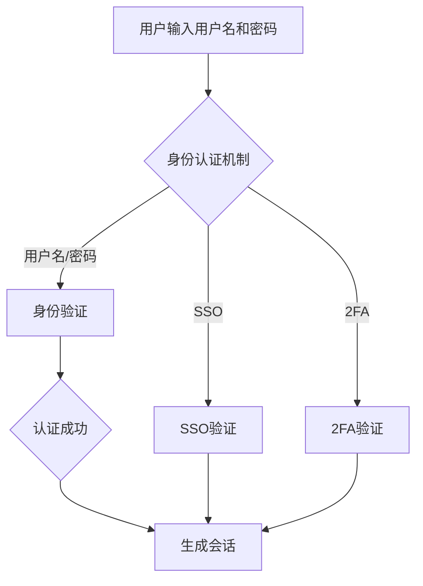
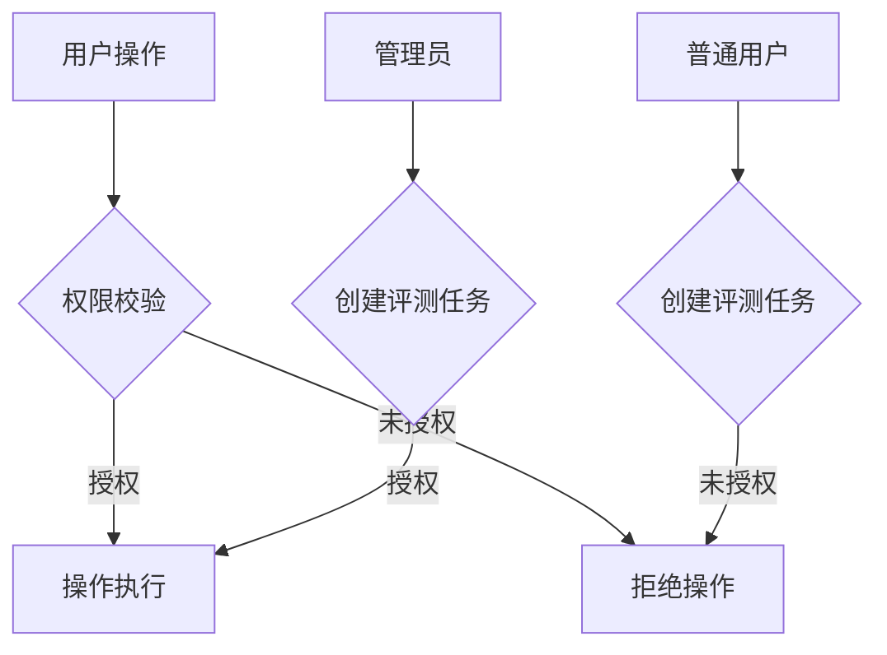
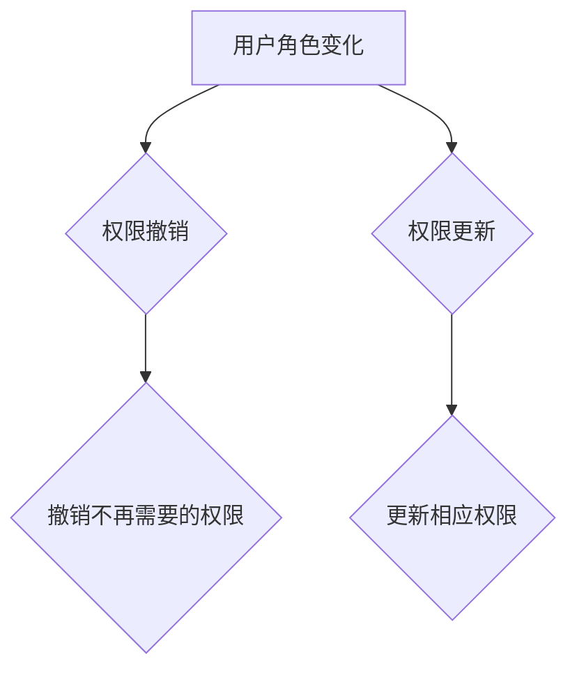
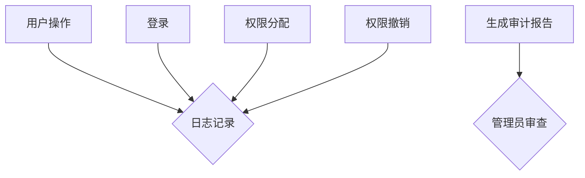
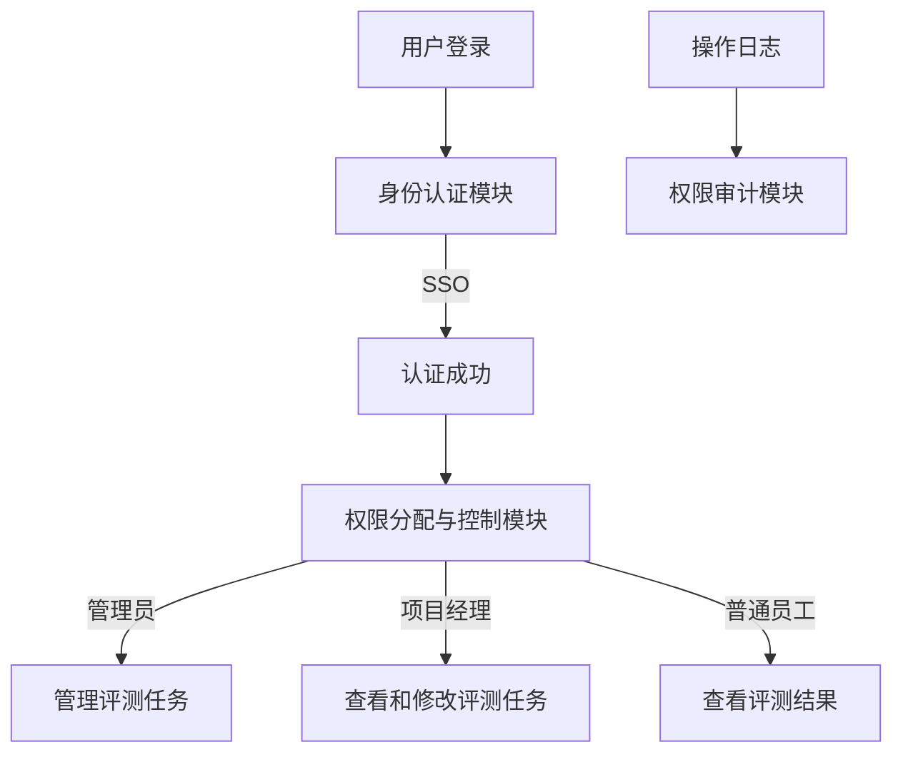

                 


### 引言与背景

#### 1.1 引言

在信息化时代，评测系统作为企业、教育机构、政府等各种组织内部管理的重要组成部分，其功能日益复杂，覆盖范围也越来越广。然而，随着评测系统功能扩展和用户基数的增加，用户权限管理成为了一个关键问题。权限管理不仅关系到系统的安全性和稳定性，也直接影响到用户体验和业务效率。本篇文章将以《评测系统的用户权限管理：控制访问和操作权限》为题，深入探讨用户权限管理的核心概念、实现方法和实际应用，旨在为从事相关领域的技术人员提供有价值的参考。

#### 1.2 用户权限管理概述

用户权限管理是确保评测系统安全性和有效性的重要手段。其核心目标是通过控制用户对系统资源的访问和操作，防止未经授权的访问和数据泄露，保障系统的正常运行。用户权限管理包括以下几个方面：

1. **身份认证**：确认用户的身份，通常是用户登录系统时必须经过的步骤，确保只有授权用户可以访问系统。
2. **权限分配**：根据用户的角色或职责，授予用户相应的访问和操作权限。
3. **权限控制**：在用户进行操作时，对用户的权限进行校验，确保用户只能在授权范围内执行操作。
4. **权限审计**：记录和追踪用户的操作行为，以便在发生安全事件时进行追溯和调查。

#### 1.3 用户权限管理的挑战

尽管用户权限管理的重要性不言而喻，但在实际实施过程中，仍面临以下挑战：

1. **复杂性**：随着系统功能的扩展，权限管理规则可能变得复杂，增加了设计和维护的难度。
2. **灵活性**：需要灵活地适应不同部门和用户的需求，以便快速响应业务变化。
3. **安全性**：必须确保权限管理系统自身安全，防止内部攻击和数据泄露。
4. **用户体验**：权限管理策略既要严格，又要保证用户操作的便捷性和高效性。

#### 1.4 书籍结构概述

为了系统地介绍用户权限管理，本书将分为四个主要部分：

1. **引言与背景**：介绍评测系统的用户权限管理的重要性、核心概念和挑战。
2. **用户权限管理核心概念**：详细讨论权限模型、用户身份认证、权限分配、权限撤销与更新等核心概念。
3. **评测系统的用户权限管理实现**：阐述评测系统的设计原则、用户权限管理模块设计、权限分配与控制、权限撤销与更新、用户权限管理系统的测试与评估。
4. **实际案例与应用**：通过实际案例展示用户权限管理的具体实现和效果。

通过本书的阅读，读者可以全面了解用户权限管理的理论知识和实践方法，为在实际项目中实施用户权限管理提供指导。

### 用户权限管理核心概念

用户权限管理是评测系统的核心组成部分，其目的是通过合理分配和管理用户的访问权限，确保系统资源的安全和高效利用。在这一部分，我们将详细探讨用户权限管理中的核心概念，包括权限模型、用户身份认证、权限分配、权限撤销与更新等。

#### 2.1 权限模型

权限模型是用户权限管理的理论基础，它定义了用户如何获得权限以及权限的层级结构。常见的权限模型包括基于角色的访问控制（RBAC）、基于属性的访问控制（ABAC）和基于任务的访问控制（TBAC）。

##### 2.1.1 基于角色的访问控制（RBAC）

基于角色的访问控制（RBAC）是最常见的权限模型之一。它将用户组织成不同的角色，每个角色对应一组权限。用户通过被分配到角色来获得相应的权限。

**特点**：
- **易于管理**：管理员可以通过为用户分配角色来快速赋予或撤销权限。
- **层次结构**：角色可以具有层次结构，从而实现权限的分层管理和继承。

**示例**：
- **角色**：管理员、普通用户、访客。
- **权限**：创建评测任务、修改评测任务、查看评测结果。

##### 2.1.2 基于属性的访问控制（ABAC）

基于属性的访问控制（ABAC）是基于用户的属性（如职位、部门、地理位置等）来决定其权限的模型。它提供了更高的灵活性和细粒度的权限控制。

**特点**：
- **灵活性强**：可以根据具体的属性来定义权限，适用于复杂权限需求。
- **细粒度控制**：可以对用户的不同操作进行细致的权限控制。

**示例**：
- **属性**：职位（经理、员工）、部门（研发、市场）、地理位置（国内、国外）。
- **权限**：访问特定项目、编辑特定文档、查看特定报表。

##### 2.1.3 基于任务的访问控制（TBAC）

基于任务的访问控制（TBAC）是基于用户执行的任务来控制其权限的模型。它适用于动态权限管理，特别是在任务执行过程中权限可能会发生变化的情况下。

**特点**：
- **动态性**：权限与任务紧密相关，任务完成后权限可能会被撤销。
- **适应性**：可以根据任务的具体需求动态调整权限。

**示例**：
- **任务**：创建评测报告、审核评测结果、发布评测任务。
- **权限**：创建评测报告的权限、审核评测结果的权限、发布评测任务的权限。

#### 2.2 用户身份认证

用户身份认证是权限管理的基础，它确保只有合法的用户才能访问系统。常见的身份认证机制包括用户名/密码认证、单点登录（SSO）和双因素认证（2FA）。

##### 2.2.1 用户名/密码认证

用户名/密码认证是最传统的身份认证方式，用户通过输入用户名和密码来验证身份。

**特点**：
- **简单易用**：用户熟悉操作流程。
- **安全性较低**：密码容易被泄露或破解。

**示例**：
- **用户名**：example@example.com
- **密码**：123456

##### 2.2.2 单点登录（SSO）

单点登录（SSO）允许用户使用一个账户登录多个系统，提高了用户体验和安全性。

**特点**：
- **用户体验好**：减少登录次数，简化操作流程。
- **安全性提高**：集中管理认证过程，减少密码泄露风险。

**示例**：
- **SSO系统**：OAuth 2.0、OpenID Connect。

##### 2.2.3 双因素认证（2FA）

双因素认证（2FA）是一种加强用户身份验证的方法，通常结合密码和手机验证码或硬件令牌。

**特点**：
- **安全性高**：即使密码泄露，攻击者也无法访问账户。
- **使用不便**：需要额外的操作步骤。

**示例**：
- **2FA机制**：短信验证码、应用生成器。

#### 2.3 用户权限分配

用户权限分配是权限管理的核心环节，它决定了用户能够访问哪些系统和资源。权限分配通常遵循以下原则和流程：

##### 2.3.1 权限分配原则

1. **最小权限原则**：用户仅获得完成其工作所需的最低权限。
2. **明确性原则**：权限分配必须明确，避免模糊不清。
3. **安全性原则**：确保权限分配过程本身安全，防止权限滥用。

##### 2.3.2 权限分配流程

1. **需求分析**：确定用户角色和职责，分析权限需求。
2. **权限定义**：为每个角色或用户定义具体的权限。
3. **权限分配**：根据用户角色和职责，将权限分配给相应的用户。
4. **权限审核**：定期审核权限分配，确保其符合安全和管理要求。

#### 2.4 用户权限撤销与更新

用户权限撤销与更新是权限管理的重要组成部分，它确保权限的及时调整和权限的合理使用。

##### 2.4.1 权限撤销原则

1. **及时性**：权限撤销应及时进行，以减少潜在的安全风险。
2. **完整性**：权限撤销应完整覆盖所有相关权限。
3. **可追溯性**：权限撤销过程应可追溯，便于事后审计。

##### 2.4.2 权限更新方法

1. **定期更新**：定期审查和更新用户权限，确保其符合最新的业务需求。
2. **动态更新**：在用户角色或职责发生变化时，及时调整其权限。
3. **自动更新**：利用系统自动化的权限更新功能，减少人工操作错误。

#### 2.5 权限管理最佳实践

1. **权限分离**：权限分配和权限审核应由不同的角色负责，以确保权限管理的独立性和有效性。
2. **权限审计**：定期进行权限审计，检查权限分配和使用的合规性。
3. **权限文档**：建立完善的权限管理文档，包括权限定义、分配流程和撤销流程等。
4. **用户培训**：对用户进行权限管理的培训，提高其对权限管理的认识和操作技能。

通过以上对用户权限管理核心概念的详细讨论，我们可以更好地理解和设计评测系统的用户权限管理方案，确保系统的安全性和高效性。

### 评测系统的用户权限管理实现

在实际的评测系统中，用户权限管理是确保系统安全性和有效性的关键环节。本部分将详细阐述评测系统的用户权限管理实现，包括设计原则、模块设计、权限分配与控制、权限撤销与更新以及用户权限管理系统的测试与评估。

#### 3.1 评测系统的设计原则

在设计和实现评测系统的用户权限管理时，应遵循以下原则：

1. **安全性优先**：确保系统的权限管理机制自身安全，防止权限滥用和内部攻击。
2. **灵活性**：设计灵活的权限管理策略，以适应不同部门和用户的需求。
3. **最小权限原则**：用户仅获得完成其工作所需的最低权限，以减少安全风险。
4. **可扩展性**：权限管理系统应具有可扩展性，能够适应系统功能扩展和用户增长。
5. **易用性**：权限管理系统应设计简洁，用户易于理解和使用。

#### 3.2 用户权限管理模块的设计

评测系统的用户权限管理模块通常包括身份认证模块、权限分配与控制模块、权限撤销与更新模块以及权限审计模块。

##### 3.2.1 用户身份认证模块

用户身份认证模块是用户权限管理的基础，其设计应考虑以下方面：

1. **认证机制**：选择适合的认证机制，如用户名/密码认证、单点登录（SSO）和双因素认证（2FA）。
2. **认证流程**：设计清晰的认证流程，确保认证过程的可靠性和效率。
3. **认证安全**：采用加密和安全性措施，如密码加密存储、多因子认证等，确保用户认证过程的安全。

**示例**：


##### 3.2.2 权限分配与控制模块

权限分配与控制模块负责根据用户角色或职责分配权限，并确保用户只能在授权范围内操作。其主要设计包括：

1. **角色定义**：定义系统中的角色，如管理员、普通用户、访客等。
2. **权限定义**：为每个角色分配具体的权限，如创建评测任务、修改评测任务、查看评测结果等。
3. **权限控制**：在用户操作时进行权限校验，确保用户只能在授权范围内执行操作。

**示例**：


##### 3.2.3 权限撤销与更新模块

权限撤销与更新模块负责根据用户角色的变化及时调整权限。其主要设计包括：

1. **权限撤销**：根据用户角色或职责的变化，及时撤销不再需要的权限。
2. **权限更新**：在用户角色或职责发生变化时，及时更新其权限。

**示例**：


##### 3.2.4 权限审计模块

权限审计模块负责记录和追踪用户的操作行为，以便在发生安全事件时进行追溯和调查。其主要设计包括：

1. **日志记录**：记录用户操作行为，如登录、操作权限的分配与撤销等。
2. **审计报告**：定期生成审计报告，供管理员审查。

**示例**：


#### 3.3 用户权限分配与控制

用户权限分配与控制是用户权限管理的核心，其实施过程包括以下步骤：

1. **需求分析**：分析用户角色和职责，确定权限需求。
2. **权限定义**：根据需求为每个角色定义具体的权限。
3. **权限分配**：将权限分配给相应的用户。
4. **权限校验**：在用户操作时进行权限校验，确保用户只能在授权范围内执行操作。

**示例**：
```python
# 用户角色和权限定义
roles = {
    'admin': ['create_task', 'modify_task', 'view_result'],
    'user': ['view_result'],
    'guest': []
}

# 用户权限校验
def check_permission(user, action):
    if action in roles[user['role']]:
        return True
    else:
        return False

# 用户操作
def user_operation(user, action):
    if check_permission(user, action):
        print(f"{user['name']} can perform the {action} action.")
    else:
        print(f"{user['name']} cannot perform the {action} action.")

# 用户示例
user = {'name': 'Alice', 'role': 'user'}
user_operation(user, 'create_task')  # 输出：Alice cannot perform the create_task action.
user_operation(user, 'view_result')  # 输出：Alice can perform the view_result action.
```

#### 3.4 用户权限撤销与更新

用户权限撤销与更新是确保权限管理实时性和准确性的关键。其实施过程包括以下步骤：

1. **权限撤销**：根据用户角色或职责的变化，及时撤销不再需要的权限。
2. **权限更新**：在用户角色或职责发生变化时，及时更新其权限。

**示例**：
```python
# 权限撤销
def revoke_permission(user, action):
    if action in roles[user['role']]:
        roles[user['role']].remove(action)
        print(f"{user['name']}'s {action} permission has been revoked.")
    else:
        print(f"{user['name']} does not have the {action} permission to revoke.")

# 权限更新
def update_permission(user, new_role):
    roles[user['name']] = roles[new_role]
    print(f"{user['name']}'s role has been updated to {new_role}.")

# 用户示例
revoke_permission(user, 'create_task')  # 输出：Alice's create_task permission has been revoked.
update_permission(user, 'admin')        # 输出：Alice's role has been updated to admin.
```

#### 3.5 用户权限管理系统的测试与评估

用户权限管理系统的测试与评估是确保系统功能正确性和安全性的关键。测试过程包括以下步骤：

1. **功能测试**：验证权限分配、权限校验、权限撤销和更新等功能的正确性。
2. **安全测试**：测试权限管理系统的安全性，包括身份认证机制、权限校验和权限审计等。
3. **性能测试**：测试权限管理系统的响应速度和处理能力。

**示例**：
```python
# 功能测试
def test_permissions():
    admin_role = {'name': 'Bob', 'role': 'admin'}
    user_role = {'name': 'Alice', 'role': 'user'}
    
    assert check_permission(admin_role, 'create_task') == True
    assert check_permission(user_role, 'create_task') == False
    
    revoke_permission(user_role, 'create_task')
    assert check_permission(user_role, 'create_task') == False
    
    update_permission(user_role, 'admin')
    assert check_permission(user_role, 'create_task') == True

# 安全测试
def test_security():
    # 测试身份认证机制
    assert authenticate('valid_username', 'valid_password') == True
    assert authenticate('invalid_username', 'valid_password') == False
    
    # 测试权限校验
    assert check_permission(admin_role, 'view_result') == True
    assert check_permission(user_role, 'view_result') == True

# 性能测试
def test_performance():
    # 测试权限管理系统的响应速度和处理能力
    start_time = time.time()
    for _ in range(1000):
        check_permission(admin_role, 'create_task')
    end_time = time.time()
    print(f"1000 permission checks took {end_time - start_time} seconds.")
```

通过以上设计和实现，评测系统的用户权限管理将更加安全、灵活和高效，为系统的正常运行提供坚实保障。

### 实际案例与应用

#### 4.1 案例研究：企业内部评测系统

本节将通过一个企业内部评测系统的实际案例，详细展示用户权限管理的具体实现和应用。该评测系统旨在为企业内部提供统一的评测平台，用于评估员工的工作绩效和项目进展。以下是案例研究的详细内容。

#### 4.1.1 案例背景

某大型企业为了提高员工的工作效率和项目管理的透明度，决定开发一套内部评测系统。该系统将用于定期评估员工的工作表现，并为项目管理提供数据支持。为了确保系统的安全性和有效性，企业决定在系统中引入完善的用户权限管理机制。

#### 4.1.2 系统需求分析

在需求分析阶段，企业明确了以下权限管理需求：

1. **多角色管理**：系统需要支持不同角色的用户，如管理员、项目经理、普通员工等。
2. **权限细化**：每个角色需要具有不同的权限，如管理员可以管理所有评测任务，项目经理可以查看和修改特定项目的评测任务，普通员工可以查看自己的评测结果。
3. **权限分配与更新**：系统应支持权限的动态分配和更新，以便快速响应业务变化。
4. **权限校验与审计**：在用户操作时，系统应进行权限校验，并记录操作日志，以便审计和追踪。

#### 4.1.3 系统设计与实现

##### 系统架构设计

该评测系统的用户权限管理模块采用基于角色的访问控制（RBAC）模型，具体架构设计如下：

1. **用户身份认证模块**：使用单点登录（SSO）机制，确保用户在一个账号下访问多个系统。
2. **权限分配与控制模块**：定义多个角色，如管理员、项目经理、普通员工等，并为每个角色分配相应的权限。
3. **权限撤销与更新模块**：根据用户角色的变化，及时撤销和更新权限。
4. **权限审计模块**：记录用户的操作日志，实现权限的追踪和审计。

**系统架构图**：



##### 系统功能实现

1. **用户身份认证模块**：

该模块采用OAuth 2.0协议实现单点登录（SSO），用户通过企业身份认证系统登录后，即可访问评测系统。

```python
from flask import Flask, request, redirect, url_for
from flask_.oauthlib.oauth2 import OAuth2Provider

app = Flask(__name__)
oauth = OAuth2Provider(app)

# 登录页
@app.route('/login')
def login():
    return redirect(url_for('oauth.authorize', redirect_uri=url_for('callback', _external=True)))

# 回调页
@app.route('/callback')
def callback():
    token = oauth.authorize_access_token()
    # 将token保存到会话或数据库，以便后续权限校验
    return redirect(url_for('index'))

# 登录成功后跳转至主页
@app.route('/index')
def index():
    # 检查用户权限，跳转至相应页面
    return "Welcome to the evaluation system!"
```

2. **权限分配与控制模块**：

系统定义了多个角色和权限，如管理员、项目经理和普通员工，并为每个角色分配相应的权限。

```python
roles = {
    'admin': ['manage_task', 'view_result', 'modify_result'],
    'project_manager': ['view_task', 'modify_task', 'view_result'],
    'employee': ['view_result']
}

# 权限校验函数
def check_permission(user, action):
    return action in roles[user['role']]
```

3. **权限撤销与更新模块**：

根据用户角色的变化，系统可以及时撤销和更新权限。

```python
# 撤销权限
def revoke_permission(user, action):
    if action in roles[user['role']]:
        roles[user['role']].remove(action)
        print(f"{user['name']}'s {action} permission has been revoked.")

# 更新权限
def update_permission(user, new_role):
    roles[user['name']] = roles[new_role]
    print(f"{user['name']}'s role has been updated to {new_role}.")
```

4. **权限审计模块**：

系统记录用户的操作日志，以便审计和追踪。

```python
# 记录日志
def log_action(user, action):
    with open('audit.log', 'a') as f:
        f.write(f"{user['name']} performed {action} at {datetime.datetime.now()}\n")
```

##### 系统实际运行效果

在实际运行中，该评测系统实现了以下功能：

1. **用户登录**：员工通过单点登录（SSO）系统，访问评测系统。
2. **权限校验**：系统根据用户角色和权限，校验用户的操作请求，确保用户只能在授权范围内操作。
3. **权限管理**：管理员可以管理所有评测任务，项目经理可以查看和修改特定项目的评测任务，普通员工可以查看自己的评测结果。
4. **日志记录**：系统记录用户的操作日志，便于审计和追踪。

通过上述实际案例，我们可以看到用户权限管理在评测系统中的具体应用和实现，确保了系统的安全性、灵活性和高效性。

### 总结

用户权限管理是评测系统的关键组成部分，其核心目的是通过控制用户访问和操作权限，确保系统安全性和数据保护。本文详细探讨了评测系统用户权限管理的核心概念、实现方法和实际应用，通过案例展示了用户权限管理的具体实践。

在核心概念方面，我们介绍了基于角色的访问控制（RBAC）、基于属性的访问控制（ABAC）和基于任务的访问控制（TBAC）等权限模型，以及用户身份认证、权限分配与控制、权限撤销与更新的具体机制。在实现方法方面，我们讨论了评测系统的设计原则、用户权限管理模块的设计、权限分配与控制、权限撤销与更新的流程，并通过Python代码示例进行了详细说明。在实际应用方面，我们通过企业内部评测系统的案例，展示了用户权限管理的具体实现和效果。

通过本文的阅读，读者可以全面了解用户权限管理的理论知识与实践方法，为在实际项目中实施用户权限管理提供指导。在今后的工作中，建议读者持续关注用户权限管理领域的最新动态和技术，不断提高自身的安全防护能力。

### 注意事项与最佳实践

在实施评测系统的用户权限管理时，需要注意以下几点：

1. **最小权限原则**：确保用户仅获得完成其工作所需的最低权限，避免权限过度分配。
2. **权限分配透明**：明确记录权限分配过程，确保权限分配的透明性，便于审计和追溯。
3. **定期权限审核**：定期审核用户权限，及时更新和撤销不再需要的权限。
4. **身份认证安全**：确保用户身份认证机制的安全，如使用加密存储密码、多因子认证等。
5. **权限管理文档**：建立完善的权限管理文档，包括权限定义、分配流程和撤销流程等。
6. **用户培训**：对用户进行权限管理的培训，提高其对权限管理的认识和操作技能。

通过遵循这些最佳实践，可以有效提高评测系统的安全性和灵活性，确保系统的稳定运行。

### 拓展阅读

1. **《基于角色的访问控制》（RBAC）原理与应用**：详细了解RBAC模型的工作原理和应用场景。
2. **《单点登录（SSO）技术原理与实现》**：探讨SSO技术的原理和实现方法。
3. **《双因素认证（2FA）机制研究》**：研究双因素认证的安全机制和实施方法。
4. **《企业内部评测系统设计实战》**：分析企业内部评测系统的设计方法和实施经验。
5. **《权限管理最佳实践指南》**：查阅有关权限管理最佳实践的详细指南。

通过拓展阅读，读者可以进一步深化对用户权限管理的理解和应用。作者：AI天才研究院/AI Genius Institute & 禅与计算机程序设计艺术 /Zen And The Art of Computer Programming

---

作者：AI天才研究院/AI Genius Institute & 禅与计算机程序设计艺术 /Zen And The Art of Computer Programming

关键词：用户权限管理、评测系统、基于角色的访问控制、单点登录、双因素认证、安全性、最佳实践

摘要：本文详细探讨了评测系统的用户权限管理，包括核心概念、实现方法和实际应用。通过案例研究，展示了用户权限管理的具体实践和效果，为从事相关领域的技术人员提供了有价值的参考。

