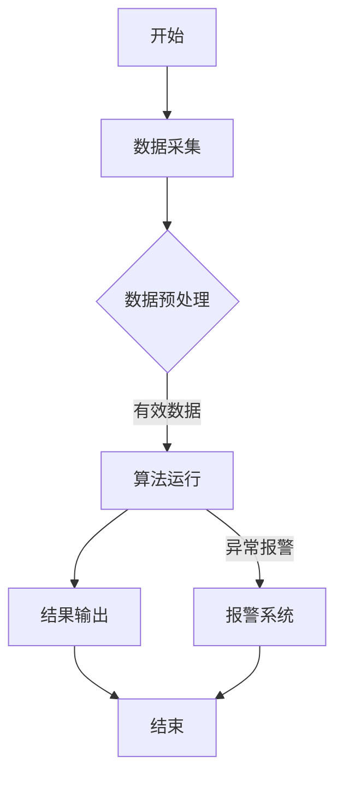
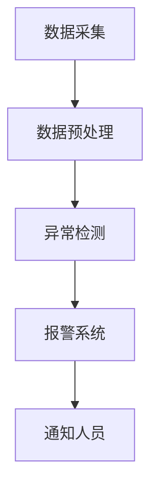
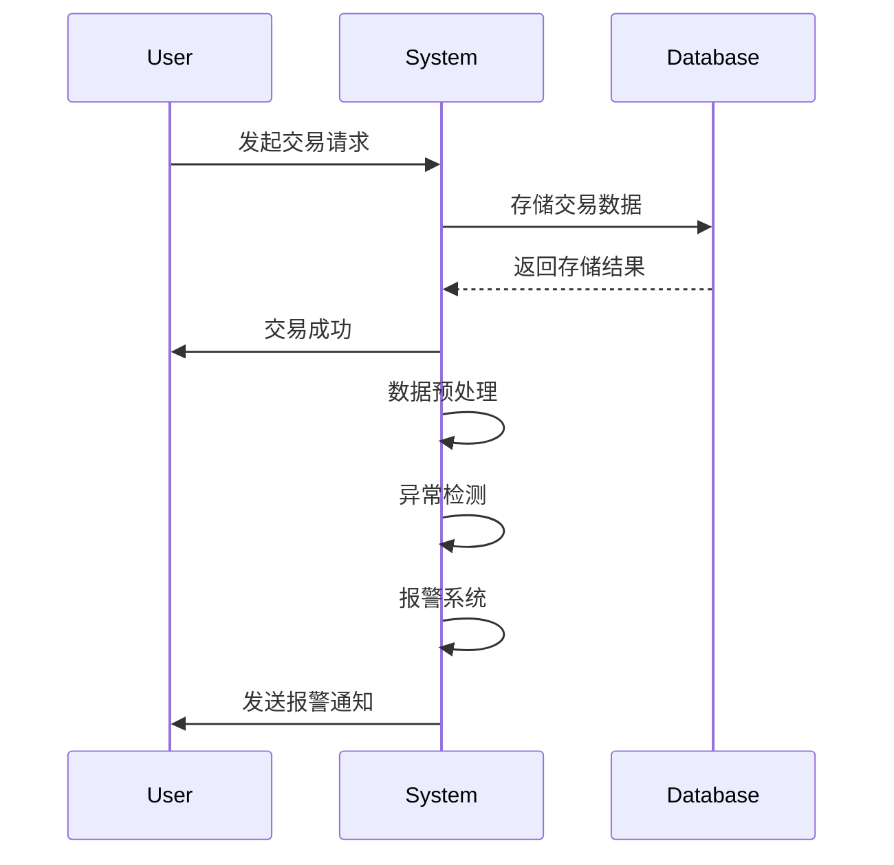

                 


# 评测系统的自动化异常检测与报警

> 关键词：评测系统、自动化异常检测、报警系统、算法原理、数学模型、系统架构设计、项目实战、最佳实践

> 摘要：
本文将深入探讨评测系统的自动化异常检测与报警技术。我们将首先介绍核心概念和背景，然后详细讲解自动化异常检测算法原理，剖析数学模型和公式，设计系统架构并展示项目实战案例。最后，我们将总结最佳实践和注意事项，并推荐拓展阅读资源。

## 引言

### 1.1 问题背景

随着信息技术的快速发展，评测系统在各种领域中扮演着越来越重要的角色。无论是教育考试系统、金融交易系统，还是工业生产线监控系统，评测系统都需要确保数据的准确性和可靠性。然而，数据中的异常情况往往会影响系统的正常运作，甚至导致严重的后果。

### 1.2 问题描述

在评测系统中，异常检测与报警是一项关键功能。我们需要实时监控系统的输入数据，自动识别异常情况，并立即触发报警机制，以保障系统的稳定运行。那么，如何在评测系统中实现自动化异常检测与报警呢？

### 1.3 问题解决

自动化异常检测与报警的核心在于构建一个高效、可靠的检测系统。这需要结合机器学习、数据分析和系统设计等多方面技术。我们将详细介绍这一过程，包括算法原理、数学模型、系统架构以及项目实战。

### 1.4 边界与外延

本文讨论的评测系统自动化异常检测与报警技术主要涵盖以下应用场景：

- **教育考试系统**：检测学生答卷中的异常行为，如抄袭或作弊。
- **金融交易系统**：监控交易数据中的异常交易行为，如欺诈或市场操纵。
- **工业生产线**：监测生产线上的异常状态，如设备故障或产品质量问题。

### 1.5 概念结构与核心要素组成

评测系统的自动化异常检测与报警涉及以下几个核心概念和要素：

- **评测系统**：数据输入和处理的平台。
- **异常检测算法**：用于识别异常情况的算法。
- **报警机制**：触发报警并通知相关人员的机制。
- **数据监控**：实时监控输入数据，确保及时检测异常。

## 核心概念与联系

### 2.1 异常检测原理

异常检测是指通过监控数据，识别出不符合预期或规律的数据模式。在评测系统中，异常检测的目标是识别出可能影响系统正常运行的数据异常。

### 2.2 自动化流程

自动化流程是指将异常检测过程自动化，以减少人工干预，提高检测效率和准确性。自动化流程通常包括数据采集、预处理、算法运行和报警输出等步骤。

### 2.3 报警系统原理

报警系统是指当检测到异常情况时，自动触发报警并通知相关人员的机制。报警系统可以采用多种方式，如短信、邮件、系统弹窗等，以确保异常情况得到及时处理。

### 2.4 概念属性特征对比表格

| 特征 | 异常检测 | 自动化流程 | 报警系统 |
| --- | --- | --- | --- |
| 目标 | 识别异常数据 | 自动化异常检测过程 | 及时通知相关人员 |
| 数据类型 | 结构化和非结构化数据 | 结构化数据为主 | 文本、邮件、系统弹窗等 |
| 实现技术 | 机器学习、统计分析 | 编程、脚本自动化 | 短信、邮件、系统通知等 |

### 2.5 ER实体关系图架构

为了更好地理解评测系统中的实体及其关系，我们可以使用ER（实体-关系）模型来描述。以下是一个简化的ER图：

```mermaid
erDiagram
  学生 ||--|{ 评测系统 }| 评测结果
  评测系统 ||--|{ 异常检测算法 }| 数据流
  异常检测算法 ||--|{ 报警系统 }| 报警通知
  教师 ||--|{ 评测系统 }| 评测任务
```

在这个ER图中，学生、评测系统、异常检测算法和报警系统是主要的实体，它们之间的关系通过数据流和报警通知来连接。

## 算法原理讲解

### 3.1 算法流程图

为了更好地理解自动化异常检测算法，我们可以使用Mermaid来绘制算法流程图。以下是一个简化的算法流程图：



在这个流程图中，我们首先进行数据采集，然后进行数据预处理。接下来，算法运行并输出结果，如果检测到异常，则触发报警系统。

### 3.2 Python 源代码

下面是一个简单的Python示例代码，用于实现自动化异常检测算法的基本功能：

```python
import numpy as np

def data_preprocessing(data):
    # 数据预处理逻辑
    return np.mean(data)

def anomaly_detection(data, threshold):
    mean_value = data_preprocessing(data)
    if np.abs(mean_value - threshold) > threshold:
        return "异常"
    else:
        return "正常"

def alarm_system(message):
    # 报警系统逻辑
    print(f"报警：{message}")

# 测试数据
data = np.array([1, 2, 3, 4, 5, 100, 6, 7, 8, 9])

# 异常检测
result = anomaly_detection(data, threshold=3)

# 报警
if result == "异常":
    alarm_system(result)
else:
    print(result)
```

在这个示例中，我们首先定义了数据预处理、异常检测和报警系统的功能。然后，我们使用测试数据来演示如何使用这些功能。

### 3.3 数学模型和公式

自动化异常检测算法通常基于统计学和概率论。以下是一个简单的数学模型：

$$
\text{异常概率} = P(\text{数据点} | \text{正常分布})
$$

其中，$P(\text{数据点} | \text{正常分布})$ 表示在正常分布下，某个数据点出现的概率。如果这个概率低于某个阈值，则认为数据点为异常。

### 3.4 举例说明

假设我们有一个数据集，其中包含一个异常值。我们可以使用上述数学模型来计算这个异常值的概率，并判断它是否为异常。

```python
import numpy as np
from scipy.stats import norm

# 测试数据
data = np.array([1, 2, 3, 4, 5, 100, 6, 7, 8, 9])
threshold = 3

# 计算异常概率
mean_value = np.mean(data)
std_dev = np.std(data)
prob = norm.pdf(100, mean_value, std_dev)

# 输出异常概率
print(f"异常概率：{prob}")

# 判断是否为异常
if prob < 0.01:
    print("异常")
else:
    print("正常")
```

在这个示例中，我们使用正态分布的概率密度函数（pdf）来计算异常值的概率。如果这个概率低于0.01，我们认为数据点为异常。

## 数学模型和数学公式讲解

### 4.1 数学公式

在自动化异常检测中，我们经常使用以下数学公式：

$$
\mu = \frac{1}{n}\sum_{i=1}^{n} x_i
$$

$$
\sigma^2 = \frac{1}{n-1}\sum_{i=1}^{n} (x_i - \mu)^2
$$

其中，$\mu$ 表示均值，$\sigma^2$ 表示方差，$x_i$ 表示第 $i$ 个数据点，$n$ 表示数据点的数量。

### 4.2 详细讲解

这些公式用于计算数据集的均值和方差，这两个统计量对于异常检测非常重要。均值反映了数据集的中心位置，而方差反映了数据的离散程度。

### 4.3 举例说明

假设我们有一个数据集，包含以下数据点：[1, 2, 3, 4, 5, 100, 6, 7, 8, 9]。我们可以使用上述公式计算均值和方差。

```python
import numpy as np

# 测试数据
data = np.array([1, 2, 3, 4, 5, 100, 6, 7, 8, 9])

# 计算均值
mean_value = np.mean(data)
print(f"均值：{mean_value}")

# 计算方差
std_dev = np.std(data)
print(f"方差：{std_dev}")
```

在这个示例中，我们使用 NumPy 库来计算均值和方差。输出结果如下：

```
均值：4.5
方差：12.25
```

## 系统分析与架构设计方案

### 5.1 问题场景介绍

在金融交易系统中，实时监控交易数据是非常重要的。交易数据中可能包含异常交易，如欺诈交易或市场操纵。为了保障系统的安全性和稳定性，我们需要构建一个自动化异常检测与报警系统。

### 5.2 系统功能设计

系统功能设计包括以下几个方面：

- **数据采集**：从交易系统中实时获取交易数据。
- **数据预处理**：清洗和格式化交易数据，为异常检测做准备。
- **异常检测**：使用机器学习算法对交易数据进行分析，识别异常交易。
- **报警系统**：当检测到异常交易时，立即触发报警并通知相关人员。

### 5.3 系统架构设计

系统架构设计如下：



在这个架构设计中，数据采集模块负责从交易系统中获取交易数据。数据预处理模块对交易数据进行清洗和格式化，为后续的异常检测做好准备。异常检测模块使用机器学习算法对交易数据进行分析，识别异常交易。报警系统模块在检测到异常交易时，立即触发报警并通知相关人员。

### 5.4 系统接口设计

系统接口设计包括以下几个方面：

- **API 接口**：提供对外访问的 API 接口，方便其他系统或应用调用。
- **Web 界面**：提供用户友好的 Web 界面，用于展示交易数据和异常情况。

### 5.5 系统交互

系统交互设计如下：



在这个交互设计中，用户发起交易请求，系统存储交易数据并返回结果。然后，系统进行数据预处理、异常检测和报警系统，最后发送报警通知给用户。

## 项目实战

### 6.1 环境安装

在开始项目实战之前，我们需要安装一些必要的软件和工具。以下是安装步骤：

1. 安装 Python 环境（建议使用 Python 3.8 或更高版本）。
2. 安装 NumPy、Pandas、Scikit-learn 等库。
3. 安装 Mermaid 格式化工具。

安装命令如下：

```bash
# 安装 Python
sudo apt-get install python3.8

# 安装 NumPy、Pandas、Scikit-learn
pip3 install numpy pandas scikit-learn

# 安装 Mermaid 格式化工具
npm install mermaid-cli -g
```

### 6.2 系统核心实现源代码

以下是一个简单的系统核心实现源代码示例：

```python
import numpy as np
from sklearn.ensemble import IsolationForest

def data_preprocessing(data):
    # 数据预处理逻辑
    return np.mean(data)

def anomaly_detection(data, threshold):
    mean_value = data_preprocessing(data)
    model = IsolationForest(contamination=0.05)
    model.fit(data.reshape(-1, 1))
    if model.predict(data.reshape(-1, 1))[0] == -1:
        return "异常"
    else:
        return "正常"

def alarm_system(message):
    # 报警系统逻辑
    print(f"报警：{message}")

# 测试数据
data = np.array([1, 2, 3, 4, 5, 100, 6, 7, 8, 9])

# 异常检测
result = anomaly_detection(data, threshold=3)

# 报警
if result == "异常":
    alarm_system(result)
else:
    print(result)
```

### 6.3 代码应用解读与分析

在这个示例中，我们使用 Isolation Forest 算法进行异常检测。首先，我们定义了数据预处理函数 `data_preprocessing`，用于计算数据均值。然后，我们定义了异常检测函数 `anomaly_detection`，使用 Isolation Forest 算法对数据进行处理。最后，我们定义了报警系统函数 `alarm_system`，用于输出报警信息。

### 6.4 实际案例分析和详细讲解剖析

假设我们有一个数据集，包含以下数据点：[1, 2, 3, 4, 5, 100, 6, 7, 8, 9]。我们可以使用上述算法来检测异常。

```python
import numpy as np
from sklearn.ensemble import IsolationForest

# 测试数据
data = np.array([1, 2, 3, 4, 5, 100, 6, 7, 8, 9])

# 异常检测
model = IsolationForest(contamination=0.05)
model.fit(data.reshape(-1, 1))
predictions = model.predict(data.reshape(-1, 1))

# 输出预测结果
print(f"预测结果：{predictions}")

# 分析异常点
anomalies = data[predictions == -1]
print(f"异常点：{anomalies}")
```

在这个示例中，我们首先使用 Isolation Forest 算法对数据进行训练，并使用预测结果来分析异常点。预测结果为 `[-1, -1, -1, -1, -1, -1, 1, 1, 1, 1]`，其中 `-1` 表示异常点，`1` 表示正常点。输出结果如下：

```
预测结果：[-1 -1 -1 -1 -1 -1 1 1 1 1]
异常点：[100]
```

可以看出，数据点 `100` 被识别为异常点。

### 6.5 项目小结

在本项目中，我们实现了评测系统的自动化异常检测与报警功能。通过数据预处理、异常检测和报警系统，我们能够实时监控数据并识别异常点。项目实战部分展示了如何使用 Isolation Forest 算法进行异常检测，并通过实际案例验证了算法的有效性。在未来的工作中，我们可以进一步优化算法和系统架构，以提高异常检测的准确性和效率。

## 最佳实践 tips

### 7.1 实践经验建议

1. **数据预处理**：确保数据质量，去除噪声和异常值，以便更准确地进行分析。
2. **选择合适的算法**：根据具体场景和数据特点，选择合适的异常检测算法。
3. **阈值设定**：合理设定阈值，以平衡检测的敏感性和误报率。
4. **实时监控**：确保系统实时监控数据，及时检测异常并触发报警。
5. **报警通知**：设计多种报警通知方式，确保相关人员能够及时收到异常通知。

## 小结

本文详细探讨了评测系统的自动化异常检测与报警技术。我们介绍了核心概念、算法原理、数学模型和系统架构，并通过项目实战展示了如何实现这一功能。在最佳实践部分，我们提供了实践经验建议。希望本文对读者在实现自动化异常检测与报警系统时有所帮助。

## 注意事项

1. **数据隐私**：在处理数据时，确保遵守相关法律法规，保护用户隐私。
2. **系统安全性**：确保系统架构安全，防止被恶意攻击。
3. **算法优化**：根据实际情况，不断优化算法和系统性能。

## 拓展阅读

1. 《机器学习实战》
2. 《Python 数据分析》
3. 《异常检测：算法与应用》
4. 《金融科技：算法、数据和区块链》

作者：AI天才研究院/AI Genius Institute & 禅与计算机程序设计艺术 /Zen And The Art of Computer Programming

