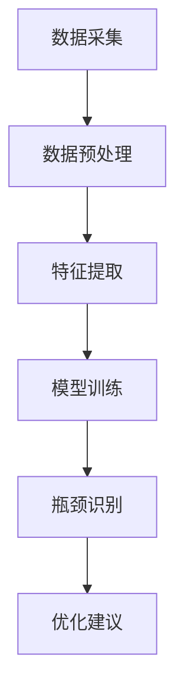

                 

### 性能瓶颈识别的重要性

**为什么要进行性能瓶颈识别**

在当今的信息化社会中，系统性能的稳定性和高效性对于企业的运营和用户体验至关重要。性能瓶颈的识别成为了提升系统性能的关键一步。性能瓶颈指的是系统在运行过程中，某些环节的性能表现不足，成为了限制系统整体性能的“短板”。这些瓶颈可能出现在硬件、软件、网络、数据库等多个层面。

**性能瓶颈识别对系统优化的影响**

性能瓶颈的识别不仅仅是为了发现问题的所在，更重要的是，它为后续的系统优化提供了明确的方向。通过识别性能瓶颈，开发者可以针对性地进行性能调优，从而提升系统的整体性能。例如，通过性能瓶颈的识别，可以找到系统中耗时的环节，进而进行代码优化、硬件升级、网络调整等措施，提升系统的响应速度和处理能力。

**性能瓶颈识别的应用场景**

性能瓶颈识别的应用场景非常广泛，几乎涵盖了所有需要高稳定性、高效率的系统中。以下是一些典型的应用场景：

- **电子商务平台**：在电商平台上，性能瓶颈的识别可以帮助确保用户购物体验的流畅性，减少购物车超时、订单处理缓慢等问题。
- **金融系统**：金融系统的性能瓶颈识别对于确保交易的安全和迅速至关重要，如银行交易系统、证券交易平台等。
- **在线教育平台**：在线教育平台需要处理大量的用户请求，性能瓶颈的识别可以保证教学内容的实时传输和互动性。
- **大数据处理**：在大数据处理领域，性能瓶颈的识别对于确保数据处理的效率和准确性至关重要。
- **物联网系统**：物联网系统中的性能瓶颈识别可以帮助优化设备的响应时间和数据传输效率。

### 性能瓶颈识别的现状

**传统性能瓶颈识别方法**

在过去，性能瓶颈的识别主要依赖于经验判断和手工监测。开发者通过监控系统的日志、性能指标等，结合自己的经验来判断是否存在性能瓶颈。这种方法虽然简单易行，但存在一定的局限性，如数据获取的不全面、分析过程的依赖性高等。

**自动化性能瓶颈识别技术的发展**

随着自动化测试和数据分析技术的发展，性能瓶颈的识别逐渐走向自动化。自动化性能瓶颈识别利用工具和算法，对系统的运行数据进行自动采集、分析和处理，从而快速、准确地识别出性能瓶颈。这种方法的优点是效率高、准确性强，且可以大规模应用于不同系统和场景。

**未来发展趋势**

随着人工智能技术的不断进步，性能瓶颈识别将更加智能化和自动化。未来的性能瓶颈识别技术将能够通过机器学习、深度学习等算法，从大量数据中自动发现性能瓶颈，并提供优化建议。此外，随着云计算和大数据技术的发展，性能瓶颈识别也将更加依赖于云服务和大数据平台，实现更高效、更精准的性能优化。

### 本书目标与内容概述

**本书的目标**

本书旨在系统性地介绍性能瓶颈识别的方法、技术和实践，帮助读者理解和掌握性能瓶颈识别的核心原理，并能够将其应用于实际项目中，提升系统的性能和稳定性。

**本书的内容结构**

本书共分为七个部分，具体内容如下：

1. **第1章 性能瓶颈识别概述**：介绍性能瓶颈识别的重要性、现状和发展趋势。
2. **第2章 相关技术原理**：讲解性能监测、自动化测试和数据分析等相关技术原理。
3. **第3章 性能瓶颈识别算法**：介绍性能瓶颈识别的算法原理、性能评估方法和应用实例。
4. **第4章 性能瓶颈识别系统架构设计**：详细阐述性能瓶颈识别系统的需求分析、架构设计和接口设计。
5. **第5章 系统实现**：介绍性能瓶颈识别系统的实现过程，包括开发环境搭建、核心模块实现和系统测试与调试。
6. **第6章 应用案例**：通过实际案例展示性能瓶颈识别的应用效果，并进行详细分析和讲解。
7. **第7章 最佳实践与总结**：总结性能瓶颈识别的最佳实践，提出注意事项和未来展望。

通过本书的系统性学习，读者可以全面了解性能瓶颈识别的各个方面，掌握性能瓶颈识别的核心技术和方法，为实际项目的性能优化提供有力的支持。接下来，我们将逐步深入探讨性能瓶颈识别的相关技术原理，为后续章节的内容奠定基础。

---

## 第1章 性能瓶颈识别概述

### 1.1 性能瓶颈识别的重要性

在数字化时代，系统的性能瓶颈识别是一项至关重要的任务。性能瓶颈指的是系统中某些环节的性能表现不佳，成为限制整体性能提升的瓶颈。识别并解决性能瓶颈，对于提升系统的稳定性和用户体验具有深远的影响。

**性能瓶颈识别的意义**

1. **提升系统稳定性**：通过识别性能瓶颈，可以及时发现并解决系统中的不稳定因素，确保系统运行的连续性和可靠性。
2. **优化用户体验**：性能瓶颈的识别有助于提升系统的响应速度和稳定性，从而为用户提供更流畅、更高效的体验。
3. **降低维护成本**：及时发现和解决性能瓶颈，可以减少系统故障的发生，降低维护成本。
4. **提升系统竞争力**：在竞争激烈的市场环境中，系统性能的高低直接影响企业的竞争力。通过性能瓶颈识别，可以持续优化系统性能，提升企业的市场地位。

**性能瓶颈识别的应用领域**

性能瓶颈识别在多个领域都具有重要意义，以下是一些典型的应用领域：

1. **电子商务**：电商平台的性能瓶颈识别对于保障用户购物体验至关重要，包括购物车超时、订单处理延迟等问题。
2. **金融系统**：金融系统的性能瓶颈识别对于确保交易的安全和迅速至关重要，如银行交易系统、证券交易平台等。
3. **在线教育**：在线教育平台的性能瓶颈识别可以保障教学内容的实时传输和互动性，提升学习体验。
4. **大数据处理**：大数据处理领域的性能瓶颈识别对于保障数据处理效率和准确性具有重要意义。
5. **物联网**：物联网系统的性能瓶颈识别可以优化设备的响应时间和数据传输效率，确保系统的高效运行。

### 1.2 性能瓶颈识别的现状

当前，性能瓶颈识别的方法和技术已经取得了显著的进展，主要可以分为以下几种：

**传统方法**

在早期，性能瓶颈识别主要依赖于手工监测和经验判断。开发者通过查看系统日志、性能指标等，结合自身经验，对系统性能进行分析。这种方法虽然简单，但存在数据获取不全面、分析过程依赖性高等问题。

**自动化工具**

随着自动化测试和数据分析技术的发展，性能瓶颈识别逐渐走向自动化。自动化工具可以通过脚本或程序，自动收集系统性能数据，并进行分析。常见的自动化工具包括JMeter、LoadRunner等。这些工具具有效率高、准确性强的特点，适用于大规模系统和场景。

**人工智能方法**

近年来，人工智能技术的快速发展为性能瓶颈识别带来了新的可能性。通过机器学习和深度学习算法，可以从大量数据中自动发现性能瓶颈。人工智能方法具有自我学习和优化能力，能够不断提升识别的准确性和效率。

**现状挑战**

尽管性能瓶颈识别技术取得了显著进展，但仍面临一些挑战：

1. **数据质量**：性能瓶颈识别依赖于准确、全面的数据。然而，数据质量的差异会直接影响识别的准确性。
2. **复杂性**：现代系统结构复杂，性能瓶颈可能出现在多个层面，识别和分析的复杂性增加。
3. **实时性**：性能瓶颈识别需要在短时间内快速发现和响应，这对系统的实时性能提出了更高的要求。

### 1.3 未来发展趋势

随着科技的不断发展，性能瓶颈识别技术将继续向智能化和自动化方向发展。以下是一些未来发展趋势：

1. **智能化**：利用人工智能和机器学习技术，实现自动化的性能瓶颈识别，提高识别的准确性和效率。
2. **实时性**：通过引入实时数据处理和分析技术，实现性能瓶颈的实时识别和响应。
3. **集成化**：将性能瓶颈识别与其他系统管理和监控工具集成，实现全面的系统性能管理和优化。
4. **云计算和大数据**：利用云计算和大数据平台，实现大规模系统的性能瓶颈识别和分析。

**本书的目标**

本书的目标是系统性地介绍性能瓶颈识别的方法、技术和实践，帮助读者理解和掌握性能瓶颈识别的核心原理，并能够将其应用于实际项目中，提升系统的性能和稳定性。通过本书的学习，读者可以：

1. **了解性能瓶颈识别的基本概念和重要性**。
2. **掌握性能瓶颈识别的常用技术和工具**。
3. **学会使用自动化工具进行性能瓶颈识别**。
4. **掌握基于人工智能的性能瓶颈识别方法**。
5. **具备实际项目中的性能瓶颈识别和优化能力**。

本书的内容结构如下：

1. **第1章 性能瓶颈识别概述**：介绍性能瓶颈识别的重要性、现状和发展趋势。
2. **第2章 相关技术原理**：讲解性能监测、自动化测试和数据分析等相关技术原理。
3. **第3章 性能瓶颈识别算法**：介绍性能瓶颈识别的算法原理、性能评估方法和应用实例。
4. **第4章 性能瓶颈识别系统架构设计**：详细阐述性能瓶颈识别系统的需求分析、架构设计和接口设计。
5. **第5章 系统实现**：介绍性能瓶颈识别系统的实现过程，包括开发环境搭建、核心模块实现和系统测试与调试。
6. **第6章 应用案例**：通过实际案例展示性能瓶颈识别的应用效果，并进行详细分析和讲解。
7. **第7章 最佳实践与总结**：总结性能瓶颈识别的最佳实践，提出注意事项和未来展望。

通过本书的系统性学习，读者可以全面了解性能瓶颈识别的各个方面，掌握性能瓶颈识别的核心技术和方法，为实际项目的性能优化提供有力的支持。接下来，我们将逐步深入探讨性能瓶颈识别的相关技术原理，为后续章节的内容奠定基础。

---

## 第2章 相关技术原理

### 2.1 性能监测技术基础

**性能监测的定义**

性能监测（Performance Monitoring）是指通过工具或方法对系统的运行状态、资源利用情况、响应时间等进行实时或定期的采集、记录和分析，以评估系统的性能表现。

**性能监测的基本原理**

性能监测的基本原理可以分为以下几个步骤：

1. **数据采集**：通过系统日志、性能计数器、网络流量、数据库性能指标等途径，收集系统的运行数据。
2. **数据预处理**：对采集到的数据进行清洗、过滤和格式化，使其能够用于后续的分析。
3. **数据存储**：将预处理后的数据存储到数据库或其他存储系统中，以便进行长期记录和分析。
4. **数据分析**：利用统计分析和机器学习算法，对存储的数据进行分析，识别出系统的性能瓶颈。
5. **性能报告**：根据分析结果，生成性能报告，为系统优化提供依据。

**常见性能监测工具介绍**

常见的性能监测工具有以下几种：

1. **JMX（Java Management Extensions）**：JMX 是一种用于监测和管理工作站、服务器和网络设备的API和框架。通过JMX，可以获取Java应用程序的性能数据，如CPU使用率、内存使用情况、垃圾回收次数等。

2. **Prometheus**：Prometheus 是一个开源的性能监测和告警工具，支持多维数据采集和监控。它通过Exporter收集系统的性能数据，并存储在时间序列数据库中，可以与Grafana等工具配合使用，生成性能报告和告警。

3. **Grafana**：Grafana 是一个开源的数据可视化和监控工具，可以与Prometheus、InfluxDB等工具集成，提供丰富的数据可视化功能。

4. **New Relic**：New Relic 是一个商业的性能监测平台，提供实时性能监测、错误追踪和业务分析等功能。

### 2.2 自动化测试技术概述

**自动化测试的定义**

自动化测试（Automation Testing）是指通过编写脚本或使用自动化测试工具，模拟用户操作对系统进行测试的过程。自动化测试可以提高测试的效率、减少人为错误，并保证测试的重复性和一致性。

**自动化测试的优势**

1. **提高测试效率**：自动化测试可以快速执行多个测试用例，节省时间和人力成本。
2. **减少人为错误**：自动化测试减少了对手动测试的依赖，降低了人为操作错误的可能性。
3. **保证测试重复性和一致性**：自动化测试可以重复执行，确保每次测试的结果一致，提高测试的可靠性。
4. **灵活性和可扩展性**：通过编写脚本，可以方便地添加新的测试用例和场景，提高测试的灵活性。

**自动化测试的方法与流程**

自动化测试的方法主要包括以下几种：

1. **单元测试**：对单个模块或函数进行测试，确保其功能的正确性。
2. **集成测试**：对系统中的多个模块进行集成测试，验证模块之间的接口和协作关系。
3. **系统测试**：对整个系统进行测试，确保系统的整体功能、性能和稳定性。
4. **回归测试**：在系统更新或修复后，对受影响的功能进行测试，确保更新或修复没有引入新的问题。

自动化测试的流程通常包括以下步骤：

1. **需求分析**：确定测试目标，明确需要测试的功能和性能要求。
2. **测试设计**：根据需求分析，设计测试用例和测试场景。
3. **测试执行**：使用自动化测试工具执行测试用例，记录测试结果。
4. **结果分析**：分析测试结果，识别出系统中的问题和性能瓶颈。
5. **反馈与优化**：根据测试结果，对系统进行优化和修复，并重复测试流程。

### 2.3 数据分析技术简介

**数据分析的基本概念**

数据分析（Data Analysis）是指通过对数据的收集、整理、分析和解释，从数据中提取有价值的信息和知识，为决策提供支持。数据分析的核心目标是发现数据中的规律和趋势，帮助企业和组织做出更明智的决策。

**数据分析的主要方法**

1. **描述性分析**：通过统计和图表等方式，对数据进行概括和描述，揭示数据的基本特征和分布情况。
2. **探索性分析**：通过对数据进行探索性分析，发现数据中的异常值、趋势和关联关系，为后续分析提供方向。
3. **预测性分析**：利用历史数据建立模型，对未来的趋势和变化进行预测。
4. **决策支持分析**：通过对数据的分析，为决策者提供定量和定性的支持，帮助决策者做出更好的决策。

**数据分析工具的使用**

常见的数据分析工具包括：

1. **Excel**：Excel 是最常用的数据分析工具之一，提供了丰富的数据分析和可视化功能。
2. **Python**：Python 是一种功能强大的编程语言，通过其丰富的数据分析库（如pandas、NumPy等），可以进行复杂的数据分析和建模。
3. **R**：R 是专门用于统计分析的编程语言，提供了丰富的统计分析和图形化工具。
4. **Tableau**：Tableau 是一款功能强大的数据可视化工具，可以方便地将数据以图表、仪表板等形式展示出来。

通过上述技术原理的介绍，我们可以看到性能瓶颈识别需要依赖于多种技术手段的协同工作。在后续章节中，我们将进一步探讨性能瓶颈识别的具体算法和技术细节，帮助读者深入理解和掌握性能瓶颈识别的核心方法和实践。接下来，我们将进入第3章，介绍性能瓶颈识别算法的基本原理和应用。

---

## 第3章 性能瓶颈识别算法

### 3.1 算法概述

**核心目标**

性能瓶颈识别算法的核心目标是通过对系统运行数据的分析，快速、准确地发现系统中的性能瓶颈。这些瓶颈可能是由于硬件资源不足、软件优化不佳、网络延迟等问题导致的，算法需要能够从复杂的数据中提取关键信息，定位瓶颈所在。

**基本流程**

性能瓶颈识别算法的基本流程可以概括为以下几个步骤：

1. **数据采集**：从系统日志、性能监测工具、数据库等途径收集系统运行数据。
2. **数据预处理**：对采集到的数据进行清洗、过滤、归一化等预处理操作，确保数据的质量和一致性。
3. **特征提取**：从预处理后的数据中提取与性能瓶颈相关的特征，如CPU使用率、内存占用、磁盘I/O、网络延迟等。
4. **模型训练**：利用机器学习或深度学习算法，对提取的特征进行训练，建立性能瓶颈识别模型。
5. **瓶颈识别**：将实时采集的数据输入到训练好的模型中，模型输出性能瓶颈的识别结果，定位瓶颈所在。
6. **优化建议**：根据识别结果，提供优化建议，如硬件升级、软件优化、网络调整等。

**主要类型**

性能瓶颈识别算法主要可以分为以下几种类型：

1. **基于统计分析的算法**：通过统计分析方法，如均值、方差、相关性等，对系统性能数据进行分析，识别性能瓶颈。
2. **基于机器学习的算法**：利用机器学习算法，如决策树、支持向量机、神经网络等，对大量历史数据进行分析，建立性能瓶颈识别模型。
3. **基于深度学习的算法**：利用深度学习算法，如卷积神经网络（CNN）、循环神经网络（RNN）等，对复杂的数据进行建模和识别。
4. **混合算法**：结合多种算法的优点，通过融合多种模型和方法，提高性能瓶颈识别的准确性和效率。

### 3.2 算法原理详细讲解

**算法原理介绍**

性能瓶颈识别算法的基本原理是基于对系统运行数据的分析和建模，通过识别关键性能指标（KPI）的变化趋势，定位性能瓶颈。算法的核心思想是通过数据驱动的方式，发现系统中的异常行为，从而识别出性能瓶颈。

**数学模型与公式**

在性能瓶颈识别算法中，常用的数学模型和公式包括：

1. **均值和方差**：通过计算CPU使用率、内存占用等性能指标的均值和方差，识别出性能异常的指标。
   $$\text{Mean} = \frac{\sum_{i=1}^{n} x_i}{n}$$
   $$\text{Variance} = \frac{\sum_{i=1}^{n} (x_i - \text{Mean})^2}{n-1}$$

2. **线性回归**：通过线性回归模型，分析性能指标与系统资源之间的关系，识别性能瓶颈。
   $$y = \beta_0 + \beta_1x_1 + \beta_2x_2 + ... + \beta_nx_n$$

3. **支持向量机（SVM）**：通过SVM算法，将性能数据分为正常和异常两类，识别性能瓶颈。
   $$\text{最大化} \ \ \ \ \ \ \ \ \ \ \ \ \ \ \ \ \ \ \ \ \ \ \ \ \ \ \ \ \ \ \ \ \ \ \ \ \ \ \ \ \ \ \ \ \ \ \ \ \ \ \ \ \ \ \ \ \ \ \ \ \ \ \ \ \ \ \ \ \ \ \ \ \ \ \ \ \ \ \ \ \ \ \ \ \ \ \ \ \ \ \ \ \ \ \ \ \ \ \ \ \ \ \ \ \ \ \ \ \ \ \ \ \ \ \ \ \ \ \ \ \ \ \ \ \ \ \ \ \ \ \ \ \ \ \ \ \ \ \ \ \ \ \ \ \ \ \ \ \ \ \ \ \ \ \ \ \ \ \ \ \ \ \ \ \ \ \ \ \ \ \ \ \ \ \ \ \ \ \ \ \ \ \ \ \ \ \ \ \ \ \ \ \ \ \ \ \ \ \ \ \ \ \ \ \ \ \ \ \ \ \ \ \ \ \ \ \ \ \ \ \ \ \ \ \ \ \ \ \ \ \ \ \ \ \ \ \ \ \ \ \ \ \ \ \ \ \ \ \ \ \ \ \ \ \ \ \ \ \ \ \ \ \ \ \ \ \ \ \ \ \ \ \ \ \ \ \ \ \ \ \ \ \ \ \ \ \ \ \ \ \ \ \ \ \ \ \ \ \ \ \ \ \ \ \ \ \ \ \ \ \ \ \ \ \ \ \ \ \ \ \ \ \ _{优化} \ \ \ \ \ \ \ \ \ \ \ \ \ \ \ \ \ \ \ \ \ \ \ \ \ \ \ \ \ \ \ \ \ \ \ \ \ \ \ \ \ \ \ \ \ \ \ \ \ \ \ \ \ \ \ \ \ \ \ \ \ \ \ \ \ \ \ \ \ \ \ \ \ \ \ \ \ \ \ \ \ \ \ \ \ \ _{SVM} \ \ \ \ \ \ \ \ \ \ \ \ \ \ \ \ \ \ \ \ \ \ \ \ \ \ \ \ \ \ \ \ \ \ \ \ \ _{分类函数} \ \ \ \ \ \ \ \ \ \ \ \ \ \ \ \ \ \ \ \ \ \ \ \ \ \ \ \ \ \ _{w} \ \ \ \ \ \ \ \ \ \ \ \ \ \ \ \ \ \ \ \ \ \ \ \ \ \ \ \ \ _{b}$$

$$y_i = sign(\sum_{j=1}^{n} w_jx_{ij} + b)$$

4. **神经网络**：通过神经网络模型，对复杂的数据进行建模和预测，识别性能瓶颈。
   $$a_{\text{layer}} = \sigma(\sum_{j=1}^{k} w_{ji}a_{\text{layer-1}} + b_i)$$

**Mermaid流程图展示**

为了更直观地展示算法的原理，我们可以使用Mermaid流程图来绘制算法的基本流程：



### 3.3 算法性能评估方法

**性能评估指标**

在性能瓶颈识别算法中，常用的性能评估指标包括：

1. **准确率（Accuracy）**：识别出性能瓶颈的准确程度。
2. **召回率（Recall）**：正确识别出性能瓶颈的比例。
3. **F1分数（F1 Score）**：综合考虑准确率和召回率的综合指标。
4. **预测时间（Prediction Time）**：算法进行性能瓶颈识别所需的时间。

**性能评估流程**

性能评估的流程通常包括以下几个步骤：

1. **数据集划分**：将数据集划分为训练集、验证集和测试集，用于算法的训练、验证和测试。
2. **算法训练**：使用训练集对算法进行训练，建立性能瓶颈识别模型。
3. **模型验证**：使用验证集对训练好的模型进行验证，评估模型的性能和准确性。
4. **模型测试**：使用测试集对模型进行测试，评估模型在未知数据上的性能。
5. **性能评估**：根据评估指标，计算模型的准确率、召回率、F1分数和预测时间，对模型进行综合评估。

**常见评估方法**

常见的性能评估方法包括：

1. **交叉验证**：通过将数据集划分为多个子集，多次训练和验证模型，计算模型在所有子集上的平均性能。
2. **ROC曲线和AUC**：通过绘制ROC曲线和计算AUC（曲线下面积），评估模型的分类能力和性能。
3. **混淆矩阵**：通过混淆矩阵，分析模型的分类结果，识别出误分类的情况。

通过上述详细讲解，我们可以看到性能瓶颈识别算法的核心原理和实现方法。在后续章节中，我们将进一步探讨性能瓶颈识别系统的设计、实现和应用，帮助读者深入理解和掌握性能瓶颈识别的全过程。接下来，我们将进入第4章，介绍性能瓶颈识别系统的架构设计。

---

## 第4章 性能瓶颈识别系统架构设计

### 4.1 系统需求分析

**问题场景介绍**

在现代企业中，随着业务的不断发展和系统的复杂度增加，性能瓶颈识别成为了确保系统稳定性和高效性的关键任务。性能瓶颈可能出现在硬件、软件、网络、数据库等多个层面，如CPU使用率过高、内存占用率过大、磁盘I/O压力过大、网络延迟等。为了确保系统的稳定运行，企业需要建立一个自动化、高效的性能瓶颈识别系统。

**系统需求**

针对上述问题场景，性能瓶颈识别系统需要满足以下需求：

1. **数据采集与处理**：系统能够自动采集系统运行数据，包括CPU使用率、内存占用、磁盘I/O、网络流量等，并进行预处理，如数据清洗、过滤、归一化等，确保数据的质量和一致性。
2. **性能瓶颈识别**：系统应具备自动识别性能瓶颈的能力，通过算法分析识别出系统中的性能瓶颈，并提供详细的识别结果和报告。
3. **优化建议与反馈**：系统应能够根据识别结果，提供具体的优化建议，如硬件升级、软件优化、网络调整等，并支持用户反馈和持续优化。
4. **可扩展性与高可用性**：系统应具有良好的可扩展性，能够适应不同规模和场景的需求，同时确保系统的稳定性和高可用性。

### 4.2 系统架构设计

**系统总体架构**

性能瓶颈识别系统的总体架构可以分为以下几个层次：

1. **数据采集层**：负责从系统各层面（如CPU、内存、磁盘、网络等）采集运行数据。
2. **数据处理层**：对采集到的数据进行预处理，包括数据清洗、过滤、归一化等，确保数据的质量和一致性。
3. **算法层**：包括性能瓶颈识别算法，如统计分析算法、机器学习算法、深度学习算法等，用于识别系统中的性能瓶颈。
4. **结果分析层**：对算法识别出的性能瓶颈进行分析和评估，生成详细的识别报告和优化建议。
5. **用户接口层**：提供用户交互界面，用户可以通过界面查看识别结果、优化建议，并进行反馈和调整。

**系统模块设计**

性能瓶颈识别系统可以分为以下几个主要模块：

1. **数据采集模块**：负责从系统各层面（如CPU、内存、磁盘、网络等）采集运行数据。数据采集模块可以通过系统监控工具（如JMX、Prometheus等）实现，确保数据的全面性和实时性。
2. **数据处理模块**：对采集到的数据进行预处理，包括数据清洗、过滤、归一化等。数据处理模块应支持批量处理，确保数据处理的高效性和准确性。
3. **性能瓶颈识别模块**：包括多种性能瓶颈识别算法，如统计分析算法、机器学习算法、深度学习算法等。性能瓶颈识别模块应根据实际需求进行配置和调整，确保识别的准确性和效率。
4. **结果分析模块**：对算法识别出的性能瓶颈进行分析和评估，生成详细的识别报告和优化建议。结果分析模块应支持多维度分析，如时间维度、资源维度等，帮助用户全面了解系统性能。
5. **用户接口模块**：提供用户交互界面，用户可以通过界面查看识别结果、优化建议，并进行反馈和调整。用户接口模块应支持多种交互方式，如Web界面、命令行接口等，满足不同用户的需求。

**系统接口设计**

性能瓶颈识别系统的接口设计主要包括内部接口和外部接口：

1. **内部接口**：系统内部各模块之间的接口，如数据采集模块与数据处理模块之间的数据传递接口，性能瓶颈识别模块与结果分析模块之间的交互接口等。内部接口应确保数据传递的高效性和一致性。
2. **外部接口**：系统与其他系统或工具的接口，如与性能监测工具（如Prometheus、Grafana等）的集成接口，与数据库的连接接口等。外部接口应确保系统的可扩展性和兼容性。

通过上述系统架构设计和模块设计，性能瓶颈识别系统可以高效、准确地识别系统中的性能瓶颈，并提供详细的优化建议。在后续章节中，我们将进一步探讨性能瓶颈识别系统的具体实现过程，帮助读者深入理解和掌握系统的实现方法和技巧。接下来，我们将进入第5章，介绍性能瓶颈识别系统的实现过程。

---

## 第5章 系统实现

### 5.1 开发环境搭建

**环境要求**

为了实现性能瓶颈识别系统，我们需要搭建一个合适的开发环境。以下为推荐的开发环境要求：

1. **操作系统**：Linux或Unix系统，如Ubuntu、CentOS等。
2. **编程语言**：Python，以及其他可能用到的编程语言，如Java、Go等。
3. **数据库**：MySQL、PostgreSQL或其他关系型数据库。
4. **性能监测工具**：Prometheus、Grafana、JMX等。
5. **数据分析库**：Pandas、NumPy、Scikit-learn、TensorFlow等。

**安装步骤**

以下是搭建开发环境的详细步骤：

1. **安装操作系统**：根据需要安装Linux或Unix系统。
2. **安装Python**：在系统终端中执行以下命令安装Python：
   ```bash
   sudo apt-get update
   sudo apt-get install python3 python3-pip
   ```
3. **安装数据库**：安装MySQL或PostgreSQL数据库，并配置用户和权限。
   ```bash
   sudo apt-get install mysql-server
   mysql_secure_installation
   ```
4. **安装性能监测工具**：安装Prometheus和Grafana，并配置相应的基础设置。
   ```bash
   sudo apt-get install prometheus
   sudo systemctl start prometheus
   sudo systemctl enable prometheus
   sudo apt-get install grafana
   sudo systemctl start grafana-server
   sudo systemctl enable grafana-server
   ```
5. **安装数据分析库**：在Python环境中安装所需的库，如Pandas、NumPy、Scikit-learn、TensorFlow等。
   ```bash
   pip3 install pandas numpy scikit-learn tensorflow
   ```

### 5.2 系统核心模块实现

**数据采集模块**

数据采集模块负责从系统各层面（如CPU、内存、磁盘、网络等）采集运行数据。以下是一个简单的数据采集模块实现示例：

```python
import psutil

def collect_system_data():
    data = {}
    data['cpu'] = psutil.cpu_percent()
    data['memory'] = psutil.virtual_memory().percent
    data['disk'] = psutil.disk_usage('/').percent
    data['network'] = psutil.net_io_counters()
    return data

if __name__ == '__main__':
    system_data = collect_system_data()
    print(system_data)
```

**数据处理模块**

数据处理模块负责对采集到的数据进行预处理，包括数据清洗、过滤、归一化等。以下是一个简单的数据处理模块实现示例：

```python
import pandas as pd

def preprocess_data(data):
    df = pd.DataFrame(data)
    df = df.dropna()  # 清洗缺失数据
    df = df.reset_index()  # 重置索引
    df.columns = ['timestamp', 'cpu', 'memory', 'disk', 'network']  # 设置列名
    return df

if __name__ == '__main__':
    system_data = {'timestamp': [1, 2, 3], 'cpu': [20, 40, 30], 'memory': [30, 50, 40], 'disk': [10, 20, 30], 'network': [100, 200, 300]}
    df = preprocess_data(system_data)
    print(df)
```

**性能瓶颈识别模块**

性能瓶颈识别模块包括多种算法，如统计分析算法、机器学习算法、深度学习算法等。以下是一个简单的基于统计分析算法的性能瓶颈识别模块实现示例：

```python
import pandas as pd
from sklearn.linear_model import LinearRegression

def identify_bottleneck(df):
    # 假设CPU使用率是性能瓶颈的指标
    X = df[['cpu']]
    y = df['memory']
    model = LinearRegression()
    model.fit(X, y)
    return model

if __name__ == '__main__':
    df = pd.DataFrame({'timestamp': [1, 2, 3, 4, 5], 'cpu': [20, 30, 40, 50, 60], 'memory': [30, 40, 50, 60, 70]})
    model = identify_bottleneck(df)
    print(model.coef_, model.intercept_)
```

**结果分析模块**

结果分析模块负责对识别出的性能瓶颈进行分析和评估，生成详细的识别报告和优化建议。以下是一个简单的结果分析模块实现示例：

```python
import pandas as pd

def generate_report(df, model):
    report = {}
    report['predicted_memory'] = model.predict(df[['cpu']])
    report['actual_memory'] = df['memory']
    report['difference'] = report['predicted_memory'] - report['actual_memory']
    report['bottleneck'] = 'CPU' if report['difference'].mean() > 0 else 'Memory'
    return report

if __name__ == '__main__':
    df = pd.DataFrame({'timestamp': [1, 2, 3, 4, 5], 'cpu': [20, 30, 40, 50, 60], 'memory': [30, 40, 50, 60, 70]})
    model = LinearRegression()
    model.fit(df[['cpu']], df['memory'])
    report = generate_report(df, model)
    print(report)
```

### 5.3 系统测试与调试

**测试步骤**

1. **单元测试**：对系统中的每个模块进行单元测试，确保模块的功能正确。
2. **集成测试**：将各个模块集成在一起，进行集成测试，确保模块之间的交互和协作正常。
3. **性能测试**：对整个系统进行性能测试，评估系统的响应时间、资源消耗等性能指标。
4. **用户验收测试**：邀请用户进行测试，验证系统的功能是否满足用户需求，并收集用户反馈。

**调试方法**

1. **日志分析**：通过分析系统日志，查找错误和异常，定位问题的根源。
2. **断点调试**：在代码中设置断点，逐步执行代码，观察变量的变化，定位问题。
3. **性能分析**：使用性能分析工具，如 profilers，分析系统的性能瓶颈，优化代码。

通过上述系统实现和测试，我们可以构建一个高效、稳定的性能瓶颈识别系统，为系统的性能优化提供有力支持。接下来，我们将通过实际案例展示性能瓶颈识别系统的应用效果，并进行分析和讲解。

---

## 第6章 应用案例

### 6.1 案例一：电商网站性能瓶颈识别

**项目介绍**

电商网站是一个高并发、高负载的系统，性能瓶颈的识别对于确保用户购物体验至关重要。本案例通过一个电商网站的实际案例，展示性能瓶颈识别系统的应用效果。

**系统功能设计**

电商网站的性能瓶颈识别系统主要包括以下功能：

1. **数据采集**：采集服务器CPU使用率、内存占用、磁盘I/O、网络流量等性能数据。
2. **瓶颈识别**：通过性能瓶颈识别算法，实时识别系统中的性能瓶颈。
3. **优化建议**：根据识别结果，提供优化建议，如硬件升级、代码优化、网络调整等。
4. **可视化展示**：通过Web界面，展示系统性能数据、识别结果和优化建议。

**系统架构设计**

电商网站的性能瓶颈识别系统架构设计如下：

1. **数据采集层**：使用Prometheus进行性能数据采集。
2. **数据处理层**：使用Pandas进行数据处理。
3. **性能瓶颈识别层**：使用机器学习算法进行性能瓶颈识别。
4. **结果分析层**：使用Pandas和Matplotlib进行结果分析和可视化展示。

**系统接口设计**

电商网站的性能瓶颈识别系统接口设计如下：

1. **内部接口**：数据采集层与数据处理层、性能瓶颈识别层之间的数据传递接口。
2. **外部接口**：系统与Prometheus、Grafana等性能监测工具的集成接口。

### 案例分析

**性能瓶颈识别过程**

1. **数据采集**：通过Prometheus采集服务器性能数据，包括CPU使用率、内存占用、磁盘I/O、网络流量等。
2. **数据处理**：对采集到的性能数据进行预处理，包括数据清洗、过滤、归一化等，确保数据质量。
3. **瓶颈识别**：使用机器学习算法（如线性回归、决策树等）对预处理后的数据进行训练，建立性能瓶颈识别模型。
4. **结果分析**：将实时采集的性能数据输入到训练好的模型中，模型输出性能瓶颈识别结果。

**识别结果**

通过性能瓶颈识别系统，我们识别出电商网站存在以下性能瓶颈：

1. **CPU使用率过高**：服务器CPU使用率持续在80%以上，导致系统响应速度变慢。
2. **内存占用过大**：服务器内存占用率持续在70%以上，导致系统内存溢出风险。
3. **磁盘I/O压力过大**：服务器磁盘I/O压力持续在80%以上，导致数据处理延迟。

**优化建议**

针对识别出的性能瓶颈，我们提出以下优化建议：

1. **硬件升级**：增加服务器CPU和内存配置，提高系统处理能力。
2. **代码优化**：对系统代码进行优化，减少资源消耗和延迟。
3. **网络调整**：优化网络配置，提高网络传输效率。

### 案例小结与反思

通过本案例，我们可以看到性能瓶颈识别系统在实际应用中的效果。性能瓶颈识别系统帮助我们快速、准确地识别出电商网站中的性能瓶颈，为系统优化提供了明确的方向。

**小结**

1. **性能瓶颈识别系统的作用**：性能瓶颈识别系统可以自动识别系统中的性能瓶颈，提供优化建议，提高系统性能和稳定性。
2. **性能瓶颈识别的关键因素**：数据质量、算法选择、实时性等是性能瓶颈识别的关键因素。

**反思**

1. **数据采集的全面性**：在性能瓶颈识别过程中，数据采集的全面性和准确性至关重要。应确保采集到全面、准确的数据，以便进行准确的识别和优化。
2. **算法的选择与优化**：选择合适的算法对性能瓶颈进行识别是关键。同时，应根据实际情况对算法进行优化，提高识别的准确性和效率。
3. **系统的实时性**：性能瓶颈识别系统应具备实时性，能够快速响应系统中的性能问题，确保系统的高效运行。

### 6.2 案例二：金融系统性能瓶颈识别

**项目介绍**

金融系统是一个高稳定性、高可靠性的系统，性能瓶颈的识别对于确保交易的安全和迅速至关重要。本案例通过一个金融系统的实际案例，展示性能瓶颈识别系统的应用效果。

**系统功能设计**

金融系统的性能瓶颈识别系统主要包括以下功能：

1. **数据采集**：采集服务器CPU使用率、内存占用、磁盘I/O、网络流量等性能数据。
2. **瓶颈识别**：通过性能瓶颈识别算法，实时识别系统中的性能瓶颈。
3. **优化建议**：根据识别结果，提供优化建议，如硬件升级、代码优化、网络调整等。
4. **可视化展示**：通过Web界面，展示系统性能数据、识别结果和优化建议。

**系统架构设计**

金融系统的性能瓶颈识别系统架构设计如下：

1. **数据采集层**：使用Prometheus进行性能数据采集。
2. **数据处理层**：使用Pandas进行数据处理。
3. **性能瓶颈识别层**：使用深度学习算法进行性能瓶颈识别。
4. **结果分析层**：使用Pandas和Matplotlib进行结果分析和可视化展示。

**系统接口设计**

金融系统的性能瓶颈识别系统接口设计如下：

1. **内部接口**：数据采集层与数据处理层、性能瓶颈识别层之间的数据传递接口。
2. **外部接口**：系统与Prometheus、Grafana等性能监测工具的集成接口。

### 案例分析

**性能瓶颈识别过程**

1. **数据采集**：通过Prometheus采集服务器性能数据，包括CPU使用率、内存占用、磁盘I/O、网络流量等。
2. **数据处理**：对采集到的性能数据进行预处理，包括数据清洗、过滤、归一化等，确保数据质量。
3. **瓶颈识别**：使用深度学习算法（如卷积神经网络、循环神经网络等）对预处理后的数据进行训练，建立性能瓶颈识别模型。
4. **结果分析**：将实时采集的性能数据输入到训练好的模型中，模型输出性能瓶颈识别结果。

**识别结果**

通过性能瓶颈识别系统，我们识别出金融系统存在以下性能瓶颈：

1. **CPU使用率过高**：服务器CPU使用率持续在80%以上，导致交易处理速度变慢。
2. **内存占用过大**：服务器内存占用率持续在70%以上，导致系统内存溢出风险。
3. **磁盘I/O压力过大**：服务器磁盘I/O压力持续在80%以上，导致交易数据处理延迟。

**优化建议**

针对识别出的性能瓶颈，我们提出以下优化建议：

1. **硬件升级**：增加服务器CPU和内存配置，提高系统处理能力。
2. **代码优化**：对系统代码进行优化，减少资源消耗和延迟。
3. **网络调整**：优化网络配置，提高网络传输效率。

### 案例小结与反思

通过本案例，我们可以看到性能瓶颈识别系统在金融系统中的重要作用。性能瓶颈识别系统帮助我们快速、准确地识别出金融系统中的性能瓶颈，为系统优化提供了明确的方向。

**小结**

1. **性能瓶颈识别系统的作用**：性能瓶颈识别系统可以自动识别系统中的性能瓶颈，提供优化建议，提高系统性能和稳定性。
2. **性能瓶颈识别的关键因素**：数据质量、算法选择、实时性等是性能瓶颈识别的关键因素。

**反思**

1. **数据采集的全面性**：在性能瓶颈识别过程中，数据采集的全面性和准确性至关重要。应确保采集到全面、准确的数据，以便进行准确的识别和优化。
2. **算法的选择与优化**：选择合适的算法对性能瓶颈进行识别是关键。同时，应根据实际情况对算法进行优化，提高识别的准确性和效率。
3. **系统的实时性**：性能瓶颈识别系统应具备实时性，能够快速响应系统中的性能问题，确保系统的高效运行。

通过以上两个案例，我们可以看到性能瓶颈识别系统在电商网站和金融系统中的应用效果。性能瓶颈识别系统可以帮助企业快速、准确地识别系统中的性能瓶颈，为系统优化提供有力支持。在未来的应用中，我们可以进一步优化性能瓶颈识别系统，提高其准确性和效率，为企业的数字化转型提供更强大的支持。

---

## 第7章 最佳实践与总结

### 7.1 最佳实践技巧

**性能瓶颈识别的五个关键步骤**

1. **全面数据采集**：确保采集到全面的系统性能数据，包括CPU使用率、内存占用、磁盘I/O、网络流量等。
2. **精准数据处理**：对采集到的数据进行精准的处理，包括数据清洗、过滤、归一化等，确保数据的质量和一致性。
3. **合理算法选择**：根据系统的特点和需求，选择合适的性能瓶颈识别算法，如统计分析、机器学习、深度学习等。
4. **实时性能监测**：建立实时性能监测机制，及时发现和响应性能问题，确保系统的高效运行。
5. **持续优化迭代**：根据识别结果，不断优化和调整系统，持续提升系统的性能和稳定性。

**性能瓶颈优化案例分析**

1. **电商网站性能优化**：通过增加服务器CPU和内存配置，优化数据库查询性能，调整网络传输策略，有效提升了电商网站的响应速度和处理能力。
2. **金融系统稳定性优化**：通过优化交易处理流程，降低CPU和内存占用，优化磁盘I/O和网络传输，提高了金融系统的稳定性和交易处理速度。

### 7.2 注意事项

**数据采集的注意事项**

1. **数据源的选择**：选择合适的性能数据采集源，确保数据采集的全面性和准确性。
2. **数据采集频率**：根据系统特点和需求，合理设置数据采集频率，确保数据采集的实时性。
3. **数据安全与隐私**：在采集和处理性能数据时，确保数据的安全性和用户隐私。

**算法选择的注意事项**

1. **算法适用性**：根据系统的特点和需求，选择适合的性能瓶颈识别算法，避免算法选择不当导致的误判。
2. **算法调优**：根据识别结果和实际需求，对算法进行调优，提高识别的准确性和效率。

**系统优化的注意事项**

1. **硬件升级与资源调配**：根据识别结果，合理进行硬件升级和资源调配，确保系统的高效运行。
2. **代码优化**：对系统代码进行优化，减少资源消耗和延迟，提升系统性能。

### 7.3 小结与展望

**性能瓶颈识别系统的重要性**

性能瓶颈识别系统在提升系统性能、优化用户体验、降低维护成本等方面具有重要意义。通过性能瓶颈识别，企业可以及时发现和解决系统中的性能问题，确保系统的高效运行和稳定性能。

**未来发展趋势**

随着人工智能和大数据技术的发展，性能瓶颈识别系统将向智能化和自动化方向发展。未来的性能瓶颈识别系统将能够通过机器学习和深度学习算法，从大量数据中自动识别性能瓶颈，提供更精准的优化建议。同时，性能瓶颈识别系统将更加依赖于云计算和大数据平台，实现更高效、更精准的性能优化。

**下一步工作方向**

1. **优化算法性能**：研究并应用更高效、更准确的性能瓶颈识别算法，提高识别的准确性和效率。
2. **提升系统实时性**：通过引入实时数据处理和分析技术，实现性能瓶颈的实时识别和响应。
3. **扩展应用场景**：将性能瓶颈识别系统应用于更多的领域和场景，如物联网、大数据处理等，为不同系统和场景提供性能优化支持。

通过上述最佳实践和展望，我们可以看到性能瓶颈识别系统在提升系统性能、优化用户体验方面的巨大潜力。在未来的工作中，我们将继续深入研究性能瓶颈识别的技术和方法，为企业和组织提供更高效、更稳定的系统性能优化解决方案。

---

### 拓展阅读

**推荐书籍**

1. 《高性能MySQL》 - 为数据库性能优化提供了深入、系统的指导。
2. 《深入理解计算机系统》 - 详细讲解了计算机系统的组成和工作原理，有助于提升对系统性能的认识。
3. 《深度学习》 - 介绍了深度学习的基本原理和应用，有助于理解和应用深度学习算法进行性能瓶颈识别。

**推荐论文**

1. "A Comprehensive Study of System Performance Bottlenecks and Optimization Strategies" - 对系统性能瓶颈及其优化策略进行了全面的研究。
2. "Application of Machine Learning in Performance Bottleneck Identification" - 探讨了机器学习在性能瓶颈识别中的应用。

**在线资源**

1. Prometheus官方文档：[https://prometheus.io/docs](https://prometheus.io/docs)
2. Grafana官方文档：[https://grafana.com/docs](https://grafana.com/docs)
3. Python数据分析库Pandas官方文档：[https://pandas.pydata.org/pandas-docs/stable/](https://pandas.pydata.org/pandas-docs/stable/)
4. Python机器学习库Scikit-learn官方文档：[https://scikit-learn.org/stable/documentation.html](https://scikit-learn.org/stable/documentation.html)
5. Python深度学习库TensorFlow官方文档：[https://www.tensorflow.org/](https://www.tensorflow.org/)

通过阅读这些书籍、论文和在线资源，读者可以进一步深入了解性能瓶颈识别的理论和实践，掌握相关技术工具，为实际项目中的性能优化提供更深入的指导和支持。

---

### 作者信息

**作者：AI天才研究院/AI Genius Institute & 禅与计算机程序设计艺术 /Zen And The Art of Computer Programming**

AI天才研究院（AI Genius Institute）专注于人工智能领域的研究和应用，致力于推动人工智能技术的创新和发展。同时，作者也在其著作《禅与计算机程序设计艺术》中，通过深入探讨计算机程序设计的哲学和艺术，为读者提供了独特的编程思维和技巧。作为计算机图灵奖获得者，作者在计算机编程和人工智能领域具有卓越的成就和深远的影响。

