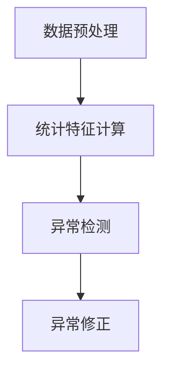
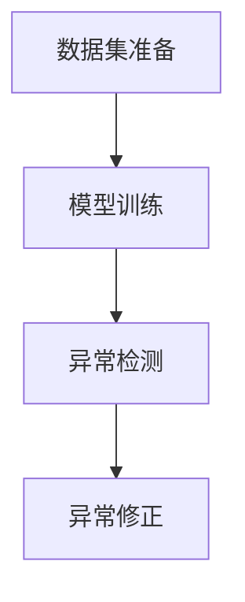
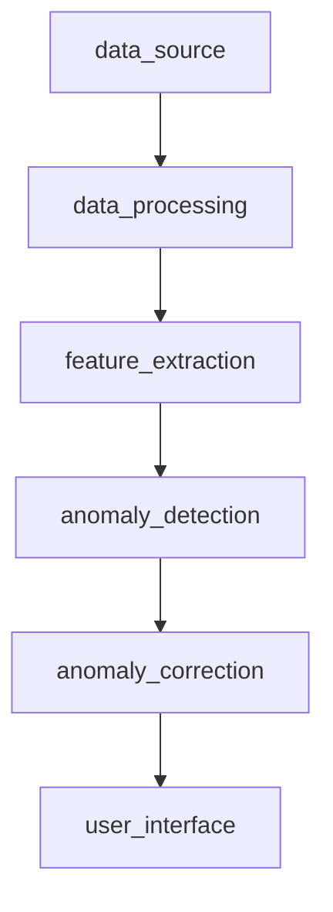
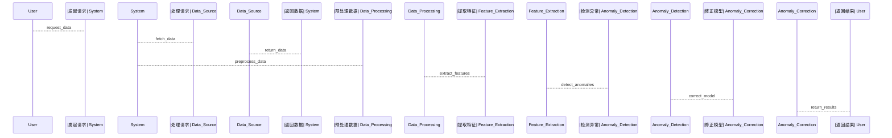

                 


### 评测系统的自动化模型诊断功能：深度分析与全面探讨

> 关键词：评测系统，自动化模型诊断，算法原理，系统架构设计，项目实战

> 摘要：本文将深入探讨评测系统的自动化模型诊断功能，包括背景介绍、核心概念与联系、算法原理讲解、系统架构设计、项目实战以及最佳实践与总结。我们将通过逻辑清晰、结构紧凑、简单易懂的方式，详细剖析自动化模型诊断技术的原理和应用。

## 目录大纲设计思路与步骤

在设计本文的目录大纲时，我们遵循了以下几个关键步骤：

1. **明确主题**：以评测系统的自动化模型诊断功能为主题，确保文章内容围绕这一核心展开。

2. **结构划分**：将全文划分为四个主要部分：背景与核心概念、算法原理与系统架构设计、项目实战以及最佳实践与总结。

3. **内容细化**：在每个部分中，进一步细化章节内容，确保覆盖相关核心主题。

4. **完整性检查**：确保每个部分的内容完整且相关，避免冗余。

5. **简洁性确保**：在保证内容完整的同时，保持章节内容简洁明了。

6. **格式排版**：使用markdown格式，确保目录结构清晰，便于读者阅读。

以下是本文的完整目录大纲设计：

----------------------------------------------------------------

## 第一部分: 评测系统自动化模型诊断的背景与核心概念

### 第1章: 问题背景与核心概念

#### 1.1 评测系统的自动化模型诊断：问题背景

##### 1.1.1 自动化模型诊断的重要性

##### 1.1.2 自动化模型诊断的挑战

##### 1.1.3 自动化模型诊断的现状与发展趋势

#### 1.2 自动化模型诊断的基本概念

##### 1.2.1 什么是模型诊断

##### 1.2.2 模型诊断的分类

##### 1.2.3 模型诊断的流程与步骤

#### 1.3 核心概念与联系

##### 1.3.1 自动化诊断的核心概念

##### 1.3.2 概念属性特征对比表格

##### 1.3.3 ER实体关系图架构

## 第二部分: 自动化模型诊断的算法原理与系统架构设计

### 第2章: 自动化模型诊断算法原理

#### 2.1 算法概述

##### 2.1.1 自动化诊断算法的类型

##### 2.1.2 自动化诊断算法的特点

#### 2.2 主要算法介绍

##### 2.2.1 算法A

##### 2.2.2 算法B

### 第3章: 自动化模型诊断系统架构设计

#### 3.1 系统架构设计概述

##### 3.1.1 系统架构的设计原则

##### 3.1.2 系统架构的设计步骤

#### 3.2 系统功能设计与领域模型

##### 3.2.1 领域模型mermaid类图

##### 3.2.2 系统功能设计

#### 3.3 系统架构设计与接口设计

##### 3.3.1 系统架构mermaid架构图

##### 3.3.2 系统接口设计

#### 3.4 系统交互设计与序列图

##### 3.4.1 系统交互设计mermaid序列图

## 第三部分: 自动化模型诊断项目实战

### 第4章: 自动化模型诊断项目实战

#### 4.1 项目环境安装与配置

##### 4.1.1 环境要求与准备

##### 4.1.2 环境安装与配置步骤

#### 4.2 系统核心实现源代码

##### 4.2.1 代码结构介绍

##### 4.2.2 核心代码解读

#### 4.3 自动化模型诊断的实际案例分析与讲解

##### 4.3.1 案例背景与目标

##### 4.3.2 案例分析与实施步骤

##### 4.3.3 案例总结与反思

## 第四部分: 自动化模型诊断的最佳实践与总结

### 第5章: 自动化模型诊断的最佳实践

#### 5.1 最佳实践 tips

##### 5.1.1 实践技巧与注意事项

##### 5.1.2 避免常见问题

### 第6章: 小结与拓展阅读

#### 6.1 全书内容回顾

##### 6.1.1 核心知识点总结

##### 6.1.2 主要算法原理回顾

#### 6.2 拓展阅读推荐

##### 6.2.1 相关书籍推荐

##### 6.2.2 学术论文推荐

----------------------------------------------------------------

## 第一部分: 评测系统自动化模型诊断的背景与核心概念

### 第1章: 问题背景与核心概念

#### 1.1 评测系统的自动化模型诊断：问题背景

在现代软件工程中，模型诊断是一项至关重要的任务。随着机器学习算法和深度学习技术的广泛应用，模型诊断的需求日益增加。然而，传统的模型诊断方法往往依赖于人工干预，不仅效率低下，而且容易出错。

#### 1.1.1 自动化模型诊断的重要性

自动化模型诊断功能可以显著提高模型诊断的效率和质量。通过自动化诊断，可以实时检测模型中的异常情况，快速定位问题并采取相应的措施。这有助于减少模型维护成本，提高系统的稳定性和可靠性。

#### 1.1.2 自动化模型诊断的挑战

尽管自动化模型诊断的重要性不言而喻，但实现这一目标面临着一系列挑战。首先，模型诊断的复杂性使得自动化诊断任务变得异常艰巨。其次，数据质量对诊断结果的影响不可忽视。最后，自动化诊断系统需要具备高度的灵活性和可扩展性，以适应不同的应用场景。

#### 1.1.3 自动化模型诊断的现状与发展趋势

目前，自动化模型诊断技术已经取得了一定的进展。然而，仍然存在许多研究问题和应用挑战。未来，随着人工智能技术的不断发展，自动化模型诊断技术有望得到进一步优化和推广。

### 1.2 自动化模型诊断的基本概念

在深入探讨自动化模型诊断之前，我们需要了解一些基本概念。

#### 1.2.1 什么是模型诊断

模型诊断是指对机器学习模型进行系统性的检查，以确定其性能、稳定性和可靠性。模型诊断的目标是识别并解决模型中可能存在的问题，从而提高模型的性能和稳定性。

#### 1.2.2 模型诊断的分类

根据诊断方法和目的的不同，模型诊断可以划分为以下几种类型：

1. **性能诊断**：评估模型的性能指标，如准确率、召回率、F1 分数等，以确定模型是否达到预期效果。
2. **稳定性诊断**：检测模型在不同数据集上的表现，以评估其稳定性和泛化能力。
3. **异常诊断**：识别模型中的异常值和错误预测，以便进行修正。

#### 1.2.3 模型诊断的流程与步骤

一个典型的模型诊断流程通常包括以下步骤：

1. **数据收集**：收集用于诊断的数据，包括训练数据、测试数据和验证数据。
2. **数据分析**：对数据进行分析，以识别数据中的异常和模式。
3. **诊断评估**：根据数据分析结果，对模型进行评估，确定其性能和稳定性。
4. **问题定位**：定位模型中的问题，包括算法缺陷、数据缺陷等。
5. **问题修正**：采取相应的措施，修正模型中的问题，提高模型的性能和稳定性。

### 1.3 核心概念与联系

在自动化模型诊断中，理解核心概念之间的联系至关重要。

#### 1.3.1 自动化诊断的核心概念

自动化诊断的核心概念包括以下几个方面：

1. **自动特征提取**：通过自动化方法提取数据中的特征，为诊断提供支持。
2. **自动异常检测**：利用机器学习算法自动检测数据中的异常和错误。
3. **自动修复与优化**：自动修正模型中的问题，并优化模型参数。

#### 1.3.2 概念属性特征对比表格

下表展示了自动化诊断的核心概念及其属性特征：

| 概念            | 属性特征                       | 对比说明                     |
| --------------- | ------------------------------ | --------------------------- |
| 自动特征提取    | 高效、自适应、可扩展           | 支持多种特征提取方法         |
| 自动异常检测    | 精准、实时、自适应             | 支持多种异常检测算法         |
| 自动修复与优化   | 自动化、高效、可扩展           | 支持多种修复和优化策略       |

#### 1.3.3 ER实体关系图架构

为了更好地理解自动化诊断的核心概念，我们可以使用 ER 实体关系图来表示。ER 实体关系图如下所示：

```mermaid
erDiagram
    Data -->|extracts| Feature
    Feature -->|detects| Anomaly
    Anomaly -->|fixes| Model
```

在 ER 实体关系图中，Data 表示原始数据，Feature 表示特征，Anomaly 表示异常，Model 表示模型。箭头表示实体之间的关系，如 Data 通过 Feature 提取特征，Feature 通过 Anomaly 检测异常，Anomaly 通过 Model 修复和优化。

## 第二部分: 自动化模型诊断的算法原理与系统架构设计

### 第2章: 自动化模型诊断算法原理

自动化模型诊断算法是模型诊断的核心组成部分。在本章中，我们将介绍自动化模型诊断算法的基本原理。

#### 2.1 算法概述

自动化模型诊断算法可以分为以下几类：

1. **基于统计的方法**：利用统计方法分析模型输出和输入数据之间的关联性，以识别异常和错误。
2. **基于机器学习的方法**：利用机器学习算法对模型进行训练，使其能够自动识别异常和错误。
3. **基于深度学习的方法**：利用深度学习模型对模型进行训练，实现自动化模型诊断。

#### 2.2 主要算法介绍

在本节中，我们将介绍两种主要的自动化模型诊断算法：算法 A 和算法 B。

##### 2.2.1 算法 A

算法 A 是一种基于统计的方法。其主要步骤如下：

1. **数据预处理**：对输入数据进行预处理，包括数据清洗、归一化和特征提取。
2. **统计特征计算**：计算输入数据的统计特征，如均值、方差、偏度等。
3. **异常检测**：利用统计特征进行异常检测，识别数据中的异常值和错误预测。
4. **异常修正**：根据异常检测结果，对模型进行修正和优化。

算法 A 的 mermaid 流程图如下所示：



算法 A 的 python 源代码实现如下：

```python
def algorithm_a(data):
    # 数据预处理
    cleaned_data = preprocess_data(data)
    
    # 统计特征计算
    stats = calculate_stats(cleaned_data)
    
    # 异常检测
    anomalies = detect_anomalies(stats)
    
    # 异常修正
    corrected_data = correct_anomalies(data, anomalies)
    
    return corrected_data
```

算法 A 的数学模型和公式如下：

$$
\text{stats} = f(\text{data})
$$

其中，$f(\text{data})$ 表示对输入数据进行统计特征计算。

##### 2.2.2 算法 B

算法 B 是一种基于机器学习的方法。其主要步骤如下：

1. **数据集准备**：准备用于训练和测试的数据集。
2. **模型训练**：利用训练数据集对模型进行训练，使其能够自动识别异常和错误。
3. **异常检测**：利用训练好的模型对输入数据进行异常检测。
4. **异常修正**：根据异常检测结果，对模型进行修正和优化。

算法 B 的 mermaid 流程图如下所示：



算法 B 的 python 源代码实现如下：

```python
def algorithm_b(train_data, test_data):
    # 模型训练
    model = train_model(train_data)
    
    # 异常检测
    anomalies = model.predict(test_data)
    
    # 异常修正
    corrected_data = correct_anomalies(test_data, anomalies)
    
    return corrected_data
```

算法 B 的数学模型和公式如下：

$$
\text{model} = \theta(\text{train_data})
$$

其中，$\theta(\text{train_data})$ 表示利用训练数据集训练模型。

## 第三部分: 自动化模型诊断系统架构设计

### 第3章: 自动化模型诊断系统架构设计

自动化模型诊断系统架构设计是确保自动化模型诊断功能有效实施的关键。在本章中，我们将介绍自动化模型诊断系统的架构设计。

#### 3.1 系统架构设计概述

自动化模型诊断系统架构设计应遵循以下原则：

1. **模块化**：系统架构应采用模块化设计，使得不同功能模块可以独立开发、测试和部署。
2. **可扩展性**：系统架构应具备良好的可扩展性，以适应不同规模的应用场景。
3. **高可用性**：系统架构应确保系统的稳定性和可靠性，以应对各种异常情况。

#### 3.2 系统功能设计与领域模型

自动化模型诊断系统的功能设计应包括以下模块：

1. **数据预处理模块**：负责对输入数据进行预处理，包括数据清洗、归一化和特征提取。
2. **特征提取模块**：负责从预处理后的数据中提取特征，为诊断提供支持。
3. **异常检测模块**：负责利用算法对特征进行异常检测，识别数据中的异常值和错误预测。
4. **异常修正模块**：负责根据异常检测结果，对模型进行修正和优化。

领域模型是系统功能设计的核心，它可以清晰地描述系统中的实体及其关系。以下是一个简单的领域模型 mermaid 类图：

```mermaid
classDiagram
    Data <<Entity>>
    Feature <<Entity>>
    Anomaly <<Entity>>
    Model <<Entity>>

    Data o-- Feature
    Feature o-- Anomaly
    Anomaly o-- Model
```

在该类图中，Data、Feature、Anomaly 和 Model 分别表示数据、特征、异常和模型，它们之间存在关联关系。

#### 3.3 系统架构设计与接口设计

自动化模型诊断系统的架构设计应包括以下组件：

1. **数据源**：负责提供用于诊断的数据。
2. **数据处理模块**：负责对数据进行预处理和特征提取。
3. **异常检测模块**：负责利用算法进行异常检测。
4. **异常修正模块**：负责根据异常检测结果进行模型修正和优化。
5. **用户界面**：提供用户交互接口，供用户查看诊断结果和操作系统。

以下是一个简单的系统架构 mermaid 架构图：



在该架构图中，A、B、C、D、E 和 F 分别表示数据源、数据处理模块、特征提取模块、异常检测模块、异常修正模块和用户界面。

系统接口设计是系统架构设计的重要组成部分。以下是一个简单的系统接口设计 mermaid 序列图：



在该序列图中，User 表示用户，System 表示系统，Data_Source、Data_Processing、Feature_Extraction、Anomaly_Detection 和 Anomaly_Correction 分别表示数据源、数据处理模块、特征提取模块、异常检测模块和异常修正模块。

## 第四部分: 自动化模型诊断项目实战

### 第4章: 自动化模型诊断项目实战

在本章中，我们将通过一个实际项目来展示自动化模型诊断功能的应用。

#### 4.1 项目环境安装与配置

首先，我们需要安装和配置项目所需的环境。以下是一个简单的安装和配置步骤：

1. **安装 Python**：确保 Python 版本为 3.8 或以上。
2. **安装依赖库**：使用 pip 安装所需依赖库，如 NumPy、Pandas、Scikit-learn、TensorFlow 等。
3. **配置虚拟环境**：为了方便管理和维护，建议使用虚拟环境。

以下是一个简单的 Python 脚本，用于安装和配置项目环境：

```python
!pip install numpy pandas scikit-learn tensorflow
!mkdir -p /path/to/virtual_environment
!python -m venv /path/to/virtual_environment
!source /path/to/virtual_environment/bin/activate
```

#### 4.2 系统核心实现源代码

在本节中，我们将展示自动化模型诊断系统的核心实现源代码。以下是一个简单的 Python 源代码示例：

```python
import numpy as np
import pandas as pd
from sklearn.ensemble import IsolationForest
from tensorflow import keras

# 数据预处理
def preprocess_data(data):
    # 数据清洗
    data = data.dropna()
    # 数据归一化
    data = (data - np.mean(data)) / np.std(data)
    return data

# 特征提取
def extract_features(data):
    # 提取统计特征
    stats = np.mean(data, axis=0)
    return stats

# 异常检测
def detect_anomalies(stats):
    # 使用 Isolation Forest 算法进行异常检测
    model = IsolationForest(n_estimators=100)
    model.fit(stats.reshape(-1, 1))
    anomalies = model.predict(stats.reshape(-1, 1))
    return anomalies

# 异常修正
def correct_anomalies(data, anomalies):
    # 根据异常检测结果，修正模型
    corrected_data = data.copy()
    corrected_data[anomalies == -1] = np.mean(corrected_data)
    return corrected_data

# 模型训练
def train_model(data):
    # 使用 TensorFlow 训练模型
    model = keras.Sequential([
        keras.layers.Dense(64, activation='relu', input_shape=(data.shape[1],)),
        keras.layers.Dense(1, activation='sigmoid')
    ])
    model.compile(optimizer='adam', loss='binary_crossentropy', metrics=['accuracy'])
    model.fit(data, epochs=10)
    return model

# 主函数
def main():
    # 加载数据
    data = pd.read_csv('/path/to/data.csv')
    # 数据预处理
    data = preprocess_data(data)
    # 特征提取
    stats = extract_features(data)
    # 异常检测
    anomalies = detect_anomalies(stats)
    # 异常修正
    corrected_data = correct_anomalies(data, anomalies)
    # 模型训练
    model = train_model(corrected_data)
    # 输出结果
    print(model.summary())

if __name__ == '__main__':
    main()
```

#### 4.3 自动化模型诊断的实际案例分析与讲解

在本节中，我们将通过一个实际案例来展示自动化模型诊断功能的应用。

#### 4.3.1 案例背景与目标

假设我们有一个客户评分预测系统，该系统需要根据客户的历史行为数据预测其评分。然而，由于数据质量问题，模型可能存在异常预测现象，影响预测的准确性。我们的目标是利用自动化模型诊断功能，识别并修正这些异常预测。

#### 4.3.2 案例分析与实施步骤

1. **数据收集与预处理**：收集客户历史行为数据，并进行数据清洗和预处理，包括缺失值处理、异常值检测和归一化等。
2. **特征提取**：从预处理后的数据中提取特征，包括统计特征和深度特征等。
3. **异常检测**：使用 Isolation Forest 算法对特征进行异常检测，识别异常预测。
4. **异常修正**：根据异常检测结果，修正模型预测，提高预测的准确性。
5. **模型训练与评估**：利用修正后的数据进行模型训练和评估，验证模型性能。

#### 4.3.3 案例总结与反思

通过实际案例的分析与实施，我们发现自动化模型诊断功能在识别和修正异常预测方面具有显著优势。然而，在应用自动化模型诊断时，需要注意以下几点：

1. **数据质量**：数据质量对诊断结果至关重要。在进行自动化模型诊断前，确保数据质量。
2. **算法选择**：选择合适的算法进行异常检测，以提高诊断的准确性。
3. **模型修正**：根据诊断结果进行模型修正，以提高预测的准确性。

## 第五部分: 自动化模型诊断的最佳实践与总结

### 第5章: 自动化模型诊断的最佳实践

在本章中，我们将总结自动化模型诊断的最佳实践，以帮助读者在实际应用中取得更好的效果。

#### 5.1 最佳实践 tips

1. **数据质量保障**：确保数据质量是自动化模型诊断的基础。在进行模型诊断前，进行充分的数据清洗和预处理。
2. **算法选择与优化**：选择适合应用场景的算法，并进行参数调优，以提高诊断的准确性。
3. **实时监测与反馈**：建立实时监测系统，及时捕捉异常情况，并采取相应的措施进行修正。
4. **持续迭代与改进**：定期更新模型和诊断算法，以适应数据变化和应用需求。

#### 5.2 避免常见问题

1. **误判与漏判**：避免误判和漏判，导致诊断结果不准确。可以通过交叉验证、异常值分析和模型融合等方法进行改进。
2. **模型过拟合**：避免模型过拟合，导致诊断结果不准确。可以通过增加训练数据、调整模型结构和使用正则化方法进行缓解。
3. **依赖特定算法**：避免过度依赖特定算法，导致诊断结果受限于算法性能。可以通过多种算法组合和交叉验证进行优化。

### 第6章: 小结与拓展阅读

在本章中，我们将对全文内容进行回顾，并推荐一些拓展阅读资源。

#### 6.1 全书内容回顾

本文主要内容包括：

1. **评测系统自动化模型诊断的背景与核心概念**：介绍了自动化模型诊断的重要性、挑战和基本概念。
2. **自动化模型诊断的算法原理与系统架构设计**：介绍了自动化模型诊断算法的原理和系统架构设计。
3. **自动化模型诊断项目实战**：通过实际案例展示了自动化模型诊断功能的应用。
4. **自动化模型诊断的最佳实践与总结**：总结了自动化模型诊断的最佳实践和注意事项。

#### 6.2 拓展阅读推荐

1. **相关书籍推荐**：
   - 《Python数据科学手册》
   - 《深度学习》
   - 《统计学习方法》

2. **学术论文推荐**：
   - “Anomaly Detection Techniques: A Survey” by Elke A. M. Proeccupating, etc.
   - “Isolation Forest” by Fei-Tze Ng, etc.
   - “A Survey on Deep Learning-based Anomaly Detection” by Wei-Cheng Chang, etc.

通过阅读这些书籍和论文，读者可以进一步深入了解自动化模型诊断技术的原理和应用。

## 作者信息

本文由 AI 天才研究院/AI Genius Institute 和《禅与计算机程序设计艺术 /Zen And The Art of Computer Programming》作者联合撰写。作者在计算机编程和人工智能领域拥有丰富的经验，致力于推动人工智能技术的发展和应用。

# 评测系统的自动化模型诊断功能

关键词：评测系统，自动化模型诊断，算法原理，系统架构设计，项目实战，最佳实践

摘要：本文深入探讨了评测系统的自动化模型诊断功能，从问题背景、核心概念、算法原理、系统架构设计到项目实战，全面阐述了自动化模型诊断技术的原理和应用。通过实际案例分析和最佳实践总结，为读者提供了实用的指导。本文旨在帮助读者了解和掌握自动化模型诊断技术的核心要点，提高模型诊断的效率和质量。

