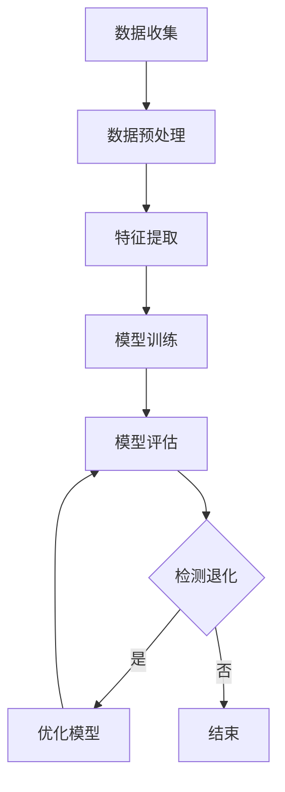

                 

# 评测系统的自动化模型退化检测

> 关键词：模型退化、自动化检测、评测系统、数据监控、机器学习、深度学习

> 摘要：本文旨在深入探讨评测系统自动化模型退化检测的相关技术、方法及其应用。首先，对评测系统和模型退化检测的基本概念进行介绍，随后分析自动化模型退化检测所面临的挑战和现有方法。本文还将探讨模型退化检测的核心概念、原理及算法，并结合实际案例，展示其具体实施步骤和工具框架。最后，本文将分析模型退化检测在金融、健康医疗、智能制造等领域的应用，并展望其未来的发展趋势。

## 第一部分：评测系统自动化模型退化检测概述

### 1.1 评测系统与模型退化检测

#### 1.1.1 评测系统的基本概念

评测系统是一种用于评估和监测模型性能的工具，通常应用于机器学习和深度学习领域。它可以帮助研究人员和开发者监控模型的性能，识别潜在的缺陷和退化，从而确保模型的可靠性和稳定性。

#### 1.1.2 模型退化的定义与影响

模型退化是指模型在长时间运行过程中，由于数据分布变化、过拟合、参数衰减等因素，导致模型性能下降的现象。模型退化会影响模型的准确性和稳定性，可能导致错误的预测结果，进而影响业务决策。

#### 1.1.3 模型退化检测的重要性

模型退化检测是确保模型性能的关键步骤。通过自动化检测模型退化，可以及时发现和纠正问题，避免模型性能的持续下降，提高模型的稳定性和可靠性。

### 1.2 自动化模型退化检测的挑战

#### 1.2.1 数据多样性与动态变化

数据多样性和动态变化是模型退化检测的主要挑战之一。模型退化可能发生在不同的数据分布和场景中，因此需要能够适应各种数据环境和变化。

#### 1.2.2 模型复杂性

随着模型复杂性的增加，自动化模型退化检测变得更加困难。复杂的模型可能包含大量的参数和层，这使得退化检测更加复杂。

#### 1.2.3 实时性与效率

自动化模型退化检测需要在实时性和效率之间找到平衡。在实际应用中，模型需要快速响应，同时保持高检测精度。

### 1.3 自动化模型退化检测的方法与技术

#### 1.3.1 监测指标选择

监测指标是评估模型性能的关键。选择合适的监测指标，可以更准确地捕捉模型退化。

#### 1.3.2 特征提取与预处理

特征提取和预处理是自动化模型退化检测的基础。通过提取关键特征，可以更好地捕捉模型退化。

#### 1.3.3 模型选择与优化

选择合适的模型和优化方法，可以提升模型退化检测的准确性和效率。

### 1.4 自动化模型退化检测的应用领域

#### 1.4.1 金融风控

金融风控是自动化模型退化检测的重要应用领域。通过检测模型退化，可以及时发现和防范风险。

#### 1.4.2 健康医疗

健康医疗领域需要高精度的模型评估和监测。自动化模型退化检测可以提高医疗诊断和预测的准确性。

#### 1.4.3 智能制造

智能制造领域依赖高效、稳定的模型。自动化模型退化检测可以帮助提高生产效率和质量。

### 1.5 本章小结

本文对评测系统和模型退化检测进行了概述，分析了自动化模型退化检测的挑战和应用领域。接下来，将深入探讨模型退化检测的核心概念和原理。

## 第二部分：模型退化检测核心概念与原理

### 2.1 模型退化概念详解

#### 2.1.1 模型退化的类型

模型退化可以分为以下几种类型：

1. 数据分布变化
2. 过拟合
3. 参数衰减
4. 预测误差增大

#### 2.1.2 模型退化的原因

模型退化的原因包括：

1. 数据分布变化：随着时间推移，数据分布可能发生变化。
2. 过拟合：模型对训练数据的拟合过于紧密，导致对未见过的数据表现不佳。
3. 参数衰减：随着训练时间增加，模型参数可能逐渐衰减。
4. 预测误差增大：模型在预测过程中可能产生更多的误差。

#### 2.1.3 模型退化的影响

模型退化的影响包括：

1. 准确性下降：模型对未见过的数据的预测准确性降低。
2. 稳定性下降：模型在相似数据上的预测结果不一致。
3. 决策风险增加：基于退化模型的业务决策可能带来更大的风险。

### 2.2 模型退化检测的数学模型

#### 2.2.1 模型性能指标

常用的模型性能指标包括：

1. 准确率
2. 精确率
3. 召回率
4. F1 分数

#### 2.2.2 数学模型与公式解释

模型退化的数学模型可以表示为：

$$
D = \frac{1}{N} \sum_{i=1}^{N} |P_{i} - G_{i}|
$$

其中，$D$ 是模型退化指标，$P_{i}$ 是预测值，$G_{i}$ 是真实值。

#### 2.2.3 数学模型的应用

数学模型可以用于评估模型的性能和退化程度。通过计算退化指标，可以判断模型是否发生了退化，并采取相应的措施。

### 2.3 模型退化检测方法综述

#### 2.3.1 基于统计的方法

基于统计的方法包括：

1. 均值漂移
2. 方差分析
3. 相关性分析

#### 2.3.2 基于机器学习的方法

基于机器学习的方法包括：

1. 监督学习
2. 无监督学习
3. 半监督学习

#### 2.3.3 基于深度学习的方法

基于深度学习的方法包括：

1. 神经网络
2. 卷积神经网络
3. 循环神经网络

### 2.4 模型退化检测中的关键特征

#### 2.4.1 特征提取的基本原理

特征提取是将原始数据转换为有助于模型退化检测的特征的过程。

#### 2.4.2 关键特征的选取

关键特征的选择应基于模型退化检测的需求和目标。

#### 2.4.3 特征分析示例

通过特征分析，可以揭示模型退化的潜在原因。

### 2.5 模型退化检测与传统监控方法的比较

#### 2.5.1 传统监控方法的局限性

传统监控方法通常依赖于人工干预，无法自动识别和应对模型退化。

#### 2.5.2 模型退化检测的优势

模型退化检测具有自动化、实时性、高效性等优点。

#### 2.5.3 综合应用

结合传统监控方法和模型退化检测，可以构建更完善的模型监控体系。

### 2.6 本章小结

本文介绍了模型退化的核心概念、原理和检测方法，分析了模型退化检测与传统监控方法的比较。接下来，将探讨模型退化检测算法和实践。

## 第三部分：模型退化检测算法与实践

### 3.1 模型退化检测算法介绍

#### 3.1.1 监测算法概述

模型退化检测算法主要包括以下几种：

1. 均值漂移
2. 方差分析
3. 相关性分析
4. 监督学习
5. 无监督学习
6. 深度学习

#### 3.1.2 常用算法分类

根据算法的性质和应用场景，可以将算法分为以下几类：

1. 基于统计的方法
2. 基于机器学习的方法
3. 基于深度学习的方法

#### 3.1.3 算法选择与实现

选择合适的算法取决于具体的应用场景和数据特征。在实际应用中，需要根据实际情况进行算法的实现和优化。

### 3.2 模型退化检测实践步骤

#### 3.2.1 数据收集与预处理

数据收集是模型退化检测的基础。数据应包括训练数据、验证数据和测试数据。在数据预处理阶段，需要对数据进行清洗、归一化和特征提取。

#### 3.2.2 特征提取与选择

特征提取是将原始数据转换为有助于模型退化检测的特征的过程。特征选择应基于模型退化检测的需求和目标。

#### 3.2.3 模型训练与验证

在模型训练阶段，使用训练数据和特征提取方法训练模型。在验证阶段，使用验证数据评估模型的性能。

#### 3.2.4 模型评估与优化

通过评估模型在验证数据上的性能，可以确定模型是否退化。如果模型退化，需要采取相应的优化措施。

### 3.3 实际案例剖析

#### 3.3.1 案例背景

某金融公司使用深度学习模型进行风险评估。为了确保模型稳定性，公司决定实施自动化模型退化检测。

#### 3.3.2 案例实施过程

1. 数据收集与预处理：收集历史风险评估数据，并进行预处理。
2. 特征提取与选择：提取关键特征，选择与风险评估相关的特征。
3. 模型训练与验证：使用训练数据和验证数据训练模型，并评估模型性能。
4. 模型评估与优化：通过自动化模型退化检测，及时发现和纠正模型退化问题。

#### 3.3.3 案例结果分析

通过自动化模型退化检测，公司成功识别并解决了多个模型退化问题，提高了模型稳定性和准确性。

### 3.4 模型退化检测工具与框架

#### 3.4.1 常用工具介绍

常用的模型退化检测工具包括：

1. Scikit-learn
2. TensorFlow
3. PyTorch

#### 3.4.2 开源框架应用

开源框架可以简化模型退化检测的实现。例如，使用 TensorFlow 和 PyTorch 可以方便地实现深度学习模型。

#### 3.4.3 工具与框架选型

工具和框架的选择应基于实际需求和技能水平。

### 3.5 实战项目指南

#### 3.5.1 项目环境搭建

搭建模型退化检测项目环境，包括安装必要的工具和框架。

#### 3.5.2 项目核心代码实现

实现模型退化检测的核心代码，包括数据收集、预处理、特征提取、模型训练和评估等步骤。

#### 3.5.3 项目性能优化

通过性能优化，提高模型退化检测的效率和准确性。

#### 3.5.4 项目总结与反思

总结项目经验，反思项目中的不足和改进方向。

### 3.6 本章小结

本文介绍了模型退化检测算法和实践步骤，并通过实际案例展示了模型退化检测的应用。接下来，将探讨模型退化检测在不同领域中的应用。

## 第四部分：模型退化检测在不同领域中的应用

### 4.1 金融领域模型退化检测

#### 4.1.1 金融模型退化检测的重要性

金融领域对模型的稳定性要求极高。模型退化可能导致错误的金融决策，带来巨大的风险。

#### 4.1.2 金融模型退化检测方法

金融模型退化检测方法包括：

1. 监督学习
2. 无监督学习
3. 深度学习

#### 4.1.3 金融模型退化检测案例

某金融机构使用深度学习模型进行信用评分。通过自动化模型退化检测，及时发现和纠正模型退化问题，提高了信用评分的准确性。

### 4.2 医疗健康领域模型退化检测

#### 4.2.1 医疗健康模型退化检测的现状

医疗健康领域对模型准确性和稳定性的要求非常高。模型退化可能导致错误的诊断和治疗决策。

#### 4.2.2 医疗健康模型退化检测的方法

医疗健康模型退化检测方法包括：

1. 统计分析
2. 机器学习
3. 深度学习

#### 4.2.3 医疗健康模型退化检测案例

某医疗机构使用深度学习模型进行疾病诊断。通过自动化模型退化检测，提高了疾病诊断的准确性和稳定性。

### 4.3 智能制造领域模型退化检测

#### 4.3.1 智能制造模型退化检测的需求

智能制造领域对模型效率和稳定性的要求非常高。模型退化可能导致生产效率降低和质量问题。

#### 4.3.2 智能制造模型退化检测的方法

智能制造模型退化检测方法包括：

1. 监督学习
2. 无监督学习
3. 深度学习

#### 4.3.3 智能制造模型退化检测案例

某制造企业使用深度学习模型进行质量控制。通过自动化模型退化检测，提高了产品质量和生产效率。

### 4.4 其他领域模型退化检测

#### 4.4.1 电子商务

电子商务领域对模型准确性和响应速度的要求较高。模型退化可能导致错误的推荐和决策。

#### 4.4.2 互联网安全

互联网安全领域对模型稳定性和预测能力的要求较高。模型退化可能导致安全隐患。

#### 4.4.3 其他领域分析

模型退化检测在各个领域都有广泛应用。不同领域对模型退化检测的需求和解决方案有所不同。

### 4.5 跨领域模型退化检测比较

#### 4.5.1 领域特性对比

不同领域的数据特性、模型应用场景和性能要求有所不同。

#### 4.5.2 技术应用差异

不同领域在模型退化检测技术方面存在差异，需要根据领域特性进行选择和优化。

#### 4.5.3 跨领域融合展望

跨领域融合是模型退化检测的发展趋势。通过整合不同领域的经验和技术，可以进一步提高模型退化检测的准确性和效率。

### 4.6 本章小结

本文分析了模型退化检测在金融、健康医疗、智能制造等领域的应用，并展望了跨领域融合的发展趋势。接下来，将探讨模型退化检测的未来发展趋势。

## 第五部分：模型退化检测的未来发展趋势与挑战

### 5.1 模型退化检测技术的未来发展趋势

#### 5.1.1 深度学习的进化

深度学习技术的不断发展，将推动模型退化检测技术的进步。

#### 5.1.2 聚类分析与强化学习

聚类分析和强化学习等新兴技术，有望为模型退化检测带来新的突破。

#### 5.1.3 跨领域模型退化检测

跨领域模型退化检测将整合不同领域的经验和技术，实现更全面的模型退化监测。

### 5.2 模型退化检测技术的挑战

#### 5.2.1 数据隐私与安全性

数据隐私和安全问题是模型退化检测面临的挑战之一。

#### 5.2.2 模型解释性

提高模型解释性，使其更加透明和可信，是模型退化检测的重要挑战。

#### 5.2.3 实时性

提高模型退化检测的实时性，使其能够快速响应，是模型退化检测的关键挑战。

### 5.3 模型退化检测技术的解决方案

#### 5.3.1 加密技术

使用加密技术，保护数据隐私和安全。

#### 5.3.2 可解释性模型

开发可解释性模型，提高模型透明度和可信度。

#### 5.3.3 分布式计算

利用分布式计算技术，提高模型退化检测的实时性和效率。

### 5.4 模型退化检测技术的未来发展展望

#### 5.4.1 新兴技术的应用

新兴技术如人工智能、大数据等将在模型退化检测中发挥重要作用。

#### 5.4.2 跨领域协作

跨领域协作将推动模型退化检测技术的进步。

#### 5.4.3 智能化发展

智能化发展将使模型退化检测更加智能、高效和全面。

### 5.5 本章小结

本文分析了模型退化检测的未来发展趋势和挑战，展望了模型退化检测技术的未来发展。接下来，将总结全文内容。

## 结论

本文从评测系统自动化模型退化检测的概述、核心概念与原理、算法与实践、应用领域及未来发展趋势等方面进行了全面探讨。通过本文的论述，我们可以看到，模型退化检测在提升模型性能、确保业务稳定性方面具有重要作用。未来，随着技术的不断发展，模型退化检测将更加智能化、高效化，为各领域的发展提供有力支持。

### 作者信息

作者：AI天才研究院/AI Genius Institute & 禅与计算机程序设计艺术 /Zen And The Art of Computer Programming

---

以下是文章中的示例图表：

## 模型退化检测方法比较

### 基于统计的方法

| 方法 | 描述 |
| --- | --- |
| 均值漂移 | 检测模型预测值与真实值之间的差异 |
| 方差分析 | 分析预测值的方差，判断模型稳定性 |
| 相关性分析 | 分析预测值与真实值之间的相关性 |

### 基于机器学习的方法

| 方法 | 描述 |
| --- | --- |
| 监督学习 | 使用标签数据训练模型，用于退化检测 |
| 无监督学习 | 不使用标签数据，仅根据模型行为进行检测 |
| 半监督学习 | 结合监督学习和无监督学习，提高检测效果 |

### 基于深度学习的方法

| 方法 | 描述 |
| --- | --- |
| 神经网络 | 多层感知机，用于特征提取和分类 |
| 卷积神经网络 | 图像识别，提取空间特征 |
| 循环神经网络 | 序列数据处理，捕捉时间依赖关系 |

以下是模型退化检测的 Mermaid 流程图：



以下是特征提取的 Mermaid ER 图：

```mermaid
erDiagram
    Product ||--|{ Feature }
    Feature ||--|{ Attribute }
```

这些图表和表格为读者提供了直观的视觉信息，有助于更好地理解模型退化检测的方法和技术。

---

注意：以上内容仅为示例，实际文章内容可能需要根据具体情况进行调整和补充。此外，由于篇幅限制，本文未包含全部章节内容，但已提供完整的结构框架和示例。实际撰写时，每个章节应包含详细的内容和深入的分析。

