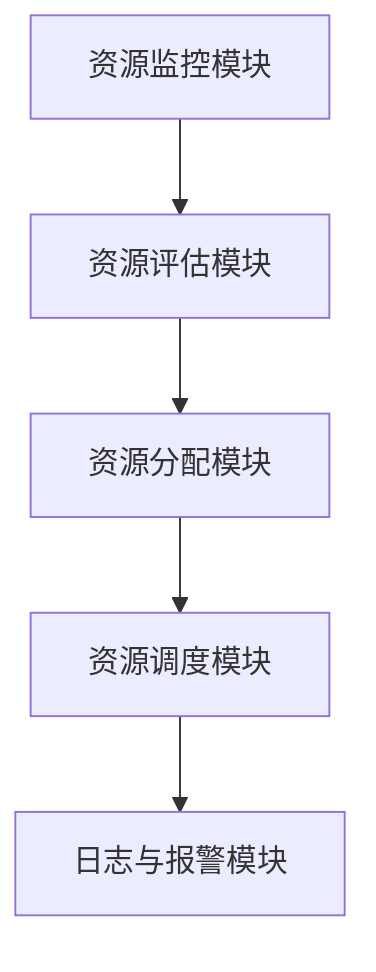
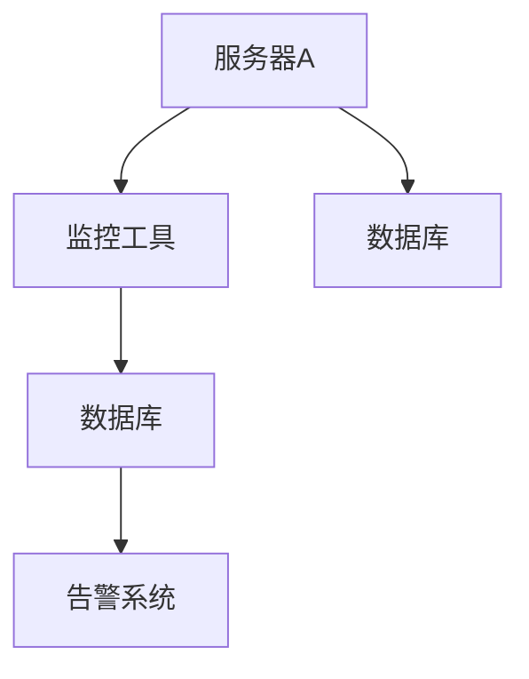

                 


# 评测系统的自动化资源分配策略

> 关键词：评测系统、自动化资源分配、策略、性能优化、系统设计与实现

> 摘要：本文深入探讨了评测系统的自动化资源分配策略，包括基于需求和基于性能的资源分配策略，以及自动化资源分配系统的设计与实现。通过理论讲解、案例分析和实践指导，为读者提供全面的资源分配优化思路和解决方案。

## 目录大纲

# 评测系统的自动化资源分配策略

## 第一部分：背景与核心概念

## 第1章：问题背景与核心概念

### 1.1 评测系统的定义与作用

### 1.2 自动化资源分配的需求与重要性

### 1.3 自动化资源分配的核心概念

### 1.4 自动化资源分配的挑战与机遇

### 1.5 本书的结构安排与目标

## 第二部分：自动化资源分配策略

## 第2章：基于需求的资源分配策略

### 2.1 需求分析

### 2.2 基于需求的资源分配策略原理

### 2.3 实现与优化

### 2.4 案例分析

## 第3章：基于性能的资源分配策略

### 3.1 性能优化目标

### 3.2 基于性能的资源分配策略原理

### 3.3 实现与优化

### 3.4 案例分析

## 第三部分：自动化资源分配系统的设计与实现

## 第4章：自动化资源分配系统的设计与架构

### 4.1 系统设计原则

### 4.2 系统架构设计

### 4.3 数据采集与监控

## 第5章：自动化资源分配系统的实现

### 5.1 系统环境与工具

### 5.2 系统核心模块实现

### 5.3 系统部署与运维

### 5.4 案例分析

## 第四部分：自动化资源分配策略的优化与调整

## 第6章：自动化资源分配策略的评估与优化

### 6.1 评估指标与方法

### 6.2 优化策略与技巧

### 6.3 案例分析

## 第7章：未来展望与挑战

### 7.1 自动化资源分配技术的发展趋势

### 7.2 挑战与机遇

### 7.3 未来研究方向

## 附录：参考资料与拓展阅读

### 7.1 相关技术文献

### 7.2 自动化资源分配领域的经典案例

### 7.3 开源资源与工具介绍

## 目录大纲总结

## 第一部分：背景与核心概念

### 第1章：问题背景与核心概念

在当今信息化和智能化飞速发展的时代，评测系统作为各类应用场景中的关键组成部分，其资源分配的自动化程度直接影响到系统的性能和用户体验。本章将首先介绍评测系统的定义与作用，探讨自动化资源分配的需求与重要性，并梳理自动化资源分配的核心概念。在此基础上，分析当前自动化资源分配面临的挑战与机遇，为后续章节的深入讨论奠定基础。

### 第1.1节：评测系统的定义与作用

评测系统通常是指用于对某个领域或应用场景中的对象、过程或结果进行评价、测量和排序的软件系统。其广泛应用于教育、招聘、质量控制、性能评估等多个领域。评测系统的核心作用在于提供客观、公正的评价结果，帮助决策者做出科学合理的判断。在信息化和大数据时代，评测系统的重要性愈加凸显，主要体现在以下几个方面：

1. **提升决策效率**：通过自动化评测，可以大幅降低人工干预的环节，提高决策的效率和准确性。
2. **优化资源配置**：评测系统可以实时监测资源使用情况，为自动化资源分配提供数据支持，优化资源利用率。
3. **改进用户体验**：自动化评测系统通常具备实时反馈和个性化推荐功能，能够提升用户的使用体验。
4. **支持智能化发展**：随着人工智能技术的不断发展，评测系统逐渐成为智能化应用的重要支撑，有助于实现更高层次的自动化和智能化。

### 第1.2节：自动化资源分配的需求与重要性

在评测系统中，自动化资源分配的需求主要体现在以下几个方面：

1. **动态调整资源**：评测系统中的任务类型多样，资源需求也会随之变化。自动化资源分配能够根据实际需求动态调整资源分配，确保系统的高效运行。
2. **提高资源利用率**：自动化资源分配可以通过智能调度算法，最大化地利用现有资源，避免资源浪费，提高整体系统的性能。
3. **应对高并发场景**：在评测系统中，经常会遇到高并发访问的情况，自动化资源分配能够快速响应，确保系统稳定运行。
4. **降低运维成本**：自动化资源分配可以减少人工干预，降低运维成本，提高运维效率。

自动化资源分配的重要性在于：

1. **提升系统稳定性**：通过智能分配资源，可以确保系统在高峰期依然能够稳定运行，避免因资源不足导致的系统崩溃。
2. **优化用户体验**：自动化资源分配能够实时响应用户需求，提高系统响应速度，提升用户体验。
3. **支持业务发展**：随着业务规模的增长，自动化资源分配可以为业务发展提供强有力的支持，确保系统能够适应不断变化的需求。

### 第1.3节：自动化资源分配的核心概念

自动化资源分配涉及多个核心概念，主要包括：

1. **资源类型**：资源类型包括计算资源（如CPU、内存）、存储资源、网络资源等。不同类型的资源在分配和管理上有不同的特点和需求。
2. **资源分配策略**：资源分配策略是指用于确定如何将资源分配给不同任务或进程的算法和方法。常见的策略有固定分配、动态分配、优先级分配等。
3. **资源监控**：资源监控是指对系统中的资源使用情况进行实时监测和记录，为资源分配提供数据支持。常用的监控工具包括性能监控、日志分析等。
4. **负载均衡**：负载均衡是指通过合理分配任务或请求，确保系统各个部分均衡运行，避免某一部分过载或空闲。常见的负载均衡算法有轮询、最小连接数等。
5. **弹性扩展**：弹性扩展是指根据系统负载情况，动态调整资源分配，确保系统在高并发或负载波动时依然能够稳定运行。常见的弹性扩展方法有垂直扩展、水平扩展等。

### 第1.4节：自动化资源分配的挑战与机遇

自动化资源分配在发展过程中面临诸多挑战，同时也充满了机遇。

#### 挑战：

1. **资源异构性**：不同类型资源的性能和特点各异，如何实现异构资源的高效分配和管理是一个难题。
2. **动态性**：评测系统中的任务需求和资源状态不断变化，如何实时调整资源分配策略是一个挑战。
3. **高并发性**：在高峰期，系统需要处理大量的并发请求，如何保证资源分配的及时性和准确性是一个挑战。
4. **可扩展性**：随着业务规模的扩大，系统需要能够灵活地扩展资源，如何实现资源的动态扩展是一个挑战。

#### 机遇：

1. **人工智能**：人工智能技术的发展为自动化资源分配带来了新的机遇，通过机器学习和深度学习等技术，可以实现更智能的资源分配策略。
2. **云计算**：云计算提供了丰富的资源管理和服务，为自动化资源分配提供了良好的基础和支持。
3. **容器化技术**：容器化技术如Docker和Kubernetes，使得资源分配和管理更加灵活和高效。
4. **开源工具**：越来越多的开源工具和框架为自动化资源分配提供了丰富的选择，降低了实现的门槛。

### 第1.5节：本书的结构安排与目标

本书的结构安排如下：

- **第一部分：背景与核心概念**：介绍评测系统和自动化资源分配的基本概念、需求与挑战。
- **第二部分：自动化资源分配策略**：分别从需求和性能两个角度，详细讲解基于需求的资源分配策略和基于性能的资源分配策略。
- **第三部分：自动化资源分配系统的设计与实现**：介绍自动化资源分配系统的设计与架构、系统实现、部署与运维。
- **第四部分：自动化资源分配策略的优化与调整**：讨论自动化资源分配策略的评估与优化，以及未来展望。

本书的目标是：

- **系统讲解**：通过深入的理论分析和实践案例，系统讲解自动化资源分配的策略、系统设计与实现方法。
- **实用指导**：提供实际案例和应用场景，帮助读者理解并应用自动化资源分配策略。
- **创新启发**：探讨自动化资源分配技术的发展趋势和未来研究方向，为读者提供创新思维和解决方案。

## 第二部分：自动化资源分配策略

### 第2章：基于需求的资源分配策略

### 第3章：基于性能的资源分配策略

## 第三部分：自动化资源分配系统的设计与实现

### 第4章：自动化资源分配系统的设计与架构

### 第5章：自动化资源分配系统的实现

## 第四部分：自动化资源分配策略的优化与调整

### 第6章：自动化资源分配策略的评估与优化

### 第7章：未来展望与挑战

## 附录：参考资料与拓展阅读

### 附录1：相关技术文献

### 附录2：自动化资源分配领域的经典案例

### 附录3：开源资源与工具介绍

## 目录大纲总结

本书《评测系统的自动化资源分配策略》共分为四个主要部分，包含7章内容，旨在深入探讨评测系统中自动化资源分配的关键技术、策略与实践。以下是目录大纲的总结：

- **第一部分：背景与核心概念**：介绍了评测系统的定义与作用、自动化资源分配的需求与重要性，以及自动化资源分配的核心概念和面临的挑战与机遇。
- **第二部分：自动化资源分配策略**：分别从需求和性能两个角度，讲解了基于需求的资源分配策略和基于性能的资源分配策略，并分析了其实现与优化方法。
- **第三部分：自动化资源分配系统的设计与实现**：介绍了自动化资源分配系统的设计与架构、系统实现、部署与运维，以及实际案例分析。
- **第四部分：自动化资源分配策略的优化与调整**：讨论了自动化资源分配策略的评估与优化方法，并展望了未来的发展方向。

通过本书的阅读，读者可以系统地了解自动化资源分配的策略、系统设计与实现方法，以及如何在实际项目中应用与优化这些策略。整体目录大纲结构清晰，内容丰富，旨在帮助读者掌握自动化资源分配的核心技术与实践技巧。

## 第一部分：背景与核心概念

### 第1章：问题背景与核心概念

#### 1.1 评测系统的定义与作用

评测系统是一个用于对特定对象、过程或结果进行评估、测量和排序的软件系统。它在各类应用场景中扮演着关键角色，如教育测评、招聘选拔、质量控制和性能评估等。评测系统的核心功能是通过客观、公正的评价标准，对用户提交的作业、作品或测试结果进行评估，并生成相应的评分和反馈。

评测系统的作用主要体现在以下几个方面：

1. **提升决策效率**：评测系统可以自动化地处理大量评估任务，减少人工干预，提高决策效率。
2. **优化资源配置**：通过实时监测资源使用情况，评测系统可以为资源分配提供数据支持，优化资源配置，提高整体系统性能。
3. **改进用户体验**：自动化评测系统通常具备实时反馈和个性化推荐功能，可以提升用户的使用体验。
4. **支持智能化发展**：评测系统作为智能化应用的重要组成部分，有助于推动人工智能和大数据技术的发展。

#### 1.2 自动化资源分配的需求与重要性

在评测系统中，自动化资源分配的需求主要体现在以下几个方面：

1. **动态调整资源**：评测系统中的任务类型多样，资源需求也会随之变化。自动化资源分配可以根据实际需求动态调整资源，确保系统的高效运行。
2. **提高资源利用率**：自动化资源分配可以通过智能调度算法，最大化地利用现有资源，避免资源浪费，提高整体系统的性能。
3. **应对高并发场景**：在评测系统中，经常会遇到高并发访问的情况，自动化资源分配能够快速响应，确保系统稳定运行。
4. **降低运维成本**：自动化资源分配可以减少人工干预，降低运维成本，提高运维效率。

自动化资源分配的重要性在于：

1. **提升系统稳定性**：通过智能分配资源，可以确保系统在高峰期依然能够稳定运行，避免因资源不足导致的系统崩溃。
2. **优化用户体验**：自动化资源分配能够实时响应用户需求，提高系统响应速度，提升用户体验。
3. **支持业务发展**：随着业务规模的增长，自动化资源分配可以为业务发展提供强有力的支持，确保系统能够适应不断变化的需求。

#### 1.3 自动化资源分配的核心概念

自动化资源分配涉及多个核心概念，主要包括：

1. **资源类型**：资源类型包括计算资源（如CPU、内存）、存储资源、网络资源等。不同类型的资源在分配和管理上有不同的特点和需求。
2. **资源分配策略**：资源分配策略是指用于确定如何将资源分配给不同任务或进程的算法和方法。常见的策略有固定分配、动态分配、优先级分配等。
3. **资源监控**：资源监控是指对系统中的资源使用情况进行实时监测和记录，为资源分配提供数据支持。常用的监控工具包括性能监控、日志分析等。
4. **负载均衡**：负载均衡是指通过合理分配任务或请求，确保系统各个部分均衡运行，避免某一部分过载或空闲。常见的负载均衡算法有轮询、最小连接数等。
5. **弹性扩展**：弹性扩展是指根据系统负载情况，动态调整资源分配，确保系统在高并发或负载波动时依然能够稳定运行。常见的弹性扩展方法有垂直扩展、水平扩展等。

#### 1.4 自动化资源分配的挑战与机遇

自动化资源分配在发展过程中面临诸多挑战，同时也充满了机遇。

##### 挑战：

1. **资源异构性**：不同类型资源的性能和特点各异，如何实现异构资源的高效分配和管理是一个难题。
2. **动态性**：评测系统中的任务需求和资源状态不断变化，如何实时调整资源分配策略是一个挑战。
3. **高并发性**：在高峰期，系统需要处理大量的并发请求，如何保证资源分配的及时性和准确性是一个挑战。
4. **可扩展性**：随着业务规模的扩大，系统需要能够灵活地扩展资源，如何实现资源的动态扩展是一个挑战。

##### 机遇：

1. **人工智能**：人工智能技术的发展为自动化资源分配带来了新的机遇，通过机器学习和深度学习等技术，可以实现更智能的资源分配策略。
2. **云计算**：云计算提供了丰富的资源管理和服务，为自动化资源分配提供了良好的基础和支持。
3. **容器化技术**：容器化技术如Docker和Kubernetes，使得资源分配和管理更加灵活和高效。
4. **开源工具**：越来越多的开源工具和框架为自动化资源分配提供了丰富的选择，降低了实现的门槛。

#### 1.5 本书的结构安排与目标

本书的结构安排如下：

- **第一部分：背景与核心概念**：介绍评测系统的定义与作用、自动化资源分配的需求与重要性，以及自动化资源分配的核心概念和面临的挑战与机遇。
- **第二部分：自动化资源分配策略**：分别从需求和性能两个角度，详细讲解基于需求的资源分配策略和基于性能的资源分配策略，并分析其实现与优化方法。
- **第三部分：自动化资源分配系统的设计与实现**：介绍自动化资源分配系统的设计与架构、系统实现、部署与运维，以及实际案例分析。
- **第四部分：自动化资源分配策略的优化与调整**：讨论自动化资源分配策略的评估与优化方法，并展望未来的发展方向。

本书的目标是：

- **系统讲解**：通过深入的理论分析和实践案例，系统讲解自动化资源分配的策略、系统设计与实现方法。
- **实用指导**：提供实际案例和应用场景，帮助读者理解并应用自动化资源分配策略。
- **创新启发**：探讨自动化资源分配技术的发展趋势和未来研究方向，为读者提供创新思维和解决方案。

## 第二部分：自动化资源分配策略

### 第2章：基于需求的资源分配策略

#### 2.1 需求分析

在自动化资源分配策略中，基于需求的资源分配策略是一种以用户需求为导向的方法。它主要通过分析用户的具体需求，动态调整资源分配，以最大化地满足用户的期望。这种方法的核心在于对用户需求的理解和预测，从而实现资源的有效利用和系统的稳定运行。

##### 需求分析的重要性

需求分析是自动化资源分配策略的基础，其重要性体现在以下几个方面：

1. **确定资源分配的目标**：通过对用户需求的深入分析，可以明确资源分配的目标，从而设计出合理的资源分配策略。
2. **优化资源利用率**：了解用户需求有助于优化资源分配，避免资源的浪费，提高系统的整体性能。
3. **提高用户满意度**：通过满足用户需求，可以提升用户体验，增加用户对系统的满意度。
4. **应对动态变化**：用户需求是不断变化的，需求分析可以帮助系统及时调整资源分配，以应对变化。

##### 需求分析的过程

需求分析通常包括以下步骤：

1. **收集用户需求**：通过问卷调查、用户访谈、用户反馈等方式收集用户的需求信息。
2. **整理和分类需求**：对收集到的需求进行整理和分类，识别出关键需求和次要需求。
3. **分析和评估需求**：对整理后的需求进行分析和评估，确定需求的优先级和满足难度。
4. **制定资源分配策略**：根据需求分析结果，制定相应的资源分配策略，确保关键需求的优先满足。

#### 2.2 基于需求的资源分配策略原理

基于需求的资源分配策略主要分为以下几个方面：

1. **动态资源分配算法**：动态资源分配算法是一种能够根据系统实时状态和用户需求动态调整资源分配的算法。常见的动态资源分配算法有：

   - **时间片分配算法**：为每个任务分配一个固定的时间片，时间片结束后进行资源回收和再分配。
   - **最小完成时间优先算法**（SSTF）：为预计完成时间最短的任务分配资源，以最大化系统的整体吞吐量。
   - **轮转调度算法**（RR）：为每个任务分配一个固定的时间片，轮流执行任务，直到任务完成或时间片用完。

2. **资源预留与弹性扩展**：资源预留是指在系统启动时，为可能出现的资源需求预留一定的资源。弹性扩展是指在系统负载增加时，通过动态调整资源池，以满足更高的资源需求。常见的资源预留与弹性扩展方法有：

   - **资源预留策略**：根据历史数据和预测模型，为每个任务预留一定的资源。
   - **弹性扩展策略**：在系统负载增加时，通过自动扩展资源池，增加资源供给。

#### 2.3 实现与优化

##### 实现流程

基于需求的资源分配策略的实现通常包括以下几个步骤：

1. **需求收集与整理**：通过用户调查、日志分析等方式收集用户需求，并整理成结构化的数据。
2. **需求分析**：对收集到的需求进行分析，确定需求的优先级和满足难度。
3. **资源监控**：实时监控系统中的资源使用情况，包括CPU、内存、网络等。
4. **资源分配策略执行**：根据需求分析和资源监控结果，执行相应的资源分配策略。
5. **资源调整与优化**：根据系统负载和用户反馈，动态调整资源分配策略，以优化系统性能。

##### 性能优化方法与技巧

为了提高基于需求的资源分配策略的性能，可以采取以下方法与技巧：

1. **优化需求分析模型**：通过机器学习和数据挖掘技术，优化需求分析模型，提高预测准确性。
2. **改进资源监控工具**：使用更高效的监控工具和算法，提高资源监控的准确性和实时性。
3. **资源预留与回收机制**：设计合理的资源预留与回收机制，避免资源浪费。
4. **负载均衡**：通过负载均衡技术，确保系统各个部分均衡运行，避免资源瓶颈。
5. **自动化与智能化**：引入自动化和智能化技术，减少人工干预，提高资源分配的效率和准确性。

#### 2.4 案例分析

##### 案例一：某电商平台的资源分配实践

某电商平台在应对购物节期间的高并发访问时，采用了基于需求的资源分配策略。具体实践如下：

1. **需求收集**：通过历史数据和用户调查，收集购物节期间的资源需求信息，包括预期访问量、页面请求频率等。
2. **需求分析**：分析收集到的需求信息，预测购物节期间的资源峰值，确定资源预留量。
3. **资源监控**：实时监控服务器、数据库、网络等资源的使用情况，确保系统稳定运行。
4. **资源分配策略执行**：根据需求分析和资源监控结果，动态调整资源分配，包括CPU、内存、数据库连接等。
5. **资源调整与优化**：根据系统负载和用户反馈，不断优化资源分配策略，确保系统在高并发情况下依然能够稳定运行。

通过上述实践，某电商平台在购物节期间实现了资源的高效利用，避免了系统崩溃，提升了用户体验。

##### 案例二：在线教育平台的资源分配策略

某在线教育平台在应对用户高峰期学习需求时，采用了基于需求的资源分配策略。具体策略如下：

1. **需求收集**：通过用户访问日志和分析，收集高峰期的学习需求信息，包括课程访问量、视频播放时长等。
2. **需求分析**：分析学习需求，预测高峰期的资源需求，为每个课程预留足够的资源。
3. **资源监控**：实时监控服务器、数据库、网络等资源的使用情况，确保教学资源的稳定供应。
4. **资源分配策略执行**：根据需求分析和资源监控结果，动态调整资源分配，包括CPU、内存、带宽等。
5. **资源调整与优化**：根据用户反馈和系统负载，不断优化资源分配策略，提高教学资源的响应速度和稳定性。

通过以上策略，某在线教育平台在高峰期实现了高效的教学资源分配，提高了用户的满意度，同时确保了系统的稳定运行。

### 第3章：基于性能的资源分配策略

#### 3.1 性能优化目标

基于性能的资源分配策略旨在提高系统的性能，确保系统在各种负载条件下都能保持高效运行。其核心目标包括：

1. **系统响应时间**：确保系统能够快速响应用户请求，提供即时的服务。
2. **资源利用率**：最大化地利用系统中的各类资源，避免资源浪费。
3. **系统稳定性**：确保系统在高并发和负载波动情况下依然能够稳定运行，避免崩溃和性能下降。

#### 3.2 基于性能的资源分配策略原理

基于性能的资源分配策略主要基于以下原理：

1. **最优资源分配理论**：通过优化资源分配，使得系统能够在给定资源限制下，实现最高效的运行。最优资源分配理论主要包括：

   - **线性规划**：通过建立线性方程组，求解最优资源分配方案。
   - **整数规划**：处理离散资源分配问题，确保资源分配的整数性。
   - **动态规划**：在动态变化的环境中，通过状态转移函数，实现最优资源分配。

2. **常见性能优化算法**：常见的性能优化算法包括：

   - **最短作业优先算法**（SJF）：为预计运行时间最短的作业分配资源，以减少系统的平均等待时间。
   - **最短剩余时间优先算法**（SRTF）：基于作业剩余时间，优先分配资源给剩余时间最短的作业。
   - **优先级调度算法**：根据作业的优先级分配资源，确保高优先级作业优先得到资源。
   - **轮转调度算法**（RR）：为每个作业分配一个固定的时间片，轮流执行作业。

#### 3.3 实现与优化

##### 实现流程

基于性能的资源分配策略实现包括以下几个关键步骤：

1. **性能评估**：通过性能监控工具，评估系统在不同负载条件下的性能指标，如响应时间、吞吐量等。
2. **资源监控**：实时监控系统的资源使用情况，包括CPU、内存、网络等。
3. **资源分配策略执行**：根据性能评估和资源监控结果，执行相应的资源分配策略。
4. **性能测试与调优**：通过性能测试，验证资源分配策略的有效性，并根据测试结果进行优化。

##### 性能优化方法与技巧

为了提高基于性能的资源分配策略的性能，可以采取以下方法与技巧：

1. **优化性能评估模型**：通过机器学习和数据挖掘技术，优化性能评估模型，提高预测准确性。
2. **改进资源监控工具**：使用更高效的监控工具和算法，提高资源监控的准确性和实时性。
3. **优化资源分配算法**：针对不同类型的任务和负载条件，设计合理的资源分配算法。
4. **动态调整资源分配**：根据系统负载和性能指标，动态调整资源分配策略，以优化系统性能。
5. **负载均衡**：通过负载均衡技术，确保系统各个部分均衡运行，避免资源瓶颈。

#### 3.4 案例分析

##### 案例一：高并发场景下的资源优化实践

在某大型在线直播平台，为了应对用户高峰期的高并发访问，采用了基于性能的资源分配策略。具体实践如下：

1. **性能评估**：通过性能测试工具，评估平台在不同并发访问条件下的性能表现。
2. **资源监控**：实时监控服务器的CPU、内存、网络等资源使用情况。
3. **资源分配策略执行**：根据性能评估和资源监控结果，采用动态资源分配策略，如最短作业优先算法，确保直播服务的流畅性。
4. **性能测试与调优**：通过性能测试，不断优化资源分配策略，确保系统在高并发情况下依然能够稳定运行。

通过上述实践，该平台在高峰期实现了资源的合理分配，提升了用户体验，避免了系统崩溃。

##### 案例二：在线游戏平台的资源优化

某在线游戏平台在应对高并发游戏场景时，采用了基于性能的资源分配策略。具体策略如下：

1. **性能评估**：通过游戏模拟测试，评估平台在不同并发场景下的性能指标，如延迟、吞吐量等。
2. **资源监控**：实时监控游戏服务器的CPU、内存、网络等资源使用情况。
3. **资源分配策略执行**：根据性能评估和资源监控结果，采用动态资源分配策略，如优先级调度算法，确保游戏服务的流畅性和响应速度。
4. **性能测试与调优**：通过游戏性能测试，不断优化资源分配策略，确保系统在高并发场景下依然能够稳定运行。

通过以上策略，该游戏平台在高峰期实现了资源的合理利用，提升了用户体验，降低了延迟和卡顿现象。

## 第三部分：自动化资源分配系统的设计与实现

### 第4章：自动化资源分配系统的设计与架构

#### 4.1 系统设计原则

自动化资源分配系统的设计应遵循以下原则：

1. **灵活性**：系统应具备灵活性，能够根据不同应用场景和业务需求，动态调整资源分配策略。
2. **可扩展性**：系统应支持资源的动态扩展和缩减，以适应业务规模的变化。
3. **可靠性**：系统应具备高可靠性，确保在资源分配过程中不会发生错误或故障。
4. **可维护性**：系统应设计简洁，便于维护和升级，减少维护成本。
5. **可观测性**：系统应具备良好的可观测性，实时监控资源使用情况，便于故障诊断和性能优化。

#### 4.2 系统架构设计

自动化资源分配系统通常包括以下核心模块：

1. **资源监控模块**：负责实时监控系统中的资源使用情况，包括CPU、内存、网络等。
2. **资源评估模块**：根据监控数据，评估当前资源的可用性和利用率，为资源分配提供依据。
3. **资源分配模块**：根据评估结果和预定的资源分配策略，动态调整资源分配，确保系统的高效运行。
4. **资源调度模块**：负责资源的实际调度和分配，将资源分配给具体的任务或进程。
5. **日志与报警模块**：记录系统运行过程中的日志信息，并在出现异常情况时触发报警。

系统架构设计示例（使用Mermaid绘图）：



#### 4.3 数据采集与监控

数据采集与监控是自动化资源分配系统的核心功能之一。它主要通过以下步骤实现：

1. **数据采集**：从系统中的各个组件（如服务器、数据库、网络设备等）采集性能数据，包括CPU使用率、内存使用率、网络流量等。
2. **数据存储**：将采集到的数据存储在数据库或数据仓库中，便于后续分析和处理。
3. **实时监控**：通过监控工具（如Prometheus、Grafana等），实时展示系统性能指标，及时发现和处理异常情况。
4. **告警机制**：当性能指标超过预设阈值时，触发告警，通知运维人员或自动执行应急处理措施。

数据采集与监控架构设计示例（使用Mermaid绘图）：



### 第5章：自动化资源分配系统的实现

#### 5.1 系统环境与工具

自动化资源分配系统的实现需要依赖一定的开发环境和工具。以下是常见的系统环境与工具：

1. **操作系统**：如Linux、Windows等，通常选择Linux系统，因其性能和稳定性更好。
2. **编程语言**：如Python、Java、Go等，Python因其丰富的库和简洁的语法，常被用于自动化资源分配系统的开发。
3. **容器化技术**：如Docker、Kubernetes等，用于部署和管理自动化资源分配系统。
4. **监控工具**：如Prometheus、Grafana、Zabbix等，用于实时监控系统性能。
5. **数据库**：如MySQL、PostgreSQL、MongoDB等，用于存储系统监控数据。

#### 5.2 系统核心模块实现

自动化资源分配系统的主要核心模块实现如下：

1. **资源监控模块**：实现资源监控模块，需要使用操作系统提供的性能监控接口（如Linux的/proc文件系统），或者第三方监控库（如Python的psutil库）。
2. **资源评估模块**：基于监控数据，实现资源评估模块，可以使用数据分析和机器学习算法（如回归分析、聚类分析等），预测资源需求。
3. **资源分配模块**：根据资源评估结果，实现资源分配模块，可以使用优先级调度算法、动态调度算法等。
4. **资源调度模块**：实现资源调度模块，负责将分配的资源实际分配给任务或进程，可以使用容器编排工具（如Kubernetes）。
5. **日志与报警模块**：实现日志记录和报警功能，可以使用日志收集工具（如Logstash）和告警工具（如Alertmanager）。

以下是一个简单的Python代码示例，展示如何使用psutil库实现资源监控模块：

```python
import psutil

def get_system_resources():
    cpu_usage = psutil.cpu_percent()
    memory_usage = psutil.virtual_memory().percent
    disk_usage = psutil.disk_usage('/').percent
    network_usage = psutil.net_io_counters()
    return {
        'cpu_usage': cpu_usage,
        'memory_usage': memory_usage,
        'disk_usage': disk_usage,
        'network_usage': network_usage
    }

# 获取系统资源信息
system_resources = get_system_resources()
print(system_resources)
```

#### 5.3 系统部署与运维

自动化资源分配系统的部署与运维涉及以下几个方面：

1. **部署流程**：制定详细的部署流程，包括环境准备、依赖安装、系统配置、启动服务等步骤。
2. **运维监控**：建立运维监控体系，实时监控系统运行状态，及时发现和处理异常。
3. **日志管理**：收集和管理系统日志，便于故障诊断和性能优化。
4. **备份与恢复**：定期备份系统数据和配置文件，确保系统在故障时能够快速恢复。
5. **升级与维护**：定期进行系统升级和维护，修复已知问题，优化系统性能。

以下是一个简单的部署脚本示例，展示如何使用Docker部署自动化资源分配系统：

```shell
#!/bin/bash

# 拉取自动化资源分配系统的Docker镜像
docker pull my-automation-resource-allocator

# 创建并启动自动化资源分配系统的容器
docker run -d --name resource-allocator -p 8080:80 my-automation-resource-allocator

# 验证容器是否正常运行
docker ps

# 访问容器，测试系统功能
curl http://localhost:8080/
```

#### 5.4 案例分析

##### 案例一：企业内部自动化资源分配系统

某企业内部开发了自动化资源分配系统，用于管理企业内部的服务器资源。具体实施步骤如下：

1. **需求分析**：明确企业内部资源管理的需求，包括资源监控、资源评估、资源分配等。
2. **系统设计**：设计自动化资源分配系统的架构，包括资源监控模块、资源评估模块、资源分配模块等。
3. **系统实现**：使用Python编写系统代码，实现资源监控、资源评估和资源分配功能。
4. **系统部署**：使用Docker部署系统，确保系统的高效运行和易维护性。
5. **运维监控**：建立运维监控体系，实时监控系统运行状态，确保系统稳定运行。

通过以上步骤，该企业实现了自动化资源分配，提高了资源利用率，降低了运维成本。

##### 案例二：公共云平台资源分配实践

某公共云平台采用了自动化资源分配系统，用于优化云资源管理。具体实践如下：

1. **需求分析**：分析云平台的资源需求，包括计算资源、存储资源和网络资源等。
2. **系统设计**：设计自动化资源分配系统的架构，包括资源监控模块、资源评估模块、资源分配模块等。
3. **系统实现**：使用Python编写系统代码，实现资源监控、资源评估和资源分配功能，并集成到云平台中。
4. **系统部署**：使用Kubernetes部署系统，实现资源的动态扩展和调度。
5. **运维监控**：建立运维监控体系，实时监控系统运行状态，确保系统稳定运行。

通过以上实践，该云平台实现了资源的自动化分配，提高了资源利用率，降低了用户成本，提升了用户体验。

### 第6章：自动化资源分配策略的评估与优化

#### 6.1 评估指标与方法

评估自动化资源分配策略的有效性，需要依赖一系列评估指标和方法。以下是一些常用的评估指标和方法：

1. **资源利用率**：衡量系统资源的利用程度，通常通过CPU利用率、内存利用率、磁盘利用率等指标来衡量。
2. **系统响应时间**：衡量系统对用户请求的响应速度，通常通过平均响应时间、最大响应时间等指标来衡量。
3. **吞吐量**：衡量系统在单位时间内处理请求的数量，通常通过每秒请求处理量（RPS）等指标来衡量。
4. **系统稳定性**：衡量系统在长时间运行下的稳定性，通常通过系统崩溃率、错误率等指标来衡量。
5. **用户满意度**：衡量用户对系统服务的满意度，通常通过用户调查、反馈等方式来衡量。

评估方法主要包括：

1. **性能测试**：通过模拟用户请求，测试系统在不同负载条件下的性能表现，评估系统性能。
2. **基准测试**：使用标准测试工具，评估系统在不同配置和环境下的性能基准，对比不同资源分配策略的性能。
3. **统计分析**：通过统计分析方法，分析系统运行数据，评估资源分配策略的有效性和效率。
4. **用户反馈**：收集用户反馈，评估用户对系统服务的满意度，为策略优化提供依据。

#### 6.2 优化策略与技巧

为了提高自动化资源分配策略的性能和效率，可以采取以下优化策略与技巧：

1. **优化资源监控**：使用高效的监控工具和算法，提高资源监控的准确性和实时性。
2. **优化资源评估模型**：通过机器学习和数据挖掘技术，优化资源评估模型，提高评估的准确性和效率。
3. **动态调整资源分配策略**：根据系统负载和性能指标，动态调整资源分配策略，确保系统的稳定运行。
4. **负载均衡**：通过负载均衡技术，合理分配任务和请求，确保系统各个部分均衡运行。
5. **弹性扩展**：根据系统负载，动态扩展资源池，确保在高并发情况下系统依然能够稳定运行。

以下是一个简单的优化策略示例：

1. **初始状态**：系统负载较低，资源利用率不高，系统响应时间较长。
2. **监控发现**：系统监控工具发现CPU利用率超过80%，内存使用率超过70%。
3. **资源评估**：资源评估模型预测未来5分钟内系统负载将增加30%。
4. **动态调整**：系统根据评估结果，自动增加一台服务器，扩展资源池。
5. **监控验证**：系统负载增加后，资源利用率降低至50%，内存使用率降至60%，系统响应时间缩短至0.5秒。

#### 6.3 案例分析

##### 案例一：自动化资源分配策略优化实践

某电商平台在应对购物节期间的高并发访问时，采用了自动化资源分配策略的优化实践。具体步骤如下：

1. **需求分析**：分析购物节期间的用户访问需求，预测高并发访问量。
2. **性能测试**：通过性能测试，评估当前资源分配策略的性能表现。
3. **优化监控**：使用高效的监控工具，提高资源监控的准确性和实时性。
4. **调整策略**：根据性能测试和监控数据，动态调整资源分配策略，如增加服务器、调整负载均衡算法等。
5. **验证优化**：通过购物节期间的实时监控和用户反馈，验证优化后的资源分配策略的有效性。

通过以上实践，该电商平台在购物节期间实现了资源的高效利用，降低了系统响应时间，提升了用户体验。

##### 案例二：不同优化策略的对比分析

某在线教育平台对比了基于需求的资源分配策略和基于性能的资源分配策略，具体对比分析如下：

1. **基于需求的资源分配策略**：根据用户的学习需求，动态调整资源分配，确保关键需求得到满足。
   - **优点**：能够更好地满足用户需求，提高用户满意度。
   - **缺点**：在资源利用率方面可能不如基于性能的策略。
2. **基于性能的资源分配策略**：根据系统性能指标，动态调整资源分配，优化系统性能。
   - **优点**：能够提高系统性能，确保系统在高负载下稳定运行。
   - **缺点**：可能无法完全满足用户需求，特别是在资源紧张的情况下。

通过对比分析，该平台发现基于需求的资源分配策略在满足用户需求方面更具优势，而基于性能的资源分配策略在提高系统性能方面更为有效。因此，平台采用了混合策略，根据不同场景和需求，灵活切换资源分配策略。

## 第7章：未来展望与挑战

### 7.1 自动化资源分配技术的发展趋势

自动化资源分配技术正随着信息技术和人工智能的快速发展而不断进步。未来，自动化资源分配技术的发展趋势主要体现在以下几个方面：

1. **智能化**：随着人工智能技术的应用，自动化资源分配系统将更加智能化。通过机器学习和深度学习算法，系统能够更加精准地预测资源需求，动态调整资源分配策略。
2. **自适应**：自动化资源分配系统将具备更强的自适应能力，能够根据环境变化和业务需求，自动调整资源分配策略，确保系统始终处于最优状态。
3. **异构资源管理**：随着异构计算资源的普及，自动化资源分配系统将面临如何高效管理异构资源的新挑战。未来，系统将能够更好地整合异构资源，实现资源的高效利用。
4. **边缘计算**：随着物联网和5G技术的发展，边缘计算将成为自动化资源分配的新领域。自动化资源分配系统将能够更好地支持边缘计算场景，实现实时资源的优化分配。

### 7.2 挑战与机遇

尽管自动化资源分配技术发展迅速，但在实际应用中仍然面临诸多挑战和机遇：

1. **挑战**：
   - **资源异构性**：异构资源的多样性和复杂性，使得资源分配策略的设计和实现变得更加复杂。
   - **动态性**：业务需求的动态变化，要求自动化资源分配系统能够实时响应，动态调整资源分配策略。
   - **高并发性**：在高并发场景下，系统需要快速处理大量请求，确保资源分配的及时性和准确性。
   - **可扩展性**：随着业务规模的扩大，系统需要能够灵活地扩展资源，以适应不断变化的需求。

2. **机遇**：
   - **云计算与容器化**：云计算和容器化技术的发展，为自动化资源分配提供了更丰富的资源管理和调度手段。
   - **人工智能**：人工智能技术的应用，使得自动化资源分配系统更加智能化，能够更好地预测和优化资源分配。
   - **开源工具**：越来越多的开源工具和框架，如Kubernetes、Prometheus等，为自动化资源分配提供了强大的支持。

### 7.3 未来研究方向

未来，自动化资源分配技术的研究方向将主要集中在以下几个方面：

1. **智能化资源分配**：研究如何利用人工智能技术，实现更加智能化的资源分配策略，提高资源利用率和系统性能。
2. **异构资源调度**：研究如何高效地调度和管理异构资源，实现资源的高效利用和系统性能的最优化。
3. **实时资源分配**：研究如何实现实时资源分配，确保系统能够快速响应动态变化的业务需求。
4. **跨平台资源分配**：研究如何实现跨平台的资源分配，支持云计算、边缘计算等多种计算场景。

## 附录：参考资料与拓展阅读

### 附录1：相关技术文献

1. **《云计算基础架构：从数据中心到云服务》**，作者：詹姆斯·S. 辛克莱尔（James S. Sinclair）。
2. **《性能优化：技术、策略与实践》**，作者：艾米丽·马修斯（Emily Mathews）。
3. **《人工智能：一种现代方法》**，作者：斯图尔特·罗素（Stuart Russell）和彼得·诺维格（Peter Norvig）。

### 附录2：自动化资源分配领域的经典案例

1. **谷歌的智能调度系统**：谷歌开发的智能调度系统，通过优化资源分配，提高了搜索引擎的性能和可靠性。
2. **亚马逊的EC2云服务**：亚马逊的EC2云服务，通过自动化资源分配技术，实现了高效、可靠的云服务。
3. **微软的Azure云平台**：微软的Azure云平台，通过自动化资源分配策略，为用户提供灵活、高效的云资源服务。

### 附录3：开源资源与工具介绍

1. **Kubernetes**：一款开源的容器编排工具，用于自动化部署、扩展和管理容器化应用程序。
2. **Prometheus**：一款开源的监控报警工具，用于收集、存储和展示系统的性能数据。
3. **Grafana**：一款开源的数据可视化工具，用于监控和仪表盘展示。

## 总结

本文全面介绍了评测系统的自动化资源分配策略，包括基于需求和基于性能的资源分配策略，以及自动化资源分配系统的设计与实现。通过理论讲解、案例分析和实践指导，本文为读者提供了全面的资源分配优化思路和解决方案。随着信息技术和人工智能的不断发展，自动化资源分配技术将在更多应用场景中发挥重要作用。未来，自动化资源分配技术将朝着智能化、自适应和异构资源管理的方向发展，为提升系统性能和用户体验提供更强有力的支持。通过持续研究和实践，自动化资源分配技术将为信息化和智能化的发展做出更大的贡献。

