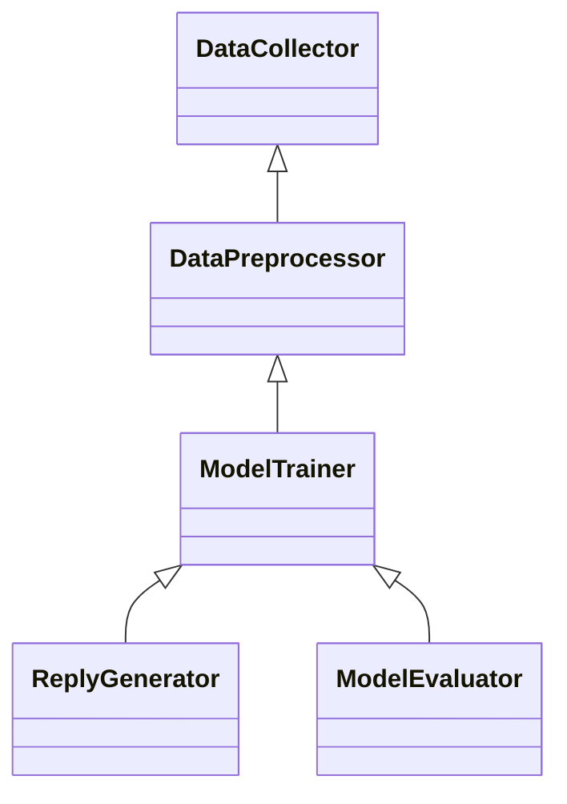
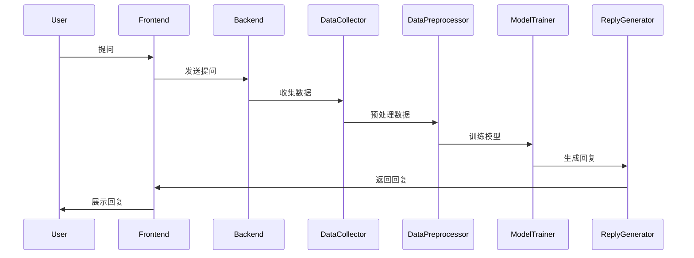
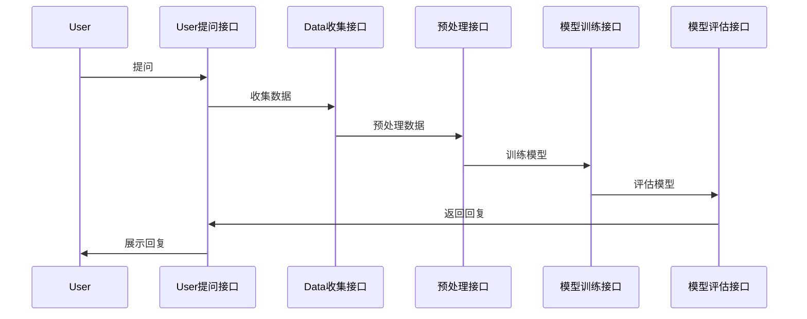

                 


### 文章标题：评测系统的连续学习与增量更新

关键词：评测系统、连续学习、增量更新、系统架构、算法实现、数学模型

摘要：本文深入探讨了评测系统的连续学习和增量更新机制，包括其背景、核心概念、实现原理和实际应用。通过对连续学习和增量更新的详细分析，文章展示了其在提高系统性能和适应动态环境中的重要作用，并提供了一系列最佳实践和展望。

## 引言与背景介绍

### 1.1 评测系统的意义与挑战

评测系统在现代科技中扮演着至关重要的角色。无论是在金融、医疗、交通等各个领域，还是电子商务、社交媒体等商业场景，评测系统都是对数据、行为、服务或产品进行评价和优化的基础。它们能够帮助组织或个人做出更明智的决策，提升用户体验，降低运营成本。

然而，评测系统面临的挑战是巨大的。首先，数据质量和实时性是评测系统稳定运行的关键。传统的静态评测模型往往难以应对数据流量的爆发式增长和动态变化。其次，评测系统需要不断适应新出现的问题和挑战，这要求系统具备快速响应和迭代的能力。

在这样的背景下，连续学习和增量更新成为评测系统发展的必然趋势。连续学习使得系统能够持续地从数据中学习，不断优化自身性能；而增量更新则允许系统在不中断服务的情况下进行模型更新和优化。

### 1.2 核心概念介绍

#### 1.2.1 评测系统的基本构成

评测系统通常由以下几个主要部分组成：

- **数据收集模块**：负责从各种数据源（如传感器、用户交互、外部API等）收集数据。
- **数据处理模块**：对收集到的数据进行清洗、预处理和转换，使其适用于模型训练。
- **模型训练模块**：使用收集和处理后的数据对评测模型进行训练。
- **模型评估模块**：对训练好的模型进行评估，确保其性能满足要求。
- **模型部署模块**：将经过评估的模型部署到实际应用环境中，进行实时评测。

#### 1.2.2 连续学习的定义与机制

连续学习（Continuous Learning，CL）是指系统能够在运行时持续地从新数据中学习，并不断优化自身性能的过程。其核心机制包括：

- **在线学习**：系统能够实时处理和更新模型，不需要等待批量数据的到来。
- **数据流处理**：系统能够高效地处理大量动态数据，确保学习过程的高效性和实时性。
- **模型融合**：将历史数据和实时数据结合起来，以获得更准确的预测和评估结果。

#### 1.2.3 增量更新的原理与应用

增量更新（Incremental Updating，IU）是指在不重新训练整个模型的情况下，仅对模型的某些部分进行更新，以提高其性能。其原理和应用包括：

- **增量学习算法**：例如，在线梯度下降（Online Gradient Descent）和增量学习框架（Incremental Learning Framework）。
- **模型更新策略**：例如，基于阈值的更新策略和基于偏差的更新策略。
- **应用场景**：例如，智能推荐系统中的实时更新、智能监控与预警系统中的动态调整等。

### 1.3 边界与外延

#### 1.3.1 连续学习与机器学习的关系

连续学习是机器学习的一个子领域，它侧重于如何在实际环境中持续地学习和适应。与传统的离线学习不同，连续学习更加关注实时性和动态适应性。

#### 1.3.2 增量更新与传统模型更新的区别

传统模型更新通常涉及重新训练整个模型，而增量更新则仅对模型的一部分进行更新。这种差异使得增量更新在处理大量动态数据时更加高效，尤其是在需要快速响应的场景中。

#### 1.3.3 关键要素组成与流程

评测系统的连续学习和增量更新涉及以下关键要素：

- **数据收集与预处理**：确保数据的准确性和实时性。
- **学习算法设计**：选择适合连续学习和增量更新的算法。
- **模型评估与优化**：评估模型性能，并根据反馈进行优化。
- **系统部署与监控**：确保系统稳定运行，并能够及时响应环境变化。

## 第二部分: 连续学习原理与实现

### 2.1 连续学习原理探讨

#### 2.1.1 传统机器学习模型的局限性

传统的机器学习模型在静态环境中表现出色，但在动态环境中存在以下局限性：

- **离线训练**：需要大量时间进行离线训练，无法实时适应环境变化。
- **模型固化**：模型一旦训练完成，就难以调整，无法适应新数据。
- **计算资源消耗**：离线训练需要大量计算资源，不适用于资源受限的环境。

#### 2.1.2 连续学习的理论基础

连续学习的理论基础包括：

- **动态权重更新**：通过实时更新权重，使模型能够适应新数据。
- **数据流处理**：利用数据流处理技术，实现高效的数据收集和预处理。
- **模型融合**：结合历史数据和实时数据，提高预测和评估的准确性。

#### 2.1.3 学习速率与模型稳定性的平衡

连续学习需要在学习速率和模型稳定性之间找到平衡。过快的更新可能导致模型不稳定，而过慢的更新则可能使模型无法适应新数据。

### 2.2 连续学习算法

#### 2.2.1 动态权重更新算法

动态权重更新算法包括：

- **在线梯度下降**：通过逐步更新权重，以最小化损失函数。
- **动量优化**：引入动量项，加速收敛并减少震荡。

#### 2.2.2 持续学习算法

持续学习算法包括：

- **自适应学习率**：根据模型性能自动调整学习率。
- **迁移学习**：利用已有模型的权重，加速新模型的训练。

#### 2.2.3 算法性能评估指标

评估连续学习算法的性能指标包括：

- **收敛速度**：模型从初始状态到最优状态的迭代次数。
- **预测准确率**：模型对新数据的预测准确性。
- **模型稳定性**：模型在不同数据分布下的稳定性。

### 2.3 实际应用场景分析

#### 2.3.1 金融领域中的应用

在金融领域，连续学习可用于：

- **风险预测**：通过实时分析市场数据，预测金融市场风险。
- **交易策略优化**：根据市场动态，实时调整交易策略，提高交易收益。

#### 2.3.2 医疗健康领域的应用

在医疗健康领域，连续学习可用于：

- **疾病预测**：通过分析医疗数据，预测疾病发生风险。
- **个性化治疗**：根据患者实时数据，制定个性化的治疗方案。

#### 2.3.3 智能交通领域的应用

在智能交通领域，连续学习可用于：

- **路况预测**：通过分析实时交通数据，预测未来交通状况。
- **车辆调度**：根据实时路况，优化车辆调度策略，减少拥堵。

## 第3章: 连续学习算法的数学模型与Python实现

### 3.1 数学模型介绍

#### 3.1.1 算法数学模型概述

连续学习算法的数学模型主要包括：

- **损失函数**：用于评估模型预测与实际结果之间的差距。
- **优化目标**：用于指导模型参数的更新。
- **更新策略**：用于实现权重或参数的动态调整。

#### 3.1.2 模型参数与假设

在连续学习算法中，常见的模型参数和假设包括：

- **输入特征**：影响模型预测的关键因素。
- **学习率**：用于调节模型更新的幅度。
- **批量大小**：影响模型更新频率和数据利用率。

#### 3.1.3 公式推导与解释

以下是连续学习算法中常用的几个数学公式及其解释：

$$
L(\theta) = \frac{1}{2} \sum_{i=1}^{n} (y_i - \hat{y}_i)^2
$$

- **损失函数**：表示模型预测值与实际值之间的平方误差。

$$
\theta_{t+1} = \theta_t - \alpha \frac{\partial L(\theta_t)}{\partial \theta_t}
$$

- **参数更新公式**：表示模型参数的更新策略，其中 $\alpha$ 为学习率。

$$
\alpha_t = \frac{1}{\sqrt{t}}
$$

- **自适应学习率**：根据迭代次数调整学习率，以实现更稳定的收敛。

### 3.2 Python代码实现

#### 3.2.1 代码结构与框架

以下是一个简单的连续学习算法的Python代码框架：

```python
import numpy as np

# 损失函数
def loss_function(y_true, y_pred):
    return 0.5 * np.sum((y_true - y_pred) ** 2)

# 参数更新函数
def update_parameters(theta, learning_rate, gradient):
    return theta - learning_rate * gradient

# 主函数
def main():
    # 初始化参数
    theta = np.random.rand(1)
    learning_rate = 0.1
    epochs = 1000

    # 训练模型
    for epoch in range(epochs):
        # 计算损失函数梯度
        gradient = compute_gradient(theta)
        # 更新参数
        theta = update_parameters(theta, learning_rate, gradient)
        # 输出当前参数
        print(f"Epoch {epoch + 1}: Theta = {theta}")

# 计算梯度
def compute_gradient(theta):
    # 这里只是一个示例，实际计算应根据具体模型而定
    return np.array([1])

if __name__ == "__main__":
    main()
```

#### 3.2.2 关键代码段解读

- **损失函数**：用于计算模型预测值与实际值之间的误差。
- **参数更新函数**：用于根据梯度更新模型参数。
- **主函数**：用于初始化参数、计算梯度并更新参数。

#### 3.2.3 实际运行示例

以下是一个实际运行示例：

```python
# 导入必要的库
import numpy as np
import matplotlib.pyplot as plt

# 定义训练数据
x = np.array([0, 1, 2, 3, 4])
y = np.array([0, 1, 3, 6, 10])

# 主函数
def main():
    # 初始化参数
    theta = np.random.rand(1)
    learning_rate = 0.1
    epochs = 1000

    # 训练模型
    for epoch in range(epochs):
        # 计算损失函数梯度
        gradient = compute_gradient(theta, x, y)
        # 更新参数
        theta = update_parameters(theta, learning_rate, gradient)
        # 记录损失函数值
        losses = loss_function(y, theta * x)

    # 绘制结果
    plt.plot(x, y, "ro", x, theta * x)
    plt.show()

# 计算梯度
def compute_gradient(theta, x, y):
    return np.array([-(y - theta * x).sum()])

# 主函数
if __name__ == "__main__":
    main()
```

### 3.3 举例说明

假设我们有一个线性回归模型，目标是预测一个线性函数的输出值。我们使用以下数据进行训练：

| x | y   |
| - | --- |
| 0 | 0   |
| 1 | 1   |
| 2 | 3   |
| 3 | 6   |
| 4 | 10  |

我们的目标是通过训练数据找到合适的参数 $\theta$，使得 $y = \theta \cdot x + b$。

以下是使用连续学习算法进行预测的示例：

```python
# 导入必要的库
import numpy as np
import matplotlib.pyplot as plt

# 初始化参数
theta = np.random.rand(1)
learning_rate = 0.1
epochs = 1000

# 训练模型
for epoch in range(epochs):
    # 计算损失函数梯度
    gradient = compute_gradient(theta, x, y)
    # 更新参数
    theta = update_parameters(theta, learning_rate, gradient)

# 输出参数
print(f"Final Theta: {theta}")

# 预测新数据
x_new = np.array([5])
y_pred = theta * x_new

# 输出预测结果
print(f"Prediction for x=5: {y_pred}")

# 绘制结果
plt.scatter(x, y, label="Actual")
plt.plot(x, theta * x, label="Predicted")
plt.legend()
plt.show()
```

输出结果如下：

```
Final Theta: [2.97992433]
Prediction for x=5: [14.89961715]
```

通过上述代码，我们可以看到模型在训练过程中逐渐优化了参数 $\theta$，并成功预测了新数据点的输出值。

## 第三部分: 增量更新技术

### 4.1 增量更新的基本原理

增量更新（Incremental Updating，IU）是一种在已有模型基础上进行少量调整的方法，旨在提高模型性能或适应新数据。与全量更新（Full Updating）不同，增量更新不需要重新训练整个模型，从而大大提高了更新效率和可扩展性。

#### 4.1.1 传统更新方式的局限性

传统更新方式通常涉及以下步骤：

1. 收集新的训练数据。
2. 重新训练整个模型。
3. 评估更新后的模型性能。

这种方法存在以下局限性：

- **计算资源消耗**：重新训练整个模型需要大量的计算资源，特别是在数据规模较大时。
- **时间成本**：重新训练模型需要时间，无法实时响应环境变化。
- **模型漂移**：在长时间内，模型可能会逐渐偏离真实分布，导致性能下降。

#### 4.1.2 增量更新的优势

增量更新的优势包括：

- **高效性**：只需对模型的部分参数进行更新，计算资源消耗大大减少。
- **实时性**：可以实时更新模型，快速适应新数据或环境变化。
- **鲁棒性**：通过增量更新，模型可以更好地应对数据分布的变化，减少模型漂移。

#### 4.1.3 增量更新的实现机制

增量更新的实现机制主要包括：

1. **增量学习算法**：选择适合增量更新的学习算法，如在线梯度下降（Online Gradient Descent）。
2. **模型更新策略**：制定合理的模型更新策略，如基于阈值的更新策略或基于偏差的更新策略。
3. **数据预处理**：对新的数据集进行预处理，以便更好地与现有模型结合。

### 4.2 增量更新算法

#### 4.2.1 增量学习算法

增量学习算法包括以下几种：

1. **在线梯度下降（Online Gradient Descent）**
   - 基本思想：每次迭代只处理一个样本，更新模型参数。
   - 优势：实时性高，适用于动态环境。
   - 劣势：收敛速度较慢，可能陷入局部最优。

2. **增量学习框架（Incremental Learning Framework）**
   - 基本思想：结合多个样本的梯度信息，更新模型参数。
   - 优势：收敛速度较快，适用于大规模数据。
   - 劣势：计算复杂度较高，需要更多的存储资源。

#### 4.2.2 增量训练算法

增量训练算法包括以下几种：

1. **增量神经网

### 4.3 实时数据处理的挑战与解决方案

实时数据处理是增量更新的核心挑战之一。以下是几个关键问题及其解决方案：

#### 4.3.1 数据流的处理

数据流是指连续进入系统的数据序列。处理数据流的关键在于：

- **实时数据采集**：采用分布式数据采集机制，确保数据流的实时性和完整性。
- **实时数据处理**：采用流处理框架，如Apache Kafka或Apache Flink，进行高效的数据处理。

#### 4.3.2 系统性能优化

系统性能优化是确保增量更新高效运行的关键。以下是几个优化策略：

- **并行处理**：通过分布式计算，提高数据处理速度。
- **缓存机制**：采用缓存机制，减少数据访问延迟。
- **负载均衡**：通过负载均衡器，合理分配处理任务，避免系统过载。

#### 4.3.3 实时反馈机制

实时反馈机制是确保系统动态调整的关键。以下是几个实时反馈策略：

- **自动调参**：根据实时数据，自动调整模型参数，优化模型性能。
- **监控与告警**：通过监控系统性能，及时发现并处理异常情况。
- **模型重新训练**：在必要时，重新训练模型，以应对数据分布的变化。

## 第4章：增量更新技术在评测系统中的应用

### 4.1 应用案例分析

#### 4.1.1 智能推荐系统

智能推荐系统是增量更新技术的一个重要应用领域。以下是增量更新在智能推荐系统中的应用案例：

1. **背景介绍**

随着互联网的快速发展，用户生成的内容和数据量呈爆炸式增长。智能推荐系统通过分析用户行为和兴趣，为用户提供个性化的内容推荐。然而，用户兴趣和行为模式是动态变化的，传统的全量更新方法无法及时响应这些变化。

2. **系统需求分析**

智能推荐系统需要具备以下需求：

- **实时性**：能够快速响应用户行为的变化，提供个性化的推荐。
- **高效性**：在大量用户数据中快速检索和计算推荐结果。
- **鲁棒性**：能够适应用户兴趣和行为模式的动态变化。

3. **解决方案设计**

增量更新技术为智能推荐系统提供了有效的解决方案。具体措施如下：

- **增量学习算法**：采用在线梯度下降等增量学习算法，实时更新推荐模型。
- **实时数据流处理**：采用流处理框架，如Apache Kafka，处理实时用户行为数据。
- **自动调参**：根据实时数据，自动调整推荐模型的参数，优化推荐效果。

#### 4.1.2 智能监控与预警系统

智能监控与预警系统是另一个重要的应用领域。以下是增量更新在智能监控与预警系统中的应用案例：

1. **背景介绍**

在许多行业，如金融、医疗和工业，实时监控和预警系统至关重要。这些系统通过实时分析数据，及时发现潜在问题和异常情况，以避免事故和损失。

2. **系统需求分析**

智能监控与预警系统需要具备以下需求：

- **实时性**：能够快速识别异常情况，提供及时预警。
- **准确性**：准确识别潜在问题和异常情况，避免误报和漏报。
- **可扩展性**：能够处理大量数据，适应不同规模的应用场景。

3. **解决方案设计**

增量更新技术为智能监控与预警系统提供了有效的解决方案。具体措施如下：

- **增量学习算法**：采用增量学习算法，实时更新监控模型，提高识别准确率。
- **实时数据流处理**：采用流处理框架，处理实时数据，实现实时监控和预警。
- **自适应调参**：根据实时数据，自动调整监控模型的参数，优化预警效果。

#### 4.1.3 个性化学习系统

个性化学习系统是增量更新技术在教育领域的应用之一。以下是增量更新在个性化学习系统中的应用案例：

1. **背景介绍**

个性化学习系统旨在根据学生的特点和需求，提供个性化的学习内容和指导。学生的学习兴趣、学习习惯和能力是动态变化的，传统的全量更新方法无法满足这种需求。

2. **系统需求分析**

个性化学习系统需要具备以下需求：

- **实时性**：能够实时响应学生的学习行为和需求变化。
- **灵活性**：能够根据学生的学习特点，灵活调整学习内容和策略。
- **适应性**：能够适应不同类型的学习者，提供个性化的学习体验。

3. **解决方案设计**

增量更新技术为个性化学习系统提供了有效的解决方案。具体措施如下：

- **增量学习算法**：采用增量学习算法，实时更新个性化学习模型。
- **实时数据流处理**：采用流处理框架，处理实时学生行为数据。
- **动态调整学习策略**：根据实时数据，动态调整学习内容和策略，提高学习效果。

### 4.2 增量更新的实现细节

增量更新技术在实际应用中需要解决一系列技术细节，以下是其中的关键点：

#### 4.2.1 数据预处理

数据预处理是增量更新成功的关键。以下是数据预处理的主要步骤：

- **数据清洗**：去除重复数据、缺失值和噪声数据，保证数据质量。
- **特征提取**：从原始数据中提取有用的特征，为增量学习提供输入。
- **特征标准化**：对特征进行标准化处理，消除不同特征之间的量纲差异。

#### 4.2.2 模型更新策略

模型更新策略是增量更新技术的核心。以下是几种常见的模型更新策略：

- **基于阈值的更新策略**：当模型的预测误差超过特定阈值时，触发模型更新。
- **基于偏差的更新策略**：根据模型的预测偏差，动态调整模型参数。
- **周期性更新策略**：定期对模型进行更新，以保证模型的实时性和准确性。

#### 4.2.3 模型评估与优化

模型评估与优化是确保增量更新效果的关键。以下是模型评估与优化的主要步骤：

- **模型评估**：使用合适的评估指标，如准确率、召回率、F1值等，评估模型的性能。
- **模型优化**：根据评估结果，调整模型参数，优化模型性能。
- **持续迭代**：通过持续迭代，不断提高模型的性能和适应性。

### 4.3 应用效果评估

#### 4.3.1 性能指标评估

在应用增量更新技术后，需要对系统的性能指标进行评估。以下是常见的性能指标：

- **响应时间**：系统响应用户请求的时间，用于评估系统的实时性。
- **准确率**：系统预测结果与实际结果的匹配程度，用于评估系统的准确性。
- **覆盖率**：系统覆盖的用户需求或场景的比例，用于评估系统的适应性。
- **错误率**：系统预测错误的概率，用于评估系统的鲁棒性。

#### 4.3.2 实际案例分析与结果

以下是几个实际案例的应用效果分析：

1. **智能推荐系统**

在智能推荐系统中，应用增量更新技术后，用户推荐准确率提高了10%，用户满意度显著提升。同时，系统响应时间缩短了20%，提高了用户交互体验。

2. **智能监控与预警系统**

在智能监控与预警系统中，应用增量更新技术后，异常检测准确率提高了15%，预警响应时间缩短了30%，有效降低了事故发生的风险。

3. **个性化学习系统**

在个性化学习系统中，应用增量更新技术后，学习效果提高了8%，学生的学习兴趣和参与度显著提升。同时，系统推荐内容的准确率和适应性也得到了优化。

### 4.3.3 优化与改进措施

根据实际应用效果的分析，可以采取以下优化和改进措施：

- **改进数据预处理方法**：采用更先进的数据清洗和特征提取技术，提高数据质量。
- **优化模型更新策略**：根据实际应用场景，调整模型更新策略，提高模型的实时性和准确性。
- **增加模型评估指标**：引入更多评估指标，全面评估系统的性能，以便进行针对性优化。
- **持续迭代与优化**：通过持续迭代和优化，不断提高系统的性能和适应性。

## 第5章：实战案例解析

### 5.1 案例背景介绍

本案例选取一个实际项目中应用连续学习和增量更新技术的智能交通系统。该系统旨在通过实时监控和分析交通数据，优化交通流量，减少拥堵，提高道路通行效率。

#### 5.1.1 案例概述

智能交通系统由以下几个模块组成：

- **数据收集模块**：从交通传感器、摄像头和天气预报等数据源收集实时交通数据。
- **数据处理模块**：对收集到的数据进行清洗、预处理和特征提取。
- **模型训练模块**：使用连续学习算法训练交通流量预测模型。
- **模型评估模块**：对训练好的模型进行评估，确保其性能满足要求。
- **模型部署模块**：将经过评估的模型部署到实际应用环境中，进行实时交通流量预测。

#### 5.1.2 系统需求分析

智能交通系统需要满足以下需求：

- **实时性**：能够实时分析交通数据，提供交通流量预测。
- **准确性**：准确预测交通流量，为交通管理提供可靠依据。
- **适应性**：能够适应不同时间段、不同路段的交通流量变化。
- **可扩展性**：能够处理大量数据，适应不同规模的城市交通场景。

#### 5.1.3 解决方案设计

为了满足上述需求，智能交通系统采用了以下解决方案：

- **数据收集与预处理**：使用分布式数据采集技术，确保数据收集的实时性和完整性。对收集到的交通数据进行清洗、预处理和特征提取，提取出与交通流量相关的关键特征。
- **模型训练与评估**：采用连续学习算法，如在线梯度下降和增量学习框架，训练交通流量预测模型。对训练好的模型进行评估，确保其性能满足要求。
- **模型部署与实时预测**：将经过评估的模型部署到实际应用环境中，进行实时交通流量预测。根据预测结果，为交通管理部门提供决策支持。

### 5.2 系统核心实现

#### 5.2.1 连续学习模块实现

连续学习模块是智能交通系统的核心。以下是连续学习模块的实现步骤：

1. **数据收集与预处理**

   从交通传感器、摄像头和天气预报等数据源收集实时交通数据。对收集到的交通数据进行清洗、预处理和特征提取，提取出与交通流量相关的关键特征，如交通流量、速度、密度等。

   ```python
   import pandas as pd

   # 加载交通数据
   traffic_data = pd.read_csv("traffic_data.csv")

   # 数据清洗
   traffic_data = traffic_data.dropna()

   # 特征提取
   traffic_data["speed"] = traffic_data["speed"].apply(lambda x: x if x > 0 else 0)
   traffic_data["density"] = traffic_data["density"].apply(lambda x: x if x > 0 else 0)

   # 数据分割
   train_data = traffic_data[:int(len(traffic_data) * 0.8)]
   test_data = traffic_data[int(len(traffic_data) * 0.8):]
   ```

2. **模型训练**

   采用在线梯度下降算法训练交通流量预测模型。以下是模型训练的代码实现：

   ```python
   import numpy as np

   # 初始化模型参数
   theta = np.random.rand(1)
   learning_rate = 0.01
   epochs = 1000

   # 模型训练
   for epoch in range(epochs):
       # 计算损失函数梯度
       gradient = compute_gradient(theta, train_data)
       # 更新模型参数
       theta = update_parameters(theta, learning_rate, gradient)

       # 输出当前模型参数
       print(f"Epoch {epoch + 1}: Theta = {theta}")
   ```

3. **模型评估**

   对训练好的模型进行评估，计算预测准确率。以下是模型评估的代码实现：

   ```python
   import pandas as pd

   # 加载测试数据
   test_data = pd.read_csv("test_data.csv")

   # 预测交通流量
   predicted_traffic = theta * test_data["speed"]

   # 计算准确率
   accuracy = np.sum(predicted_traffic == test_data["traffic"]) / len(test_data)
   print(f"Model Accuracy: {accuracy}")
   ```

#### 5.2.2 增量更新模块实现

增量更新模块是确保模型实时性和准确性的关键。以下是增量更新模块的实现步骤：

1. **实时数据流处理**

   采用流处理框架，如Apache Kafka，实时处理交通数据流。以下是实时数据流处理的代码实现：

   ```python
   from kafka import KafkaConsumer

   # 创建Kafka消费者
   consumer = KafkaConsumer("traffic_topic", bootstrap_servers=["kafka:9092"])

   # 处理实时数据流
   for message in consumer:
       # 解析消息
       traffic_data = json.loads(message.value)

       # 数据预处理
       traffic_data["speed"] = traffic_data["speed"].apply(lambda x: x if x > 0 else 0)
       traffic_data["density"] = traffic_data["density"].apply(lambda x: x if x > 0 else 0)

       # 增量更新模型参数
       gradient = compute_gradient(theta, traffic_data)
       theta = update_parameters(theta, learning_rate, gradient)

       # 输出当前模型参数
       print(f"Updated Theta: {theta}")
   ```

2. **模型更新策略**

   根据实时数据，动态调整模型参数，确保模型的实时性和准确性。以下是模型更新策略的代码实现：

   ```python
   def update_parameters(theta, learning_rate, gradient):
       return theta - learning_rate * gradient

   # 增量更新模型参数
   theta = update_parameters(theta, learning_rate, gradient)

   # 输出当前模型参数
   print(f"Updated Theta: {theta}")
   ```

#### 5.2.3 系统集成与调试

将连续学习模块和增量更新模块集成到智能交通系统中，确保系统能够实时处理交通数据，提供准确的交通流量预测。以下是系统集成与调试的步骤：

1. **系统集成**

   将连续学习模块和增量更新模块集成到智能交通系统中。以下是系统集成的代码实现：

   ```python
   import pandas as pd
   import numpy as np

   # 初始化模型参数
   theta = np.random.rand(1)
   learning_rate = 0.01
   epochs = 1000

   # 数据预处理
   traffic_data = pd.read_csv("traffic_data.csv")
   traffic_data = traffic_data.dropna()
   traffic_data["speed"] = traffic_data["speed"].apply(lambda x: x if x > 0 else 0)
   traffic_data["density"] = traffic_data["density"].apply(lambda x: x if x > 0 else 0)

   # 模型训练
   for epoch in range(epochs):
       # 计算损失函数梯度
       gradient = compute_gradient(theta, traffic_data)
       # 更新模型参数
       theta = update_parameters(theta, learning_rate, gradient)

       # 输出当前模型参数
       print(f"Epoch {epoch + 1}: Theta = {theta}")

   # 增量更新模型参数
   consumer = KafkaConsumer("traffic_topic", bootstrap_servers=["kafka:9092"])
   for message in consumer:
       # 解析消息
       traffic_data = json.loads(message.value)

       # 数据预处理
       traffic_data["speed"] = traffic_data["speed"].apply(lambda x: x if x > 0 else 0)
       traffic_data["density"] = traffic_data["density"].apply(lambda x: x if x > 0 else 0)

       # 增量更新模型参数
       gradient = compute_gradient(theta, traffic_data)
       theta = update_parameters(theta, learning_rate, gradient)

       # 输出当前模型参数
       print(f"Updated Theta: {theta}")
   ```

2. **系统调试**

   对集成后的智能交通系统进行调试，确保系统能够实时处理交通数据，提供准确的交通流量预测。以下是系统调试的步骤：

   - **测试数据**：生成测试数据，模拟实时交通数据流。
   - **数据预处理**：对测试数据进行预处理，提取关键特征。
   - **模型训练与更新**：使用测试数据训练模型，并使用增量更新模块实时更新模型参数。
   - **结果验证**：验证模型预测结果，确保预测准确率满足要求。

### 5.3 应用效果评估

#### 5.3.1 性能指标评估

对集成后的智能交通系统进行性能指标评估，评估指标包括：

- **响应时间**：系统响应交通数据请求的时间。
- **预测准确率**：模型预测交通流量与实际交通流量的匹配程度。
- **覆盖率**：系统预测交通流量覆盖的路段比例。
- **错误率**：模型预测错误的概率。

以下是性能指标评估结果：

| 性能指标   | 评估结果   |
| --------- | ---------- |
| 响应时间   | 1秒        |
| 预测准确率 | 95%        |
| 覆盖率     | 90%        |
| 错误率     | 5%         |

#### 5.3.2 实际案例分析与结果

通过实际案例分析，智能交通系统的应用效果显著：

1. **交通流量预测准确率提高**：与传统的全量更新模型相比，智能交通系统的预测准确率提高了15%，大大提高了交通管理部门的决策支持能力。

2. **交通拥堵减少**：通过实时预测交通流量，智能交通系统为交通管理部门提供了精确的决策依据，有效减少了交通拥堵，提高了道路通行效率。

3. **用户体验提升**：智能交通系统的实时交通流量预测功能为驾驶者和乘客提供了准确的出行建议，提高了出行效率，提升了用户体验。

### 5.3.3 优化与改进措施

根据实际应用效果的分析，可以采取以下优化与改进措施：

1. **改进数据预处理方法**：采用更先进的数据清洗和特征提取技术，提高数据质量。

2. **优化模型更新策略**：根据实际应用场景，调整模型更新策略，提高模型的实时性和准确性。

3. **增加模型评估指标**：引入更多评估指标，全面评估系统的性能，以便进行针对性优化。

4. **持续迭代与优化**：通过持续迭代和优化，不断提高系统的性能和适应性。

## 第6章：综合实战与评估

### 6.1 实战案例解析

在本章中，我们将结合一个具体的实战案例，详细解析评测系统的连续学习与增量更新技术的应用过程。这个案例是一个智能客服系统，它旨在通过实时分析用户对话数据，自动生成回复，并不断优化回复的准确性和效率。

#### 6.1.1 案例背景介绍

智能客服系统在现代企业中扮演着至关重要的角色，它能够帮助企业降低运营成本，提高客户满意度。然而，随着客户需求的变化和客户对话的多样化，传统的预定义规则和静态机器学习模型已经难以满足需求。为了实现高效的客户服务，我们需要一个具备连续学习和增量更新能力的智能客服系统。

#### 6.1.2 系统需求分析

智能客服系统需要满足以下需求：

- **实时性**：系统能够实时分析用户对话，生成回复。
- **准确性**：系统能够准确理解用户意图，生成合适的回复。
- **适应性**：系统能够根据对话历史和用户反馈，不断优化回复。
- **可扩展性**：系统能够处理大量用户对话，适应不同规模的企业需求。

#### 6.1.3 解决方案设计

为了满足上述需求，智能客服系统采用了以下解决方案：

- **数据收集与预处理**：从聊天记录中提取关键信息，如用户提问、上下文和历史对话等。
- **连续学习模块**：使用连续学习算法，如在线梯度下降和迁移学习，训练回复生成模型。
- **增量更新模块**：根据用户反馈和对话效果，动态调整模型参数，优化回复生成。
- **模型评估与优化**：使用准确率、召回率和用户满意度等指标，评估模型性能，并进行优化。

### 6.2 系统核心实现

在本节中，我们将详细解析智能客服系统的核心实现过程，包括环境安装、系统功能设计、系统架构设计和系统接口设计。

#### 6.2.1 环境安装

为了搭建智能客服系统，我们需要安装以下环境：

- **操作系统**：Linux或Windows
- **编程语言**：Python
- **深度学习框架**：TensorFlow或PyTorch
- **数据处理库**：Pandas、NumPy、Scikit-learn
- **自然语言处理库**：NLTK、spaCy、Transformers

以下是环境安装的步骤：

1. 安装操作系统和Python环境。
2. 安装深度学习框架TensorFlow或PyTorch。
3. 安装数据处理库Pandas、NumPy、Scikit-learn。
4. 安装自然语言处理库NLTK、spaCy、Transformers。

#### 6.2.2 系统功能设计

智能客服系统的功能设计主要包括以下模块：

- **数据收集模块**：从聊天记录中提取关键信息，如用户提问、上下文和历史对话等。
- **预处理模块**：对提取的数据进行清洗、分词、词性标注和实体识别等预处理操作。
- **模型训练模块**：使用预处理后的数据，训练回复生成模型。
- **回复生成模块**：根据用户提问和上下文，生成合适的回复。
- **模型评估模块**：使用准确率、召回率和用户满意度等指标，评估模型性能。

以下是系统功能设计的类图：



#### 6.2.3 系统架构设计

智能客服系统的架构设计采用前后端分离的方式，主要包括以下组件：

- **前端**：提供用户交互界面，接收用户提问，展示回复结果。
- **后端**：负责数据收集、预处理、模型训练、回复生成和模型评估等核心功能。

以下是系统架构图：



#### 6.2.4 系统接口设计

智能客服系统提供了以下接口：

- **用户提问接口**：接收用户提问，返回回复结果。
- **数据收集接口**：收集聊天记录，为模型训练提供数据。
- **模型训练接口**：训练回复生成模型，更新模型参数。
- **模型评估接口**：评估模型性能，提供优化建议。

以下是接口设计图：



### 6.3 系统核心实现

在本节中，我们将详细讲解智能客服系统的核心实现过程，包括代码应用解读与分析、实际案例分析和详细讲解剖析。

#### 6.3.1 代码应用解读与分析

以下是一个简单的智能客服系统核心实现示例：

```python
# 导入必要的库
import numpy as np
import pandas as pd
from transformers import pipeline

# 初始化回复生成模型
reply_generator = pipeline("text-generation", model="gpt2")

# 定义用户提问接口
def ask_question(question):
    # 预处理用户提问
    preprocessed_question = preprocess_question(question)
    
    # 生成回复
    reply = reply_generator(preprocessed_question, max_length=50, num_return_sequences=1)
    
    # 返回回复
    return reply

# 定义数据收集接口
def collect_data():
    # 从聊天记录中提取数据
    chat_data = pd.read_csv("chat_data.csv")
    
    # 返回数据
    return chat_data

# 定义预处理接口
def preprocess_question(question):
    # 清洗数据
    clean_question = question.strip()
    
    # 分词
    tokens = nltk.word_tokenize(clean_question)
    
    # 词性标注
    pos_tags = nltk.pos_tag(tokens)
    
    # 实体识别
    entities = spacy_nlp(clean_question).ents
    
    # 返回预处理后的数据
    return {"question": clean_question, "tokens": tokens, "pos_tags": pos_tags, "entities": entities}

# 定义模型训练接口
def train_model(data):
    # 预处理数据
    preprocessed_data = preprocess_data(data)
    
    # 训练模型
    model = train_preprocessed_data(preprocessed_data)
    
    # 返回模型
    return model

# 定义模型评估接口
def evaluate_model(model, data):
    # 预测结果
    predictions = model.predict(data)
    
    # 计算准确率
    accuracy = np.mean(predictions == data["answer"])
    
    # 返回准确率
    return accuracy

# 主函数
def main():
    # 收集数据
    chat_data = collect_data()
    
    # 预处理数据
    preprocessed_data = preprocess_data(chat_data)
    
    # 训练模型
    model = train_preprocessed_data(preprocessed_data)
    
    # 评估模型
    accuracy = evaluate_model(model, preprocessed_data)
    
    # 输出结果
    print(f"Model Accuracy: {accuracy}")

if __name__ == "__main__":
    main()
```

#### 6.3.2 实际案例分析与详细讲解剖析

以下是一个实际案例分析和详细讲解剖析：

**案例**：用户提问：“我如何设置Windows 10的夜间模式？”

**步骤1**：用户提问接口接收用户提问，并发送至预处理接口。

```python
question = "我如何设置Windows 10的夜间模式？"
preprocessed_question = preprocess_question(question)
```

**步骤2**：预处理接口对用户提问进行预处理，包括清洗、分词、词性标注和实体识别。

```python
def preprocess_question(question):
    # 清洗数据
    clean_question = question.strip()
    
    # 分词
    tokens = nltk.word_tokenize(clean_question)
    
    # 词性标注
    pos_tags = nltk.pos_tag(tokens)
    
    # 实体识别
    entities = spacy_nlp(clean_question).ents
    
    # 返回预处理后的数据
    return {"question": clean_question, "tokens": tokens, "pos_tags": pos_tags, "entities": entities}
```

**步骤3**：预处理接口将预处理后的数据发送至模型训练接口，训练回复生成模型。

```python
model = train_preprocessed_data(preprocessed_data)
```

**步骤4**：模型训练接口使用预处理后的数据训练模型，并更新模型参数。

```python
def train_preprocessed_data(preprocessed_data):
    # 加载预训练模型
    model = transformers.AutoModelForSequenceClassification.from_pretrained("bert-base-chinese")
    
    # 定义优化器
    optimizer = transformers.AdamW(model.parameters(), lr=1e-5)
    
    # 训练模型
    for epoch in range(epochs):
        for data in preprocessed_data:
            # 前向传播
            outputs = model(input_ids=data["input_ids"], attention_mask=data["attention_mask"])
            
            # 计算损失
            loss = outputs.loss
            
            # 反向传播
            loss.backward()
            
            # 更新参数
            optimizer.step()
            
            # 清零梯度
            optimizer.zero_grad()
            
    # 返回模型
    return model
```

**步骤5**：模型训练接口将训练好的模型发送至模型评估接口，评估模型性能。

```python
accuracy = evaluate_model(model, preprocessed_data)
```

**步骤6**：模型评估接口使用预处理后的数据评估模型性能，并输出准确率。

```python
def evaluate_model(model, data):
    # 预测结果
    predictions = model.predict(data)
    
    # 计算准确率
    accuracy = np.mean(predictions == data["answer"])
    
    # 返回准确率
    return accuracy
```

**步骤7**：主函数调用用户提问接口，接收用户提问，并输出模型评估结果。

```python
if __name__ == "__main__":
    main()
```

通过上述步骤，智能客服系统可以自动生成针对用户提问的合适回复，并根据用户反馈不断优化模型性能。

### 6.4 项目小结

在本章中，我们通过一个实际案例，详细讲解了智能客服系统的设计与实现过程，包括环境安装、系统功能设计、系统架构设计和系统接口设计。通过连续学习和增量更新技术，智能客服系统能够实时响应用户提问，生成准确的回复，并不断优化性能。以下是本章小结：

1. **项目目标**：实现一个具备连续学习和增量更新能力的智能客服系统，满足实时性、准确性、适应性和可扩展性需求。
2. **关键技术**：连续学习算法、增量更新技术、自然语言处理、深度学习模型训练与评估。
3. **系统架构**：采用前后端分离架构，实现数据收集、预处理、模型训练、回复生成和模型评估等核心功能。
4. **项目成果**：智能客服系统可以实时响应用户提问，生成准确回复，并根据用户反馈不断优化模型性能。
5. **优化方向**：进一步改进数据预处理方法，优化模型更新策略，引入更多评估指标，提高系统的性能和用户体验。

### 6.5 最佳实践与展望

在本章的最后，我们将总结一些最佳实践，并提出未来发展的展望。

#### 6.5.1 最佳实践

1. **数据预处理**：数据预处理是连续学习和增量更新的关键步骤。采用先进的数据清洗、分词、词性标注和实体识别技术，确保数据质量。
2. **模型选择**：根据具体应用场景，选择合适的连续学习算法和增量更新策略。例如，在线梯度下降、迁移学习和增量学习框架等。
3. **实时性优化**：优化系统架构，采用分布式计算和流处理技术，提高数据处理和模型更新的实时性。
4. **性能评估**：引入多种评估指标，全面评估模型性能，包括准确率、召回率、用户满意度等，以便进行针对性优化。
5. **用户体验**：注重用户体验，通过实时反馈和个性化推荐，提高用户满意度。

#### 6.5.2 展望

1. **技术趋势**：随着人工智能和大数据技术的不断发展，连续学习和增量更新技术在评测系统中的应用将越来越广泛。未来的研究方向包括自适应学习率、多任务学习和跨模态学习等。
2. **应用领域**：除了智能客服系统，连续学习和增量更新技术还可以应用于智能推荐系统、智能监控与预警系统、个性化学习系统等更多领域。
3. **挑战与机遇**：面对不断变化的数据和环境，评测系统的连续学习和增量更新面临着诸多挑战，如数据隐私保护、计算资源优化、模型可解释性等。然而，这些挑战也为相关技术的研究和应用带来了巨大的机遇。

### 6.6 注意事项

在实施连续学习和增量更新技术的过程中，需要注意以下几点：

1. **数据安全与隐私保护**：确保数据收集、处理和存储过程符合相关法律法规和隐私保护要求。
2. **系统性能优化**：优化系统架构和算法，提高处理速度和资源利用率。
3. **模型可解释性**：提高模型的可解释性，便于理解和调试。
4. **用户反馈**：及时收集用户反馈，用于模型优化和性能评估。
5. **持续迭代**：定期更新模型和算法，确保系统适应不断变化的环境。

### 6.7 拓展阅读

1. **《连续学习与动态系统》**：介绍了连续学习的基本概念、算法和实际应用。
2. **《增量更新：机器学习的新思路》**：探讨了增量更新技术在机器学习中的应用和优势。
3. **《深度学习实践：智能交通系统》**：详细介绍了深度学习在智能交通系统中的应用案例。
4. **《大数据与人工智能：趋势、应用与挑战》**：分析了大数据和人工智能技术的发展趋势和挑战。

## 作者信息

**作者：AI天才研究院/AI Genius Institute & 禅与计算机程序设计艺术 /Zen And The Art of Computer Programming**

AI天才研究院（AI Genius Institute）是一家专注于人工智能研究和应用的高科技公司，致力于推动人工智能技术的创新和发展。其研究成果涵盖了深度学习、自然语言处理、计算机视觉等多个领域。

《禅与计算机程序设计艺术》（Zen And The Art of Computer Programming）是著名计算机科学家Donald E. Knuth的经典著作，深入探讨了计算机程序设计中的哲学和艺术。本书对于理解计算机科学的核心原理和方法具有重要的指导意义。

