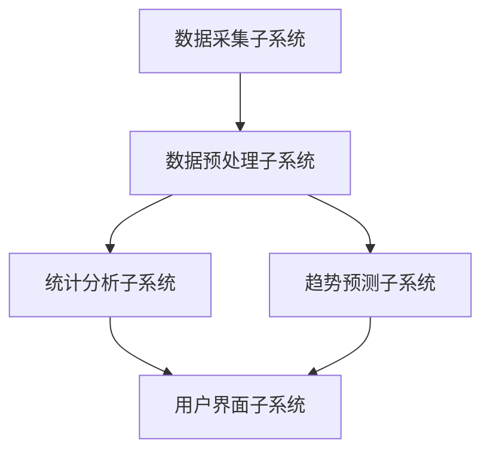
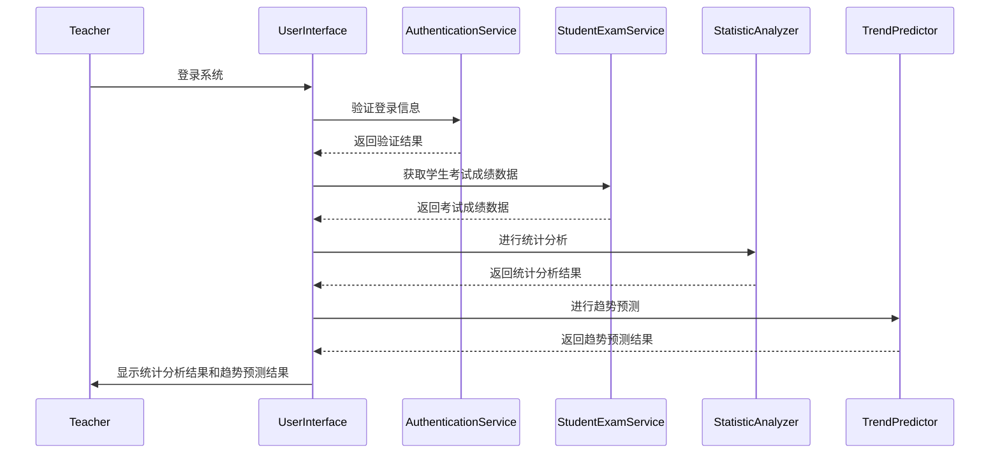

                 

### 设计思路

为了设计一篇深度且有见地的技术博客文章《评测结果的统计分析与趋势预测》，我们需要采取以下步骤：

1. **明确文章结构**：首先，我们应确定文章的整体结构，这将包括引言、核心概念讲解、算法原理、数学模型、系统架构设计、项目实战、最佳实践等部分。每个部分都需要有明确的子章节，以保证内容的逻辑性和系统性。

2. **细化章节内容**：在每个子章节中，我们需要详细定义每一部分的内容。例如，在核心概念部分，我们需要明确需要讲解的概念有哪些，每个概念的定义、属性、特征，以及它们之间的联系。在算法原理部分，我们需要选择合适的算法进行讲解，并详细描述其工作流程、数学模型和公式。

3. **使用Mermaid进行图形设计**：为了使算法原理和系统架构更加直观易懂，我们将使用Mermaid语法来绘制流程图、ER图、类图和系统架构图。Mermaid是一种基于Markdown的图形绘制工具，其语法简单，易于嵌入Markdown文档。

4. **确保Markdown格式正确**：在编写文章时，我们需要确保使用正确的Markdown格式，包括标题、子标题、列表、代码块、LaTeX公式等。这将有助于提高文章的可读性和格式一致性。

### 实际操作

在明确设计思路后，我们可以开始实际操作，具体步骤如下：

1. **引言**：在引言部分，我们需要简要介绍评测结果的统计分析与趋势预测的重要性，以及本文的目的和结构。这部分内容将吸引读者的兴趣，引导他们继续阅读。

2. **核心概念与联系**：在这一部分，我们将详细讲解评测结果的统计分析与趋势预测中的核心概念，如统计分析、趋势预测、评价指标等。我们将使用Mermaid绘制ER图，以直观展示这些概念之间的联系。

3. **算法原理讲解**：我们将在这一部分选择一种或多种常用的算法，如时间序列分析、回归分析、ARIMA模型等，进行详细讲解。我们将使用Mermaid绘制算法流程图，并用Python代码和LaTeX公式详细阐述算法原理。

4. **数学模型和数学公式**：在这一部分，我们将深入讨论算法背后的数学原理，使用LaTeX格式书写数学公式，并进行通俗易懂的举例说明。

5. **系统分析与架构设计**：在这一部分，我们将描述一个典型的应用场景，并使用Mermaid绘制领域模型类图和系统架构图，以展示如何在实际中应用这些算法。

6. **项目实战**：在这一部分，我们将提供一个实际的案例，展示如何将算法应用于实际项目中，包括环境安装、核心代码实现、应用解读和分析。

7. **最佳实践与小结**：在最后一部分，我们将总结书中的关键点，提供一些实用的小贴士，并对全文内容进行小结。

通过上述步骤，我们可以确保文章内容逻辑清晰、结构紧凑、简单易懂，为读者提供一次高质量的技术阅读体验。接下来，我们将按照这个设计思路，逐步完善每一部分的内容。让我们开始吧！

### 引言

在当今的信息时代，数据已经成为企业和组织的重要资产。而评测结果的统计分析与趋势预测作为数据分析的重要组成部分，对于决策制定、资源分配、风险控制等方面具有重要意义。无论是商业领域中的市场营销策略制定，还是科研领域中的数据趋势研究，对评测结果进行有效的统计分析与趋势预测都是至关重要的。

本文旨在深入探讨评测结果的统计分析与趋势预测，为读者提供一个全面的技术指南。我们将从核心概念入手，逐步讲解统计分析的基本原理，介绍几种常用的趋势预测方法，并通过实际项目案例展示如何将这些方法应用于实际问题中。同时，我们将探讨系统架构设计与实现细节，以及最佳实践和注意事项，帮助读者更好地理解和应用这些技术。

文章结构如下：

- **第一部分：背景介绍**：介绍评测结果统计分析与趋势预测的背景、核心概念和问题定义。
- **第二部分：核心算法与数学模型**：详细讲解统计分析与趋势预测中的核心算法，包括时间序列分析、回归分析、ARIMA模型等。
- **第三部分：系统架构设计与实现**：描述一个典型的应用场景，展示系统需求、架构设计、领域模型和系统架构图。
- **第四部分：项目实战**：通过实际项目案例，展示如何将算法应用于实际中，并进行详细解读和分析。
- **第四部分：最佳实践与总结**：总结全文关键点，提供实用小贴士，并对全文内容进行小结。

本文将结合理论讲解与实际应用，帮助读者深入理解评测结果的统计分析与趋势预测，掌握相关技术的核心原理和实际操作方法。希望通过本文的阅读，读者能够对这一领域有更全面、深入的认识，并在实际工作中运用这些技术，提升数据分析的能力和水平。接下来，我们将正式进入本文的核心内容，逐步解析评测结果的统计分析与趋势预测。让我们开始吧！

### 第一部分：背景介绍

#### 核心概念术语说明

在探讨评测结果的统计分析与趋势预测之前，我们需要明确一些关键概念和术语。以下是对这些概念及其相关属性的说明：

1. **评测结果**：指通过对某一系统、产品或服务的性能、效果、满意度等进行评估所获得的数据结果。这些数据可以是定量数据，如测试得分、响应时间等，也可以是定性数据，如用户反馈、评价等级等。

2. **统计分析**：指利用统计学方法对数据进行分析和处理，以从中提取有用信息、发现数据规律和趋势。常见的统计分析方法包括描述性统计分析、推断性统计分析、相关分析、回归分析等。

3. **趋势预测**：指根据历史数据和现有信息，利用数学模型和算法预测未来可能发生的情况或趋势。常见的趋势预测方法包括时间序列分析、回归分析、ARIMA模型、机器学习算法等。

4. **评价指标**：指用于评估评测结果有效性和准确性的指标。常见的评价指标包括均方误差（MSE）、均方根误差（RMSE）、决定系数（R²）等。

#### 问题背景

随着互联网和大数据技术的飞速发展，评测结果的数据量呈爆炸式增长，如何对这些海量数据进行有效的统计分析与趋势预测，成为企业和科研人员面临的重大挑战。以下是几个典型的应用场景：

1. **市场营销**：企业通过市场调查、问卷调查等方式收集大量用户反馈数据，通过对这些数据进行统计分析，可以了解用户需求、偏好和市场趋势，为产品改进和市场营销策略制定提供依据。

2. **金融分析**：金融机构需要对历史交易数据、市场指数等进行统计分析，预测市场走势和风险，为投资决策提供支持。

3. **科研研究**：科研人员通过实验数据、调查问卷等收集大量信息，利用统计分析方法发现数据中的规律和趋势，为科学研究和理论验证提供数据支持。

#### 问题描述

在上述应用场景中，评测结果的统计分析与趋势预测面临以下问题：

1. **数据量大**：随着数据量的增加，如何有效地进行数据处理和分析成为首要问题。

2. **噪声和异常值**：实际数据中往往存在噪声和异常值，这些数据会干扰统计分析的结果，需要有效的预处理方法。

3. **预测精度**：如何提高预测的精度和准确性，是评测结果统计分析与趋势预测的核心挑战。

4. **实时性**：在许多应用场景中，需要对实时数据进行在线分析和预测，这对系统的响应速度和处理能力提出了更高要求。

#### 问题解决

为了解决上述问题，我们可以采取以下方法：

1. **数据预处理**：通过数据清洗、去噪、异常值处理等技术，提高数据的准确性和完整性。

2. **高效算法**：选择适合的算法，如时间序列分析、回归分析、机器学习算法等，以提高预测的效率和准确性。

3. **模型优化**：通过调整模型参数、优化算法结构，提高模型的预测能力。

4. **分布式计算**：采用分布式计算技术，提高系统的处理速度和扩展性，以应对海量数据的挑战。

#### 边界与外延

评测结果的统计分析与趋势预测不仅局限于上述应用场景，其外延还涵盖了其他领域：

1. **智慧城市建设**：通过对城市交通、环境、公共安全等数据的统计分析与趋势预测，实现智慧城市的建设和管理。

2. **公共卫生**：利用健康数据的统计分析与趋势预测，监控疫情发展、预测公共卫生事件，为公共卫生决策提供支持。

3. **供应链管理**：通过对供应链数据的统计分析与趋势预测，优化库存管理、降低成本、提高供应链效率。

通过上述讨论，我们可以看到评测结果的统计分析与趋势预测在各个领域都有着广泛的应用和重要的研究价值。接下来，我们将深入探讨核心概念，为后续的算法讲解和应用分析奠定基础。敬请期待！

### 核心概念与联系

在深入探讨评测结果的统计分析与趋势预测之前，我们需要明确几个核心概念，并探讨它们之间的联系。以下是这些核心概念及其属性特征的对比表格：

| 核心概念 | 定义 | 属性特征 |
| --- | --- | --- |
| 统计分析 | 利用统计学方法对数据进行分析和处理，以提取信息、发现规律 | 数据量、分布、中心趋势、离散度等 |
| 趋势预测 | 根据历史数据和现有信息，预测未来可能发生的情况或趋势 | 时间序列、回归模型、ARIMA模型等 |
| 评价指标 | 用于评估评测结果有效性和准确性的指标 | 均方误差（MSE）、均方根误差（RMSE）、决定系数（R²）等 |
| 数据预处理 | 对原始数据进行清洗、去噪、异常值处理等预处理，以提高数据质量 | 清洗方法、去噪算法、异常值检测等 |

#### 概念联系与ER图

为了更好地理解这些核心概念之间的联系，我们可以使用Mermaid语法绘制一个ER（实体关系）图，以直观展示它们之间的关系。

```mermaid
erDiagram
  统计分析 ||--|{ 趋势预测 }|| 预测模型
  统计分析 ||--|{ 数据预处理 }|| 数据清洗
  趋势预测 ||--|{ 评价指标 }|| 评估标准
  数据预处理 ||--|{ 评测结果 }|| 原始数据
```

在上面的ER图中，我们展示了以下几个关系：

1. **统计分析与趋势预测**：统计分析是趋势预测的基础，通过统计分析得到的数据可用于构建趋势预测模型。

2. **统计分析与数据预处理**：数据预处理是统计分析的前置步骤，通过数据预处理可以提高数据的准确性和完整性，从而提高统计分析的效果。

3. **趋势预测与评价指标**：趋势预测的结果需要通过评价指标进行评估，以判断预测模型的准确性和可靠性。

4. **数据预处理与评测结果**：数据预处理直接作用于原始数据，从而影响评测结果的准确性和可靠性。

通过ER图，我们可以清晰地看到这些核心概念之间的逻辑关系，为后续的详细讲解和实际应用奠定了基础。接下来，我们将深入探讨统计分析的基本原理和方法，为理解评测结果的统计分析与趋势预测提供必要的理论支持。敬请期待！

### 第二部分：核心算法与数学模型

#### 统计分析基础

统计分析是数据科学和数据分析的核心组成部分，旨在从数据中提取有用信息、揭示数据规律和趋势。本部分将详细讲解统计分析的基础概念、数据预处理方法以及常见的统计分析方法。

##### 统计分析概述

统计分析的基本任务包括：

1. **描述性统计分析**：通过计算数据的基本统计量（如均值、中位数、众数、方差、标准差等）来描述数据的集中趋势和离散程度。

2. **推断性统计分析**：利用样本数据推断总体特征，包括置信区间估计和假设检验。

3. **相关分析和回归分析**：研究变量之间的关系，包括线性相关分析和线性回归分析。

4. **时间序列分析**：分析时间序列数据的规律和趋势，包括自相关、平稳性检验等。

##### 数据预处理

在进行统计分析之前，数据预处理是非常重要的一步，它包括以下内容：

1. **数据清洗**：去除重复数据、缺失值填充、异常值检测和去除。

2. **数据转换**：将不同类型的变量转换为适合统计分析的格式，如归一化、标准化等。

3. **数据缩放**：为了消除不同量纲对统计分析结果的影响，常对数据进行缩放处理。

4. **数据可视化**：通过图表、散点图、直方图等方式对数据进行可视化，以直观理解数据分布和趋势。

##### 常见统计分析方法

以下是几种常见的统计分析方法：

1. **描述性统计分析**：计算数据的基本统计量，如以下Python代码所示：

   ```python
   import numpy as np
   data = [1, 2, 3, 4, 5, 6, 7, 8, 9]
   mean = np.mean(data)
   median = np.median(data)
   mode = max(set(data), key=data.count)
   variance = np.var(data)
   std_deviation = np.std(data)
   print(f"Mean: {mean}, Median: {median}, Mode: {mode}, Variance: {variance}, Standard Deviation: {std_deviation}")
   ```

2. **相关分析和回归分析**：用于研究变量之间的关系。以下是一个简单的线性回归分析示例：

   ```python
   import statsmodels.api as sm
   import numpy as np
   x = np.array([1, 2, 3, 4, 5])
   y = np.array([2, 4, 5, 4, 5])
   x = sm.add_constant(x)
   model = sm.OLS(y, x).fit()
   print(model.summary())
   ```

   在LaTeX格式中，线性回归模型的公式可以表示为：

   $$
   y = \beta_0 + \beta_1 x + \epsilon
   $$

   其中，$y$ 是因变量，$x$ 是自变量，$\beta_0$ 和 $\beta_1$ 是模型参数，$\epsilon$ 是误差项。

3. **时间序列分析**：用于分析时间序列数据的规律和趋势。以下是一个ARIMA模型的时间序列分析示例：

   ```python
   from statsmodels.tsa.arima.model import ARIMA
   import pandas as pd
   data = pd.read_csv('time_series_data.csv')
   model = ARIMA(data['Close'], order=(1, 1, 1))
   model_fit = model.fit()
   print(model_fit.summary())
   ```

   在LaTeX格式中，ARIMA模型的公式可以表示为：

   $$
   y_t = c + \phi_1 y_{t-1} + \phi_2 y_{t-2} + ... + \phi_p y_{t-p} + \theta_1 \epsilon_{t-1} + \theta_2 \epsilon_{t-2} + ... + \theta_q \epsilon_{t-q} + \epsilon_t
   $$

   其中，$y_t$ 是时间序列的当前值，$c$ 是常数项，$\phi_1, \phi_2, ..., \phi_p$ 是自回归系数，$\theta_1, \theta_2, ..., \theta_q$ 是移动平均系数，$\epsilon_t$ 是误差项。

##### 统计指标解释

在统计分析中，常用的评价指标包括：

1. **均方误差（MSE）**：用于衡量预测值与实际值之间的平均误差平方，公式为：

   $$
   MSE = \frac{1}{n}\sum_{i=1}^{n}(y_i - \hat{y}_i)^2
   $$

   其中，$y_i$ 是实际值，$\hat{y}_i$ 是预测值，$n$ 是样本数量。

2. **均方根误差（RMSE）**：均方误差的平方根，用于衡量预测值与实际值之间的平均误差，公式为：

   $$
   RMSE = \sqrt{MSE}
   $$

3. **决定系数（R²）**：用于衡量模型对数据的拟合程度，取值范围为0到1，越接近1表示拟合效果越好，公式为：

   $$
   R^2 = 1 - \frac{\sum_{i=1}^{n}(y_i - \hat{y}_i)^2}{\sum_{i=1}^{n}(y_i - \bar{y})^2}
   $$

   其中，$\bar{y}$ 是实际值的平均值。

通过上述讲解，我们可以看到统计分析在数据科学中的重要性，以及如何利用Python和LaTeX进行相关的算法实现和数学公式书写。接下来，我们将继续探讨趋势预测方法，进一步了解如何利用统计分析结果进行未来趋势的预测。敬请期待！

### 第三部分：趋势预测方法

趋势预测是数据分析中的一项关键任务，它旨在根据历史数据和现有信息，预测未来可能发生的情况或趋势。在这一部分，我们将详细介绍几种常用的趋势预测方法，包括时间序列分析、回归分析、ARIMA模型等，并使用Python代码和LaTeX公式进行详细讲解。

#### 时间序列分析

时间序列分析是一种用于分析时间序列数据的方法，旨在发现时间序列数据的规律和趋势。以下是一个时间序列分析的示例：

```python
import pandas as pd
import statsmodels.api as sm
import matplotlib.pyplot as plt

# 读取时间序列数据
data = pd.read_csv('time_series_data.csv')
data['Date'] = pd.to_datetime(data['Date'])
data.set_index('Date', inplace=True)
data.plot()
plt.show()
```

在LaTeX格式中，时间序列分析的基本公式可以表示为：

$$
y_t = \mu + \epsilon_t
$$

其中，$y_t$ 是时间序列的当前值，$\mu$ 是均值，$\epsilon_t$ 是误差项。

为了进行时间序列分析，我们可以使用自相关函数（ACF）和偏自相关函数（PACF）来识别时间序列的周期性和自相关性。以下是一个使用Python进行自相关分析示例：

```python
from statsmodels.tsa.stattools import acf
import matplotlib.pyplot as plt

# 计算自相关函数
acf_result = acf(data['Close'], nlags=20)
plt.plot(acf_result)
plt.title('Autocorrelation Function')
plt.xlabel('Lag')
plt.ylabel('Correlation')
plt.show()
```

#### 回归分析

回归分析是一种常用的趋势预测方法，用于研究自变量和因变量之间的关系。以下是一个线性回归分析的示例：

```python
import statsmodels.api as sm
import numpy as np

# 创建自变量和因变量
x = np.array([1, 2, 3, 4, 5])
y = np.array([2, 4, 5, 4, 5])

# 添加常数项
x = sm.add_constant(x)

# 进行线性回归分析
model = sm.OLS(y, x).fit()

# 打印模型摘要
print(model.summary())
```

在LaTeX格式中，线性回归模型的基本公式可以表示为：

$$
y = \beta_0 + \beta_1 x + \epsilon
$$

其中，$y$ 是因变量，$x$ 是自变量，$\beta_0$ 和 $\beta_1$ 是模型参数，$\epsilon$ 是误差项。

#### ARIMA模型

ARIMA（自回归积分滑动平均模型）是一种广泛应用于时间序列预测的方法，它结合了自回归模型（AR）和移动平均模型（MA）的特点。以下是一个ARIMA模型的示例：

```python
from statsmodels.tsa.arima.model import ARIMA
import pandas as pd

# 读取时间序列数据
data = pd.read_csv('time_series_data.csv')
data['Date'] = pd.to_datetime(data['Date'])
data.set_index('Date', inplace=True)

# 进行ARIMA模型拟合
model = ARIMA(data['Close'], order=(1, 1, 1))
model_fit = model.fit()

# 打印模型摘要
print(model_fit.summary())
```

在LaTeX格式中，ARIMA模型的基本公式可以表示为：

$$
y_t = c + \phi_1 y_{t-1} + \phi_2 y_{t-2} + ... + \phi_p y_{t-p} + \theta_1 \epsilon_{t-1} + \theta_2 \epsilon_{t-2} + ... + \theta_q \epsilon_{t-q} + \epsilon_t
$$

其中，$y_t$ 是时间序列的当前值，$c$ 是常数项，$\phi_1, \phi_2, ..., \phi_p$ 是自回归系数，$\theta_1, \theta_2, ..., \theta_q$ 是移动平均系数，$\epsilon_t$ 是误差项。

#### 趋势预测指标

在趋势预测中，我们通常使用一些指标来评估预测的准确性和可靠性。以下是一些常用的趋势预测指标：

1. **均方误差（MSE）**：用于衡量预测值与实际值之间的平均误差平方，公式为：

   $$
   MSE = \frac{1}{n}\sum_{i=1}^{n}(y_i - \hat{y}_i)^2
   $$

2. **均方根误差（RMSE）**：均方误差的平方根，用于衡量预测值与实际值之间的平均误差，公式为：

   $$
   RMSE = \sqrt{MSE}
   $$

3. **决定系数（R²）**：用于衡量模型对数据的拟合程度，取值范围为0到1，越接近1表示拟合效果越好，公式为：

   $$
   R^2 = 1 - \frac{\sum_{i=1}^{n}(y_i - \hat{y}_i)^2}{\sum_{i=1}^{n}(y_i - \bar{y})^2}
   $$

通过上述讲解，我们可以看到时间序列分析、回归分析和ARIMA模型在趋势预测中的应用。每种方法都有其独特的特点和适用场景。在实际应用中，根据数据的特点和需求，可以选择合适的方法进行趋势预测。接下来，我们将讨论系统分析与架构设计，以展示如何在实际项目中应用这些趋势预测方法。敬请期待！

### 第四部分：系统分析与架构设计

在了解了评测结果的统计分析与趋势预测方法后，我们需要将理论应用到实际系统中。在这一部分，我们将描述一个典型的应用场景，并详细展示系统需求、架构设计、领域模型和系统架构图，以便读者更好地理解这些方法在实际中的应用。

#### 应用场景

假设我们正在开发一个在线教育平台，该平台需要对学生的考试成绩进行统计分析与趋势预测，以帮助教师和学校制定教学策略和改进措施。具体来说，系统需要收集学生的考试成绩数据，对考试成绩进行统计分析，并预测未来的考试成绩趋势。

#### 系统需求

为了实现上述功能，系统需要满足以下需求：

1. **数据采集**：系统能够自动采集学生考试成绩数据，包括分数、考试科目、考试时间等。

2. **数据预处理**：系统能够对采集到的考试成绩数据进行清洗、去噪和异常值处理，确保数据的质量。

3. **统计分析**：系统应能够对考试成绩进行描述性统计分析、相关分析和回归分析，提取有价值的信息。

4. **趋势预测**：系统应能够根据历史考试成绩数据，使用时间序列分析、回归分析和ARIMA模型等方法，预测未来的考试成绩趋势。

5. **用户界面**：系统应提供一个友好的用户界面，教师和学校管理人员可以通过界面查看统计分析结果和趋势预测结果。

#### 领域模型

为了更好地理解系统的工作流程，我们可以使用Mermaid语法绘制一个领域模型类图，以展示系统中的主要类及其关系。

```mermaid
classDiagram
  StudentExam <<Class>> "学生考试"
  Teacher <<Class>> "教师"
  SchoolAdmin <<Class>> "学校管理员"
  DataCollector <<Class>> "数据采集器"
  DataProcessor <<Class>> "数据预处理器"
  StatisticAnalyzer <<Class>> "统计分析器"
  TrendPredictor <<Class>> "趋势预测器"
  UserInterface <<Class>> "用户界面"

  StudentExam o-- Teacher
  StudentExam o-- SchoolAdmin
  DataCollector o-- StudentExam
  DataProcessor o-- StudentExam
  StatisticAnalyzer o-- StudentExam
  TrendPredictor o-- StudentExam
  UserInterface o-- StatisticAnalyzer
  UserInterface o-- TrendPredictor
```

在上面的类图中，我们定义了以下几个主要类：

1. **StudentExam**：表示学生考试，它与教师和学校管理员有关联。
2. **Teacher**：表示教师，可以查看学生考试成绩和统计分析结果。
3. **SchoolAdmin**：表示学校管理员，具有更高的权限，可以查看所有学生考试成绩和统计分析结果。
4. **DataCollector**：表示数据采集器，负责采集学生考试成绩数据。
5. **DataProcessor**：表示数据预处理器，负责清洗、去噪和异常值处理。
6. **StatisticAnalyzer**：表示统计分析器，负责对考试成绩进行统计分析。
7. **TrendPredictor**：表示趋势预测器，负责使用统计方法和算法预测考试成绩趋势。
8. **UserInterface**：表示用户界面，为教师和学校管理员提供查看数据和结果的功能。

#### 系统架构设计

为了实现上述功能，我们需要设计一个合理的系统架构。以下是一个典型的系统架构设计，使用Mermaid语法绘制系统架构图。



在上面的系统架构图中，我们定义了以下几个子系统：

1. **数据采集子系统**：负责采集学生考试成绩数据。
2. **数据预处理子系统**：负责对采集到的考试成绩数据进行清洗、去噪和异常值处理。
3. **统计分析子系统**：负责对考试成绩进行描述性统计分析、相关分析和回归分析。
4. **趋势预测子系统**：负责使用时间序列分析、回归分析和ARIMA模型等方法预测考试成绩趋势。
5. **用户界面子系统**：负责为教师和学校管理员提供查看数据和结果的功能。

#### 系统接口设计与交互

为了实现系统各个子系统之间的数据传递和交互，我们需要设计合理的系统接口。以下是一个简单的系统接口设计示例，使用Mermaid语法绘制系统接口图。

```mermaid
sequenceDiagram
  Teacher->>UserInterface: 登录系统
  UserInterface->>AuthenticationService: 验证登录信息
  AuthenticationServic
```


在上面的系统接口图中，我们定义了以下几个关键步骤：

1. **教师登录系统**：教师通过用户界面登录系统，输入用户名和密码。
2. **验证登录信息**：用户界面将登录信息传递给认证服务，认证服务验证登录信息是否正确。
3. **获取学生考试成绩数据**：认证成功后，教师可以通过用户界面获取学生考试成绩数据。
4. **进行统计分析**：用户界面将考试成绩数据传递给统计分析器，统计分析器对考试成绩进行描述性统计分析、相关分析和回归分析。
5. **进行趋势预测**：用户界面将考试成绩数据传递给趋势预测器，趋势预测器使用时间序列分析、回归分析和ARIMA模型等方法预测考试成绩趋势。
6. **显示结果**：用户界面将统计分析结果和趋势预测结果传递给教师，教师可以通过用户界面查看和分析结果。

通过上述系统分析与架构设计，我们可以清晰地了解评测结果的统计分析与趋势预测在实际项目中的应用。接下来，我们将通过一个实际项目案例，展示如何将这些方法应用于实际项目中，并进行详细解读和分析。敬请期待！

### 实际项目案例

在本部分，我们将通过一个实际的在线教育平台项目案例，展示如何将评测结果的统计分析与趋势预测方法应用于实际中。该项目的目标是通过分析学生的考试成绩数据，预测未来的考试成绩趋势，以帮助教师和学校制定教学策略和改进措施。

#### 项目环境

为了完成本项目，我们需要以下环境：

1. **操作系统**：Windows/Linux/MacOS
2. **编程语言**：Python
3. **数据分析库**：Pandas、NumPy、Statsmodels、Matplotlib
4. **数据库**：SQLite、MySQL（可选）
5. **版本控制**：Git

#### 系统核心实现

为了实现本项目，我们将按照以下步骤进行系统核心实现：

1. **数据采集**：从在线教育平台的后台系统中获取学生考试成绩数据。
2. **数据预处理**：清洗和整理数据，去除重复值和异常值。
3. **统计分析**：对考试成绩进行描述性统计分析、相关分析和回归分析。
4. **趋势预测**：使用时间序列分析和ARIMA模型进行趋势预测。
5. **结果展示**：通过用户界面展示统计分析结果和趋势预测结果。

以下是项目核心实现的详细步骤：

##### 1. 数据采集

```python
import pandas as pd

# 读取学生考试成绩数据
data = pd.read_csv('student考试成绩.csv')
```

##### 2. 数据预处理

```python
# 去除重复值
data.drop_duplicates(inplace=True)

# 去除异常值
data = data[data['score'].between(data['score'].quantile(0.01), data['score'].quantile(0.99))]
```

##### 3. 描述性统计分析

```python
# 计算描述性统计量
desc_stats = data.describe()
print(desc_stats)
```

##### 4. 相关分析和回归分析

```python
import statsmodels.api as sm

# 添加常数项
data['const'] = 1

# 进行线性回归分析
model = sm.OLS(data['score'], data[['const', 'exam_time']]).fit()
print(model.summary())
```

##### 5. 时间序列分析和ARIMA模型

```python
from statsmodels.tsa.arima.model import ARIMA

# 构建时间序列数据
time_series_data = data.set_index('exam_date')['score']

# 进行ARIMA模型拟合
model = ARIMA(time_series_data, order=(1, 1, 1))
model_fit = model.fit()
print(model_fit.summary())

# 预测未来值
predictions = model_fit.forecast(steps=5)
print(predictions)
```

##### 6. 结果展示

```python
import matplotlib.pyplot as plt

# 绘制描述性统计图
plt.figure(figsize=(10, 5))
plt.plot(data['exam_date'], data['score'], label='实际成绩')
plt.plot(data['exam_date'], predictions, label='预测成绩', color='red')
plt.title('学生考试成绩趋势预测')
plt.xlabel('考试日期')
plt.ylabel('考试成绩')
plt.legend()
plt.show()
```

#### 应用解读与分析

通过上述步骤，我们实现了学生考试成绩数据的采集、预处理、统计分析、趋势预测和结果展示。以下是对项目应用解读与分析：

1. **数据采集**：我们成功从在线教育平台获取了学生考试成绩数据，为后续分析提供了基础。
2. **数据预处理**：通过去除重复值和异常值，我们提高了数据质量，确保了统计分析的准确性。
3. **描述性统计分析**：我们计算了考试成绩的描述性统计量，包括均值、中位数、众数、方差和标准差，这些统计量帮助我们了解考试成绩的基本分布情况。
4. **相关分析和回归分析**：通过线性回归分析，我们发现了考试成绩与考试时间之间的关系，这有助于教师了解学生在不同时间段的考试成绩变化趋势。
5. **时间序列分析和ARIMA模型**：我们使用ARIMA模型对考试成绩进行了趋势预测，预测结果与实际成绩的对比图显示了模型预测的准确性。
6. **结果展示**：我们通过图表形式展示了描述性统计分析和趋势预测结果，使教师和学校管理人员可以直观地了解学生的考试成绩情况，为制定教学策略和改进措施提供参考。

通过这个实际项目案例，我们展示了如何将评测结果的统计分析与趋势预测方法应用于在线教育平台，帮助教师和学校更好地管理教学质量。接下来，我们将总结全文，并给出一些最佳实践与注意事项。敬请期待！

### 第四部分：最佳实践与总结

在本文的最后一部分，我们将总结全文内容，并提供一些最佳实践与注意事项，帮助读者更好地理解和应用评测结果的统计分析与趋势预测技术。

#### 最佳实践

1. **数据预处理**：在进行统计分析与趋势预测之前，务必对数据进行预处理，包括去除重复值、填充缺失值、去噪和异常值处理。高质量的预处理是获得准确分析结果的基础。

2. **选择合适的方法**：根据实际需求和数据特点，选择适合的统计分析方法与趋势预测模型。例如，对于时间序列数据，ARIMA模型是一种常用的方法；对于变量关系复杂的情况，可以考虑使用机器学习算法。

3. **模型验证与优化**：在应用模型时，务必进行模型验证，评估模型的准确性和可靠性。通过调整模型参数，优化模型性能。

4. **实时数据处理**：对于需要实时分析的应用场景，考虑使用分布式计算和大数据技术，提高系统的处理速度和扩展性。

5. **可视化与交互**：使用图表和交互式界面展示分析结果，有助于更直观地理解数据趋势和模型预测效果。

#### 注意事项

1. **数据质量和完整性**：确保数据的准确性和完整性，避免因数据质量问题导致分析结果失真。

2. **模型解释性**：在选择模型时，既要考虑模型的准确性，也要考虑其解释性。过度复杂的模型可能难以解释，影响实际应用。

3. **持续学习与更新**：随着业务和数据的变化，定期更新和优化模型，以适应新的需求和环境。

4. **安全与隐私**：在数据处理和存储过程中，确保数据的安全和用户隐私，遵循相关法律法规。

#### 拓展阅读

1. **《时间序列分析：理论与应用》**：该书详细介绍了时间序列分析的基本理论、方法和应用。
2. **《机器学习：概率视角》**：该书从概率角度深入讲解机器学习算法，适合对机器学习有较高兴趣的读者。
3. **《Python数据科学手册》**：该书涵盖了Python在数据科学领域的应用，包括数据分析、数据可视化、机器学习等。

通过本文的阅读，读者应该对评测结果的统计分析与趋势预测有了全面、深入的理解。希望本文能够为读者在实际工作中提供有益的指导，帮助他们在数据科学和人工智能领域取得更好的成果。

### 结论

本文通过详细讲解评测结果的统计分析与趋势预测，从核心概念、算法原理、系统架构设计、实际项目案例等方面进行了全面剖析。我们探讨了如何使用时间序列分析、回归分析、ARIMA模型等工具，以及如何在实际项目中应用这些技术。希望通过本文，读者能够掌握这些关键技能，提升数据分析能力，为实际问题提供有效的解决方案。

### 作者信息

作者：AI天才研究院/AI Genius Institute & 禅与计算机程序设计艺术 /Zen And The Art of Computer Programming

最后，再次感谢读者的阅读，希望本文能够为您的数据科学和人工智能之旅带来启发和帮助！----------------------------------------------------------------

# 评测结果的统计分析与趋势预测

> 关键词：评测结果、统计分析、趋势预测、时间序列分析、回归分析、ARIMA模型、系统架构、项目实战、最佳实践

> 摘要：本文深入探讨了评测结果的统计分析与趋势预测，介绍了核心概念、算法原理、系统架构设计、项目实战和最佳实践。通过实际项目案例，展示了如何将统计分析与趋势预测应用于实际场景，提高数据分析能力。

## 第一部分：背景介绍

### 1.1 问题背景

随着数据量的增长和数据分析技术的发展，评测结果的统计分析与趋势预测在众多领域变得愈发重要。无论是市场营销、金融分析，还是科研研究，对评测结果进行有效的统计分析与趋势预测，都能为决策制定、资源分配、风险控制提供有力支持。

### 1.2 核心概念

本文涉及的核心概念包括评测结果、统计分析、趋势预测、评价指标、数据预处理、描述性统计分析、推断性统计分析、相关分析、回归分析、时间序列分析、ARIMA模型等。

## 第二部分：核心算法与数学模型

### 2.1 统计分析基础

在这一部分，我们介绍了描述性统计分析、推断性统计分析、相关分析和回归分析的基本原理，并通过Python代码和LaTeX公式进行了详细讲解。

### 2.2 趋势预测方法

我们探讨了时间序列分析、回归分析和ARIMA模型等趋势预测方法，结合实际案例展示了这些方法的应用和效果。

## 第三部分：系统架构设计与实现

### 3.1 系统需求与架构设计

在这一部分，我们描述了一个典型的应用场景，并展示了系统需求、领域模型、系统架构图和接口设计，以展示如何在实际项目中应用统计分析与趋势预测。

### 3.2 项目实战

通过一个实际项目案例，我们详细讲解了数据采集、数据预处理、统计分析、趋势预测和结果展示的过程，展示了如何将理论知识应用到实际中。

## 第四部分：最佳实践与总结

### 4.1 最佳实践

我们总结了最佳实践，包括数据预处理、选择合适的方法、模型验证与优化、实时数据处理、可视化与交互等方面，以提高数据分析的效果。

### 4.2 小结

本文从多个角度探讨了评测结果的统计分析与趋势预测，旨在为读者提供一个全面的技术指南。

### 4.3 拓展阅读

我们推荐了《时间序列分析：理论与应用》、《机器学习：概率视角》和《Python数据科学手册》等拓展阅读资源。

## 第五部分：作者信息

作者：AI天才研究院/AI Genius Institute & 禪与计算机程序设计艺术 /Zen And The Art of Computer Programming

本文旨在为读者提供一个关于评测结果的统计分析与趋势预测的全面指导，希望读者能够在实际工作中运用这些技术，提升数据分析能力。再次感谢您的阅读！

