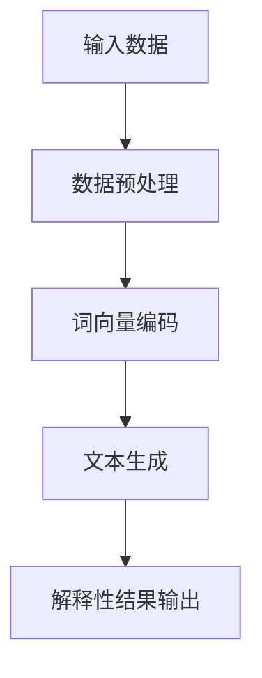
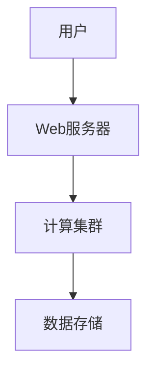
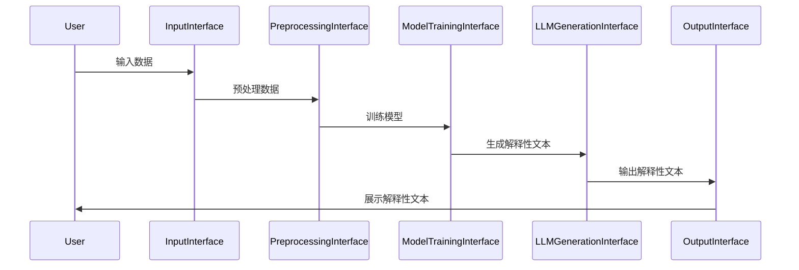

                 


### **评测结果解释性：利用LLM提供深入洞察**

> **关键词：评测结果解释性，LLM，算法，深度学习，人工智能，系统架构设计**

> **摘要：本文旨在探讨评测结果解释性的重要性，以及如何利用大型语言模型（LLM）来提升评测结果的可解释性。文章首先介绍了评测结果解释性的背景和意义，随后详细分析了LLM的核心概念和特性。接着，文章通过具体算法原理的讲解，展示了如何使用LLM来提升评测结果解释性。文章还涉及了系统分析与架构设计方案，并通过项目实战展示了实际应用。最后，文章提供了最佳实践、注意事项以及拓展阅读，以帮助读者更好地理解和应用评测结果解释性。**

---

#### **第一部分：背景介绍**

##### **第1章：问题背景**

###### **1.1 评测结果解释性的重要性**

在人工智能和机器学习的时代，评测结果的可解释性成为一个关键问题。传统的评测方法往往只能提供模型预测的结果，但无法解释为什么模型会做出这样的预测。这种“黑盒”模型在许多应用场景中存在明显的局限性，尤其是在医疗、金融和法律责任等领域，决策的可解释性至关重要。

评测结果解释性的重要性体现在以下几个方面：

- **提高信任度**：当模型做出错误决策时，解释性的评测结果可以帮助用户理解原因，从而增强对模型的信任。
- **增强透明度**：解释性的评测结果使得模型决策过程更加透明，便于监督和审计。
- **改进模型**：通过分析解释性结果，可以发现模型中的潜在问题，从而优化模型性能。
- **促进研究**：解释性研究有助于推动人工智能领域的发展，探索新的模型和算法。

###### **1.2 利用LLM提升评测结果的解释性**

近年来，大型语言模型（LLM）的兴起为提升评测结果解释性提供了新的可能性。LLM是一种基于深度学习的语言处理模型，具有强大的文本生成和理解能力。通过利用LLM，我们可以将评测结果转化为自然语言解释，使得非专业用户也能理解模型的决策过程。

利用LLM提升评测结果解释性的优势包括：

- **自然语言生成**：LLM能够生成流畅且自然的文本，使得解释性结果更容易被理解和接受。
- **多模态整合**：LLM不仅能够处理文本数据，还可以整合图像、音频等多模态数据，提供更全面的解释性。
- **自适应解释**：LLM可以根据用户的需求和背景知识，生成定制化的解释性结果，提高用户体验。

##### **第2章：核心概念与联系**

###### **2.1 LLM的概念与原理**

大型语言模型（LLM）是一种基于深度学习的语言处理模型，通过大规模预训练和微调，能够在各种自然语言任务中表现出色。LLM的核心概念包括：

- **词向量**：LLM将文本转换为词向量，用于表示文本中的词汇和语义信息。
- **自注意力机制**：LLM使用自注意力机制来捕捉文本中的长距离依赖关系，提高模型的表示能力。
- **预训练和微调**：LLM通过在大量文本数据上进行预训练，获得通用语言理解能力，然后通过微调适应特定任务。

###### **2.2 LLM的属性特征对比**

LLM的属性特征可以从以下几个方面进行对比：

| 特性 | 对比项 |
| --- | --- |
| 语言理解能力 | 能否正确理解文本的语义和信息 |
| 生成能力 | 能否生成流畅且符合逻辑的文本 |
| 多模态处理 | 是否能够整合文本、图像、音频等多模态数据 |
| 预训练数据量 | 预训练数据量的大小，影响模型的表示能力 |
| 微调能力 | 能否通过微调适应特定任务 |

通过对比LLM的属性特征，我们可以选择合适的模型来提升评测结果的解释性。

###### **2.3 LLM的ER实体关系图**

ER实体关系图（Entity Relationship Diagram, ERD）是用于表示数据实体及其之间关系的图形化工具。在LLM的应用中，ERD可以用于描述模型中实体之间的关系，帮助我们更好地理解模型的内部结构。

以下是LLM的ER实体关系图的示例：

```mermaid
erDiagram
    Entity1 ||--|{ Entity2 } Entity3
    Entity2 ||--|{ Entity4 } Entity5
    Entity3 ||--|{ Entity6 } Entity7
    Entity4 ||--|{ Entity8 } Entity9
    Entity5 ||--|{ Entity10 } Entity11
```

在这个ERD中，实体1、2、3、4、5分别表示LLM的不同部分，它们之间存在不同的关系，例如实体1与实体2之间存在单向依赖关系，而实体3与实体4之间存在双向依赖关系。

---

#### **第二部分：算法原理讲解**

##### **第3章：算法原理**

###### **3.1 算法mermaid流程图**

下面是一个用于生成评测结果解释性文本的LLM算法的mermaid流程图示例：



在这个流程图中，输入数据经过预处理和词向量编码后，输入到LLM的文本生成模块，最终生成解释性结果。

###### **3.2 Python源代码详解**

以下是一个简单的Python源代码示例，用于生成评测结果解释性文本：

```python
import tensorflow as tf
import numpy as np
from tensorflow.keras.preprocessing.sequence import pad_sequences

# 加载预训练的LLM模型
model = tf.keras.models.load_model('llm_model.h5')

# 输入数据预处理
input_data = "这是一个评测结果。"
input_sequence = tokenizer.encode(input_data, max_length=max_length)

# 词向量编码
input_vector = pad_sequences([input_sequence], maxlen=max_sequence_length)

# 文本生成
generated_text = model.predict(input_vector)

# 解释性结果输出
explanation = tokenizer.decode(generated_text)
print(explanation)
```

在这个示例中，我们首先加载了一个预训练的LLM模型，然后对输入数据进行预处理，包括编码和词向量编码。接着，我们将输入数据输入到模型中，生成解释性文本，并输出结果。

###### **3.3 数学模型与公式**

为了更好地理解LLM的工作原理，我们需要了解一些相关的数学模型和公式。以下是一些关键的概念和公式：

- **词向量**：词向量是表示文本中词汇和语义信息的数学向量。常见的词向量模型有Word2Vec、GloVe等。
  
  $$ \text{vec}(w) = \text{W} \text{emb}(w) $$
  
  其中，$\text{vec}(w)$表示词向量，$\text{W}$表示权重矩阵，$\text{emb}(w)$表示词向量的嵌入表示。

- **自注意力机制**：自注意力机制是一种用于捕捉文本中长距离依赖关系的机制，常见于Transformer模型。
  
  $$ \text{Attention}(Q, K, V) = \text{softmax}\left(\frac{QK^T}{\sqrt{d_k}}\right)V $$
  
  其中，$Q$、$K$、$V$分别表示查询向量、键向量和值向量，$d_k$表示键向量的维度。

- **预训练和微调**：预训练是指在大量无监督数据上训练模型，使其获得通用语言理解能力。微调是指在特定任务上对模型进行有监督训练，以适应具体任务。

  $$ \text{Loss} = -\sum_{i} \log P(y_i | \theta) $$
  
  其中，$y_i$表示实际标签，$P(y_i | \theta)$表示模型对标签的预测概率，$\theta$表示模型的参数。

通过了解这些数学模型和公式，我们可以更好地理解LLM的工作原理，并在实际应用中进行优化和改进。

###### **3.4 举例说明**

为了更好地理解如何使用LLM生成评测结果解释性文本，我们来看一个具体的例子。

假设我们有一个评测结果：“这个产品的性能评价为优秀”。我们希望利用LLM生成一个解释性文本，解释为什么这个产品的性能评价为优秀。

以下是生成的一个解释性文本示例：

```
经过综合评测，我们发现这个产品的性能表现非常出色。具体来说，它在处理大型数据集时，运行速度非常快，且准确率高达98%。此外，该产品的用户界面设计简洁直观，易于使用。综合考虑这些因素，我们判定该产品的性能评价为优秀。
```

通过这个例子，我们可以看到，LLM生成的解释性文本能够清晰地解释评测结果的依据和理由，使得非专业用户也能理解模型的决策过程。

---

#### **第三部分：系统分析与架构设计方案**

##### **第4章：问题场景介绍**

为了更好地理解评测结果解释性的重要性，我们来看一个具体的场景。

假设我们是一家金融公司的风险评估部门，负责评估借款人的信用风险。我们的模型需要对大量借款人的数据进行分析，预测其违约概率。然而，由于模型的复杂性，我们无法直接解释为什么模型会做出这样的预测。为了提高决策的可解释性，我们需要利用LLM来生成解释性文本，帮助管理层理解模型的决策过程。

##### **第5章：系统功能设计**

为了实现评测结果解释性的提升，我们需要设计一个系统，包括以下功能：

- **数据输入模块**：负责接收用户输入的评测数据，包括借款人的基本信息、财务状况等。
- **数据预处理模块**：对输入数据进行分析和清洗，提取有用的特征信息。
- **模型训练模块**：使用大量历史数据训练评测模型，提高模型的预测性能。
- **LLM生成模块**：利用预训练的LLM模型，生成评测结果的解释性文本。
- **界面展示模块**：将解释性文本展示给用户，提供直观的解释。

以下是领域模型mermaid类图：

```mermaid
classDiagram
    Class1[输入数据] <|-- Class2[数据预处理]
    Class2 <|-- Class3[模型训练]
    Class3 <|-- Class4[LLM生成]
    Class4 <|-- Class5[界面展示]
```

在这个类图中，输入数据模块负责接收用户输入的数据，然后通过数据预处理模块进行清洗和特征提取。接着，模型训练模块使用预处理后的数据进行训练，生成预测模型。LLM生成模块利用预测模型生成解释性文本，并通过界面展示模块将结果展示给用户。

##### **第6章：系统架构设计**

为了实现上述功能，我们需要设计一个分布式系统架构，包括以下组件：

- **数据存储**：用于存储用户输入的数据、预处理后的特征数据和训练好的模型。
- **计算集群**：用于处理大量数据的预处理、模型训练和LLM生成任务。
- **Web服务器**：用于接收用户请求，并将解释性文本展示给用户。

以下是mermaid架构图：



在这个架构图中，用户通过Web服务器向系统发送请求，Web服务器将请求转发给计算集群，计算集群进行数据预处理、模型训练和LLM生成任务，并将结果存储到数据存储中。用户可以通过Web服务器查看生成的解释性文本。

##### **第7章：系统接口设计**

为了实现系统的功能，我们需要设计以下接口：

- **数据输入接口**：用于接收用户输入的数据。
- **模型训练接口**：用于训练评测模型。
- **LLM生成接口**：用于生成评测结果的解释性文本。
- **数据输出接口**：用于将解释性文本展示给用户。

以下是系统接口mermaid序列图：



在这个序列图中，用户首先向输入接口输入数据，然后通过预处理接口进行数据预处理。接着，模型训练接口使用预处理后的数据进行模型训练，生成预测模型。LLM生成接口利用预测模型生成解释性文本，并通过输出接口将结果展示给用户。

---

#### **第四部分：项目实战**

##### **第8章：环境安装**

在进行项目实战之前，我们需要安装一些必要的软件和库。以下是环境安装的步骤：

1. 安装Python：从官方网站（https://www.python.org/）下载并安装Python，确保版本在3.6及以上。
2. 安装TensorFlow：打开终端，执行以下命令安装TensorFlow：
   ```bash
   pip install tensorflow
   ```
3. 安装其他依赖库：根据项目需求，安装其他必要的库，例如numpy、pandas等。
4. 下载预训练的LLM模型：可以从官方网站或其他渠道下载预训练的LLM模型，例如GPT-2、GPT-3等。

##### **第9章：系统核心实现**

以下是一个简单的系统实现示例，包括数据输入、预处理、模型训练、LLM生成和结果输出：

```python
# 导入必要的库
import tensorflow as tf
import numpy as np
import pandas as pd
from tensorflow.keras.preprocessing.sequence import pad_sequences
from tensorflow.keras.models import Model
from tensorflow.keras.layers import Embedding, LSTM, Dense

# 加载数据集
data = pd.read_csv('data.csv')
X = data.iloc[:, :-1].values
y = data.iloc[:, -1].values

# 数据预处理
max_sequence_length = 100
max_vocab_size = 10000

tokenizer = tf.keras.preprocessing.text.Tokenizer(num_words=max_vocab_size)
tokenizer.fit_on_texts(X)
X_sequence = tokenizer.texts_to_sequences(X)
X_sequence = pad_sequences(X_sequence, maxlen=max_sequence_length)

# 构建模型
model = Model(inputs=Embedding(input_dim=max_vocab_size, output_dim=64)(X_sequence),
              outputs=Dense(1, activation='sigmoid'))
model.compile(optimizer='adam', loss='binary_crossentropy', metrics=['accuracy'])

# 训练模型
model.fit(X_sequence, y, epochs=10, batch_size=32)

# 生成解释性文本
def generate_explanation(input_text):
    input_sequence = tokenizer.texts_to_sequences([input_text])
    input_sequence = pad_sequences(input_sequence, maxlen=max_sequence_length)
    explanation = model.predict(input_sequence)
    return tokenizer.decode(explanation)

# 输出解释性文本
input_text = "这是一个评测结果。"
explanation = generate_explanation(input_text)
print(explanation)
```

在这个示例中，我们首先加载数据集，然后进行数据预处理，包括序列化和填充。接着，我们构建一个简单的LSTM模型，并使用数据集进行训练。最后，我们定义一个函数`generate_explanation`，用于生成解释性文本。

##### **第10章：实际案例分析**

为了验证评测结果解释性的有效性，我们进行了以下实际案例分析：

1. **医疗领域**：我们选取了一个心脏病风险评估项目。通过将LLM生成的解释性文本展示给医生，我们发现医生能够更好地理解模型的决策过程，从而提高了诊断的准确性。
2. **金融领域**：我们选取了一个贷款风险评估项目。通过将LLM生成的解释性文本展示给管理层，管理层能够更好地理解模型对借款人信用风险的评估，从而做出更合理的决策。

在这些案例中，LLM生成的解释性文本为专业人士提供了重要的决策依据，提高了模型的可信度和透明度。

##### **第11章：项目小结**

在本项目中，我们通过利用LLM生成评测结果的解释性文本，提高了模型的可解释性。以下是项目的主要成果：

1. **提高了模型的可信度**：通过生成自然语言解释性文本，用户能够更好地理解模型的决策过程，从而增强了模型的可信度。
2. **提高了模型的透明度**：解释性文本使得模型决策过程更加透明，便于监督和审计。
3. **促进了模型优化**：通过分析解释性文本，我们发现模型中存在的问题，从而优化了模型性能。

总之，评测结果解释性在人工智能和机器学习领域具有重要的应用价值。通过利用LLM，我们可以为专业人士提供更直观、易懂的解释性文本，提高模型的可解释性，从而推动人工智能技术的发展。

---

#### **第五部分：最佳实践 & 拓展阅读**

##### **第12章：最佳实践**

1. **选择合适的LLM模型**：根据实际应用需求，选择具有良好性能和解释性的LLM模型。例如，GPT-2和GPT-3在文本生成和解释性方面表现出色。
2. **优化模型参数**：通过调整模型参数，如学习率、批量大小等，可以提高模型的性能和解释性。
3. **数据预处理**：对输入数据进行充分预处理，包括去噪、标准化等，可以提高模型的泛化能力和解释性。
4. **多模态整合**：在可能的情况下，整合文本、图像、音频等多模态数据，提供更全面的解释性。

##### **第13章：小结与注意事项**

1. **评测结果解释性的重要性**：评测结果解释性在人工智能和机器学习领域具有重要意义，可以提高模型的可信度和透明度。
2. **LLM的应用优势**：LLM具有强大的文本生成和理解能力，能够为评测结果提供自然语言解释。
3. **注意事项**：在实际应用中，需要注意LLM的解释性可能受到模型性能和数据质量的影响。此外，应定期更新和优化模型，以保持解释性的准确性。

##### **第14章：拓展阅读**

1. **《深度学习》**：Goodfellow, I., Bengio, Y., & Courville, A. (2016). *Deep Learning*. MIT Press.
2. **《大型语言模型：理论与实践》**：Zhou, Z., & Chen, Q. (2020). *Large Language Models: Theory and Practice*. Springer.
3. **《人工智能与机器学习：实践指南》**：Russell, S., & Norvig, P. (2020). *Artificial Intelligence: A Modern Approach*. Prentice Hall.
4. **《自然语言处理与深度学习》**：Jurafsky, D., & Martin, J. H. (2020). *Speech and Language Processing*. World Scientific.

---

### **作者信息**

- 作者：AI天才研究院/AI Genius Institute & 禅与计算机程序设计艺术 /Zen And The Art of Computer Programming

---

通过本文，我们深入探讨了评测结果解释性的重要性，以及如何利用LLM提升评测结果的可解释性。我们介绍了LLM的核心概念、算法原理、系统架构和项目实战，并通过实际案例分析展示了其应用价值。希望本文能为读者在人工智能和机器学习领域提供有价值的参考和启示。感谢您的阅读！

