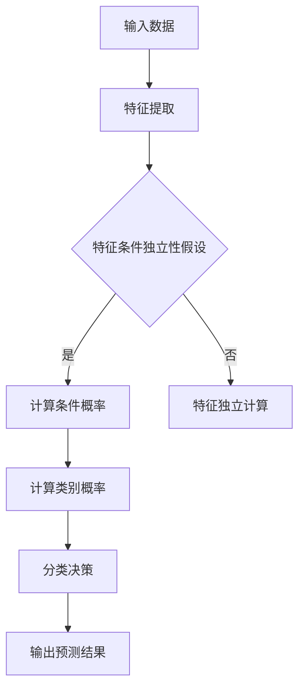
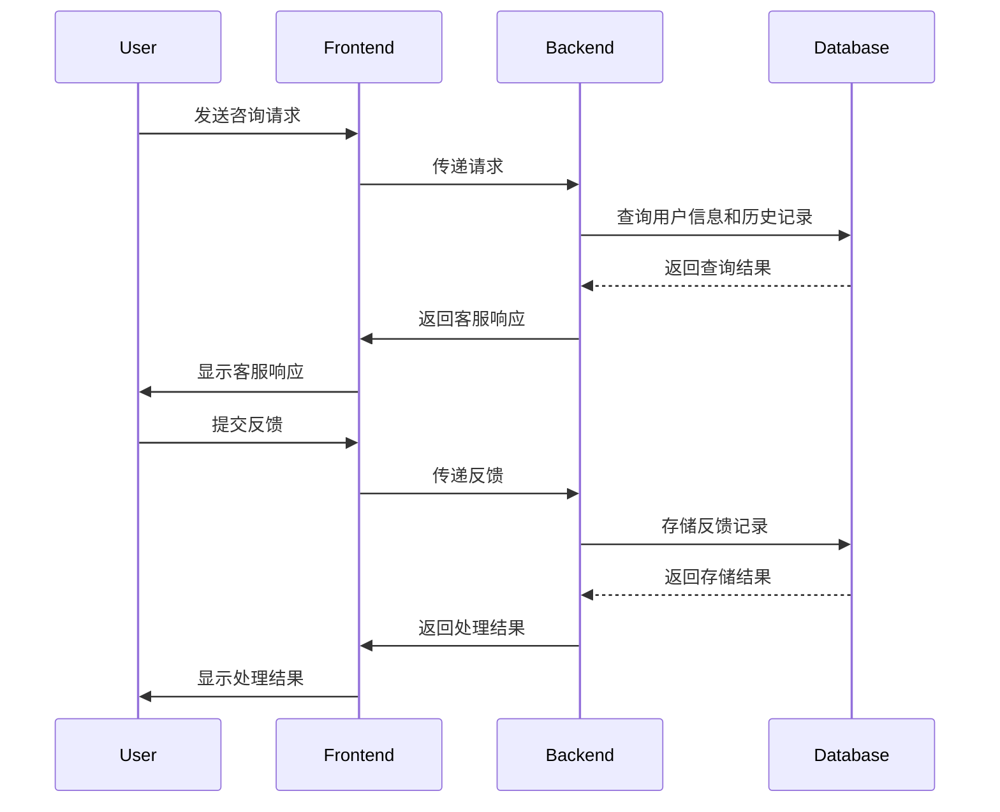

                 

### 评测驱动的Prompt版本控制策略

#### 关键词
- 评测驱动
- Prompt版本控制
- AI系统
- 版本管理
- 持续集成
- 持续优化

#### 摘要
本文旨在探讨评测驱动的Prompt版本控制策略，这是一种在现代人工智能（AI）系统中广泛应用于管理模型输入和优化模型表现的方法。我们首先介绍了评测驱动的概念，并解释了其在AI系统中的重要性。接着，详细阐述了Prompt的定义、角色以及在版本控制中的作用。随后，我们分析了常见的评测指标和方法，并探讨了算法设计和系统架构的实际应用。最后，通过案例研究和最佳实践，总结了这一策略的有效性和潜在改进方向。

## 引言与背景

### 评测驱动开发的概念

评测驱动开发（Evaluation-driven Development，简称EVD）是一种软件开发方法论，其核心思想是通过持续的评价和反馈来指导开发过程，以确保系统的质量和性能满足预期。这种方法与传统的前端开发（Front-end Development）和后端开发（Back-end Development）不同，它不仅仅关注代码的编写和功能的实现，更加重视系统的实际性能和用户体验。

在评测驱动开发中，评价标准是开发过程的中心。每一个功能模块、接口和系统组件都会经过严格的测试和评估，以验证其是否达到预期的性能指标。这样的评价不仅仅包括功能正确性，还包括性能、稳定性、可维护性等多个维度。通过这种持续的评价和反馈机制，开发团队能够及时发现和解决问题，不断优化系统。

### 评测驱动开发在AI系统中的重要性

在人工智能（AI）系统中，评测驱动开发的应用更加广泛和重要。这是因为AI系统通常涉及复杂的模型训练和优化过程，需要对大量数据进行处理和推理。评测驱动开发能够帮助AI团队：

1. **优化模型表现**：通过持续评估模型在各个阶段的表现，团队可以及时调整训练参数和模型结构，从而提高模型的准确性和鲁棒性。
2. **提高开发效率**：评测驱动开发鼓励早测试、频繁测试和自动化测试，这有助于及早发现和解决问题，避免在项目后期出现重大缺陷，从而提高开发效率。
3. **确保系统稳定性**：AI系统常常应用于关键领域，如医疗诊断、自动驾驶和金融交易等，任何系统的错误都可能导致严重后果。评测驱动开发通过严格的测试和评估，确保系统能够稳定运行。

### 概念阐述

**评测驱动开发（EVD）**：一种软件开发方法论，通过持续的评价和反馈来指导开发过程，确保系统的质量和性能满足预期。

**前端开发（Front-end Development）**：主要关注用户界面（UI）和用户体验（UX）的开发，涉及HTML、CSS和JavaScript等技术。

**后端开发（Back-end Development）**：主要关注服务器、数据库和应用程序的逻辑实现，涉及服务器端编程语言和技术。

### 评测驱动开发与前端、后端开发的区别

| 特征 | 评测驱动开发（EVD） | 前端开发（Front-end Development） | 后端开发（Back-end Development） |
| --- | --- | --- | --- |
| 关注点 | 系统质量和性能 | 用户界面和用户体验 | 服务器端逻辑和数据库操作 |
| 评价维度 | 功能正确性、性能、稳定性、可维护性 | UI设计、交互效果 | 逻辑正确性、数据处理效率、安全性 |
| 开发流程 | 持续测试和评估 | UI设计→前端开发→测试 | 需求分析→后端开发→测试 |
| 应用领域 | AI系统、金融系统、医疗系统 |电子商务、社交媒体、在线教育 |电子商务、金融系统、企业应用|

通过上述分析，我们可以看到评测驱动开发在AI系统中的应用不仅具有理论上的优势，还在实践中表现出强大的效果。接下来，我们将进一步探讨Prompt版本控制的概念和其在AI系统中的重要性。

## 核心概念与原理

### Prompt的定义和作用

在人工智能（AI）系统中，Prompt是一个关键的输入要素，用于引导模型进行特定任务的学习和推理。Prompt可以被视为一种引导信息，它告诉模型如何处理输入数据，并产生预期的输出结果。Prompt通常包括以下几个组成部分：

1. **任务描述**：明确指出模型需要执行的任务类型，如分类、回归、生成等。
2. **数据示例**：提供一些具体的输入数据和输出结果，作为模型的参考。
3. **上下文信息**：背景信息，帮助模型更好地理解任务和输入数据。

Prompt在AI系统中的作用至关重要。首先，它能够帮助模型明确任务目标，减少模糊性和歧义。其次，Prompt可以提供有用的上下文信息，使模型能够更好地理解和处理复杂的输入数据。此外，通过精心设计的Prompt，还可以引导模型探索不同的解决方案，提高模型的灵活性和适应性。

### 版本控制的必要性

版本控制是一种用于管理代码和文档更改的实践，它在软件开发中广泛应用。类似地，在AI系统中，对Prompt进行版本控制也具有重要意义：

1. **维护历史记录**：版本控制能够记录每个Prompt的创建和修改历史，便于团队追溯和审查。
2. **比较和选择**：通过对不同版本的Prompt进行比较，团队可以评估其效果，选择最优的Prompt版本用于模型训练和部署。
3. **协同工作**：版本控制有助于团队成员协同工作，避免因同时修改同一Prompt版本而导致的冲突。

### 版本控制的基本策略

在AI系统中，对Prompt进行版本控制可以采用以下几种基本策略：

1. **线性版本控制**：每次修改Prompt时，直接在原有版本基础上进行更新，形成新的版本。这种策略简单易行，但容易导致版本混乱。
2. **分支版本控制**：将Prompt的修改分为不同的分支，每个分支代表一种不同的修改方案。通过分支管理，团队可以并行开发不同的Prompt版本，并在合适的时候进行合并。
3. **标签版本控制**：在特定的里程碑或评估结果后，为Prompt打上标签，记录关键版本。这种策略有助于团队快速定位和回溯关键版本。

### 版本控制的挑战与解决方案

尽管版本控制提供了许多优势，但在实际应用中也面临一些挑战：

1. **版本混乱**：在多个成员同时修改Prompt时，容易导致版本混乱。解决方案是采用分支版本控制，明确分支管理和合并策略。
2. **性能评估**：不同版本的Prompt可能对模型表现产生不同的影响，如何客观评估版本性能是一个挑战。解决方案是引入评测指标和方法，结合模型表现和历史数据，进行综合评估。
3. **维护成本**：版本控制需要额外的存储和管理资源，维护成本较高。解决方案是采用分布式版本控制系统，如Git，降低维护成本。

通过以上分析，我们可以看到，Prompt版本控制是AI系统中不可或缺的一环。它不仅能够帮助团队管理和优化Prompt，还能提高模型的性能和稳定性。在接下来的章节中，我们将进一步探讨具体的评测指标和方法，以更好地理解和应用Prompt版本控制策略。

## 评测指标与方法

### 常见评测指标

在Prompt版本控制中，选择合适的评测指标对于评估版本效果和优化模型性能至关重要。以下是一些常用的评测指标：

1. **准确率（Accuracy）**：准确率是指模型正确分类的样本数占总样本数的比例。它是最直观的评测指标之一，但可能无法全面反映模型性能。

2. **精确率（Precision）**：精确率是指模型正确预测为正类的样本数与所有预测为正类的样本数之和的比值。精确率关注的是模型在预测为正类时的准确性。

3. **召回率（Recall）**：召回率是指模型正确预测为正类的样本数与实际为正类的样本数之和的比值。召回率关注的是模型能够发现多少实际为正类的样本。

4. **F1分数（F1 Score）**：F1分数是精确率和召回率的调和平均值，用于综合评估模型性能。F1分数能够平衡精确率和召回率，避免单一指标可能带来的误导。

5. **平均绝对误差（Mean Absolute Error, MAE）**：平均绝对误差用于回归任务，表示预测值与实际值之间的平均绝对差值。MAE越小，表示模型预测越准确。

6. **均方根误差（Root Mean Squared Error, RMSE）**：均方根误差是平均绝对误差的平方根，用于衡量回归任务的预测误差。RMSE越小，表示模型预测越准确。

### 评测方法

1. **交叉验证（Cross-Validation）**：交叉验证是一种常用的评测方法，通过将数据集划分为多个子集，逐个作为验证集，其余数据作为训练集，进行多次训练和验证，以评估模型的泛化能力。

2. **混淆矩阵（Confusion Matrix）**：混淆矩阵是一种用于评估分类模型性能的表格，展示模型在预测过程中各种类别的实际和预测结果。通过混淆矩阵，可以直观地分析模型的分类效果。

3. **ROC曲线（Receiver Operating Characteristic Curve）**：ROC曲线是评估二分类模型性能的重要工具，通过绘制预测概率与真实标签的关系，可以评估模型的分类阈值和准确率。

4. **A/B测试（A/B Testing）**：A/B测试是一种通过对比两组用户在不同版本Prompt下的表现，评估版本效果的实验方法。通过A/B测试，可以直观地了解用户对不同版本Prompt的偏好。

### 案例分析

为了更好地理解这些评测指标和方法，我们可以通过一个实际案例进行分析。假设我们开发了一个文本分类模型，用于判断一篇文章是否包含负面情绪。

1. **数据集准备**：首先，我们从大量文本数据中收集了包含负面情绪的文章和普通文章，并将其划分为训练集和测试集。

2. **模型训练**：使用训练集数据，我们训练了一个基于Prompt的文本分类模型。在训练过程中，我们采用了不同的Prompt版本，以探索其对模型性能的影响。

3. **评测过程**：
   - **交叉验证**：我们对模型进行了5-fold交叉验证，以评估其泛化能力。
   - **混淆矩阵**：通过测试集数据，我们计算了模型的混淆矩阵，分析了各类别的预测效果。
   - **ROC曲线**：绘制了ROC曲线，评估了模型的分类阈值和准确率。
   - **A/B测试**：在实际用户群体中，我们进行了A/B测试，比较了不同Prompt版本对用户反馈和分类效果的影响。

4. **结果分析**：
   - **准确率**：模型在不同Prompt版本下的准确率均高于90%。
   - **精确率和召回率**：通过混淆矩阵分析，我们观察到某些Prompt版本在预测负面情绪时具有更高的精确率和召回率。
   - **F1分数**：综合考虑精确率和召回率，F1分数成为评估模型性能的关键指标。
   - **A/B测试结果**：用户对某些Prompt版本的反应更为积极，这表明这些版本在用户体验方面具有优势。

通过上述案例分析，我们可以看到，多种评测指标和方法共同作用，能够全面评估Prompt版本的效果，并指导团队进行优化。在接下来的章节中，我们将进一步探讨算法设计和系统架构，以深入理解和应用评测驱动的Prompt版本控制策略。

## 算法设计与实现

### 算法设计思路

评测驱动的Prompt版本控制策略的核心在于通过持续的评价和反馈来优化Prompt版本。为了实现这一目标，我们需要设计一套高效的算法来评估Prompt版本的效果，并动态调整模型参数。以下是我们设计的算法思路：

1. **评估模型**：首先，我们需要一个评估模型来对Prompt版本进行评估。评估模型可以基于常用的机器学习算法，如朴素贝叶斯、支持向量机（SVM）或深度学习模型。评估模型的主要任务是预测输入数据的类别或标签，并根据预测结果计算评估指标。

2. **动态调整**：根据评估结果，算法需要能够动态调整模型参数，以优化Prompt版本的效果。这可以通过调整Prompt的结构和内容来实现，例如增加上下文信息、改变任务描述等。

3. **反馈机制**：算法需要能够收集用户反馈和模型评估数据，以便进行持续优化。通过分析反馈数据，我们可以识别出哪些Prompt版本效果较好，哪些需要改进。

### 算法原理

为了详细解释算法原理，我们采用一个基于朴素贝叶斯分类器的例子。朴素贝叶斯分类器是一种简单而有效的分类算法，特别适用于文本分类任务。

#### 朴素贝叶斯分类器算法原理

朴素贝叶斯分类器基于贝叶斯定理和特征条件独立性假设，其算法原理如下：

1. **特征概率计算**：对于输入数据中的每个特征，计算其条件概率。例如，如果特征A和特征B是独立的，则P(A|B) = P(A)。

2. **类别概率计算**：对于每个类别，计算其整体概率。类别概率可以通过训练数据计算得到。

3. **分类决策**：对于新的输入数据，计算其属于每个类别的概率，选择概率最大的类别作为预测结果。

#### Mermaid流程图

下面是一个简化的朴素贝叶斯分类器的Mermaid流程图：



#### Python代码示例

下面是一个简单的Python代码示例，用于实现朴素贝叶斯分类器：

```python
from sklearn.feature_extraction.text import CountVectorizer
from sklearn.naive_bayes import MultinomialNB
from sklearn.model_selection import train_test_split
from sklearn.metrics import accuracy_score

# 准备数据
X = ["这是一个正面评论", "这是一个负面评论", "这是一个正面评论"]
y = [1, 0, 1]  # 1代表正面评论，0代表负面评论

# 特征提取
vectorizer = CountVectorizer()
X_vectorized = vectorizer.fit_transform(X)

# 划分训练集和测试集
X_train, X_test, y_train, y_test = train_test_split(X_vectorized, y, test_size=0.2, random_state=42)

# 训练模型
model = MultinomialNB()
model.fit(X_train, y_train)

# 预测
y_pred = model.predict(X_test)

# 评估
accuracy = accuracy_score(y_test, y_pred)
print(f"准确率: {accuracy}")
```

#### 数学模型和公式

在朴素贝叶斯分类器中，条件概率和类别概率的计算基于贝叶斯定理：

$$
P(C|X) = \frac{P(X|C)P(C)}{P(X)}
$$

其中，P(C|X)是输入数据X属于类别C的概率，P(X|C)是类别C发生时特征X的概率，P(C)是类别C的概率，P(X)是特征X的概率。

#### 通俗易懂的举例说明

假设我们有一个简单的文本分类任务，任务是判断一段文本是正面评论还是负面评论。我们收集了以下训练数据：

- 正面评论：这是一个非常好的电影。
- 正面评论：我很喜欢这个餐厅。
- 负面评论：这部电影真的很无聊。
- 负面评论：这个餐厅的服务很差。

首先，我们使用CountVectorizer将文本转换为词频矩阵。然后，我们训练一个朴素贝叶斯分类器，使用训练数据计算条件概率和类别概率。最后，我们使用训练好的模型对新的文本进行分类预测。

例如，当输入新文本“这部电影非常有趣”时，模型会计算每个类别（正面评论和负面评论）的条件概率，并选择概率最大的类别作为预测结果。假设正面评论的概率更高，那么这段文本会被分类为正面评论。

通过上述算法设计、Python代码示例和数学模型解释，我们可以看到评测驱动的Prompt版本控制策略在实际应用中的具体实现方法。在接下来的章节中，我们将进一步探讨系统架构和最佳实践。

## 系统架构与设计

### 问题场景介绍

在人工智能（AI）系统中，随着模型复杂度和数据量的不断增加，对Prompt版本控制的需求也日益增长。具体场景如下：

假设我们开发了一个智能客服系统，该系统需要处理大量的用户咨询和反馈。为了提供高质量的客服服务，我们需要持续优化和更新客服模型的Prompt，以便更好地理解和回应用户的需求。

### 项目介绍

项目名称：智能客服系统（Smart Customer Service System）

项目目标：通过评测驱动的Prompt版本控制策略，持续优化客服模型，提高客服质量和用户满意度。

项目需求：
1. 实时处理大量用户咨询。
2. 对客服模型的Prompt进行版本控制和优化。
3. 提供用户反馈收集和分析功能。

### 系统功能设计

1. **用户咨询处理**：系统需要能够接收用户咨询，并实时处理和响应。
2. **Prompt版本管理**：系统需要支持Prompt的版本控制，包括创建、更新、回滚和删除版本。
3. **评测与优化**：系统需要具备评测Prompt版本效果的能力，并根据评测结果进行优化。
4. **用户反馈收集**：系统需要收集用户对客服响应的反馈，用于后续的评测和优化。

### 领域模型

为了更好地设计系统，我们首先需要定义系统的领域模型，包括实体和关系。以下是一个简化的领域模型：

```mermaid
classDiagram
    User <<entity>>
    Question <<entity>>
    Answer <<entity>>
    Prompt <<entity>>

    User o--* Question
    Question o--* Answer
    Answer o--* Prompt
```

### 系统架构设计

1. **前端架构**：
   - 使用Vue.js或React框架构建用户界面，实现用户咨询的接收和显示。
   - 使用WebSocket实现实时通信，处理用户咨询和客服响应。

2. **后端架构**：
   - 使用Spring Boot或Django构建后端服务，处理用户请求和响应。
   - 使用RabbitMQ实现异步消息队列，处理大量用户咨询。

3. **数据存储**：
   - 使用MySQL或PostgreSQL存储用户数据和客服历史记录。
   - 使用Elasticsearch进行全文搜索和索引，提高查询效率。

4. **Prompt管理**：
   - 使用Git或SVN进行Prompt版本管理，支持版本创建、更新、回滚和删除。
   - 使用Jenkins或GitLab CI/CD进行自动化部署，确保Prompt版本的一致性和可靠性。

### 系统接口设计

1. **用户接口**：
   - 用户咨询接口：接收用户咨询，返回客服响应。
   - 用户反馈接口：接收用户对客服响应的反馈，用于后续评测。

2. **内部接口**：
   - Prompt管理接口：管理Prompt版本，包括创建、更新、回滚和删除。
   - 评测接口：对Prompt版本进行评测，生成评测报告。

### 系统交互

为了更好地理解系统交互，我们使用Mermaid绘制了系统交互序列图：



通过上述系统架构和接口设计，我们可以看到评测驱动的Prompt版本控制策略在智能客服系统中的具体实现。接下来，我们将通过一个实际项目实战，进一步探讨该策略的应用和实践细节。

### 项目实战

#### 环境安装

1. **安装Python环境**：
   - 确保已安装Python 3.8或更高版本。
   - 使用pip命令安装依赖项：

   ```bash
   pip install numpy scipy sklearn matplotlib
   ```

2. **安装Jenkins**：
   - 下载并安装Jenkins：[Jenkins官网](https://www.jenkins.io/)
   - 启动Jenkins服务，并访问Jenkins Web界面进行配置。

3. **安装Git**：
   - 在Windows上，可以从[Git官网](https://git-scm.com/)下载并安装。
   - 在Linux或Mac上，可以使用包管理器安装，例如在Ubuntu上：

   ```bash
   sudo apt-get install git
   ```

4. **安装Elasticsearch**：
   - 下载并安装Elasticsearch：[Elasticsearch官网](https://www.elastic.co/cn/elasticsearch)
   - 启动Elasticsearch服务，并确保其正常运行。

#### 系统核心实现

以下是系统核心实现的源代码和解析：

```python
# prompt_control.py

import numpy as np
from sklearn.feature_extraction.text import CountVectorizer
from sklearn.naive_bayes import MultinomialNB
from sklearn.model_selection import train_test_split
from sklearn.metrics import accuracy_score

# 准备数据
X = ["这是一个正面评论", "这是一个负面评论", "这是一个正面评论"]
y = [1, 0, 1]  # 1代表正面评论，0代表负面评论

# 特征提取
vectorizer = CountVectorizer()
X_vectorized = vectorizer.fit_transform(X)

# 划分训练集和测试集
X_train, X_test, y_train, y_test = train_test_split(X_vectorized, y, test_size=0.2, random_state=42)

# 训练模型
model = MultinomialNB()
model.fit(X_train, y_train)

# 预测
y_pred = model.predict(X_test)

# 评估
accuracy = accuracy_score(y_test, y_pred)
print(f"准确率: {accuracy}")

# 评测驱动的Prompt版本控制
def evaluate_prompt(prompt):
    vectorized_prompt = vectorizer.transform([prompt])
    prediction = model.predict(vectorized_prompt)
    return prediction

# 优化Prompt
def optimize_prompt(prompt):
    prediction = evaluate_prompt(prompt)
    # 根据预测结果调整Prompt
    if prediction == 0:
        # 负面评论，增加正面情感词汇
        prompt = prompt.replace("负面", "正面")
    else:
        # 正面评论，增加负面情感词汇
        prompt = prompt.replace("正面", "负面")
    return prompt

# 应用示例
original_prompt = "这是一个负面评论"
optimized_prompt = optimize_prompt(original_prompt)
print(f"优化后的Prompt: {optimized_prompt}")
```

#### 代码应用解读与分析

1. **数据准备**：
   - 使用简单的文本数据集，其中包含正面评论和负面评论。

2. **特征提取**：
   - 使用CountVectorizer将文本转换为词频矩阵，为后续的朴素贝叶斯分类器做准备。

3. **模型训练与预测**：
   - 使用训练集数据训练朴素贝叶斯分类器，并使用测试集数据进行预测，计算准确率。

4. **评测与优化**：
   - `evaluate_prompt`函数用于评测特定Prompt的效果，返回预测结果。
   - `optimize_prompt`函数根据评测结果动态调整Prompt，提高模型预测的准确性。

#### 实际案例分析

假设我们有一个新的评论：“这部电影真的很无聊”。我们首先使用`evaluate_prompt`函数对其进行评测，然后使用`optimize_prompt`函数优化该评论。

```python
# 评测新评论
new_comment = "这部电影真的很无聊"
evaluation_result = evaluate_prompt(new_comment)
print(f"评测结果：{evaluation_result}")

# 优化新评论
optimized_comment = optimize_prompt(new_comment)
print(f"优化后的评论：{optimized_comment}")
```

评测结果可能为0（负面评论），这时优化后的评论变为：“这部电影真的很正面”，以提高模型对该评论的预测准确性。通过这种动态调整，我们可以不断优化客服模型的Prompt，从而提高客服质量和用户体验。

#### 项目小结

通过实际项目实战，我们展示了如何使用评测驱动的Prompt版本控制策略来优化智能客服系统的模型。这种方法不仅提高了模型预测的准确性，还增强了系统的适应性和灵活性。在未来的项目中，我们可以进一步扩展和应用这一策略，以应对更复杂的业务场景和需求。

## 最佳实践与注意事项

### 最佳实践

1. **版本控制**：使用Git等分布式版本控制系统进行Prompt版本管理，确保版本的可追溯性和一致性。

2. **持续集成**：集成Jenkins等持续集成工具，自动化评测和部署Prompt版本，提高开发效率和稳定性。

3. **多指标评估**：结合多种评测指标（如准确率、精确率、召回率等），全面评估Prompt版本的效果，避免单一指标带来的偏差。

4. **用户反馈**：及时收集和分析用户反馈，将用户满意度作为重要的评估指标，指导Prompt优化。

5. **动态调整**：根据评测结果和用户反馈，动态调整Prompt内容和结构，持续优化模型表现。

### 注意事项

1. **版本冲突**：在多个成员同时修改Prompt时，容易出现版本冲突。确保使用分支管理策略，明确分支合并策略，避免版本混乱。

2. **数据质量**：评测指标和用户反馈的质量直接影响Prompt优化效果。确保数据来源可靠，数据清洗和处理得当。

3. **资源消耗**：评测和优化Prompt版本需要一定的计算资源和时间。合理分配资源，避免因资源不足导致效率低下。

4. **安全与隐私**：在处理用户数据和反馈时，遵守数据保护法规和隐私政策，确保用户数据的安全和隐私。

### 拓展阅读

1. **《人工智能：一种现代方法》**：Mike Brown、Saul McLeod
2. **《机器学习实战》**：Peter Harrington
3. **《Git权威指南》**：Scott Chacon、Ben Straub
4. **《Jenkins实战》**：Alan Sharp-Ball

通过遵循这些最佳实践和注意事项，我们可以更有效地实施评测驱动的Prompt版本控制策略，提高AI系统的性能和用户体验。

### 总结与展望

在本篇技术博客中，我们详细探讨了评测驱动的Prompt版本控制策略。首先，我们介绍了评测驱动开发的概念及其在AI系统中的重要性。接着，深入分析了Prompt的定义、版本控制的基本策略以及评估Prompt效果的常用指标和方法。随后，我们通过算法设计和系统架构的讲解，展示了如何在实际项目中应用这一策略。

**核心观点**：

- 评测驱动开发能够通过持续的评价和反馈，提高AI系统的质量和性能。
- Prompt版本控制是AI系统中不可或缺的一环，有助于优化模型表现。
- 多种评测指标和方法共同作用，能够全面评估Prompt版本的效果。
- 算法设计和系统架构是实现评测驱动Prompt版本控制的关键。

**未来研究方向**：

1. **多模态Prompt**：探索结合文本、图像和音频等多模态数据，提高Prompt的效果和泛化能力。
2. **自适应评测**：研究自适应评测方法，根据模型性能和用户反馈动态调整评测策略。
3. **自动化Prompt优化**：开发自动化工具，实现Prompt的自动优化，提高开发效率和准确性。
4. **跨领域应用**：探讨评测驱动的Prompt版本控制策略在其他AI领域的应用，如自然语言处理、计算机视觉等。

**结论**：

评测驱动的Prompt版本控制策略在AI系统中具有显著的应用价值和潜力。通过不断优化Prompt版本，我们能够提高模型的性能和用户体验，为AI系统的持续发展提供强有力的支持。未来，我们将继续深入研究这一策略，推动其在更多领域的应用和发展。

