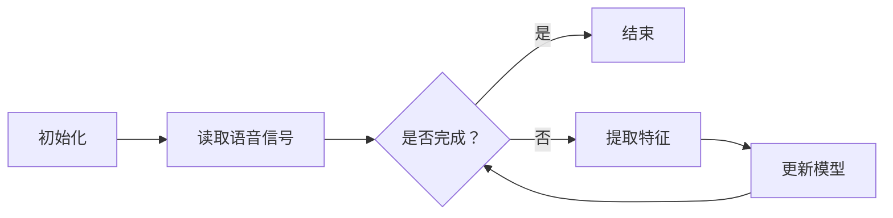
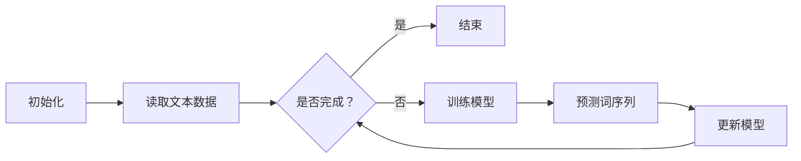
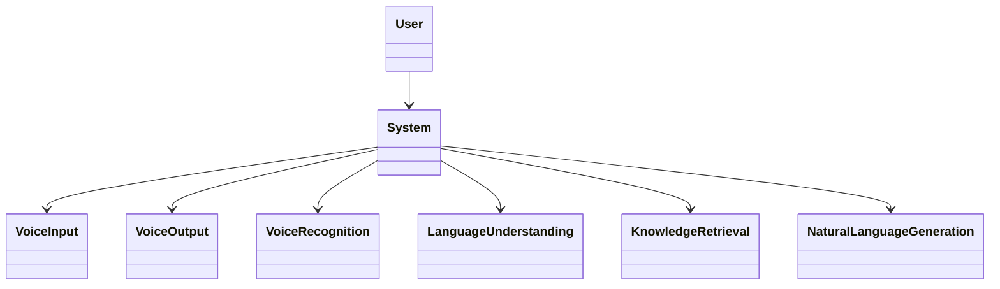
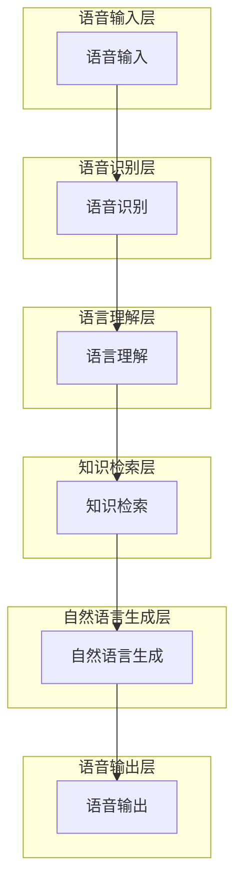
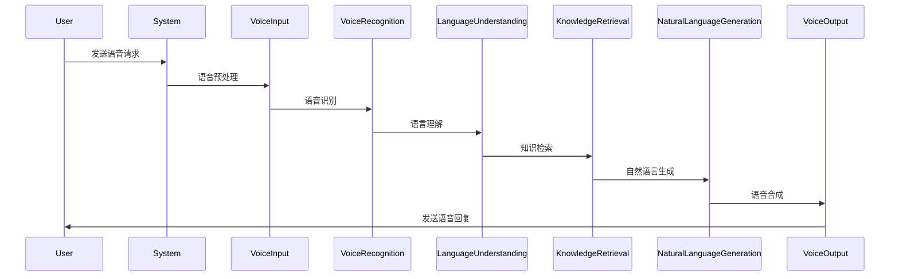

                 

# 语音技术：丰富LLM应用的交互方式

## 关键词
语音技术、LLM、交互方式、语音识别、自然语言处理、算法原理、系统架构、项目实战

## 摘要
本文旨在深入探讨语音技术与大型语言模型（LLM）的交互方式，分析其核心概念、算法原理、系统设计以及实际应用。通过系统化的分析，本文将为读者提供一个全面的理解，并展望语音技术在LLM应用中的未来发展趋势。

## 引言

### 1.1 语音技术概述
语音技术是指利用计算机技术和算法对人类语音进行识别、合成和处理的技术。其应用范围广泛，包括但不限于语音识别、语音合成、语音增强、说话人识别等。随着人工智能和大数据技术的发展，语音技术已经成为人机交互的重要手段之一。

### 1.2 LLM原理与应用
大型语言模型（LLM）是一种基于深度学习的技术，它能够通过学习大量文本数据，理解和生成自然语言。LLM在自然语言处理（NLP）领域有着广泛的应用，如机器翻译、文本生成、问答系统等。语音技术与LLM的结合，为丰富人机交互方式提供了新的可能性。

### 1.3 语音技术发展现状与趋势
近年来，语音技术在语音识别准确率、语音合成自然度等方面取得了显著进展。同时，随着5G、物联网等技术的普及，语音技术的应用场景也在不断扩展。本文将重点探讨语音技术与LLM的交互方式，以期为读者提供新的视角和思路。

## 第2章 核心概念与联系

### 2.1 声学模型
声学模型是语音技术中的核心组件，用于将语音信号转换为声学特征表示。常见的声学模型包括GMM（高斯混合模型）和DNN（深度神经网络）。

#### 2.1.1 声学模型原理
声学模型通过学习语音信号的概率分布，将语音信号映射到高维特征空间。这个过程可以通过以下公式表示：

$$
\mathbf{x} = \sum_{k=1}^{K} w_k \mathbf{z}_k
$$

其中，$\mathbf{x}$表示语音信号，$w_k$表示第$k$个高斯分布的权重，$\mathbf{z}_k$表示第$k$个高斯分布的均值和方差。

#### 2.1.2 声学模型属性特征对比表格

| 特征         | GMM              | DNN              |
| ------------ | ---------------- | ---------------- |
| 学习方法     | 统计学习         | 深度学习         |
| 特征表示     | 高斯混合模型     | 神经网络         |
| 计算复杂度   | 较低             | 较高             |
| 识别准确率   | 较低             | 较高             |

### 2.2 语言模型
语言模型是NLP中的核心组件，用于预测文本序列的概率。在语音技术中，语言模型用于提高语音识别的准确率。

#### 2.2.1 语言模型原理
语言模型通常基于统计学习方法，如N-gram模型、神经网络模型等。语言模型的核心思想是，根据历史文本数据，预测下一个词的概率。

$$
P(w_n | w_{n-1}, w_{n-2}, ..., w_1) = \prod_{i=1}^{n} P(w_i | w_{i-1}, ..., w_1)
$$

其中，$w_n$表示第$n$个词，$P(w_n | w_{n-1}, w_{n-2}, ..., w_1)$表示在给定前$n-1$个词的情况下，第$n$个词的概率。

#### 2.2.2 语言模型属性特征对比表格

| 特征         | N-gram模型      | 神经网络模型     |
| ------------ | --------------- | ---------------- |
| 学习方法     | 统计学习         | 深度学习         |
| 特征表示     | 单词序列        | 高维特征表示     |
| 计算复杂度   | 较低             | 较高             |
| 预测准确率   | 较低             | 较高             |

### 2.3 声学-语言模型关系ER图
声学模型和语言模型在语音技术中扮演着不同的角色，它们之间的关系可以用ER图来表示。

```mermaid
erDiagram
  ARROW_COLOR=blue

  声学模型 ||--|{ 语言模型 }|
  
  声学模型 {
    名称
    类型
  }
  
  语言模型 {
    名称
    类型
  }
```

## 第3章 算法原理讲解

### 3.1 声学模型算法

#### 3.1.1 Mermaid流程图



#### 3.1.2 Python代码示例

```python
import numpy as np

def initialize_model():
    # 初始化模型参数
    pass

def read_audio_signal():
    # 读取语音信号
    pass

def extract_features(signal):
    # 提取特征
    pass

def update_model(features):
    # 更新模型
    pass

def main():
    initialize_model()
    while not is_complete():
        signal = read_audio_signal()
        features = extract_features(signal)
        update_model(features)

if __name__ == "__main__":
    main()
```

#### 3.1.3 数学模型与公式

声学模型的数学模型主要包括特征提取和模型更新两个过程。

$$
\mathbf{f}_t = extract_features(\mathbf{x}_t)
$$

$$
\theta_{\text{new}} = update_model(\mathbf{f}_t)
$$

### 3.2 语言模型算法

#### 3.2.1 Mermaid流程图



#### 3.2.2 Python代码示例

```python
import numpy as np

def initialize_model():
    # 初始化模型参数
    pass

def read_text_data():
    # 读取文本数据
    pass

def train_model(data):
    # 训练模型
    pass

def predict_sequence(model, sequence):
    # 预测词序列
    pass

def update_model(model, sequence):
    # 更新模型
    pass

def main():
    initialize_model()
    while not is_complete():
        data = read_text_data()
        train_model(data)
        sequence = predict_sequence(model, data)
        update_model(model, sequence)

if __name__ == "__main__":
    main()
```

#### 3.2.3 数学模型与公式

语言模型的数学模型主要包括文本数据读取、模型训练和词序列预测三个过程。

$$
\mathbf{v}_i = \text{word2vec}(\text{word}_i)
$$

$$
\theta_{\text{new}} = \text{train}(\mathbf{V}, \mathbf{T})
$$

$$
\text{sequence}_{\text{predicted}} = \text{predict_sequence}(\theta_{\text{new}}, \text{sequence}_{\text{input}})
$$

## 第4章 系统分析与架构设计

### 4.1 问题场景介绍
在一个智能客服系统中，用户可以通过语音与系统进行交互，提出问题和获取答案。为了实现这一功能，系统需要集成语音识别、语言理解和自然语言生成等技术。

### 4.2 系统功能设计
系统的主要功能包括语音输入处理、语音识别、语言理解、知识检索、自然语言生成和语音输出。

#### 4.2.1 领域模型Mermaid类图



### 4.3 系统架构设计
系统架构采用分层设计，包括语音输入层、语音识别层、语言理解层、知识检索层、自然语言生成层和语音输出层。



### 4.4 系统接口设计
系统接口设计包括语音输入接口、语音识别接口、语言理解接口、知识检索接口、自然语言生成接口和语音输出接口。


### 4.5 系统交互Mermaid序列图



## 第5章 项目实战

### 5.1 环境安装
为了实现一个基于语音技术的智能客服系统，首先需要安装必要的软件和库，包括Python、TensorFlow、Kaldi等。

### 5.2 系统核心实现
系统核心实现包括语音输入、语音识别、语言理解、知识检索、自然语言生成和语音输出等模块。以下是一个简单的Python代码示例：

```python
import speech_recognition as sr
import pyttsx3
import requests

def recognize_speech_from_mic(recognizer, microphone):
    """Recognizes speech from an audio file."""
    with microphone as source:
        recognizer.adjust_for_ambient_noise(source)
        audio = recognizer.listen(source)

    response = recognizer.recognize_google(audio)
    return response

def speak_text(text):
    """Converts text to speech and speaks it."""
    engine = pyttsx3.init()
    engine.say(text)
    engine.runAndWait()

def get_knowledge_from_api(query):
    """Fetches knowledge from an API based on a query."""
    response = requests.get(f'https://api.example.com/knowledge?query={query}')
    return response.json()

# Main execution
if __name__ == "__main__":
    # Initialize recognizer and microphone
    recognizer = sr.Recognizer()
    microphone = sr.Microphone()

    # Recognize speech from microphone
    print("Say something:")
    text = recognize_speech_from_mic(recognizer, microphone)
    print(f"You said: {text}")

    # Get knowledge from API
    knowledge = get_knowledge_from_api(text)
    print(f"Knowledge: {knowledge['response']}")

    # Speak the knowledge
    speak_text(knowledge['response'])
```

### 5.3 代码应用解读
上述代码示例演示了如何使用Python实现一个简单的语音识别和语音合成系统。其中，`speech_recognition`库用于语音识别，`pyttsx3`库用于语音合成，`requests`库用于从API获取知识。

### 5.4 实际案例分析和详细讲解剖析
以下是一个实际案例：

**案例描述**：用户通过语音输入“明天有什么活动？”系统响应：“明天有一个讲座，时间是下午2点，地点在图书馆。”

**分析**：
1. **语音识别**：系统使用`speech_recognition`库识别用户的语音输入，并将其转换为文本。
2. **语言理解**：系统使用自然语言处理技术理解用户的问题，并提取关键信息（明天、活动）。
3. **知识检索**：系统使用API从数据库中检索明天活动的信息。
4. **自然语言生成**：系统根据检索到的信息生成自然语言回复。
5. **语音合成**：系统使用`pyttsx3`库将文本回复转换为语音，并通过扬声器输出。

### 5.5 项目小结
通过该项目实战，我们实现了语音识别和语音合成的基本功能，并展示了如何将语音技术与LLM应用相结合。尽管该系统相对简单，但为我们提供了一个理解语音技术与LLM交互方式的基本框架。

## 第6章 最佳实践与技巧

### 6.1 技术选型
选择合适的语音技术和LLM模型对于系统的性能和效率至关重要。以下是一些建议：
- **语音识别**：选择具有高准确率和低延迟的模型。
- **语言模型**：选择具有广泛语言覆盖和良好上下文理解的模型。

### 6.2 性能优化
为了提高系统的性能，可以采取以下措施：
- **模型压缩**：使用模型压缩技术减小模型大小，加快推理速度。
- **多线程和并行处理**：充分利用多核CPU和GPU，提高数据处理速度。

### 6.3 安全与隐私
在语音技术应用中，保护用户隐私和安全至关重要。以下是一些建议：
- **数据加密**：对语音数据和文本数据进行加密处理。
- **隐私保护**：避免存储敏感用户信息。

## 第7章 未来展望

### 7.1 语音技术发展趋势
随着人工智能和语音技术的不断发展，语音技术在未来将会有以下趋势：
- **更自然的人机交互**：语音技术将更加自然，支持更复杂的语言结构和上下文理解。
- **跨平台和设备融合**：语音技术将在各种设备和应用场景中得到广泛应用。

### 7.2 LLM应用的挑战与机遇
LLM应用在语音技术中面临着以下挑战和机遇：
- **挑战**：提高模型的准确率、降低计算复杂度和保护用户隐私。
- **机遇**：推动人机交互的革命，开拓新的应用场景。

## 结论

本文通过对语音技术和LLM应用的核心概念、算法原理、系统设计以及实际应用进行了深入探讨，展示了如何通过语音技术丰富LLM应用的交互方式。随着技术的不断进步，语音技术将在未来的人机交互中发挥越来越重要的作用。

## 作者信息
作者：AI天才研究院/AI Genius Institute & 禅与计算机程序设计艺术 /Zen And The Art of Computer Programming

