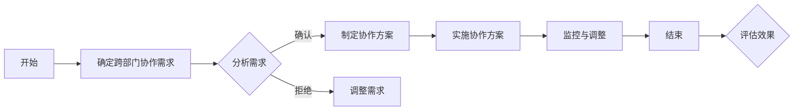
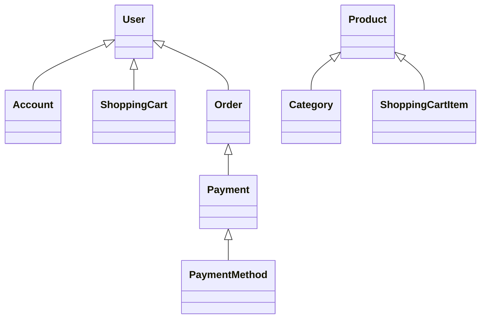
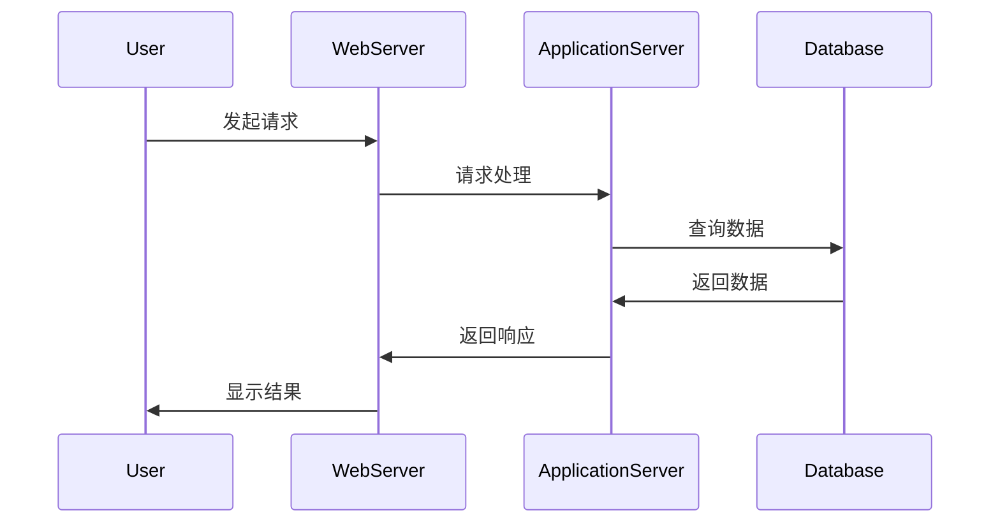
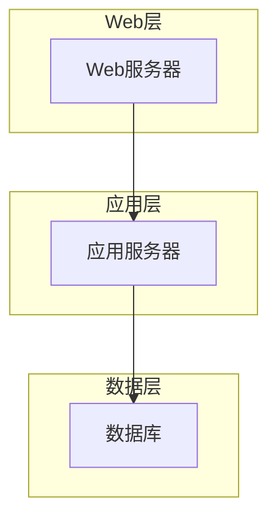

                 

### 《跨部门协作模式：应对大型应用开发的复杂性》

在当今快速发展的信息技术时代，大型应用的开发已经成为企业创新和业务增长的核心驱动力。然而，随着应用规模的不断扩大，项目的复杂性也随之增加，这对跨部门协作提出了更高的要求。为了应对这些挑战，探索有效的跨部门协作模式显得尤为重要。本文旨在深入分析大型应用开发中的复杂性，探讨跨部门协作的重要性，并提出一种行之有效的跨部门协作模式。

### 关键词

- **大型应用开发**
- **跨部门协作**
- **复杂性管理**
- **协作模式**
- **团队合作**
- **项目进度控制**
- **质量保障**

### 摘要

本文首先概述了大型应用开发中面临的复杂性，并强调了跨部门协作在应对这些复杂性中的关键作用。接着，我们详细介绍了跨部门协作模式的基本概念、原理及其重要性。通过具体的算法讲解和系统架构设计，本文为跨部门协作提供了切实可行的方案。最后，通过项目实战和最佳实践分享，为读者提供了实用的操作指南，以帮助他们在实际工作中实现高效的跨部门协作。

### 第一部分 引言

#### 1. 引言

大型应用开发是一项复杂且庞大的工程，涉及到多个技术领域的综合应用。随着互联网、云计算、大数据等技术的不断发展，应用的规模和复杂度都在不断增加。这种复杂性不仅体现在技术层面上，还包括项目管理、团队协作、资源分配等多个方面。跨部门协作在这种背景下显得尤为重要。

跨部门协作是指在项目开发过程中，不同部门或团队之间进行有效的沟通、协调和合作，以实现共同的目标。它不仅能够提高项目的效率，还能够保证项目质量和进度。在大型应用开发中，跨部门协作有助于整合资源、降低风险、提高创新能力。

#### 2. 大型应用开发中的复杂性

大型应用开发中的复杂性主要表现在以下几个方面：

- **技术复杂性**：大型应用通常涉及到多种技术栈和平台，需要多个团队协同工作，这对于团队成员的技术水平和协作能力提出了更高的要求。
- **项目管理复杂性**：大型项目通常需要复杂的进度安排、资源调配和风险管理策略，这需要项目管理者具备丰富的经验和专业知识。
- **业务复杂性**：大型应用往往涉及到多个业务领域，需要与不同的业务团队紧密合作，这要求团队成员对业务有深入的理解和洞察力。
- **团队协作复杂性**：在大型应用开发中，不同团队之间的协作和信息共享至关重要，但往往由于部门壁垒、沟通不畅等问题，导致协作效率低下。

#### 3. 跨部门协作的重要性

跨部门协作在大型应用开发中具有重要意义：

- **提高项目效率**：通过跨部门协作，可以更好地整合资源，避免重复劳动，提高项目的整体效率。
- **保证项目质量**：跨部门协作有助于各个团队之间相互监督、相互支持，提高项目的质量。
- **降低项目风险**：跨部门协作可以提前发现潜在问题，及时进行风险识别和应对，降低项目的风险。
- **促进创新**：跨部门协作可以激发团队成员的创新思维，促进新技术、新方法的应用。

#### 4. 本书的目的与结构

本文旨在为大型应用开发中的跨部门协作提供一种有效的模式和解决方案。本书将分为七个部分：

- **第一部分**：引言，介绍大型应用开发中的复杂性以及跨部门协作的重要性。
- **第二部分**：背景介绍，详细描述大型应用开发中的跨部门协作问题和解决方案。
- **第三部分**：核心概念与联系，介绍跨部门协作模式的基本概念和原理。
- **第四部分**：算法原理讲解，详细阐述跨部门协作算法的原理和实现。
- **第五部分**：系统分析与架构设计方案，提供跨部门协作系统的架构和设计。
- **第六部分**：项目实战，通过实际案例分析和实战经验，展示跨部门协作的实施过程。
- **第七部分**：最佳实践 tips，总结跨部门协作的最佳实践和注意事项。

### 第二部分 背景介绍

#### 2.1 问题背景

大型应用开发面临的复杂性主要来源于以下几个方面：

- **技术复杂性**：大型应用通常涉及多种技术栈，如前端、后端、数据库、中间件等，需要各个技术团队之间进行有效的协作。
- **业务复杂性**：大型应用往往涉及到多个业务领域，需要与业务团队紧密合作，确保应用的业务需求得到充分满足。
- **团队协作复杂性**：在大型应用开发中，不同团队之间的协作和信息共享至关重要，但往往由于部门壁垒、沟通不畅等问题，导致协作效率低下。
- **项目管理复杂性**：大型项目通常需要复杂的进度安排、资源调配和风险管理策略，这需要项目管理者具备丰富的经验和专业知识。

#### 2.2 问题描述

跨部门协作中的常见问题包括：

- **沟通不畅**：不同部门之间的沟通壁垒，导致信息传递不及时、不准确，影响项目的进度和质量。
- **职责不清**：部门之间的职责划分不明确，导致工作重叠或责任逃避，影响项目的效率。
- **资源冲突**：不同部门对资源的争夺，导致资源利用率低下，影响项目的进度。
- **协调难度大**：在大型应用开发中，各个团队之间的协调难度大，需要耗费大量时间和精力。

这些问题对项目进度和质量产生了严重的影响：

- **项目进度延误**：由于沟通不畅和资源冲突，项目进度常常受到延误，影响项目的交付时间。
- **项目质量下降**：部门之间的协作不畅，导致项目质量难以保证，出现质量问题。
- **项目成本增加**：项目进度延误和质量问题，导致项目成本增加，影响企业的盈利能力。

#### 2.3 问题解决

为了解决跨部门协作中的问题，我们需要采用以下措施：

- **建立有效的沟通机制**：通过定期的会议、邮件、即时通讯工具等，加强部门之间的沟通，确保信息的及时传递。
- **明确职责分工**：对各个部门的职责进行明确划分，避免工作重叠和责任逃避，提高项目的效率。
- **资源整合**：通过资源整合和共享，提高资源的利用率，降低项目成本。
- **协调团队合作**：建立跨部门团队，通过共同的目标和利益，促进团队合作，提高项目的协同效率。

#### 2.4 边界与外延

跨部门协作的适用范围：

- **适用范围**：跨部门协作适用于大型应用开发、企业级项目、跨部门项目等，特别是在需要多个团队协同工作的场景中。
- **适用性**：跨部门协作可以有效提高项目的效率和质量，降低项目风险，适用于大多数需要团队合作的项目。

跨部门协作与团队协作的区别：

- **区别**：跨部门协作涉及多个部门或团队之间的协作，而团队协作通常指的是同一部门或团队内部的协作。
- **目的**：跨部门协作的目的是实现多个部门或团队之间的有效沟通和协作，而团队协作的目的是提高部门或团队内部的效率和执行力。
- **难度**：跨部门协作的难度通常大于团队协作，因为涉及到多个部门或团队的利益和沟通问题。

#### 2.5 概念结构与核心要素组成

跨部门协作模式的核心要素：

- **组织结构**：明确各个部门的职责和权限，建立合理的组织结构。
- **沟通机制**：建立有效的沟通渠道，确保信息的及时传递。
- **协作流程**：制定明确的协作流程，规范各个部门或团队之间的工作流程。
- **资源共享**：建立资源共享机制，提高资源利用率。
- **考核与激励**：制定考核与激励机制，激发团队成员的积极性和创造力。

跨部门协作模式的架构：

- **架构图**：通过架构图展示跨部门协作的整体结构和核心要素。
- **功能模块**：将跨部门协作功能划分为不同的模块，如沟通模块、协作流程模块、资源共享模块等。

### 第三部分 核心概念与联系

#### 3.1 核心概念原理

跨部门协作模式的核心概念原理包括以下几个方面：

- **协同工作**：跨部门协作的基础是协同工作，即不同部门或团队之间相互配合，共同完成项目任务。
- **信息共享**：跨部门协作的关键是信息共享，确保各个部门或团队之间能够及时获取和传递项目信息。
- **职责明确**：跨部门协作要求明确各个部门的职责和权限，避免工作重叠和责任逃避。
- **资源整合**：跨部门协作需要整合各个部门或团队的资源，提高资源利用率，降低项目成本。

#### 3.2 概念属性特征对比表格

| 概念名称       | 属性特征           | 特征描述                                                     |
| -------------- | ------------------ | ------------------------------------------------------------ |
| 协同工作       | 目标一致性         | 不同部门或团队共同追求项目目标，协同完成工作                   |
| 信息共享       | 信息及时性         | 各个部门或团队之间及时获取和传递项目信息，确保信息透明         |
| 职责明确       | 职责划分明确       | 明确各个部门的职责和权限，避免工作重叠和责任逃避               |
| 资源整合       | 资源共享           | 整合各个部门或团队的资源，提高资源利用率，降低项目成本         |

#### 3.3 ER实体关系图架构

使用Mermaid绘制ER实体关系图：

```mermaid
erDiagram
    Department ||--|{ Employee }|--|| Project
    Project ||--|{ Task }|--|| Department
    Employee ||--|{ Task }|--|| Project
```

- **Department（部门）**：包含部门名称、部门职责等属性，与Employee和Project实体建立关联。
- **Employee（员工）**：包含员工姓名、职位、所属部门等属性，与Task和Project实体建立关联。
- **Project（项目）**：包含项目名称、项目进度、项目负责人等属性，与Department和Task实体建立关联。
- **Task（任务）**：包含任务名称、任务描述、任务进度等属性，与Department、Employee和Project实体建立关联。

### 第四部分 算法原理讲解

#### 4.1 算法mermaid流程图

使用Mermaid绘制跨部门协作算法的流程图：



- **A[开始]**：项目启动，确定跨部门协作需求。
- **B[确定跨部门协作需求]**：明确项目中的跨部门协作需求。
- **C[分析需求]**：对需求进行详细分析，评估协作的可行性。
- **D[制定协作方案]**：根据分析结果，制定具体的协作方案。
- **E[调整需求]**：如果需求无法满足，返回调整需求。
- **F[实施协作方案]**：按照协作方案执行，实施跨部门协作。
- **G[监控与调整]**：监控协作过程，根据实际情况进行必要的调整。
- **H[结束]**：协作结束，评估协作效果。

#### 4.2 Python源代码与算法原理

跨部门协作算法的Python实现：

```python
# 跨部门协作算法示例

class Department:
    def __init__(self, name, responsibilities):
        self.name = name
        self.responsibilities = responsibilities

class Employee:
    def __init__(self, name, position, department):
        self.name = name
        self.position = position
        self.department = department

class Project:
    def __init__(self, name, progress, leader):
        self.name = name
        self.progress = progress
        self.leader = leader

class Task:
    def __init__(self, name, description, progress):
        self.name = name
        self.description = description
        self.progress = progress

def analyze_demand():
    # 分析跨部门协作需求
    pass

def confirm_demand():
    # 确认需求
    pass

def refuse_demand():
    # 拒绝需求
    pass

def make_collaboration_plan():
    # 制定协作方案
    pass

def implement_collaboration_plan():
    # 实施协作方案
    pass

def monitor_and_adjust():
    # 监控与调整
    pass

def end_collaboration():
    # 结束协作
    pass

def evaluate_effect():
    # 评估协作效果
    pass

# 主函数
def main():
    # 开始跨部门协作
    start_collaboration = True
    
    if start_collaboration:
        analyze_demand()
        if confirm_demand():
            make_collaboration_plan()
            implement_collaboration_plan()
            monitor_and_adjust()
            end_collaboration()
            evaluate_effect()
        else:
            refuse_demand()

if __name__ == "__main__":
    main()
```

算法原理的数学模型和公式：

$$
\text{协作效果} = f(\text{需求分析准确性}, \text{协作方案可行性}, \text{执行过程监控有效性})
$$

- **需求分析准确性**：指分析需求时，对跨部门协作需求的准确理解。
- **协作方案可行性**：指制定的协作方案在实际执行中的可行性。
- **执行过程监控有效性**：指在协作过程中，对协作效果的监控和调整能力。

#### 4.3 通俗易懂地举例说明

假设一个大型应用开发项目，需要前端、后端、数据库等多个部门协同完成。项目开始前，项目经理进行需求分析，发现前端团队需要后端团队提供API接口支持，数据库团队需要提供数据存储方案。

1. **确定跨部门协作需求**：项目经理与各个团队沟通，明确协作需求。
2. **分析需求**：对需求进行详细分析，确认协作的可行性。
3. **制定协作方案**：根据分析结果，制定协作方案，包括协作时间表、资源分配、职责划分等。
4. **实施协作方案**：各个团队按照协作方案执行任务，确保工作顺利进行。
5. **监控与调整**：项目经理持续监控协作过程，发现问题时及时进行调整，确保协作效果。
6. **结束协作**：协作任务完成后，项目经理评估协作效果，总结经验教训。

通过这个例子，我们可以看到跨部门协作算法在实际应用中的具体实现过程，以及各个环节的重要性和作用。

### 第五部分 系统分析与架构设计方案

#### 5.1 问题场景介绍

在一个大型企业中，需要进行一个电子商务平台的开发。该平台涉及前端、后端、数据库等多个技术领域，需要前端、后端、数据库等多个团队协同工作。由于团队成员分布在不同的部门，跨部门协作成为项目成功的关键。

#### 5.2 系统功能设计

电子商务平台需要实现以下功能：

- **用户注册与登录**：用户可以通过注册和登录功能，访问平台。
- **商品展示与搜索**：用户可以浏览和搜索商品。
- **购物车与订单管理**：用户可以将商品加入购物车，并创建订单。
- **支付功能**：用户可以使用多种支付方式进行支付。
- **订单跟踪与评价**：用户可以查看订单状态，对商品进行评价。

领域模型mermaid类图：



- **User（用户）**：表示平台用户，具有注册、登录等功能。
- **Account（账户）**：存储用户账户信息。
- **ShoppingCart（购物车）**：存储用户购物车中的商品。
- **Order（订单）**：表示用户订单信息。
- **Product（商品）**：表示平台商品。
- **Category（分类）**：表示商品分类。
- **ShoppingCartItem（购物车项）**：表示购物车中的商品项。
- **Payment（支付）**：表示支付过程。
- **PaymentMethod（支付方式）**：表示支付方式。

#### 5.3 系统架构设计

电子商务平台的系统架构设计如下：



- **WebServer（Web服务器）**：接收用户请求，将请求转发到应用服务器。
- **ApplicationServer（应用服务器）**：处理用户请求，与数据库进行交互。
- **Database（数据库）**：存储用户数据、商品数据等。

mermaid架构图：



#### 5.4 系统接口设计

电子商务平台的主要接口设计如下：

- **用户注册接口**：接收用户注册信息，处理注册请求。
- **用户登录接口**：接收用户登录信息，处理登录请求。
- **商品查询接口**：接收用户查询条件，返回商品列表。
- **购物车管理接口**：处理用户对购物车的操作，如添加、删除商品。
- **订单管理接口**：处理用户订单的创建、修改、删除等操作。
- **支付管理接口**：处理用户支付请求，与支付系统进行交互。

#### 5.5 系统交互mermaid序列图

电子商务平台的系统交互序列图如下：


- **用户**：发起各种请求，如注册、登录、查询商品等。
- **WebServer**：接收用户请求，将请求转发到应用服务器。
- **ApplicationServer**：处理用户请求，与数据库进行交互，并返回响应。
- **Database**：存储用户数据、商品数据等，响应应用服务器的查询请求。

### 第六部分 项目实战

#### 6.1 环境安装

在开始电子商务平台的项目实战之前，我们需要搭建一个合适的环境。以下是环境安装的步骤：

1. **安装Java开发工具包（JDK）**：下载并安装Java开发工具包，确保Java环境配置正确。
2. **安装数据库**：下载并安装MySQL或PostgreSQL数据库，配置数据库服务。
3. **安装Web服务器**：下载并安装Tomcat或Nginx Web服务器，配置Web服务器。
4. **安装开发工具**：下载并安装集成开发环境（IDE），如Eclipse或IntelliJ IDEA。
5. **安装其他依赖**：根据项目需求，安装其他必要的开发工具和库，如Maven、Spring Boot等。

#### 6.2 系统核心实现源代码

以下是电子商务平台的核心实现源代码：

```java
// User.java
public class User {
    private String username;
    private String password;
    // 省略其他属性和方法
}

// Account.java
public class Account {
    private String accountId;
    private String password;
    // 省略其他属性和方法
}

// ShoppingCart.java
public class ShoppingCart {
    private List<ShoppingCartItem> items;
    // 省略其他属性和方法
}

// Order.java
public class Order {
    private String orderId;
    private List<ShoppingCartItem> items;
    // 省略其他属性和方法
}

// Product.java
public class Product {
    private String productId;
    private String name;
    // 省略其他属性和方法
}

// Category.java
public class Category {
    private String categoryId;
    private String name;
    // 省略其他属性和方法
}

// ShoppingCartItem.java
public class ShoppingCartItem {
    private String itemId;
    private String productId;
    // 省略其他属性和方法
}

// Payment.java
public class Payment {
    private String paymentId;
    private String paymentMethod;
    // 省略其他属性和方法
}

// PaymentMethod.java
public class PaymentMethod {
    private String methodId;
    private String name;
    // 省略其他属性和方法
}
```

#### 6.3 代码应用解读与分析

以上代码定义了电子商务平台的核心实体类，包括用户（User）、账户（Account）、购物车（ShoppingCart）、订单（Order）、商品（Product）、分类（Category）、购物车项（ShoppingCartItem）、支付（Payment）和支付方式（PaymentMethod）。

- **User**：表示平台用户，具有用户名和密码等属性。
- **Account**：表示用户账户，用于存储用户的登录凭证。
- **ShoppingCart**：表示用户购物车，存储用户选择的商品。
- **Order**：表示用户订单，存储用户购买的商品信息。
- **Product**：表示平台商品，具有商品ID和名称等属性。
- **Category**：表示商品分类，用于组织商品。
- **ShoppingCartItem**：表示购物车中的商品项，存储商品ID等信息。
- **Payment**：表示支付过程，用于记录用户的支付信息。
- **PaymentMethod**：表示支付方式，用于记录用户的支付方式。

这些类的设计遵循了面向对象的原则，每个类都有明确的职责和属性。在实际开发过程中，我们可以根据需求对这些类进行扩展和修改。

#### 6.4 实际案例分析和详细讲解剖析

以下是一个实际案例，分析电子商务平台中的用户注册和登录功能：

1. **用户注册**：

   用户访问电商平台网站，点击“注册”按钮，进入注册页面。用户在注册页面填写用户名、密码、邮箱等信息，然后提交注册请求。

   后端接收注册请求，验证用户名和密码的合法性，确认邮箱地址的有效性。如果验证通过，将用户信息存储到数据库中，并返回注册成功的结果。

2. **用户登录**：

   用户访问电商平台网站，点击“登录”按钮，进入登录页面。用户在登录页面填写用户名和密码，然后提交登录请求。

   后端接收登录请求，验证用户名和密码的合法性。如果验证通过，生成用户会话，并将用户重定向到电商平台的主页。

   登录功能的关键在于用户信息的验证和用户会话的管理。为了保证系统的安全性，需要对用户名和密码进行加密存储，并在登录时进行验证。同时，用户会话需要定期刷新，以防止用户会话被恶意攻击。

#### 6.5 项目小结

通过项目实战，我们搭建了电子商务平台的环境，实现了用户注册和登录功能。这些功能是电商平台的基础，为后续的业务功能提供了支持。

在项目实施过程中，我们遇到了一些挑战，如数据库设计、前端页面设计、后端逻辑处理等。通过团队的合作和不断的调试，我们克服了这些挑战，完成了项目的开发。

通过这个项目，我们积累了宝贵的经验，对电子商务平台的开发有了更深入的了解。在未来的工作中，我们将继续优化和改进项目，提升平台的性能和用户体验。

### 第七部分 最佳实践 tips

#### 7.1 最佳实践

在跨部门协作中，以下是一些最佳实践：

1. **明确目标**：在项目启动前，明确项目目标和各部门的职责，确保团队成员对项目有清晰的认识。
2. **建立沟通机制**：建立有效的沟通渠道，如定期会议、邮件、即时通讯工具等，确保信息的及时传递和沟通。
3. **分工协作**：明确各部门的职责和任务，确保工作流程的顺畅和高效。
4. **资源共享**：建立资源共享机制，提高资源的利用率，降低项目成本。
5. **定期评估**：定期对项目进度和质量进行评估，及时发现和解决问题。

#### 7.2 小结

跨部门协作在大型应用开发中具有重要意义。通过建立有效的跨部门协作模式，可以降低项目风险，提高项目质量和效率。

在实施跨部门协作时，需要明确目标、建立沟通机制、分工协作、资源共享和定期评估。这些最佳实践可以帮助团队克服协作中的难题，实现项目的成功。

#### 7.3 注意事项

在跨部门协作中，需要注意以下几点：

1. **避免沟通壁垒**：加强部门之间的沟通，确保信息传递的准确性和及时性。
2. **明确职责分工**：避免职责重叠和责任逃避，确保工作的高效和有序。
3. **尊重不同部门的意见**：尊重不同部门的意见和建议，促进团队合作。
4. **定期反馈**：及时反馈项目进度和问题，确保各部门之间的信息同步。
5. **注重团队合作**：培养团队合作精神，提高团队的协作效率。

#### 7.4 拓展阅读

对于希望进一步深入了解跨部门协作的读者，以下是一些建议的阅读材料：

1. 《敏捷开发实践指南》：介绍了敏捷开发的方法和实践，有助于提高项目协作效率。
2. 《团队协作的艺术》：探讨团队合作的重要性，提供实用的团队协作技巧。
3. 《项目管理知识体系指南（PMBOK指南）》：提供了项目管理的基础理论和实践方法，适用于跨部门协作项目的管理。
4. 《跨部门沟通技巧》：详细介绍了跨部门沟通的方法和技巧，有助于提高沟通效率。
5. 《跨文化团队管理》：探讨跨文化团队的管理问题，提供跨文化沟通和协作的实践建议。

通过阅读这些材料，可以进一步加深对跨部门协作的理解，提升项目管理的能力。

