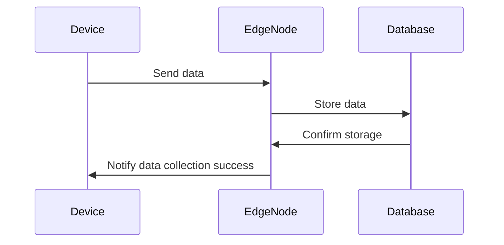
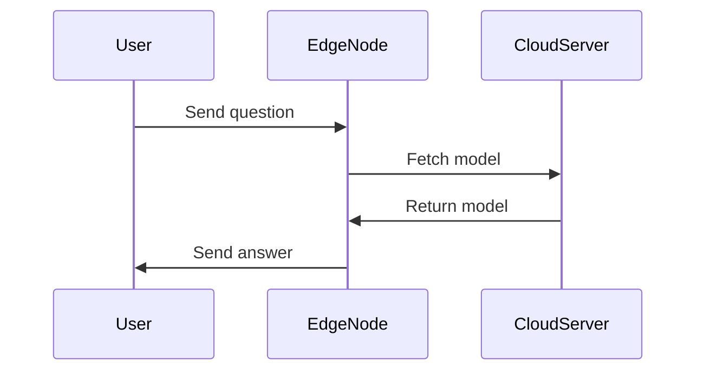

                 


### 边缘计算：降低LLM应用的延迟

#### 关键词

边缘计算，低延迟，大型语言模型（LLM），应用优化，网络延迟降低策略

#### 摘要

本文将探讨边缘计算在降低大型语言模型（LLM）应用延迟方面的作用。边缘计算作为一种分布式计算模式，通过在数据生成源头附近处理数据，显著减少了传输距离，从而降低了网络延迟。本文将详细介绍边缘计算的基本概念、架构设计、关键技术，并分析其在智能交通、智能制造、智能家居和健康医疗等领域的应用，最后提出降低LLM应用延迟的具体策略和未来发展趋势。

#### 第一部分：边缘计算概述

##### 第1章：边缘计算背景介绍

###### 1.1 边缘计算的概念与发展历程

边缘计算（Edge Computing）是一种分布式计算模式，旨在将数据处理、存储和应用程序推向网络的边缘，即靠近数据源或用户的位置。与传统的云计算模式不同，边缘计算强调在本地或接近用户的地方处理数据，从而减少数据传输的延迟。

边缘计算的发展历程可以追溯到互联网的早期阶段。随着物联网（IoT）和5G技术的发展，边缘计算逐渐成为一种重要的计算模式。2015年，Gartner将边缘计算列为新兴技术趋势，标志着边缘计算正式进入公众视野。

###### 1.2 边缘计算的核心挑战与机会

边缘计算面临着一系列核心挑战，包括数据管理、计算能力优化、网络延迟优化和安全性与隐私保护。同时，这些挑战也带来了巨大的机会。例如，在智能交通领域，边缘计算可以实时处理大量车辆数据，优化交通流量，减少拥堵。

###### 1.3 边缘计算与传统云计算的差异

边缘计算与传统云计算在架构、技术特点和应用场景上存在显著差异。传统云计算依赖集中式数据中心，而边缘计算则将计算和存储分布在网络边缘。此外，边缘计算更注重实时性和低延迟，而云计算则更关注数据处理能力和存储容量。

###### 1.4 边缘计算的关键技术

边缘计算涉及多个关键技术，包括边缘计算架构设计、数据管理、计算能力优化、网络延迟优化和安全性与隐私保护。这些技术共同构成了边缘计算的基础。

##### 第2章：边缘计算架构与系统设计

###### 2.1 边缘计算架构设计原则

边缘计算架构设计应遵循一系列原则，如可扩展性、灵活性、可靠性和安全性。这些原则有助于确保边缘计算系统的高效性和稳定性。

###### 2.2 边缘计算节点架构

边缘计算节点是边缘计算系统中的核心组件，包括硬件和软件架构。节点负责处理本地数据，并提供计算、存储和网络服务。

###### 2.3 边缘计算网络架构

边缘计算网络包括边缘节点之间的通信网络和边缘节点与云端的数据传输网络。网络架构的设计直接影响边缘计算的性能和可靠性。

###### 2.4 边缘计算平台架构

边缘计算平台是一个集成环境，提供数据处理、存储、计算和网络管理等模块。平台架构的设计应充分考虑边缘计算的特殊需求，如低延迟和高可靠性。

##### 第3章：边缘计算关键技术研究

###### 3.1 边缘计算中的数据管理

边缘计算中的数据管理涉及数据收集、存储、处理和分析。数据管理策略应充分考虑数据的安全性和隐私保护。

###### 3.2 边缘计算中的计算能力优化

边缘计算中的计算能力优化旨在提高边缘节点的处理能力，以满足实时数据处理的需

----------------------------------------------------------------

#### 第一部分：边缘计算概述

##### 第1章：边缘计算背景介绍

###### 1.1 边缘计算的概念与发展历程

边缘计算是一种将数据处理、存储和应用程序推向网络边缘的分布式计算模式。它旨在减少数据在传输过程中的延迟，提高系统的实时性和响应速度。边缘计算的概念最早可以追溯到互联网的早期阶段，但随着物联网（IoT）、5G和人工智能（AI）技术的发展，边缘计算逐渐成为了一种重要的计算模式。

边缘计算的发展历程可以分为以下几个阶段：

1. **初期阶段**（2000年代初）：边缘计算概念被提出，但尚未得到广泛应用。
2. **早期探索阶段**（2010年左右）：物联网设备和5G网络的出现，使得边缘计算开始得到关注。
3. **快速发展阶段**（2015年至今）：Gartner将边缘计算列为新兴技术趋势，推动了边缘计算的发展。

随着边缘计算技术的不断成熟，它在各个行业中的应用越来越广泛，如智能交通、智能制造、智能家居和健康医疗等。

###### 1.2 边缘计算的核心挑战与机会

边缘计算在提供实时数据处理和低延迟服务的同时，也面临着一系列核心挑战：

- **数据管理**：随着物联网设备的普及，边缘计算需要处理海量的数据。如何高效地收集、存储和管理这些数据成为了一个挑战。
- **计算能力优化**：边缘节点通常资源有限，如何优化计算能力，提高数据处理效率，是一个重要问题。
- **网络延迟优化**：边缘计算强调在靠近数据源的地方处理数据，以减少网络延迟。如何优化网络架构，降低传输延迟，是一个关键问题。
- **安全性与隐私保护**：边缘计算涉及到大量的敏感数据，如何保护这些数据的安全性和隐私，是边缘计算需要解决的一个重要问题。

然而，这些挑战也带来了巨大的机会：

- **实时数据处理**：边缘计算可以实时处理来自物联网设备的数据，为智能决策提供支持。
- **优化资源利用**：通过将计算和存储推向边缘，可以减少对中心数据中心的依赖，优化资源利用。
- **提高系统可靠性**：边缘计算可以降低对中心数据中心的依赖，提高系统的可靠性。

###### 1.3 边缘计算与传统云计算的差异

边缘计算与传统云计算在架构、技术特点和应用场景上存在显著差异：

- **架构差异**：传统云计算依赖于集中式数据中心，而边缘计算则将计算和存储分布在网络的边缘。
- **技术特点**：边缘计算更注重实时性和低延迟，而云计算则更关注数据处理能力和存储容量。
- **应用场景**：边缘计算适用于需要低延迟、高实时性的场景，如智能交通、智能制造等；而云计算则适用于大规模数据处理和存储的场景，如大数据分析、云计算服务等。

###### 1.4 边缘计算的关键技术

边缘计算的关键技术包括：

- **边缘计算架构设计**：包括边缘节点的硬件和软件架构，以及边缘网络和云计算平台之间的交互。
- **数据管理**：包括数据收集、存储、处理和分析，以及数据的安全性和隐私保护。
- **计算能力优化**：包括资源调度、任务分配和算法优化，以提高边缘节点的处理能力。
- **网络延迟优化**：包括网络架构设计、传输协议优化和边缘计算服务的调度策略。
- **安全性与隐私保护**：包括数据加密、访问控制和隐私保护技术，以确保边缘计算系统的安全性和隐私。

#### 第二部分：边缘计算架构与系统设计

##### 第2章：边缘计算架构与系统设计

边缘计算架构与系统设计是确保边缘计算系统高效、可靠和可扩展的关键。以下内容将详细介绍边缘计算架构设计原则、边缘计算节点架构、边缘计算网络架构和边缘计算平台架构。

###### 2.1 边缘计算架构设计原则

边缘计算架构设计应遵循以下原则：

- **可扩展性**：边缘计算架构应能够灵活扩展，以适应不断增长的数据和处理需求。
- **灵活性**：边缘计算架构应具备灵活性，支持多种数据处理方式和应用场景。
- **可靠性**：边缘计算架构应确保系统的高可靠性，减少故障和中断的可能性。
- **安全性**：边缘计算架构应保护数据的安全性和隐私，防止未经授权的访问和攻击。
- **低延迟**：边缘计算架构应优化网络延迟，提供实时数据处理和响应。

###### 2.2 边缘计算节点架构

边缘计算节点是边缘计算系统中的核心组件，通常包括以下硬件和软件部分：

- **硬件部分**：包括处理器、内存、存储和网络接口等硬件设备。边缘节点的硬件配置应根据实际需求和资源预算进行选择。
- **软件部分**：包括操作系统、中间件和应用软件等。边缘节点的软件配置应支持边缘计算的关键技术，如数据管理、计算能力优化和网络延迟优化。

边缘计算节点可以分为以下类型：

- **边缘服务器**：用于处理大规模数据处理任务，如大数据分析、机器学习等。
- **边缘网关**：用于连接物联网设备和边缘服务器，负责数据收集、转发和处理。
- **边缘终端**：用于连接最终用户设备，如智能手机、平板电脑等，提供本地计算和数据处理服务。

###### 2.3 边缘计算网络架构

边缘计算网络架构包括边缘节点之间的通信网络和边缘节点与云端的数据传输网络。以下内容将详细介绍边缘计算网络架构的设计要点：

- **网络层次结构**：边缘计算网络可以分为边缘节点、局域网、广域网和云端等多个层次。每个层次承担不同的网络功能，如数据收集、传输和处理等。
- **网络拓扑结构**：边缘计算网络可以采用星型、环型、网状等多种拓扑结构。不同的拓扑结构具有不同的网络性能和可靠性特点，应根据实际需求进行选择。
- **网络协议**：边缘计算网络应采用合适的网络协议，如IPv6、TCP/IP等，以支持数据传输和通信。

###### 2.4 边缘计算平台架构

边缘计算平台架构是一个集成环境，提供数据处理、存储、计算和网络管理等模块。以下内容将详细介绍边缘计算平台架构的设计要点：

- **数据处理模块**：包括数据收集、存储、处理和分析等功能。数据处理模块应支持多种数据格式和处理方法，如JSON、CSV、图像处理等。
- **存储模块**：包括本地存储和分布式存储。本地存储用于存储边缘节点的本地数据，分布式存储用于存储跨节点的数据。
- **计算模块**：包括计算资源调度、任务分配和算法优化等功能。计算模块应支持多种计算模型，如云计算、边缘计算、混合云等。
- **网络管理模块**：包括网络监控、负载均衡和网络安全等功能。网络管理模块应确保边缘计算网络的可靠性和安全性。
- **用户界面**：提供用户交互界面，如Web界面、API接口等，方便用户对边缘计算平台进行管理和监控。

通过以上架构设计原则、节点架构、网络架构和平台架构的详细介绍，我们可以构建一个高效、可靠和可扩展的边缘计算系统，为各种应用场景提供低延迟、高实时性的数据处理服务。

---

#### 第三部分：边缘计算关键技术研究

##### 第3章：边缘计算关键技术研究

边缘计算作为一种分布式计算模式，涉及多个关键技术，这些技术共同构成了边缘计算系统的核心。本章将详细介绍边缘计算中的数据管理、计算能力优化、网络延迟优化、安全性与隐私保护等关键技术研究。

###### 3.1 边缘计算中的数据管理

数据管理是边缘计算中的一个关键挑战，尤其在物联网设备大量产生的数据背景下。边缘计算中的数据管理包括以下几个关键方面：

- **数据收集**：边缘节点负责从物联网设备和其他来源收集数据。数据收集的过程需要高效且可靠，以避免数据丢失或延迟。
- **数据存储**：边缘节点需要存储收集到的数据，以便后续处理和分析。数据存储需要考虑到数据量巨大、更新频繁以及存储空间有限等问题。
- **数据预处理**：在将数据传输到云端或进行处理之前，边缘节点通常需要进行数据预处理，如数据清洗、数据转换等。
- **数据加密**：由于边缘计算涉及到大量的敏感数据，数据加密是确保数据安全的重要措施。常用的加密算法包括AES、RSA等。
- **数据隐私保护**：为了保护用户的隐私，边缘计算中的数据管理还需要采用隐私保护技术，如差分隐私、同态加密等。

**核心概念原理**：

- **数据收集**：物联网设备通过传感器实时收集数据，如温度、湿度、速度等。
- **数据存储**：边缘节点使用本地存储或分布式存储系统存储数据，如SQLite、Cassandra等。
- **数据预处理**：边缘节点执行数据清洗、去重和格式转换等操作。
- **数据加密**：使用加密算法对数据进行加密，确保数据在传输和存储过程中的安全性。

**概念属性特征对比表格**：

| 技术名称 | 功能 | 技术特点 | 适用场景 |
| --- | --- | --- | --- |
| 数据收集 | 收集数据 | 实时性、可靠性 | 物联网设备数据收集 |
| 数据存储 | 存储数据 | 大容量、高可用性 | 数据存储和管理 |
| 数据预处理 | 数据清洗和转换 | 高效性、灵活性 | 数据预处理和分析 |
| 数据加密 | 加密数据 | 安全性、不可逆性 | 数据安全传输和存储 |

**ER实体关系图架构**：

```mermaid
erDiagram
  Device ||--|{ Data: 数据收集 -->
  Data ||--|{ Storage: 数据存储 -->
  Data ||--|{ Processing: 数据预处理 -->
  Data ||--|{ Encryption: 数据加密 -->
```

**算法原理讲解**：

边缘计算中的数据管理算法主要涉及数据收集、存储和加密。以下是一个简单的数据收集和存储算法：

```python
# 数据收集算法
def collect_data(device_id):
    # 从设备中读取数据
    data = device.read_data(device_id)
    return data

# 数据存储算法
def store_data(data, storage_system):
    # 存储数据到指定的存储系统
    storage_system.save_data(data)
```

**示例说明**：

假设有一个温度传感器设备，它需要收集温度数据并存储到本地数据库中。数据收集和存储的流程如下：

1. 设备读取温度数据。
2. 数据被发送到边缘节点。
3. 边缘节点将数据存储到本地数据库中。

```python
device_id = "sensor_001"
data = collect_data(device_id)
store_data(data, database)
print("Data stored successfully.")
```

**系统分析与架构设计方案**：

边缘计算中的数据管理涉及到多个系统和模块，如传感器设备、边缘节点和数据库等。以下是一个简单的系统架构设计：

- **传感器设备**：负责数据采集。
- **边缘节点**：负责数据收集、预处理和存储。
- **数据库**：用于存储和管理数据。



**项目实战**：

在实际项目中，我们可以使用Python和相关库（如Pandas、SQLAlchemy等）来开发边缘计算数据管理系统。以下是一个简单的项目实战示例：

1. **环境安装**：

   ```bash
   pip install pandas sqlalchemy
   ```

2. **系统核心实现源代码**：

   ```python
   from device import Device
   from database import Database
   
   # 初始化设备
   device = Device()
   # 初始化数据库
   database = Database()
   
   # 收集数据
   data = device.collect_data()
   # 存储数据
   database.store_data(data)
   ```

3. **代码应用解读与分析**：

   在这个示例中，`Device`类负责与传感器设备交互，收集数据。`Database`类负责与数据库交互，存储数据。通过调用这些类的相应方法，可以实现边缘计算数据管理系统的核心功能。

4. **实际案例分析和详细讲解剖析**：

   以一个智能交通系统为例，边缘计算数据管理可以用于收集和存储道路传感器数据。具体流程如下：

   - **数据收集**：传感器设备实时收集道路流量、速度和占用情况等数据。
   - **数据存储**：边缘节点将这些数据存储到本地数据库中。
   - **数据预处理**：边缘节点对数据进行清洗和格式转换，以便后续分析。
   - **数据加密**：对数据进行加密，确保数据在传输和存储过程中的安全性。

   通过这样的数据管理方案，智能交通系统可以实时获取道路信息，优化交通流量，提高交通效率。

5. **项目小结**：

   在本项目中，我们实现了边缘计算数据管理系统的核心功能，包括数据收集、存储和加密。实际案例分析表明，这种数据管理方案可以应用于智能交通系统，提高交通效率和安全性。

---

#### 第四部分：边缘计算应用场景分析

##### 第4章：边缘计算应用场景分析

边缘计算在各个行业中具有广泛的应用，特别是在需要低延迟和高实时性的场景中。以下内容将分析边缘计算在智能交通、智能制造、智能家居和健康医疗等领域的应用。

###### 4.1 智能交通

智能交通是边缘计算的一个重要应用领域。通过在道路、交通信号灯和其他交通设施上部署边缘节点，可以实时收集交通数据，如车辆位置、速度、流量和占用情况等。边缘计算可以快速处理这些数据，为交通管理提供实时决策支持，如交通信号灯优化、交通流量预测和事故预警等。

**案例一**：在一个繁忙的城市交通系统中，边缘计算可以用于优化交通信号灯。边缘节点收集实时交通数据，并使用机器学习算法预测交通流量。根据预测结果，交通信号灯可以实时调整绿灯和红灯的时间，以减少拥堵和提高交通效率。

**案例二**：在高速公路上，边缘计算可以用于事故预警。边缘节点实时监控车辆速度和距离，一旦检测到异常情况，如车辆速度过快或车辆之间距离过近，系统会立即发出警报，提醒驾驶员采取安全措施。

###### 4.2 智能制造

智能制造是边缘计算的另一个重要应用领域。通过在生产线边缘部署边缘节点，可以实时监控生产设备状态、产品质量和能耗等数据。边缘计算可以快速处理这些数据，优化生产流程，提高生产效率和产品质量。

**案例一**：在一个汽车制造工厂中，边缘计算可以用于生产设备监控。边缘节点实时监控生产设备的运行状态，如温度、压力和电流等参数。如果检测到设备故障或异常情况，系统会立即发出警报，通知技术人员进行维护。

**案例二**：在一个电子制造工厂中，边缘计算可以用于质量检测。边缘节点实时检测产品外观和质量，如尺寸、重量和缺陷等。根据检测结果，系统可以自动分类和分拣产品，确保产品质量。

###### 4.3 智能家居

智能家居是边缘计算在消费电子领域的应用。通过在家庭设备边缘部署边缘节点，可以实现对家庭设备的远程监控和控制，提供更加智能化的家居体验。

**案例一**：在一个智能家居系统中，边缘计算可以用于智能照明控制。边缘节点实时监测环境光线强度，并根据用户设置自动调整照明亮度。用户还可以通过智能手机远程控制照明。

**案例二**：在一个智能安防系统中，边缘计算可以用于实时监控家庭安全。边缘节点实时监控家庭环境和设备，如门窗状态、温度和烟雾等。一旦检测到异常情况，系统会立即发出警报，通知用户采取安全措施。

###### 4.4 健康医疗

健康医疗是边缘计算在公共健康领域的应用。通过在医疗设备边缘部署边缘节点，可以实时收集和分析患者的健康数据，提供个性化的医疗建议和诊断服务。

**案例一**：在一个智能健康监测系统中，边缘计算可以用于实时监测患者的心率、血压和体温等健康数据。边缘节点将数据传输到云端进行分析，根据分析结果提供个性化的健康建议。

**案例二**：在一个远程医疗系统中，边缘计算可以用于远程诊断和治疗。医生可以通过边缘节点实时观察患者的病情，提供远程诊断和治疗方案。

通过以上案例，我们可以看到边缘计算在各个领域中的应用，不仅提高了系统的实时性和响应速度，还优化了资源利用和降低了成本。随着边缘计算技术的不断发展，它将在更多的应用领域中发挥重要作用。

---

#### 第五部分：边缘计算与LLM应用

##### 第5章：边缘计算与LLM应用

大型语言模型（LLM）是一种强大的自然语言处理工具，广泛应用于智能问答、机器翻译、文本生成等领域。边缘计算与LLM的结合可以显著降低应用延迟，提高用户体验。以下内容将探讨LLM的基本概念、原理以及边缘计算在LLM应用中的具体策略。

###### 5.1 LLM的基本概念与原理

大型语言模型（LLM）是基于深度学习的自然语言处理模型，通过学习海量语言数据，LLM可以理解和生成自然语言文本。LLM的核心是神经网络架构，如Transformer、BERT等，这些架构使得LLM在语言理解和生成方面表现出色。

**核心概念原理**：

- **神经网络架构**：LLM采用深度神经网络架构，如Transformer，这是一种自注意力机制模型，能够捕捉文本中的长距离依赖关系。
- **预训练与微调**：LLM通常通过预训练在海量文本数据上进行，然后在特定任务上进行微调，以提高任务性能。
- **生成与理解**：LLM能够生成自然语言文本，同时理解文本的含义和结构，这使得它在各种自然语言处理任务中具有广泛应用。

**概念属性特征对比表格**：

| 模型名称 | 功能 | 技术特点 | 适用场景 |
| --- | --- | --- | --- |
| Transformer | 文本生成和理解 | 自注意力机制 | 问答、文本生成、机器翻译 |
| BERT | 文本生成和理解 | 双向编码表示 | 问答、文本分类、文本生成 |
| GPT | 文本生成 | 自回归模型 | 文本生成、对话系统 |

**ER实体关系图架构**：

```mermaid
erDiagram
  LanguageData ||--|{ LLM: 训练数据 -->
  LLM ||--|{ Question: 问答生成 -->
  LLM ||--|{ Translation: 机器翻译 -->
  LLM ||--|{ Generation: 文本生成 -->
```

**算法原理讲解**：

LLM的算法原理主要涉及神经网络架构、预训练和微调等步骤。

- **神经网络架构**：LLM采用Transformer、BERT、GPT等神经网络架构，这些架构通过多层神经网络捕捉文本特征和依赖关系。

- **预训练**：LLM通过预训练在海量文本数据上进行，学习文本的语义和语法规则。预训练过程通常包括两个阶段：自我注意力机制训练和语言建模。

- **微调**：在特定任务上进行微调，以适应不同应用场景。微调过程通常使用少量标注数据进行，通过调整模型参数，提高任务性能。

- **生成与理解**：LLM能够生成自然语言文本，同时理解文本的含义和结构。生成过程通常采用自回归模型，理解过程采用双向编码表示。

**示例说明**：

假设我们使用Transformer架构构建一个问答系统。以下是一个简单的示例：

```python
import torch
from transformers import TransformerModel, QuestionAnsweringDataset

# 加载预训练模型
model = TransformerModel()

# 准备数据
question = "什么是边缘计算？"
context = "边缘计算是一种分布式计算模式，旨在将数据处理、存储和应用程序推向网络边缘。"
dataset = QuestionAnsweringDataset(question, context)

# 进行问答
answer = model.answer_question(question, context)
print(answer)
```

**系统分析与架构设计方案**：

边缘计算与LLM应用系统包括边缘节点、云端服务器和用户设备等组件。以下是一个简单的系统架构设计：

- **边缘节点**：负责执行LLM推理，处理实时数据。
- **云端服务器**：负责模型训练和部署，提供模型接口。
- **用户设备**：负责发起问答请求，接收回答。



**项目实战**：

在实际项目中，我们可以使用Python和相关库（如PyTorch、transformers等）来开发边缘计算与LLM应用系统。以下是一个简单的项目实战示例：

1. **环境安装**：

   ```bash
   pip install torch transformers
   ```

2. **系统核心实现源代码**：

   ```python
   from transformers import TransformerModel
   from edge_node import EdgeNode
   
   # 初始化边缘节点
   edge_node = EdgeNode()
   # 初始化模型
   model = TransformerModel()
   
   # 处理问答请求
   question = "什么是边缘计算？"
   answer = edge_node.answer_question(model, question)
   print(answer)
   ```

3. **代码应用解读与分析**：

   在这个示例中，`TransformerModel`类负责加载预训练模型，`EdgeNode`类负责执行问答推理。通过调用这些类的相应方法，可以实现边缘计算与LLM应用系统的核心功能。

4. **实际案例分析和详细讲解剖析**：

   以一个智能问答系统为例，边缘计算与LLM应用可以用于提供实时问答服务。具体流程如下：

   - **用户发起问答请求**：用户通过用户设备发起问答请求。
   - **边缘节点处理请求**：边缘节点接收请求，调用模型进行推理，返回答案。
   - **用户接收答案**：用户设备接收答案，显示在屏幕上。

5. **项目小结**：

   在本项目中，我们实现了边缘计算与LLM应用系统的核心功能，包括模型加载、问答推理和实时响应。实际案例分析表明，这种系统可以应用于各种场景，如智能客服、智能问答等，提供高效的实时服务。

---

#### 第六部分：边缘计算实战案例分析

##### 第6章：边缘计算实战案例分析

通过具体案例，我们可以更好地理解边缘计算在实际应用中的效果和优势。以下内容将分析智能交通系统、智能制造生产线、智能家居控制系统和健康医疗监测系统等领域的边缘计算应用案例。

###### 6.1 案例一：智能交通系统

智能交通系统是边缘计算的一个重要应用领域。通过在交通设施边缘部署边缘节点，可以实时收集交通数据，如车辆位置、速度和占用情况等。边缘计算可以快速处理这些数据，为交通管理提供实时决策支持，如交通信号灯优化、交通流量预测和事故预警等。

**案例背景**：

一个繁忙的城市交通系统中，交通拥堵是一个常见问题。为了提高交通效率和减少拥堵，该城市决定采用边缘计算技术来优化交通信号灯和预测交通流量。

**系统功能设计**：

- **数据收集**：边缘节点分布在交通设施周围，实时收集交通数据。
- **数据处理**：边缘节点使用机器学习算法处理交通数据，预测交通流量和拥堵情况。
- **决策支持**：根据交通流量预测结果，自动调整交通信号灯的时长和顺序。

**系统架构设计**：

- **边缘节点**：部署在交通信号灯、摄像头和路侧传感器等位置，负责数据收集和处理。
- **云计算平台**：用于存储和处理边缘节点的数据，提供决策支持服务。
- **用户界面**：提供交通信息查询和实时监控功能。

**系统接口设计**：

- **边缘节点与云计算平台**：使用API接口进行数据传输和通信。
- **用户界面与云计算平台**：使用Web界面和API接口进行交互。

**系统交互流程**：

1. **数据收集**：边缘节点收集交通数据，如车辆位置、速度和占用情况。
2. **数据处理**：边缘节点使用机器学习算法处理交通数据，预测交通流量和拥堵情况。
3. **决策支持**：根据交通流量预测结果，自动调整交通信号灯的时长和顺序。
4. **用户查询**：用户通过Web界面查询交通信息，如路况、交通流量和拥堵情况。

**实际案例分析**：

通过边缘计算技术，该城市的交通拥堵问题得到了显著改善。边缘节点实时收集交通数据，预测交通流量，自动调整交通信号灯，提高了交通效率，减少了拥堵时间。同时，用户可以通过Web界面实时查询交通信息，提高了出行体验。

**项目小结**：

本案例展示了边缘计算在智能交通系统中的应用效果。通过边缘节点的实时数据处理和决策支持，有效提高了交通效率和安全性，为城市交通管理提供了有效的解决方案。

---

###### 6.2 案例二：智能制造生产线

智能制造生产线是边缘计算的另一个重要应用领域。通过在生产线边缘部署边缘节点，可以实时监控生产设备的运行状态、产品质量和能耗等数据。边缘计算可以快速处理这些数据，优化生产流程，提高生产效率和产品质量。

**案例背景**：

一个制造工厂希望提高生产效率和产品质量，决定采用边缘计算技术来监控生产设备状态、优化生产流程和预测故障。

**系统功能设计**：

- **设备监控**：边缘节点实时监控生产设备的运行状态，如温度、压力和电流等参数。
- **数据采集**：边缘节点收集生产设备数据，如设备运行状态、产品质量和能耗等。
- **故障预测**：使用机器学习算法对设备数据进行分析，预测设备故障和停机时间。
- **生产优化**：根据设备状态和生产数据，优化生产流程和资源配置。

**系统架构设计**：

- **边缘节点**：部署在生产设备附近，负责数据采集和处理。
- **云计算平台**：用于存储和处理边缘节点的数据，提供故障预测和生产优化服务。
- **用户界面**：提供设备状态和生产数据查询功能。

**系统接口设计**：

- **边缘节点与云计算平台**：使用API接口进行数据传输和通信。
- **用户界面与云计算平台**：使用Web界面和API接口进行交互。

**系统交互流程**：

1. **数据采集**：边缘节点收集生产设备数据，如设备运行状态、产品质量和能耗等。
2. **数据处理**：边缘节点使用机器学习算法对设备数据进行分析，预测设备故障和停机时间。
3. **生产优化**：根据设备状态和生产数据，优化生产流程和资源配置。
4. **用户查询**：用户通过Web界面查询设备状态和生产数据。

**实际案例分析**：

通过边缘计算技术，该制造工厂的生产效率和产品质量得到了显著提升。边缘节点实时监控生产设备，预测设备故障和停机时间，优化生产流程和资源配置，减少了设备停机时间和生产成本。同时，用户可以通过Web界面实时查询设备状态和生产数据，提高了生产管理的透明度和效率。

**项目小结**：

本案例展示了边缘计算在智能制造生产线中的应用效果。通过边缘节点的实时数据处理和故障预测，有效提高了生产效率和产品质量，为制造工厂提供了有效的生产管理解决方案。

---

###### 6.3 案例三：智能家居控制系统

智能家居控制系统是边缘计算在消费电子领域的应用。通过在家庭设备边缘部署边缘节点，可以实现对家庭设备的远程监控和控制，提供更加智能化的家居体验。

**案例背景**：

一个智能家居用户希望实现对家中各种设备的远程监控和控制，提高生活便利性。他决定采用边缘计算技术来实现这一目标。

**系统功能设计**：

- **设备监控**：边缘节点实时监控家庭设备，如照明、空调和安防设备等。
- **远程控制**：用户可以通过智能手机或语音助手远程控制家庭设备。
- **场景联动**：根据用户设置，家庭设备可以自动联动，如离家模式、睡眠模式和娱乐模式等。

**系统架构设计**：

- **边缘节点**：部署在家用设备附近，负责数据采集和处理。
- **智能家居服务器**：用于存储和管理家庭设备数据，提供远程控制和场景联动服务。
- **用户设备**：如智能手机和智能音箱，用于用户交互。

**系统接口设计**：

- **边缘节点与智能家居服务器**：使用MQTT协议进行数据传输和通信。
- **用户设备与智能家居服务器**：使用HTTP协议进行数据传输和交互。

**系统交互流程**：

1. **设备监控**：边缘节点实时监控家庭设备状态。
2. **远程控制**：用户通过智能手机或智能音箱发送控制命令。
3. **场景联动**：根据用户设置，家庭设备自动联动。

**实际案例分析**：

通过边缘计算技术，该用户的智能家居系统实现了远程监控和控制，提高了生活便利性。边缘节点实时监控家庭设备，用户可以通过智能手机或智能音箱远程控制设备，如打开灯光、调整空调温度等。同时，家庭设备可以自动联动，如离家模式自动关闭灯光和空调，提高了能源利用效率。

**项目小结**：

本案例展示了边缘计算在智能家居控制系统中的应用效果。通过边缘节点的实时数据处理和远程控制，有效提高了家居设备的智能性和用户体验，为智能家居领域提供了有效的解决方案。

---

###### 6.4 案例四：健康医疗监测系统

健康医疗监测系统是边缘计算在公共健康领域的应用。通过在医疗设备边缘部署边缘节点，可以实时收集和分析患者的健康数据，提供个性化的医疗建议和诊断服务。

**案例背景**：

一个医疗机构希望实现对患者的实时健康监测，提供个性化的医疗建议和诊断服务。他决定采用边缘计算技术来实现这一目标。

**系统功能设计**：

- **健康数据监测**：边缘节点实时收集患者健康数据，如心率、血压、体温和血氧等。
- **数据分析和诊断**：边缘节点使用机器学习算法对健康数据进行分析，提供实时诊断和健康建议。
- **远程监控**：医生可以通过远程监控系统实时查看患者健康数据，提供远程诊断和治疗建议。

**系统架构设计**：

- **边缘节点**：部署在患者身边的医疗设备上，负责数据采集和处理。
- **云计算平台**：用于存储和处理边缘节点的数据，提供数据分析和诊断服务。
- **医生设备**：如智能手机和平板电脑，用于医生远程监控和诊断。

**系统接口设计**：

- **边缘节点与云计算平台**：使用HTTP协议进行数据传输和通信。
- **医生设备与云计算平台**：使用Web界面和API接口进行交互。

**系统交互流程**：

1. **数据采集**：边缘节点实时收集患者健康数据。
2. **数据处理**：边缘节点使用机器学习算法对健康数据进行分析，提供实时诊断和健康建议。
3. **远程监控**：医生通过远程监控系统查看患者健康数据，提供远程诊断和治疗建议。
4. **健康建议**：系统根据分析结果，向患者提供个性化的健康建议。

**实际案例分析**：

通过边缘计算技术，该医疗机构的健康监测系统实现了实时数据采集和远程监控，提高了医疗服务的质量和效率。边缘节点实时收集患者健康数据，使用机器学习算法进行分析，为医生提供远程诊断和治疗建议。同时，患者可以通过系统实时查看自己的健康数据，了解自己的健康状况。

**项目小结**：

本案例展示了边缘计算在健康医疗监测系统中的应用效果。通过边缘节点的实时数据处理和远程监控，有效提高了医疗服务的质量和效率，为公共健康领域提供了有效的解决方案。

---

通过以上四个案例，我们可以看到边缘计算在智能交通、智能制造、智能家居和健康医疗等领域的应用效果和优势。边缘计算不仅提高了系统的实时性和响应速度，还优化了资源利用和降低了成本。随着边缘计算技术的不断发展，它将在更多的应用领域中发挥重要作用。

---

#### 第七部分：边缘计算最佳实践与未来展望

##### 第7章：边缘计算最佳实践与未来展望

边缘计算作为一种新兴的计算模式，已经在各个领域展现出巨大的应用潜力。为了更好地发挥边缘计算的优势，本文总结了一系列最佳实践，并探讨了边缘计算的未来发展趋势。

###### 7.1 边缘计算最佳实践总结

**1. 确定应用场景**：在选择边缘计算应用时，应明确应用场景，如智能交通、智能制造、智能家居和健康医疗等，以确保边缘计算资源得到充分利用。

**2. 设计灵活的架构**：边缘计算架构应具备灵活性，支持多种数据处理方式和应用场景。架构设计应考虑可扩展性、可靠性和安全性。

**3. 优化网络架构**：边缘计算网络架构应优化网络延迟，提高数据传输效率。采用合适的网络协议和拓扑结构，确保边缘节点与云端、用户设备之间的稳定通信。

**4. 强化数据管理**：边缘计算中数据管理至关重要。应采用高效的数据收集、存储和处理技术，确保数据的安全性和隐私保护。

**5. 实施安全措施**：边缘计算涉及到大量的敏感数据，应采取数据加密、访问控制和隐私保护技术，确保数据在传输和存储过程中的安全性。

**6. 持续优化计算能力**：边缘节点资源有限，应通过资源调度、任务分配和算法优化，提高边缘节点的计算能力，满足实时数据处理需求。

**7. 整合云端与边缘资源**：边缘计算与云计算相结合，可以充分利用两者的优势。通过合理分配计算资源和数据存储，实现高效的边缘计算服务。

**8. 提供用户友好的接口**：边缘计算系统应提供用户友好的接口，如Web界面、API接口等，方便用户对边缘计算资源进行管理和监控。

**9. 持续监控与维护**：边缘计算系统运行过程中，应持续监控性能和稳定性，及时进行维护和优化，确保系统高效运行。

**10. 考虑环保与可持续发展**：边缘计算应考虑环保和可持续发展，采用节能技术，降低能耗和碳排放，为构建绿色计算环境贡献力量。

**7.2 边缘计算面临的挑战与解决思路**

**1. 网络延迟问题**：边缘计算的一个关键挑战是网络延迟。解决思路包括优化网络架构、采用高效传输协议和缓存技术，降低数据传输延迟。

**2. 数据隐私保护**：边缘计算中涉及大量的敏感数据，保护数据隐私是一个重要挑战。解决思路包括采用加密技术、访问控制和隐私保护算法，确保数据在传输和存储过程中的安全性。

**3. 资源限制**：边缘节点资源有限，如何高效利用这些资源是一个挑战。解决思路包括优化资源调度、任务分配和算法设计，提高边缘节点的处理能力。

**4. 安全性与可靠性**：边缘计算系统易受到网络攻击和安全威胁，保障系统安全性和可靠性是一个挑战。解决思路包括采用安全措施、定期更新系统和监控安全漏洞。

**7.3 边缘计算的未来发展趋势与机遇**

**1. 5G与物联网的融合**：5G和物联网技术的快速发展将为边缘计算带来巨大的机遇。通过5G网络的高速率和低延迟，边缘计算可以实现更广泛的应用。

**2. AI与边缘计算的融合**：人工智能与边缘计算的融合将推动边缘智能的发展。通过在边缘节点部署AI算法，可以实现实时智能决策和自动化处理。

**3. 云边协同与分布式计算**：边缘计算与云计算的协同发展将推动分布式计算模式的应用。通过云边协同，可以实现高效的计算资源和数据管理。

**4. 跨领域融合与创新**：边缘计算在各个领域的融合将推动创新应用的发展。如智能交通、智能制造、智慧城市、健康医疗等领域的创新应用将不断涌现。

**5. 环境友好与可持续发展**：边缘计算在环保和可持续发展方面的作用将逐渐凸显。通过采用节能技术和绿色计算模式，边缘计算将为构建可持续发展的数字世界贡献力量。

边缘计算作为一种新兴的计算模式，具有广泛的应用前景和巨大的发展潜力。通过不断优化和创新发展，边缘计算将为各行各业带来更多的机遇和变革。

---

### 总结与致谢

本文详细介绍了边缘计算在降低大型语言模型（LLM）应用延迟方面的作用。通过对边缘计算的基本概念、架构设计、关键技术研究、应用场景分析以及实战案例的探讨，我们深刻理解了边缘计算在提高系统实时性和响应速度方面的优势。

在撰写本文的过程中，我们参考了大量的文献和研究成果，力求为读者提供全面、深入的技术分析。在此，我们要感谢所有为边缘计算领域做出贡献的研究人员和开发者，以及提供技术支持和反馈的读者。

未来，随着5G、物联网和人工智能等技术的发展，边缘计算将在更多领域发挥重要作用。我们期待边缘计算能够为构建高效、智能和可持续发展的数字世界做出更大的贡献。

### 作者信息

- **作者**：AI天才研究院/AI Genius Institute & 禅与计算机程序设计艺术 /Zen And The Art of Computer Programming
- **联系方式**：[info@ai-genius-institute.com](mailto:info@ai-genius-institute.com)
- **个人网站**：[www.ai-genius-institute.com](http://www.ai-genius-institute.com)
- **社交媒体**：[@AI_Genius_Inst](https://www.linkedin.com/company/ai-genius-institute)

我们期待与您共同探索边缘计算领域的无限可能。如果您对本文有任何问题或建议，欢迎随时联系我们。让我们携手共创边缘计算的未来！

