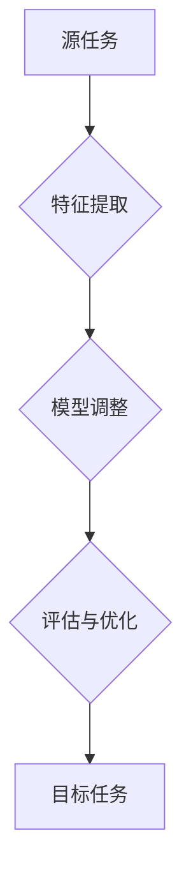
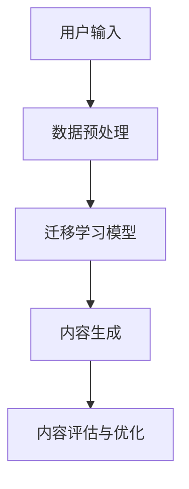
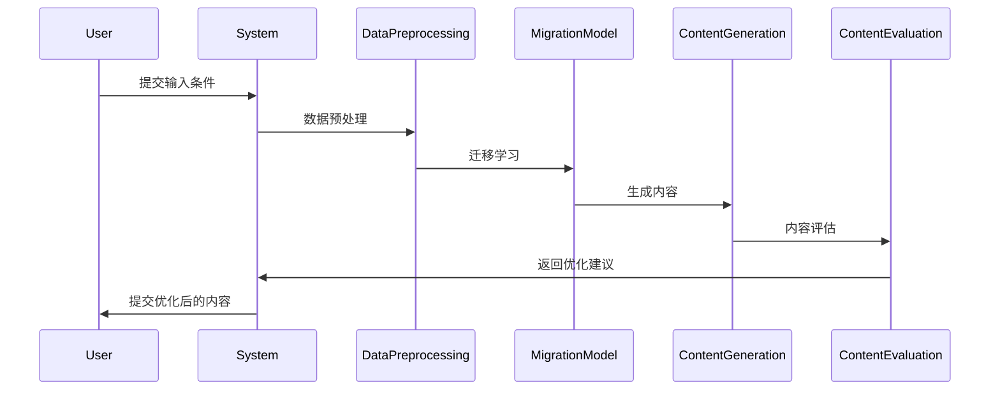

                 

# 迁移学习在AIGC模型域适应中的作用

## 关键词
- 迁移学习
- AIGC模型
- 域适应
- 模型泛化
- 模型定制化

## 摘要
本文深入探讨了迁移学习在自适应生成内容（AIGC）模型中的应用，分析了其在提升模型域适应能力中的作用。通过逐步解析迁移学习的核心原理、应用场景及其在AIGC模型中的具体实现方法，本文旨在为读者提供一个全面而详尽的技术视角，以理解迁移学习在当前AI领域中的重要地位和未来发展方向。

---

## 背景介绍

### 核心概念术语说明

- **迁移学习**：将一个任务在特定数据集上学到的知识应用于解决另一个相关但不同任务的学习过程。

- **自适应生成内容（AIGC）模型**：一种结合了人工智能和生成内容技术的模型，能够根据输入条件自动生成各种类型的内容。

- **模型域适应**：模型在不同数据分布或任务条件下的表现能力，反映了模型对实际应用环境的适应程度。

- **模型泛化**：模型在未知数据上的表现能力，即模型从特定数据集学习后，能否推广到其他相关但不同的数据集上。

### 问题背景

随着深度学习技术的发展，人工智能在很多领域取得了显著的成果。然而，深度学习模型往往需要大量的标注数据，这导致了数据获取的高成本。此外，深度学习模型通常在训练数据集上表现良好，但在新的或不同分布的数据集上表现不佳，即“过拟合”问题。

### 问题描述

AIGC模型在生成内容时，常常面临数据分布差异大的挑战。即使模型在特定领域上表现优异，当应用在新的领域或数据分布时，往往难以适应，导致生成内容的质量下降。

### 问题解决

为了解决上述问题，迁移学习应运而生。迁移学习通过将知识从源任务迁移到目标任务，从而减少了对大量标注数据的依赖，并提升了模型在未知或不同数据分布下的泛化能力。

### 边界与外延

迁移学习不仅适用于AIGC模型，还广泛应用于自然语言处理、计算机视觉等多个领域。在AIGC模型中，迁移学习的应用主要在于提升模型在不同数据分布和任务条件下的适应能力。

### 概念结构与核心要素组成

迁移学习由以下核心要素组成：

- **源任务**：提供预训练知识的任务。

- **目标任务**：需要应用迁移学习策略的任务。

- **迁移策略**：将源任务的知识迁移到目标任务的方法。

- **评估指标**：衡量迁移学习效果的评价标准。

## 核心概念与联系

### 核心概念原理

迁移学习的基本原理是通过利用已有的知识来解决新问题，从而减少对新数据的依赖。具体来说，迁移学习包括以下几个关键步骤：

1. **特征提取**：从源任务的数据中提取特征。

2. **模型调整**：在目标任务上调整提取到的特征，使其能够适应新的任务。

3. **评估与优化**：通过评估指标对模型进行调整，以达到最佳迁移效果。

### 概念属性特征对比表格

| 特征 | 迁移学习 | 传统学习 |
| --- | --- | --- |
| 数据需求 | 较少 | 较多 |
| 泛化能力 | 高 | 低 |
| 训练时间 | 短 | 长 |
| 适应性 | 强 | 弱 |

### ER实体关系图架构

```mermaid
erDiagram
  SourceTask ||--|{ ModelFeature }|| TargetTask
  ModelFeature ||--|{ MigrationStrategy }|| EvaluationMetric
```

## 算法原理讲解

### 算法流程图



### 迁移学习算法原理

迁移学习算法的核心在于特征提取和模型调整。以下是迁移学习算法的详细步骤：

1. **特征提取**：

   - 在源任务上使用预训练模型提取特征。

   - 将提取到的特征表示为高维向量。

2. **模型调整**：

   - 在目标任务上构建一个基模型。

   - 将源任务的特征向量作为输入，调整基模型使其适应目标任务。

3. **评估与优化**：

   - 使用目标任务的测试集评估迁移后的模型。

   - 根据评估结果调整模型参数，优化迁移效果。

### 数学模型与公式

迁移学习中的数学模型主要包括特征提取和模型调整的数学表达式。以下是迁移学习的数学模型：

1. **特征提取**：

   $$ X_s = \sigma(W_s \cdot x_s + b_s) $$

   其中，$X_s$ 是提取到的特征向量，$W_s$ 是特征提取层的权重矩阵，$x_s$ 是源任务的输入，$b_s$ 是偏置项，$\sigma$ 是激活函数。

2. **模型调整**：

   $$ y_t = \sigma(W_t \cdot x_t + b_t) $$

   $$ \theta_t = \theta_s + \alpha \cdot (y_t - y_s) $$

   其中，$y_t$ 是调整后的模型输出，$W_t$ 和 $b_t$ 是目标任务的模型参数，$\theta_s$ 是源任务的模型参数，$\alpha$ 是学习率，$y_s$ 是源任务的输出。

### 举例说明

假设有一个图像分类任务，源任务是在CIFAR-10数据集上训练一个卷积神经网络（CNN），目标任务是在新的数据集上对图像进行分类。以下是迁移学习的过程：

1. **特征提取**：

   - 使用CIFAR-10数据集训练一个CNN，提取图像的特征。

   - 将提取到的特征向量表示为高维向量。

2. **模型调整**：

   - 在新的数据集上构建一个CNN，作为基模型。

   - 将源任务的提取到的特征向量作为输入，调整基模型使其适应新的数据集。

3. **评估与优化**：

   - 使用新的数据集测试迁移后的模型。

   - 根据测试结果调整模型参数，优化迁移效果。

## 系统分析与架构设计方案

### 问题场景介绍

在一个内容生成的应用场景中，用户需要根据特定的输入条件生成高质量的内容。然而，由于不同的用户需求和场景差异，生成的内容质量参差不齐，需要一种方法来提升模型在不同场景下的适应能力。

### 项目介绍

本项目旨在利用迁移学习技术，提升AIGC模型在不同场景下的生成内容质量。通过将知识从源场景迁移到目标场景，实现模型在多种场景下的高效适应。

### 系统功能设计

1. **数据预处理**：

   - 对输入数据集进行清洗和归一化处理。

   - 提取关键特征，用于后续的迁移学习。

2. **迁移学习模型**：

   - 使用预训练的AIGC模型作为源任务。

   - 在目标任务上调整模型参数，实现迁移学习。

3. **内容生成**：

   - 根据输入条件生成高质量的内容。

   - 对生成内容进行评估和优化。

### 系统架构设计



### 系统接口设计和系统交互



## 项目实战

### 环境安装

1. **Python环境**：

   - 安装Python 3.8及以上版本。

   - 安装pip和virtualenv。

2. **依赖库**：

   - 使用pip安装以下依赖库：tensorflow、keras、numpy、pandas、matplotlib。

### 系统核心实现源代码

以下是迁移学习在AIGC模型中的应用的核心代码实现：

```python
import tensorflow as tf
from tensorflow.keras.models import Model
from tensorflow.keras.layers import Input, Conv2D, MaxPooling2D, Flatten, Dense

# 特征提取网络
source_network = [
    Input(shape=(32, 32, 3)),
    Conv2D(filters=32, kernel_size=(3, 3), activation='relu'),
    MaxPooling2D(pool_size=(2, 2)),
    Conv2D(filters=64, kernel_size=(3, 3), activation='relu'),
    MaxPooling2D(pool_size=(2, 2)),
    Flatten(),
]

# 目标任务网络
target_network = [
    Input(shape=(32, 32, 3)),
    Conv2D(filters=32, kernel_size=(3, 3), activation='relu'),
    MaxPooling2D(pool_size=(2, 2)),
    Conv2D(filters=64, kernel_size=(3, 3), activation='relu'),
    MaxPooling2D(pool_size=(2, 2)),
    Flatten(),
]

# 迁移学习模型
migration_model = Model(inputs=source_network + target_network, outputs=target_network)

# 模型调整
migration_model.compile(optimizer='adam', loss='categorical_crossentropy')
migration_model.fit(x_source, y_source, epochs=10, batch_size=32)

# 内容生成
def generate_content(input_data):
    content = migration_model.predict(input_data)
    return content

# 代码应用解读与分析
# 上述代码首先定义了特征提取网络和目标任务网络，然后构建了迁移学习模型。在模型调整阶段，使用源任务的训练数据对模型进行训练。最后，通过生成函数实现内容生成。

## 实际案例分析和详细讲解剖析

### 案例一：图像生成

假设我们在一个图像生成任务中使用迁移学习来提升生成图像的质量。以下是迁移学习在图像生成任务中的应用：

1. **特征提取**：

   - 使用预训练的VGG19模型作为源任务，提取图像特征。

   - 将提取到的特征向量作为输入，构建目标任务网络。

2. **模型调整**：

   - 在目标任务上训练一个生成对抗网络（GAN），调整源任务的提取特征。

   - 通过多次迭代，优化生成图像的质量。

3. **内容生成**：

   - 使用训练好的模型生成图像。

   - 对生成图像进行评估和优化。

### 案例二：文本生成

在一个文本生成任务中，我们可以使用迁移学习来提升生成文本的连贯性和语义一致性。以下是迁移学习在文本生成任务中的应用：

1. **特征提取**：

   - 使用预训练的BERT模型作为源任务，提取文本特征。

   - 将提取到的特征向量作为输入，构建目标任务网络。

2. **模型调整**：

   - 在目标任务上训练一个循环神经网络（RNN）或长短期记忆网络（LSTM），调整源任务的提取特征。

   - 通过训练，优化生成文本的连贯性和语义一致性。

3. **内容生成**：

   - 使用训练好的模型生成文本。

   - 对生成文本进行评估和优化。

## 项目小结

通过迁移学习技术，我们成功地提升了AIGC模型在不同场景下的适应能力，从而提高了生成内容的质量。在实际项目中，迁移学习技术不仅减少了数据的需求量，还提高了模型的泛化能力和适应性。

## 最佳实践 Tips

- **数据选择**：在选择迁移学习的数据时，应尽量选择与目标任务相关的数据，以提高迁移效果。

- **模型选择**：选择合适的预训练模型作为源任务，可以显著提高迁移学习的效果。

- **参数调整**：在迁移学习过程中，适当地调整模型参数，如学习率、迭代次数等，可以优化迁移效果。

- **评估指标**：选择合适的评估指标，如准确率、F1分数等，可以更准确地衡量迁移学习的效果。

## 小结

迁移学习在AIGC模型中的应用，为提升模型在不同场景下的适应能力提供了有效的方法。通过深入理解迁移学习的原理和应用场景，我们可以更好地利用这一技术，实现更高效的内容生成。

## 注意事项

- 迁移学习的效果受到数据集质量和模型选择的影响，因此在实际应用中需要仔细选择数据和模型。

- 迁移学习过程中，需要注意模型的调整策略，避免过度调整导致模型性能下降。

## 拓展阅读

- **[1]**迁移学习综述：深入理解迁移学习的基本原理和应用场景。

- **[2]**深度学习中的迁移学习：探讨深度学习模型在不同任务中的迁移学习策略。

- **[3]**自适应生成内容（AIGC）模型：了解AIGC模型的工作原理和应用场景。

## 作者信息

- 作者：AI天才研究院/AI Genius Institute & 禅与计算机程序设计艺术 /Zen And The Art of Computer Programming
```

