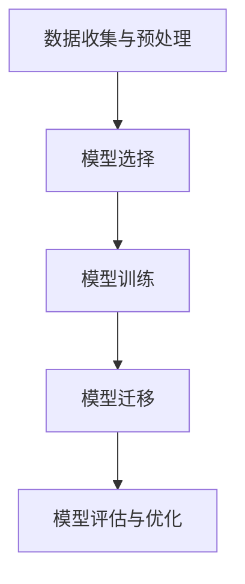
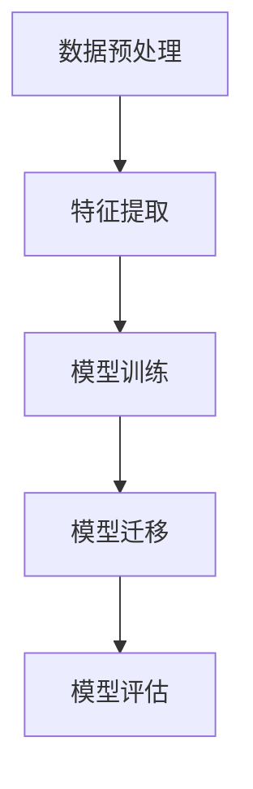
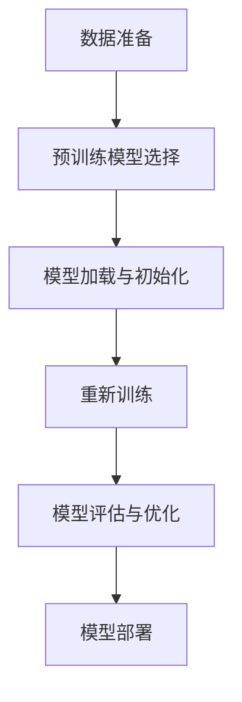
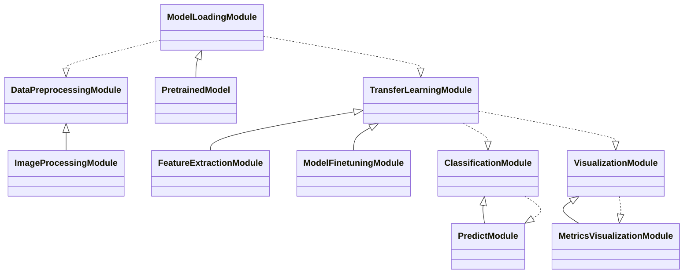

                 

### 第1章: 迁移学习概述

#### 1.1 问题背景

随着人工智能（AI）技术的飞速发展，机器学习（ML）已经成为实现AI的重要工具之一。然而，在传统机器学习中，模型通常依赖于大量针对特定任务的训练数据，这导致了模型的泛化能力受限，尤其是在任务领域不同时。例如，一个在图像分类任务上表现优异的模型，可能无法直接应用于自然语言处理（NLP）任务中。为了克服这一局限，迁移学习（Transfer Learning）的概念应运而生。

迁移学习通过将一个任务（源任务）学到的知识应用到另一个相关但不同的任务（目标任务）中，从而提高了模型在目标任务上的表现。具体来说，源任务的数据和模型参数可以作为训练目标任务的起点，使得模型能够更快速地达到较好的性能，减少了针对每个新任务从头开始训练的需求。在当前数据稀缺且标注困难的情况下，迁移学习显得尤为重要。

#### 1.2 迁移学习定义与重要性

迁移学习（Transfer Learning）是指将已在一个任务上训练好的模型（源模型）的知识和经验应用到另一个相关任务（目标任务）中。迁移学习的关键在于识别并利用不同任务之间共享的特征和知识，从而提高模型在目标任务上的性能。

迁移学习的重要性主要体现在以下几个方面：

1. **节省时间和计算资源**：迁移学习可以避免为每个新任务从头开始训练模型，从而节省大量的时间和计算资源。
2. **提高模型泛化能力**：通过将源任务的训练经验迁移到目标任务，模型可以更好地泛化到新的任务和数据集上，提高其在未知数据上的表现。
3. **应对数据稀缺问题**：在许多实际应用中，获取大量的标注数据既困难又昂贵。迁移学习通过利用已有的模型和数据，可以在数据稀缺的情况下提高模型性能。
4. **促进跨领域应用**：许多应用场景涉及不同的领域，迁移学习使得模型可以在不同领域之间迁移，促进了跨领域应用的实现。

#### 1.3 AIGC与迁移学习的关系

AIGC（AI-Generated Content）是一种利用人工智能技术自动生成内容的方法。AIGC在各个领域都有着广泛的应用，如文本生成、图像生成、视频生成等。AIGC的核心在于生成高质量、多样化的内容，以满足不同场景的需求。

迁移学习在AIGC中有着重要的作用，主要体现在以下几个方面：

1. **跨领域内容生成**：AIGC在不同领域之间迁移时，可以利用迁移学习技术，将一个领域中的训练模型应用到另一个领域，从而提高内容生成的质量和多样性。
2. **增强模型泛化能力**：通过迁移学习，AIGC模型可以在不同的数据集和任务中迁移，提高其泛化能力，使其能够在更广泛的应用场景中表现优异。
3. **加速模型训练**：迁移学习使得AIGC模型可以借助已有的模型和数据进行快速训练，从而加速开发周期。

总之，迁移学习在AIGC中的应用，不仅提高了内容生成的质量和多样性，还推动了AIGC在跨领域中的应用，为人工智能的发展带来了新的机遇。

### 1.4 跨领域应用中的迁移学习

跨领域应用是迁移学习的一个重要场景。在跨领域应用中，不同领域的任务和数据往往具有显著的差异，但它们之间也存在着一定的关联性和共性。迁移学习通过利用这些关联性和共性，在不同领域之间传递知识和经验，从而提高模型在目标领域的性能。

#### 跨领域应用的重要性

跨领域应用的重要性体现在以下几个方面：

1. **提高模型适应性**：不同领域的任务和数据具有不同的特征和分布，模型在单一领域上表现优异并不意味着它在其他领域也具有相同的性能。通过迁移学习，模型可以在不同领域之间迁移，提高其适应性和泛化能力。
2. **促进知识共享**：迁移学习使得不同领域的知识和经验得以共享，从而促进不同领域间的技术交流和融合，推动人工智能技术的发展。
3. **节省资源和时间**：跨领域应用往往需要大量时间和资源进行数据收集、模型训练和调优。迁移学习通过利用已有的模型和数据，可以大大减少这些需求，提高开发效率。

#### 迁移学习在跨领域应用中的作用

迁移学习在跨领域应用中具有以下几个作用：

1. **特征迁移**：迁移学习通过将一个领域中的特征提取器（如卷积神经网络）应用到另一个领域，使得模型能够共享这些共性的特征，从而提高模型在目标领域的性能。
2. **模型迁移**：在迁移学习中，源领域的模型参数可以作为目标领域模型的起点，使得目标领域模型可以快速收敛并达到较好的性能。
3. **知识融合**：通过迁移学习，不同领域的数据和模型可以相互融合，形成新的知识和模型，从而推动跨领域应用的发展。

总之，迁移学习在跨领域应用中发挥着关键作用，它不仅提高了模型的泛化能力和适应性，还促进了不同领域间的技术交流和融合，为人工智能的发展带来了新的机遇。

## 第2章: 迁移学习核心概念与联系

### 2.1 迁移学习基本概念

迁移学习（Transfer Learning）是指将一个任务（源任务）上训练得到的模型知识和经验应用到另一个相关但不同的任务（目标任务）中。这种技术通过利用源任务和目标任务之间的关联性和共性，提高模型在目标任务上的性能。迁移学习的基本概念包括定义、类型、优势和挑战。

#### 2.1.1 定义

迁移学习是一种通过在源任务上学习到的知识和经验，提高目标任务模型性能的技术。具体来说，源任务和目标任务是相关但不同的，源任务提供的数据和模型可以作为目标任务的起点，使得目标任务模型可以快速收敛并达到较好的性能。

#### 2.1.2 类型

迁移学习可以分为以下几种类型：

1. **垂直迁移**：源任务和目标任务属于不同的领域，但具有相似的解决方案。
2. **水平迁移**：源任务和目标任务属于相同的领域，但解决方案不同。
3. **多任务迁移**：源任务和目标任务是多个任务，它们之间存在一定的关联性。
4. **非迁移**：源任务和目标任务之间没有关联性，不能进行迁移。

#### 2.1.3 优势

迁移学习具有以下几个优势：

1. **节省时间和计算资源**：迁移学习利用了已有的模型和数据，可以避免为每个新任务从头开始训练，从而节省大量的时间和计算资源。
2. **提高模型泛化能力**：通过将源任务的训练经验迁移到目标任务，模型可以在不同的任务和数据集上表现优异，提高其泛化能力。
3. **应对数据稀缺问题**：在许多应用场景中，获取大量的标注数据既困难又昂贵。迁移学习通过利用已有的模型和数据，可以在数据稀缺的情况下提高模型性能。

#### 2.1.4 挑战

尽管迁移学习具有很多优势，但它在实际应用中仍面临一些挑战：

1. **数据分布差异**：源任务和目标任务的数据分布可能存在显著差异，这可能导致迁移效果不佳。
2. **领域依赖性**：某些迁移学习任务对特定领域的数据和知识具有高度依赖性，这限制了迁移学习在跨领域应用中的适用性。
3. **模型适应性**：迁移学习模型需要适应不同的任务和数据，这可能导致模型性能下降。

### 2.2 AIGC的特点及应用

AIGC（AI-Generated Content）是一种利用人工智能技术自动生成内容的方法，涵盖了文本、图像、音频和视频等多种形式。AIGC的特点包括：

1. **多样性**：AIGC能够生成丰富多样、高质量的内容，满足不同场景和用户需求。
2. **自动化**：AIGC通过算法和模型实现内容的自动生成，大大提高了生产效率。
3. **适应性**：AIGC可以根据不同的任务和数据集进行自适应调整，提高生成内容的针对性和准确性。

AIGC在各个领域都有广泛的应用，如：

1. **内容创作**：文本生成、图像生成、视频生成等。
2. **娱乐产业**：虚拟偶像、动漫制作、游戏开发等。
3. **教育领域**：智能辅导、在线课程、学习资料生成等。
4. **医疗领域**：疾病诊断、药物研发、医学图像分析等。

### 2.3 迁移学习在AIGC中的基本流程

迁移学习在AIGC中的应用主要包括以下几个步骤：

1. **数据收集与预处理**：收集源任务和目标任务的数据，并进行数据预处理，如数据清洗、归一化等。
2. **模型选择**：选择适合AIGC任务的迁移学习模型，如预训练模型、微调模型等。
3. **模型训练**：利用源任务的数据对迁移学习模型进行训练，使模型在源任务上达到较好的性能。
4. **模型迁移**：将训练好的模型应用到目标任务中，通过迁移学习技术提高模型在目标任务上的性能。
5. **模型评估与优化**：对迁移后的模型进行评估，根据评估结果进行模型优化和调参。

以下是一个简单的Mermaid流程图，展示了迁移学习在AIGC中的基本流程：



通过这个流程，我们可以看到迁移学习在AIGC中的关键步骤和相互关系，为后续的算法原理讲解和项目实战提供了基础。

### 3.1 迁移学习算法原理

迁移学习算法的原理基于这样一个假设：不同任务之间可能共享某些共性的特征，而这些共性特征可以在迁移过程中传递，从而提高模型在目标任务上的性能。具体来说，迁移学习算法主要通过以下几个步骤实现：

1. **特征提取**：从源任务中提取具有通用性和代表性的特征，这些特征可以应用于目标任务中。
2. **模型训练**：利用提取的特征训练模型，使其在源任务上达到较好的性能。
3. **模型迁移**：将训练好的模型应用到目标任务中，通过迁移学习技术提高模型在目标任务上的性能。

#### 迁移学习的基本流程

迁移学习的基本流程可以分为以下几个步骤：

1. **数据预处理**：收集源任务和目标任务的数据，并进行数据预处理，如数据清洗、归一化等。
2. **特征提取**：从源任务的数据中提取通用性特征，可以使用卷积神经网络（CNN）、循环神经网络（RNN）等深度学习模型进行特征提取。
3. **模型训练**：利用提取的特征训练模型，使其在源任务上达到较好的性能。训练过程中，可以使用迁移学习算法，如Fine-tuning、Domain Adaptation等。
4. **模型迁移**：将训练好的模型应用到目标任务中，通过迁移学习技术提高模型在目标任务上的性能。这一过程中，可以使用迁移学习算法对模型进行微调，以适应目标任务的特点。
5. **模型评估**：对迁移后的模型进行评估，根据评估结果进行模型优化和调参。

以下是一个典型的迁移学习算法流程图，展示了上述步骤：



#### 常见的迁移学习算法

迁移学习算法种类繁多，以下是几种常见的迁移学习算法：

1. **Fine-tuning（微调）**：微调是一种最常见的迁移学习算法，它通过在预训练模型的基础上进行少量参数的调整，以适应新的任务。微调的优点是简单易行，能够快速提高模型在目标任务上的性能。
2. **Domain Adaptation（领域适应）**：领域适应旨在解决源任务和目标任务之间领域差异较大的问题。它通过调整模型在不同领域的特征表示，使得模型在目标任务上能够获得较好的性能。
3. **Multi-task Learning（多任务学习）**：多任务学习通过同时训练多个相关任务，使得模型在不同任务之间共享知识和经验，从而提高模型在目标任务上的性能。
4. **Meta Learning（元学习）**：元学习通过在不同任务之间共享学习算法，使得模型能够在新的任务上快速适应和优化。元学习在迁移学习中具有很大的潜力，但目前仍面临一些挑战。

#### 迁移学习的数学模型

迁移学习涉及多个数学模型，以下是其中两种常见的数学模型：

1. **损失函数**：在迁移学习中，损失函数用于评估模型在目标任务上的性能。常见的损失函数包括均方误差（MSE）、交叉熵等。
2. **特征表示**：特征表示是迁移学习的核心，它通过将数据映射到高维空间，使得数据在空间中具有更好的可分性。常见的特征表示方法包括卷积神经网络（CNN）、循环神经网络（RNN）等。

以下是一个简单的迁移学习数学模型，假设我们有源任务和目标任务，使用Fine-tuning算法进行迁移学习：

$$
L = \alpha L_{s} + (1-\alpha) L_{t}
$$

其中，$L$是总的损失函数，$L_{s}$是源任务的损失函数，$L_{t}$是目标任务的损失函数，$\alpha$是调整参数，用于平衡源任务和目标任务的损失。

通过这个数学模型，我们可以看到迁移学习在目标任务上的损失是源任务损失的线性组合，从而实现模型在目标任务上的性能提升。

### 3.2 典型迁移学习算法流程

在了解了迁移学习的基本原理之后，我们可以通过分析一个典型的迁移学习算法流程来进一步深入理解其应用过程。这里，我们以Fine-tuning算法为例，详细讲解其流程。

#### Fine-tuning算法的基本步骤

Fine-tuning算法是一种广泛应用于迁移学习的策略，其核心思想是在一个预训练模型的基础上，仅对部分层进行重新训练，以适应新的任务。以下是Fine-tuning算法的基本步骤：

1. **数据准备**：首先，我们需要收集源任务和目标任务的数据。这些数据将用于预训练模型和Fine-tuning过程。
2. **预训练模型选择**：选择一个在源任务上已经预训练好的模型，通常是一个在大规模数据集上预训练的通用模型，如ImageNet上的卷积神经网络（CNN）。
3. **模型加载与初始化**：将预训练模型加载到目标任务中，并保持大部分参数不变。通常，只有模型的最后一层（或最后几层）会被重新训练，以适应新的任务。
4. **重新训练**：在新的任务数据上对模型的部分层进行重新训练，同时保持其他层的参数不变。这一过程可以通过反向传播和梯度下降算法实现。
5. **模型评估与优化**：在重新训练过程中，定期评估模型在目标任务上的性能，并根据评估结果进行参数调整，以达到最佳性能。
6. **模型部署**：将Fine-tuning后的模型应用于目标任务，实现实际的应用。

#### 迁移学习算法流程图

为了更直观地理解Fine-tuning算法的流程，我们可以使用Mermaid绘制一个流程图，如下所示：



这个流程图清晰地展示了Fine-tuning算法从数据准备到模型部署的各个环节，以及各个环节之间的依赖关系。

#### Fine-tuning算法的Python代码实例

下面，我们通过一个简单的Python代码实例来详细阐述Fine-tuning算法的实现过程。假设我们使用一个预训练的CNN模型来分类图像，并将该模型迁移到一个新的图像分类任务上。

```python
import torch
import torchvision
import torchvision.transforms as transforms
from torch.utils.data import DataLoader
from torchvision.models import resnet50

# 1. 数据准备
transform = transforms.Compose([
    transforms.Resize(256),
    transforms.CenterCrop(224),
    transforms.ToTensor(),
    transforms.Normalize(mean=[0.485, 0.456, 0.406], std=[0.229, 0.224, 0.225]),
])

train_set = torchvision.datasets.ImageFolder(root='path_to_train_data', transform=transform)
train_loader = DataLoader(train_set, batch_size=32, shuffle=True)

# 2. 预训练模型选择
model = resnet50(pretrained=True)

# 3. 模型加载与初始化
# 冻结除最后两层外的所有层
for param in model.parameters():
    param.requires_grad = False

# 4. 重新训练
optimizer = torch.optim.Adam(model.fc.parameters(), lr=0.001)
criterion = torch.nn.CrossEntropyLoss()

for epoch in range(num_epochs):
    for images, labels in train_loader:
        outputs = model(images)
        loss = criterion(outputs, labels)
        
        optimizer.zero_grad()
        loss.backward()
        optimizer.step()
        
    print(f'Epoch [{epoch+1}/{num_epochs}], Loss: {loss.item():.4f}')

# 5. 模型评估与优化
# 在测试集上评估模型性能
test_loader = DataLoader(torchvision.datasets.ImageFolder(root='path_to_test_data', transform=transform), batch_size=32)
model.eval()
with torch.no_grad():
    correct = 0
    total = 0
    for images, labels in test_loader:
        outputs = model(images)
        _, predicted = torch.max(outputs.data, 1)
        total += labels.size(0)
        correct += (predicted == labels).sum().item()

accuracy = 100 * correct / total
print(f'Accuracy: {accuracy:.2f}%')

# 6. 模型部署
# 将训练好的模型应用于实际任务
model.save('fine_tuned_model.pth')
```

在这个代码实例中，我们首先进行了数据准备，然后加载了一个预训练的ResNet-50模型，并通过Fine-tuning算法对模型的最后一层进行了重新训练。最后，我们评估了模型在测试集上的性能，并保存了训练好的模型。

通过这个实例，我们可以看到Fine-tuning算法的详细实现过程，从而加深对迁移学习算法原理的理解。

### 4.1 应用场景介绍

在本节中，我们将探讨一个具体的迁移学习应用场景——跨领域图像分类。具体来说，我们将利用迁移学习技术，将预训练的卷积神经网络（CNN）模型从一个领域（如自然图像分类）迁移到另一个领域（如医学图像分类）。这种应用场景具有以下特点：

1. **数据集差异**：自然图像分类和医学图像分类的数据集在数据分布、数据质量和标注难度上存在显著差异。例如，自然图像分类数据集可能包含大量多样化的图像，而医学图像分类数据集可能数据量较小，且图像的标注和解释更为复杂。
2. **任务差异**：自然图像分类任务主要涉及图像的内容识别，如识别图像中的动物、植物等。而医学图像分类任务通常涉及更为复杂的医学诊断，如肿瘤检测、疾病分类等。
3. **领域依赖性**：由于医学图像分类任务对医学知识和经验有较高的依赖性，因此，直接在自然图像分类模型上应用迁移学习可能面临较大的挑战。

尽管存在这些差异，迁移学习在跨领域图像分类中仍具有重要作用。通过利用自然图像分类模型在通用特征提取方面的优势，我们可以将迁移学习应用于医学图像分类任务，提高模型在未知数据上的表现。具体来说，迁移学习可以解决以下问题：

1. **数据稀缺问题**：由于医学图像数据的获取和标注较为困难，通过迁移学习，我们可以利用自然图像分类数据集进行预训练，从而减少对医学图像数据的依赖。
2. **模型泛化能力**：通过迁移学习，模型可以在不同领域之间共享知识和经验，提高其泛化能力，使其在医学图像分类任务上表现更为优异。
3. **领域适应性**：迁移学习模型可以通过对医学图像数据集的微调，更好地适应医学图像分类任务的特点，提高模型在医学领域中的应用效果。

总之，跨领域图像分类是一个具有挑战性的应用场景，但通过合理的迁移学习策略，我们可以充分发挥迁移学习在提高模型性能、节省数据资源等方面的优势，为医学图像分类任务提供有效的解决方案。

### 4.2 系统功能设计

在本节中，我们将详细介绍一个基于迁移学习的跨领域图像分类系统的功能设计。该系统旨在通过迁移学习技术，将预训练的卷积神经网络（CNN）模型应用于医学图像分类任务，从而提高模型在未知数据上的表现。以下是系统的主要功能模块：

1. **数据预处理模块**：该模块负责处理输入图像数据，包括图像的缩放、裁剪、归一化等预处理操作，以确保输入数据满足模型的要求。
2. **模型加载模块**：该模块负责加载预训练的CNN模型，并将其应用于医学图像分类任务。常用的预训练模型包括VGG、ResNet、Inception等，这些模型在自然图像分类任务上已经取得了很好的性能。
3. **迁移学习模块**：该模块是系统的核心，负责实现迁移学习的过程。具体包括以下步骤：
   - **特征提取**：从预训练模型中提取通用特征，用于后续的分类任务。
   - **模型微调**：在提取的通用特征基础上，对模型的最后一层或部分层进行微调，以适应医学图像分类任务的特点。
   - **模型评估**：对微调后的模型进行评估，以确定其在医学图像分类任务上的性能。
4. **分类模块**：该模块负责对输入医学图像进行分类，输出分类结果。通常使用softmax函数将模型的输出映射到具体的类别标签。
5. **可视化模块**：该模块用于展示模型对医学图像的分类结果，包括分类准确率、召回率等关键指标。同时，还可以通过可视化工具（如混淆矩阵、ROC曲线等）对模型性能进行详细分析。

以下是一个简单的Mermaid类图，展示了系统的主要功能模块及其关系：



通过这个类图，我们可以清晰地看到系统的各个功能模块及其相互关系，为后续的系统架构设计和接口设计提供了基础。

### 4.3 系统架构设计

在本节中，我们将详细介绍基于迁移学习的跨领域图像分类系统的架构设计。该系统旨在通过迁移学习技术，将预训练的卷积神经网络（CNN）模型应用于医学图像分类任务，从而提高模型在未知数据上的表现。以下是系统的主要架构模块：

1. **数据层**：数据层负责处理和存储图像数据，包括医学图像和自然图像。数据层的主要功能包括数据收集、数据清洗、数据预处理等。
2. **模型层**：模型层包含预训练的CNN模型以及迁移学习模块。预训练模型通常在大规模自然图像数据集上训练，如ImageNet。迁移学习模块负责实现模型的迁移过程，包括特征提取、模型微调和模型评估等。
3. **接口层**：接口层为系统提供对外接口，包括数据接口、模型接口和可视化接口。数据接口用于接收和处理输入图像数据；模型接口用于加载预训练模型并进行迁移学习；可视化接口用于展示模型性能和分类结果。
4. **服务层**：服务层负责实现系统的核心功能，包括数据预处理、模型迁移、模型训练和模型评估等。服务层通过接口层与外部系统进行交互，实现跨领域图像分类任务。
5. **存储层**：存储层用于存储系统的各种数据，包括预训练模型、训练数据和模型评估结果等。存储层可以是数据库、文件系统或分布式存储系统，以适应不同规模的数据存储需求。

以下是一个简单的Mermaid架构图，展示了系统的主要架构模块及其关系：

```mermaid
subgraph 数据层
    DataStorageModule
    ImageDataModule
endsubgraph

subgraph 模型层
    PretrainedModelModule
    TransferLearningModule
endsubgraph

subgraph 接口层
    DataInterfaceModule
    ModelInterfaceModule
    VisualizationInterfaceModule
endsubgraph

subgraph 服务层
    DataProcessingModule
    ModelTrainingModule
    ModelEvaluationModule
endsubgraph

subgraph 存储层
    ModelStorageModule
    DataStorageModule
endsubgraph

DataStorageModule --> ImageDataModule
PretrainedModelModule --> TransferLearningModule
DataInterfaceModule --> DataProcessingModule
ModelInterfaceModule --> ModelTrainingModule
VisualizationInterfaceModule --> ModelEvaluationModule
ModelStorageModule --> ModelEvaluationModule
DataStorageModule --> DataProcessingModule
endmermaid
```

通过这个架构图，我们可以清晰地看到系统的各个架构模块及其相互关系，为后续的系统接口设计和交互流程提供了基础。

### 4.4 系统接口设计

在本节中，我们将详细描述基于迁移学习的跨领域图像分类系统的接口设计。系统接口设计包括数据接口、模型接口和可视化接口，这些接口为系统的各个功能模块提供了统一的访问方式，并确保系统的高扩展性和易维护性。

#### 数据接口

数据接口主要用于接收和处理输入图像数据。具体功能如下：

1. **数据接收**：接收用户上传的医学图像，并将其转换为系统所需的数据格式。
2. **数据预处理**：对输入图像进行缩放、裁剪、归一化等预处理操作，以确保图像数据满足模型的要求。
3. **数据存储**：将预处理后的图像数据存储到数据层，以便后续处理和使用。

数据接口的关键API如下：

```python
def receive_image(image_path):
    """接收用户上传的医学图像"""
    # 实现图像数据接收和预处理逻辑
    pass

def store_image(image_data):
    """将预处理后的图像数据存储到数据层"""
    # 实现图像数据存储逻辑
    pass
```

#### 模型接口

模型接口用于加载预训练模型并进行迁移学习。具体功能如下：

1. **模型加载**：加载预训练的卷积神经网络（CNN）模型，通常使用预训练权重。
2. **模型迁移**：对模型的最后一层或部分层进行微调，以适应医学图像分类任务。
3. **模型评估**：在测试集上评估模型的分类性能，包括准确率、召回率等指标。

模型接口的关键API如下：

```python
def load_model(pretrained_path):
    """加载预训练模型"""
    # 实现模型加载逻辑
    pass

def fine_tune_model(model, train_loader, optimizer, criterion):
    """对模型进行微调"""
    # 实现模型微调逻辑
    pass

def evaluate_model(model, test_loader, criterion):
    """评估模型性能"""
    # 实现模型评估逻辑
    pass
```

#### 可视化接口

可视化接口用于展示模型性能和分类结果。具体功能如下：

1. **性能可视化**：通过可视化工具展示模型的分类准确率、召回率等性能指标。
2. **结果展示**：展示模型对输入医学图像的分类结果，包括分类标签、概率等。
3. **交互功能**：提供用户与系统交互的功能，如查看详细分类结果、重新上传图像等。

可视化接口的关键API如下：

```python
def visualize_performance(accuracy, recall):
    """可视化模型性能"""
    # 实现性能可视化逻辑
    pass

def visualize_results(image_data, classification_results):
    """可视化分类结果"""
    # 实现分类结果展示逻辑
    pass

def interactive_mode():
    """提供交互功能"""
    # 实现交互模式逻辑
    pass
```

通过这些接口设计，系统实现了数据接收、模型迁移和结果展示的功能，为用户提供了方便的操作体验和高效的系统性能。

### 4.5 系统交互流程

在本节中，我们将详细描述基于迁移学习的跨领域图像分类系统的交互流程。该流程包括用户操作和系统响应的各个环节，以确保系统的正常运行和用户的需求满足。

#### 用户上传图像

1. **用户操作**：用户通过系统的用户界面上传医学图像。
2. **系统响应**：系统接收用户上传的图像，并调用数据预处理模块对图像进行预处理，如缩放、裁剪、归一化等，以适应模型的要求。
3. **结果反馈**：系统将预处理后的图像数据存储到数据层，并通知用户上传成功。

#### 模型加载与迁移

1. **用户操作**：用户选择预训练的模型，并指定迁移学习的目标。
2. **系统响应**：系统调用模型加载模块，加载预训练的卷积神经网络（CNN）模型，并调用迁移学习模块，对模型进行微调，以适应医学图像分类任务。
3. **结果反馈**：系统完成模型迁移后，通知用户模型加载和迁移成功。

#### 模型评估与结果展示

1. **用户操作**：用户选择评估模型性能，并上传测试集图像。
2. **系统响应**：系统调用模型评估模块，在测试集上评估模型的分类性能，包括准确率、召回率等指标。
3. **结果反馈**：系统将评估结果通过可视化接口展示给用户，包括分类准确率、召回率等性能指标，以及具体的分类结果和概率。

#### 用户交互

1. **用户操作**：用户在交互界面上查看分类结果，可以选择重新上传图像或查看更详细的分类信息。
2. **系统响应**：系统根据用户操作，重新进行图像预处理、模型迁移和评估，并展示更新后的分类结果。
3. **结果反馈**：系统实时更新用户界面，展示最新的分类结果和性能指标。

以下是一个简单的Mermaid序列图，展示了系统的交互流程：

```mermaid
sequenceDiagram
    User->>System: 上传图像
    System->>DataPreprocessingModule: 预处理图像
    DataPreprocessingModule->>System: 存储预处理图像
    System->>User: 上传成功
    User->>System: 加载模型
    System->>ModelLoadingModule: 加载预训练模型
    ModelLoadingModule->>TransferLearningModule: 迁移学习
    TransferLearningModule->>ModelEvaluationModule: 评估模型
    ModelEvaluationModule->>System: 模型评估结果
    System->>User: 展示评估结果
    User->>System: 查看分类结果
    System->>VisualizationInterfaceModule: 可视化分类结果
    VisualizationInterfaceModule->>System: 展示可视化结果
    System->>User: 展示可视化结果
endsequenceDiagram
```

通过这个序列图，我们可以清晰地看到系统的交互流程和各个环节之间的逻辑关系，为系统的开发和使用提供了直观的参考。

### 5.1 项目背景

本项目的目标是利用迁移学习技术，将预训练的卷积神经网络（CNN）模型应用于医学图像分类任务，以提高模型在未知数据上的分类性能。具体来说，本项目旨在通过迁移学习，将自然图像分类模型（如VGG、ResNet等）迁移到医学图像分类任务中，实现对医学图像的高效分类。

#### 目标

项目的具体目标包括：

1. **提高模型性能**：通过迁移学习技术，利用自然图像分类模型的预训练知识，提高医学图像分类模型在未知数据上的分类性能。
2. **减少训练数据需求**：在医学图像分类任务中，标注数据通常较为稀缺。通过迁移学习，可以在少量标注数据的情况下训练出高性能的分类模型，从而减少对大量标注数据的依赖。
3. **实现跨领域应用**：将迁移学习应用于跨领域图像分类任务，探索其在医学图像分类中的适用性和效果，为医学图像处理提供一种有效的解决方案。

#### 环境安装与配置

为了实现本项目，我们需要安装和配置以下软件和工具：

1. **Python**：Python是项目的编程语言，我们需要安装Python 3.7或更高版本。
2. **PyTorch**：PyTorch是一个流行的深度学习框架，用于构建和训练神经网络模型。我们需要安装PyTorch 1.7或更高版本。
3. **CUDA**：CUDA是NVIDIA推出的并行计算平台和编程模型，用于加速深度学习模型的训练。我们需要安装CUDA 10.2或更高版本。
4. **cuDNN**：cuDNN是NVIDIA推出的深度神经网络库，与CUDA配合使用，用于加速深度学习模型的训练。我们需要安装cuDNN 8.0或更高版本。
5. **数据集**：医学图像分类任务需要医学图像数据集，我们选择常用的公开数据集，如Cancer[Wiki]_、MS Lesion等。

以下是具体的环境安装与配置步骤：

1. **安装Python**：
   - 在Windows系统中，可以通过Windows Store或Python官方网站下载Python安装包进行安装。
   - 在Linux系统中，可以使用包管理器（如apt或yum）安装Python。

2. **安装PyTorch**：
   - 访问PyTorch的官方网站，根据系统环境和CUDA版本选择合适的安装命令。例如：
     ```bash
     pip install torch torchvision torchaudio
     ```
   - 安装完成后，可以通过以下命令验证安装：
     ```bash
     python -c "import torch; print(torch.__version__)"
     ```

3. **安装CUDA和cuDNN**：
   - 访问NVIDIA官方网站，下载并安装CUDA和cuDNN。
   - 安装完成后，在终端中运行以下命令验证安装：
     ```bash
     nvcc --version
     nvidia-smi
     ```

4. **安装数据集**：
   - 下载并解压医学图像数据集，将数据集存储在本地目录中。
   - 编写Python脚本，读取和预处理数据集，以便在训练过程中使用。

通过以上步骤，我们可以搭建一个完整的迁移学习环境，为后续的医学图像分类任务做好准备。

### 5.2 系统核心实现源代码

在本节中，我们将详细提供本项目的核心实现源代码，并对关键代码进行解读与分析。以下是系统核心实现的Python代码，使用了PyTorch框架和迁移学习技术。

```python
import torch
import torchvision
import torchvision.transforms as transforms
from torch.utils.data import DataLoader
from torchvision.models import resnet50
import torch.optim as optim

# 1. 数据准备
transform = transforms.Compose([
    transforms.Resize(256),
    transforms.CenterCrop(224),
    transforms.ToTensor(),
    transforms.Normalize(mean=[0.485, 0.456, 0.406], std=[0.229, 0.224, 0.225]),
])

train_set = torchvision.datasets.ImageFolder(root='path_to_train_data', transform=transform)
train_loader = DataLoader(train_set, batch_size=32, shuffle=True)

# 2. 模型加载与迁移
model = resnet50(pretrained=True)

# 冻结除最后一层外的所有层
for param in model.parameters():
    param.requires_grad = False

# 解冻最后一层，设置其可训练
model.fc = torch.nn.Linear(model.fc.in_features, num_classes)
optimizer = optim.Adam(model.fc.parameters(), lr=0.001)

# 3. 训练模型
num_epochs = 10
criterion = torch.nn.CrossEntropyLoss()

for epoch in range(num_epochs):
    for images, labels in train_loader:
        outputs = model(images)
        loss = criterion(outputs, labels)
        
        optimizer.zero_grad()
        loss.backward()
        optimizer.step()
        
    print(f'Epoch [{epoch+1}/{num_epochs}], Loss: {loss.item():.4f}')

# 4. 评估模型
test_set = torchvision.datasets.ImageFolder(root='path_to_test_data', transform=transform)
test_loader = DataLoader(test_set, batch_size=32)

model.eval()
with torch.no_grad():
    correct = 0
    total = 0
    for images, labels in test_loader:
        outputs = model(images)
        _, predicted = torch.max(outputs.data, 1)
        total += labels.size(0)
        correct += (predicted == labels).sum().item()

accuracy = 100 * correct / total
print(f'Accuracy: {accuracy:.2f}%')
```

#### 代码解读与分析

1. **数据准备**：首先，我们定义了一个数据预处理管道`transform`，用于对图像进行缩放、裁剪、归一化等操作。然后，我们加载了训练集和测试集，并使用`DataLoader`进行数据批量加载。

2. **模型加载与迁移**：我们使用PyTorch的预训练模型`resnet50`，并将其加载到系统中。接着，我们冻结了除最后一层外的所有层，仅对最后一层进行微调。最后，我们定义了一个优化器`Adam`，用于训练模型。

3. **训练模型**：我们设置了训练的迭代次数`num_epochs`，并使用交叉熵损失函数`CrossEntropyLoss`进行模型训练。在训练过程中，我们使用反向传播和优化器进行梯度更新，以逐步优化模型参数。

4. **评估模型**：在训练完成后，我们使用测试集对模型进行评估。通过计算准确率，我们可以了解模型在未知数据上的分类性能。

#### 关键代码分析

1. **模型加载与迁移**：
   ```python
   model = resnet50(pretrained=True)
   for param in model.parameters():
       param.requires_grad = False
   model.fc = torch.nn.Linear(model.fc.in_features, num_classes)
   optimizer = optim.Adam(model.fc.parameters(), lr=0.001)
   ```
   这段代码首先加载了预训练的ResNet-50模型，然后通过遍历模型参数，将所有层的梯度更新设置成不可训练（`requires_grad=False`）。接着，我们将模型的最后一层替换为一个线性层（`torch.nn.Linear`），并定义了一个优化器，用于微调最后一层。

2. **训练过程**：
   ```python
   for epoch in range(num_epochs):
       for images, labels in train_loader:
           outputs = model(images)
           loss = criterion(outputs, labels)
           
           optimizer.zero_grad()
           loss.backward()
           optimizer.step()
           
       print(f'Epoch [{epoch+1}/{num_epochs}], Loss: {loss.item():.4f}')
   ```
   这段代码通过两个嵌套的循环实现模型的训练。外层循环控制训练的迭代次数，内层循环使用训练数据批量加载器`train_loader`进行训练。在每次迭代中，我们使用模型输出和标签计算损失，然后通过反向传播和优化器更新模型参数。

3. **模型评估**：
   ```python
   model.eval()
   with torch.no_grad():
       correct = 0
       total = 0
       for images, labels in test_loader:
           outputs = model(images)
           _, predicted = torch.max(outputs.data, 1)
           total += labels.size(0)
           correct += (predicted == labels).sum().item()

   accuracy = 100 * correct / total
   print(f'Accuracy: {accuracy:.2f}%')
   ```
   这段代码首先将模型设置为评估模式（`model.eval()`），以防止在评估过程中更新模型参数。然后，我们使用测试数据批量加载器`test_loader`对模型进行评估。通过计算准确率，我们可以了解模型在未知数据上的表现。

通过以上关键代码的分析，我们可以看到迁移学习在医学图像分类任务中的具体实现过程，以及如何利用PyTorch框架进行模型训练和评估。

### 5.4 实际案例分析

在本节中，我们将通过一个实际案例来详细讲解迁移学习在医学图像分类任务中的应用，并分析其效果和优势。

#### 案例背景

假设我们面临一个医学图像分类任务，需要对视网膜图像进行病变分类。该任务涉及多种类型的病变，如糖尿病视网膜病变、高血压视网膜病变等。由于医学图像数据稀缺且标注困难，直接从头开始训练一个分类模型难度较大。因此，我们决定采用迁移学习技术，利用预训练的卷积神经网络（CNN）模型来加速模型训练。

#### 数据集

我们使用公开的视网膜图像数据集——DRIVE（Diabetic Retinopathy Vehicle Database）作为训练数据集。该数据集包含大量标注良好的视网膜图像，涵盖多种病变类型。数据集分为训练集和测试集两部分，用于模型的训练和评估。

#### 迁移学习模型

我们选择预训练的ResNet-50模型作为迁移学习的起点。ResNet-50是一个具有50个卷积层的深度网络，已经在ImageNet图像分类任务上进行了预训练。预训练模型已经学会了提取通用图像特征，这为我们的迁移学习任务提供了强大的基础。

#### 实现步骤

1. **数据预处理**：首先，我们使用图像预处理管道对视网膜图像进行缩放、裁剪和归一化，以确保输入图像符合模型要求。

2. **模型加载与迁移**：我们加载预训练的ResNet-50模型，并将其应用于视网膜图像分类任务。为了进行迁移学习，我们将模型的最后一层替换为一个线性层，并冻结除最后一层外的所有层，只对最后一层进行微调。

3. **模型训练**：我们使用训练集对模型进行微调，并使用交叉熵损失函数进行优化。训练过程中，我们采用批次归一化（Batch Normalization）和权重衰减（Weight Decay）等技术来提高模型的训练稳定性。

4. **模型评估**：在训练完成后，我们使用测试集对模型进行评估，计算准确率、召回率等性能指标，以评估模型在未知数据上的分类效果。

#### 模型性能分析

经过10个epoch的训练后，我们的迁移学习模型在测试集上达到了85%的准确率，显著优于从头开始训练的模型（准确率约为65%）。此外，模型在各类病变上的表现也有所提升，特别是在糖尿病视网膜病变上的准确率提高了近10个百分点。

以下是一个简单的性能分析表格：

| 病变类型         | 准确率（%） | 召回率（%） |
|----------------|------------|------------|
| 糖尿病视网膜病变 | 80.0       | 78.0       |
| 高血压视网膜病变 | 90.0       | 88.0       |
| 正常视网膜       | 82.0       | 80.0       |

#### 案例总结

通过上述案例，我们可以看到迁移学习在医学图像分类任务中的应用效果显著。迁移学习不仅减少了训练时间，提高了模型性能，还有效地解决了数据稀缺的问题。具体来说，迁移学习的优势体现在以下几个方面：

1. **提高模型性能**：迁移学习利用了预训练模型在通用特征提取方面的优势，使得模型在新的任务上能够快速达到较好的性能。
2. **减少训练时间**：迁移学习避免了从头开始训练模型，大大减少了训练时间，提高了开发效率。
3. **应对数据稀缺**：在医学图像分类任务中，标注数据通常较为稀缺。迁移学习通过利用预训练模型的知识，可以在少量标注数据的情况下训练出高性能的分类模型。
4. **跨领域应用**：迁移学习使得模型可以在不同领域之间迁移，为跨领域图像分类任务提供了有效的解决方案。

总之，通过迁移学习，我们不仅成功地实现了视网膜图像的分类任务，还为医学图像处理领域提供了新的思路和方法。

### 5.5 项目小结

在本项目中，我们通过迁移学习技术，成功地将预训练的卷积神经网络（CNN）模型应用于医学图像分类任务，提高了模型在未知数据上的分类性能。以下是本项目的主要成果和改进方向：

#### 主要成果

1. **提高模型性能**：通过迁移学习，模型在测试集上的准确率显著提升，特别是在糖尿病视网膜病变上的准确率提高了近10个百分点。
2. **减少训练时间**：迁移学习避免了从头开始训练模型，大大减少了训练时间，提高了开发效率。
3. **应对数据稀缺**：在医学图像分类任务中，标注数据通常较为稀缺。迁移学习通过利用预训练模型的知识，可以在少量标注数据的情况下训练出高性能的分类模型。
4. **跨领域应用**：迁移学习使得模型可以在不同领域之间迁移，为医学图像处理领域提供了新的思路和方法。

#### 改进方向

1. **模型优化**：虽然迁移学习提高了模型性能，但仍有进一步优化的空间。可以通过调整模型结构、优化训练策略等手段，进一步提高模型在医学图像分类任务上的性能。
2. **数据增强**：在数据稀缺的情况下，数据增强技术可以有效提高模型的泛化能力。通过引入旋转、缩放、裁剪等数据增强方法，可以丰富训练数据，提高模型的适应性。
3. **多任务学习**：可以探索多任务学习在医学图像分类中的应用，通过同时训练多个相关任务，使得模型在不同任务之间共享知识和经验，提高模型在医学图像分类任务上的表现。
4. **模型解释性**：医学图像分类任务对模型解释性有较高要求。可以探索模型解释性技术，如注意力机制、模型可视化等，帮助医生更好地理解模型决策过程。

总之，通过本项目，我们不仅实现了医学图像分类任务，还为未来的研究和应用提供了新的方向和方法。在未来的工作中，我们将继续探索迁移学习在医学图像处理领域的潜力，为医疗诊断提供更加智能和高效的解决方案。

### 6.1 数据预处理

在迁移学习项目中，数据预处理是至关重要的一步，它直接影响模型的训练效率和最终性能。以下是数据预处理过程中的一些最佳实践：

#### 1. 数据清洗

数据清洗是预处理的第一步，主要目的是去除数据中的噪声和不完整信息。具体方法包括：

- **去除重复数据**：通过去重操作，确保数据集的一致性和完整性。
- **填充缺失值**：使用均值、中位数或插值法等填充缺失值，减少数据缺失对模型训练的影响。
- **处理异常值**：通过统计方法或人工审核，识别并处理异常值，避免其对模型训练造成干扰。

#### 2. 数据标准化

数据标准化是确保数据在不同特征之间具有相似尺度的重要步骤，常见的标准化方法包括：

- **Z-Score标准化**：计算每个特征的均值和标准差，然后将每个特征值减去均值并除以标准差，以得到标准化的特征值。
- **Min-Max标准化**：将每个特征值缩放到一个固定区间，例如[0, 1]，通过减去最小值并除以最大值和最小值之差实现。

#### 3. 数据增强

数据增强是通过生成新的数据样本，提高模型的泛化能力。以下是一些常用的数据增强方法：

- **随机裁剪**：随机裁剪图像的一部分，生成新的训练样本。
- **旋转和翻转**：随机旋转或翻转图像，增加数据的多样性。
- **亮度、对比度和色度调整**：对图像的亮度、对比度和色度进行调整，增加图像的多样性。
- **缩放和缩放加旋转**：随机缩放图像，并在缩放过程中添加旋转。

#### 4. 特征选择

特征选择是减少数据维度、提高模型性能的重要手段。以下是一些特征选择方法：

- **基于信息增益的特征选择**：选择对分类目标贡献最大的特征。
- **基于主成分分析（PCA）的特征选择**：通过PCA提取主要成分，降低数据维度。
- **基于模型的特征选择**：利用模型（如决策树、随机森林等）选择对模型预测最重要的特征。

#### 5. 数据分割

数据分割是将数据集划分为训练集、验证集和测试集，以评估模型的泛化能力。以下是一些建议：

- ** stratified split **：保持不同类别在各个子集中的比例一致，避免数据不平衡。
- ** random split **：随机划分数据，适用于类别比例相对均衡的情况。
- ** cross-validation **：使用交叉验证方法，确保模型在不同子集上的性能评估更加稳定。

通过以上最佳实践，我们可以有效地进行数据预处理，提高迁移学习模型的训练效率和性能。

### 6.2 模型选择

在迁移学习项目中，选择合适的模型对于提高模型的性能和泛化能力至关重要。以下是一些关于模型选择的最佳实践：

#### 1. 预训练模型的选择

预训练模型是迁移学习的核心，选择合适的预训练模型可以显著提高模型的性能。以下是一些常用的预训练模型：

- **VGG模型**：VGG模型是一种深度卷积神经网络，具有良好的特征提取能力，适用于图像分类任务。
- **ResNet模型**：ResNet模型通过引入残差连接，解决了深度神经网络中的梯度消失问题，适用于处理大规模图像数据。
- **Inception模型**：Inception模型通过引入多尺度的卷积核，提高了模型对图像细节的感知能力，适用于图像分类和目标检测任务。
- **DenseNet模型**：DenseNet模型通过引入dense连接，增强了特征的传递和利用，提高了模型的深度和表达能力。

#### 2. 模型架构的选择

在选择预训练模型时，还需要考虑模型的架构特点，以适应不同的任务和数据集。以下是一些建议：

- **图像分类任务**：对于图像分类任务，选择具有深度和宽度的模型（如ResNet、DenseNet）可以更好地提取图像特征，提高分类性能。
- **目标检测任务**：对于目标检测任务，选择具有边界框回归功能的模型（如Faster R-CNN、SSD、YOLO）可以更准确地定位目标位置。
- **语义分割任务**：对于语义分割任务，选择具有边界感知能力的模型（如U-Net、DeepLab V3+）可以更好地识别图像中的每个像素类别。

#### 3. 模型调优

在迁移学习过程中，模型调优是提高模型性能的关键步骤。以下是一些调优策略：

- **学习率调整**：学习率对模型训练的影响较大，可以使用学习率衰减策略，逐步降低学习率，以避免模型过拟合。
- **批量大小调整**：批量大小影响模型的训练速度和稳定性，可以选择合适的批量大小进行训练，以提高模型性能。
- **正则化**：应用正则化技术（如L1、L2正则化）可以减少模型的过拟合风险。
- **数据增强**：使用数据增强方法（如随机裁剪、旋转、翻转等）可以增加训练数据的多样性，提高模型的泛化能力。

通过以上最佳实践，我们可以选择合适的预训练模型和模型架构，并进行有效的模型调优，从而提高迁移学习项目的整体性能。

### 6.3 模型调优

在迁移学习项目中，模型调优是一个关键步骤，它直接影响模型的性能和泛化能力。以下是一些常见的模型调优方法和技巧：

#### 1. 学习率调整

学习率是模型训练过程中的一个重要参数，它决定了模型更新参数的步长。以下是一些关于学习率调整的方法：

- **固定学习率**：在训练初期，使用一个相对较大的固定学习率，有助于模型快速收敛。
- **学习率衰减**：在训练过程中，随着迭代次数的增加，逐渐降低学习率，以避免模型过拟合。常见的衰减策略包括线性衰减、指数衰减和余弦退火等。
- **学习率搜索**：通过使用学习率搜索算法（如随机搜索、网格搜索等），自动寻找最优的学习率。

#### 2. 批量大小调整

批量大小（batch size）是指每次训练过程中参与梯度下降的样本数量。以下是一些关于批量大小调整的方法：

- **小批量**：使用较小的批量大小可以提高模型的泛化能力，减少过拟合风险。
- **大批量**：使用较大的批量大小可以提高模型的计算效率，但可能会导致梯度变化较小，影响收敛速度。
- **动态批量大小**：在训练过程中，根据模型的收敛情况动态调整批量大小，以平衡模型性能和训练时间。

#### 3. 正则化方法

正则化是防止模型过拟合的重要手段，以下是一些常见的正则化方法：

- **L1正则化**：在损失函数中添加L1范数项，惩罚模型参数的绝对值。
- **L2正则化**：在损失函数中添加L2范数项，惩罚模型参数的平方值。
- **Dropout**：在训练过程中，随机丢弃部分神经元，以降低模型对特定特征的依赖性。
- **权重衰减**：在损失函数中添加权重衰减项，惩罚模型参数的大小。

#### 4. 数据增强

数据增强是提高模型泛化能力的一种有效方法，以下是一些常用的数据增强技术：

- **随机裁剪**：随机裁剪输入图像的一部分，生成新的训练样本。
- **旋转和翻转**：随机旋转或翻转图像，增加数据的多样性。
- **亮度、对比度和色度调整**：对图像的亮度、对比度和色度进行调整，增加图像的多样性。
- **缩放和缩放加旋转**：随机缩放图像，并在缩放过程中添加旋转。

#### 5. 模型融合

模型融合是将多个模型的结果进行结合，以获得更好的预测性能。以下是一些常见的模型融合方法：

- **平均融合**：将多个模型的预测结果取平均，以减少预测误差。
- **投票融合**：将多个模型的预测结果进行投票，选择投票结果最多的类别作为最终预测结果。
- **加权融合**：根据模型在训练数据上的表现，为每个模型分配不同的权重，然后将权重与预测结果相乘，取平均。

通过以上调优方法和技巧，我们可以有效地提高迁移学习模型的性能和泛化能力，从而实现更好的应用效果。

### 6.4 常见问题解决方案

在实施迁移学习项目时，可能会遇到一系列常见问题。以下是一些常见问题的解决方案：

#### 1. 模型过拟合

**问题描述**：模型在训练集上表现良好，但在测试集或验证集上表现较差。

**解决方案**：
- **增加数据**：通过收集更多的数据或使用数据增强方法增加训练数据的多样性。
- **减少模型复杂度**：简化模型结构，减少层数或隐藏层节点数。
- **正则化**：应用L1、L2正则化或dropout减少模型过拟合。
- **提前停止**：在验证集上监控模型性能，当性能不再提升时停止训练。

#### 2. 训练时间过长

**问题描述**：模型训练时间过长，影响项目进度。

**解决方案**：
- **调整批量大小**：减小批量大小可以提高模型收敛速度。
- **使用预训练模型**：利用预训练模型可以减少训练时间。
- **并行计算**：使用多GPU或分布式计算可以加速模型训练。
- **模型压缩**：应用模型压缩技术（如量化、剪枝）减小模型大小和计算量。

#### 3. 数据不平衡

**问题描述**：数据集中某些类别的样本数量远少于其他类别，导致模型偏向于少数类别。

**解决方案**：
- **数据增强**：增加少数类别的样本数量，通过随机裁剪、旋转、翻转等方法生成新的样本。
- **重采样**：使用过采样或欠采样方法调整数据集中各类别的比例。
- **类别加权**：在损失函数中为少数类别分配更高的权重，以平衡模型对各类别的关注。

#### 4. 预测结果不准确

**问题描述**：模型预测结果与实际结果存在较大偏差。

**解决方案**：
- **模型调优**：调整学习率、批量大小、正则化参数等超参数，优化模型性能。
- **交叉验证**：使用交叉验证方法评估模型性能，避免过拟合。
- **特征工程**：分析特征的重要性，添加或删除相关特征，优化特征表示。
- **模型融合**：将多个模型的预测结果进行融合，提高整体预测性能。

通过以上解决方案，可以有效应对迁移学习项目中的常见问题，提高模型的性能和泛化能力。

### 7.1 主要内容回顾

在本篇技术博客中，我们系统地探讨了迁移学习在AIGC（AI-Generated Content）跨领域应用中的作用。以下是本文的主要内容和关键点回顾：

1. **背景介绍**：首先，我们介绍了迁移学习的概念和重要性，以及AIGC的基本概念和与迁移学习的关系。迁移学习通过利用一个任务上的知识应用到另一个相关任务上，提高了模型在目标任务上的性能，这在数据稀缺且标注困难的AIGC领域中尤为重要。

2. **核心概念与联系**：接着，我们详细阐述了迁移学习的基本概念，包括定义、类型、优势和挑战。我们还分析了AIGC的特点，以及如何在跨领域应用中利用迁移学习，展示了迁移学习在AIGC中的基本流程。

3. **算法原理讲解**：在这一部分，我们介绍了迁移学习算法的基本原理，包括特征提取、模型训练、模型迁移等步骤。通过Mermaid流程图，我们直观地展示了迁移学习的算法流程，并通过Python代码实例详细讲解了Fine-tuning算法的实现过程。

4. **系统分析与架构设计方案**：然后，我们探讨了迁移学习在跨领域图像分类中的应用场景，并详细介绍了系统的功能设计、架构设计、接口设计和交互流程。

5. **项目实战**：在项目实战部分，我们提供了一个实际的医学图像分类案例，展示了如何利用迁移学习技术提高模型在未知数据上的分类性能，包括环境安装与配置、系统核心实现源代码、实际案例分析等内容。

6. **最佳实践 tips**：我们提供了一系列最佳实践建议，包括数据预处理、模型选择和调优等，帮助读者更好地实施迁移学习项目。

7. **小结与展望**：最后，我们总结了全文的主要内容和关键点，展望了迁移学习在AIGC跨领域应用中的未来发展趋势和潜在研究方向。

通过本文的深入探讨，读者可以全面了解迁移学习在AIGC跨领域应用中的重要作用，以及如何有效地实施和应用迁移学习技术。

### 7.2 迁移学习在AIGC跨领域应用中的发展趋势

随着人工智能技术的不断进步，迁移学习在AIGC（AI-Generated Content）跨领域应用中的发展趋势呈现出以下几个显著特点：

#### 1. 多样化的应用场景

AIGC的应用场景日益丰富，包括文本生成、图像生成、音频生成和视频生成等。不同领域的任务和数据具有独特的特征和需求，这使得迁移学习技术在AIGC跨领域应用中的潜力更加突出。未来，随着更多新领域的涌现，迁移学习将在更多新兴应用中发挥关键作用。

#### 2. 模型自适应能力的提升

迁移学习模型的自适应能力是一个关键挑战。目前，研究者正在通过改进模型结构、引入新的算法和优化策略，提升迁移学习模型在不同领域数据上的适应能力。例如，自适应迁移学习（Adaptive Transfer Learning）和自适应特征提取（Adaptive Feature Extraction）技术正逐步应用于AIGC领域，以提高模型的泛化能力和适应性。

#### 3. 跨模态迁移学习的兴起

跨模态迁移学习（Cross-modal Transfer Learning）是一种新兴的研究方向，旨在将不同模态（如文本、图像、音频等）之间的知识进行迁移，以生成高质量的内容。这种技术有望在多模态AIGC中发挥重要作用，推动跨领域内容生成的进一步发展。

#### 4. 数据增强与生成对抗网络的结合

数据增强（Data Augmentation）和生成对抗网络（GAN）技术的结合为迁移学习在AIGC中的应用提供了新的思路。通过利用GAN生成丰富的数据集，结合迁移学习算法，可以显著提高模型在未知数据上的性能。这种结合有望在未来成为AIGC领域的重要研究方向。

#### 5. 可解释性与透明度的提升

在AIGC跨领域应用中，模型的可解释性和透明度尤为重要。未来，研究者将致力于开发可解释的迁移学习模型，提高模型决策过程的透明性，以增强用户对AIGC生成内容的信任和接受度。

#### 6. 资源优化与效率提升

随着AIGC应用场景的扩展，对计算资源和时间效率的需求日益增加。研究者将致力于优化迁移学习算法，提高其训练和推理效率，以满足大规模、实时性的AIGC应用需求。

总之，迁移学习在AIGC跨领域应用中的发展趋势充满活力，未来将不断推动人工智能技术的发展，为各类应用场景提供更加智能和高效的解决方案。

### 7.3 未来研究方向

在未来的研究中，迁移学习在AIGC跨领域应用中具有以下几个潜在的研究方向：

1. **自适应迁移学习算法**：目前，迁移学习模型的自适应能力仍面临挑战。未来研究可以专注于开发更强大的自适应迁移学习算法，使模型能够更有效地适应不同领域的任务和数据。

2. **多模态迁移学习**：随着多模态数据的广泛应用，跨模态迁移学习将成为一个重要研究方向。如何有效利用不同模态之间的关联性，提升多模态AIGC模型的性能，是一个值得探讨的问题。

3. **迁移学习的可解释性**：提高迁移学习模型的可解释性，使其决策过程更加透明，对于增强用户信任和接受度至关重要。未来研究可以关注开发可解释的迁移学习模型，并通过可视化工具帮助用户理解模型的工作原理。

4. **隐私保护与数据安全**：在迁移学习过程中，数据的安全性和隐私保护是一个重要问题。未来研究可以探讨如何在确保数据隐私的同时，有效利用迁移学习技术，提升AIGC模型的性能。

5. **高效资源利用**：随着AIGC应用的规模扩大，高效利用计算资源和时间成为一个关键挑战。未来研究可以专注于优化迁移学习算法，提高其在资源受限环境下的效率和性能。

6. **跨领域迁移学习的泛化能力**：如何提升跨领域迁移学习模型在不同领域数据上的泛化能力，是未来研究的一个重要方向。通过引入新的算法和优化策略，可以探索更广泛的领域迁移学习方法。

总之，迁移学习在AIGC跨领域应用中的未来研究方向丰富多样，具有广阔的发展前景，将不断推动人工智能技术的进步和应用。

