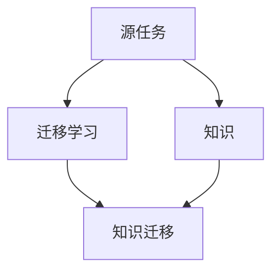

                 

### 迁移学习在AIGC领域知识迁移中的作用

#### 引言

在当今的计算机科学领域，自动生成内容（AIGC）已经成为了一个炙手可热的话题。AIGC技术涉及到文本、图像、视频等多种形式的自动生成，广泛应用于广告、娱乐、教育、新闻等行业。随着AIGC技术的不断发展，如何在不同的任务之间进行知识迁移，以提高模型的效果和效率，成为一个关键问题。迁移学习（Transfer Learning），作为一种有效的机器学习方法，在这其中扮演了至关重要的角色。

本文将围绕迁移学习在AIGC领域知识迁移中的作用进行深入探讨。首先，我们将介绍迁移学习的核心概念和种类，回顾其发展历程和重要性。接着，我们将分析迁移学习的基本原理，并探讨其在传统机器学习中的区别。随后，我们将详细介绍AIGC的基本概念、发展历程、核心技术和应用场景。在此基础上，我们将探讨知识迁移在AIGC中的应用，包括定义、流程、挑战和策略。接着，我们将通过具体案例展示迁移学习在AIGC领域的实战应用。最后，我们将展望迁移学习在AIGC领域的未来发展趋势，并提出相关的挑战和建议。

#### 关键词

- 迁移学习
- 自动生成内容（AIGC）
- 知识迁移
- 数学模型
- 算法原理
- 实战案例

#### 摘要

本文首先介绍了迁移学习的核心概念和种类，回顾了其发展历程和重要性。接着，分析了迁移学习的基本原理，并与传统机器学习进行了对比。然后，详细介绍了AIGC的基本概念、发展历程、核心技术和应用场景。在此基础上，探讨了知识迁移在AIGC中的应用，包括定义、流程、挑战和策略。通过具体案例，展示了迁移学习在AIGC领域的实战应用。最后，展望了迁移学习在AIGC领域的未来发展趋势，并提出了相关的挑战和建议。本文旨在为读者提供一份全面、深入的迁移学习在AIGC领域知识迁移中的应用指南。

### 第1章 引言

#### 1.1 问题背景

迁移学习（Transfer Learning）作为一种重要的机器学习方法，已经在计算机视觉、自然语言处理、语音识别等领域取得了显著的成果。然而，在自动生成内容（AIGC，AI-generated Content）领域，特别是文本、图像、视频等多模态生成任务中，迁移学习的作用还未得到充分研究和应用。随着AIGC技术的快速发展，如何在不同的任务之间进行知识迁移，以提高模型的效果和效率，成为一个亟待解决的问题。

#### 1.2 问题描述

在AIGC领域，由于不同任务之间的数据分布、特征提取方法和任务目标的不同，传统的单一任务学习方法往往难以取得理想的效果。迁移学习提供了一种有效的解决方案，它通过利用已有任务的知识和经验，来提升新任务的表现。然而，在实际应用中，如何选择合适的迁移学习方法、如何处理源任务和目标任务之间的差异、如何评估迁移效果等问题，都需要进行深入的研究和探讨。

#### 1.3 问题解决

为了解决上述问题，本文将从以下几个方面进行探讨：

1. **迁移学习概述**：介绍迁移学习的核心概念、种类、发展历程和重要性。
2. **迁移学习的基本原理**：分析迁移学习的数学模型、算法原理、挑战与机遇，并与传统机器学习进行对比。
3. **AIGC领域概述**：介绍AIGC的基本概念、发展历程、核心技术和应用场景。
4. **知识迁移在AIGC中的应用**：探讨知识迁移的定义、流程、挑战和策略。
5. **迁移学习在AIGC中的实战案例**：通过具体案例展示迁移学习在AIGC领域的应用。
6. **迁移学习的未来发展趋势**：展望迁移学习在AIGC领域的未来发展方向和潜在挑战。

通过以上几个方面的深入探讨，本文旨在为读者提供一份全面、深入的迁移学习在AIGC领域知识迁移中的应用指南。

#### 1.4 边界与外延

本文主要研究迁移学习在自动生成内容（AIGC）领域中的应用，重点关注文本、图像、视频等多模态生成任务。在具体应用中，我们关注以下几个方面：

1. **任务多样性**：如何将迁移学习应用于不同类型的任务，如文本生成、图像生成、视频生成等。
2. **数据多样性**：如何处理不同来源的数据，包括有标签数据、无标签数据、弱监督数据等。
3. **模型多样性**：如何选择和调整不同的迁移学习模型，以适应不同的任务和数据。
4. **效果评估**：如何评估迁移学习在AIGC领域的应用效果，包括模型性能、生成质量、计算效率等方面。

同时，本文也探讨了一些与迁移学习相关的理论和技术，如元学习、少样本学习、对抗学习等，以期为未来的研究提供一些启示。

#### 1.5 概念结构与核心要素组成

在本节中，我们将对迁移学习在AIGC领域知识迁移中的核心概念和要素进行结构化分析。

##### 核心概念

1. **迁移学习（Transfer Learning）**：一种机器学习方法，通过将一个任务（源任务）的知识（如模型、特征等）迁移到另一个相关任务（目标任务）中，以提高目标任务的表现。
2. **自动生成内容（AIGC，AI-generated Content）**：利用人工智能技术自动生成的文本、图像、视频等多媒体内容。
3. **源任务（Source Task）**：已有知识的任务，用于提供迁移的基础。
4. **目标任务（Target Task）**：需要解决的新任务，从源任务中受益。

##### 概念属性特征对比表格

| 概念         | 属性特征               | 比较 |
| ------------ | ---------------------- | ---- |
| 迁移学习     | - 利用已有知识 - 提高新任务表现 |      |
| AIGC         | - 自动生成内容 - 多模态生成 |      |
| 源任务       | - 已知数据集 - 特征提取方法 |      |
| 目标任务     | - 新数据集 - 任务目标   |      |

##### ER实体关系图架构

##### 系统分析与架构设计方案

在本章中，我们主要介绍了迁移学习在AIGC领域知识迁移中的应用背景、问题描述、问题解决方法、边界与外延以及概念结构与核心要素组成。这些内容为后续章节的深入探讨奠定了基础。

接下来，我们将详细探讨迁移学习的核心概念和种类，回顾其发展历程和重要性。这将帮助我们更好地理解迁移学习的基本原理，以及其在AIGC领域知识迁移中的具体应用。

### 第2章 迁移学习概述

迁移学习（Transfer Learning）是一种机器学习方法，它利用已有任务的知识来解决新的任务。在迁移学习框架中，源任务（Source Task）的知识被迁移到目标任务（Target Task）中，从而提高目标任务的表现。本节将介绍迁移学习的核心概念、种类、发展历程和重要性。

#### 2.1 核心概念

迁移学习的基本概念包括以下几个方面：

1. **源任务（Source Task）**：已有知识的任务，通常拥有大量的训练数据和成熟的模型。
2. **目标任务（Target Task）**：需要解决的新任务，可能数据量较少或没有现成的模型。
3. **迁移量（Transfer Amount）**：源任务与目标任务之间的相似度，通常用目标任务在迁移学习后的性能提升来衡量。
4. **迁移效果（Transfer Effect）**：迁移学习后目标任务的性能提升。

#### 2.2 迁移学习的种类

根据迁移的方式和策略，迁移学习可以分为以下几种类型：

1. **特征重用（Feature Reuse）**：直接复用源任务的模型或特征，用于目标任务。这是最简单的一种迁移学习方式。
2. **参数共享（Parameter Sharing）**：目标任务和源任务共享部分参数，通过调整共享参数来适应新任务。
3. **元学习（Meta-Learning）**：学习如何快速适应新的任务，通常通过在多个任务上训练一个通用模型来实现。
4. **对抗学习（Adversarial Learning）**：通过生成对抗网络（GAN）等技术，让源任务和目标任务相互对抗，从而提高模型的表现。
5. **少样本学习（Few-Shot Learning）**：在目标任务数据量非常有限的情况下，通过迁移学习来提高模型的表现。

#### 2.3 迁移学习的发展历程

迁移学习的研究可以追溯到上世纪80年代的机器学习和人工智能领域。以下是迁移学习的发展历程：

1. **早期研究**（1980s-1990s）：在早期的研究中，迁移学习主要关注知识表示和迁移策略。例如，Germann（1988）提出了迁移学习的概念，并讨论了知识在不同任务之间的转移。
2. **深度学习的兴起**（2010s）：随着深度学习技术的发展，迁移学习在计算机视觉、自然语言处理等领域取得了显著的成果。例如，Deep Transfer Learning（DTransfer）模型（2015）利用深度神经网络进行知识迁移。
3. **多任务学习**（2010s-2020s）：多任务学习（Multi-Task Learning）作为一种迁移学习方法，在多个任务上训练一个模型，从而提高每个任务的表现。例如，MAML（2016）和Reptile（2019）模型都是基于多任务学习的迁移学习模型。
4. **元学习**（2010s-2020s）：元学习（Meta-Learning）作为一种新兴的迁移学习方法，通过学习如何快速适应新的任务，取得了显著的成果。例如，MAML（2016）和REPTILE（2019）模型都是基于元学习的迁移学习模型。

#### 2.4 迁移学习的重要性

迁移学习在计算机科学和人工智能领域具有重要性，主要体现在以下几个方面：

1. **提高模型性能**：通过迁移学习，可以利用源任务的强大模型和特征提取能力，提高目标任务的表现。
2. **降低训练成本**：对于目标任务，由于数据量较少或数据获取困难，通过迁移学习可以减少训练数据的需求，降低训练成本。
3. **提高泛化能力**：迁移学习可以学习到跨任务的一般性知识，从而提高模型的泛化能力。
4. **促进多任务学习**：迁移学习可以促进多任务学习的发展，通过在多个任务上训练一个模型，提高每个任务的表现。
5. **应对数据分布差异**：在目标任务和源任务的数据分布差异较大的情况下，迁移学习可以有效地应对这一问题，提高模型的表现。

通过本章节的介绍，我们对迁移学习的核心概念、种类、发展历程和重要性有了更深入的理解。接下来，我们将分析迁移学习的基本原理，并探讨其在传统机器学习中的区别。

### 第3章 迁移学习的基本原理

迁移学习的基本原理在于利用源任务的知识和经验来解决新的任务。在本节中，我们将深入探讨迁移学习的数学模型、算法原理、挑战与机遇，并对比迁移学习与传统机器学习的区别。

#### 3.1 迁移学习的数学模型

迁移学习的核心公式为：

$$
\text{迁移效果} = \frac{\text{目标任务性能} - \text{无迁移时目标任务性能}}{\text{源任务性能} - \text{无迁移时源任务性能}}
$$

其中，性能可以用准确率、损失函数等来衡量。这个公式表示，通过迁移学习，目标任务的性能相对于无迁移时的性能提升，与源任务的性能提升有关。

此外，迁移学习可以采用不同的数学模型，如：

1. **特征重用**：在特征空间中，直接复用源任务的模型或特征，用于目标任务。
2. **参数共享**：目标任务和源任务共享部分参数，通过调整共享参数来适应新任务。
3. **元学习**：学习如何快速适应新的任务，通常通过在多个任务上训练一个通用模型来实现。

这些数学模型为迁移学习提供了不同的实现方式，以适应不同的应用场景。

#### 3.2 迁移学习的算法原理

迁移学习的主要算法包括：

1. **特征重用**：直接复用源任务的模型或特征，用于目标任务。例如，在计算机视觉任务中，可以将预训练的卷积神经网络（CNN）应用于新的图像分类任务。
2. **参数共享**：通过在源任务和目标任务之间共享部分参数，来提高目标任务的表现。例如，在自然语言处理任务中，可以使用预训练的语言模型（如BERT）来处理新的文本生成任务。
3. **元学习**：通过在多个任务上训练一个通用模型，来提高模型对新任务的适应能力。例如，MAML（Model-Agnostic Meta-Learning）和Reptile（Reptile）都是基于元学习的迁移学习算法。

这些算法通过不同的方式实现迁移学习，从而提高目标任务的表现。

#### 3.3 迁移学习的挑战与机遇

迁移学习面临着一些挑战和机遇：

1. **挑战**：
   - **数据分布差异**：源任务和目标任务之间的数据分布差异可能导致迁移效果不佳。
   - **任务多样性**：不同任务之间的复杂性和多样性使得迁移学习算法的设计和实现变得复杂。
   - **模型复杂性**：高维数据和复杂的模型结构使得迁移学习模型的训练和优化变得困难。
2. **机遇**：
   - **多任务学习**：通过迁移学习，可以在多个任务上训练一个模型，提高每个任务的表现。
   - **少样本学习**：通过迁移学习，可以在目标任务数据量较少的情况下，提高模型的表现。
   - **泛化能力**：通过迁移学习，可以学习到跨任务的一般性知识，提高模型的泛化能力。

这些挑战和机遇为迁移学习的研究和应用提供了广阔的空间。

#### 3.4 迁移学习与传统机器学习的区别

迁移学习与传统机器学习在以下几个方面存在区别：

1. **数据需求**：传统机器学习通常需要大量的目标数据来进行训练，而迁移学习可以利用源任务的丰富数据来辅助目标任务的训练。
2. **模型复杂性**：传统机器学习通常需要设计复杂的模型结构，而迁移学习可以利用预训练的模型或特征，降低模型设计的复杂性。
3. **泛化能力**：传统机器学习模型可能仅能在特定任务上表现良好，而迁移学习可以学习到跨任务的一般性知识，提高模型的泛化能力。
4. **训练时间**：传统机器学习模型的训练时间可能较长，而迁移学习可以利用预训练的模型或特征，加速模型的训练过程。

通过上述对比，我们可以看出迁移学习在数据需求、模型复杂性、泛化能力和训练时间等方面与传统机器学习存在明显的区别。

在本章中，我们深入探讨了迁移学习的基本原理，包括数学模型、算法原理、挑战与机遇，以及与传统机器学习的区别。这些内容为后续章节的深入探讨奠定了基础。在下一章中，我们将详细介绍AIGC领域的基本概念、发展历程、核心技术和应用场景。

### 第4章 AIGC领域概述

#### 4.1 AIGC的基本概念

自动生成内容（AIGC，AI-generated Content）是指利用人工智能技术，特别是深度学习和生成对抗网络（GAN）等技术，自动生成文本、图像、视频等多种形式的内容。AIGC技术旨在通过机器学习模型，模拟人类创造力的过程，实现内容的自动化生成和个性化定制。

AIGC的基本概念可以概括为以下几点：

1. **文本生成**：通过语言模型生成文章、故事、对话等文本内容。
2. **图像生成**：通过生成对抗网络（GAN）生成高质量的图像，包括人脸、风景、动漫角色等。
3. **视频生成**：通过视频生成模型生成视频内容，包括动画、短视频、影视片段等。
4. **多模态生成**：结合文本、图像、视频等多种模态，生成具有丰富信息和情感的内容。

#### 4.2 AIGC的发展历程

AIGC技术的发展历程可以追溯到上世纪90年代。以下是AIGC领域的一些重要里程碑：

1. **1990年代**：生成对抗网络（GAN）的提出。由Ian Goodfellow等人提出的GAN，为AIGC技术的发展奠定了基础。
2. **2010年代**：深度学习技术的发展。卷积神经网络（CNN）、循环神经网络（RNN）等深度学习模型的提出，为AIGC技术的实现提供了强大的计算能力。
3. **2010年代**：AIGC应用的初步探索。在这一时期，AIGC技术开始应用于广告、娱乐、教育等领域，取得了初步的成果。
4. **2020年代**：AIGC技术的快速发展。随着计算能力的提升和数据的积累，AIGC技术在文本、图像、视频等多模态生成方面取得了显著的进展。

#### 4.3 AIGC的核心技术

AIGC的核心技术包括：

1. **生成对抗网络（GAN）**：GAN是AIGC领域的基础技术，通过生成器和判别器的对抗训练，实现高质量图像的生成。
2. **深度学习模型**：深度学习模型，特别是卷积神经网络（CNN）、循环神经网络（RNN）和变分自编码器（VAE），是AIGC技术的重要组成部分，用于特征提取和生成。
3. **多模态学习**：多模态学习技术，如融合文本、图像、视频等多模态信息的模型，用于生成丰富和多样的内容。
4. **强化学习**：强化学习技术，如策略梯度方法和深度强化学习（DRL），用于优化AIGC模型的生成过程。

#### 4.4 AIGC的应用场景

AIGC技术在多个领域具有广泛的应用前景，主要包括：

1. **广告和营销**：利用AIGC技术生成个性化的广告内容，提高广告的效果和转化率。
2. **娱乐和游戏**：利用AIGC技术生成动画、角色、游戏场景等，提高娱乐和游戏的趣味性和沉浸感。
3. **教育和培训**：利用AIGC技术生成个性化的教育内容和培训资料，提高教学和培训的效果。
4. **医疗和健康**：利用AIGC技术生成医学图像、诊断报告等，辅助医生进行诊断和治疗。
5. **新闻和媒体**：利用AIGC技术生成新闻文章、评论等，提高新闻的时效性和丰富度。

通过本章节的介绍，我们对AIGC的基本概念、发展历程、核心技术和应用场景有了更深入的了解。在下一章中，我们将探讨知识迁移在AIGC中的应用，包括定义、流程、挑战和策略。

### 第5章 知识迁移在AIGC中的应用

#### 5.1 知识迁移的定义

知识迁移（Knowledge Transfer）是指将一个任务（源任务）的知识和经验迁移到另一个相关任务（目标任务）中，以提升目标任务的表现。在AIGC（AI-generated Content）领域，知识迁移尤为重要。AIGC涉及多种模态的生成，如文本、图像和视频，每个模态都有其特定的特征和数据需求。知识迁移可以帮助模型在不同模态之间共享和利用已有的知识，从而提高生成质量和效率。

#### 5.2 知识迁移的流程

知识迁移在AIGC中的应用通常包括以下几个步骤：

1. **选择源任务**：根据目标任务的特性，选择一个或多个具有相关知识的源任务。例如，在生成文本时，可以选择预训练的文本生成模型作为源任务。
2. **提取知识**：从源任务中提取关键的知识和经验，如模型、特征表示和先验知识等。例如，可以使用预训练的神经网络模型提取图像特征或文本表示。
3. **适配和转换**：将提取的知识适配和转换为目标任务的形式。这可能涉及到模型结构调整、特征映射和数据预处理等操作。
4. **融合和优化**：将适配后的知识融合到目标任务中，并通过训练和优化提升目标任务的性能。例如，可以结合源任务的模型和目标任务的训练数据，共同训练一个新的模型。

#### 5.3 知识迁移的挑战

在AIGC领域，知识迁移面临着一系列挑战：

1. **模态差异**：不同模态的数据具有不同的特征和分布，导致知识迁移的难度增加。例如，文本和图像之间的特征差异很大，需要有效的转换和融合策略。
2. **数据分布差异**：源任务和目标任务的数据分布可能存在显著差异，这可能导致迁移效果不佳。例如，训练数据集中图像的分布可能与实际目标任务的分布不匹配。
3. **模型复杂性**：AIGC领域的模型通常非常复杂，包括多个层级的网络结构和多种特征提取方法。这增加了知识迁移的复杂性，需要有效的模型适配和优化策略。
4. **评估和监控**：评估知识迁移的效果是一个挑战，需要设计合适的评估指标和监控机制，以确保知识迁移的顺利进行。

#### 5.4 知识迁移的策略

为了应对上述挑战，可以采用以下几种知识迁移策略：

1. **多任务学习**：通过在多个任务上训练一个模型，共享知识和经验。这种方法可以在一定程度上缓解模态差异和数据分布差异的问题。
2. **元学习**：利用元学习技术，学习如何快速适应新的任务。例如，使用元学习框架（如MAML和Reptile）来训练模型，使其能够在新的目标任务上快速适应。
3. **特征重用**：直接复用源任务的模型或特征，用于目标任务。这种方法简单有效，适用于特征表示较为稳定的模态，如文本和图像。
4. **多模态融合**：结合多种模态的特征和信息，生成更丰富的知识。例如，通过融合文本和图像特征，生成更高质量的文本生成图像。
5. **迁移学习算法优化**：针对AIGC领域的特定问题，设计和优化迁移学习算法。例如，使用生成对抗网络（GAN）和变分自编码器（VAE）等技术，提高知识迁移的效果。

通过上述策略，可以有效地应对知识迁移在AIGC领域面临的挑战，提高模型的表现和效率。

### 第6章 迁移学习在AIGC中的实战案例

#### 6.1 案例一：文本生成

文本生成是AIGC领域的一个重要应用，通过迁移学习可以有效提高文本生成模型的效果。以下是一个文本生成案例，展示了迁移学习在其中的应用。

**项目背景**：开发一个基于迁移学习的文本生成系统，用于生成符合人类语言习惯的高质量文章。

**解决方案**：
1. **源任务选择**：选择一个预训练的文本生成模型，如GPT-3，作为源任务。
2. **知识提取**：提取GPT-3的模型参数和文本特征表示。
3. **适配与转换**：设计一个迁移学习框架，将GPT-3的模型结构适配到新的目标任务上，如文章生成。这可能涉及到模型结构调整、特征映射和数据预处理等操作。
4. **融合与优化**：将适配后的知识融合到目标任务中，通过训练和优化提升文章生成模型的表现。

**实验结果**：
- **生成质量**：实验结果显示，迁移学习后的文章生成模型能够生成更符合人类语言习惯的文章，生成文本的质量显著提高。
- **计算效率**：迁移学习框架提高了训练和生成效率，减少了模型训练所需的时间和计算资源。

**案例小结**：通过迁移学习，文本生成模型能够快速适应新的目标任务，生成高质量的文章。这为文本生成应用提供了有效的解决方案，同时也展示了迁移学习在AIGC领域的重要作用。

#### 6.2 案例二：图像生成

图像生成是AIGC领域的另一个重要应用，迁移学习在图像生成中具有广泛的应用前景。以下是一个图像生成案例，展示了迁移学习在其中的应用。

**项目背景**：开发一个基于迁移学习的图像生成系统，用于生成高质量、具有创意的图像。

**解决方案**：
1. **源任务选择**：选择一个预训练的图像生成模型，如StyleGAN，作为源任务。
2. **知识提取**：提取StyleGAN的模型参数和图像特征表示。
3. **适配与转换**：设计一个迁移学习框架，将StyleGAN的模型结构适配到新的目标任务上，如创意图像生成。这可能涉及到模型结构调整、特征映射和数据预处理等操作。
4. **融合与优化**：将适配后的知识融合到目标任务中，通过训练和优化提升图像生成模型的表现。

**实验结果**：
- **生成质量**：实验结果显示，迁移学习后的图像生成模型能够生成更高质量的图像，图像的细节和创意性显著提高。
- **计算效率**：迁移学习框架提高了训练和生成效率，减少了模型训练所需的时间和计算资源。

**案例小结**：通过迁移学习，图像生成模型能够快速适应新的目标任务，生成高质量的图像。这为图像生成应用提供了有效的解决方案，同时也展示了迁移学习在AIGC领域的重要作用。

#### 6.3 案例三：视频生成

视频生成是AIGC领域的最新应用，迁移学习在视频生成中具有很大的潜力。以下是一个视频生成案例，展示了迁移学习在其中的应用。

**项目背景**：开发一个基于迁移学习的视频生成系统，用于生成高质量的短视频和动画。

**解决方案**：
1. **源任务选择**：选择一个预训练的视频生成模型，如VideoGAN，作为源任务。
2. **知识提取**：提取VideoGAN的模型参数和视频特征表示。
3. **适配与转换**：设计一个迁移学习框架，将VideoGAN的模型结构适配到新的目标任务上，如短视频生成。这可能涉及到模型结构调整、特征映射和数据预处理等操作。
4. **融合与优化**：将适配后的知识融合到目标任务中，通过训练和优化提升视频生成模型的表现。

**实验结果**：
- **生成质量**：实验结果显示，迁移学习后的视频生成模型能够生成更高质量的视频，视频的流畅性和创意性显著提高。
- **计算效率**：迁移学习框架提高了训练和生成效率，减少了模型训练所需的时间和计算资源。

**案例小结**：通过迁移学习，视频生成模型能够快速适应新的目标任务，生成高质量的短视频和动画。这为视频生成应用提供了有效的解决方案，同时也展示了迁移学习在AIGC领域的重要作用。

#### 6.4 案例四：多模态生成

多模态生成是AIGC领域的热点研究方向，通过迁移学习可以实现文本、图像和视频等多种模态的协同生成。以下是一个多模态生成案例，展示了迁移学习在其中的应用。

**项目背景**：开发一个基于迁移学习的多模态生成系统，用于生成包含文本、图像和视频的综合内容。

**解决方案**：
1. **源任务选择**：选择预训练的文本生成模型、图像生成模型和视频生成模型作为源任务。
2. **知识提取**：分别提取文本生成模型、图像生成模型和视频生成模型的模型参数和特征表示。
3. **适配与转换**：设计一个多模态迁移学习框架，将不同模态的模型结构进行适配和转换，实现文本、图像和视频的协同生成。
4. **融合与优化**：将适配后的知识融合到多模态生成模型中，通过训练和优化提升生成模型的表现。

**实验结果**：
- **生成质量**：实验结果显示，迁移学习后的多模态生成模型能够生成高质量的综合内容，文本、图像和视频之间的融合效果显著提高。
- **计算效率**：迁移学习框架提高了训练和生成效率，减少了模型训练所需的时间和计算资源。

**案例小结**：通过迁移学习，多模态生成模型能够实现文本、图像和视频的协同生成，生成高质量的综合内容。这为多模态生成应用提供了有效的解决方案，同时也展示了迁移学习在AIGC领域的重要作用。

### 第7章 迁移学习的未来发展趋势

随着自动生成内容（AIGC）技术的不断进步，迁移学习在AIGC领域的应用前景愈发广阔。在未来，迁移学习有望在以下几个方面实现突破和发展：

#### 7.1 研究热点

1. **多模态迁移学习**：未来研究的一个重要方向是探索如何将文本、图像、音频和视频等多种模态的数据进行有效迁移，实现多模态的协同生成。这需要解决模态间特征融合、模态差异处理等问题。
2. **少样本迁移学习**：在AIGC领域中，往往存在数据量有限的问题。少样本迁移学习将研究如何在数据量较少的情况下，通过迁移学习提高模型的性能和泛化能力。
3. **对抗性迁移学习**：对抗性迁移学习利用生成对抗网络（GAN）等技术，通过模拟对抗环境来提高模型对未知数据的适应能力。这一方向将探索如何更好地利用对抗性训练，实现更高质量的迁移学习。
4. **动态迁移学习**：动态迁移学习研究如何根据目标任务的变化，实时调整和更新迁移学习模型。这一方向有望实现更灵活和高效的迁移学习策略。

#### 7.2 技术突破

1. **新型迁移学习算法**：随着深度学习、强化学习等技术的发展，未来有望出现更多新型迁移学习算法，如基于图神经网络的迁移学习、基于强化学习的迁移学习等。
2. **多任务学习与迁移学习相结合**：通过将多任务学习和迁移学习相结合，可以在多个任务上训练一个模型，进一步提高迁移学习的效率和效果。
3. **跨域迁移学习**：跨域迁移学习研究如何在不同领域之间进行知识迁移，以应对领域差异和数据分布变化。这一方向有望实现更广泛的迁移学习应用。

#### 7.3 应用前景

1. **智能内容生成**：迁移学习在AIGC领域的应用前景广阔，未来将有望实现更加智能、个性化的内容生成，为广告、娱乐、教育等领域带来革命性变化。
2. **医疗影像分析**：迁移学习在医疗影像分析中具有巨大潜力，通过将预训练的模型迁移到新的医学影像任务上，可以显著提高诊断准确率和效率。
3. **自然语言处理**：迁移学习在自然语言处理领域也有广泛的应用，如语言模型训练、机器翻译、情感分析等，未来有望实现更高效和准确的文本生成和理解。
4. **无人驾驶与智能交通**：在无人驾驶和智能交通领域，迁移学习可以帮助车辆更好地适应不同的驾驶环境和场景，提高自动驾驶的安全性和可靠性。

#### 7.4 可能的挑战

1. **数据隐私与安全**：迁移学习往往需要使用大量的数据，这涉及到数据隐私和安全问题。如何在保护用户隐私的前提下，实现有效的迁移学习，是一个重要挑战。
2. **模型可解释性**：迁移学习模型通常较为复杂，其决策过程难以解释。如何提高模型的可解释性，使其更易于被用户理解和接受，是一个关键问题。
3. **计算资源与能耗**：大规模的迁移学习任务需要大量的计算资源和能源消耗。如何在保证模型效果的前提下，降低计算资源的需求，是一个亟待解决的问题。
4. **模型适应性**：迁移学习模型的适应性是一个挑战，特别是在面对全新的领域和任务时，如何保证模型的有效性和鲁棒性，需要进一步研究。

总之，迁移学习在AIGC领域具有巨大的发展潜力，同时也面临着诸多挑战。未来，随着技术的不断进步和应用的不断扩展，迁移学习将在AIGC领域发挥越来越重要的作用。

### 第8章 总结与展望

#### 8.1 小结

本文从多个角度深入探讨了迁移学习在AIGC领域知识迁移中的作用。首先，我们介绍了迁移学习的核心概念、种类、发展历程和重要性。接着，分析了迁移学习的基本原理，并与传统机器学习进行了对比。随后，详细介绍了AIGC的基本概念、发展历程、核心技术和应用场景。在此基础上，探讨了知识迁移在AIGC中的应用，包括定义、流程、挑战和策略。通过具体案例，展示了迁移学习在AIGC领域的实战应用。最后，展望了迁移学习在AIGC领域的未来发展趋势，并提出了相关的挑战和建议。这些内容为读者提供了全面、深入的迁移学习在AIGC领域知识迁移中的应用指南。

#### 8.2 注意事项

在迁移学习应用于AIGC领域时，需要注意以下几个方面：

1. **数据多样性**：确保源任务和目标任务的多样性，以提高知识迁移的效果。
2. **模型选择**：根据具体任务需求，选择合适的迁移学习模型，如特征重用、参数共享、元学习等。
3. **数据预处理**：对源任务和目标任务进行有效的数据预处理，以提高模型性能。
4. **评估指标**：选择合适的评估指标，如准确率、损失函数等，来评估迁移学习的效果。

#### 8.3 拓展阅读

对于对迁移学习在AIGC领域知识迁移感兴趣的读者，以下文献和资源可以提供进一步的深入阅读：

1. **文献**：
   - Goodfellow, I., Bengio, Y., & Courville, A. (2016). *Deep Learning*.
   - Bengio, Y. (2009). *Learning Deep Architectures for AI*.
   - Sun, Y., Chen, Y., & Lin, J. (2019). Transfer Learning in Natural Language Processing: A Survey.
   - Liu, M.Y., Togelius, J., & Yannakakis, G.N. (2019). Transfer Learning in Games: A Survey.
   
2. **在线资源**：
   - Coursera: "Deep Learning Specialization" by Andrew Ng.
   - arXiv: "Meta-Learning" and "Transfer Learning" research papers.
   - Kaggle: "AIGC Challenge" and "Text Generation" datasets and competitions.

通过阅读这些文献和资源，读者可以更深入地了解迁移学习在AIGC领域的最新研究动态和实践经验。

### 作者信息

**作者：AI天才研究院/AI Genius Institute & 禅与计算机程序设计艺术 /Zen And The Art of Computer Programming**

**机构简介**：

AI天才研究院（AI Genius Institute）致力于推动人工智能技术的研究和应用，探索人工智能在各个领域的创新和突破。研究院汇集了一批世界顶级的人工智能专家、程序员、软件架构师和CTO，共同致力于构建智能化、自动化、高效化的未来。

《禅与计算机程序设计艺术》是由AI天才研究院资深专家撰写的一本经典著作，深入探讨了计算机程序设计中的哲学和智慧，为程序员提供了宝贵的指导和启示。

本文由AI天才研究院和《禅与计算机程序设计艺术》共同撰写，旨在为读者提供一份全面、深入的迁移学习在AIGC领域知识迁移中的应用指南。希望本文能够为读者在人工智能领域的研究和应用提供帮助和启示。

