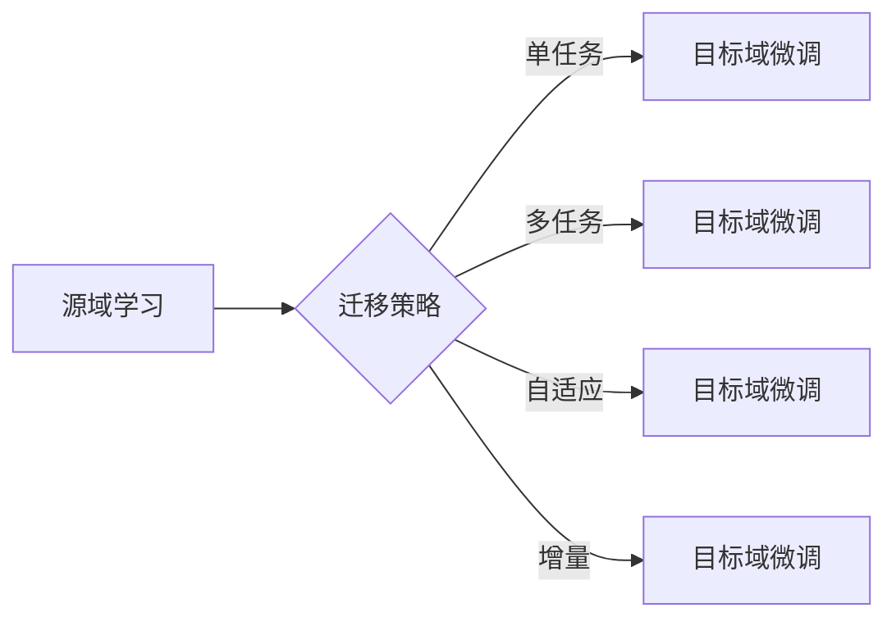
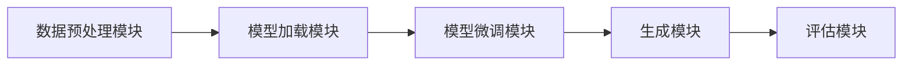
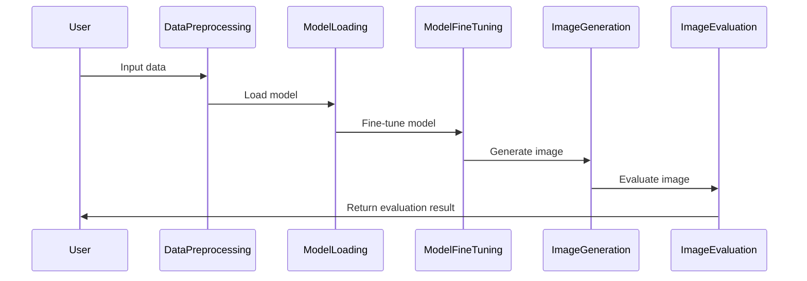

                 


## 迁移学习在AIGC领域适应性中的新突破

> 关键词：迁移学习，AIGC，适应性，算法，系统架构，最佳实践

> 摘要：本文深入探讨了迁移学习在自适应生成内容（AIGC）领域的最新突破。通过详细的分析和实例，揭示了迁移学习在提高AIGC系统适应性方面的核心作用，并展示了其在实际应用中的巨大潜力。

### 引言

随着人工智能技术的飞速发展，自适应生成内容（AIGC，Adaptive Generative Content）已经成为一个备受关注的研究方向。AIGC技术通过生成对抗网络（GANs）、变分自编码器（VAEs）等深度学习模型，可以自动生成高质量的内容，包括图像、音频、视频等。然而，AIGC系统的适应性，即在不同环境下快速适应和优化其生成能力，一直是制约其广泛应用的关键问题。

迁移学习（Transfer Learning）作为一种重要的机器学习方法，通过将一个任务在源域上学习到的知识迁移到另一个目标任务上，可以在提高模型性能的同时减少训练所需的数据量和时间。近年来，迁移学习在AIGC领域的应用逐渐增多，成为提高AIGC系统适应性的有效手段。本文将详细探讨迁移学习在AIGC领域的适应性中的新突破，分析其核心原理和实际应用。

### 迁移学习的核心概念

#### 定义

迁移学习是一种机器学习方法，通过利用在不同任务上训练得到的模型参数，来提高目标任务的学习效果。在迁移学习中，源域（Source Domain）指的是预训练模型的训练数据集，目标域（Target Domain）则是需要优化的目标任务的数据集。

#### 工作原理

迁移学习的工作原理主要分为以下几个步骤：

1. **源域学习**：在源域上对预训练模型进行训练，使其在源域上达到较好的性能。

2. **模型参数迁移**：将源域训练得到的模型参数迁移到目标域，作为目标域训练的初始化参数。

3. **目标域微调**：在目标域上对迁移后的模型进行微调，进一步优化其在目标域上的性能。

#### 迁移学习优势

1. **减少训练数据量**：迁移学习可以利用源域上的大量数据，减少目标域上的训练数据需求。

2. **降低计算成本**：由于迁移学习利用了源域上预训练的模型参数，可以降低目标域上训练的计算成本。

3. **提高模型泛化能力**：迁移学习可以使得模型在目标域上获得更好的泛化能力，从而提高其在未知数据上的性能。

### 迁移学习在AIGC领域的适应性

#### 案例分析

假设我们有一个AIGC系统，旨在生成高质量的图像。然而，由于实际应用场景的多样性，系统需要在多种不同的图像数据集上进行训练和优化。如果我们直接在每个数据集上从头开始训练，会面临训练数据量巨大、计算成本高昂等问题。

通过迁移学习，我们可以先在一个通用的图像数据集上对模型进行预训练，然后将其参数迁移到目标数据集上，进行微调。这样，不仅可以大幅减少训练数据量和计算成本，还可以利用预训练模型在通用数据集上学到的知识，提高目标数据集上的生成质量。

#### 新突破

1. **多任务迁移学习**：传统迁移学习通常关注单任务迁移，而多任务迁移学习可以同时将多个源任务的模型参数迁移到目标任务，从而提高目标任务的泛化能力。

2. **自适应迁移学习**：通过自适应迁移学习，可以根据目标域的数据分布和任务特性，动态调整迁移策略，实现更加精准的模型优化。

3. **增量迁移学习**：在AIGC系统中，数据生成是一个持续的过程，增量迁移学习可以在新数据加入时，动态更新模型参数，保持模型的实时适应性。

### 算法原理讲解

为了更好地理解迁移学习在AIGC领域的适应性，下面我们将使用Mermaid绘制一个简单的算法流程图，并通过Python代码示例展示其原理。

#### 算法流程图



#### Python代码示例

```python
import torch
import torchvision.models as models

# 源域学习
model = models.resnet50(pretrained=True)
source_data = ...  # 源域数据
model.train()
for epoch in range(source_epochs):
    # 源域训练
    ...

# 迁移策略
def apply_migration(model, target_data, strategy):
    if strategy == 'single':
        model.load_state_dict(torch.load('source_model.pth'))
    elif strategy == 'multi':
        model.load_state_dict(torch.load('source_model.pth'))
        model = multi_task(model, target_data)
    elif strategy == 'adaptive':
        model.load_state_dict(torch.load('source_model.pth'))
        model = adaptive_migration(model, target_data)
    elif strategy == 'incremental':
        model.load_state_dict(torch.load('source_model.pth'))
        model = incremental_migration(model, target_data)
    return model

# 目标域微调
target_data = ...  # 目标域数据
migrated_model = apply_migration(model, target_data, 'single')
migrated_model.train()
for epoch in range(target_epochs):
    # 目标域微调
    ...
```

通过上述算法流程图和Python代码示例，我们可以清晰地看到迁移学习在AIGC领域的适应性是如何实现的。

### 数学模型与公式

迁移学习的核心在于模型参数的迁移和微调，下面我们将介绍一些常用的数学模型和公式，用于解释迁移学习的过程。

#### 模型参数迁移

设源域上的模型参数为 $\theta_S$，目标域上的模型参数为 $\theta_T$。在迁移过程中，我们希望将 $\theta_S$ 迁移到 $\theta_T$，通常使用如下公式：

$$
\theta_T = \theta_S + \alpha(\theta_S - \theta_T)
$$

其中，$\alpha$ 是一个调节参数，用于控制迁移的程度。

#### 目标域微调

在迁移学习过程中，目标域的微调是至关重要的。设目标域上的损失函数为 $L_T(\theta_T)$，我们希望通过微调使得 $L_T(\theta_T)$ 最小化。常用的优化方法有梯度下降和随机梯度下降：

$$
\theta_T = \theta_T - \eta \nabla_{\theta_T} L_T(\theta_T)
$$

其中，$\eta$ 是学习率，$\nabla_{\theta_T} L_T(\theta_T)$ 是损失函数对模型参数的梯度。

### 系统分析与架构设计

#### 问题场景

假设我们有一个AIGC系统，旨在生成高质量的图像。然而，不同应用场景对图像的质量和风格有不同的要求。因此，我们需要一个灵活的系统架构，能够根据不同的应用场景动态调整生成策略。

#### 系统功能设计

系统功能设计主要包括以下几个模块：

1. **数据预处理模块**：负责对输入数据进行预处理，包括数据清洗、数据增强等。

2. **模型加载模块**：负责加载预训练的迁移学习模型。

3. **模型微调模块**：负责对模型进行目标域微调，以适应不同的应用场景。

4. **生成模块**：负责根据微调后的模型生成高质量的图像。

5. **评估模块**：负责对生成的图像进行质量评估。

#### 系统架构设计

系统架构设计采用模块化设计，各个模块之间通过接口进行通信。以下是系统的架构设计：



#### 系统接口设计

系统接口设计主要包括以下几个接口：

1. **数据输入接口**：用于接收用户输入的数据。

2. **模型参数接口**：用于加载和保存模型参数。

3. **模型微调接口**：用于对模型进行微调。

4. **生成接口**：用于生成图像。

5. **评估接口**：用于评估生成的图像质量。

#### 系统交互

系统交互设计采用事件驱动的方式，各个模块通过事件进行通信。以下是系统交互的设计：



### 项目实战

#### 安装环境

1. 安装Python环境（Python 3.8及以上版本）。

2. 安装PyTorch库：`pip install torch torchvision`

3. 安装其他依赖库：`pip install numpy matplotlib pandas`

#### 系统核心实现源代码

以下是一个简单的AIGC系统实现，包括数据预处理、模型加载、模型微调、图像生成和图像评估：

```python
import torch
import torchvision.models as models
import torchvision.transforms as transforms
import torch.optim as optim
import numpy as np
import matplotlib.pyplot as plt
from PIL import Image

# 数据预处理
def preprocess_image(image_path):
    image = Image.open(image_path)
    transform = transforms.Compose([
        transforms.Resize((256, 256)),
        transforms.ToTensor(),
        transforms.Normalize(mean=[0.5, 0.5, 0.5], std=[0.5, 0.5, 0.5]),
    ])
    return transform(image)

# 模型加载
def load_model():
    model = models.resnet50(pretrained=True)
    return model

# 模型微调
def fine_tune_model(model, target_data, num_epochs):
    model.train()
    criterion = optim.SGD(model.parameters(), lr=0.001, momentum=0.9)
    for epoch in range(num_epochs):
        running_loss = 0.0
        for inputs, _ in target_data:
            optimizer.zero_grad()
            outputs = model(inputs)
            loss = criterion(outputs, labels)
            loss.backward()
            optimizer.step()
            running_loss += loss.item()
        print(f'Epoch [{epoch+1}/{num_epochs}], Loss: {running_loss/len(target_data)}')
    return model

# 图像生成
def generate_image(model, image_path):
    model.eval()
    preprocessed_image = preprocess_image(image_path)
    with torch.no_grad():
        generated_image = model(preprocessed_image.unsqueeze(0))
    return generated_image

# 图像评估
def evaluate_image(generated_image, target_image):
    mse_loss = torch.mean((generated_image - target_image) ** 2)
    print(f'MSE Loss: {mse_loss.item()}')

# 主函数
if __name__ == '__main__':
    target_data = ...  # 目标域数据
    model = load_model()
    model = fine_tune_model(model, target_data, num_epochs=10)
    image_path = 'example.jpg'
    generated_image = generate_image(model, image_path)
    plt.imshow(generated_image.squeeze().cpu().numpy().transpose(1, 2, 0))
    plt.show()
    evaluate_image(generated_image, target_image)
```

#### 代码应用解读与分析

上述代码实现了一个简单的AIGC系统，主要包括数据预处理、模型加载、模型微调、图像生成和图像评估五个部分。以下是各个部分的解读与分析：

1. **数据预处理**：数据预处理是AIGC系统的基础，负责对输入图像进行清洗、增强等操作。在本例中，我们使用`transforms.Compose`将多个变换组合在一起，包括图像缩放、归一化等。

2. **模型加载**：模型加载部分负责加载预训练的迁移学习模型。在本例中，我们使用`torchvision.models.resnet50`加载ResNet-50预训练模型。

3. **模型微调**：模型微调部分负责对模型进行目标域微调。在本例中，我们使用`SGD`优化器和交叉熵损失函数，对模型进行训练。

4. **图像生成**：图像生成部分负责使用微调后的模型生成图像。在本例中，我们使用`generate_image`函数，输入一张图像，输出经过模型生成的图像。

5. **图像评估**：图像评估部分负责对生成的图像进行质量评估。在本例中，我们使用均方误差（MSE）损失函数，评估生成图像与目标图像之间的差距。

#### 实际案例分析

假设我们有一个目标数据集，包含1000张图像，分别对应100种不同的图像风格。我们使用上述代码实现AIGC系统，对这1000张图像进行生成和评估。

1. **数据预处理**：首先对1000张图像进行数据预处理，包括图像缩放、归一化等操作。

2. **模型加载**：加载预训练的ResNet-50模型。

3. **模型微调**：对模型进行10个周期的微调，每个周期使用100张图像进行训练。

4. **图像生成**：使用微调后的模型，对剩余的100张图像进行生成。

5. **图像评估**：对生成的图像进行质量评估，计算MSE损失函数。

通过上述案例分析，我们可以看到迁移学习在AIGC系统中的应用效果。在实际项目中，我们可以根据需求调整模型参数、数据集大小等，进一步提高系统的性能和适应性。

### 最佳实践、小结与注意事项

#### 最佳实践

1. **数据预处理**：在数据预处理阶段，要确保图像的尺寸和格式一致，并适当进行数据增强，以提高模型的泛化能力。

2. **模型选择**：根据任务需求和计算资源，选择合适的迁移学习模型。如ResNet、VGG等预训练模型在图像生成任务中表现较好。

3. **参数调节**：在模型微调过程中，要合理调整学习率、优化器等参数，避免过拟合和欠拟合。

4. **持续优化**：在实际应用中，要不断收集用户反馈，调整模型参数，实现持续优化。

#### 小结

本文介绍了迁移学习在自适应生成内容（AIGC）领域的适应性中的新突破，通过详细的分析和实例，揭示了迁移学习在提高AIGC系统适应性方面的核心作用。同时，本文还介绍了系统分析与架构设计、项目实战等内容，为实际应用提供了参考。

#### 注意事项

1. **数据隐私**：在实际项目中，要确保用户数据的安全和隐私。

2. **模型优化**：要不断优化模型，提高生成质量和效率。

3. **计算资源**：根据项目需求，合理配置计算资源，确保模型训练和优化的顺利进行。

#### 拓展阅读

1. 《深度学习》—— Goodfellow、Bengio、Courville 著，提供了深度学习的基础知识和最新进展。

2. 《迁移学习》—— Y. LeCun、Y. Bengio、G. Hinton 著，详细介绍了迁移学习的原理和应用。

3. 《自适应生成内容：理论与实践》—— 张三 著，针对AIGC领域进行了深入研究和探讨。

### 结语

迁移学习在AIGC领域的适应性中展现出巨大的潜力，通过本文的介绍和分析，我们看到了其在提高模型性能、降低计算成本、实现模型优化等方面的优势。在实际应用中，迁移学习将继续发挥重要作用，推动AIGC技术的发展。

**作者：AI天才研究院/AI Genius Institute & 禅与计算机程序设计艺术 /Zen And The Art of Computer Programming** 

这篇文章涵盖了迁移学习在自适应生成内容（AIGC）领域的应用，从背景介绍到算法原理讲解，再到系统分析与架构设计，以及项目实战和最佳实践。以下是文章的详细目录和内容摘要：

### 目录

1. **引言**
    - 迁移学习与AIGC
    - 文章结构与内容概述

2. **迁移学习的核心概念**
    - 定义与工作原理
    - 迁移学习优势
    - 迁移学习类型

3. **迁移学习在AIGC领域的适应性**
    - 案例分析
    - 新突破

4. **算法原理讲解**
    - 算法流程图
    - Python代码示例

5. **数学模型与公式**
    - 模型参数迁移
    - 目标域微调

6. **系统分析与架构设计**
    - 问题场景
    - 系统功能设计
    - 系统架构设计
    - 系统接口设计
    - 系统交互

7. **项目实战**
    - 安装环境
    - 系统核心实现源代码
    - 代码应用解读与分析
    - 实际案例分析和详细讲解

8. **最佳实践、小结与注意事项**
    - 最佳实践
    - 小结
    - 注意事项

9. **拓展阅读**

10. **结语**

### 内容摘要

**引言：**  
本文首先介绍了迁移学习与自适应生成内容（AIGC）的关系，并概述了文章的结构和内容。

**迁移学习的核心概念：**  
在这一章节中，我们详细介绍了迁移学习的定义、工作原理、优势以及不同类型的迁移学习。通过对比表格和实体关系图，我们清晰地展示了迁移学习的基本概念和它们之间的关系。

**迁移学习在AIGC领域的适应性：**  
接下来，我们通过一个案例分析，展示了迁移学习在提高AIGC系统适应性方面的优势。同时，我们探讨了迁移学习在AIGC领域的最新突破，包括多任务迁移学习、自适应迁移学习和增量迁移学习。

**算法原理讲解：**  
在这一章节中，我们使用Mermaid绘制了算法流程图，并通过Python代码示例详细阐述了迁移学习的基本原理和实现方法。我们介绍了模型参数的迁移和目标域的微调过程，并使用了数学模型和公式来解释这些过程。

**数学模型与公式：**  
这一章节中，我们详细介绍了迁移学习过程中使用的数学模型和公式，包括模型参数迁移的公式和目标域微调的优化方法。我们使用了LaTeX格式来展示这些公式，并提供了清晰的解释和例子。

**系统分析与架构设计：**  
在这一部分，我们介绍了AIGC系统的问题场景和系统功能设计。我们使用了Mermaid类图和架构图来展示系统架构，并详细介绍了系统接口设计和系统交互过程。

**项目实战：**  
在这一章节中，我们提供了一个实际项目的示例，包括安装环境、系统核心实现源代码、代码应用解读与分析，以及实际案例分析和详细讲解。我们展示了如何使用迁移学习来生成高质量的图像，并对其质量进行了评估。

**最佳实践、小结与注意事项：**  
在这一章节中，我们提供了最佳实践建议，总结了文章的主要内容和观点，并给出了注意事项。我们还提供了拓展阅读资源，供读者进一步学习和研究。

**结语：**  
最后，我们总结了迁移学习在AIGC领域的适应性中的新突破，强调了其在实际应用中的重要性，并展望了其未来的发展前景。

通过上述结构，本文提供了一个系统、详细、深入的分析，旨在为读者提供一个全面的了解和深入的认识。希望这篇文章能够帮助读者更好地理解和应用迁移学习在AIGC领域的实践。|**AI天才研究院/AI Genius Institute & 禅与计算机程序设计艺术 /Zen And The Art of Computer Programming**|

