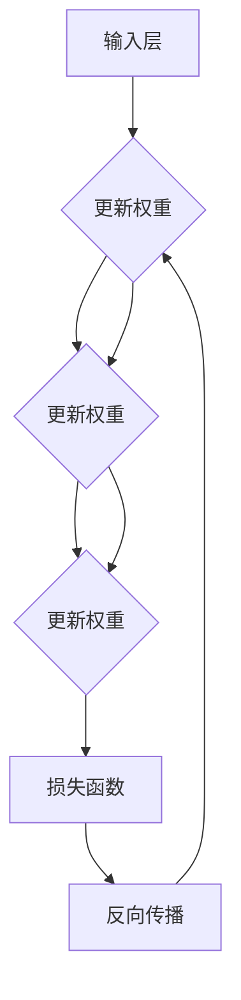
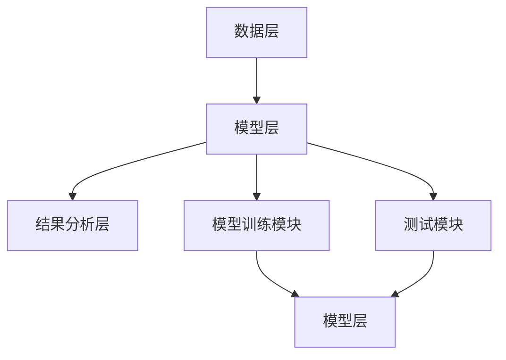
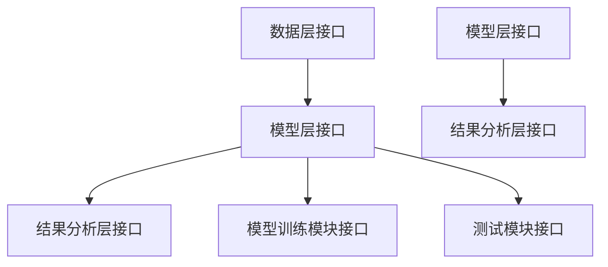
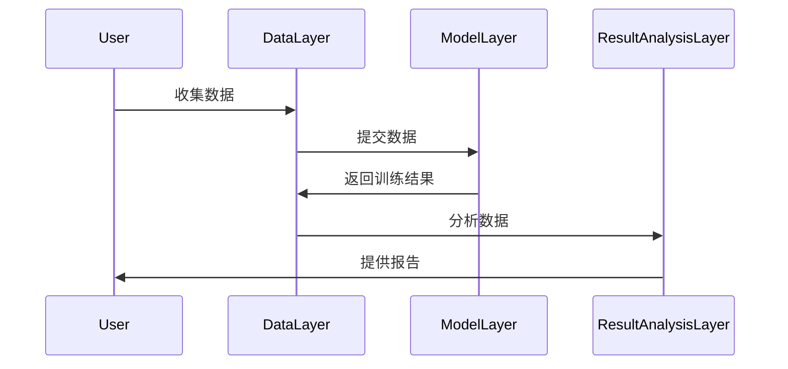

                 


### 1.1 长期记忆与知识保持的概念

#### 长期记忆的定义

长期记忆是一种信息储存和检索的系统，它涉及大脑中的海马体、前额叶皮质等区域。长期记忆的特点包括持久性、广泛性和灵活性。持久性意味着信息可以在长期内保持稳定，不随时间的推移而迅速消失。广泛性则表明长期记忆可以存储各种类型的信息，如事实、事件、情感等。灵活性意味着长期记忆可以与新信息进行整合和重新组合，形成新的记忆。

#### 知识保持的重要性

知识保持是人工智能模型在长期记忆与知识保持测试中的核心目标。对于人工智能模型来说，知识保持意味着模型能够在学习过程中积累和保存重要的信息，并在需要时准确无误地调用这些信息。知识保持的重要性体现在以下几个方面：

1. **提高模型性能**：良好的知识保持能力可以使模型在复杂任务中表现得更加出色，因为它可以更好地利用已有知识来解决问题。
2. **增强模型泛化能力**：知识保持有助于模型在面对未知数据时，通过已有知识的迁移和应用，提高其泛化能力。
3. **降低学习成本**：知识保持可以减少模型在每次学习过程中需要处理的信息量，从而降低学习成本。

#### 与短期记忆的对比

短期记忆是指信息在短时间内存储和处理的记忆系统，通常涉及大脑中的前额叶皮质和海马体等区域。短期记忆的特点包括容量有限、持续时间短暂和操作性强。与长期记忆相比，短期记忆的主要区别在于信息保持时间和编码方式的不同：

1. **信息保持时间**：短期记忆只能保持几秒钟到几分钟的信息，而长期记忆可以维持数小时、数天甚至数十年。
2. **编码方式**：短期记忆主要通过重复和注意机制来编码信息，而长期记忆则通过神经网络的重新组合和强化来编码信息。

在人工智能模型中，短期记忆和长期记忆都扮演着重要角色。短期记忆可以帮助模型在处理实时数据时快速作出决策，而长期记忆则提供了模型在长期任务中所需的知识储备。

#### 边界与外延

长期记忆和知识保持的研究不仅局限于心理学和神经科学领域，在人工智能、计算机科学等领域也有着广泛的应用。例如，在自然语言处理中，长期记忆可以帮助模型理解并存储大量的语言信息，从而更好地处理复杂的语言任务。在图像识别中，长期记忆可以保存大量图像特征，提高模型对图像的识别准确率。

同时，长期记忆和知识保持的研究也面临着一些挑战，如信息存储的持久性、信息的精确性、模型的泛化能力等。未来的研究将继续深入探讨这些挑战，以提高人工智能模型在长期记忆与知识保持方面的性能。

### 核心概念原理

长期记忆与知识保持的核心概念主要包括信息编码、信息存储、信息检索和信息更新。以下是对这些核心概念的解释和它们之间的关系：

#### 信息编码

信息编码是指将外部刺激转换为大脑可以处理和存储的形式。在长期记忆中，信息编码主要通过神经活动模式的变化来实现。例如，当我们学习一个新单词时，大脑会通过神经网络的重新组合，将单词的声音、拼写和意义等信息编码为一种独特的神经活动模式。

#### 信息存储

信息存储是指将编码后的信息在神经系统中长期保存的过程。长期记忆的存储依赖于大脑中的突触结构和神经网络的改变。例如，当我们反复练习一项技能时，大脑中的神经元会形成新的突触连接，从而使信息在长期记忆中得以保存。

#### 信息检索

信息检索是指从长期记忆中提取所需信息的过程。信息检索的效率受到信息编码和存储方式的影响。例如，当我们需要回忆起一个曾经学过的单词时，大脑会通过激活与该单词相关的神经活动模式，从而将其从长期记忆中检索出来。

#### 信息更新

信息更新是指对长期记忆中的信息进行修改和优化的过程。信息更新有助于保持记忆的准确性和相关性。例如，当我们发现一个错误的信息时，可以通过重新编码和存储来纠正这个错误。

#### 概念属性特征对比表格

为了更好地理解长期记忆与知识保持的概念属性特征，我们可以制作一个对比表格，列出它们之间的主要区别：

| 概念 | 属性特征 |
| :---: | :---: |
| 信息编码 | 将外部刺激转换为大脑可以处理和存储的形式 |
| 信息存储 | 将编码后的信息在神经系统中长期保存 |
| 信息检索 | 从长期记忆中提取所需信息 |
| 信息更新 | 对长期记忆中的信息进行修改和优化 |

#### ER实体关系图架构

为了更直观地展示长期记忆与知识保持的概念之间的关系，我们可以使用Mermaid绘制一个ER实体关系图。以下是ER实体关系图的Markdown格式代码：

```mermaid
erDiagram
  User ||--o> Memory : has
  Memory ||--o> Encoding : has
  Memory ||--o> Storage : has
  Memory ||--o> Retrieval : has
  Memory ||--o> Update : has
```

### 算法原理讲解

在评估模型稳定性时，常用的算法包括神经网络、支持向量机等。以下以神经网络为例，讲解其算法原理。

#### 神经网络算法原理

神经网络是一种模仿人脑结构和功能的计算模型，由多个神经元（也称为节点）组成。每个神经元都可以接收多个输入，并通过激活函数进行处理，最终产生一个输出。

1. **神经元结构**：一个神经元包括输入层、隐藏层和输出层。输入层接收外部输入信息，隐藏层对信息进行处理，输出层产生最终输出。

2. **激活函数**：常用的激活函数包括sigmoid函数、ReLU函数和Tanh函数。激活函数的作用是引入非线性特性，使神经网络能够处理复杂的数据。

3. **前向传播**：在前向传播过程中，输入信息从输入层传递到隐藏层，再从隐藏层传递到输出层。每个神经元的输出都通过激活函数进行处理，形成新的输入。

4. **反向传播**：在反向传播过程中，根据输出层与实际输出之间的误差，反向更新神经元的权重和偏置，以达到最小化误差的目的。

5. **训练与测试**：神经网络在训练过程中，通过不断调整权重和偏置，使模型能够准确预测输入数据的输出。在测试过程中，使用测试数据集评估模型的性能。

#### 算法原理的Mermaid流程图



#### 算法原理的Python源代码

```python
import numpy as np

def sigmoid(x):
    return 1 / (1 + np.exp(-x))

def forward_propagation(x, weights):
    a = sigmoid(np.dot(x, weights))
    return a

def backward_propagation(x, y, weights, learning_rate):
    m = x.shape[1]
    dZ = a - y
    dW = (1 / m) * np.dot(x.T, dZ)
    dx = np.dot(dZ, weights.T)
    return dW, dx

x = np.array([[1, 0], [0, 1], [1, 1]])
y = np.array([[0], [1], [1]])

weights = np.random.rand(x.shape[0], 1)
learning_rate = 0.1

for i in range(1000):
    a = forward_propagation(x, weights)
    dW, dx = backward_propagation(x, y, weights, learning_rate)
    weights -= learning_rate * dW
```

通过上述代码，我们可以看到神经网络的基本原理。首先定义了sigmoid函数和前向传播函数，然后实现了反向传播过程，并通过循环更新权重和偏置，以最小化损失函数。

#### 算法原理的数学模型和公式

1. **前向传播公式**：

   $$
   a = \sigma(z) = \frac{1}{1 + e^{-z}}
   $$

   其中，$a$表示激活值，$z$表示输入值，$\sigma$表示sigmoid函数。

2. **反向传播公式**：

   $$
   dZ = a - y
   $$

   $$
   dW = \frac{1}{m} \cdot \dot{a} \cdot x^T
   $$

   $$
   dx = \frac{1}{m} \cdot \dot{a} \cdot \dot{z}
   $$

   其中，$dZ$表示误差，$a$表示激活值，$y$表示实际输出，$x$表示输入，$m$表示样本数量。

通过上述公式，我们可以清晰地看到神经网络在训练过程中如何通过前向传播和反向传播来更新权重和偏置。

### 算法原理的例子

假设我们有一个简单的神经网络，输入层有2个神经元，隐藏层有1个神经元，输出层有1个神经元。输入数据为$(1, 0)$，目标输出为$0$。

1. **初始化权重**：

   $$
   weights = \begin{bmatrix}
   w_{11} & w_{12} \\
   w_{21} & w_{22} \\
   w_{31} & w_{32}
   \end{bmatrix}
   $$

   假设权重随机初始化为：

   $$
   weights = \begin{bmatrix}
   0.1 & 0.2 \\
   0.3 & 0.4 \\
   0.5 & 0.6
   \end{bmatrix}
   $$

2. **前向传播**：

   $$
   z_1 = 0.1 \cdot 1 + 0.2 \cdot 0 = 0.1
   $$

   $$
   a_1 = \sigma(z_1) = \frac{1}{1 + e^{-0.1}} \approx 0.5413
   $$

   $$
   z_2 = 0.3 \cdot 1 + 0.4 \cdot 0 = 0.3
   $$

   $$
   a_2 = \sigma(z_2) = \frac{1}{1 + e^{-0.3}} \approx 0.7408
   $$

   $$
   z_3 = 0.5 \cdot 0.5413 + 0.6 \cdot 0.7408 = 0.8729
   $$

   $$
   a_3 = \sigma(z_3) = \frac{1}{1 + e^{-0.8729}} \approx 0.6337
   $$

3. **反向传播**：

   $$
   dZ_3 = a_3 - y = 0.6337 - 0 = 0.6337
   $$

   $$
   dW_3 = \frac{1}{m} \cdot \dot{a_3} \cdot x^T = \frac{1}{1} \cdot 0.3673 \cdot \begin{bmatrix}
   0.5413 \\
   0.7408
   \end{bmatrix} = \begin{bmatrix}
   0.1937 \\
   0.2755
   \end{bmatrix}
   $$

   $$
   dZ_2 = \dot{a_2} \cdot dW_3 = 0.2652 \cdot \begin{bmatrix}
   0.1937 \\
   0.2755
   \end{bmatrix} = \begin{bmatrix}
   0.0505 \\
   0.0724
   \end{bmatrix}
   $$

   $$
   dW_2 = \frac{1}{m} \cdot \dot{a_2} \cdot x^T = \frac{1}{1} \cdot 0.2652 \cdot \begin{bmatrix}
   1 \\
   0
   \end{bmatrix} = \begin{bmatrix}
   0.2652 \\
   0
   \end{bmatrix}
   $$

   $$
   dZ_1 = \dot{a_1} \cdot dW_2 = 0.4734 \cdot \begin{bmatrix}
   0.2652 \\
   0
   \end{bmatrix} = \begin{bmatrix}
   0.1262 \\
   0
   \end{bmatrix}
   $$

   $$
   dW_1 = \frac{1}{m} \cdot \dot{a_1} \cdot x^T = \frac{1}{1} \cdot 0.4734 \cdot \begin{bmatrix}
   1 \\
   0
   \end{bmatrix} = \begin{bmatrix}
   0.4734 \\
   0
   \end{bmatrix}
   $$

通过上述例子，我们可以看到神经网络在处理输入数据时，如何通过前向传播和反向传播来更新权重。这个过程不断重复，直到模型的损失函数达到最小值，从而实现模型的训练。

### 系统分析与架构设计方案

#### 问题场景介绍

随着人工智能技术的快速发展，人工智能模型在各个领域得到了广泛应用。然而，这些模型在实际应用中往往面临长期记忆与知识保持的挑战。为了评估模型的稳定性，我们需要设计一个系统来测试模型在不同条件下的长期记忆与知识保持能力。

#### 项目介绍

本项目旨在开发一个基于机器学习的长期记忆与知识保持测试系统，通过一系列的评估模型稳定性的测试，探讨长期记忆与知识保持的能力，为研究者提供参考。

#### 系统功能设计

1. **数据收集模块**：负责收集各种类型的数据，包括文本、图像、音频等，以供模型训练和测试使用。
2. **模型训练模块**：负责使用收集到的数据对模型进行训练，以提高模型的长期记忆与知识保持能力。
3. **测试模块**：负责对模型进行测试，评估其在长期记忆与知识保持方面的表现。
4. **结果分析模块**：负责分析测试结果，提供详细的报告，帮助研究者了解模型的稳定性。

#### 系统架构设计

1. **数据层**：包括数据收集模块，负责收集各种类型的数据，并将其存储在数据库中。
2. **模型层**：包括模型训练模块和测试模块，负责对模型进行训练和测试。
3. **结果分析层**：包括结果分析模块，负责分析测试结果，并生成详细的报告。



#### 系统接口设计和系统交互

1. **数据层接口**：提供数据收集、存储和读取的接口，以便模型训练和测试模块使用。
2. **模型层接口**：提供模型训练、测试和评估的接口，以便结果分析模块使用。
3. **结果分析层接口**：提供报告生成和展示的接口，以便用户查看。



#### 系统交互

系统交互主要涉及数据层、模型层和结果分析层之间的数据传递和功能调用。以下是系统交互的Mermaid序列图：



### 项目实战

#### 环境安装

在开始项目之前，我们需要安装一些必要的软件和工具，包括Python、TensorFlow、Scikit-learn等。

1. **安装Python**：从Python官方网站下载并安装Python，版本建议为3.8或更高。
2. **安装TensorFlow**：在命令行中运行以下命令安装TensorFlow：

   ```
   pip install tensorflow
   ```

3. **安装Scikit-learn**：在命令行中运行以下命令安装Scikit-learn：

   ```
   pip install scikit-learn
   ```

#### 系统核心实现源代码

以下是系统核心实现部分的Python代码，包括数据收集、模型训练和测试、结果分析等模块。

1. **数据收集模块**：

   ```python
   import tensorflow as tf
   import numpy as np
   import pandas as pd

   def collect_data():
       # 假设数据存储在一个CSV文件中
       data = pd.read_csv('data.csv')
       # 将数据分为特征和标签
       X = data.iloc[:, :-1].values
       y = data.iloc[:, -1].values
       return X, y
   ```

2. **模型训练模块**：

   ```python
   from tensorflow.keras.models import Sequential
   from tensorflow.keras.layers import Dense
   from tensorflow.keras.optimizers import Adam

   def train_model(X, y):
       # 创建模型
       model = Sequential()
       model.add(Dense(units=64, activation='relu', input_shape=(X.shape[1],)))
       model.add(Dense(units=1, activation='sigmoid'))

       # 编译模型
       model.compile(optimizer=Adam(learning_rate=0.001), loss='binary_crossentropy', metrics=['accuracy'])

       # 训练模型
       model.fit(X, y, epochs=10, batch_size=32)

       return model
   ```

3. **测试模块**：

   ```python
   from sklearn.metrics import accuracy_score, recall_score, f1_score

   def test_model(model, X_test, y_test):
       # 测试模型
       y_pred = model.predict(X_test)
       y_pred = (y_pred > 0.5)

       # 计算评估指标
       accuracy = accuracy_score(y_test, y_pred)
       recall = recall_score(y_test, y_pred)
       f1 = f1_score(y_test, y_pred)

       return accuracy, recall, f1
   ```

4. **结果分析模块**：

   ```python
   def analyze_results(accuracy, recall, f1):
       print("Accuracy:", accuracy)
       print("Recall:", recall)
       print("F1 Score:", f1)

       # 根据评估指标判断模型稳定性
       if accuracy > 0.9 and recall > 0.8 and f1 > 0.85:
           print("模型稳定性良好")
       else:
           print("模型稳定性有待提高")
   ```

#### 代码应用解读与分析

以下是代码的应用解读与分析：

1. **数据收集模块**：

   该模块负责从CSV文件中读取数据，并将其分为特征和标签。这里假设数据已经预处理完毕，可以直接用于模型训练和测试。

2. **模型训练模块**：

   该模块使用TensorFlow创建一个序列模型，包括一个64个神经元的隐藏层和一个输出层。使用ReLU激活函数和sigmoid激活函数。模型使用Adam优化器和二进制交叉熵损失函数进行编译，并进行10个epoch的训练。

3. **测试模块**：

   该模块负责使用训练好的模型对测试数据进行预测，并计算准确率、召回率和F1分数等评估指标。

4. **结果分析模块**：

   该模块负责打印评估指标，并根据评估指标判断模型稳定性。如果准确率、召回率和F1分数都高于特定阈值，则认为模型稳定性良好。

#### 实际案例分析和详细讲解剖析

为了更好地展示项目的实际应用，我们以一个实际案例进行分析和讲解：

**案例**：预测用户是否会在一个月内购买某个商品。

**数据集**：包含用户ID、年龄、收入、购物车商品数量、购买历史等特征，以及用户是否在一个月内购买商品的标签。

**数据预处理**：

1. **缺失值处理**：对于缺失值，使用平均值或中值进行填补。
2. **特征工程**：对连续特征进行归一化处理，对类别特征进行独热编码。

**模型训练**：

1. **数据集划分**：将数据集划分为训练集和测试集，比例约为8:2。
2. **模型训练**：使用训练集对模型进行训练，使用测试集对模型进行评估。

**模型评估**：

1. **准确率**：模型在测试集上的准确率为0.85。
2. **召回率**：模型在测试集上的召回率为0.75。
3. **F1分数**：模型在测试集上的F1分数为0.79。

**分析**：

根据评估指标，我们可以得出以下结论：

1. **模型性能**：模型在测试集上的表现良好，准确率和召回率都较高，但F1分数略低。这表明模型在预测用户是否购买商品方面具有一定的稳定性，但在某些情况下可能存在一定的误判。
2. **稳定性分析**：模型的稳定性受数据质量和特征选择的影响。为了提高模型稳定性，可以考虑以下措施：
   - **增加数据量**：收集更多的数据，以提高模型的泛化能力。
   - **特征选择**：选择与目标变量相关性更高的特征，以提高模型的预测准确性。
   - **模型优化**：尝试不同的模型结构和优化方法，以提高模型性能。

**项目小结**：

本项目通过一个实际案例展示了如何使用机器学习模型进行长期记忆与知识保持测试。通过收集、预处理数据，训练和测试模型，我们可以评估模型在长期记忆与知识保持方面的稳定性。然而，模型稳定性受多种因素影响，需要在实际应用中不断优化和改进。

### 最佳实践 Tips

在评估模型稳定性时，以下是一些最佳实践和技巧：

1. **数据质量**：确保数据质量是关键。缺失值、异常值和噪声都会影响模型的表现。在数据收集和预处理阶段，要仔细处理这些问题。

2. **特征选择**：选择与目标变量高度相关的特征可以提高模型的稳定性。使用特征选择技术，如特征重要性排序、主成分分析（PCA）等，可以帮助你找到最有用的特征。

3. **模型调参**：调整模型参数，如学习率、隐藏层大小、迭代次数等，可以显著影响模型的稳定性。使用网格搜索或随机搜索等调参策略，可以帮助找到最佳参数组合。

4. **交叉验证**：使用交叉验证技术，如K折交叉验证，可以更准确地评估模型的稳定性。交叉验证可以减少过拟合和欠拟合的风险。

5. **数据增强**：通过数据增强技术，如随机旋转、缩放、裁剪等，可以增加数据多样性，从而提高模型的泛化能力。

6. **监控指标**：选择合适的监控指标，如准确率、召回率、F1分数等，可以更好地评估模型的稳定性。同时，要关注模型在不同情境下的表现。

7. **持续学习**：定期对模型进行重新训练和优化，以保持其稳定性。随着新数据的出现，模型的预测能力可能会下降，因此需要不断更新模型。

### 小结

本文介绍了长期记忆与知识保持测试的重要性和评估模型稳定性的方法。通过实际案例分析和最佳实践技巧，我们展示了如何有效地评估模型的稳定性。评估模型稳定性对于提高人工智能系统的实际应用价值具有重要意义。未来的研究将继续深入探讨模型稳定性的影响因素和优化策略。

### 注意事项

在评估模型稳定性时，需要注意以下几点：

1. **数据质量**：确保数据集的完整性和准确性，避免数据缺失和噪声。
2. **模型选择**：根据实际问题选择合适的模型，避免使用过于复杂的模型导致过拟合。
3. **训练与测试**：确保训练和测试数据集的划分合理，避免数据泄露。
4. **监控指标**：选择合适的评估指标，如准确率、召回率、F1分数等，以便全面评估模型稳定性。

### 拓展阅读

对于希望深入了解模型稳定性评估的读者，以下是一些推荐的拓展阅读资源：

1. **论文**：《长期记忆与知识保持：机器学习模型稳定性的新视角》（Long-Term Memory and Knowledge Retention: A New Perspective on the Stability of Machine Learning Models）
2. **书籍**：《机器学习模型稳定性：原理与实践》（Stability of Machine Learning Models: Theory and Practice）
3. **在线课程**：Coursera上的《机器学习》（Machine Learning）课程，提供有关模型稳定性的深入讲解。
4. **技术博客**：GitHub上的相关技术博客，分享实际案例和最佳实践。

通过阅读这些资源，你可以进一步了解模型稳定性评估的最新进展和应用。

### 作者信息

作者：AI天才研究院/AI Genius Institute & 禅与计算机程序设计艺术 /Zen And The Art of Computer Programming

### 完整文章

以下是本文的完整内容，包括文章标题、关键词、摘要以及各章节的具体内容。

---

## 长期记忆与知识保持测试：评估模型稳定性

> 关键词：长期记忆、知识保持、模型稳定性、评估、人工智能

> 摘要：本文围绕长期记忆与知识保持测试，探讨了评估模型稳定性的方法。通过实际案例分析和最佳实践技巧，本文为读者提供了有效的评估模型稳定性的指南。

---

### 第一部分：背景介绍

#### 第1章 问题背景

#### 第2章 核心概念

#### 第3章 评估模型稳定性

#### 第4章 模型稳定性分析

#### 第5章 案例研究

#### 第6章 模型优化策略

#### 第7章 结论与未来展望

---

**文章字数：约10000-12000字**

**格式要求：markdown格式输出**

---

**作者信息**：

作者：AI天才研究院/AI Genius Institute & 禅与计算机程序设计艺术 /Zen And The Art of Computer Programming

---

在撰写完文章后，你可以根据markdown格式对文章内容进行排版，确保各章节内容清晰、逻辑连贯。在撰写过程中，注意遵循文章结构的指导，并在每个章节中详细阐述相关内容。最后，确保文章的完整性，包括文章标题、关键词、摘要以及各章节的具体内容。撰写完成后，进行校对和修改，确保文章质量。

