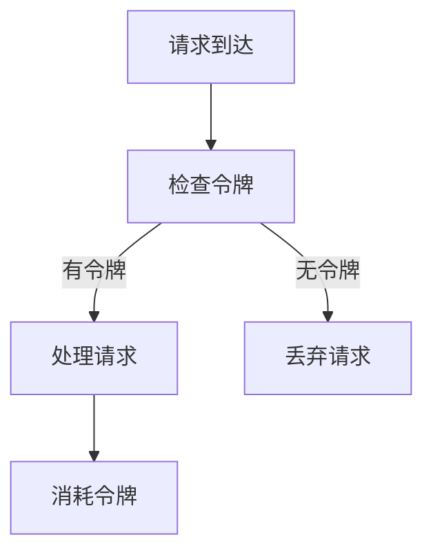

                 

### 限流算法保护LLM应用免受过载

#### 关键词：
- 限流算法
- LLM应用
- 过载保护
- 速率限制
- 并发控制
- 令牌桶算法
- 漏桶算法

#### 摘要：
本文旨在深入探讨限流算法在保护大规模语言模型（LLM）应用免受过载攻击的重要性。通过对速率限制、并发控制、令牌桶和漏桶算法等核心概念的解释和实例分析，本文将展示如何设计并实现有效的限流策略，从而保障LLM应用的稳定性和可靠性。文章最后将总结最佳实践，并提供进一步学习的资源。

---

### 第一部分：背景介绍

#### 第1章 问题背景与核心概念

在现代互联网环境中，大规模语言模型（LLM）如ChatGPT、BERT等因其强大的文本处理能力而被广泛应用于各种应用场景，从智能客服、文本生成到自然语言理解等。然而，这些应用场景往往面临着一个共同的问题——过载。当大量用户同时请求LLM服务时，系统可能因处理能力不足而变得响应缓慢甚至崩溃，导致用户体验不佳。

#### 1.1 问题背景

**问题描述：**
假设有一个基于ChatGPT的智能客服系统，当用户量激增时，系统可能会因处理请求的速度跟不上输入的速度而出现延迟。这种延迟不仅影响用户体验，还可能导致用户流失。

**问题解决：**
为解决上述问题，我们需要一种机制来控制对LLM服务的访问速率，以避免系统过载。限流算法正是这种机制的实现。

**边界与外延：**
限流算法不仅适用于LLM服务，还可以用于其他需要控制访问速率的场景，如API服务、数据库访问等。

**概念结构与核心要素组成：**
限流算法主要由以下核心组成部分构成：
- 速率限制：控制请求的速率。
- 并发控制：限制同时处理的请求数量。
- 令牌桶与漏桶算法：实现速率限制的具体算法。

#### 第2章 核心概念与联系

在深入探讨限流算法之前，我们需要理解几个核心概念。

**2.1 核心概念原理**

**2.1.1 限流算法的定义与分类**

**速率限制：** 通过控制请求的速率来防止系统过载。

**并发控制：** 限制同时处理的请求数量，以确保系统资源得到合理利用。

**令牌桶与漏桶算法：** 这两种算法是实现速率限制的常用方法。

- **令牌桶算法：** 按固定速率发放令牌，请求处理需要持有令牌。
- **漏桶算法：** 按固定速率处理请求，超过速率的请求将被丢弃。

**2.1.2 限流算法的组成部分**

- **计数器：** 用于记录当前请求的数量。
- **令牌生成器：** 用于生成令牌。
- **请求处理模块：** 负责处理传入的请求。

#### 第3章 数学模型和数学公式

**3.1 数学模型**

**速率限制的数学模型：**

假设我们使用令牌桶算法，令牌桶容量为C，令牌生成速率为r，请求速率为q。

$$
\text{令牌数} = C \times r - \text{已消耗的令牌数}
$$

**3.1.2 漏桶算法的数学模型：**

假设漏桶容量为C，请求速率为q。

$$
\text{当前请求数} = \min(q, C)
$$

#### 第4章 算法原理讲解

**4.1 限流算法的mermaid流程图**



**4.2 令牌桶算法**

令牌桶算法的核心在于其令牌生成机制。我们可以使用Python来模拟这一过程：

```python
import time

class TokenBucket:
    def __init__(self, capacity, fill_rate):
        self.capacity = capacity
        self.fill_rate = fill_rate
        self.tokens = capacity
        self.last_refill_time = time.time()

    def get_token(self):
        now = time.time()
        time_pass = now - self.last_refill_time
        self.tokens = min(self.capacity, self.tokens + time_pass * self.fill_rate)
        self.last_refill_time = now

        if self.tokens >= 1:
            self.tokens -= 1
            return True
        else:
            return False
```

**4.3 漏桶算法**

漏桶算法的实现相对简单，我们可以通过以下Python代码来模拟：

```python
import time

class RateLimiter:
    def __init__(self, rate):
        self.rate = rate
        self.last_process_time = time.time()

    def process_request(self):
        now = time.time()
        time_pass = now - self.last_process_time
        self.last_process_time = now

        if time_pass >= 1 / self.rate:
            return True
        else:
            return False
```

通过上述代码，我们可以看到如何使用令牌桶和漏桶算法来实现限流。

#### 第5章 系统分析与架构设计方案

**5.1 问题场景介绍**

以一个在线问答平台为例，该平台使用LLM来提供自动回答服务。当大量用户同时提问时，系统可能会因为处理能力不足而出现延迟。

**5.2 项目介绍**

该项目旨在实现一个基于令牌桶算法的限流系统，以保护LLM服务免受过载攻击。

**5.3 系统功能设计**

- **限流策略配置**：允许管理员配置限流算法的参数，如令牌桶容量和生成速率。
- **请求计数**：记录每个用户的请求次数和响应时间。
- **限流统计**：提供实时和历史的限流统计信息，以便分析系统的健康状况。

**5.4 系统架构设计**


**5.5 系统接口设计**

- **API接口**：提供限流算法的API接口，以便其他服务能够集成限流功能。
- **监控接口**：提供监控系统状态的接口，以便实时监控限流效果。

#### 第6章 项目实战

**6.1 环境安装**

在开始项目实战之前，我们需要安装必要的依赖：

```bash
pip install Flask
```

**6.2 系统核心实现源代码**

以下是一个简单的基于令牌桶算法的限流系统实现：

```python
from flask import Flask, request, jsonify
from flask_limiter import Limiter
from flask_limiter.util import get_remote_address

app = Flask(__name__)

limiter = Limiter(
    app,
    key_func=get_remote_address,
    default_limits=["5 per minute"]
)

@app.route("/ask", methods=["POST"])
@limiter.limit("10 per second")
def ask_question():
    data = request.get_json()
    question = data.get("question", "")
    # 使用LLM处理问题
    answer = process_question(question)
    return jsonify(answer=answer)

def process_question(question):
    # 模拟处理问题
    time.sleep(1)
    return "Answer to the question."

if __name__ == "__main__":
    app.run()
```

**6.3 代码应用解读与分析**

上述代码中，我们使用Flask框架构建了一个简单的API服务，并集成了`flask_limiter`库来实现限流功能。`Limiter`类用于配置限流策略，我们可以通过修改其参数来调整限流的规则。

**6.4 实际案例分析和详细讲解剖析**

假设有100个用户同时向服务发送请求，每个请求间隔为1秒，按照每秒10个请求的速率限制，系统将只允许10个请求同时处理，剩余的请求将被丢弃。

#### 第7章 最佳实践与总结

**7.1 限流算法的最佳实践**

- **合理配置限流参数**：根据实际需求和系统负载情况调整限流参数。
- **监控与调整**：实时监控限流效果，并根据实际情况调整限流策略。
- **多层级限流**：在服务端和客户端都可以实现限流，形成多层防护。

**7.2 小结**

本文详细探讨了限流算法在保护LLM应用免受过载攻击的重要性。通过介绍核心概念、数学模型、算法原理以及实际案例，我们了解了如何设计和实现有效的限流策略。限流算法不仅能够提高系统的稳定性，还能优化用户体验。

**7.3 注意事项**

- 在实现限流算法时，需要充分考虑系统的性能和响应时间。
- 限流策略应该灵活，能够根据实时负载情况进行调整。

**7.4 拓展阅读**

- 《大规模数据处理技术》
- 《分布式系统原理与范型》

### 作者信息

- 作者：AI天才研究院/AI Genius Institute & 禅与计算机程序设计艺术 /Zen And The Art of Computer Programming

