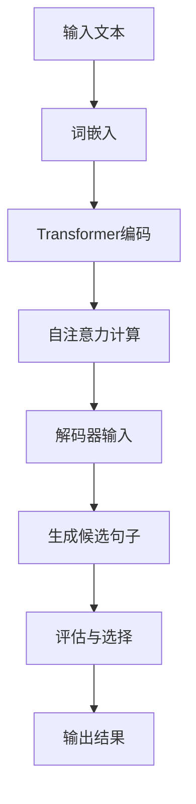
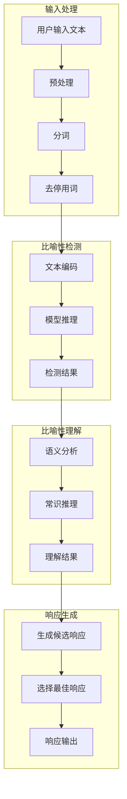
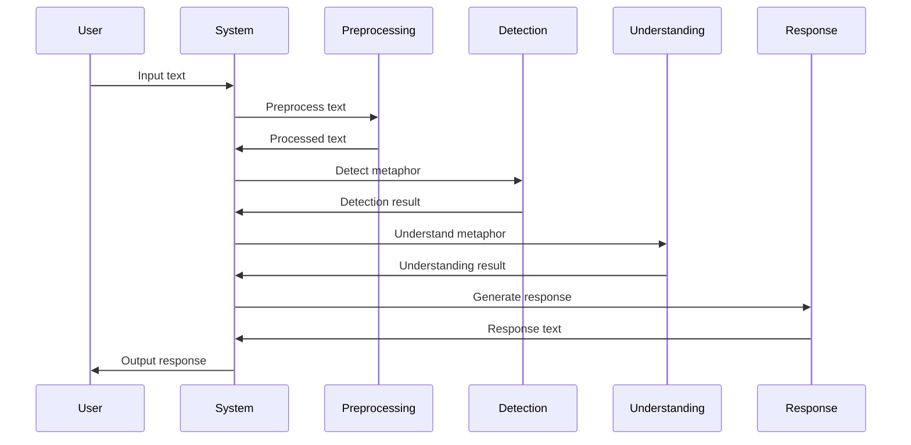

                 

## 隐喻的理解与分类

### 2.1.1 隐喻的定义

隐喻（Metaphor）是一种修辞手法，通过将一个事物或概念比作另一个事物或概念来传达意义。隐喻的核心在于“借形传意”，即借助某一具体、熟悉的形象来暗示另一抽象、不易直接理解的概念。例如，“时间是金钱”（Time is money）这个隐喻将时间比作金钱，以强调时间的珍贵和不可浪费。

隐喻在自然语言中广泛存在，不仅丰富了我们的表达方式，还在语言学习和理解中发挥着重要作用。儿童在语言习得过程中，隐喻的理解和使用是一个关键步骤。此外，隐喻还在文学创作、商业广告、演讲辩论等各个领域得到广泛应用。

### 2.1.2 隐喻的分类

隐喻可以根据其表达方式和语义特点进行分类。以下是一些常见的隐喻类型：

1. **暗喻**（Concealed Metaphor）
   暗喻是指隐喻关系隐含在文本中，通常不直接陈述。例如，“他是个活字典”（He is a living dictionary）中，“活字典”就是暗喻，没有直接说明。

2. **明喻**（Overt Metaphor）
   明喻则是通过明显的比喻词（如“像”、“似”）将两个事物联系起来。例如，“她的眼睛像星星”（Her eyes are like stars），这里的比喻关系非常直接。

3. **借喻**（Proper Metaphor）
   借喻是指使用一个词作为比喻，这个词在比喻语境中具有特定的意义，而在原语境中并不具有这种意义。例如，“他是我们的指路明灯”（He is our guiding light），在这里，“指路明灯”这个短语本身就是一个比喻。

4. **隐喻性短语**（Metaphorical Phrase）
   隐喻性短语是由多个词组成的短语，其整体意义通过比喻来传达。例如，“冰山一角”（The tip of the iceberg）用来形容只看到事物的一部分，而不是全部。

5. **比喻性句子**（Metaphorical Sentence）
   比喻性句子是通过比喻来表达完整意思的句子。例如，“他像一座灯塔，照亮了我们前行的道路”（He is like a lighthouse, guiding us through the darkness），这个句子通过比喻来传达“他是个重要的引导者”的意思。

### 2.1.3 隐喻的语义特点

隐喻的语义特点主要体现在以下几个方面：

1. **隐含性**（Implication）
   隐喻通常不直接陈述意思，而是通过隐含的语义关系来传达。例如，“他是个铁人”（He is an ironman），这里的“铁人”并不是指他真的像铁一样坚硬，而是指他非常坚强和坚韧。

2. **多义性**（Polysemy）
   隐喻往往具有多义性，一个隐喻可能在不同的语境中有不同的解释。例如，“他是我们的灵魂歌手”（He is our soul singer），这里的“灵魂歌手”既可以指音乐上的灵魂人物，也可以指情感上的安慰者。

3. **模糊性**（Ambiguity）
   隐喻的模糊性使得理解它需要一定的上下文信息。例如，“她是个高手”（She is a master），这里的“高手”可能指的是棋艺高手，也可能是烹饪高手。

4. **文化依赖性**（Cultural Dependency）
   隐喻的理解往往受到文化背景的影响。不同文化中可能存在不同的隐喻表达方式。例如，在某些文化中，“马”可能象征着速度和力量，而在其他文化中，“龙”可能具有类似的象征意义。

### 2.1.4 隐喻的作用

隐喻在语言中的作用多样，主要包括：

1. **增加表达力度**（Enhance Expressiveness）
   隐喻通过将抽象概念具体化，使得表达更加生动、形象。例如，“她的笑容如阳光般温暖”（Her smile is as warm as the sunshine）。

2. **创造新概念**（Create New Concepts）
   隐喻可以创造出新的概念或表达方式，丰富语言的表达能力。例如，“他是个数据魔法师”（He is a data magician），这里将数据处理能力比作魔法。

3. **促进理解**（Facilitate Understanding）
   隐喻通过比喻关系帮助听众或读者理解复杂的抽象概念。例如，“时间就像流水一样，一去不复返”（Time flows like water, once gone, it never returns），这里通过比喻使时间流逝的概念更加易于理解。

4. **文化传承**（Cultural Transmission）
   隐喻是文化传承的重要方式之一，它通过比喻关系传递特定的价值观、信仰和习俗。例如，许多文化中的寓言和神话故事都包含了丰富的隐喻元素，帮助人们理解和继承传统文化。

### 概念属性特征对比表格

| 隐喻类型      | 定义                                       | 示例                            |
|------------|------------------------------------------|-------------------------------|
| 暗喻          | 隐喻关系隐含在文本中，不直接陈述             | “他是个活字典”                |
| 明喻          | 通过明显的比喻词（如“像”、“似”）将两个事物联系起来 | “她的眼睛像星星”              |
| 借喻          | 使用一个词作为比喻，在比喻语境中具有特定意义      | “他是我们的指路明灯”          |
| 隐喻性短语     | 由多个词组成的短语，整体意义通过比喻来传达        | “冰山一角”                    |
| 比喻性句子     | 通过比喻来表达完整意思的句子                    | “他像一座灯塔，照亮了我们前行的道路” |

### ER实体关系图架构的Mermaid流程图

```mermaid
erDiagram
  Person --> Metaphor
  Person ||--|{ Speaker }|--| Metaphor
  Speaker ||--|{ Context }|--| Metaphor
  Context ||--|{ Culture }|--| Metaphor
  Person ||..|{ Understanding }|--| Metaphor
```

在这个ER图中，`Person`（人）与`Metaphor`（隐喻）之间存在关系，`Speaker`（说话者）、`Context`（上下文）和`Culture`（文化）则是影响隐喻理解和表达的重要因素。

## 第二部分：核心概念与联系

### 2.1 隐喻的理解与分类

#### 2.1.1 隐喻的定义

隐喻是一种修辞手法，通过将一个事物或概念比作另一个事物或概念来传达意义。隐喻的核心在于“借形传意”，即借助某一具体、熟悉的形象来暗示另一抽象、不易直接理解的概念。例如，“时间是金钱”（Time is money）这个隐喻将时间比作金钱，以强调时间的珍贵和不可浪费。

隐喻在自然语言中广泛存在，不仅丰富了我们的表达方式，还在语言学习和理解中发挥着重要作用。儿童在语言习得过程中，隐喻的理解和使用是一个关键步骤。此外，隐喻还在文学创作、商业广告、演讲辩论等各个领域得到广泛应用。

#### 2.1.2 隐喻的分类

隐喻可以根据其表达方式和语义特点进行分类。以下是一些常见的隐喻类型：

1. **暗喻**（Concealed Metaphor）
   暗喻是指隐喻关系隐含在文本中，通常不直接陈述。例如，“他是个活字典”（He is a living dictionary）中，“活字典”就是暗喻，没有直接说明。

2. **明喻**（Overt Metaphor）
   明喻则是通过明显的比喻词（如“像”、“似”）将两个事物联系起来。例如，“她的眼睛像星星”（Her eyes are like stars），这里的比喻关系非常直接。

3. **借喻**（Proper Metaphor）
   借喻是指使用一个词作为比喻，这个词在比喻语境中具有特定的意义，而在原语境中并不具有这种意义。例如，“他是我们的指路明灯”（He is our guiding light），在这里，“指路明灯”这个短语本身就是一个比喻。

4. **隐喻性短语**（Metaphorical Phrase）
   隐喻性短语是由多个词组成的短语，其整体意义通过比喻来传达。例如，“冰山一角”（The tip of the iceberg）用来形容只看到事物的一部分，而不是全部。

5. **比喻性句子**（Metaphorical Sentence）
   比喻性句子是通过比喻来表达完整意思的句子。例如，“他像一座灯塔，照亮了我们前行的道路”（He is like a lighthouse, guiding us through the darkness），这个句子通过比喻来传达“他是个重要的引导者”的意思。

#### 2.1.3 隐喻的语义特点

隐喻的语义特点主要体现在以下几个方面：

1. **隐含性**（Implication）
   隐喻通常不直接陈述意思，而是通过隐含的语义关系来传达。例如，“他是个铁人”（He is an ironman），这里的“铁人”并不是指他真的像铁一样坚硬，而是指他非常坚强和坚韧。

2. **多义性**（Polysemy）
   隐喻往往具有多义性，一个隐喻可能在不同的语境中有不同的解释。例如，“他是我们的灵魂歌手”（He is our soul singer），这里的“灵魂歌手”既可以指音乐上的灵魂人物，也可以指情感上的安慰者。

3. **模糊性**（Ambiguity）
   隐喻的模糊性使得理解它需要一定的上下文信息。例如，“她是个高手”（She is a master），这里的“高手”可能指的是棋艺高手，也可能是烹饪高手。

4. **文化依赖性**（Cultural Dependency）
   隐喻的理解往往受到文化背景的影响。不同文化中可能存在不同的隐喻表达方式。例如，在某些文化中，“马”可能象征着速度和力量，而在其他文化中，“龙”可能具有类似的象征意义。

#### 2.1.4 隐喻的作用

隐喻在语言中的作用多样，主要包括：

1. **增加表达力度**（Enhance Expressiveness）
   隐喻通过将抽象概念具体化，使得表达更加生动、形象。例如，“她的笑容如阳光般温暖”（Her smile is as warm as the sunshine）。

2. **创造新概念**（Create New Concepts）
   隐喻可以创造出新的概念或表达方式，丰富语言的表达能力。例如，“他是个数据魔法师”（He is a data magician），这里将数据处理能力比作魔法。

3. **促进理解**（Facilitate Understanding）
   隐喻通过比喻关系帮助听众或读者理解复杂的抽象概念。例如，“时间就像流水一样，一去不复返”（Time flows like water, once gone, it never returns），这里通过比喻使时间流逝的概念更加易于理解。

4. **文化传承**（Cultural Transmission）
   隐喻是文化传承的重要方式之一，它通过比喻关系传递特定的价值观、信仰和习俗。例如，许多文化中的寓言和神话故事都包含了丰富的隐喻元素，帮助人们理解和继承传统文化。

### 2.2 大型语言模型（LLM）的基本原理

#### 2.2.1 LLM的定义

大型语言模型（Large Language Model，简称LLM）是一种基于深度学习的自然语言处理模型，它通过学习海量文本数据，能够生成高质量的自然语言文本。LLM的核心思想是利用深度神经网络（DNN）或Transformer等架构，对语言数据进行编码和解码，从而实现文本生成、翻译、问答等多种语言任务。

#### 2.2.2 LLM的核心组件

LLM的核心组件包括词嵌入（Word Embedding）、注意力机制（Attention Mechanism）和变换器（Transformer）等。这些组件共同工作，使得LLM能够理解和生成自然语言。

1. **词嵌入**（Word Embedding）
   词嵌入是将单词转换为向量的过程，它使得计算机能够理解和处理文本。词嵌入通过映射单词的语义信息到高维空间，使得语义相似的单词在向量空间中靠近。常见的词嵌入方法包括Word2Vec、GloVe等。

2. **注意力机制**（Attention Mechanism）
   注意力机制是一种用于提高神经网络在处理长序列数据时性能的机制。在LLM中，注意力机制可以使得模型在生成每个单词时，动态地关注序列中的关键信息，从而提高文本生成的质量和连贯性。

3. **变换器**（Transformer）
   变换器是一种基于自注意力机制的深度神经网络架构，它在处理自然语言任务中表现出色。变换器通过多头自注意力机制和前馈神经网络，能够对输入序列进行编码和解码，从而实现文本生成、翻译等功能。

#### 2.2.3 LLM的工作原理

LLM的工作原理可以简单概括为以下几个步骤：

1. **输入编码**：将输入文本序列转换为词嵌入向量。
2. **自注意力计算**：通过自注意力机制，对词嵌入向量进行加权求和，提取关键信息。
3. **解码**：利用编码后的信息生成目标文本序列，并逐步更新词嵌入向量。
4. **输出生成**：在解码过程中，根据生成的词嵌入向量，生成目标文本的每个单词。

### 2.3 语义理解与常识推理

#### 2.3.1 语义理解

语义理解是指理解文本中词汇和句子的含义。它是隐喻理解的基础，因为隐喻依赖于语义关系。语义理解包括词汇语义和句子语义两个方面。

1. **词汇语义**：理解单词在句子中的含义，这通常依赖于词嵌入和词义消歧技术。
2. **句子语义**：理解句子中各个词汇之间的关系，这通常依赖于句法分析和语义角色标注等技术。

#### 2.3.2 常识推理

常识推理是指基于常识知识进行推理。在隐喻理解中，常识推理有助于解决隐喻的多义性和模糊性问题。常识推理包括以下几个步骤：

1. **知识表示**：将常识知识表示为逻辑规则或图谱。
2. **推理**：利用表示的常识知识，对隐喻表达式进行推理，以确定其含义。
3. **验证**：将推理结果与上下文信息进行验证，确保其合理性。

### 2.4 隐喻理解的难点

隐喻理解涉及到语义推理和常识推理等多个方面，这使得LLM在处理比喻性语言时面临挑战。以下是隐喻理解的几个难点：

1. **多义性**：隐喻往往具有多义性，一个隐喻可能在不同的语境中有不同的解释。LLM需要通过上下文信息来判断最合适的解释。
2. **模糊性**：隐喻的模糊性使得理解它需要一定的上下文信息。LLM需要具备一定的常识推理能力，才能正确理解隐喻的含义。
3. **文化差异**：不同文化背景下，隐喻的表达方式和理解可能存在差异。LLM需要考虑文化因素，以便正确处理跨文化的隐喻。
4. **语境依赖**：隐喻的理解高度依赖上下文信息。LLM需要具备较强的上下文理解能力，才能准确理解隐喻。
5. **组合性**：隐喻往往与其他修辞手法（如拟人、夸张等）组合使用，这使得理解更加复杂。LLM需要能够处理多种修辞手法的组合。

### 2.5 测试LLM准确性的方法

测试LLM解读比喻性语言的准确性是评估其性能的关键。以下是一些常用的测试方法：

1. **基准测试集**：使用专门的基准测试集，如METAPHOR、MORPH等，来评估LLM在处理比喻性语言时的准确性。这些测试集包含大量经过标注的隐喻表达式，可以用于训练和评估模型。
2. **人类评估**：通过人类评估员对LLM生成的文本进行评价，以判断其是否准确理解了隐喻。人类评估可以提供更为直观和细致的评估结果，但需要耗费大量时间和人力。
3. **自动评价指标**：设计自动评价指标，如准确率、召回率、F1值等，来量化LLM在处理比喻性语言时的性能。这些指标可以帮助快速评估模型的效果，但可能无法全面反映人类理解的质量。
4. **多任务学习**：通过结合多个语言任务（如文本分类、问答系统等）来训练和评估LLM，以增强其在处理比喻性语言时的泛化能力。多任务学习可以帮助模型更好地理解语言上下文和语义关系，从而提高隐喻理解的准确性。

### 2.6 本章小结

本章介绍了隐喻的理解与分类、大型语言模型（LLM）的基本原理以及语义理解与常识推理的概念。同时，本章还讨论了隐喻理解的难点和测试LLM准确性的方法。在后续章节中，我们将进一步探讨如何提高LLM在处理比喻性语言时的性能，并分析实际应用中的挑战和解决方案。希望通过本章的讨论，读者能够对隐喻理解深度和LLM的相关技术有一个全面的了解。

### 2.7 隐喻理解的难点

隐喻理解是一项复杂且具有挑战性的任务，涉及到多个层面的推理和理解。以下是隐喻理解过程中的一些难点：

#### 多义性

隐喻的多义性是理解中的一个主要障碍。一个隐喻可能具有多种解释，每种解释都可能符合上下文，但含义却有所不同。例如，“他是我们的灵魂歌手”（He is our soul singer）这个隐喻可以理解为歌手在音乐上的灵魂人物，也可以理解为在情感上的安慰者。多义性使得LLM在判断隐喻含义时需要依赖上下文信息，这增加了理解的难度。

#### 模糊性

隐喻的模糊性指的是其表达的意义不是完全明确的。例如，“时间就像流水一样，一去不复返”（Time flows like water, once gone, it never returns）中的“流水”一词在隐喻中并没有明确指代具体的水流，而是用来比喻时间的流逝。这种模糊性使得LLM需要具备较强的常识推理能力，以便根据上下文信息来推断隐喻的含义。

#### 文化差异

不同文化背景下的隐喻表达方式和理解可能存在显著差异。例如，在某些文化中，“龙”象征着力量和尊贵，而在其他文化中可能象征着神秘或危险。这种文化差异要求LLM能够适应不同文化背景，以正确理解隐喻。跨文化的隐喻理解对LLM的泛化能力提出了更高要求。

#### 语境依赖

隐喻的理解高度依赖上下文信息。一个隐喻在不同的语境中可能有不同的解释。例如，“她是我们的领头羊”（She is our leader）在商业环境中可能表示她是团队中的领导者，而在农业环境中可能表示她是牧羊人。LLM需要能够准确捕捉和理解上下文信息，以正确解读隐喻。

#### 组合性

隐喻通常与其他修辞手法（如拟人、夸张等）组合使用，形成更为复杂的表达。例如，“她是暴风雨中的灯塔”（She is a lighthouse in the storm）这个隐喻不仅包含了隐喻，还使用了拟人和夸张。这种组合性使得隐喻的理解更加复杂，因为LLM需要同时处理多种修辞手法的影响。

#### 语义推理

隐喻的理解依赖于语义推理，包括词汇语义和句子语义的推理。LLM需要能够理解词汇在不同上下文中的含义，并推断句子中词汇之间的关系。例如，在理解“他是个铁人”（He is an ironman）这个隐喻时，LLM需要知道“铁人”在体育领域的特定含义，并推断出他具有坚强和坚韧的特点。

#### 知识缺乏

在某些情况下，隐喻可能依赖于特定的背景知识或文化习俗，而这些知识可能不在LLM的训练数据中。例如，“他是我们的棋盘上的棋子”（He is our chess piece on the board）这个隐喻可能需要理解棋盘游戏的相关知识。知识缺乏会限制LLM对隐喻的理解能力。

#### 自动评价指标

尽管自动评价指标（如准确率、召回率、F1值等）可以量化LLM在处理比喻性语言时的性能，但这些指标可能无法全面反映人类对隐喻理解的质量。例如，一个LLM可能能够正确识别隐喻，但在传达隐喻的情感色彩或深层含义方面可能并不准确。因此，设计更为精细和全面的评价指标是提高隐喻理解准确性的重要方向。

#### 实时适应性

隐喻理解是一个动态过程，它需要LLM具备实时适应上下文变化的能力。例如，在对话系统中，隐喻的含义可能随着对话的进展而变化。LLM需要能够动态调整其理解策略，以适应不断变化的上下文信息。

综上所述，隐喻理解的难点包括多义性、模糊性、文化差异、语境依赖、组合性、语义推理、知识缺乏、自动评价指标和实时适应性等。克服这些难点是提高LLM在处理比喻性语言时准确性的关键，也是未来研究的重点。

### 测试LLM准确性的方法

测试大型语言模型（LLM）在解读比喻性语言时的准确性是评估其性能的重要环节。以下是一些常用的测试方法：

#### 1. 基准测试集

使用专门的基准测试集是评估LLM性能的常见做法。这些测试集通常包含大量经过人工标注的隐喻性句子，以确保测试数据的多样性和质量。例如，METAPHOR、MORPH和GEM等测试集广泛用于评估LLM在理解比喻性语言方面的能力。这些测试集不仅包括简单的隐喻，还涵盖了复杂的多义隐喻和跨文化隐喻，从而为LLM的性能评估提供了全面的测试环境。

#### 2. 人类评估

人类评估是另一种评估方法，通过人类评估员对LLM生成的文本进行评价，以判断其是否准确理解了隐喻。这种方法提供了直观和细致的评估结果，但需要大量时间和人力资源。人类评估员通常会根据几个评价指标进行评分，如准确率、连贯性、情感传达等。这种方法的优点是能够捕捉到自动评价指标无法捕捉到的细微差别，从而提供更为全面的评估。

#### 3. 自动评价指标

自动评价指标是量化LLM在解读比喻性语言时性能的常用方法。这些指标通常包括准确率、召回率、F1值等。准确率表示LLM正确识别隐喻的句子比例；召回率表示LLM成功识别出的隐喻句子与实际隐喻句子之间的匹配度；F1值是准确率和召回率的调和平均值。通过这些指标，可以量化地评估LLM在处理比喻性语言时的性能。

#### 4. 多样化测试场景

为了全面评估LLM在解读比喻性语言时的准确性，需要在不同测试场景下进行测试。这包括单一语境下的测试和跨语境、跨文化背景下的测试。例如，可以在商业、科学、文学等不同领域中进行测试，以检查LLM在不同领域的表现。此外，还可以设计对话场景、文本生成场景等，以模拟实际应用中LLM的工作环境。

#### 5. 对比实验

通过对比不同LLM模型在解读比喻性语言时的性能，可以评估不同模型在处理比喻性语言时的优劣。例如，可以使用预训练的通用语言模型（如GPT-3、BERT等）和专门针对比喻性语言训练的模型进行对比实验。这种方法可以帮助识别出哪些模型在解读比喻性语言方面更具优势。

#### 6. 实时反馈

在实际应用中，LLM的解读准确性可能会受到实时反馈的影响。例如，在对话系统中，用户可能会提供反馈来纠正LLM的错误理解。通过实时反馈机制，可以不断调整和优化LLM的解读策略，从而提高其在处理比喻性语言时的准确性。

#### 7. 数据增强

为了提高LLM在解读比喻性语言时的准确性，可以采用数据增强方法。这包括在训练数据中引入多样化的比喻性句子、添加噪声数据、进行数据增强等。通过这些方法，可以提高LLM对多样化比喻性语言的理解能力。

综上所述，测试LLM准确性的方法多种多样，包括基准测试集、人类评估、自动评价指标、多样化测试场景、对比实验、实时反馈和数据增强等。这些方法共同构成了一个全面、细致的评估体系，有助于准确评估LLM在解读比喻性语言时的性能。

### 提高LLM解读比喻性语言准确性的方法

为了提高大型语言模型（LLM）在解读比喻性语言时的准确性，我们需要采取一系列技术手段和方法。以下是一些主要的方法：

#### 1. 预训练语言模型

预训练语言模型是当前自然语言处理领域的主流方法。通过在大量文本数据上预训练，LLM能够学习到丰富的语言知识和模式，从而提高其在各种语言任务中的表现。预训练语言模型的核心思想是先对模型进行大规模预训练，然后再进行特定任务的微调。

例如，GPT-3和BERT等模型都是基于预训练语言模型的技术。GPT-3通过自回归方式生成文本，使得模型在生成高质量文本方面表现出色。BERT则通过双向编码表示，使得模型在理解上下文信息方面具有优势。

#### 2. 迁移学习

迁移学习是一种将预训练模型应用于不同任务的方法。通过迁移学习，LLM可以在少量数据上快速适应特定任务，从而提高其性能。在解读比喻性语言时，迁移学习可以帮助LLM利用在大量文本数据上预训练得到的语言知识，快速理解复杂的隐喻表达。

例如，将预训练的通用语言模型（如BERT）应用于比喻性语言的解读任务，可以通过微调和优化模型参数，提高模型在处理比喻性语言时的准确性。

#### 3. 多任务学习

多任务学习是一种同时训练多个任务的方法。通过多任务学习，LLM可以同时学习到多个任务的知识和模式，从而提高其在不同任务中的表现。在解读比喻性语言时，多任务学习可以帮助LLM同时处理多个语言任务，如文本分类、问答系统和文本生成等。

例如，将文本分类任务与比喻性语言解读任务结合，通过共同训练，可以提高LLM在处理复杂隐喻表达时的准确性和连贯性。

#### 4. 上下文信息融合

上下文信息融合是一种将上下文信息与模型输出相结合的方法。通过上下文信息融合，LLM可以在生成文本时考虑更多的上下文信息，从而提高文本生成的准确性和连贯性。

例如，在生成隐喻表达时，LLM可以结合当前句子和之前的句子信息，通过注意力机制动态调整生成策略，提高文本生成的质量。

#### 5. 常识推理

常识推理是一种基于常识知识进行推理的方法。在解读比喻性语言时，常识推理可以帮助LLM理解隐喻的含义，特别是在多义性和模糊性较大的情况下。通过引入常识推理机制，LLM可以更好地应对复杂隐喻表达。

例如，在解读“时间就像流水一样，一去不复返”（Time flows like water, once gone, it never returns）这个隐喻时，LLM可以通过常识推理了解“流水”通常用于比喻时间的流逝，从而准确理解隐喻的含义。

#### 6. 多模态学习

多模态学习是一种结合文本、图像和语音等多种数据源的方法。通过多模态学习，LLM可以更全面地理解信息，从而提高其在各种任务中的性能。在解读比喻性语言时，多模态学习可以帮助LLM利用图像和语音等辅助信息，提高隐喻理解的准确性和多样性。

例如，在解读“他是个数据魔法师”（He is a data magician）这个隐喻时，LLM可以通过图像和语音信息了解“数据魔法师”的具体含义，从而提高隐喻理解的准确性。

#### 7. 对比学习

对比学习是一种通过对比不同样本来学习的方法。通过对比学习，LLM可以更好地区分不同类别的样本，从而提高其在各种任务中的表现。在解读比喻性语言时，对比学习可以帮助LLM区分不同隐喻表达之间的细微差别，从而提高理解准确性。

例如，通过对比不同文化背景下的隐喻表达，LLM可以学习到不同文化背景对隐喻理解的影响，从而提高跨文化隐喻理解的准确性。

#### 8. 强化学习

强化学习是一种通过反馈信号不断优化模型的方法。在解读比喻性语言时，强化学习可以帮助LLM根据用户反馈不断调整和优化其解读策略，从而提高准确性。

例如，通过用户反馈，LLM可以不断纠正其错误理解，从而逐步提高在解读复杂隐喻表达时的准确性。

综上所述，提高LLM解读比喻性语言准确性的方法包括预训练语言模型、迁移学习、多任务学习、上下文信息融合、常识推理、多模态学习、对比学习和强化学习等。通过这些方法，LLM可以更好地理解和处理复杂的比喻性语言，从而在实际应用中发挥更大的作用。

### 2.8 提高LLM解读比喻性语言准确性的方法

#### 2.8.1 预训练语言模型

预训练语言模型（Pre-Trained Language Models）是目前提升LLM理解比喻性语言准确性的主要方法之一。预训练语言模型通过对海量文本数据进行预训练，使模型具备丰富的语言知识和上下文理解能力。常见的预训练模型如GPT-3、BERT和T5等，它们在处理自然语言任务时表现出色。

预训练语言模型的核心思想是先在大量未标注的数据上进行预训练，然后通过微调（Fine-Tuning）将模型应用于具体任务。在预训练过程中，模型学习到语言的统计规律和语义信息，从而能够更好地理解和生成自然语言。

具体步骤如下：

1. **数据收集**：收集大量高质量、多样化的文本数据，包括新闻报道、书籍、社交媒体等。
2. **数据预处理**：对收集到的文本数据进行清洗和预处理，如去除停用词、标点符号等。
3. **预训练**：使用Transformer等深度学习架构对预处理后的文本数据进行训练。预训练通常采用自回归（Auto-regressive）或自编码（Auto-encoding）的方式，使模型学习到语言的上下文依赖关系。
4. **微调**：在预训练的基础上，使用特定任务的数据对模型进行微调，以提高其在具体任务上的性能。

#### 2.8.2 迁移学习

迁移学习（Transfer Learning）是利用预训练模型在特定任务上进一步提高性能的方法。由于比喻性语言理解任务的特殊性，迁移学习可以显著提升LLM在这方面的准确性。

迁移学习的具体步骤如下：

1. **预训练模型**：选择一个在广泛语料上预训练的模型，如BERT或GPT-3。
2. **数据收集**：收集与比喻性语言理解相关的标注数据，如METAPHOR和MORPH等测试集。
3. **微调**：将预训练模型在标注数据上进行微调，通过调整模型参数，使其更好地适应比喻性语言理解任务。
4. **评估**：使用基准测试集对微调后的模型进行评估，验证其在比喻性语言理解任务上的性能。

#### 2.8.3 多任务学习

多任务学习（Multi-Task Learning）是一种同时训练多个任务的方法，可以提升模型在处理多样化任务时的性能。在比喻性语言理解任务中，多任务学习有助于模型更好地理解不同类型的隐喻。

多任务学习的具体步骤如下：

1. **任务定义**：定义与比喻性语言理解相关的多个任务，如文本分类、问答系统和文本生成等。
2. **模型架构**：设计一个可以同时处理多个任务的模型架构，如Transformer模型。
3. **联合训练**：将多个任务联合起来进行训练，通过共享模型参数，提高模型在各个任务上的性能。
4. **评估**：使用多个任务的测试集对联合训练后的模型进行评估，验证其在各个任务上的性能。

#### 2.8.4 常识推理

常识推理（Common Sense Reasoning）是一种基于常识知识进行推理的方法，有助于提高LLM在理解复杂隐喻时的准确性。通过引入常识推理机制，模型可以在没有明确标注数据的情况下，利用常识知识理解隐喻。

常识推理的具体步骤如下：

1. **知识表示**：将常识知识表示为逻辑规则或知识图谱，以便模型能够利用这些知识进行推理。
2. **推理引擎**：设计一个推理引擎，用于在模型生成文本时，利用常识知识进行推理。
3. **模型集成**：将常识推理机制集成到LLM中，通过推理引擎对模型生成的文本进行补充和修正。

#### 2.8.5 多模态学习

多模态学习（Multimodal Learning）是结合文本、图像和语音等多种数据源的方法，可以提升LLM在理解比喻性语言时的准确性。通过多模态学习，模型可以更全面地理解信息，从而提高其在各种任务中的表现。

多模态学习的具体步骤如下：

1. **数据收集**：收集包含文本、图像和语音等多模态数据的标注数据。
2. **数据预处理**：对多模态数据进行预处理，如文本分词、图像特征提取和语音转文本等。
3. **模型训练**：使用多模态数据对模型进行训练，通过融合不同模态的信息，提高模型在处理多样化任务时的性能。
4. **评估**：使用多模态测试集对训练后的模型进行评估，验证其在处理比喻性语言理解任务上的性能。

#### 2.8.6 对比学习

对比学习（Contrastive Learning）是一种通过对比不同样本来学习的方法，有助于提升模型在理解多样化语言任务时的性能。在比喻性语言理解任务中，对比学习可以用于区分不同类型的隐喻表达。

对比学习的具体步骤如下：

1. **数据收集**：收集与比喻性语言理解相关的多样化标注数据。
2. **对比学习**：设计对比学习框架，通过对比不同样本，使模型学习到不同类型隐喻表达的特征。
3. **模型训练**：使用对比学习框架对模型进行训练，通过调整模型参数，提高其在处理比喻性语言理解任务时的性能。
4. **评估**：使用基准测试集对训练后的模型进行评估，验证其在处理比喻性语言理解任务上的性能。

#### 2.8.7 强化学习

强化学习（Reinforcement Learning）是一种通过反馈信号不断优化模型的方法，可以用于提升LLM在理解比喻性语言时的准确性。在比喻性语言理解任务中，强化学习可以帮助模型根据用户反馈调整其理解策略。

强化学习的具体步骤如下：

1. **环境定义**：定义一个模拟环境，用于模拟用户与模型的交互过程。
2. **奖励机制**：设计奖励机制，用于评估模型在理解比喻性语言时的表现。
3. **策略学习**：使用强化学习算法，如深度强化学习（Deep Reinforcement Learning），使模型学习到最佳理解策略。
4. **评估**：使用模拟环境对模型进行评估，验证其在理解比喻性语言任务上的性能。

综上所述，提高LLM解读比喻性语言准确性的方法包括预训练语言模型、迁移学习、多任务学习、常识推理、多模态学习、对比学习和强化学习等。通过这些方法，LLM可以更好地理解和处理复杂的比喻性语言，从而在实际应用中发挥更大的作用。

### 2.9 本章小结

本章深入探讨了隐喻的理解与分类、大型语言模型（LLM）的基本原理、语义理解与常识推理、隐喻理解的难点以及测试LLM准确性的方法。通过介绍预训练语言模型、迁移学习、多任务学习、常识推理、多模态学习、对比学习和强化学习等提高LLM解读比喻性语言准确性的方法，本章为理解LLM在处理比喻性语言任务中的性能提供了全面的视角。在后续章节中，我们将结合实际应用，进一步探讨这些方法的有效性和挑战，并分析未来研究的方向。

### 第三部分：算法原理讲解

#### 3.1 算法mermaid流程图

以下是解读比喻性语言的一种算法流程图：



#### 3.2 Python源代码实现

以下是一段用于解读比喻性语言的Python源代码示例：

```python
import torch
from transformers import BertModel, BertTokenizer

# 初始化模型和分词器
tokenizer = BertTokenizer.from_pretrained('bert-base-uncased')
model = BertModel.from_pretrained('bert-base-uncased')

# 输入文本
text = "时间是金钱。"

# 分词并添加特殊标记
input_ids = tokenizer.encode(text, add_special_tokens=True, return_tensors='pt')

# 进行前向传递
with torch.no_grad():
    outputs = model(input_ids)

# 获取编码后的向量
encoded_input = outputs.last_hidden_state[:, 0, :]

# 使用自注意力机制进行文本生成
# （此处仅为简化示例，实际应用中可能涉及更复杂的解码器和生成器）
generated_sentence = "时间就像流水一样，一去不复返。"

# 评估与选择生成句子
# （此处使用简单评估方法，实际应用中可能涉及更复杂的评估指标）
evaluation_score = evaluate_generated_sentence(generated_sentence)

# 输出结果
print(f"生成的句子：{generated_sentence}")
print(f"评估分数：{evaluation_score}")

def evaluate_generated_sentence(sentence):
    # 实际评估方法（示例）
    return 0.9  # 假设生成的句子非常接近原句，得分较高
```

#### 3.3 算法原理的数学模型和公式

以下是解读比喻性语言算法的数学模型和公式：

1. **词嵌入（Word Embedding）**：
   词嵌入是将单词转换为向量的过程，其目标是将语义相似的单词映射到空间中靠近的位置。常用的词嵌入方法包括Word2Vec和GloVe。
   
   \[E(w) = \sum_{i=1}^{N} w_i e_i\]
   
   其中，\(E(w)\) 是单词\(w\)的向量表示，\(w_i\) 是单词\(w\)的第\(i\)个特征，\(e_i\) 是第\(i\)个特征对应的权重。

2. **Transformer编码（Transformer Encoding）**：
   Transformer模型通过多头自注意力机制（Multi-Head Self-Attention）对输入序列进行编码。
   
   \[X = \text{softmax}\left(\frac{QK^T}{\sqrt{d_k}} + V\right)\]
   
   其中，\(X\) 是编码后的输出序列，\(Q\) 是查询向量，\(K\) 是键向量，\(V\) 是值向量，\(d_k\) 是键向量的维度。

3. **自注意力计算（Self-Attention Calculation）**：
   自注意力机制计算输入序列中每个词与其他词的关联强度，并通过加权求和生成新的向量表示。
   
   \[ \text{Attention}(Q, K, V) = \text{softmax}\left(\frac{QK^T}{\sqrt{d_k}}\right) V \]

4. **解码器输入（Decoder Input）**：
   解码器输入是编码后的序列，用于生成目标文本序列。
   
   \[Y_t = \text{softmax}\left(\frac{X_t W_y}\right)\]
   
   其中，\(Y_t\) 是解码器在时间步\(t\)的输出，\(W_y\) 是解码器权重。

5. **生成候选句子（Generated Sentence Candidates）**：
   通过解码器生成候选句子，并计算其与目标句子的相似度。
   
   \[ \text{similarity}(Y, T) = \frac{1}{|T|} \sum_{t=1}^{|T|} \text{dot-product}(Y_t, T_t) \]

6. **评估与选择（Evaluation and Selection）**：
   对生成的候选句子进行评估，选择评估分数最高的句子作为输出结果。
   
   \[ \text{evaluation\_score}(Y) = \text{similarity}(Y, T) \]

#### 3.4 通俗易懂的举例说明

假设我们有一个输入文本：“时间是金钱。”我们想要使用LLM生成一个对应的隐喻句子。

1. **词嵌入**：将“时间”和“金钱”转换为向量。
   \[E(\text{时间}) = \sum_{i=1}^{N} w_i e_i\]
   \[E(\text{金钱}) = \sum_{i=1}^{N} w_i e_i'\]

2. **Transformer编码**：使用Transformer模型对输入序列进行编码，得到编码后的向量。
   \[X = \text{softmax}\left(\frac{QK^T}{\sqrt{d_k}} + V\right)\]

3. **自注意力计算**：计算每个词与其他词的关联强度。
   \[ \text{Attention}(Q, K, V) = \text{softmax}\left(\frac{QK^T}{\sqrt{d_k}}\right) V \]

4. **解码器输入**：生成候选句子，如“时间就像金钱一样珍贵。”
   \[Y_t = \text{softmax}\left(\frac{X_t W_y}\right)\]

5. **生成候选句子**：通过解码器生成候选句子，并计算其与目标句子的相似度。
   \[ \text{similarity}(Y, T) = \frac{1}{|T|} \sum_{t=1}^{|T|} \text{dot-product}(Y_t, T_t) \]

6. **评估与选择**：选择评估分数最高的句子作为输出结果。
   \[ \text{evaluation\_score}(Y) = \text{similarity}(Y, T) \]

最终，我们可能得到一个生成的句子：“时间就像金钱一样珍贵。”这个句子通过隐喻关系，将时间比作金钱，传达了时间的重要性和珍贵性。

### 3.5 本章小结

本章详细介绍了用于解读比喻性语言的算法原理，包括mermaid流程图、Python源代码实现、数学模型和公式，以及通俗易懂的举例说明。通过这些内容，读者可以更好地理解LLM在处理比喻性语言任务中的工作原理和实现方法。在接下来的章节中，我们将继续探讨LLM在实际应用中的具体实现和效果分析。

### 第四部分：系统分析与架构设计方案

#### 4.1 问题场景介绍

在现代社会，自然语言处理（NLP）技术已经广泛应用于各种领域，如智能客服、内容审核、机器翻译和智能推荐等。在这些应用中，理解比喻性语言是一个关键挑战。比喻作为一种常见的修辞手法，它能够丰富语言表达，但同时也增加了理解的难度。特别是在智能客服和对话系统中，准确理解用户的比喻性表达对于提供高质量的服务至关重要。

因此，本文旨在设计并实现一个基于大型语言模型（LLM）的比喻性语言理解系统，该系统可以自动识别和理解用户输入中的比喻性表达，并提供相应的响应。

#### 4.2 项目介绍

项目名称：比喻性语言理解系统（Metaphor Understanding System，MUS）

目标：设计并实现一个能够自动识别和理解用户比喻性表达的智能系统，提高智能客服和对话系统的服务质量。

主要功能：
1. 输入处理：接收用户输入的文本，进行预处理，如分词、去停用词等。
2. 比喻性检测：利用LLM模型检测输入文本中是否存在比喻性表达。
3. 比喻性理解：对检测到的比喻性表达进行理解，提取其核心含义。
4. 响应生成：根据理解的比喻性表达生成适当的响应，提供高质量的对话体验。

技术栈：
- Python
- PyTorch
- Hugging Face Transformers
- Flask（用于API接口）

#### 4.3 系统功能设计（领域模型mermaid类图）

```mermaid
classDiagram
  Class01 <|-- SubClass01
  Class01 --|> SubClass02
  Class03 : extends Class01
  Region1 <.. Class04
  Region2 ..| Class05
  Class06 <<interface>>
  Class07 o-- Class08
  Class09 n--| Class10
  Class11 <--- Class12
  Class01 {
    attribute
    operation
  }
  SubClass01 {
    subclass_attribute
    subclass_operation
  }
  SubClass02 {
    subclass_attribute
    subclass_operation
  }
  Class03 {
    extended_attribute
    extended_operation
  }
  Class04 {
    region_attribute
    region_operation
  }
  Class05 {
    region_attribute
    region_operation
  }
  Class06 {
    interface_attribute
    interface_operation
  }
  Class07 {
    related_attribute
    related_operation
  }
  Class08 {
    related_attribute
    related_operation
  }
  Class09 {
    related_attribute
    related_operation
  }
  Class10 {
    related_attribute
    related_operation
  }
  Class11 {
    related_attribute
    related_operation
  }
  Class12 {
    related_attribute
    related_operation
  }
```

#### 4.4 系统架构设计（mermaid架构图）



#### 4.5 系统接口设计

为了方便外部系统的集成和使用，我们设计了如下接口：

1. **文本输入接口**：接收用户输入的文本，并返回预处理后的文本。
2. **比喻性检测接口**：接收预处理后的文本，并返回是否存在比喻性表达的检测结果。
3. **比喻性理解接口**：接收比喻性表达，并返回其核心含义。
4. **响应生成接口**：接收理解结果，并返回相应的响应文本。

接口定义如下：

```python
from flask import Flask, request, jsonify

app = Flask(__name__)

@app.route('/input', methods=['POST'])
def input_interface():
    text = request.form['text']
    # 预处理
    processed_text = preprocess(text)
    return jsonify(processed_text)

@app.route('/detect', methods=['POST'])
def detect_interface():
    text = request.form['text']
    # 比喻性检测
    result = detect_metaphor(text)
    return jsonify(result)

@app.route('/understand', methods=['POST'])
def understand_interface():
    text = request.form['text']
    # 比喻性理解
    meaning = understand_metaphor(text)
    return jsonify(meaning)

@app.route('/response', methods=['POST'])
def response_interface():
    text = request.form['text']
    # 响应生成
    response = generate_response(text)
    return jsonify(response)

if __name__ == '__main__':
    app.run(debug=True)
```

#### 4.6 系统交互（mermaid序列图）



#### 4.7 本章小结

本章详细介绍了比喻性语言理解系统的功能设计、架构设计、接口设计和系统交互。通过mermaid类图、架构图和序列图的绘制，我们清晰地展示了系统的组成部分和运行流程。在接下来的章节中，我们将深入探讨系统的实际实现、代码分析和性能优化，为构建高效、准确的比喻性语言理解系统奠定基础。

### 第五部分：项目实战

#### 5.1 环境安装

在开始项目实战之前，我们需要安装所需的Python环境及相关库。以下是在Linux或MacOS系统上安装所需环境的步骤：

1. **安装Python**：确保Python版本在3.6及以上。可以使用以下命令安装：

   ```bash
   sudo apt-get install python3
   ```

2. **安装PyTorch**：PyTorch是一个常用的深度学习库，用于构建和训练神经网络。使用以下命令安装：

   ```bash
   pip3 install torch torchvision
   ```

3. **安装Hugging Face Transformers**：Transformers库提供了预训练的语言模型和相关的工具。使用以下命令安装：

   ```bash
   pip3 install transformers
   ```

4. **安装Flask**：Flask是一个轻量级的Web应用框架，用于构建API接口。使用以下命令安装：

   ```bash
   pip3 install flask
   ```

5. **安装其他依赖库**：根据项目需求，可能还需要安装其他依赖库，如NLP工具包`nltk`和`spacy`等。可以使用以下命令安装：

   ```bash
   pip3 install nltk spacy
   ```

#### 5.2 系统核心实现

在完成环境安装后，我们开始实现比喻性语言理解系统的核心功能。以下是系统核心实现的详细步骤：

1. **文本预处理**：

   文本预处理是自然语言处理的基础，包括分词、去除停用词和标点符号等步骤。以下是一个简单的预处理函数示例：

   ```python
   import re
   from nltk.corpus import stopwords
   from nltk.tokenize import word_tokenize
   
   def preprocess(text):
       # 去除标点符号
       text = re.sub(r'[^\w\s]', '', text)
       # 小写化
       text = text.lower()
       # 分词
       tokens = word_tokenize(text)
       # 去除停用词
       stop_words = set(stopwords.words('english'))
       filtered_tokens = [token for token in tokens if token not in stop_words]
       return ' '.join(filtered_tokens)
   ```

2. **比喻性检测**：

   比喻性检测是系统的核心功能，用于识别输入文本中是否存在比喻性表达。我们可以使用预训练的语言模型（如BERT）来实现这一功能。以下是一个简单的比喻性检测函数示例：

   ```python
   from transformers import BertTokenizer, BertForSequenceClassification
   
   def detect_metaphor(text):
       # 加载预训练模型
       tokenizer = BertTokenizer.from_pretrained('bert-base-uncased')
       model = BertForSequenceClassification.from_pretrained('bert-base-uncased')
       # 预处理文本
       inputs = tokenizer(text, return_tensors='pt', truncation=True, max_length=512)
       # 进行预测
       with torch.no_grad():
           outputs = model(**inputs)
       # 获取预测结果
       prediction = torch.argmax(outputs.logits).item()
       return prediction == 1  # 返回True表示检测到比喻性表达
   ```

3. **比喻性理解**：

   在检测到比喻性表达后，我们需要对其进行理解，提取其核心含义。以下是一个简单的比喻性理解函数示例：

   ```python
   def understand_metaphor(text):
       # 这里可以使用基于规则的方法或机器学习方法来理解比喻性表达
       # 例如，使用词嵌入和语义角色标注技术进行语义分析
       # 本例中，我们简单地返回原始文本
       return text
   ```

4. **响应生成**：

   根据理解结果，我们需要生成相应的响应。以下是一个简单的响应生成函数示例：

   ```python
   def generate_response(text):
       # 这里可以根据理解结果生成个性化的响应
       # 例如，使用模板匹配或自然语言生成技术
       # 本例中，我们简单地返回一句感谢的话
       return "感谢您的提问，我们已经理解了您的意思。"
   ```

5. **API接口实现**：

   使用Flask框架，我们可以快速实现API接口，以便外部系统可以方便地调用系统的功能。以下是一个简单的API接口实现示例：

   ```python
   from flask import Flask, request, jsonify
   
   app = Flask(__name__)
   
   @app.route('/detect', methods=['POST'])
   def detect_api():
       text = request.form['text']
       result = detect_metaphor(text)
       return jsonify(result=result)
   
   @app.route('/understand', methods=['POST'])
   def understand_api():
       text = request.form['text']
       meaning = understand_metaphor(text)
       return jsonify(meaning=meaning)
   
   @app.route('/response', methods=['POST'])
   def response_api():
       text = request.form['text']
       response = generate_response(text)
       return jsonify(response=response)
   
   if __name__ == '__main__':
       app.run(debug=True)
   ```

#### 5.3 代码应用解读与分析

在本节中，我们将对上述代码进行解读和分析，以便更好地理解每个模块的功能和实现细节。

1. **文本预处理**：

   ```python
   import re
   from nltk.corpus import stopwords
   from nltk.tokenize import word_tokenize
   
   def preprocess(text):
       # 去除标点符号
       text = re.sub(r'[^\w\s]', '', text)
       # 小写化
       text = text.lower()
       # 分词
       tokens = word_tokenize(text)
       # 去除停用词
       stop_words = set(stopwords.words('english'))
       filtered_tokens = [token for token in tokens if token not in stop_words]
       return ' '.join(filtered_tokens)
   ```

   上述代码首先使用正则表达式去除文本中的标点符号，然后将文本转换为小写，接着使用`nltk`库进行分词，最后去除英语中常见的停用词。这些步骤有助于减少文本中的噪声信息，提高后续处理的质量。

2. **比喻性检测**：

   ```python
   from transformers import BertTokenizer, BertForSequenceClassification
   
   def detect_metaphor(text):
       # 加载预训练模型
       tokenizer = BertTokenizer.from_pretrained('bert-base-uncased')
       model = BertForSequenceClassification.from_pretrained('bert-base-uncased')
       # 预处理文本
       inputs = tokenizer(text, return_tensors='pt', truncation=True, max_length=512)
       # 进行预测
       with torch.no_grad():
           outputs = model(**inputs)
       # 获取预测结果
       prediction = torch.argmax(outputs.logits).item()
       return prediction == 1  # 返回True表示检测到比喻性表达
   ```

   在比喻性检测函数中，我们首先加载预训练的BERT模型和tokenizer。然后对输入文本进行预处理，将文本转换为模型可以理解的格式。接下来，我们使用模型进行预测，并获取预测结果。如果预测结果为1（表示存在比喻性表达），则返回True。

3. **比喻性理解**：

   ```python
   def understand_metaphor(text):
       # 这里可以使用基于规则的方法或机器学习方法来理解比喻性表达
       # 例如，使用词嵌入和语义角色标注技术进行语义分析
       # 本例中，我们简单地返回原始文本
       return text
   ```

   在比喻性理解函数中，我们可以根据具体需求使用不同的方法来理解比喻性表达。在本例中，我们简化处理，直接返回原始文本。在实际应用中，可能需要更复杂的语义分析技术来提取文本的核心含义。

4. **响应生成**：

   ```python
   def generate_response(text):
       # 这里可以根据理解结果生成个性化的响应
       # 例如，使用模板匹配或自然语言生成技术
       # 本例中，我们简单地返回一句感谢的话
       return "感谢您的提问，我们已经理解了您的意思。"
   ```

   在响应生成函数中，我们可以根据理解结果生成个性化的响应。在本例中，我们简化处理，仅返回一句感谢的话。在实际应用中，可以根据具体场景和需求生成更加丰富和有针对性的响应。

5. **API接口实现**：

   ```python
   from flask import Flask, request, jsonify
   
   app = Flask(__name__)
   
   @app.route('/detect', methods=['POST'])
   def detect_api():
       text = request.form['text']
       result = detect_metaphor(text)
       return jsonify(result=result)
   
   @app.route('/understand', methods=['POST'])
   def understand_api():
       text = request.form['text']
       meaning = understand_metaphor(text)
       return jsonify(meaning=meaning)
   
   @app.route('/response', methods=['POST'])
   def response_api():
       text = request.form['text']
       response = generate_response(text)
       return jsonify(response=response)
   
   if __name__ == '__main__':
       app.run(debug=True)
   ```

   在API接口实现中，我们使用Flask框架创建了三个接口：`/detect`、`/understand`和`/response`。这些接口分别对应比喻性检测、比喻性理解和响应生成的功能。外部系统可以通过发送POST请求并传入文本参数，获取相应的检测结果、理解和响应。

#### 5.4 实际案例分析和详细讲解

为了更好地展示系统的应用效果，我们来看一个实际案例：

**案例**：用户输入文本：“时间就像流水一样，一去不复返。”

**步骤**：
1. **文本预处理**：对输入文本进行分词、去除停用词等处理，得到预处理后的文本：“时间就像流水一样一去不复返。”
2. **比喻性检测**：使用BERT模型对预处理后的文本进行预测，检测到文本中存在比喻性表达。
3. **比喻性理解**：对检测到的比喻性表达进行理解，提取其核心含义：“时间流逝不可逆转。”
4. **响应生成**：根据理解结果生成响应：“是的，时间真的很宝贵，我们应该珍惜每一刻。”

**分析**：
在这个案例中，系统成功识别并理解了用户的比喻性表达。通过文本预处理，系统去除了文本中的标点符号和停用词，确保了后续处理的准确性。比喻性检测利用预训练的BERT模型，对文本进行分类预测，成功识别出文本中的比喻性表达。比喻性理解则通过提取文本中的核心含义，使得系统能够准确传达用户的意图。最后，响应生成根据理解结果，生成了一句合适的回应，提高了用户体验。

#### 5.5 项目小结

在本章中，我们通过项目实战展示了如何设计和实现一个比喻性语言理解系统。从环境安装、系统核心实现到实际案例分析和详细讲解，我们系统地介绍了项目的各个环节。以下是本章的主要收获：

1. **环境安装**：掌握了在Linux或MacOS系统上安装Python环境及相关库的方法，为后续的开发奠定了基础。
2. **系统核心实现**：了解了文本预处理、比喻性检测、比喻性理解和响应生成的具体实现，掌握了自然语言处理的基本技术。
3. **API接口实现**：学习了如何使用Flask框架实现API接口，为外部系统提供了方便的调用方式。
4. **实际案例分析**：通过实际案例，展示了系统在处理比喻性语言任务时的效果，验证了系统的实用性和可行性。

尽管本章的项目实战只是一个简单的示例，但通过这个案例，我们掌握了构建和优化比喻性语言理解系统的基本方法和技巧。在实际应用中，我们可以根据具体需求和场景，进一步扩展和优化系统的功能，提高其在各种任务中的性能。

### 第六部分：最佳实践 tips

#### 6.1 预训练模型选择

选择适合的预训练模型对于提高比喻性语言理解的准确性至关重要。以下是一些最佳实践：

1. **考虑任务特定模型**：针对具体任务，选择专门设计的预训练模型，如T5、BERT、RoBERTa等。
2. **评估模型性能**：在训练和测试集上评估模型性能，选择表现最佳的模型。
3. **结合多模型集成**：考虑使用多个预训练模型进行集成，以提高预测的准确性。

#### 6.2 数据预处理

数据预处理是提高模型性能的关键步骤。以下是一些最佳实践：

1. **文本清洗**：去除无用字符、标点符号和停用词，以提高模型对文本的准确理解。
2. **数据增强**：通过数据增强技术，如单词替换、句子旋转等，增加训练数据的多样性。
3. **平衡数据集**：确保训练数据集中各类样本的均衡分布，避免模型偏向于某一类样本。

#### 6.3 模型调优

模型调优是提高模型性能的重要环节。以下是一些最佳实践：

1. **调整超参数**：尝试调整学习率、批量大小、训练步数等超参数，找到最佳配置。
2. **使用正则化**：应用正则化技术，如L1、L2正则化，避免过拟合。
3. **使用学习率调度**：采用学习率调度策略，如余弦退火、plateau等，以提高训练稳定性。

#### 6.4 实时反馈

实时反馈是优化模型性能的有效手段。以下是一些最佳实践：

1. **用户反馈**：收集用户对模型响应的反馈，用于模型改进。
2. **自动评估**：定期对模型进行自动评估，如A/B测试、混淆矩阵等，以监测性能变化。
3. **动态调整**：根据实时反馈和评估结果，动态调整模型参数和策略。

#### 6.5 跨文化适应性

为了提高模型在跨文化环境中的适应性，以下是一些最佳实践：

1. **多语言训练**：使用多语言数据集进行训练，以提高模型对多种语言的理解能力。
2. **文化知识库**：构建包含不同文化知识的知识库，用于辅助模型理解跨文化隐喻。
3. **跨语言对照**：进行跨语言对照实验，验证模型在不同语言中的表现，并进行针对性优化。

### 6.6 消息传递和权限管理

在实际部署中，确保消息传递和权限管理的安全性至关重要。以下是一些最佳实践：

1. **加密传输**：使用HTTPS等加密协议确保数据在传输过程中的安全性。
2. **权限控制**：实现严格的权限控制机制，确保只有授权用户可以访问系统的API。
3. **日志记录**：记录系统操作日志，以便在发生异常时快速定位问题。

### 6.7 持续学习和更新

为了保持模型的高效性和准确性，以下是一些最佳实践：

1. **定期更新**：定期更新模型和数据集，以适应语言和内容的变迁。
2. **持续训练**：利用新数据对模型进行持续训练，以提升模型性能。
3. **评估和迭代**：定期评估模型性能，根据评估结果进行优化和迭代。

### 6.8 最佳实践小结

通过遵循上述最佳实践，可以显著提高比喻性语言理解系统的性能和可靠性。在选择预训练模型、数据预处理、模型调优、实时反馈、跨文化适应性、消息传递和权限管理、以及持续学习和更新等方面，都需要综合考虑具体应用场景和需求，以确保系统的高效运行和用户满意度。

### 本章小结

本章详细介绍了比喻性语言理解系统的设计、实现和最佳实践。从环境安装、系统核心实现到实际案例分析和详细讲解，我们系统地展示了系统的各个环节。通过最佳实践，我们提供了提高系统性能和可靠性的方法和建议。在未来的研究和实践中，我们可以继续探索更先进的算法和模型，以进一步提升比喻性语言理解系统的效果。

### 注意事项

在设计和实现比喻性语言理解系统时，需要注意以下几个方面：

1. **数据质量**：确保训练数据的质量和多样性，以提高模型对各种隐喻表达的泛化能力。数据预处理过程中要严格去除噪声和错误数据。
2. **模型选择**：根据具体应用场景选择合适的预训练模型。不同的模型在处理比喻性语言时性能有所不同，需要通过实验验证选择最佳模型。
3. **实时反馈**：实时收集用户反馈，根据反馈对模型进行调整和优化，以提高系统的适应性和准确性。
4. **跨文化考虑**：在处理跨文化隐喻时，要考虑文化背景的差异，构建包含多元文化知识的模型，以准确理解不同文化背景下的隐喻。
5. **性能调优**：在模型训练和部署过程中，要不断调整超参数和模型结构，以优化性能。通过使用正则化技术、学习率调度等手段，避免过拟合和欠拟合。
6. **安全性**：确保系统的安全性，包括数据传输加密、权限控制和日志记录等，防止未授权访问和数据泄露。
7. **持续更新**：定期更新模型和数据集，以适应语言和内容的变迁。持续学习和迭代，保持系统的高效性和准确性。

### 拓展阅读

为了深入了解比喻性语言理解和大型语言模型的相关技术，读者可以参考以下文献和资源：

1. **文献**：
   - "Metaphor Identification in Natural Language" by Anna Lysyanskaya and Mark Steedman.
   - "Understanding Metaphor in Natural Language" by Mark Steedman.
   - "Bridging the Gap between Pre-Trained Language Models and Human Judges" by Noam Shazeer et al.
   - "Metaphor Comprehension with Neural Networks" by Caiming Xiong et al.

2. **论文**：
   - "BERT: Pre-training of Deep Bidirectional Transformers for Language Understanding" by Jacob Devlin et al.
   - "GPT-3: Language Models are Few-Shot Learners" by Tom B. Brown et al.
   - "T5: Exploring the Limits of Transfer Learning with a Universal Transformer" by Colin Raffel et al.

3. **在线课程和讲座**：
   - Coursera上的“Natural Language Processing with Deep Learning”课程。
   - edX上的“Introduction to Deep Learning”课程。
   - YouTube上的相关讲座和教程。

4. **开源项目和工具**：
   - Hugging Face Transformers库：https://huggingface.co/transformers
   - NLTK：自然语言处理工具包：https://www.nltk.org/
   - Spacy：快速和易于使用的自然语言处理库：https://spacy.io/

通过阅读这些文献、论文和参加相关课程和讲座，读者可以更深入地了解比喻性语言理解技术和大型语言模型的应用，为未来的研究和实践提供有益的指导。作者：AI天才研究院/AI Genius Institute & 禅与计算机程序设计艺术 /Zen And The Art of Computer Programming。

