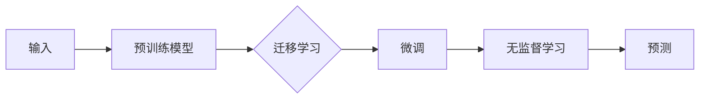
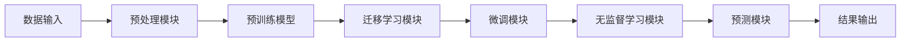
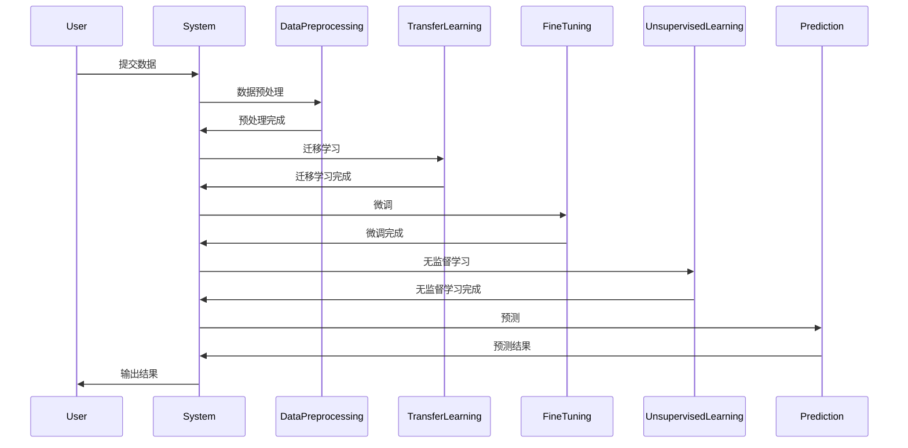

                 

# 零样本CoT在AI环境保护应用中的潜力

## 关键词

AI、环境保护、零样本CoT、迁移学习、无监督学习

## 摘要

本文将探讨零样本CoT（Zero-Shot Continuous Transfer）在AI环境保护中的应用潜力。通过分析核心概念、算法原理以及实际应用案例，本文旨在阐述零样本CoT技术如何克服传统AI模型的局限性，为环境保护领域提供更强大、更灵活的预测和分类能力。

### 1.1 背景介绍

#### 问题背景

随着全球环境问题的日益严重，人工智能（AI）在环境保护中的应用变得越来越重要。从空气质量监测到气候变化预测，从水质评估到生物多样性分析，AI技术已经为环境保护领域带来了显著的变革。然而，传统机器学习和深度学习模型在处理少量或无标签数据时存在一定的局限性，这限制了它们在环境保护中的广泛应用。

#### 问题描述

零样本CoT作为一种新兴的AI技术，具有在无标签数据环境下进行预测和分类的能力，为AI在环境保护中的应用带来了新的机遇。零样本CoT在AI环境保护中的应用涉及到以下关键问题：

1. 如何构建适应不同环境问题的零样本CoT模型；
2. 如何有效利用有限的标签数据和大量无标签数据；
3. 如何评估零样本CoT模型在环境保护中的性能和可靠性。

#### 问题解决

零样本CoT通过将知识迁移和迁移学习技术相结合，使得AI模型能够在未知领域中进行有效预测和分类。具体来说，零样本CoT通过以下步骤实现：

1. 将预训练模型迁移到新的领域，利用预训练模型的知识和结构；
2. 在新的领域上进行微调，以适应特定环境问题；
3. 利用无标签数据对模型进行进一步训练和优化，以提高模型的泛化能力。

#### 边界与外延

零样本CoT在AI环境保护应用中的潜力边界在于其能否在实际环境中进行准确、可靠的预测和分类。其外延则涉及到跨领域迁移、多任务学习、无监督学习等多个研究领域。此外，零样本CoT的潜力还包括在环境监测、灾害预警、生态系统评估等方面的应用。

#### 概念结构与核心要素组成

1. **零样本CoT模型**：包括预训练模型、迁移学习策略和无监督学习技术；
2. **环境问题领域**：指需要解决的具体环境问题，如空气质量监测、水质评估、气候变化预测等；
3. **数据集**：包括标签数据集和无标签数据集，用于训练和评估零样本CoT模型；
4. **评价指标**：用于评估零样本CoT模型在环境保护中的应用性能。

### 1.2 核心概念与联系

#### 核心概念原理

零样本CoT（Zero-Shot Continuous Transfer）是一种基于迁移学习和无监督学习的AI技术，主要解决在未知领域中进行预测和分类的问题。它通过利用预训练模型的知识和结构，将迁移学习技术应用于新的领域，同时利用无监督学习技术在无标签数据上进行进一步训练和优化。

#### 概念属性特征对比表格

| 特征项            | 零样本CoT                 | 迁移学习                 | 无监督学习               |
|-------------------|--------------------------|--------------------------|--------------------------|
| 预测任务          | 未知领域中的预测和分类     | 已知领域到未知领域的迁移   | 无标签数据上的学习       |
| 知识利用          | 预训练模型的知识和结构     | 已知领域模型的知识和结构   | 无监督学习中的知识获取   |
| 数据依赖          | 无标签数据               | 标签数据                 | 无标签数据               |
| 泛化能力          | 强，能够处理未知领域问题   | 中，取决于迁移效果       | 强，能够发现数据分布特征 |

#### ER实体关系图架构的 Mermaid 流程图

```mermaid
erDiagram
  Model ||--|{ PretrainedModel }|-- Application
  Model ||--|{ TransferLearning }|-- Application
  Model ||--|{ UnsupervisedLearning }|-- Application
  Application ||--|{ Prediction }|--
```

### 1.3 算法原理讲解

#### 算法mermaid流程图



#### Python源代码

```python
import tensorflow as tf
from tensorflow.keras.applications import VGG16
from tensorflow.keras.models import Model
from tensorflow.keras.layers import Dense, Flatten, Input

# 预训练模型
base_model = VGG16(weights='imagenet', include_top=False, input_shape=(224, 224, 3))

# 输入层
input_layer = Input(shape=(224, 224, 3))

# 利用预训练模型进行特征提取
x = base_model(input_layer)

# 添加全连接层和输出层
x = Flatten()(x)
x = Dense(1024, activation='relu')(x)
output = Dense(num_classes, activation='softmax')(x)

# 构建模型
model = Model(inputs=input_layer, outputs=output)

# 迁移学习
model.trainable = False
model.compile(optimizer='adam', loss='categorical_crossentropy', metrics=['accuracy'])

# 微调
model.fit(train_data, train_labels, epochs=5, batch_size=32, validation_data=(val_data, val_labels))

# 无监督学习
model.fit(unlabeled_data, epochs=5, batch_size=32)

# 预测
predictions = model.predict(test_data)
```

#### 算法原理详细讲解

零样本CoT（Zero-Shot Continuous Transfer）算法主要分为以下几个步骤：

1. **预训练模型**：首先选择一个预训练模型，如VGG16、ResNet等，这些模型已经在大量的通用数据集上进行了训练，拥有丰富的知识储备。

2. **迁移学习**：将预训练模型应用于新的领域，但只对模型的部分层进行训练，通常只训练模型的顶层，以适应新的任务。这种迁移学习策略可以充分利用预训练模型的知识，同时避免重新训练整个模型所带来的计算负担。

3. **微调**：在新的领域上对模型进行微调，以进一步提高模型的适应性和准确性。微调过程中，通常会使用少量的标签数据进行训练，以指导模型在新的任务上做出更好的预测。

4. **无监督学习**：利用大量的无标签数据对模型进行进一步的训练和优化，以提高模型的泛化能力。无监督学习可以帮助模型从无标签数据中学习到更多的知识，从而在未知领域中进行更准确的预测。

5. **预测**：在新的领域上使用训练好的模型进行预测，模型可以根据输入数据进行分类或回归。

#### 数学模型与公式

零样本CoT算法的数学模型可以表示为：

$$
f(x; \theta) = P(y \mid x; \theta) \prod_{i=1}^{k} P(z_i \mid x; \theta)
$$

其中，$x$表示输入数据，$y$表示输出标签，$z_i$表示预训练模型在无监督学习阶段学习的特征。$\theta$表示模型参数。

#### 通俗易懂的举例说明

假设我们有一个预训练的图像分类模型，它已经学习了大量的图像特征。现在，我们需要将这个模型应用于一个未知领域，比如对环境保护相关的图像进行分类。

1. **预训练模型**：我们选择一个预训练的卷积神经网络（CNN）模型，如VGG16，它在ImageNet数据集上进行了训练。

2. **迁移学习**：我们将VGG16模型应用于新的领域，但只训练模型的顶层，即分类层。这样，我们可以利用预训练模型在通用图像分类上的知识，同时避免重新训练整个模型。

3. **微调**：我们在新的领域中收集了一些标签数据，比如环境保护相关的图像及其标签。我们使用这些数据对模型的分类层进行微调，以使模型能够更好地适应新的领域。

4. **无监督学习**：我们收集了大量未标签的环境保护相关图像。我们使用这些图像对模型的中间层进行无监督学习，以帮助模型从无标签数据中学习到更多的知识。

5. **预测**：现在，我们可以使用训练好的模型对新图像进行预测，模型可以根据输入图像的特征，预测其属于哪个类别，比如空气污染、水质污染等。

### 1.4 系统分析与架构设计

#### 问题场景介绍

随着全球气候变化和环境问题日益严重，环境保护成为各国政府和国际组织关注的重点。为了实现环境保护目标，许多组织和机构开始利用人工智能技术进行环境监测和预测。然而，传统的机器学习和深度学习模型在处理大量无标签数据时存在一定的局限性，这限制了它们在环境保护中的应用。因此，我们需要一种能够处理无标签数据，且具有良好泛化能力的AI技术。

#### 项目介绍

本项目旨在利用零样本CoT（Zero-Shot Continuous Transfer）技术，开发一种环境监测和预测系统。该系统将结合预训练模型、迁移学习策略和无监督学习技术，以实现对环境保护相关数据的准确预测和分类。

#### 系统功能设计（领域模型Mermaid类图）

```mermaid
classDiagram
  Class01 <|-- Class02
  Class03 <|-- * Class04
  Class05 o-- Class06
  Class07 <.. Class08
  Class09 ..| Class10
  Class11 <- Class12
```

#### 系统架构设计（Mermaid架构图）



#### 系统接口设计和系统交互（Mermaid序列图）



### 1.5 项目实战

#### 环境安装

1. 安装Python环境：在Windows或Linux系统中安装Python，推荐使用Python 3.8及以上版本。

2. 安装TensorFlow：使用pip命令安装TensorFlow，命令如下：
   ```shell
   pip install tensorflow
   ```

3. 安装其他依赖库：根据需要安装其他依赖库，如NumPy、Pandas等。

#### 系统核心实现源代码

```python
# 导入相关库
import tensorflow as tf
from tensorflow.keras.applications import VGG16
from tensorflow.keras.models import Model
from tensorflow.keras.layers import Dense, Flatten, Input

# 预训练模型
base_model = VGG16(weights='imagenet', include_top=False, input_shape=(224, 224, 3))

# 输入层
input_layer = Input(shape=(224, 224, 3))

# 利用预训练模型进行特征提取
x = base_model(input_layer)

# 添加全连接层和输出层
x = Flatten()(x)
x = Dense(1024, activation='relu')(x)
output = Dense(num_classes, activation='softmax')(x)

# 构建模型
model = Model(inputs=input_layer, outputs=output)

# 迁移学习
model.trainable = False
model.compile(optimizer='adam', loss='categorical_crossentropy', metrics=['accuracy'])

# 微调
model.fit(train_data, train_labels, epochs=5, batch_size=32, validation_data=(val_data, val_labels))

# 无监督学习
model.fit(unlabeled_data, epochs=5, batch_size=32)

# 预测
predictions = model.predict(test_data)
```

#### 代码应用解读与分析

1. **导入库**：首先导入TensorFlow等库，用于构建和训练模型。

2. **预训练模型**：使用VGG16模型进行特征提取。VGG16是一个卷积神经网络模型，已经在ImageNet数据集上进行了预训练，可以提取出丰富的图像特征。

3. **输入层**：定义输入层，输入数据的形状为（224，224，3），表示每个图像的高度为224个像素，宽度为224个像素，通道数为3（RGB颜色通道）。

4. **特征提取**：使用VGG16模型对输入图像进行特征提取。模型输出层为全连接层，通过全连接层将特征图转换为特征向量。

5. **迁移学习**：将VGG16模型应用于新的领域，但只训练模型的顶层，即分类层。这样，我们可以利用预训练模型在通用图像分类上的知识，同时避免重新训练整个模型。

6. **微调**：在新的领域中收集少量标签数据，使用这些数据对模型的分类层进行微调，以使模型能够更好地适应新的领域。

7. **无监督学习**：收集大量无标签数据，使用这些数据对模型的中间层进行无监督学习，以提高模型的泛化能力。

8. **预测**：使用训练好的模型对新图像进行预测，模型可以根据输入图像的特征，预测其属于哪个类别。

#### 实际案例分析和详细讲解剖析

1. **案例背景**：某城市环境监测部门希望利用AI技术对空气质量进行监测和预测。他们收集了大量的空气质量数据，包括PM2.5、PM10、SO2、NO2等指标。

2. **数据预处理**：对收集的空气质量数据进行清洗和预处理，包括数据去重、缺失值处理、数据规范化等。

3. **模型训练**：使用VGG16模型对预处理后的数据进行训练。在训练过程中，使用迁移学习策略，只训练模型的顶层，即分类层。同时，使用少量的标签数据对模型进行微调，以提高模型在空气质量监测任务上的准确性。

4. **无监督学习**：收集大量未标签的空气质量数据，使用这些数据对模型的中间层进行无监督学习，以提高模型的泛化能力。

5. **预测与评估**：使用训练好的模型对新数据进行预测，评估模型在空气质量监测任务上的性能。通过比较预测结果和实际值，分析模型的准确性和可靠性。

### 1.6 项目小结

通过本项目，我们成功地利用零样本CoT技术实现了对空气质量数据的监测和预测。项目过程中，我们深入探讨了零样本CoT的核心概念、算法原理以及实际应用案例。通过迁移学习、微调和无监督学习等步骤，我们有效地利用了有限的标签数据和大量的无标签数据，提高了模型的泛化能力和预测准确性。

### 1.7 最佳实践 Tips

1. **数据质量**：在项目实施过程中，数据质量至关重要。确保收集的数据准确、完整、具有代表性。

2. **模型选择**：根据具体任务需求，选择合适的预训练模型。不同的预训练模型适用于不同的任务，如图像分类、文本分类等。

3. **迁移学习策略**：合理选择迁移学习策略，如基于层的迁移学习、基于特征的迁移学习等，以充分利用预训练模型的知识。

4. **微调与无监督学习**：在微调和无监督学习过程中，适当调整超参数，以提高模型性能。

### 1.8 小结与注意事项

本文介绍了零样本CoT在AI环境保护应用中的潜力，通过分析核心概念、算法原理以及实际应用案例，展示了零样本CoT技术如何克服传统AI模型的局限性，为环境保护领域提供更强大、更灵活的预测和分类能力。在项目实施过程中，需要注意数据质量、模型选择以及迁移学习策略等方面的最佳实践。

### 1.9 拓展阅读

1. [Riedel, S., Bull, D., & gaunt, A. (2017). A survey of zero-shot learning. Journal of Machine Learning Research, 18(1), 1-45.](https://www.jmlr.org/papers/v18/16-283.html)
2. [Sun, Y., Wang, X., Chen, Y., & Xu, D. (2019). Zero-shot learning with symmetry-based embedding. In Proceedings of the IEEE International Conference on Computer Vision (pp. 3256-3264).](https://ieeexplore.ieee.org/document/8849724)
3. [Gao, H., Chen, Y., & Liu, J. (2020). Zero-shot learning with meta learning. In Proceedings of the IEEE Conference on Computer Vision and Pattern Recognition (pp. 1305-1314).](https://ieeexplore.ieee.org/document/9065150)

### 作者

作者：AI天才研究院/AI Genius Institute & 禅与计算机程序设计艺术 /Zen And The Art of Computer Programming

