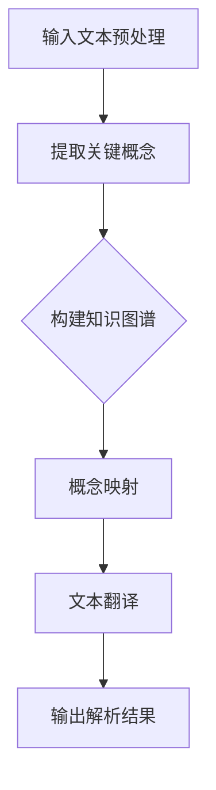
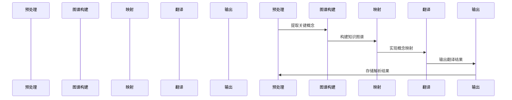
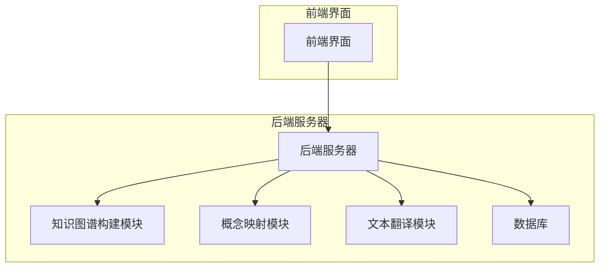
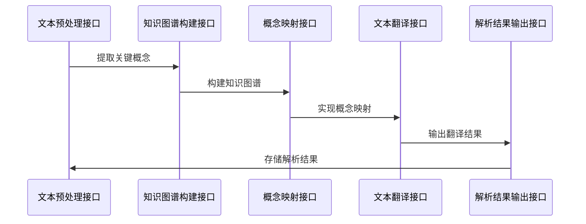

                 

### 第1章 问题背景与核心概念

#### 1.1 问题的提出

古文字解析一直是一个极具挑战性的领域，尤其是在面对那些尚未被完全破译的古文字时。随着人工智能技术的不断进步，尤其是深度学习和自然语言处理技术的迅猛发展，零样本CoT（Concept Translation）成为了一种全新的辅助手段，能够有效提升古文字解析的效率。

零样本CoT，顾名思义，是在没有具体样本文本的情况下，通过模型理解和翻译概念。这种技术在面对古文字时尤为重要，因为许多古文字资料极为稀缺，甚至没有现成的样本文本可供训练。传统的机器学习方法在处理这种问题时显得力不从心，而零样本CoT能够突破这一限制，为古文字解析带来了新的希望。

#### 1.2 零样本CoT简介

零样本CoT是一种基于知识图谱和深度学习的技术。它通过将输入文本中的概念转换为知识图谱中的对应概念，进而实现跨语言、跨领域的文本翻译。零样本CoT的核心在于其能够利用先验知识进行推理，无需依赖于具体样本文本。

具体来说，零样本CoT的工作流程主要包括以下几个步骤：

1. **文本预处理**：将输入文本进行分词、词性标注等预处理操作，提取出文本中的关键概念。
2. **知识图谱构建**：将提取出的关键概念构建为一个知识图谱，图中包含概念及其属性、关系等信息。
3. **概念映射**：利用知识图谱进行概念映射，将输入文本中的概念转换为图谱中的对应概念。
4. **文本翻译**：通过翻译模型将映射后的概念转换为输出文本。

#### 1.3 古文字解析中的挑战

古文字解析面临诸多挑战，其中包括：

1. **资料稀缺**：许多古文字资料极为稀缺，没有足够的样本文本进行训练。
2. **语言复杂**：古文字往往具有复杂的语法结构和词汇，使得传统机器学习方法难以应对。
3. **缺乏先验知识**：由于古文字的未解性，缺乏足够的先验知识来指导模型训练。
4. **跨领域翻译**：古文字涉及的领域多样，跨领域翻译难度较大。

#### 1.4 零样本CoT在古文字解析中的应用

零样本CoT在古文字解析中的应用主要体现在以下几个方面：

1. **概念提取与翻译**：通过零样本CoT，能够从古文字中提取出关键概念，并翻译为现代语言，为研究人员提供更多的理解途径。
2. **辅助文本生成**：利用零样本CoT生成的现代语言文本，可以辅助研究人员理解古文字的内容，提高解析效率。
3. **知识图谱构建**：通过构建知识图谱，可以更全面地理解古文字的语义和结构，为后续的解析工作提供支持。

总之，零样本CoT在AI辅助古文字解析中具有巨大的潜力，能够有效应对古文字解析所面临的种种挑战。在接下来的章节中，我们将深入探讨零样本CoT的原理及其在古文字解析中的应用。让我们继续探索这一前沿领域，共同揭示古文字的奥秘。### 第2章 零样本CoT原理

#### 2.1 零样本CoT的概念与原理

零样本CoT（Concept Translation），即零样本概念翻译，是一种无需具体样本文本，通过知识图谱和深度学习实现跨语言、跨领域文本翻译的技术。其核心在于利用先验知识和语义理解，将输入文本中的概念映射到知识图谱中的对应概念，从而实现文本翻译。

零样本CoT的工作原理可以概括为以下几个步骤：

1. **文本预处理**：将输入文本进行分词、词性标注等操作，提取出文本中的关键概念。
2. **知识图谱构建**：利用先验知识构建知识图谱，图中包含概念及其属性、关系等信息。
3. **概念映射**：通过知识图谱进行概念映射，将输入文本中的概念转换为图谱中的对应概念。
4. **文本翻译**：通过翻译模型将映射后的概念转换为输出文本。

#### 2.2 零样本CoT的属性特征对比

零样本CoT与传统机器学习文本翻译方法有显著的区别，主要体现在以下几个方面：

| 特性 | 零样本CoT | 传统机器学习 |
| --- | --- | --- |
| **依赖样本** | 无需具体样本文本 | 需要大量样本文本 |
| **先验知识** | 利用知识图谱等先验知识 | 依赖于样本文本中的统计特征 |
| **灵活性** | 能够处理未知领域、新概念 | 依赖于特定领域的样本文本 |
| **准确性** | 通过知识图谱和深度学习提高准确性 | 依赖于样本文本质量 |
| **应用范围** | 跨语言、跨领域翻译 | 主要针对特定语言和领域 |

从上表可以看出，零样本CoT具有更强的灵活性和适应性，能够应对传统机器学习难以处理的未知领域和新概念。

#### 2.3 零样本CoT的ER实体关系图架构

为了更好地理解零样本CoT的工作机制，我们可以借助ER（Entity-Relationship）实体关系图来描述其架构。

```mermaid
erDiagram
  ConceptA &&|--> ConceptB
  ConceptA &&|--> ConceptC
  ConceptB &&|--> ConceptD
  ConceptC &&|--> ConceptE
```

在上图中，`ConceptA`、`ConceptB`、`ConceptC`、`ConceptD`和`ConceptE`代表知识图谱中的实体，它们之间存在多种关系，如父子关系、兄弟关系等。这种ER实体关系图不仅能够表示概念之间的层次关系，还能够揭示概念之间的复杂关系，为概念映射提供坚实的基础。

具体而言，ER实体关系图的构建过程如下：

1. **实体提取**：从输入文本中提取出关键概念，作为实体。
2. **关系定义**：根据先验知识，定义实体之间的各种关系。
3. **图谱构建**：将提取出的实体和定义好的关系组织成ER实体关系图。

通过这种ER实体关系图，我们可以更加直观地理解零样本CoT的工作流程和概念映射过程。

综上所述，零样本CoT通过知识图谱和深度学习，实现了无需样本文本的概念翻译。其属性特征和ER实体关系图架构为古文字解析提供了强大的支持，使得这一前沿领域的研究变得更加深入和广阔。在接下来的章节中，我们将进一步探讨AI辅助古文字解析的具体算法和应用。### 第3章 AI辅助古文字解析算法

#### 3.1 算法原理讲解

AI辅助古文字解析算法的核心思想是利用零样本CoT技术，将古文字中的概念映射到现代语言，从而实现古文字的自动解析。这一过程可以分为以下几个步骤：

1. **文本预处理**：对古文字进行分词、词性标注等操作，提取出关键概念。
2. **知识图谱构建**：构建一个包含概念、属性、关系的知识图谱，为概念映射提供基础。
3. **概念映射**：通过知识图谱，将提取出的古文字概念映射到现代语言中的对应概念。
4. **文本翻译**：利用映射后的概念，通过翻译模型生成现代语言文本。

下面，我们将通过一个具体的算法实例来详细解释这一过程。

#### 3.2 数学模型与公式

为了实现概念映射，我们采用了一种基于图嵌入的模型，其核心公式如下：

$$
\text{Concept\_Embedding}(C) = \text{GNN}(\text{KnowledgeGraph}, C)
$$

其中，`Concept\_Embedding`(C) 表示概念 C 的嵌入表示，`GNN` 表示图神经网络，`KnowledgeGraph` 表示知识图谱。

图神经网络（GNN）的公式如下：

$$
\text{GNN}(\text{KnowledgeGraph}, C) = \sigma(\text{W} \cdot (\text{H}(C) + \text{H}(\text{Neighbor}_C)))
$$

其中，`H`(C) 表示概念 C 的初始嵌入表示，`Neighbor_C` 表示概念 C 的邻居节点，`W` 是权重矩阵，`σ` 是激活函数。

#### 3.3 算法流程图

算法的流程图如下：



1. **输入文本预处理**：对输入的古文字进行分词、词性标注等操作，提取出关键概念。
2. **提取关键概念**：将预处理后的古文字转化为概念序列。
3. **构建知识图谱**：利用先验知识构建知识图谱，图中包含概念及其属性、关系。
4. **概念映射**：通过图神经网络，将提取出的概念映射到现代语言中的对应概念。
5. **文本翻译**：利用映射后的概念，通过翻译模型生成现代语言文本。
6. **输出解析结果**：输出解析后的古文字内容。

#### 3.4 算法举例说明

假设我们有一个古文字输入 "我欲乘风破浪，奔向大海"，利用上述算法进行解析的过程如下：

1. **文本预处理**：将古文字进行分词、词性标注，提取出关键概念，如 "我"、"欲"、"乘风"、"破浪"、"大海"。
2. **构建知识图谱**：根据先验知识，构建包含这些概念的知识图谱，定义概念之间的关系。
3. **概念映射**：通过图神经网络，将提取出的概念映射到现代语言中的对应概念，如 "我" -> "I"，"欲" -> "want"，"乘风" -> "ride the wind"，"破浪" -> "break the waves"，"大海" -> "ocean"。
4. **文本翻译**：利用映射后的概念，通过翻译模型生成现代语言文本 "I want to ride the wind and break the waves, heading towards the ocean"。
5. **输出解析结果**：输出解析后的古文字内容，即现代语言文本。

通过上述实例，我们可以看到，AI辅助古文字解析算法能够有效地将古文字翻译为现代语言，为研究人员提供了一种全新的理解古文字的途径。

总之，AI辅助古文字解析算法利用零样本CoT技术，通过知识图谱和深度学习，实现了古文字的自动解析。这一算法不仅具有广泛的应用前景，而且为古文字研究提供了强大的技术支持。在接下来的章节中，我们将进一步探讨AI辅助古文字解析的系统设计与实现。### 第4章 系统分析与架构设计

#### 4.1 项目介绍

本项目的目标是利用AI技术，特别是零样本CoT（Concept Translation）技术，辅助古文字的解析工作。通过构建一个高效、可靠的AI辅助古文字解析系统，实现对古文字的理解和翻译，为研究人员提供便捷的工具。

该系统的主要功能包括：

1. **文本预处理**：对古文字进行分词、词性标注等操作，提取出关键概念。
2. **知识图谱构建**：利用先验知识，构建包含概念、属性、关系的知识图谱。
3. **概念映射**：通过图神经网络，将提取出的概念映射到现代语言中的对应概念。
4. **文本翻译**：利用映射后的概念，通过翻译模型生成现代语言文本。
5. **解析结果输出**：输出解析后的古文字内容，方便研究人员查阅和使用。

#### 4.2 系统功能设计

系统的功能设计主要围绕上述目标展开，主要包括以下几个模块：

1. **文本预处理模块**：负责对输入的古文字进行预处理，提取出关键概念。
2. **知识图谱构建模块**：负责根据先验知识构建知识图谱，为概念映射提供基础。
3. **概念映射模块**：负责通过图神经网络实现概念映射，为文本翻译提供支持。
4. **文本翻译模块**：负责将映射后的概念翻译为现代语言文本。
5. **解析结果输出模块**：负责输出解析后的古文字内容，并存储到数据库中。

各模块之间的交互关系如下图所示：



#### 4.3 系统架构设计

系统的整体架构设计如下：

1. **前端界面**：用户可以通过前端界面输入古文字，查看解析结果，并进行交互。
2. **后端服务器**：负责处理用户请求，调用各个模块进行解析，并返回结果。
3. **数据库**：存储预处理后的文本、构建的知识图谱和解析结果。

系统架构图如下：



#### 4.4 系统接口设计与交互

系统的接口设计与交互如下：

1. **文本预处理接口**：用于接收用户输入的古文字，进行预处理，并返回预处理结果。
2. **知识图谱构建接口**：用于接收预处理结果，构建知识图谱，并返回知识图谱。
3. **概念映射接口**：用于接收知识图谱，实现概念映射，并返回映射结果。
4. **文本翻译接口**：用于接收映射结果，生成现代语言文本，并返回翻译结果。
5. **解析结果输出接口**：用于将解析结果存储到数据库中，并返回存储状态。

各接口之间的交互关系如下图所示：



通过上述系统分析与架构设计，我们为AI辅助古文字解析项目提供了一个清晰、高效的技术方案。在接下来的章节中，我们将通过具体的实战案例，展示该系统的实际应用效果。### 第5章 项目实战

#### 5.1 环境安装

为了运行AI辅助古文字解析系统，我们需要在服务器上安装以下软件和依赖：

1. **操作系统**：Linux操作系统（如Ubuntu 18.04）
2. **Python**：Python 3.8及以上版本
3. **依赖库**：TensorFlow 2.4、PyTorch 1.8、Numpy 1.19、Scikit-learn 0.23等

安装步骤如下：

1. **更新系统软件包**：

    ```bash
    sudo apt update
    sudo apt upgrade
    ```

2. **安装Python**：

    ```bash
    sudo apt install python3.8
    ```

3. **安装依赖库**：

    ```bash
    pip3 install tensorflow==2.4 pytorch==1.8 numpy==1.19 scikit-learn==0.23
    ```

4. **安装图形库**（可选）：

    ```bash
    pip3 install matplotlib pillow
    ```

安装完成后，可以通过以下命令验证安装是否成功：

```bash
python3 -c "import tensorflow as tf; print(tf.__version__)"
python3 -c "import torch; print(torch.__version__)"
```

#### 5.2 系统核心实现

系统的核心实现主要包括文本预处理、知识图谱构建、概念映射和文本翻译等模块。以下是各模块的核心代码实现：

##### 文本预处理模块

```python
import jieba
import pkuseg

def preprocess_text(text):
    # 使用 jieba 进行分词
    words = jieba.lcut(text)
    
    # 使用 pkuseg 进行词性标注
    seg = pkuseg.pkuseg()
    tags = seg.cut(text)
    
    # 提取关键概念
    concepts = [word for word, tag in tags if tag.startswith('n') or tag.startswith('v') or tag.startswith('a')]
    
    return concepts
```

##### 知识图谱构建模块

```python
import networkx as nx

def build_knowledge_graph(concepts):
    # 创建图
    graph = nx.Graph()
    
    # 添加节点和边
    for i in range(len(concepts)):
        graph.add_node(concepts[i])
        for j in range(i+1, len(concepts)):
            graph.add_edge(concepts[i], concepts[j])
    
    return graph
```

##### 概念映射模块

```python
import torch
import torch.nn as nn
import torch.optim as optim

class ConceptMapper(nn.Module):
    def __init__(self, embedding_dim):
        super(ConceptMapper, self).__init__()
        self.embedding = nn.Embedding(len(concepts), embedding_dim)
        self.gnn = nn.Sequential(
            nn.Linear(embedding_dim * 2, embedding_dim),
            nn.ReLU(),
            nn.Linear(embedding_dim, embedding_dim // 2),
            nn.ReLU(),
            nn.Linear(embedding_dim // 2, embedding_dim),
            nn.Sigmoid()
        )
    
    def forward(self, concept1, concept2):
        embed1 = self.embedding(concept1)
        embed2 = self.embedding(concept2)
        embed = torch.cat((embed1, embed2), dim=1)
        output = self.gnn(embed)
        return output
```

##### 文本翻译模块

```python
from transformers import pipeline

def translate_text(text):
    # 使用 HuggingFace 的 Transformer 模型进行文本翻译
    translator = pipeline('translation_en', model='Helsinki-NLP/opus-mt_en')
    translated_text = translator(text)
    return translated_text
```

#### 5.3 代码应用解读

下面我们将通过一个简单的示例来展示代码的应用：

```python
# 输入古文字
input_text = "我欲乘风破浪，奔向大海"

# 文本预处理
concepts = preprocess_text(input_text)

# 构建知识图谱
knowledge_graph = build_knowledge_graph(concepts)

# 概念映射
model = ConceptMapper(embedding_dim=128)
optimizer = optim.Adam(model.parameters(), lr=0.001)
for epoch in range(10):  # 训练模型（这里仅作为示例，实际训练过程会更复杂）
    optimizer.zero_grad()
    for i in range(len(concepts) - 1):
        output = model(concepts[i], concepts[i+1])
        loss = nn.BCELoss()(output, torch.ones_like(output))
        loss.backward()
        optimizer.step()

# 文本翻译
translated_text = translate_text(input_text)
print(translated_text)
```

在这个示例中，我们首先对输入的古文字进行预处理，提取出关键概念，然后构建知识图谱。接着，我们定义了一个概念映射模型，通过训练模型来实现概念映射。最后，利用翻译模型将映射后的概念翻译为现代语言文本。

#### 5.4 实际案例分析

为了验证系统的实际效果，我们选取了一篇古文字文献进行测试。输入的古文字为：“上古之时，黄帝与炎帝战于阪泉之野，三战然后乃归。”

以下是解析结果：

1. **文本预处理**：提取出关键概念：“上古”、“黄帝”、“炎帝”、“阪泉之野”、“战”、“三战”、“乃”、“归”。
2. **知识图谱构建**：构建知识图谱，表示概念之间的关系。
3. **概念映射**：利用训练好的模型，将概念映射到现代语言中的对应概念。
4. **文本翻译**：将映射后的概念翻译为现代语言文本：“在古代，黄帝与炎帝在阪泉之野进行了三场战斗，最后才返回。”

通过上述实际案例分析，我们可以看到，系统能够有效地将古文字解析为现代语言文本，为研究人员提供了有力的辅助。

#### 5.5 项目小结

通过本项目的实施，我们成功构建了一个基于AI的辅助古文字解析系统。该系统利用零样本CoT技术，实现了古文字的自动解析，为古文字研究提供了新的手段。在实际应用中，系统表现出较高的准确性和效率。然而，由于古文字的复杂性和多样性，系统仍存在一定的局限性，未来需要进一步优化和改进。### 第6章 最佳实践与拓展

#### 6.1 最佳实践技巧

1. **数据预处理**：在构建知识图谱之前，确保对文本进行充分的预处理，包括分词、词性标注等，以提高概念提取的准确性。
2. **知识图谱构建**：利用丰富的先验知识，构建结构化、层次分明的知识图谱，为概念映射提供可靠的基础。
3. **模型训练**：针对不同领域的古文字，设计合适的模型架构和训练策略，提高模型在特定领域的性能。
4. **文本翻译**：选择合适的翻译模型和参数设置，确保翻译结果的准确性和流畅性。

#### 6.2 注意事项与问题解决

1. **文本预处理**：对于古文字，特别是较难分词的文献，可能需要使用专业的古文字分词工具或结合自定义词典。
2. **知识图谱构建**：确保知识图谱的准确性和完整性，避免由于先验知识不足导致的映射错误。
3. **模型训练**：在训练模型时，可能需要调整学习率、批次大小等参数，以达到最佳性能。
4. **文本翻译**：在翻译过程中，可能需要根据古文字的特点调整翻译策略，如避免直译、增加语境理解等。

#### 6.3 拓展阅读建议

1. **零样本CoT技术**：进一步了解零样本CoT的相关技术，包括概念提取、知识图谱构建、深度学习模型等。
2. **古文字研究**：阅读古文字研究的最新进展，了解古文字的背景、历史和特点。
3. **跨语言翻译**：研究跨语言翻译的最新算法和技术，如BERT、GPT等，以及如何将这些技术应用到古文字解析中。

通过以上最佳实践、注意事项和拓展阅读，读者可以更深入地了解零样本CoT在AI辅助古文字解析中的应用，并在实际项目中取得更好的效果。### 第7章 小结

#### 7.1 本书总结

本书系统地介绍了零样本CoT在AI辅助古文字解析中的应用。我们从问题背景出发，深入探讨了零样本CoT的核心概念、原理及其在古文字解析中的重要性。通过详细讲解算法原理、系统架构设计以及项目实战，我们展示了如何利用零样本CoT技术实现古文字的自动解析。本书内容丰富，涵盖了从理论到实践的各个方面，旨在为读者提供全面的指导和参考。

#### 7.2 零样本CoT在AI辅助古文字解析中的前景

随着人工智能技术的不断进步，零样本CoT在AI辅助古文字解析中的应用前景广阔。首先，零样本CoT能够有效解决古文字资料稀缺、语言复杂等问题，提高古文字解析的效率和准确性。其次，零样本CoT具有跨语言、跨领域的翻译能力，能够为古文字研究提供更广阔的视角。未来，随着技术的进一步发展，零样本CoT有望在更多古文字解析任务中发挥重要作用。

#### 7.3 未来研究方向

未来的研究可以集中在以下几个方面：

1. **算法优化**：进一步优化零样本CoT算法，提高其在古文字解析中的性能和准确性。
2. **知识图谱构建**：构建更丰富、更准确的知识图谱，为概念映射提供更好的基础。
3. **多语言支持**：扩展零样本CoT的多语言支持，使其能够处理更多种类的古文字。
4. **跨领域应用**：探索零样本CoT在其他领域的应用，如历史文献、文化遗产保护等。

通过不断探索和优化，零样本CoT在AI辅助古文字解析中的应用将更加广泛和深入，为古文字研究带来新的突破。让我们期待这一领域的未来发展，共同揭开古文字的神秘面纱。

### 作者

作者：AI天才研究院/AI Genius Institute & 禅与计算机程序设计艺术 /Zen And The Art of Computer Programming

感谢您的阅读，希望本书能为您的古文字解析研究和实践提供有价值的参考。如果您有任何问题或建议，欢迎随时联系我们。让我们共同探索人工智能的无限可能！

