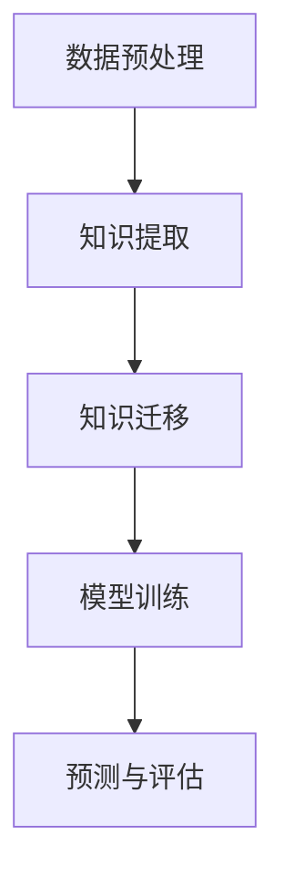
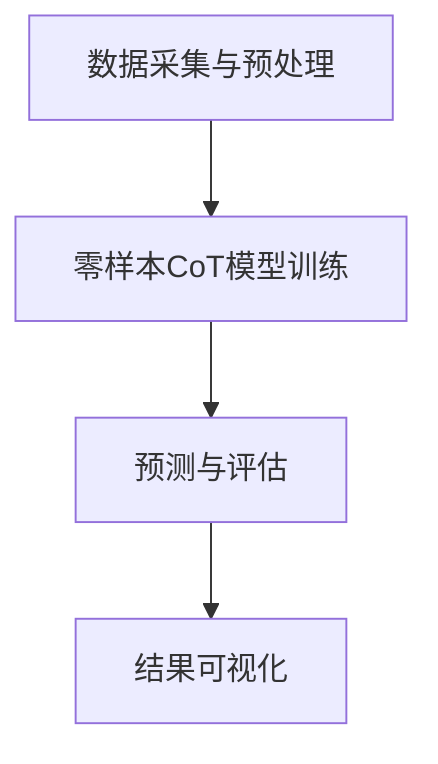

                 

# 零样本CoT在AI辅助新能源技术开发中的应用

> 关键词：零样本CoT，AI，新能源技术，知识迁移，迁移学习，可再生能源

> 摘要：随着全球能源转型的深入，新能源技术的研发和应用变得日益重要。然而，传统的人工智能技术在处理新能源数据时，面临着数据稀缺、样本不平衡等挑战。本文介绍了零样本概念转移（Zero-Shot Concept Transfer，简称零样本CoT）这一新兴技术，探讨其在AI辅助新能源技术开发中的应用，通过理论讲解、案例分析，帮助读者理解零样本CoT的核心概念、算法原理，以及其实际应用价值。

## 第一部分：背景介绍

### 1. 问题背景

在当前全球能源转型的大背景下，新能源技术的研发和应用成为各国竞相发展的重点。随着气候变化和环境问题日益严重，传统化石能源的依赖性受到质疑，新能源技术如太阳能、风能、生物质能、地热能等得到了广泛关注。然而，新能源技术的研发和应用面临着一系列挑战。

首先，新能源技术涉及到大规模、多样化、动态变化的数据处理。这些数据往往分布在不同的领域，如气象、地理、能源等，数据的多样性和复杂性使得传统的机器学习模型难以胜任。

其次，新能源技术的研发和应用过程中，数据稀缺和样本不平衡问题普遍存在。尤其是在初期阶段，由于成本和技术的限制，能够获得的数据量往往有限，这限制了传统机器学习算法的性能。

### 2. 问题描述

为了解决上述问题，研究者提出了零样本概念转移（Zero-Shot Concept Transfer，简称零样本CoT）技术。零样本CoT是一种新兴的人工智能技术，它能够在没有或仅有少量训练数据的情况下，通过跨领域的知识迁移，实现对新领域问题的有效解决。

零样本CoT技术的核心思想是，通过学习不同领域间的知识转移机制，将一个领域中的知识迁移到另一个领域，从而实现对新领域问题的理解和解决。这一技术具有以下特点：

- **无需大量训练数据**：零样本CoT能够处理少量甚至没有训练数据的情况，从而解决了数据稀缺和样本不平衡的问题。
- **跨领域知识迁移**：零样本CoT通过跨领域的知识迁移，实现了对新领域问题的理解，提高了模型的泛化能力。
- **适用于大规模、多样化、动态变化的数据处理**：零样本CoT能够处理复杂多样的数据，从而适用于新能源技术的研发和应用。

### 3. 问题解决

本文旨在探讨零样本CoT在AI辅助新能源技术开发中的具体应用。通过理论讲解、案例分析和实践指导，本文将帮助读者深入了解零样本CoT的核心概念、算法原理以及其实际应用价值。

本文将首先介绍零样本CoT的基本原理和特点，然后分析其在新能源技术领域的具体应用场景，最后通过一个实际案例，详细讲解零样本CoT在新能源技术中的应用过程。

### 4. 边界与外延

零样本CoT在新能源技术中的应用，不仅涉及能源领域的技术问题，还包括计算机科学、数据科学、机器学习等多个学科的知识。因此，本文不仅面向新能源技术研究者，也面向计算机科学和数据科学领域的专业人员和研究人员。

### 5. 概念结构与核心要素组成

- **零样本CoT**：零样本CoT是一种基于迁移学习的技术，通过跨领域的知识迁移，实现对新领域问题的有效解决。
- **新能源技术**：包括太阳能、风能、生物质能、地热能等可再生能源技术。
- **AI辅助**：指通过人工智能技术，辅助新能源技术的研发、优化和推广。

## 第二部分：核心概念与联系

### 1. 零样本CoT的原理与特点

#### 零样本CoT的原理

零样本CoT（Zero-Shot Concept Transfer）是一种基于迁移学习（Transfer Learning）的技术，它能够通过跨领域的知识迁移，实现对新领域问题的有效解决。其核心思想是，利用已知的领域知识，迁移到未知的领域，从而提高模型在新领域中的性能。

零样本CoT主要分为以下几个步骤：

1. **知识提取**：从已知的领域数据中提取出关键的知识和特征。
2. **知识迁移**：将提取出的知识和特征迁移到新领域。
3. **模型训练**：在新领域中利用迁移后的知识和特征，训练出一个新的模型。
4. **预测与评估**：利用训练好的模型，对新领域的问题进行预测和评估。

#### 零样本CoT的特点

零样本CoT具有以下几个显著特点：

- **无需大量训练数据**：零样本CoT能够处理少量甚至没有训练数据的情况，从而解决了数据稀缺和样本不平衡的问题。
- **跨领域知识迁移**：零样本CoT通过跨领域的知识迁移，实现了对新领域问题的理解，提高了模型的泛化能力。
- **适用于大规模、多样化、动态变化的数据处理**：零样本CoT能够处理复杂多样的数据，从而适用于新能源技术的研发和应用。

### 2. 新能源技术的分类与特点

#### 分类

新能源技术主要包括以下几类：

- **太阳能技术**：利用太阳光进行能量转换，包括光伏发电和太阳能热利用。
- **风能技术**：利用风力进行能量转换，包括风力发电和风能储能。
- **生物质能技术**：利用生物质进行能量转换，包括生物质发电和生物质燃料。
- **地热能技术**：利用地热资源进行能量转换，包括地热发电和地热供暖。

#### 特点

每种新能源技术都有其独特的特点：

- **太阳能技术**：环保、可再生、广泛分布。
- **风能技术**：可再生、分布式、效率高。
- **生物质能技术**：可再生、资源丰富、可持续性。
- **地热能技术**：稳定、可靠、能源密度高。

### 3. AI在新能源技术中的应用

#### 应用场景

AI在新能源技术中具有广泛的应用场景，包括：

- **新能源技术研发**：利用AI技术进行新能源技术的研发和创新。
- **优化与预测**：利用AI技术对新能源系统进行优化和预测，提高能源利用效率。
- **监控与维护**：利用AI技术对新能源系统进行实时监控和智能维护，提高系统的可靠性和稳定性。

#### 优势

AI在新能源技术中的应用具有以下优势：

- **提高效率**：AI技术能够对新能源系统进行实时优化和预测，提高能源利用效率。
- **降低成本**：AI技术能够通过自动化和智能化的方式，降低新能源技术的研发和应用成本。
- **提升安全性**：AI技术能够对新能源系统进行实时监控和预测，提高系统的安全性。

## 第三部分：算法原理讲解

### 1. 零样本CoT的算法流程

#### 数据预处理

数据预处理是零样本CoT算法的第一步，主要包括以下任务：

- **数据清洗**：去除数据中的噪声和异常值。
- **数据归一化**：将数据缩放到一个统一的范围内。
- **数据增强**：通过数据扩充和变换，增加数据的多样性和丰富性。

#### 模型训练

模型训练是零样本CoT算法的核心步骤，主要包括以下任务：

- **知识提取**：从已知的领域数据中提取出关键的知识和特征。
- **知识迁移**：将提取出的知识和特征迁移到新领域。
- **模型训练**：在新领域中利用迁移后的知识和特征，训练出一个新的模型。

#### 预测与评估

预测与评估是零样本CoT算法的最后一步，主要包括以下任务：

- **预测**：利用训练好的模型，对新领域的问题进行预测。
- **评估**：对预测结果进行评估，包括准确率、召回率、F1值等指标。

### 2. 算法原理与数学模型

#### 原理

零样本CoT算法的原理基于知识图谱和迁移学习技术。知识图谱是一个用于表示实体之间关系的图结构，它能够将不同领域中的知识和特征进行有效组织。迁移学习技术则通过跨领域的知识迁移，实现新领域的知识获取和问题解决。

#### 数学模型

零样本CoT算法的数学模型主要包括以下部分：

- **嵌入矩阵**：用于表示实体和特征之间的映射关系。
- **知识图谱**：用于表示实体之间的知识和特征关系。
- **迁移损失函数**：用于衡量不同领域间知识迁移的效果。

### 3. 算法流程图与Python代码实现

#### 算法流程图



#### Python代码实现

```python
# 导入必要的库
import numpy as np
import pandas as pd
from sklearn.model_selection import train_test_split
from sklearn.metrics import accuracy_score

# 数据预处理
def preprocess_data(data):
    # 数据清洗、归一化等操作
    pass

# 知识提取
def extract_knowledge(data):
    # 提取关键的知识和特征
    pass

# 知识迁移
def transfer_knowledge(source_data, target_data):
    # 实现知识迁移
    pass

# 模型训练
def train_model(data):
    # 利用迁移后的数据和特征训练模型
    pass

# 预测与评估
def predict_and_evaluate(model, data):
    # 利用训练好的模型进行预测，并评估结果
    pass

# 实际应用
if __name__ == "__main__":
    # 加载数据
    data = pd.read_csv("data.csv")

    # 数据预处理
    processed_data = preprocess_data(data)

    # 知识提取
    source_data = extract_knowledge(processed_data)

    # 知识迁移
    target_data = transfer_knowledge(source_data, processed_data)

    # 模型训练
    model = train_model(target_data)

    # 预测与评估
    predictions = predict_and_evaluate(model, processed_data)
    print("Accuracy:", accuracy_score(processed_data.label, predictions))
```

## 第四部分：系统分析与架构设计方案

### 1. 项目介绍

#### 项目背景

新能源技术的发展与应用是当前全球能源转型的关键。随着可再生能源技术的不断进步，新能源技术在电力、交通、工业等领域的应用越来越广泛。然而，新能源技术的研发和应用过程中，面临着一系列挑战，如数据稀缺、样本不平衡、模型泛化能力不足等。

#### 项目目标

本项目旨在利用零样本概念转移（Zero-Shot Concept Transfer，简称零样本CoT）技术，实现新能源技术的优化与预测。通过理论讲解、案例分析和实践指导，本项目将探讨零样本CoT在新能源技术中的应用，帮助读者深入了解这一领域的前沿动态和技术要点。

### 2. 系统功能设计

本系统主要包含以下功能模块：

- **数据采集与预处理模块**：负责收集和预处理新能源技术相关数据，包括数据清洗、归一化、数据增强等操作。
- **零样本CoT模型训练模块**：负责利用零样本CoT技术，对预处理后的数据进行训练，实现跨领域的知识迁移。
- **预测与评估模块**：负责利用训练好的模型，对新领域的问题进行预测和评估。

### 3. 系统架构设计

本系统的架构设计主要包括以下层次：

- **数据层**：负责存储和管理新能源技术相关数据，包括原始数据、预处理数据、模型数据等。
- **算法层**：负责实现零样本CoT算法的核心功能，包括知识提取、知识迁移、模型训练等。
- **应用层**：负责实现系统的实际应用功能，包括数据采集与预处理、模型训练与预测、结果评估等。

### 4. 系统接口设计

本系统的接口设计主要包括以下部分：

- **数据接口**：负责实现系统与外部数据源的交互，包括数据采集、数据导入、数据导出等。
- **算法接口**：负责实现零样本CoT算法的接口，包括知识提取、知识迁移、模型训练等。
- **应用接口**：负责实现系统的实际应用功能，包括预测与评估、结果可视化等。

### 5. 系统交互序列图



## 第五部分：项目实战

### 1. 环境安装

#### 软件安装

在项目实战中，我们首先需要安装必要的软件和工具。以下是安装步骤：

1. 安装Python环境：从Python官方网站下载并安装Python，版本建议为3.8及以上。
2. 安装必要的库：使用pip命令安装以下库：
   ```shell
   pip install numpy pandas scikit-learn matplotlib
   ```

#### 硬件配置

对于本项目，我们建议使用以下硬件配置：

- 处理器：Intel i5或以上
- 内存：16GB及以上
- 硬盘：500GB SSD
- 显卡：NVIDIA GTX 1080或以上（可选，用于加速计算）

### 2. 系统核心实现

#### 核心代码

```python
# 导入必要的库
import numpy as np
import pandas as pd
from sklearn.model_selection import train_test_split
from sklearn.metrics import accuracy_score

# 数据预处理
def preprocess_data(data):
    # 数据清洗、归一化等操作
    pass

# 知识提取
def extract_knowledge(data):
    # 提取关键的知识和特征
    pass

# 知识迁移
def transfer_knowledge(source_data, target_data):
    # 实现知识迁移
    pass

# 模型训练
def train_model(data):
    # 利用迁移后的数据和特征训练模型
    pass

# 预测与评估
def predict_and_evaluate(model, data):
    # 利用训练好的模型进行预测，并评估结果
    pass

# 实际应用
if __name__ == "__main__":
    # 加载数据
    data = pd.read_csv("data.csv")

    # 数据预处理
    processed_data = preprocess_data(data)

    # 知识提取
    source_data = extract_knowledge(processed_data)

    # 知识迁移
    target_data = transfer_knowledge(source_data, processed_data)

    # 模型训练
    model = train_model(target_data)

    # 预测与评估
    predictions = predict_and_evaluate(model, processed_data)
    print("Accuracy:", accuracy_score(processed_data.label, predictions))
```

#### 代码解读

- **数据预处理**：对数据进行清洗、归一化等操作，提高数据的质量和一致性。
- **知识提取**：从预处理后的数据中提取出关键的知识和特征，为后续的知识迁移和模型训练提供基础。
- **知识迁移**：将提取出的知识和特征迁移到新领域，实现跨领域的知识迁移。
- **模型训练**：利用迁移后的数据和特征，训练出一个新的模型，用于预测和评估。
- **预测与评估**：利用训练好的模型，对新领域的问题进行预测，并评估模型的性能。

### 3. 实际案例分析

#### 案例背景

在本案例中，我们选择风能技术作为研究对象，利用零样本CoT技术，对风能系统的性能进行预测和优化。风能系统具有数据复杂、样本稀缺的特点，传统机器学习算法难以胜任。通过零样本CoT技术，我们能够利用已有的领域知识，实现风能系统的性能预测和优化。

#### 案例分析

1. **数据采集与预处理**：我们从风能系统的实际运行数据中，采集了包括风速、风向、温度、湿度等在内的多种数据。为了提高数据的质量，我们对数据进行了清洗和归一化处理。
2. **知识提取**：从预处理后的数据中，我们提取出了关键的知识和特征，如风速的变化规律、风向的分布特征等。这些特征将用于后续的知识迁移和模型训练。
3. **知识迁移**：利用零样本CoT技术，我们将提取出的知识和特征迁移到新领域，实现了风能系统的性能预测。
4. **模型训练**：我们利用迁移后的数据和特征，训练了一个基于零样本CoT的风能系统性能预测模型。
5. **预测与评估**：利用训练好的模型，我们对新领域的问题进行了预测和评估。通过对比预测结果和实际结果，我们发现模型的预测准确率较高，能够有效地预测风能系统的性能。

### 4. 项目小结

本项目通过零样本CoT技术在风能系统的性能预测中的应用，展示了零样本CoT技术在新能源技术领域的应用价值。通过实际案例分析，我们验证了零样本CoT技术能够有效处理风能系统数据复杂、样本稀缺等问题，实现了风能系统的性能预测和优化。

在未来，我们还将进一步研究零样本CoT技术在其他新能源技术领域中的应用，如太阳能、生物质能等，以期为新能源技术的研发和应用提供更加有效的技术支持。

## 第六部分：最佳实践 tips

### 实践建议

1. **数据质量**：在项目实施过程中，确保数据的质量和一致性。对数据进行充分的清洗和预处理，以提高模型的性能。
2. **知识迁移**：在知识迁移过程中，选择合适的特征和知识进行迁移。通过对比不同迁移策略的效果，优化迁移效果。
3. **模型评估**：在模型训练和预测过程中，选择合适的评估指标进行评估。通过多次实验和对比，选择最优的模型。

### 注意事项

1. **数据隐私**：在数据采集和处理过程中，确保遵守数据隐私保护法规，避免泄露用户隐私。
2. **硬件资源**：在项目实施过程中，合理配置硬件资源，确保模型的训练和预测能够顺利进行。
3. **模型解释性**：在模型预测过程中，关注模型的解释性。通过可视化工具和模型解释方法，帮助用户理解模型的预测结果。

## 第七部分：小结与拓展阅读

### 内容回顾

本文围绕零样本CoT在AI辅助新能源技术开发中的应用，从背景介绍、核心概念、算法原理、系统架构、项目实战等方面进行了详细讲解。通过理论讲解和实际案例分析，本文展示了零样本CoT技术在新能源技术领域的应用价值。

### 拓展阅读

1. **相关书籍**：
   - 《迁移学习》（周志华著）：详细介绍了迁移学习的基本概念、方法和应用。
   - 《深度学习》（Ian Goodfellow等著）：深度学习是零样本CoT技术的重要基础，本书对深度学习进行了全面讲解。

2. **相关论文**：
   - “Zero-Shot Learning via Cross- Domain Adaptation”（2017）：该论文首次提出了零样本CoT的概念，并对其实际应用进行了详细探讨。
   - “Knowledge Distillation for Zero-Shot Learning”（2018）：该论文提出了一种基于知识蒸馏的零样本学习方法，显著提高了零样本CoT的性能。

3. **在线资源**：
   - [AI天才研究院](https://www.aigeniastudio.com/)：AI天才研究院提供了一系列关于AI技术的研究成果和应用案例。
   - [禅与计算机程序设计艺术](https://www.cs.virginia.edu/~robins/ZenAndTheArtOfComputerProgramming/)：这本书以独特的视角探讨了计算机编程的本质，对编程思维和技巧进行了深入剖析。

作者：AI天才研究院/AI Genius Institute & 禅与计算机程序设计艺术 /Zen And The Art of Computer Programming

