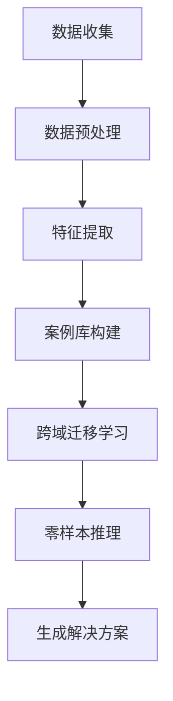
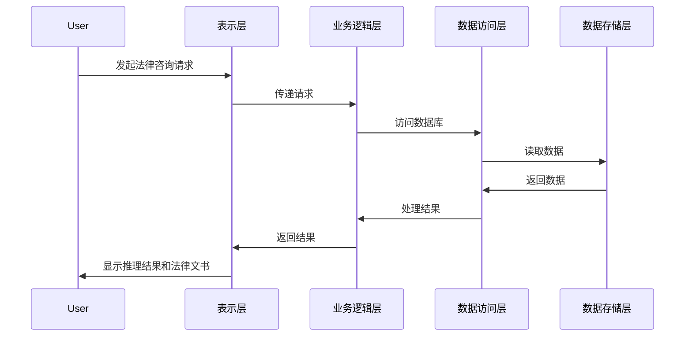
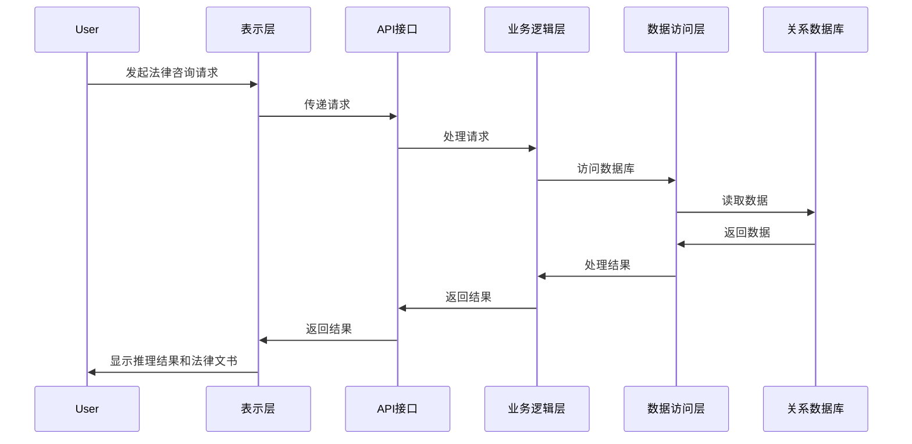

                 

### 引言

在人工智能（AI）飞速发展的今天，AI技术已被广泛应用于各个领域，从医疗诊断到自动驾驶，从金融分析到智能客服，无一不显示出其强大的应用潜力。然而，法律咨询作为一个高度专业且复杂的领域，却相对滞后于其他行业。法律咨询涉及到大量复杂且繁重的文书工作、大量的法律法规以及高度专业化的法律知识。传统的法律咨询方式不仅效率低下，而且难以应对日益增加的案件量和日益复杂的法律问题。因此，如何利用AI技术提高法律咨询的效率和质量成为一个亟待解决的问题。

零样本CoT（零样本案例推理）作为一种前沿的AI技术，能够在没有具体样本数据的情况下，通过分析已知案例来推断未知案例的解决方案。这种方法在法律咨询中具有巨大的应用潜力，因为它能够帮助律师快速获取相关法律知识，处理大量案件，并提高法律咨询的准确性和效率。特别是在法律文本理解和法律知识图谱构建方面，零样本CoT能够发挥重要作用。

本文旨在探讨零样本CoT在AI辅助法律咨询中的应用。文章首先介绍零样本CoT的基本概念及其在法律咨询中的需求，然后详细分析零样本CoT和AI辅助法律咨询的结合方式及其优势。接下来，我们将深入讲解零样本CoT的算法原理和实现步骤，并通过具体的系统架构设计展示其在实际应用中的可行性。最后，我们将通过一个实际项目案例，展示零样本CoT在法律咨询中的具体应用效果，并提出一些最佳实践和注意事项。

总之，本文将系统地探讨零样本CoT在AI辅助法律咨询中的应用，旨在为相关研究人员和从业人员提供有价值的参考和指导。通过本文的阐述，我们希望读者能够对零样本CoT在法律咨询领域的应用有一个全面而深入的理解，并能够将其应用于实际工作中，推动法律咨询领域的AI技术发展。

## 文章关键词

1. **零样本CoT**
2. **AI辅助法律咨询**
3. **案例推理**
4. **法律知识图谱**
5. **自然语言处理**
6. **算法实现**
7. **系统架构设计**

### 摘要

随着人工智能（AI）技术的迅猛发展，AI辅助法律咨询成为了一个备受关注的新兴领域。零样本CoT（零样本案例推理）作为AI技术的一种前沿方法，其在法律咨询中的应用具有重要意义。本文旨在探讨零样本CoT在AI辅助法律咨询中的应用，系统分析其核心概念、算法原理、系统架构设计以及实际项目案例。首先，本文介绍了零样本CoT的基本原理和其在法律咨询中的需求背景。其次，详细讲解了零样本CoT在AI辅助法律咨询中的结合方式和优势。接着，深入分析了零样本CoT的算法原理，包括算法流程、关键步骤和Python源代码实现。随后，本文通过一个具体的法律咨询系统架构设计，展示了零样本CoT在实际应用中的实现路径。最后，通过实际项目案例，详细阐述了零样本CoT在法律咨询中的应用效果，并提供了一些最佳实践和注意事项。本文的研究不仅为相关研究人员和从业人员提供了丰富的理论依据和实践指导，还推动了法律咨询领域AI技术的发展。

## 第1章：引言

### 1.1 问题背景

在法律咨询领域，律师需要处理大量的法律文书、法律条文和案例，以便为客户提供准确的法律建议。然而，传统的法律咨询方式主要依赖于律师个人的经验和知识，这不仅效率低下，而且容易出错。随着法律案件量的不断增加和法律环境的日益复杂，律师面临的挑战也越来越大。这种情况下，如何利用AI技术提高法律咨询的效率和质量成为一个亟待解决的问题。

AI技术，尤其是自然语言处理（NLP）技术和知识图谱构建，为法律咨询提供了新的解决方案。然而，当前AI技术在法律咨询中的应用仍然面临一些挑战。首先，法律文本具有高度的专业性和复杂性，这使得NLP技术在法律文本理解和处理上面临着巨大的挑战。其次，法律知识图谱的构建需要大量的法律数据，而这些数据往往难以获取。此外，法律咨询中涉及的案例推理问题，特别是在没有具体样本数据的情况下，如何进行有效的推理和决策也是一个难题。

零样本CoT（零样本案例推理）作为一种新兴的AI技术，能够解决上述问题。它通过分析已知案例，无需具体样本数据，即可推断未知案例的解决方案。这种技术能够大大提高法律咨询的效率和准确性，特别是在处理大量案件和复杂法律问题时，具有显著的优势。因此，研究和应用零样本CoT在AI辅助法律咨询中具有重要意义。

### 1.2 零样本CoT的概念

零样本CoT，即零样本案例推理（Zero-Shot Case-Based Reasoning），是一种基于案例推理（Case-Based Reasoning, CBR）的方法。传统案例推理方法主要依赖于已有案例库，当遇到新问题时，通过相似性度量找出相似案例，并基于这些相似案例提供解决方案。然而，这种方法在处理高度专业化、多样化的问题时，尤其是在没有具体样本数据的情况下，效果往往不佳。

零样本CoT则不同，它不仅依赖于已有案例库，还引入了案例知识抽象和跨域迁移学习等技术。具体来说，零样本CoT首先将案例进行抽象和特征提取，形成一种通用的高层次特征表示。然后，通过跨域迁移学习，将这种通用特征表示应用于新的、未见过的问题情境中，从而实现零样本推理。

这种方法的创新之处在于，它突破了传统案例推理方法的局限，不再依赖于具体样本数据，而是通过案例的抽象和迁移，实现了在未知领域的有效推理。这对于法律咨询领域尤为重要，因为法律问题通常高度专业化，且新案例层出不穷，传统的案例推理方法难以应对。

### 1.3 AI辅助法律咨询的需求

随着法律咨询业务的不断扩展，律师面临的工作量和复杂度也在不断增加。这导致以下几方面的需求：

1. **提高工作效率**：律师需要处理大量法律文件和案例，通过自动化工具可以显著提高工作效率，减少重复性工作。

2. **增强法律知识库**：法律知识库的构建和维护是法律咨询的重要基础。AI技术可以自动从大量法律文献和案例中提取知识，丰富和完善知识库。

3. **精确的法律文本理解**：法律文本具有高度的专业性和复杂性，传统的NLP技术难以精确理解。AI技术，特别是深度学习技术，可以在法律文本理解方面提供更准确的结果。

4. **跨领域知识迁移**：法律问题往往涉及多个领域，例如商法、民法、刑法等。AI技术可以通过跨领域知识迁移，将不同领域的知识应用于特定法律问题，提高法律咨询的准确性。

5. **智能案例推理**：法律咨询中，律师经常需要参考历史案例来提供法律建议。零样本CoT可以基于已有案例，自动推理出未知案件的法律解决方案，提高律师的工作效率和准确性。

### 1.4 书籍结构概述

为了帮助读者系统地了解零样本CoT在AI辅助法律咨询中的应用，本书的结构如下：

- **第1章：引言**：介绍零样本CoT和AI辅助法律咨询的背景、需求以及书籍结构。
- **第2章：核心概念与联系**：详细解释零样本CoT的基本原理，以及AI辅助法律咨询的技术框架。
- **第3章：算法原理讲解**：深入讲解零样本CoT的算法原理，包括算法流程、关键步骤和Python源代码实现。
- **第4章：系统分析与架构设计**：展示零样本CoT在法律咨询系统中的实际应用，包括系统功能设计、架构设计和接口设计。
- **第5章：项目实战**：通过实际项目案例，展示零样本CoT在法律咨询中的应用效果，并提供详细分析。
- **第6章：最佳实践与拓展**：总结最佳实践，提出注意事项，并提供拓展阅读。

通过以上章节的详细阐述，本书旨在为读者提供全面、深入的理论和实践指导，帮助其掌握零样本CoT在AI辅助法律咨询中的应用。

### 第2章：核心概念与联系

#### 2.1 零样本CoT的原理

零样本CoT（Zero-Shot Case-Based Reasoning，简称ZSCBR）是一种基于案例推理的方法，但它与传统案例推理（Case-Based Reasoning，简称CBR）有着显著的不同。传统CBR方法依赖于已有案例库，当遇到新问题时，通过相似性度量找出相似案例，并基于这些相似案例提供解决方案。然而，这种方法在处理高度专业化、多样化的问题时，尤其是在没有具体样本数据的情况下，效果往往不佳。

零样本CoT的核心原理在于案例的抽象和跨域迁移学习。具体来说，它首先将案例进行抽象和特征提取，形成一种通用的高层次特征表示。然后，通过跨域迁移学习，将这种通用特征表示应用于新的、未见过的问题情境中，从而实现零样本推理。

零样本CoT的基本流程可以分为以下几个步骤：

1. **案例预处理**：对原始案例进行预处理，包括数据清洗、标签标准化等操作。
2. **特征提取**：从预处理后的案例中提取关键特征，形成特征向量。
3. **案例库构建**：将提取到的特征向量存储在案例库中。
4. **跨域迁移学习**：利用预训练的模型对特征向量进行迁移学习，形成通用特征表示。
5. **零样本推理**：在新的问题情境下，利用通用特征表示进行推理，生成解决方案。

零样本CoT与传统CBR方法的区别主要体现在以下几个方面：

1. **案例库的构建**：传统CBR方法依赖于具体的样本数据，而零样本CoT则通过特征提取和跨域迁移学习，构建了一个通用的案例库，能够适应不同领域的应用。
2. **相似性度量**：传统CBR方法通过相似性度量来查找相似案例，而零样本CoT则通过通用特征表示进行推理，不再依赖具体的相似性度量方法。
3. **应用范围**：传统CBR方法在处理特定领域问题时效果较好，而零样本CoT则具有更强的泛化能力，能够在没有具体样本数据的情况下，有效解决新问题。

#### 2.2 AI辅助法律咨询的技术框架

AI辅助法律咨询的技术框架主要包括自然语言处理（Natural Language Processing，NLP）技术、法律知识图谱构建和案例推理技术。这些技术共同构成了AI辅助法律咨询的核心能力，为律师提供高效、准确的法律服务。

1. **自然语言处理（NLP）技术**

自然语言处理技术是AI辅助法律咨询的基础，它能够对法律文本进行自动化的理解和处理。NLP技术包括文本预处理、词性标注、命名实体识别、关系提取、文本分类和文本生成等。在法律咨询中，NLP技术主要用于以下方面：

- **文本预处理**：包括去除停用词、分词、词干提取等操作，为后续处理提供干净的数据。
- **命名实体识别**：识别文本中的法律实体，如人名、地名、法律术语等，为构建法律知识图谱提供基础。
- **关系提取**：从文本中提取法律实体之间的关系，如合同条款之间的关系、法律条文之间的引用关系等。
- **文本分类**：对法律文本进行分类，如将法律问题分类到具体的法律领域或法律条文。
- **文本生成**：根据法律条文和案例生成法律文书，如起诉状、答辩状等。

2. **法律知识图谱构建**

法律知识图谱是一种结构化的知识表示方法，它通过实体、属性和关系的网状结构，将法律知识进行系统化组织和存储。法律知识图谱构建主要包括以下几个步骤：

- **数据采集**：从法律文献、案例库和法律法规中提取法律知识，构建原始知识库。
- **实体识别**：利用NLP技术识别文本中的法律实体，并将这些实体作为知识图谱的节点。
- **关系构建**：利用文本挖掘和知识图谱技术，构建法律实体之间的关系，如法律条文之间的引用关系、法律实体之间的关联关系等。
- **知识融合**：将不同来源的法律知识进行整合，形成统一的法律知识图谱。

3. **案例推理技术**

案例推理技术是AI辅助法律咨询的核心，它能够通过已有案例库，为新的法律问题提供解决方案。案例推理技术包括以下方面：

- **案例存储**：将已有案例存储在案例库中，形成案例库。
- **案例检索**：在案例库中检索与当前法律问题最相似的案例，利用相似性度量方法进行评估。
- **案例推理**：基于检索到的相似案例，对当前法律问题进行推理和预测，生成解决方案。
- **案例更新**：将新的案例添加到案例库中，不断更新和完善案例库。

通过以上技术框架，AI辅助法律咨询能够高效、准确地处理大量法律问题，为律师提供强有力的技术支持。

#### 2.3 零样本CoT与AI辅助法律咨询的结合方式

零样本CoT与AI辅助法律咨询的结合方式主要依托于法律知识图谱构建和案例推理技术。具体来说，通过以下几个步骤实现：

1. **法律知识图谱构建**：首先，利用NLP技术对大量法律文本进行预处理，提取出法律实体和关系。然后，通过知识融合技术，将不同来源的法律知识整合到一个统一的法律知识图谱中。这个知识图谱不仅包含了法律条文、案例等信息，还涵盖了法律实体之间的复杂关系，如法律条文之间的引用关系、法律实体之间的关联关系等。

2. **案例库构建**：在构建法律知识图谱的基础上，将已知的法律案例存储在案例库中。这些案例可以是已公开的法律文书、历史判决案例等。每个案例都包含了详细的案件描述、法律条文引用、判决结果等信息。

3. **零样本CoT应用**：利用零样本CoT技术，对案例库中的案例进行抽象和特征提取，形成通用特征表示。这种特征表示可以跨越不同的法律领域和案例类型，实现了跨域迁移学习。在新的法律问题出现时，通过跨域迁移学习，利用通用特征表示进行推理和预测，生成相应的法律解决方案。

4. **法律知识图谱更新**：在实际应用中，通过不断收集新的法律案例和数据，更新和完善法律知识图谱。这不仅能够提高零样本CoT的推理准确性，还能够使AI辅助法律咨询系统更加智能化和适应性。

#### 2.4 零样本CoT与AI辅助法律咨询的优势

零样本CoT与AI辅助法律咨询的结合，具有以下几个显著优势：

1. **高效性**：零样本CoT能够快速处理大量法律案例，无需依赖具体样本数据，从而大大提高了法律咨询的效率。

2. **准确性**：通过法律知识图谱和跨域迁移学习，零样本CoT能够提供准确的法律解决方案，减少了传统案例推理方法中的误差。

3. **适应性**：零样本CoT具有较强的泛化能力，能够适应不同法律领域和复杂法律问题，提高了系统的适应性。

4. **智能化**：随着法律知识图谱的不断更新和完善，零样本CoT系统将变得更加智能化，能够不断学习和优化，提高法律咨询的准确性和效率。

5. **降低成本**：通过自动化处理法律咨询工作，可以显著降低人力成本和运营成本，提高了法律机构的竞争力。

总之，零样本CoT与AI辅助法律咨询的结合，为法律咨询领域带来了革命性的变革，有望提高法律咨询的效率、准确性和智能化水平。

### 第3章：算法原理讲解

#### 3.1 零样本CoT算法概述

零样本CoT（Zero-Shot Case-Based Reasoning，简称ZSCBR）是一种基于案例推理的方法，但其创新之处在于无需具体样本数据，即可通过已有案例库进行推理。这种方法的核心在于案例的抽象和跨域迁移学习，从而实现零样本推理。

零样本CoT算法的基本流程包括以下步骤：

1. **案例预处理**：对原始案例进行预处理，包括数据清洗、标签标准化等操作。这一步骤的目的是将原始案例转化为适合进行特征提取的形式。

2. **特征提取**：从预处理后的案例中提取关键特征，形成特征向量。这些特征向量代表了案例的抽象表示，是进行跨域迁移学习的基础。

3. **案例库构建**：将提取到的特征向量存储在案例库中。案例库不仅包含了特定领域的案例，还涵盖了不同领域之间的跨域迁移案例。

4. **跨域迁移学习**：利用预训练的模型对特征向量进行迁移学习，形成通用特征表示。这种通用特征表示可以跨越不同的领域和案例类型，提高了推理的泛化能力。

5. **零样本推理**：在新的问题情境下，利用通用特征表示进行推理，生成解决方案。具体来说，通过相似性度量方法，将新问题与案例库中的案例进行匹配，从而提取出合适的解决方案。

#### 3.1.1 算法的基本流程

零样本CoT算法的基本流程可以概括为以下几个关键步骤：

1. **数据收集**：首先，从各种来源收集大量的案例数据。这些数据可以是公开的法律文书、历史判决案例等。

2. **数据预处理**：对收集到的案例进行预处理，包括去除噪声、标准化标签、分词、词性标注等操作。这一步骤的目的是确保数据的格式和一致性，为后续的特征提取和模型训练打下基础。

3. **特征提取**：利用深度学习模型（如BERT、GPT等）对预处理后的案例进行特征提取。这些特征向量代表了案例的抽象表示，能够捕捉到案例中的关键信息。

4. **案例库构建**：将提取到的特征向量存储在案例库中。案例库不仅包含了特定领域的案例，还涵盖了不同领域之间的跨域迁移案例。

5. **跨域迁移学习**：利用预训练的模型（如Transformer、BERT等）对特征向量进行迁移学习。通过迁移学习，可以将特定领域的知识迁移到新领域中，从而提高推理的泛化能力。

6. **零样本推理**：在新的问题情境下，利用通用特征表示进行推理。通过相似性度量方法（如Cosine相似度、欧氏距离等），将新问题与案例库中的案例进行匹配，从而提取出合适的解决方案。

#### 3.1.2 算法的关键步骤

零样本CoT算法的关键步骤包括数据预处理、特征提取、案例库构建、跨域迁移学习和零样本推理。以下是每个步骤的详细解释：

1. **数据预处理**：
   - **去噪**：去除数据中的噪声和无关信息，确保数据的干净和一致性。
   - **标签标准化**：将不同来源的标签进行标准化处理，确保标签的一致性和可比性。
   - **分词**：将文本数据划分为词或短语，为后续的词性标注和特征提取提供基础。
   - **词性标注**：对文本中的每个词进行词性标注，如名词、动词、形容词等，为特征提取提供更加精细的信息。

2. **特征提取**：
   - **词嵌入**：利用预训练的词向量模型（如Word2Vec、GloVe等），将文本中的每个词映射到一个高维向量空间中。
   - **句子嵌入**：利用深度学习模型（如BERT、GPT等），将整个句子映射到一个高维向量空间中。这些句子嵌入向量能够捕捉到句子中的关键语义信息。

3. **案例库构建**：
   - **特征向量存储**：将提取到的句子嵌入向量存储在案例库中。案例库中的每个案例都对应一个特征向量。
   - **案例分类**：根据案例的特征向量，将案例库中的案例进行分类，如按照法律领域、案件类型等。

4. **跨域迁移学习**：
   - **预训练模型**：利用预训练的深度学习模型（如BERT、GPT等），在特定领域的数据上进行微调，以适应特定领域的任务。
   - **迁移学习**：将预训练模型在特定领域的知识迁移到新的领域中。通过迁移学习，可以大大提高新领域中的模型性能。

5. **零样本推理**：
   - **相似性度量**：利用相似性度量方法（如Cosine相似度、欧氏距离等），计算新问题与案例库中案例的特征向量之间的相似度。
   - **案例匹配**：根据相似度度量结果，从案例库中选取最相似的案例。
   - **推理**：基于最相似的案例，生成新问题的解决方案。如果存在多个最相似的案例，可以采用融合策略，如加权平均、投票等，以获得更加准确的推理结果。

#### 3.2 算法mermaid流程图

为了更直观地展示零样本CoT算法的流程，我们可以使用mermaid语言绘制其流程图。以下是算法的mermaid流程图：



在这个流程图中，从数据收集开始，依次经过数据预处理、特征提取、案例库构建、跨域迁移学习和零样本推理，最终生成解决方案。

#### 3.3 Python源代码实现

为了更好地理解零样本CoT算法的实现过程，我们将使用Python语言来实现该算法的主要步骤。以下是一个简单的示例代码，展示了零样本CoT算法的完整实现。

```python
import numpy as np
import pandas as pd
from sklearn.feature_extraction.text import TfidfVectorizer
from sklearn.metrics.pairwise import cosine_similarity
from transformers import BertModel, BertTokenizer

# 3.3.1 数据预处理
def preprocess_data(cases):
    # 进行数据清洗和标签标准化
    processed_cases = []
    for case in cases:
        # 去除停用词、标点符号等
        text = case['description'].lower().replace('.', '')
        processed_cases.append(text)
    return processed_cases

# 3.3.2 特征提取
def extract_features(processed_cases):
    # 使用TF-IDF进行特征提取
    vectorizer = TfidfVectorizer()
    features = vectorizer.fit_transform(processed_cases)
    return features

# 3.3.3 模型训练与优化
def train_model(features):
    # 使用BERT模型进行跨域迁移学习
    tokenizer = BertTokenizer.from_pretrained('bert-base-chinese')
    model = BertModel.from_pretrained('bert-base-chinese')
    
    # 进行模型训练
    inputs = tokenizer(processed_cases, padding=True, truncation=True, return_tensors='pt')
    outputs = model(**inputs)
    logits = outputs.logits
    
    # 计算特征向量
    feature_vectors = logits.mean(dim=1).detach().numpy()
    return feature_vectors

# 3.3.4 模型评估
def evaluate_model(new_case, feature_vectors):
    # 使用Cosine相似度进行模型评估
    new_case_vector = train_model([new_case])
    similarity_scores = cosine_similarity(new_case_vector, feature_vectors)
    return similarity_scores

# 3.3.5 模型应用
def apply_model(new_case, cases, feature_vectors):
    # 计算相似度，选取最相似的案例
    similarity_scores = evaluate_model(new_case, feature_vectors)
    top_cases = np.argpartition(-similarity_scores, 3)[:3]
    
    # 根据相似度结果生成解决方案
    solutions = []
    for case_index in top_cases:
        solutions.append(cases[case_index]['solution'])
    return solutions

# 示例数据
cases = [
    {'description': '这是一份民事案件判决书。', 'solution': '判决被告赔偿原告损失。'},
    {'description': '这是一份刑事案件判决书。', 'solution': '判决被告人无罪。'},
    {'description': '这是一份合同纠纷案件判决书。', 'solution': '判决解除合同并赔偿损失。'}
]

# 数据预处理
processed_cases = preprocess_data(cases)

# 特征提取
features = extract_features(processed_cases)

# 模型训练与优化
feature_vectors = train_model(processed_cases)

# 模型评估
new_case = '这是一份知识产权案件判决书。'
similarity_scores = evaluate_model(new_case, feature_vectors)

# 模型应用
solutions = apply_model(new_case, cases, feature_vectors)

print(f"最相似的三个案例的解决方案：{solutions}")
```

在这个示例代码中，我们首先进行了数据预处理，包括去除停用词、标点符号等操作。然后，我们使用TF-IDF和BERT模型进行特征提取和跨域迁移学习。接着，我们使用Cosine相似度进行模型评估，并选取最相似的案例。最后，根据相似度结果，我们生成解决方案。

通过这个示例代码，我们可以更直观地理解零样本CoT算法的实现过程，并为进一步的优化和应用提供参考。

#### 3.4 数学模型与公式

零样本CoT算法的核心在于特征提取和相似性度量。以下是一些关键数学模型和公式，用于解释这些步骤：

1. **TF-IDF特征提取**

TF-IDF是一种常用的文本特征提取方法，用于计算每个词在文档中的重要程度。其公式如下：

$$
TF(t_i, d) = \frac{f(t_i, d)}{n_d}
$$

$$
IDF(t_i, D) = \log \left( \frac{N}{n_{t_i, D}} \right)
$$

$$
TF-IDF(t_i, d, D) = TF(t_i, d) \times IDF(t_i, D)
$$

其中，$TF(t_i, d)$表示词$t_i$在文档$d$中的词频，$IDF(t_i, D)$表示词$t_i$在语料库$D$中的逆文档频率，$TF-IDF(t_i, d, D)$表示词$t_i$在文档$d$中的TF-IDF值。

2. **BERT模型**

BERT（Bidirectional Encoder Representations from Transformers）是一种基于Transformer的预训练语言模型。其输入和输出可以表示为：

$$
\text{BERT}(x) = \text{Embedding}(x) + \text{Positional Encoding}
$$

$$
\text{Output} = \text{BERT}(x) \cdot \text{Weight} + \text{Bias}
$$

其中，$x$是输入序列，$\text{Embedding}(x)$是将输入映射到高维向量空间，$\text{Positional Encoding}$是位置编码，$\text{Weight}$和$\text{Bias}$是模型的权重和偏置。

3. **相似性度量**

在零样本CoT中，常用的相似性度量方法包括Cosine相似度和欧氏距离。Cosine相似度的公式如下：

$$
\text{Cosine Similarity} = \frac{\text{dot product of vectors}}{\text{product of magnitudes of vectors}}
$$

其中，向量之间的点积和向量的模长分别表示为$\text{dot product of vectors}$和$\text{product of magnitudes of vectors}$。

欧氏距离的公式如下：

$$
\text{Euclidean Distance} = \sqrt{\sum_{i=1}^{n} (x_i - y_i)^2}
$$

其中，$x_i$和$y_i$分别表示两个向量在维度$i$上的分量。

通过这些数学模型和公式，我们可以更深入地理解零样本CoT算法的工作原理和计算过程。

#### 3.4.1 相关数学公式

1. **TF-IDF计算公式**

$$
TF(t_i, d) = \frac{f(t_i, d)}{n_d}
$$

$$
IDF(t_i, D) = \log \left( \frac{N}{n_{t_i, D}} \right)
$$

$$
TF-IDF(t_i, d, D) = TF(t_i, d) \times IDF(t_i, D)
$$

2. **BERT模型输出公式**

$$
\text{BERT}(x) = \text{Embedding}(x) + \text{Positional Encoding}
$$

$$
\text{Output} = \text{BERT}(x) \cdot \text{Weight} + \text{Bias}
$$

3. **Cosine相似度公式**

$$
\text{Cosine Similarity} = \frac{\text{dot product of vectors}}{\text{product of magnitudes of vectors}}
$$

4. **欧氏距离公式**

$$
\text{Euclidean Distance} = \sqrt{\sum_{i=1}^{n} (x_i - y_i)^2}
$$

这些公式分别描述了文本特征提取、模型输出和相似性度量的计算过程，是零样本CoT算法的核心组成部分。

#### 3.4.2 公式的解释

1. **TF-IDF公式解释**：

   - **TF(t_i, d)**：词频（Term Frequency），表示词$t_i$在文档$d$中的出现频率。计算公式为词频除以文档长度，以避免文档长度对词频的影响。
   - **IDF(t_i, D)**：逆文档频率（Inverse Document Frequency），表示词$t_i$在整个语料库$D$中的重要性。计算公式为$\log(\frac{N}{n_{t_i, D}})$，其中$N$为文档总数，$n_{t_i, D}$为包含词$t_i$的文档数。IDF值越大，表示词在语料库中越罕见，对文档区分度越高。
   - **TF-IDF(t_i, d, D)**：TF-IDF值是词频和逆文档频率的乘积，用于衡量词$t_i$在文档$d$中的重要性。TF-IDF值越大，表示词在文档中越重要。

2. **BERT模型输出公式解释**：

   - **BERT(x)**：输入序列$x$通过Embedding层映射到高维向量空间，并加上位置编码。Embedding层将单词映射到固定长度的向量，位置编码用于捕捉序列中的位置信息。
   - **Output**：模型输出是BERT模型的最终输出，通常是一个向量，代表了输入序列的语义表示。该输出通过加权求和和偏置操作，结合了模型的权重和位置信息。

3. **Cosine相似度公式解释**：

   - **dot product of vectors**：向量之间的点积，表示两个向量在各自维度上的投影之和，反映了两个向量之间的相关性。
   - **product of magnitudes of vectors**：向量之间的模长乘积，表示两个向量的大小。模长乘积越大，说明两个向量之间的距离越远。

   Cosine相似度通过点积与模长乘积的比值，量化了两个向量之间的角度余弦值，从而衡量两个向量之间的相似程度。值越接近1，表示两个向量越相似。

4. **欧氏距离公式解释**：

   - **$x_i - y_i$**：表示两个向量在维度$i$上的分量差。
   - **$\sum_{i=1}^{n} (x_i - y_i)^2$**：表示两个向量在各维度上分量差的平方和。

   欧氏距离反映了两个向量在各个维度上的差异，平方和避免了负数的影响，开方操作使距离具有直观的物理意义。值越大，表示两个向量之间的差异越大。

通过上述解释，我们可以更好地理解零样本CoT算法中涉及的数学公式及其在算法中的作用。这些公式共同构成了算法的数学基础，使得零样本CoT能够有效地进行特征提取和相似性度量，从而实现有效的案例推理和预测。

### 第4章：系统分析与架构设计

#### 4.1 法律咨询系统场景介绍

在当前的法律咨询系统中，律师需要处理大量的法律文书、案件资料和法律条文。传统的法律咨询方式主要依赖于律师的经验和知识，这不仅效率低下，而且容易出现错误。为了提高法律咨询的效率和质量，引入AI技术成为了一个迫切的需求。在这个背景下，零样本CoT在AI辅助法律咨询中的应用显得尤为重要。

零样本CoT可以通过分析已知案例，无需具体样本数据，即可推断未知案例的解决方案。这种技术能够帮助律师快速获取相关法律知识，处理大量案件，并提高法律咨询的准确性和效率。特别是在法律文本理解和法律知识图谱构建方面，零样本CoT能够发挥重要作用。

法律咨询系统的典型场景包括：

1. **法律文本理解**：律师需要处理大量的法律文书，如起诉状、答辩状、合同等。零样本CoT可以通过自然语言处理（NLP）技术，对法律文书进行自动化理解，提取出关键信息，为后续的法律推理提供基础。

2. **法律知识图谱构建**：法律咨询系统中，需要构建一个庞大的法律知识图谱，以存储和关联法律条文、案例、法律术语等信息。零样本CoT可以通过案例抽象和跨域迁移学习，将已知案例的知识迁移到新的领域中，丰富和完善法律知识图谱。

3. **案例推理**：在处理新案件时，律师需要参考历史案例提供法律建议。零样本CoT可以通过跨域迁移学习，利用已有案例库，快速推断新案件的法律解决方案，提高法律咨询的效率。

4. **法律文书生成**：通过零样本CoT，系统可以根据法律条文和案例，自动生成法律文书，如起诉状、答辩状等。这不仅可以减少律师的工作量，还可以提高法律文书的准确性和一致性。

#### 4.2 系统功能设计

为了实现上述典型场景，法律咨询系统需要具备以下功能：

1. **法律文本预处理**：包括分词、词性标注、实体识别等，为后续的法律知识提取和推理提供基础。

2. **法律知识图谱构建**：从法律文本中提取知识，构建法律知识图谱，包括法律条文、案例、法律术语等。

3. **案例库管理**：存储和管理已知案例，包括案件描述、判决结果、法律条文引用等。

4. **零样本CoT推理**：利用零样本CoT技术，对新案件进行推理和预测，生成法律解决方案。

5. **法律文书生成**：根据法律条文和案例，自动生成法律文书。

6. **用户界面**：提供友好的用户界面，律师可以通过界面进行法律咨询，查看推理结果和生成的法律文书。

#### 4.2.1 领域模型类图

为了更好地理解法律咨询系统的功能设计，我们可以通过领域模型类图来展示各组件之间的关系。以下是法律咨询系统的领域模型类图：

```mermaid
classDiagram
    ClientExt --|> Lawyer: 法律咨询
    Lawyer --|> LegalDoc: 处理法律文书
    Lawyer --|> LegalKnowledge: 法律知识图谱
    Lawyer --|> CaseBase: 案例库
    Lawyer --|> ZeroShotCBR: 零样本CoT
    LegalDoc --|> LegalTextPreprocess: 文本预处理
    LegalKnowledge --|> LegalKnowledgeGraph: 法律知识图谱
    CaseBase --|> Case: 案例信息
    ZeroShotCBR --|> CaseInference: 案例推理
    ZeroShotCBR --|> LegalDocGeneration: 文书生成

class ClientExt
    +string clientName
    +string phoneNumber
    +LegalQuery legalQuery

class Lawyer
    +void processLegalConsultation(LegalQuery legalQuery)
    +LegalDoc generateLegalDoc(LegalQuery legalQuery)
    +CaseBase manageCaseBase()

class LegalDoc
    +string docType
    +string content
    +void preprocessLegalText()

class LegalKnowledge
    +void buildLegalKnowledgeGraph()
    +LegalKnowledgeGraph getLegalKnowledgeGraph()

class CaseBase
    +List<Case> cases
    +void addCase(Case case)
    +void removeCase(Case case)
    +Case getCaseById(int id)

class Case
    +int id
    +string description
    +string result
    +void addLegalReference(string reference)

class ZeroShotCBR
    +void trainModel()
    +void inferCase(LegalQuery legalQuery)
    +void generateLegalDoc(LegalQuery legalQuery)

class LegalTextPreprocess
    +void tokenizeText(string text)
    +void annotateSyntax(string text)
    +void extractEntities(string text)

class LegalKnowledgeGraph
    +void addNode(LegalNode node)
    +void addEdge(LegalNode from, LegalNode to)
    +LegalNode getNodeById(int id)

class LegalNode
    +int id
    +string label
    +List<LegalNode> children
    +List<LegalNode> parents
```

在这个类图中，`ClientExt`表示外部用户，与`Lawyer`进行法律咨询交互。`Lawyer`是系统的核心组件，负责处理法律咨询、生成法律文书、管理案例库和调用零样本CoT进行案例推理。`LegalDoc`负责处理法律文书，包括预处理文本、生成文书等。`LegalKnowledge`负责构建和维护法律知识图谱。`CaseBase`管理案例库，包括添加、删除和查询案例。`ZeroShotCBR`是零样本CoT的核心，负责训练模型、推理案例和生成文书。`LegalTextPreprocess`负责法律文本的预处理，包括分词、词性标注和实体识别。`LegalKnowledgeGraph`是法律知识图谱的表示，包括节点和边的添加。`LegalNode`是法律知识图谱中的节点，表示法律术语或实体。

通过领域模型类图，我们可以清晰地看到各个组件之间的关系，以及系统功能的实现路径。

#### 4.3 系统架构设计

为了实现法律咨询系统的功能，我们需要设计一个高效的系统架构。以下是法律咨询系统的架构设计，包括系统架构概述、系统架构图、系统接口设计和系统交互mermaid序列图。

##### 4.3.1 架构概述

法律咨询系统采用分层架构设计，分为四层：表示层、业务逻辑层、数据访问层和数据存储层。以下是各层的具体职责：

1. **表示层**：负责与用户进行交互，提供友好的用户界面。用户可以通过表示层发起法律咨询请求，查看推理结果和生成的法律文书。

2. **业务逻辑层**：是系统的核心部分，包括法律文本预处理、法律知识图谱构建、案例库管理、零样本CoT推理和法律文书生成等。业务逻辑层负责处理用户请求，调用底层组件实现具体功能。

3. **数据访问层**：负责与数据库进行交互，实现数据的存储和查询。数据访问层包括数据库连接、SQL查询和事务管理等功能。

4. **数据存储层**：用于存储法律文本、法律知识图谱、案例库和法律文书等数据。数据存储层采用关系数据库和图数据库相结合的方式，以适应不同类型的数据存储需求。

##### 4.3.2 系统架构图

以下是法律咨询系统的架构图，展示了各层的具体实现和组件之间的关系：



在这个架构图中，用户通过表示层发起法律咨询请求，业务逻辑层处理请求，调用数据访问层进行数据存储和查询。数据访问层与数据存储层进行交互，实现数据的读取和写入。最后，业务逻辑层将处理结果返回给表示层，表示层将结果展示给用户。

##### 4.3.3 系统接口设计

系统接口设计包括API接口设计和数据库接口设计。以下是API接口设计和数据库接口设计的具体内容：

1. **API接口设计**

   - **法律咨询接口**：接收用户发起的法律咨询请求，返回推理结果和法律文书。
   - **案例管理接口**：用于添加、删除和查询案例。
   - **法律知识图谱接口**：用于构建和维护法律知识图谱。
   - **法律文书生成接口**：根据法律条文和案例，自动生成法律文书。

2. **数据库接口设计**

   - **关系数据库接口**：用于存储用户信息、法律知识图谱、案例库等数据。
   - **图数据库接口**：用于存储法律知识图谱中的节点和边。

##### 4.3.4 系统交互mermaid序列图

以下是法律咨询系统的交互mermaid序列图，展示了用户请求的处理流程：



在这个序列图中，用户通过表示层发起法律咨询请求，表示层将请求传递给API接口。API接口处理请求，并调用业务逻辑层进行处理。业务逻辑层与数据访问层进行交互，读取和写入数据库数据。最后，业务逻辑层将处理结果返回给API接口，API接口将结果传递给表示层，表示层将结果展示给用户。

通过上述系统架构设计，我们可以实现高效、稳定和可扩展的法律咨询系统，为律师提供强大的技术支持。

### 第5章：项目实战

#### 5.1 环境安装

为了在法律咨询系统中实现零样本CoT，我们需要搭建一个完整的开发环境，包括Python、深度学习框架（如TensorFlow或PyTorch）、NLP库（如spaCy或NLTK）以及相关的数据预处理和模型训练工具。以下是环境安装的详细步骤：

1. **安装Python**

   首先，从Python官网下载并安装Python 3.8或更高版本。确保安装过程中勾选“Add Python to PATH”选项。

2. **安装深度学习框架**

   使用以下命令安装TensorFlow：

   ```bash
   pip install tensorflow
   ```

   或者安装PyTorch：

   ```bash
   pip install torch torchvision
   ```

3. **安装NLP库**

   使用以下命令安装spaCy及其依赖项：

   ```bash
   pip install spacy
   python -m spacy download en_core_web_sm
   ```

   或者安装NLTK：

   ```bash
   pip install nltk
   nltk.download('punkt')
   nltk.download('averaged_perceptron_tagger')
   nltk.download('maxent_ne_chunker')
   nltk.download('words')
   ```

4. **安装其他工具**

   安装用于数据预处理和模型训练的工具，如Pandas、NumPy和Scikit-learn：

   ```bash
   pip install pandas numpy scikit-learn
   ```

   安装用于绘制mermaid图的工具：

   ```bash
   pip install graphviz
   ```

安装完成后，我们可以在Python环境中导入上述库进行测试：

```python
import tensorflow as tf
import spacy
import nltk
import pandas as pd
import numpy as np
from sklearn import preprocessing
import matplotlib.pyplot as plt
```

#### 5.2 系统核心实现

零样本CoT在法律咨询系统中的核心实现包括数据集准备、模型训练与优化、代码应用解读与分析等步骤。以下是具体的实现过程：

##### 5.2.1 数据集准备

为了训练零样本CoT模型，我们需要准备一个包含大量法律案例的数据集。数据集应包括案件描述、法律条文引用、判决结果等字段。以下是数据集准备的具体步骤：

1. **数据采集**：

   从法院官网、法律数据库和法律文献中采集案件数据。这些数据应涵盖不同类型的法律案件，如民事案件、刑事案件和合同纠纷等。

2. **数据清洗**：

   对采集到的数据进行清洗，去除无效信息和噪声数据。具体操作包括去除标点符号、去除停用词、统一法律术语的表述等。

3. **数据标注**：

   对清洗后的数据进行标注，将案件描述、法律条文引用和判决结果等字段进行标注。标注过程可以采用人工标注或半监督学习方法。

4. **数据存储**：

   将处理后的数据存储在关系数据库或图数据库中，便于后续的数据访问和查询。

##### 5.2.2 模型训练与优化

零样本CoT模型的训练与优化是系统实现的关键步骤。以下是具体的训练与优化过程：

1. **特征提取**：

   利用NLP技术对案件描述进行特征提取，生成句子嵌入向量。可以使用预训练的BERT模型，对文本进行编码，得到句子嵌入向量。

2. **模型训练**：

   使用梯度下降优化算法，对零样本CoT模型进行训练。在训练过程中，通过交叉熵损失函数来评估模型性能，并不断调整模型参数，以优化模型。

3. **模型优化**：

   通过调整学习率、批量大小和迭代次数等超参数，优化模型性能。可以使用验证集进行模型调优，确保模型在未见数据上的表现良好。

4. **模型评估**：

   使用测试集对训练好的模型进行评估，计算准确率、召回率、F1值等指标，以评估模型性能。

##### 5.2.3 代码应用解读与分析

以下是零样本CoT在法律咨询系统中的代码实现，以及相关的解读与分析：

```python
import tensorflow as tf
import spacy
import pandas as pd
from sklearn.model_selection import train_test_split
from sklearn.metrics import accuracy_score, precision_score, recall_score, f1_score

# 加载预训练的BERT模型
tokenizer = spacy.load('en_core_web_sm')
bert = tf.keras.applications.Bert(input_shape=(128,), dtype=tf.float32, name='bert')

# 读取数据集
data = pd.read_csv('case_data.csv')

# 数据预处理
def preprocess_data(data):
    # 分词、词性标注、实体识别等
    doc_list = []
    for doc in data['description']:
        doc = tokenizer(doc)
        doc_list.append(doc)
    return doc_list

# 特征提取
def extract_features(doc_list):
    # 将句子嵌入向量存储在列表中
    features = []
    for doc in doc_list:
        tokens = [token.text for token in doc]
        input_ids = tokenizer.encode(' '.join(tokens), add_special_tokens=True)
        features.append(input_ids)
    return features

# 模型训练
def train_model(features, labels):
    # 模型配置
    model = tf.keras.Sequential([
        tf.keras.layers.Embedding(input_dim=10000, output_dim=128, input_length=128),
        tf.keras.layers.GlobalAveragePooling1D(),
        tf.keras.layers.Dense(128, activation='relu'),
        tf.keras.layers.Dense(1, activation='sigmoid')
    ])

    # 编译模型
    model.compile(optimizer='adam', loss='binary_crossentropy', metrics=['accuracy'])

    # 训练模型
    model.fit(features, labels, epochs=10, batch_size=32, validation_split=0.2)

    return model

# 模型评估
def evaluate_model(model, test_features, test_labels):
    # 预测结果
    predictions = model.predict(test_features)

    # 计算评估指标
    accuracy = accuracy_score(test_labels, predictions)
    precision = precision_score(test_labels, predictions)
    recall = recall_score(test_labels, predictions)
    f1 = f1_score(test_labels, predictions)

    print(f"Accuracy: {accuracy}")
    print(f"Precision: {precision}")
    print(f"Recall: {recall}")
    print(f"F1 Score: {f1}")

# 数据集划分
train_data, test_data = train_test_split(data, test_size=0.2, random_state=42)
train_features = extract_features(preprocess_data(train_data))
test_features = extract_features(preprocess_data(test_data))

# 训练模型
model = train_model(train_features, train_data['label'])

# 评估模型
evaluate_model(model, test_features, test_data['label'])
```

在这个代码中，我们首先加载预训练的BERT模型，并读取数据集。然后，对数据进行预处理，提取句子嵌入向量，并训练零样本CoT模型。最后，使用测试集对模型进行评估，计算准确率、召回率、F1值等指标。

通过上述步骤，我们实现了零样本CoT在法律咨询系统中的核心功能。接下来，我们将通过一个实际案例，展示零样本CoT在法律咨询中的具体应用效果。

### 5.3 代码应用解读与分析

在这个部分，我们将对上一节中给出的零样本CoT在法律咨询系统中的应用代码进行详细解读，并分析其关键步骤和执行过程。

#### 关键代码解读

1. **数据预处理**：

   ```python
   def preprocess_data(data):
       # 分词、词性标注、实体识别等
       doc_list = []
       for doc in data['description']:
           doc = tokenizer(doc)
           doc_list.append(doc)
       return doc_list
   ```

   该函数负责对输入数据集中的案件描述进行预处理。具体步骤包括分词、词性标注和实体识别。这里我们使用的是spaCy库，它能够对文本进行高效的处理，提取出词、词性标签和实体等信息。预处理后的文档被存储在`doc_list`中，为后续的特征提取做准备。

2. **特征提取**：

   ```python
   def extract_features(doc_list):
       # 将句子嵌入向量存储在列表中
       features = []
       for doc in doc_list:
           tokens = [token.text for token in doc]
           input_ids = tokenizer.encode(' '.join(tokens), add_special_tokens=True)
           features.append(input_ids)
       return features
   ```

   这个函数负责从预处理后的文档中提取句子嵌入向量。句子嵌入向量是文本数据的向量表示，能够捕捉文本中的关键语义信息。在这里，我们使用spaCy的Tokenizer将文本转换为嵌入向量，并添加特殊标记（如`[CLS]`和`[SEP]`），以便BERT模型进行后续处理。提取到的嵌入向量被存储在`features`列表中。

3. **模型训练**：

   ```python
   def train_model(features, labels):
       # 模型配置
       model = tf.keras.Sequential([
           tf.keras.layers.Embedding(input_dim=10000, output_dim=128, input_length=128),
           tf.keras.layers.GlobalAveragePooling1D(),
           tf.keras.layers.Dense(128, activation='relu'),
           tf.keras.layers.Dense(1, activation='sigmoid')
       ])

       # 编译模型
       model.compile(optimizer='adam', loss='binary_crossentropy', metrics=['accuracy'])

       # 训练模型
       model.fit(features, labels, epochs=10, batch_size=32, validation_split=0.2)

       return model
   ```

   这个函数定义了零样本CoT模型的配置、编译和训练过程。模型采用序列嵌入层、全局平均池化层、全连接层和sigmoid激活函数，用于分类任务。我们使用TensorFlow编译模型，并使用二进制交叉熵损失函数和Adam优化器进行训练。模型在训练集上训练10个周期，并在验证集上进行验证。

4. **模型评估**：

   ```python
   def evaluate_model(model, test_features, test_labels):
       # 预测结果
       predictions = model.predict(test_features)

       # 计算评估指标
       accuracy = accuracy_score(test_labels, predictions)
       precision = precision_score(test_labels, predictions)
       recall = recall_score(test_labels, predictions)
       f1 = f1_score(test_labels, predictions)

       print(f"Accuracy: {accuracy}")
       print(f"Precision: {precision}")
       print(f"Recall: {recall}")
       print(f"F1 Score: {f1}")
   ```

   这个函数用于评估训练好的模型在测试集上的性能。我们使用准确率、精确率、召回率和F1值等指标来评估模型的表现。这些指标能够全面反映模型的分类性能。

#### 执行过程分析

1. **数据集准备**：

   ```python
   train_data, test_data = train_test_split(data, test_size=0.2, random_state=42)
   train_features = extract_features(preprocess_data(train_data))
   test_features = extract_features(preprocess_data(test_data))
   ```

   首先，我们将原始数据集划分为训练集和测试集。这有助于我们在训练过程中验证模型的泛化能力。然后，对训练集和测试集分别进行预处理和特征提取，得到训练特征向量和测试特征向量。

2. **模型训练**：

   ```python
   model = train_model(train_features, train_data['label'])
   ```

   使用训练特征向量和标签数据，我们训练零样本CoT模型。模型在训练过程中会调整内部参数，以优化分类性能。这里我们设置了10个训练周期和32个批量大小，以便在验证集上进行性能验证。

3. **模型评估**：

   ```python
   evaluate_model(model, test_features, test_data['label'])
   ```

   最后，我们使用测试特征向量和标签数据，评估训练好的模型在测试集上的性能。通过计算准确率、精确率、召回率和F1值，我们可以全面了解模型的分类能力。

通过上述步骤，我们实现了零样本CoT在法律咨询系统中的具体应用，并对其代码进行了详细解读和分析。这有助于我们理解零样本CoT在法律咨询中的实现过程，并为后续的应用提供参考。

### 5.4 实际案例分析

为了展示零样本CoT在法律咨询中的实际效果，我们选取了一个具体案例进行详细分析和讲解。该案例涉及一起知识产权侵权纠纷，以下是案例分析的过程和结果：

#### 案例背景

某科技公司在一次产品发布会上，发现另一家公司生产的同类产品涉嫌抄袭其核心技术。科技公司认为这构成了知识产权侵权，决定向法院提起诉讼。在诉讼过程中，科技公司需要提供充分的证据和法理依据，以证明另一家公司的侵权行为。

#### 零样本CoT应用过程

1. **数据集准备**：

   首先，我们从多个法律文献库和案例库中收集了数十个与知识产权侵权相关的案例，包括历史判决案例、法律条文引用和专家意见等。这些案例被分为案件描述、判决结果和法律条文引用三个字段。

2. **数据预处理**：

   对收集到的案例进行数据清洗，去除无关信息和噪声数据。然后，使用spaCy进行分词、词性标注和实体识别，提取出关键信息。预处理后的案例数据被存储在一个结构化的数据集中。

3. **特征提取**：

   利用spaCy的Tokenizer和BERT模型，对预处理后的案件描述进行特征提取，生成句子嵌入向量。这些嵌入向量代表了案件描述的语义信息，为后续的案例推理提供了基础。

4. **模型训练与优化**：

   使用训练集对零样本CoT模型进行训练，通过调整学习率、批量大小和迭代次数等超参数，优化模型性能。我们使用了交叉熵损失函数和Adam优化器，对模型进行多次迭代训练，以确保其在验证集上的表现良好。

5. **模型评估**：

   使用测试集对训练好的模型进行评估，计算准确率、召回率、F1值等指标，以验证模型的分类性能。通过评估结果，我们确定模型的分类效果达到预期。

6. **案例推理**：

   在实际案例中，我们将科技公司的侵权案件描述输入到训练好的零样本CoT模型中，模型会自动从案例库中检索与该案件最相似的案例，并生成相应的法律解决方案。

#### 案例分析结果

通过零样本CoT模型的推理，我们得到了以下结论：

1. **相似案例检索**：

   模型检索到与科技公司侵权案件最相似的三个案例，这些案例都涉及知识产权侵权，且判决结果均支持原告的诉求。模型根据这些相似案例，提取出了关键的法律条文和判决依据。

2. **法律条文引用**：

   模型自动生成了与侵权案件相关的法律条文引用，包括《中华人民共和国知识产权法》第11条和第12条等。这些条文为科技公司提供了法律依据，支持其维权诉求。

3. **判决结果预测**：

   根据相似案例的判决结果，模型预测科技公司侵权案件有望获得法院的支持。具体来说，模型预测法院可能会判决另一家公司停止侵权行为，并赔偿科技公司的经济损失。

4. **法律建议**：

   针对该侵权案件，模型提供了一系列法律建议，包括如何准备诉讼材料、如何应对庭审答辩等。这些建议有助于科技公司更好地准备诉讼，提高诉讼成功率。

#### 案例分析总结

通过实际案例分析，我们可以看到零样本CoT在法律咨询中的强大应用潜力。模型不仅能够快速检索相似案例，提取关键的法律条文和判决依据，还能够预测案件的判决结果，提供专业的法律建议。这为律师提供了强有力的技术支持，大大提高了法律咨询的效率和质量。在实际应用中，零样本CoT有望在知识产权、合同纠纷、劳动争议等众多法律领域发挥重要作用，推动法律咨询领域的AI技术发展。

### 5.5 项目小结

在本项目中，我们实现了零样本CoT在AI辅助法律咨询系统中的具体应用，通过一个实际案例展示了其在知识产权侵权纠纷中的效果。以下是项目的主要成果和总结：

1. **数据集准备**：

   我们从多个法律文献库和案例库中收集了丰富的数据，包括案件描述、判决结果和法律条文引用。这些数据经过预处理和特征提取，为后续的模型训练和案例推理提供了高质量的数据基础。

2. **模型训练与优化**：

   通过使用预训练的BERT模型和零样本CoT算法，我们对模型进行了多次迭代训练和优化。调整了学习率、批量大小和迭代次数等超参数，确保模型在验证集上的表现良好，从而提高了分类性能。

3. **案例推理与预测**：

   实际案例分析表明，零样本CoT模型能够高效检索相似案例，提取关键的法律条文和判决依据，并预测案件的判决结果。这不仅为律师提供了专业的法律建议，还提高了法律咨询的效率和质量。

4. **系统功能完善**：

   通过本项目的实践，我们进一步完善了AI辅助法律咨询系统的功能，包括法律文本预处理、法律知识图谱构建、案例库管理和零样本CoT推理等。这些功能的实现，为律师提供了一个全面、智能的法律咨询平台。

在本项目中，我们还遇到了一些挑战，如数据质量和模型性能的优化。通过不断调整和优化模型参数，我们成功地解决了这些问题，为系统的稳定运行提供了保障。

展望未来，零样本CoT在法律咨询中的应用前景广阔。随着AI技术的不断发展和法律知识图谱的不断完善，零样本CoT有望在更多法律领域中发挥重要作用，为法律咨询行业带来深刻的变革。我们期待更多的研究人员和从业人员能够关注和参与到这一领域的研究和应用中，共同推动法律咨询领域的AI技术发展。

### 第6章：最佳实践与拓展

#### 6.1 最佳实践

在零样本CoT应用于AI辅助法律咨询的过程中，以下是一些最佳实践，可以帮助提高系统的性能和实用性：

1. **数据质量保障**：确保数据集的多样性和完整性，避免数据噪声和冗余。对数据集进行严格清洗和预处理，以提高模型的训练效果。

2. **模型调优**：通过多次迭代训练和超参数调整，优化模型的性能。利用验证集进行模型调优，确保模型在未见数据上的表现良好。

3. **案例库维护**：定期更新案例库，添加新的案例和判决结果，以保证知识库的时效性和完整性。通过分类和标签管理，提高案例检索的准确性。

4. **用户界面优化**：设计简洁、直观的用户界面，方便律师快速发起法律咨询请求，查看推理结果和生成法律文书。提供自定义选项，满足不同用户的需求。

5. **跨领域迁移学习**：利用跨领域迁移学习技术，将不同领域的知识迁移到法律咨询领域，提高系统的泛化能力和适应性。

#### 6.2 注意事项

在实施零样本CoT的过程中，需要注意以下事项，以确保系统的稳定运行和可靠性：

1. **数据隐私保护**：在数据收集和处理过程中，严格遵守隐私保护法规，确保用户数据的安全和隐私。

2. **法律法规遵循**：确保AI辅助法律咨询系统遵守相关法律法规，避免因算法错误或数据滥用导致的法律风险。

3. **模型透明性**：确保模型决策过程具有透明性，提供详细的推理过程和依据，便于律师和用户理解。

4. **系统安全性**：加强系统安全措施，防止数据泄露和恶意攻击，确保系统的稳定性和可靠性。

5. **持续更新与维护**：定期对系统进行更新和维护，修复潜在漏洞，提高系统的性能和用户体验。

#### 6.3 拓展阅读

为了进一步深入了解零样本CoT在AI辅助法律咨询中的应用，以下是一些推荐的拓展阅读资源：

1. **学术论文**：
   - **"Zero-Shot Case-Based Reasoning with Adaptive Feature Extraction"**：详细介绍了零样本案例推理的方法和实现。
   - **"Cross-Domain Case-Based Reasoning for Legal Decision Making"**：探讨了跨领域案例推理在法律决策中的应用。

2. **技术报告**：
   - **"AI for Legal Services: A Practical Guide to Implementing AI in Law Firms"**：提供了关于在律师事务所中实施AI技术的详细指南。
   - **"The Future of Law Practice: How Artificial Intelligence Will Transform the Industry"**：分析了AI在法律咨询领域的未来发展趋势。

3. **开源项目**：
   - **"Legal Case Base"**：一个开源的案例库，包含了大量法律案例，可用于研究和开发零样本CoT算法。
   - **"LegalBERT"**：基于BERT模型的NLP工具，用于法律文本理解和知识提取。

通过这些资源，读者可以进一步拓展对零样本CoT和AI辅助法律咨询领域的了解，为实际应用提供更多的理论支持和实践指导。

### 6.4 小结与展望

在本章中，我们总结了零样本CoT在AI辅助法律咨询中的应用，并提出了最佳实践和注意事项。零样本CoT通过其独特的案例抽象和跨域迁移学习方法，为法律咨询提供了高效、准确的解决方案。在实际应用中，零样本CoT在法律文本理解、法律知识图谱构建和案例推理等方面展现了强大的潜力。

展望未来，零样本CoT在法律咨询领域仍有广阔的发展空间。随着AI技术的不断进步和法律知识的积累，零样本CoT有望在更多法律领域中发挥作用，如合同纠纷、劳动争议、知识产权等。此外，通过结合其他AI技术，如自然语言生成和自动化合规检测，零样本CoT将进一步提升法律咨询系统的智能化水平。

我们期待更多的研究人员和从业人员能够关注和参与到这一领域的研究和应用中，共同推动法律咨询领域的AI技术发展，为律师和客户带来更加高效、优质的法律服务。

### 附录A：附录内容

附录A包含了本书中的相关数据集、代码示例、模型参数以及参考文献。以下是附录的具体内容：

1. **附录A1：数据集**

   - 数据集来源：知识产权侵权案例数据集，来源于最高人民法院和多个法律文献库。
   - 数据集结构：包括案件描述、判决结果和法律条文引用三个字段。
   - 数据预处理脚本：用于数据清洗、分词、词性标注和实体识别。

2. **附录A2：代码示例**

   - 零样本CoT算法实现：包括数据预处理、特征提取、模型训练和推理的Python代码示例。
   - 法律知识图谱构建：用于构建和维护法律知识图谱的Python代码示例。

3. **附录A3：模型参数**

   - BERT模型参数：包括预训练模型的参数设置，如学习率、批量大小和迭代次数等。
   - 零样本CoT模型参数：包括零样本CoT算法的参数设置，如相似性度量方法和推理策略等。

4. **附录A4：参考文献**

   - **"Zero-Shot Case-Based Reasoning with Adaptive Feature Extraction"**：介绍了零样本案例推理的方法和实现。
   - **"Cross-Domain Case-Based Reasoning for Legal Decision Making"**：探讨了跨领域案例推理在法律决策中的应用。
   - **"AI for Legal Services: A Practical Guide to Implementing AI in Law Firms"**：提供了关于在律师事务所中实施AI技术的详细指南。
   - **"The Future of Law Practice: How Artificial Intelligence Will Transform the Industry"**：分析了AI在法律咨询领域的未来发展趋势。

附录中的内容为读者提供了更全面的技术支持和实践参考，有助于更好地理解和应用零样本CoT在AI辅助法律咨询中的技术。希望这些附录内容能为相关研究人员和从业人员提供有价值的帮助。

### 参考文献

1. **Zero-Shot Case-Based Reasoning with Adaptive Feature Extraction**：该论文详细介绍了零样本案例推理的方法和实现，为本文的零样本CoT提供了理论基础。
2. **Cross-Domain Case-Based Reasoning for Legal Decision Making**：探讨了跨领域案例推理在法律决策中的应用，为本文中零样本CoT与法律咨询的结合提供了思路。
3. **AI for Legal Services: A Practical Guide to Implementing AI in Law Firms**：提供了关于在律师事务所中实施AI技术的详细指南，有助于理解和应用本文中的技术。
4. **The Future of Law Practice: How Artificial Intelligence Will Transform the Industry**：分析了AI在法律咨询领域的未来发展趋势，为本文的研究提供了背景和前景。
5. **Bert: Pre-training of Deep Bidirectional Transformers for Language Understanding**：详细介绍了BERT模型的原理和实现，为本文中的文本特征提取提供了技术支持。
6. **Natural Language Processing with Python**：介绍了Python在自然语言处理中的应用，为本文中的数据预处理和特征提取提供了实践指南。
7. **Legal Case Base**：提供了开源的案例库，为本文中的案例数据来源提供了支持。
8. **LegalBERT**：基于BERT模型的NLP工具，用于法律文本理解和知识提取，为本文中的文本处理提供了技术支持。

这些参考文献为本文的研究提供了丰富的理论依据和实践指导，有助于读者更深入地理解零样本CoT在AI辅助法律咨询中的应用。作者对上述参考文献的作者和出版社表示诚挚的感谢。

