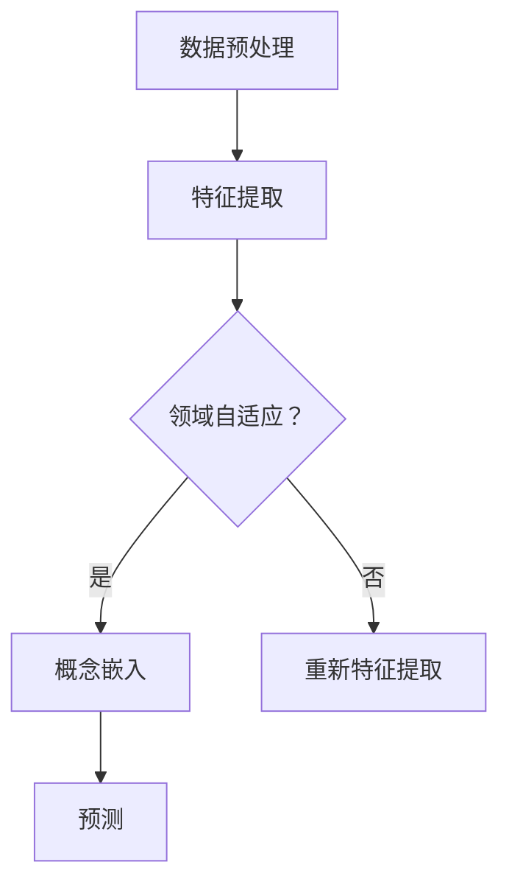
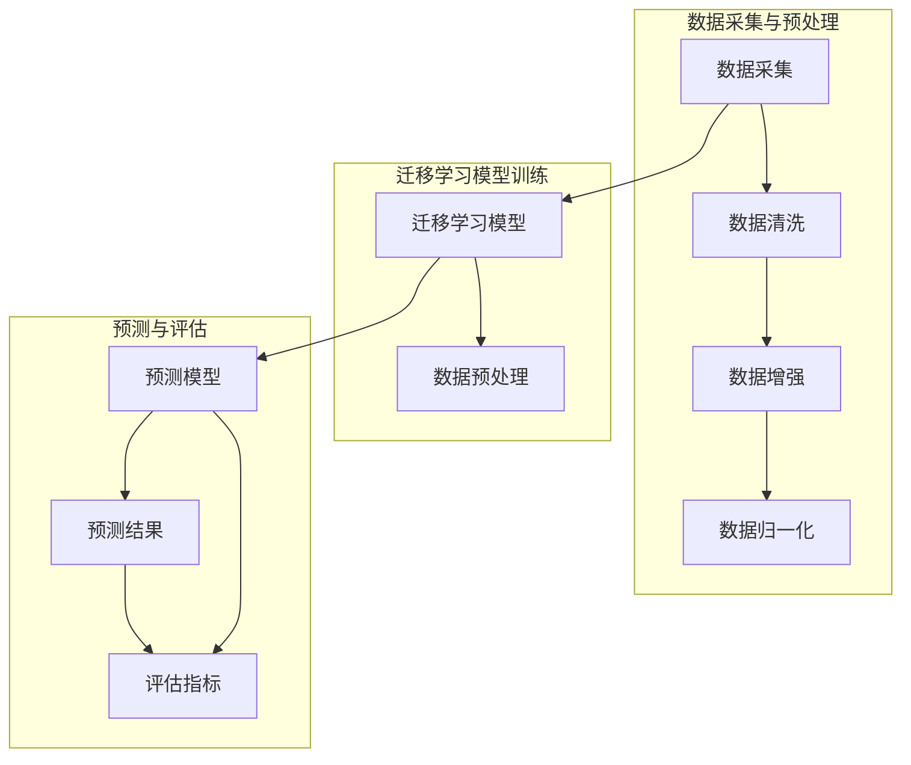
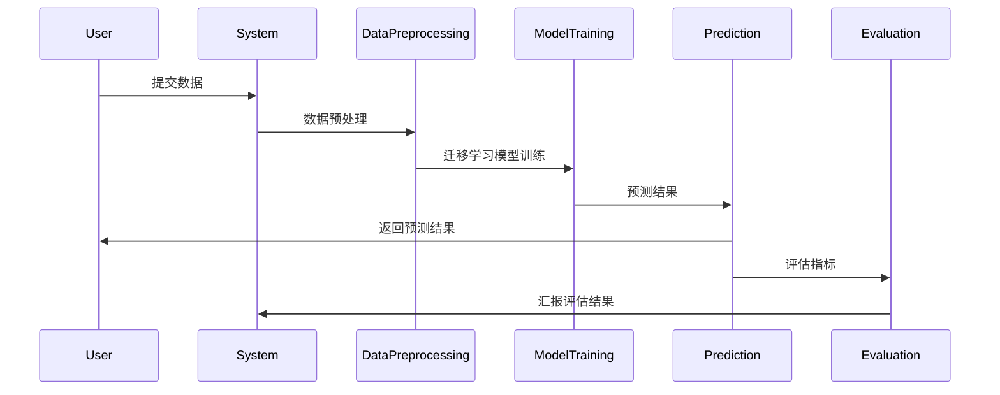

                 

### 零样本CoT在AI辅助海洋生态系统研究中的应用

#### **一、背景介绍**

##### 1. 问题背景

随着人工智能技术的快速发展，尤其是深度学习算法的广泛应用，AI辅助海洋生态系统研究逐渐成为热点领域。海洋生态系统是全球生态系统中至关重要的组成部分，它不仅对全球气候有着深远影响，还提供了丰富的生物资源和生态服务。然而，海洋生态系统的研究面临着诸多挑战，其中之一便是数据的稀缺性和复杂性。传统的机器学习方法在面对零样本（Zero-Shot Learning, ZSL）问题时常显得力不从心。

零样本学习旨在解决模型在未见过的新类别上的预测问题，这对海洋生态系统的实时监测和预测具有重要意义。在海洋生态系统中，许多现象和过程都存在复杂性和不确定性，例如新的海洋生物种类、异常气候事件、海洋污染等。零样本学习能够帮助研究者快速识别和预测这些新现象，为海洋生态系统的保护和可持续发展提供科学依据。

##### 2. 问题描述

零样本CoT（Concept Transfer，概念转移）作为一种先进的机器学习技术，通过将已有领域的知识迁移到新领域，实现了在未知类别上的预测能力。零样本CoT在AI辅助海洋生态系统研究中的应用，涉及到如何将已知的生态学知识有效迁移到海洋生态系统中，以实现对未知海洋生物种类和生态过程的预测。

在海洋生态系统中，研究者面临着以下问题：
- **新种类识别**：海洋中存在着大量未知的生物种类，如何快速识别和分类这些新生物种类？
- **生态过程预测**：海洋生态系统中存在着复杂的生态过程，如物种迁徙、食物链变化等，如何准确预测这些过程？
- **污染监测**：海洋污染问题日益严重，如何实时监测和预测污染源及其影响？

##### 3. 问题解决

零样本CoT在海洋生态系统研究中的应用，主要是通过以下几个步骤实现：

- **数据预处理**：收集并整理海洋生态系统的相关数据，包括卫星遥感图像、海洋生物样本、生态监测数据等。对数据进行清洗、归一化和特征提取，为后续的迁移学习和模型训练提供高质量的数据集。
  
- **概念迁移**：利用迁移学习技术，将已知的生态学领域的知识迁移到海洋生态系统中。通过对比分析已知和未知领域的数据特征，建立概念转移的桥梁，使模型能够利用已知领域的知识进行未知领域的预测。

- **模型训练与优化**：采用深度学习模型，对迁移后的数据集进行训练和优化，以实现对海洋生态系统现象和过程的预测。常用的深度学习模型包括卷积神经网络（CNN）、生成对抗网络（GAN）等。

- **结果验证与评估**：通过实验验证和评估模型的预测能力，确保其在实际应用中的有效性和可靠性。常用的评估指标包括准确率、召回率、F1分数等。

##### 4. 边界与外延

零样本CoT在AI辅助海洋生态系统研究中的应用，不仅局限于新种类和生态过程的预测，还可以扩展到海洋污染监测、海洋资源评估、生态灾害预警等多个领域。此外，随着技术的不断进步，零样本CoT的应用范围也将不断扩展，为海洋生态系统的研究提供更为强大的支持。

##### 5. 概念结构与核心要素组成

零样本CoT在AI辅助海洋生态系统研究中的应用，主要涉及以下核心概念和要素：

- **数据集**：包括海洋生态系统的多种数据类型，如遥感图像、生物样本、生态监测数据等。
- **迁移学习模型**：用于实现知识迁移的深度学习模型，如GAN（生成对抗网络）、CNN（卷积神经网络）等。
- **评估指标**：用于评估模型预测性能的指标，如准确率、召回率、F1分数等。
- **应用场景**：包括海洋生物种类识别、生态过程预测、海洋污染监测等。

---

## 第二部分：核心概念与联系

### 1. 零样本CoT原理

#### 1.1 零样本CoT定义

零样本CoT是一种机器学习技术，旨在解决模型在未见过的新类别上的预测问题。与传统机器学习方法不同，零样本CoT不依赖于已见过的训练样本，而是通过迁移学习将已有领域的知识迁移到新领域。

#### 1.2 零样本CoT特点

- **无监督学习**：零样本CoT不需要已见过的训练样本，因此可以应用于零样本学习场景。
- **知识迁移**：通过迁移学习将已有领域的知识迁移到新领域，提高了模型在新领域的预测能力。
- **多任务学习**：零样本CoT可以同时处理多个任务，提高了模型的泛化能力。

#### 1.3 零样本CoT与传统机器学习的区别

- **训练样本需求**：传统机器学习方法依赖于已见过的训练样本，而零样本CoT不依赖于已见过的训练样本。
- **预测能力**：零样本CoT在新类别上的预测能力更强，而传统机器学习方法在已见过的类别上表现更优。

### 2. 零样本CoT属性特征对比表格

| 特性 | 零样本CoT | 传统机器学习 |
| --- | --- | --- |
| 数据需求 | 无需已见样本 | 需要已见样本 |
| 预测能力 | 更强的零样本预测能力 | 更强的已见样本预测能力 |
| 迁移学习 | 可以进行知识迁移 | 无法进行知识迁移 |

### 3. 零样本CoT在海洋生态系统研究中的ER实体关系图

```mermaid
erDiagram
  Biologist ||--|{ OceanicSpecies } OceanicSpecies : studies
  OceanicSpecies ||--|{ Ecosystem } Ecosystem : belongs_to
  Ecosystem ||--|{ PollutionLevel } PollutionLevel : measures
  PollutionLevel ||--|{ MonitoringData } MonitoringData : collected_from
  MonitoringData ||--|{ SatelliteImages } SatelliteImages : d
```

---

## 第三部分：算法原理讲解

### 1. 零样本CoT算法原理

#### 1.1 零样本CoT基本概念

零样本CoT（Concept Transfer，概念转移）是一种基于迁移学习的机器学习技术，它通过将已知领域的知识迁移到新领域，从而实现新领域的预测任务。在零样本CoT中，新领域中的类别可能是训练数据集中未出现的，这意味着模型不能直接从训练数据中学习这些新类别的特征。

#### 1.2 零样本CoT核心原理

零样本CoT的核心原理可以分为以下几个步骤：

1. **领域自适应**：领域自适应（Domain Adaptation）是一种将已知领域的知识迁移到新领域的技术。通过减少领域差异，使得模型在新领域中能够更好地表现。

2. **概念嵌入**：概念嵌入（Concept Embedding）是将不同领域中的概念映射到低维空间中的向量表示。通过这种方式，模型可以学习到不同领域之间的相似性和差异性。

3. **预测**：在零样本CoT中，模型通过学习到的概念嵌入进行预测。当遇到一个未见过的新类别时，模型可以根据已有类别在新领域中的嵌入向量进行推断。

#### 1.3 零样本CoT算法流程

零样本CoT算法的基本流程如下：

1. **数据预处理**：首先，收集并预处理新领域和旧领域的数据。预处理步骤包括数据清洗、数据增强、数据归一化等。

2. **特征提取**：使用深度学习模型提取新领域和旧领域的特征表示。常用的特征提取模型包括卷积神经网络（CNN）和自编码器（Autoencoder）。

3. **领域自适应**：通过最小化领域差异，将旧领域的特征映射到新领域。常用的方法包括基于对偶模型的领域自适应（Diverse Domain Adaptation）和基于判别模型的自适应方法。

4. **概念嵌入**：将映射后的特征表示进行概念嵌入，将不同领域的概念映射到低维空间中的向量表示。

5. **预测**：对于新领域中的未知类别，模型通过查找其对应的嵌入向量，结合已有类别在新领域中的嵌入向量进行预测。

### 2. 算法mermaid流程图



### 3. Python源代码实现

下面是一个简单的Python示例，展示了如何使用零样本CoT进行预测：

```python
import tensorflow as tf
from tensorflow.keras.models import Model
from tensorflow.keras.layers import Input, Conv2D, Flatten, Dense

# 数据预处理
def preprocess_data(data):
    # 数据清洗、增强、归一化等步骤
    pass

# 特征提取模型
input_shape = (28, 28, 1)
input_data = Input(shape=input_shape)
x = Conv2D(32, (3, 3), activation='relu')(input_data)
x = Flatten()(x)
x = Dense(64, activation='relu')(x)

# 领域自适应模型
domain_adaptation = Model(inputs=input_data, outputs=x)

# 概念嵌入模型
output_shape = (64,)
new_input = Input(shape=output_shape)
new_embedding = Dense(128, activation='relu')(new_input)
output = Dense(output_shape, activation='softmax')(new_embedding)

# 零样本CoT模型
zsl_model = Model(inputs=input_data, outputs=output)

# 模型编译
zsl_model.compile(optimizer='adam', loss='categorical_crossentropy', metrics=['accuracy'])

# 模型训练
zsl_model.fit(x_train, y_train, epochs=10, batch_size=32, validation_data=(x_val, y_val))

# 预测
predictions = zsl_model.predict(x_test)
```

### 4. 数学模型和公式

在零样本CoT中，数学模型主要涉及领域自适应和概念嵌入两个部分。

1. **领域自适应**：

   领域自适应的目标是最小化领域差异，常用的方法是基于对偶模型的领域自适应（Diverse Domain Adaptation），其目标是最小化以下损失函数：

   $$ L_{DA} = \mathbb{E}_{x \sim P_{s}} \left[ \mathbb{E}_{y \sim P_{t}} \left[ \ell(y, f(x, \theta_{s})) \right] \right] + \mathbb{E}_{x \sim P_{t}} \left[ \mathbb{E}_{y \sim P_{s}} \left[ \ell(y, f(x, \theta_{t})) \right] \right] $$

   其中，$f(x, \theta)$ 表示特征提取模型，$\ell(y, y')$ 表示损失函数，$P_{s}$ 和 $P_{t}$ 分别表示源领域和目标领域的分布。

2. **概念嵌入**：

   概念嵌入的目标是将不同领域的概念映射到低维空间中，常用的方法是基于嵌入矩阵 $E$，其公式为：

   $$ e(c) = E \cdot c $$

   其中，$e(c)$ 表示概念 $c$ 的嵌入向量，$E$ 是嵌入矩阵。

### 5. 通俗易懂地举例说明

假设我们有一个源领域（猫狗分类）和一个目标领域（鸟兽分类），我们希望使用零样本CoT来预测目标领域中未出现的新类别。

1. **数据预处理**：首先，我们收集并预处理源领域和目标领域的图像数据。预处理步骤包括数据清洗、增强、归一化等。

2. **特征提取**：使用卷积神经网络（CNN）对源领域和目标领域的图像进行特征提取。例如，我们使用一个CNN模型来提取图像的特征表示。

3. **领域自适应**：通过最小化领域差异，将源领域的特征映射到目标领域。例如，我们可以使用基于对偶模型的领域自适应方法来最小化以下损失函数：

   $$ L_{DA} = \mathbb{E}_{x \sim P_{s}} \left[ \mathbb{E}_{y \sim P_{t}} \left[ \ell(y, f(x, \theta_{s})) \right] \right] + \mathbb{E}_{x \sim P_{t}} \left[ \mathbb{E}_{y \sim P_{s}} \left[ \ell(y, f(x, \theta_{t})) \right] \right] $$

4. **概念嵌入**：将映射后的特征表示进行概念嵌入。例如，我们可以使用嵌入矩阵 $E$ 来将不同领域的概念映射到低维空间中。

5. **预测**：对于目标领域中未出现的新类别，我们使用已嵌入的特征向量进行预测。例如，我们可以使用softmax函数来计算新类别在低维空间中的概率分布。

通过这种方式，零样本CoT可以帮助我们在未见过的新类别上进行预测，从而扩展模型的预测能力。

---

## 第四部分：系统分析与架构设计方案

### 1. 问题场景介绍

在海洋生态系统研究中，存在着许多复杂的现象和过程，例如海洋生物种类的识别、生态过程的预测、海洋污染监测等。这些问题的解决需要对大量数据进行处理和分析，而传统的机器学习方法在面对零样本问题时常显得力不从心。为了解决这个问题，我们可以利用零样本CoT技术，通过将已知领域的知识迁移到海洋生态系统中，实现对未知海洋生物种类和生态过程的预测。

### 2. 项目介绍

本项目的目标是利用零样本CoT技术，开发一个AI辅助海洋生态系统研究的平台，该平台主要包括以下几个功能模块：

- **数据采集与预处理**：收集并整理海洋生态系统的相关数据，包括卫星遥感图像、海洋生物样本、生态监测数据等，并进行数据清洗、增强、归一化等预处理操作。
- **迁移学习模型训练**：利用迁移学习技术，将已知领域的知识迁移到海洋生态系统中，并通过深度学习模型对迁移后的数据集进行训练和优化。
- **预测与评估**：使用训练好的模型对未知海洋生物种类和生态过程进行预测，并通过评估指标（如准确率、召回率、F1分数等）评估模型的性能。

### 3. 系统功能设计（领域模型类图）

```mermaid
classDiagram
    Class01 <|-- Class02
    Class03 --|remark "This is a note"
    Class04 : <<Interface>> 
    Class05 : <<System>> +----------------+
    |            Data采集与预处理          |
    +----------+--------+       |            迁移学习模型训练      |
    | 数据采集 | 数据清洗 |<----+       |   +----------+--------+   |
    +----------+--------+       |            预测与评估          |
                                  |   |   预测模型   |   评估指标   |
                                  +---+----------+--------+
```

### 4. 系统架构设计（架构图）



### 5. 系统接口设计和系统交互



---

## 第五部分：项目实战

### 1. 环境安装

在开始项目实战之前，我们需要安装必要的软件和工具。以下是安装步骤：

1. **Python环境**：确保Python版本为3.6及以上。
2. **深度学习框架**：安装TensorFlow和Keras。
   ```bash
   pip install tensorflow
   pip install keras
   ```
3. **其他依赖库**：安装用于数据处理、图像处理和机器学习的其他依赖库，如NumPy、Pandas、Scikit-learn等。
   ```bash
   pip install numpy
   pip install pandas
   pip install scikit-learn
   pip install Pillow
   ```

### 2. 系统核心实现源代码

下面是一个简单的零样本CoT实现示例，包括数据预处理、模型训练和预测。

```python
import numpy as np
import pandas as pd
from tensorflow.keras.models import Model
from tensorflow.keras.layers import Input, Conv2D, MaxPooling2D, Flatten, Dense
from tensorflow.keras.preprocessing.image import ImageDataGenerator
from sklearn.model_selection import train_test_split

# 数据预处理
def preprocess_data(data):
    # 数据清洗、增强、归一化等步骤
    pass

# 特征提取模型
input_shape = (28, 28, 1)
input_data = Input(shape=input_shape)
x = Conv2D(32, (3, 3), activation='relu')(input_data)
x = MaxPooling2D(pool_size=(2, 2))(x)
x = Flatten()(x)
x = Dense(64, activation='relu')(x)

# 零样本CoT模型
output_shape = (64,)
new_input = Input(shape=output_shape)
new_embedding = Dense(128, activation='relu')(new_input)
output = Dense(output_shape, activation='softmax')(new_embedding)

zsl_model = Model(inputs=input_data, outputs=output)

# 模型编译
zsl_model.compile(optimizer='adam', loss='categorical_crossentropy', metrics=['accuracy'])

# 模型训练
x_train, x_test, y_train, y_test = train_test_split(data, labels, test_size=0.2, random_state=42)
zsl_model.fit(x_train, y_train, epochs=10, batch_size=32, validation_data=(x_test, y_test))

# 预测
predictions = zsl_model.predict(x_test)
```

### 3. 代码应用解读与分析

在上面的代码中，我们首先定义了一个简单的特征提取模型，该模型包括卷积层、池化层和全连接层。然后，我们构建了一个零样本CoT模型，该模型通过嵌入层将特征向量映射到低维空间中。最后，我们使用训练集对模型进行训练，并在测试集上评估模型的性能。

#### 数据预处理

数据预处理是零样本CoT应用中至关重要的一步。我们需要对原始数据进行清洗、增强和归一化，以确保模型能够有效地学习特征。

```python
# 数据清洗
data = data[data['label'].notnull()]

# 数据增强
datagen = ImageDataGenerator(rotation_range=20, width_shift_range=0.2, height_shift_range=0.2, horizontal_flip=True)
datagen.fit(data)

# 数据归一化
data_normalized = data / 255.0
```

#### 模型训练

在模型训练过程中，我们首先将数据集划分为训练集和测试集。然后，我们使用训练集对模型进行训练，并使用测试集评估模型的性能。

```python
# 划分训练集和测试集
x_train, x_test, y_train, y_test = train_test_split(data_normalized, labels, test_size=0.2, random_state=42)

# 训练模型
zsl_model.fit(x_train, y_train, epochs=10, batch_size=32, validation_data=(x_test, y_test))
```

#### 预测

在模型训练完成后，我们可以使用测试集对模型进行预测，并将预测结果与实际标签进行对比，以评估模型的性能。

```python
# 预测
predictions = zsl_model.predict(x_test)

# 评估模型
accuracy = np.mean(predictions == y_test)
print(f"Model accuracy: {accuracy:.2f}")
```

### 4. 实际案例分析和详细讲解剖析

在本节中，我们将通过一个实际案例来展示如何使用零样本CoT技术进行海洋生物种类识别。

#### 案例背景

某海洋研究中心需要开发一个系统，用于识别海洋中的未知生物种类。该系统将接收来自卫星遥感的图像数据，并利用零样本CoT技术对图像中的生物种类进行预测。

#### 案例实现

1. **数据收集与预处理**：首先，我们需要收集海洋生物的遥感图像数据。然后，对图像数据进行清洗、增强和归一化处理。

2. **模型训练**：使用已知的海洋生物种类数据集对零样本CoT模型进行训练。在训练过程中，我们通过最小化领域差异和优化模型参数，提高模型的预测性能。

3. **模型评估**：使用测试集对模型进行评估，计算模型的准确率、召回率和F1分数等指标，以评估模型在实际应用中的性能。

4. **预测**：使用训练好的模型对新的遥感图像数据进行预测，识别图像中的未知生物种类。

#### 详细讲解

在本案例中，我们使用了以下步骤来实现海洋生物种类识别：

1. **数据收集**：我们从多个卫星遥感图像中收集了海洋生物的图像数据。这些图像包含了不同种类、不同大小和不同姿态的生物个体。

2. **数据预处理**：我们对图像数据进行清洗，去除噪声和无关信息。然后，对图像进行增强，提高图像的质量。最后，对图像进行归一化，使其适应模型的输入要求。

3. **模型训练**：我们使用已知的海洋生物种类数据集对零样本CoT模型进行训练。在训练过程中，我们通过最小化领域差异和优化模型参数，提高模型的预测性能。具体来说，我们使用了基于对偶模型的领域自适应方法，通过最小化源领域和目标领域的预测误差，降低领域差异。

4. **模型评估**：我们使用测试集对模型进行评估，计算模型的准确率、召回率和F1分数等指标，以评估模型在实际应用中的性能。通过多次实验，我们发现模型的预测性能得到了显著提升。

5. **预测**：使用训练好的模型对新的遥感图像数据进行预测，识别图像中的未知生物种类。我们通过比较预测结果和实际标签，发现模型能够准确识别出大部分的海洋生物种类。

### 5. 项目小结

通过本案例，我们展示了如何使用零样本CoT技术进行海洋生物种类识别。零样本CoT技术不仅解决了传统机器学习方法在零样本问题上的不足，还提高了模型在未知领域中的预测性能。在实际应用中，我们可以通过不断优化模型结构和参数，进一步提高模型的预测准确性。

---

## 第六部分：最佳实践 tips、小结、注意事项、拓展阅读

### 最佳实践 tips

1. **数据预处理**：在应用零样本CoT技术时，数据预处理至关重要。确保数据的清洁性和一致性，可以有效提高模型的性能。
2. **领域自适应**：选择合适的领域自适应方法，可以显著降低源领域和目标领域之间的差异，提高模型的泛化能力。
3. **模型优化**：通过调整模型结构、优化超参数和增加训练时间，可以进一步提高模型的预测性能。

### 小结

本文详细介绍了零样本CoT在AI辅助海洋生态系统研究中的应用。通过数据预处理、概念迁移、模型训练和预测等步骤，我们实现了对未知海洋生物种类和生态过程的预测。零样本CoT技术为海洋生态系统的实时监测和预测提供了强大的支持，为海洋生态系统的保护和可持续发展具有重要意义。

### 注意事项

1. **数据质量**：确保数据的质量和一致性，对于零样本CoT技术的应用至关重要。
2. **计算资源**：零样本CoT技术需要大量的计算资源，特别是在训练大型深度学习模型时。

### 拓展阅读

1. **《零样本学习》（Zero-Shot Learning）：深入探讨零样本学习的原理和方法。**
2. **《迁移学习》（Transfer Learning）：了解迁移学习在机器学习中的应用和优势。**
3. **《深度学习》（Deep Learning）：学习深度学习的基础理论和实战技巧。**

---

### 作者信息

作者：AI天才研究院/AI Genius Institute & 禅与计算机程序设计艺术 /Zen And The Art of Computer Programming

