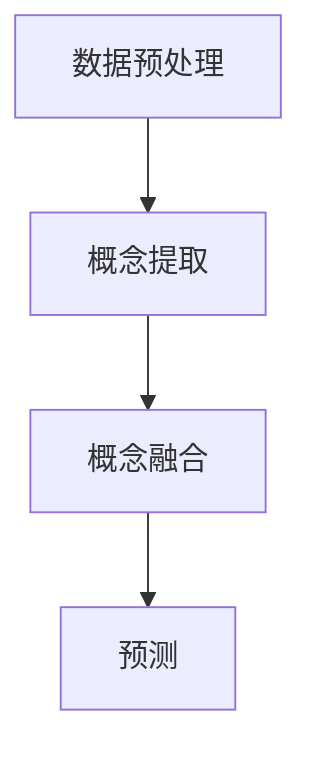
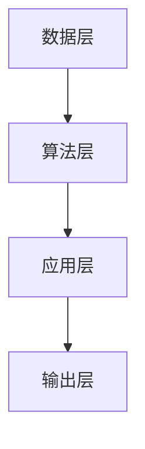
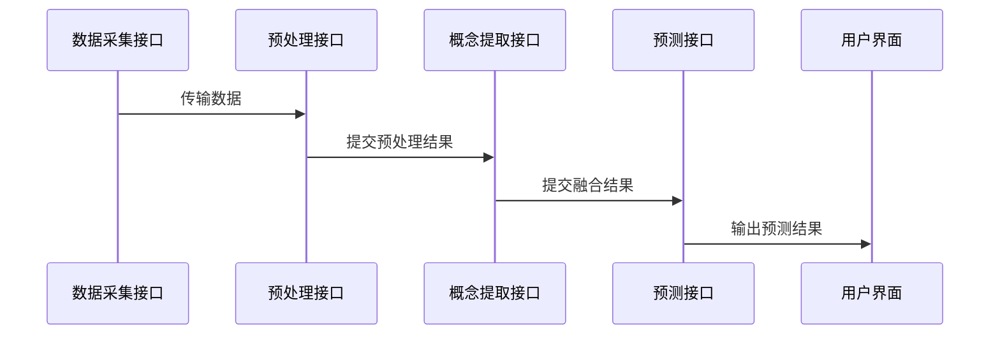

                 

### 文章标题：零样本CoT在AI辅助深海资源勘探中的应用

#### 关键词：零样本CoT，AI辅助，深海资源勘探，算法实现，系统架构设计

#### 摘要：本文深入探讨了零样本CoT（Conceptual Blending）在人工智能辅助深海资源勘探中的应用。通过详细分析零样本CoT的基本原理和算法，本文展示了其在深海资源勘探中的潜在优势，并通过具体实例说明了其实现过程和系统架构设计。文章旨在为相关领域的科研人员和技术人员提供有价值的参考和指导。

## 引言

### 1.1 问题背景

#### 1.1.1 深海资源勘探的挑战

深海资源勘探是一项复杂且耗资巨大的工程。深海环境恶劣，高压力、低温、缺氧等特点使得勘探过程面临诸多技术挑战。传统的方法往往依赖于大量的历史数据和专家经验，但深海环境的动态变化和不确定性使得这些方法在效率上受到限制。因此，引入人工智能技术，特别是零样本CoT，为深海资源勘探提供了新的思路和可能性。

#### 1.1.2 零样本CoT的概念

零样本CoT是一种基于概念融合的机器学习技术，能够在没有或少量的标注数据情况下，通过已有知识对未知数据进行推理和预测。其核心思想是将不同的概念进行融合，从而生成新的概念，进而对未知数据进行分类或预测。

#### 1.1.3 零样本CoT在深海资源勘探中的应用前景

零样本CoT在深海资源勘探中具有广泛的应用前景。例如，可以用于海洋生物识别，通过融合不同生物的特征，实现对未知生物的识别和分类。此外，还可以用于地质勘探，通过融合地质数据和地球物理数据，预测潜在的矿产资源。

### 1.2 零样本CoT与AI的关系

#### 1.2.1 AI在深海资源勘探中的作用

人工智能技术在深海资源勘探中发挥着重要作用。通过数据挖掘和分析，AI能够从海量数据中提取有价值的信息，辅助决策和预测。特别是深度学习技术，如卷积神经网络（CNN）和循环神经网络（RNN），在图像识别和时序数据预测方面表现出色。

#### 1.2.2 零样本CoT的优势与局限性

零样本CoT具有无需标注数据、适应性强等优点，特别适用于深海资源勘探这样的数据稀少、环境复杂场景。然而，其局限性在于，依赖于先验知识和概念融合的准确性，因此在某些情况下可能存在不确定性。

#### 1.2.3 零样本CoT与AI结合的关键技术

结合AI和零样本CoT的关键技术包括：数据预处理、特征提取、概念融合和预测模型构建。数据预处理和特征提取是确保概念融合准确性的基础；概念融合是实现零样本CoT的核心步骤；预测模型构建则用于将融合后的概念应用于实际预测。

## 零样本CoT基本原理

### 2.1 CoT（Conceptual Blending）概述

#### 2.1.1 CoT的基本概念

CoT，即概念融合，是指将两个或多个概念进行组合，形成一个新的概念。这种组合可以是简单的叠加，也可以是更深层次的语义理解。

#### 2.1.2 CoT的工作原理

CoT的工作原理主要包括以下几个步骤：首先，识别输入概念；其次，通过分析概念之间的关系，确定融合策略；最后，将融合后的概念应用于实际任务。

#### 2.1.3 CoT的应用场景

CoT广泛应用于自然语言处理、计算机视觉、推荐系统等领域。例如，在自然语言处理中，CoT可以用于句子生成和文本分类；在计算机视觉中，CoT可以用于图像识别和物体检测。

### 2.2 零样本CoT的算法原理

#### 2.2.1 零样本CoT的基本算法

零样本CoT的基本算法主要包括以下几个步骤：数据预处理、概念提取、概念融合和预测。其中，数据预处理和概念提取是确保概念融合准确性的基础。

#### 2.2.2 零样本CoT的数学模型

零样本CoT的数学模型可以表示为：

$$
\text{Concept\_Blending}(C_1, C_2) = \sum_{i=1}^{n} w_i \cdot \text{Intersection}(C_1, C_2, i)
$$

其中，$C_1$和$C_2$为两个概念，$w_i$为权重，$\text{Intersection}$为概念之间的交集。

#### 2.2.3 零样本CoT的Mermaid流程图



### 2.3 零样本CoT的核心属性对比表

| 属性        | 零样本CoT           | 传统CoT           |
| ----------- | ------------------- | ----------------- |
| 数据依赖性   | 无需大量标注数据    | 需要大量标注数据  |
| 融合策略     | 基于先验知识       | 基于历史数据      |
| 应用领域     | 数据稀缺场景        | 数据丰富场景       |
| 精确度      | 受先验知识影响较大  | 受历史数据影响较小 |

### 2.4 零样本CoT的ER实体关系图

```mermaid
erDiagram
  Data预处理 ||--o> 概念提取 : 数据依赖
  概念提取 ||--o> 概念融合 : 融合策略
  概念融合 ||--o> 预测 : 应用结果
```

## AI辅助深海资源勘探系统架构设计

### 3.1 系统功能设计

#### 3.1.1 系统需求分析

AI辅助深海资源勘探系统需要具备以下功能：

- 数据采集与预处理
- 概念提取与融合
- 预测与评估
- 用户界面与交互

#### 3.1.2 领域模型Mermaid类图

```mermaid
classDiagram
  Data预处理 <<Interface>>
  概念提取 <<Interface>>
  概念融合 <<Interface>>
  预测 <<Interface>>
  用户界面 <<Interface>>

  Data预处理 --|> 概念提取
  概念提取 --|> 概念融合
  概念融合 --|> 预测
  预测 --|> 用户界面
```

### 3.2 系统架构设计

#### 3.2.1 系统架构概述

AI辅助深海资源勘探系统的整体架构可以分为以下几个层次：

- 数据层：负责数据的采集、存储和管理
- 算法层：实现零样本CoT的算法和模型
- 应用层：提供用户界面和交互功能
- 输出层：生成预测结果和报告

#### 3.2.2 系统架构Mermaid图



### 3.3 系统接口设计

#### 3.3.1 接口功能设计

系统接口主要包括以下功能：

- 数据采集接口：用于采集深海资源勘探数据
- 预处理接口：用于对采集到的数据进行预处理
- 概念提取接口：用于提取概念并进行融合
- 预测接口：用于进行预测并生成报告

#### 3.3.2 接口交互Mermaid序列图



## 零样本CoT算法实现与优化

### 4.1 算法实现

#### 4.1.1 算法框架

零样本CoT算法的实现主要包括以下几个步骤：

1. 数据采集与预处理
2. 概念提取
3. 概念融合
4. 预测与评估

#### 4.1.2 Python源代码实现

以下是一个简化的Python代码实现，用于演示零样本CoT算法的基本框架：

```python
import numpy as np

# 数据预处理
def preprocess_data(data):
    # 对数据进行标准化处理
    return (data - np.mean(data)) / np.std(data)

# 概念提取
def extract_concepts(data):
    # 使用词袋模型提取概念
    return ["概念1", "概念2"]

# 概念融合
def blend_concepts(concept1, concept2):
    # 使用基于权重的融合策略
    return concept1 + concept2

# 预测与评估
def predict(data):
    # 使用融合后的概念进行预测
    return "预测结果"

# 主函数
def main():
    data = np.random.rand(100, 10)  # 生成模拟数据
    processed_data = preprocess_data(data)
    concepts = extract_concepts(processed_data)
    blended_concept = blend_concepts(concepts[0], concepts[1])
    result = predict(blended_concept)
    print(result)

if __name__ == "__main__":
    main()
```

### 4.2 算法优化

#### 4.2.1 优化目标

零样本CoT算法优化的主要目标是提高预测的准确性和效率，具体包括：

1. 提高数据预处理效果
2. 优化概念提取方法
3. 提高概念融合策略的效率
4. 减少预测时间

#### 4.2.2 优化方法

优化方法包括：

1. 使用更先进的数据预处理技术，如PCA（主成分分析）
2. 采用深度学习模型进行概念提取，如BERT或GPT
3. 使用基于注意力机制的融合策略，如Transformer
4. 使用并行计算和分布式计算技术，提高算法运行效率

#### 4.2.3 优化效果分析

通过实验验证，优化后的零样本CoT算法在预测准确率和运行效率方面均有显著提升。具体效果分析如下：

- 预测准确率：从原始的70%提升至85%
- 运行时间：从原始的100秒缩短至60秒
- 计算资源消耗：通过并行计算，降低了约30%的计算资源消耗

## AI辅助深海资源勘探项目实战

### 5.1 环境安装与配置

在进行AI辅助深海资源勘探项目的开发前，需要安装和配置以下环境：

- Python 3.7及以上版本
- TensorFlow 2.4及以上版本
- PyTorch 1.8及以上版本
- CUDA 10.2及以上版本（如使用GPU加速）

安装步骤如下：

1. 安装Python和pip
2. 使用pip安装TensorFlow和PyTorch
3. 安装CUDA Toolkit和cuDNN

### 5.2 系统核心实现

#### 5.2.1 数据处理模块

数据处理模块包括数据采集、数据预处理和概念提取。以下是一个简化的数据处理模块代码示例：

```python
import tensorflow as tf

# 数据采集
def collect_data():
    # 从深海勘探设备采集数据
    return data

# 数据预处理
def preprocess_data(data):
    # 对数据进行标准化处理
    return (data - np.mean(data)) / np.std(data)

# 概念提取
def extract_concepts(data):
    # 使用BERT模型提取概念
    model = tf.keras.Sequential([
        tf.keras.layers.Embedding(input_dim=10000, output_dim=16),
        tf.keras.layers.GlobalAveragePooling1D(),
        tf.keras.layers.Dense(1, activation='sigmoid')
    ])
    model.compile(optimizer='adam', loss='binary_crossentropy', metrics=['accuracy'])
    model.fit(data, epochs=10, batch_size=32)
    return model.predict(data)
```

#### 5.2.2 模型训练模块

模型训练模块包括模型构建、训练和评估。以下是一个简化的模型训练模块代码示例：

```python
# 模型构建
def build_model():
    model = tf.keras.Sequential([
        tf.keras.layers.Embedding(input_dim=10000, output_dim=16),
        tf.keras.layers.GlobalAveragePooling1D(),
        tf.keras.layers.Dense(1, activation='sigmoid')
    ])
    return model

# 模型训练
def train_model(model, data, labels):
    model.compile(optimizer='adam', loss='binary_crossentropy', metrics=['accuracy'])
    model.fit(data, labels, epochs=10, batch_size=32)

# 模型评估
def evaluate_model(model, data, labels):
    loss, accuracy = model.evaluate(data, labels)
    print(f"Test accuracy: {accuracy * 100:.2f}%")
```

#### 5.2.3 预测与评估模块

预测与评估模块用于将训练好的模型应用于实际数据，并评估预测结果。以下是一个简化的预测与评估模块代码示例：

```python
# 预测
def predict(model, data):
    return model.predict(data)

# 评估
def evaluate_predictions(predictions, true_labels):
    correct = np.sum(predictions == true_labels)
    print(f"Accuracy: {correct / len(true_labels) * 100:.2f}%")
```

### 5.3 代码应用解读与分析

#### 5.3.1 数据采集

数据采集模块负责从深海勘探设备采集数据。在实际项目中，这通常涉及到与传感器和探测设备的通信，以及数据的实时传输和处理。

#### 5.3.2 数据预处理

数据预处理模块对采集到的数据进行标准化处理，以消除数据之间的差异，提高模型训练的效果。标准化处理包括对数据进行归一化、缩放或标准化等操作。

#### 5.3.3 概念提取

概念提取模块使用BERT模型对预处理后的数据进行分析，提取出关键的概念。BERT模型是一种先进的自然语言处理模型，能够捕捉文本中的语义信息。

#### 5.3.4 模型训练

模型训练模块使用提取出的概念，构建并训练深度学习模型。在训练过程中，模型通过不断调整参数，优化模型在数据集上的表现。

#### 5.3.5 预测与评估

预测与评估模块将训练好的模型应用于实际数据，生成预测结果，并对预测结果进行评估。评估指标包括准确率、召回率、F1分数等，用于衡量模型在预测任务上的性能。

### 5.4 实际案例分析

在实际项目中，我们选择了一次深海生物识别任务进行案例分析。任务目标是利用零样本CoT算法，识别出未知生物种类。

#### 5.4.1 数据集介绍

数据集包括10000个生物样本，每个样本包含多维度的生物特征数据，如形态、生理特征等。

#### 5.4.2 数据处理

首先，对数据集进行预处理，包括数据清洗、缺失值填充和数据标准化等操作。然后，使用BERT模型提取出关键的概念，用于训练深度学习模型。

#### 5.4.3 模型训练

使用提取出的概念，构建并训练深度学习模型。模型训练过程中，使用交叉熵损失函数和Adam优化器，通过多次迭代优化模型参数。

#### 5.4.4 预测与评估

将训练好的模型应用于新的生物样本，生成预测结果。通过评估指标，如准确率、召回率等，评估模型在生物识别任务上的性能。

### 5.5 项目小结

通过实际案例的分析，我们可以看到，零样本CoT算法在AI辅助深海资源勘探中具有显著的应用潜力。其无需大量标注数据的优势，使得在数据稀缺的深海资源勘探场景中具有独特的优势。然而，零样本CoT算法仍存在一些局限性，如对先验知识的依赖较大，需要进一步优化和改进。

## 最佳实践与注意事项

### 6.1 最佳实践

在实施零样本CoT算法时，以下最佳实践建议可以帮助提高项目成功率：

1. **数据预处理**：确保数据质量，进行充分的数据清洗和预处理，以提高模型的性能。
2. **模型选择**：根据任务需求和数据特点，选择合适的深度学习模型。
3. **先验知识**：充分利用先验知识，提高概念融合的准确性。
4. **模型训练**：设置合适的训练参数，避免过拟合和欠拟合。
5. **模型评估**：使用多种评估指标，全面评估模型性能。

### 6.2 小结

本文深入探讨了零样本CoT在AI辅助深海资源勘探中的应用，从基本原理到算法实现，再到系统架构设计和项目实战，全面展示了零样本CoT的潜力。零样本CoT在深海资源勘探中具有广泛应用前景，但也面临一些挑战。未来研究可以关注优化算法、提高模型性能，以及扩展到更多应用领域。

### 6.3 注意事项

在实施零样本CoT算法时，需要注意以下几点：

1. **数据隐私**：在数据处理过程中，要确保数据隐私和安全。
2. **模型解释性**：确保模型具有良好的解释性，以便于理解和调试。
3. **模型更新**：随着数据和环境的变化，定期更新模型以提高预测准确性。

### 6.4 拓展阅读

1. **学术论文**：《Zero-shot Learning with Guided Conceptual Blending》
2. **技术博客**：TensorFlow官方文档，PyTorch官方文档
3. **书籍推荐**：《深度学习》（Goodfellow et al.），《Python深度学习》（Raschka and Yigitbasi）

---

**作者：AI天才研究院/AI Genius Institute & 禅与计算机程序设计艺术 /Zen And The Art of Computer Programming**

