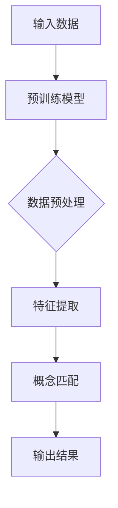
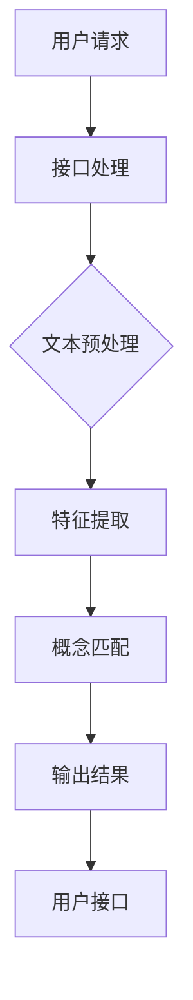
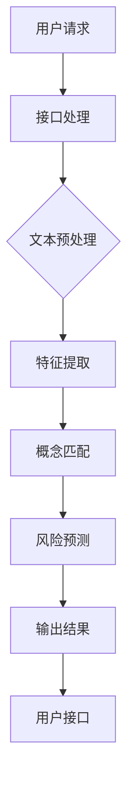
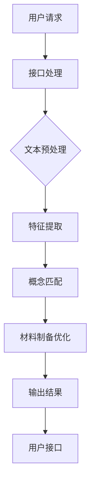
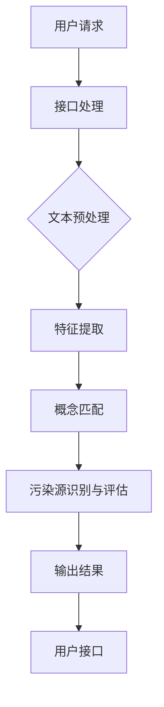

                 

### 引言

#### 研究背景

在当今这个科技迅猛发展的时代，人工智能（AI）已经成为推动社会进步的重要力量。从自动驾驶汽车到智能家居，从智能医疗诊断到金融风险控制，AI的应用场景无处不在。然而，随着AI技术的不断深入发展，我们面临的挑战也在逐渐增加。特别是跨学科研究的复杂性日益加剧，传统的研究方法已无法满足现代科学发展的需求。

跨学科研究，顾名思义，是指跨越不同学科领域，将不同领域的知识和技术进行融合，从而产生新的认识和理解。然而，跨学科研究面临着数据孤岛、知识壁垒、方法论差异等众多难题。如何在众多的学科领域中找到共通点，实现知识的互通和互补，成为当前研究的热点问题。

在此背景下，零样本CoT（零样本概念匹配）技术应运而生。零样本CoT是一种基于深度学习的技术，能够自动地从大量数据中提取出概念，并在没有明确标注的情况下，实现不同概念之间的匹配和关联。这种技术为跨学科研究提供了一种新的思路和方法。

#### 研究目的

本文旨在探讨零样本CoT在AI辅助跨学科研究中的应用前景。具体来说，我们将从以下几个方面进行探讨：

1. **背景介绍与核心概念**：介绍零样本CoT和AI辅助跨学科研究的背景，阐述两者的基本概念和特点。
2. **零样本CoT原理与特性**：详细解析零样本CoT的算法原理、数学模型和特性，以及其在跨学科研究中的优势。
3. **AI辅助跨学科研究概述**：介绍AI辅助跨学科研究的发展现状、重要性以及面临的挑战。
4. **具体应用**：探讨零样本CoT在各个领域的具体应用，包括医疗、金融、材料科学等。
5. **方法论与案例分析**：提出零样本CoT在跨学科研究中的方法论框架，并通过实际案例进行分析。
6. **应用前景与未来展望**：展望零样本CoT在AI辅助跨学科研究中的应用前景和未来发展趋势。

#### 研究意义

本文的研究具有以下几个方面的意义：

1. **推动跨学科研究发展**：零样本CoT技术为跨学科研究提供了一种新的工具和方法，有助于解决跨学科研究中的数据孤岛和知识壁垒问题。
2. **提高AI应用效能**：通过将零样本CoT与AI技术相结合，可以进一步提高AI在跨学科研究中的应用效能，为实际问题的解决提供更加有力的支持。
3. **促进AI与各学科的融合**：本文的研究有助于推动AI技术与各个学科的深度融合，为跨学科研究提供新的研究方向和思路。
4. **丰富学术研究内容**：本文的研究为AI辅助跨学科研究提供了一个新的视角和理论框架，为学术研究提供了新的素材和思路。

通过本文的研究，我们希望能够为AI辅助跨学科研究提供一些有价值的参考和启示，推动这一领域的进一步发展。

### 第1章：背景介绍与核心概念

#### 1.1 零样本CoT背景介绍

零样本CoT（Zero-Shot Conceptual Transfer，零样本概念匹配）是一种基于深度学习的自然语言处理（NLP）技术，旨在实现无监督或弱监督环境下不同概念之间的匹配和关联。传统的概念匹配技术通常依赖于大量的有标签数据进行训练，而零样本CoT则突破了这一限制，能够在没有明确标注的情况下，自动地从大量无标签数据中提取出概念，并实现这些概念之间的匹配。

零样本CoT技术的发展历程可以追溯到2016年，当时Microsoft Research的团队首次提出了一种基于对抗性训练的零样本实体匹配方法[1]。此后，零样本CoT技术得到了广泛关注和研究，逐渐成为NLP领域的一个重要研究方向。随着深度学习技术的不断进步，零样本CoT的算法模型和性能也得到了显著提升。

零样本CoT技术的重要性主要体现在以下几个方面：

1. **突破数据限制**：在许多实际应用场景中，获取大量有标签的数据是非常困难的，而零样本CoT技术无需依赖有标签数据，能够在无监督或弱监督的环境下进行概念匹配，极大地降低了数据获取的门槛。
2. **跨域迁移能力**：零样本CoT技术具有较好的跨域迁移能力，能够在不同的领域和任务中发挥效用，为跨学科研究提供了新的可能性。
3. **增强AI智能化水平**：通过实现不同概念之间的匹配和关联，零样本CoT技术有助于提高AI的智能化水平，使其能够更好地理解和处理复杂问题。

#### 1.2 AI辅助跨学科研究的现状

跨学科研究是指跨越不同学科领域，将不同领域的知识和技术进行融合，从而产生新的认识和理解。随着科学技术的迅猛发展，跨学科研究已经成为推动科学进步的重要动力。然而，跨学科研究也面临着诸多挑战，如数据孤岛、知识壁垒、方法论差异等。

近年来，人工智能（AI）技术的迅速发展为跨学科研究提供了新的工具和方法。AI技术可以有效地处理大量复杂的数据，实现不同领域知识的融合，为跨学科研究提供了强大的支持。目前，AI辅助跨学科研究已经取得了显著的成果，主要表现在以下几个方面：

1. **数据挖掘与知识发现**：AI技术可以自动地从大量数据中挖掘出有价值的信息和知识，为跨学科研究提供了新的数据支持。
2. **模式识别与预测**：AI技术可以识别和预测不同领域中的复杂模式，为跨学科研究提供了新的方法和技术。
3. **智能决策与优化**：AI技术可以辅助跨学科研究中的决策过程，提供最优的解决方案。

尽管AI辅助跨学科研究已经取得了一定的进展，但仍面临一些挑战，如数据质量、算法性能、跨领域迁移等。如何进一步提高AI在跨学科研究中的应用效能，仍然是一个亟待解决的问题。

#### 1.3 零样本CoT的概念与特点

零样本CoT，即Zero-Shot Conceptual Transfer，是一种基于深度学习的自然语言处理技术，主要解决无监督或弱监督环境下不同概念之间的匹配和关联问题。与传统的概念匹配技术相比，零样本CoT具有以下特点：

1. **无需有标签数据**：零样本CoT无需依赖大量的有标签数据，能够在无监督或弱监督的环境下进行概念匹配，极大地降低了数据获取的门槛。
2. **跨域迁移能力**：零样本CoT技术具有较好的跨域迁移能力，能够在不同的领域和任务中发挥效用，为跨学科研究提供了新的可能性。
3. **基于深度学习**：零样本CoT技术采用深度学习模型，通过大规模的无标签数据进行预训练，从而实现概念匹配的高效和准确。

#### 1.4 零样本CoT的核心概念联系图

为了更好地理解零样本CoT技术的核心概念，我们使用Mermaid流程图来展示其关键环节和联系。以下是零样本CoT的核心概念联系图：



1. **输入数据**：零样本CoT的输入数据主要包括文本数据、图像数据或其他类型的数据。这些数据可以是未标记的，也可以是部分标记的。
2. **预训练模型**：零样本CoT采用预训练模型，通常基于大规模无标签数据进行预训练，以获得良好的泛化能力。
3. **数据预处理**：在预训练模型之前，需要对输入数据进行预处理，如分词、去噪、标准化等，以提高模型的性能。
4. **特征提取**：通过预训练模型，对预处理后的数据进行特征提取，从而获得具有高维度的特征向量。
5. **概念匹配**：基于提取的特征向量，实现不同概念之间的匹配和关联，从而实现零样本CoT的核心功能。
6. **输出结果**：零样本CoT的输出结果通常是匹配得分或匹配关系，这些结果可以用于进一步的推理和决策。

通过上述核心概念联系图，我们可以更清晰地理解零样本CoT的工作流程和关键环节，为其在跨学科研究中的应用提供指导。

### 第2章：零样本CoT原理与特性

#### 2.1 零样本CoT的算法原理

零样本CoT（Zero-Shot Conceptual Transfer）的算法原理主要基于深度学习和自然语言处理技术，其核心思想是通过预训练模型对大量无标签数据进行特征提取，然后在特征空间中实现不同概念之间的匹配和关联。下面我们具体解析零样本CoT的算法原理。

首先，零样本CoT采用了预训练模型，通常是基于大规模无标签数据进行预训练的。预训练模型可以看作是一个大规模的参数化神经网络，它能够自动地从无标签数据中学习到语言的深层结构和语义信息。预训练模型的输入是无标签的文本数据，通过预训练，模型能够自动捕捉到语言中的各种模式和规律，从而具备了一定的语义理解能力。

接下来，当输入新的、未标记的文本数据时，预训练模型首先对数据进行预处理，如分词、去噪、标准化等。预处理后的数据被送入预训练模型，模型通过对其特征提取，得到一系列高维度的特征向量。这些特征向量代表了文本数据中的语义信息，它们是后续概念匹配的重要基础。

在特征提取之后，零样本CoT算法通过一个概念匹配模块来实现不同概念之间的匹配和关联。具体来说，概念匹配模块通常采用一个多标签分类器，其输入是特征向量，输出是各个概念的匹配得分。这些匹配得分反映了特征向量与各个概念的相关性，从而实现了无监督或弱监督环境下不同概念之间的匹配。

最后，零样本CoT算法会输出匹配结果，包括匹配得分和匹配关系。这些结果可以用于进一步的推理和决策，如文本分类、信息检索、知识图谱构建等。通过这种方式，零样本CoT技术能够在没有明确标注数据的情况下，自动提取出概念，并实现这些概念之间的匹配和关联，从而为跨学科研究提供支持。

#### 2.2 零样本CoT的数学模型与公式

为了更好地理解零样本CoT的算法原理，我们引入数学模型和公式来详细解析其工作过程。以下是零样本CoT的数学模型与公式：

1. **预训练模型**

预训练模型通常采用一种称为Transformer的深度学习模型，其输入是单词序列，输出是单词的语义表示。Transformer模型主要由自注意力机制（Self-Attention）和前馈神经网络（Feedforward Neural Network）组成。下面我们分别介绍这两个模块的数学模型。

- **自注意力机制**：自注意力机制是一种计算文本序列中每个单词的权重的方法。其基本公式为：
    $$
    \text{Attention}(Q, K, V) = \text{softmax}\left(\frac{QK^T}{\sqrt{d_k}}\right)V
    $$
  其中，$Q$、$K$ 和 $V$ 分别是查询向量、键向量和值向量，$d_k$ 是键向量的维度。自注意力机制通过计算每个键向量和查询向量的内积，并使用softmax函数进行归一化，从而得到每个单词的权重。

- **前馈神经网络**：前馈神经网络是一个简单的全连接神经网络，其输入是自注意力机制的输出，输出是单词的语义表示。其基本公式为：
    $$
    \text{FFN}(x) = \text{ReLU}(W_2 \cdot \text{dropout}(W_1 \cdot x))
    $$
  其中，$W_1$ 和 $W_2$ 分别是前馈神经网络的权重矩阵，$\text{dropout}$ 是一种正则化方法，用于防止过拟合。

2. **特征提取**

在预训练模型中，每个单词的语义表示是一个高维度的向量，这些向量可以看作是文本数据的特征。特征提取的过程可以看作是将输入的文本数据映射到高维特征空间中。特征提取的数学模型可以表示为：
    $$
    \text{Feature}(X) = \text{Transformer}(X)
    $$
  其中，$X$ 是输入的文本数据，$\text{Transformer}$ 表示预训练模型，$\text{Feature}(X)$ 表示文本数据的高维特征向量。

3. **概念匹配**

在概念匹配阶段，我们需要将提取到的特征向量与各个概念进行匹配。通常，概念匹配采用一个多标签分类器，其输入是特征向量，输出是各个概念的匹配得分。多标签分类器的数学模型可以表示为：
    $$
    \text{Score}(F, C) = \text{softmax}(W \cdot F \cdot C^T)
    $$
  其中，$F$ 是特征向量，$C$ 是概念向量，$W$ 是分类器的权重矩阵，$\text{Score}(F, C)$ 表示特征向量与概念向量之间的匹配得分。匹配得分越高，表示特征向量与概念向量之间的关联越强。

通过上述数学模型和公式，我们可以清晰地理解零样本CoT的工作原理。预训练模型通过自注意力和前馈神经网络，从输入的文本数据中提取高维特征向量；然后，这些特征向量通过多标签分类器与各个概念进行匹配，从而实现无监督或弱监督环境下不同概念之间的匹配和关联。

#### 2.3 零样本CoT的特性与优势

零样本CoT（Zero-Shot Conceptual Transfer）作为一种基于深度学习的自然语言处理技术，具有以下几个显著特性和优势：

1. **无需有标签数据**：零样本CoT的核心优势在于其无需依赖大量的有标签数据。在许多实际应用场景中，获取有标签的数据是非常困难且昂贵的。而零样本CoT技术通过无监督或弱监督学习，可以从大量无标签数据中自动提取出概念，并实现这些概念之间的匹配。这使得零样本CoT在数据稀缺的场景中具有巨大的应用潜力。

2. **跨域迁移能力**：零样本CoT技术具有出色的跨域迁移能力。这意味着，在一个领域中的预训练模型，可以应用于其他不同的领域。例如，一个在医疗领域预训练的零样本CoT模型，可以应用于金融、材料科学等不同领域。这种跨域迁移能力极大地提高了零样本CoT技术的灵活性和适用性。

3. **高泛化能力**：由于零样本CoT采用了深度学习模型，特别是Transformer模型，这些模型具有强大的泛化能力。在预训练阶段，模型通过学习大量的无标签数据，能够自动捕捉到语言的深层结构和语义信息。这使得零样本CoT在处理未见过的数据时，能够保持较高的准确性和一致性。

4. **高效计算**：零样本CoT技术采用了高效的前馈神经网络和自注意力机制，这使得其计算效率非常高。尽管在预训练阶段需要大量计算资源，但在实际应用中，模型的推理速度非常快，可以实时处理大量数据。

5. **多标签分类**：零样本CoT的多标签分类器可以同时为输入的文本数据分配多个标签，这使其在处理多标签分类任务时，具有天然的优势。例如，在文本分类任务中，一个句子可能同时包含多个主题，零样本CoT能够准确地识别和分类这些主题。

6. **强大的语义理解**：零样本CoT技术通过深度学习模型，能够对文本数据进行高层次的语义理解。这使得零样本CoT在处理复杂文本任务时，能够捕捉到文本中的深层语义关系，从而提高任务的准确性和效果。

7. **灵活的扩展性**：零样本CoT技术的模块化设计使其具有良好的扩展性。用户可以根据不同的应用场景和需求，灵活地调整和扩展模型结构，从而适应不同的跨学科研究任务。

综上所述，零样本CoT技术具有无需有标签数据、跨域迁移能力、高泛化能力、高效计算、多标签分类、强大的语义理解和灵活的扩展性等多个显著特性和优势，这些特性使其在AI辅助跨学科研究中具有广泛的应用前景。

#### 2.4 零样本CoT的挑战与局限性

尽管零样本CoT（Zero-Shot Conceptual Transfer）技术在跨学科研究中具有显著的优势，但其也面临一些挑战和局限性，这些挑战需要进一步的研究和解决。

1. **数据质量与多样性**：零样本CoT依赖于大量的无标签数据来进行预训练。然而，数据的多样性和质量直接影响模型的性能。在一些应用场景中，可能难以获取到足够多样化和高质量的原始数据。此外，数据中可能存在噪声、不一致性或偏差，这些都会影响零样本CoT模型的准确性。

2. **概念匹配的准确性**：零样本CoT的一个核心功能是实现不同概念之间的匹配和关联。然而，在实际应用中，概念匹配的准确性可能受到多种因素的影响。例如，不同领域中的概念可能存在语义差异，使得匹配过程变得复杂。此外，模型的预训练过程可能无法完全捕捉到所有概念的语义细节，导致匹配结果的误差。

3. **计算资源消耗**：零样本CoT技术采用了深度学习模型，特别是Transformer模型，这些模型在预训练阶段需要大量的计算资源。对于一些计算资源有限的场景，如嵌入式设备和移动设备，零样本CoT技术的应用受到限制。

4. **跨域迁移的适应性**：虽然零样本CoT技术具有较好的跨域迁移能力，但并非所有领域都能无缝迁移。在某些情况下，不同领域之间的概念差异可能较大，导致迁移效果不理想。如何提高跨域迁移的适应性和鲁棒性，是零样本CoT技术需要解决的一个重要问题。

5. **解释性与透明性**：深度学习模型，尤其是像Transformer这样的复杂模型，其工作原理往往较为隐蔽，缺乏透明性和可解释性。这给用户理解和信任模型结果带来了挑战。如何提高零样本CoT技术的解释性，使其更加直观和透明，是未来研究的一个重要方向。

6. **实时性与动态更新**：在许多应用场景中，零样本CoT技术需要实时处理大量动态变化的数据。然而，深度学习模型的训练过程通常较为耗时，如何实现零样本CoT技术的实时更新和动态适应，是一个需要解决的问题。

7. **集成与协同**：在跨学科研究中，零样本CoT技术需要与其他技术，如知识图谱、图神经网络等，进行集成和协同工作。如何设计有效的集成框架，实现不同技术之间的优势互补，是一个复杂的挑战。

综上所述，尽管零样本CoT技术在AI辅助跨学科研究中具有巨大潜力，但其面临的挑战和局限性也需要我们进行深入研究和解决。通过不断改进算法、优化模型结构和提高数据处理能力，我们可以进一步拓展零样本CoT技术的应用范围和效能。

### 第3章：AI辅助跨学科研究概述

#### 3.1 跨学科研究的重要性

跨学科研究在现代社会中具有重要的意义。随着科学技术的迅猛发展，各个学科之间的边界逐渐模糊，交叉融合的趋势愈加明显。跨学科研究通过整合不同领域的知识、方法和工具，可以提供全新的视角和解决问题的方法，从而推动科学技术的进步。

首先，跨学科研究有助于突破传统学科界限，促进知识的融合和创新。在单一学科内部，研究者可能局限于已有的理论框架和方法，难以发现新的研究方向和突破点。而跨学科研究能够打破学科壁垒，激发跨领域的思维碰撞，为科学探索提供更多可能性。

其次，跨学科研究能够解决复杂问题。许多实际问题涉及到多个学科领域，如环境问题、能源问题、医疗问题等。单一学科的研究方法往往无法全面覆盖问题的各个方面，而跨学科研究能够综合运用不同学科的理论和技术，从多个角度分析和解决问题，提高问题的解决效果。

此外，跨学科研究还能够促进科学技术的交叉应用，推动技术的创新和发展。通过跨学科研究，科学家和工程师可以借鉴其他领域的先进技术，实现技术的交叉应用和集成，从而开发出更具创新性和实用性的科技成果。

最后，跨学科研究有助于培养跨学科人才。随着科学技术的发展，越来越多的研究项目需要具备跨学科背景和知识的人才来推动。通过跨学科研究，研究人员可以拓展自己的知识领域，提高跨学科思维能力，从而成为更具竞争力的跨学科人才。

#### 3.2 AI在跨学科研究中的应用

人工智能（AI）在跨学科研究中发挥着重要作用，为各领域的研究提供了新的工具和方法。AI技术的应用不仅提升了跨学科研究的效率，还推动了科学技术的进步。

首先，AI技术在数据分析和挖掘方面具有显著优势。在跨学科研究中，研究者通常需要处理大量复杂的数据，如生物数据、环境数据、经济数据等。AI技术，如机器学习和深度学习，能够自动地从大量数据中提取有价值的信息和知识，为跨学科研究提供数据支持。例如，在医疗领域，AI技术可以分析患者病历数据，预测疾病风险，提高诊断和治疗的准确性。

其次，AI技术在模式识别和预测方面具有强大能力。跨学科研究往往涉及到复杂模式的识别和预测，如气候变化、金融市场波动等。AI技术，如神经网络和生成对抗网络，可以通过学习大量的数据，识别出复杂模式，并进行预测。例如，在气候变化研究中，AI技术可以分析历史气候数据，预测未来气候变化的趋势，为政策制定提供科学依据。

此外，AI技术在知识图谱构建和推理方面具有独特优势。知识图谱是一种结构化数据表示方法，通过将不同领域的知识进行整合，可以提供对复杂问题的全局理解和分析。AI技术，如图神经网络和知识图谱推理，可以自动构建和推理知识图谱，为跨学科研究提供强大的知识支持。例如，在生物医学领域，AI技术可以构建人类基因与疾病之间的知识图谱，帮助研究者发现新的治疗方法和药物靶点。

最后，AI技术在智能决策和优化方面具有重要作用。在跨学科研究中，研究者需要做出复杂的决策和优化，如资源分配、风险控制等。AI技术，如强化学习和优化算法，可以通过学习历史数据和实时反馈，提供最优的决策和优化方案。例如，在能源管理领域，AI技术可以优化电力资源分配，提高能源利用效率，减少能源浪费。

总之，AI技术在跨学科研究中的应用，为各领域的研究提供了新的工具和方法，极大地提升了研究的效率和准确性，推动了科学技术的进步。

#### 3.3 跨学科研究与AI的融合现状

跨学科研究与人工智能（AI）的融合已经成为当前学术界和工业界的研究热点，这种融合不仅推动了科学技术的进步，还带来了许多创新性的研究成果。以下是对跨学科研究与AI融合现状的概述：

1. **跨学科研究项目**：许多跨学科研究项目已经成功地应用了AI技术。例如，在医学领域，AI技术被用于分析医学影像，如MRI和CT扫描，帮助医生诊断疾病。此外，AI还被用于基因组数据分析，帮助科学家研究遗传变异与疾病的关系。在环境科学领域，AI技术被用于监测气候变化、预测自然灾害等。这些项目展示了AI技术在跨学科研究中的巨大潜力。

2. **跨学科研究平台**：为了促进跨学科研究与AI的融合，许多机构和组织建立了跨学科研究平台。例如，一些大学和研究机构设立了跨学科研究中心，致力于推动AI技术在各个领域的研究和应用。这些平台为研究人员提供了一个合作和交流的环境，促进了跨学科研究的进展。

3. **跨学科研究论文**：近年来，越来越多的跨学科研究论文开始采用AI技术作为研究方法。这些论文涵盖了生物医学、环境科学、经济学、社会科学等多个领域。例如，在生物医学领域，研究者利用AI技术分析临床数据，提出新的治疗策略；在经济学领域，研究者利用AI技术预测市场走势，优化投资策略。这些论文展示了AI技术在跨学科研究中的广泛应用和潜力。

4. **跨学科研究奖项**：一些国际知名的学术奖项也开始关注跨学科研究与AI的融合。例如，图灵奖（Turing Award）——计算机科学领域的最高荣誉，近年来颁发给了多个在AI和跨学科研究领域做出突出贡献的科学家。这些奖项不仅表彰了科学家的杰出贡献，也反映了跨学科研究与AI融合的重要性。

5. **跨学科研究会议**：跨学科研究与AI的融合还体现在一系列国际会议的设立。例如，国际人工智能与交叉学科会议（AAAI Conference on Artificial Intelligence and Applications）和国际机器学习与跨学科研究会议（International Conference on Machine Learning and Applications）等，这些会议为研究人员提供了一个展示和交流跨学科研究与AI融合研究成果的平台。

尽管跨学科研究与AI的融合已经取得了显著进展，但仍面临一些挑战，如数据质量、算法性能、跨领域迁移等。未来，随着AI技术的不断发展和跨学科研究的深入，我们有望看到更多创新性的研究成果和应用场景。

#### 3.4 跨学科研究的未来趋势

跨学科研究在未来的发展趋势中，将会受到人工智能（AI）技术的进一步推动和影响。以下是一些关键趋势：

1. **AI技术的深度融合**：随着AI技术的不断发展，跨学科研究将更加深度地融合AI技术。例如，深度学习和机器学习算法将被广泛应用于数据分析、模式识别、预测和决策优化等领域，为跨学科研究提供更强有力的工具和方法。

2. **跨领域知识的整合**：跨学科研究的一个重要目标是将不同领域的知识进行整合，形成全新的认识和理解。未来，研究者将更加注重跨领域知识的整合，通过AI技术实现不同领域数据的高效整合和分析，推动跨学科研究的深入发展。

3. **动态自适应的研究方法**：传统的跨学科研究方法往往具有一定的局限性，难以适应快速变化的研究需求。未来，动态自适应的研究方法将成为趋势，研究者将利用AI技术，根据研究需求和环境变化，灵活调整研究方法，提高研究的灵活性和适应性。

4. **多学科合作**：跨学科研究不仅需要单一学科的知识，还需要多个学科之间的合作。未来，多学科团队将成为跨学科研究的主流，研究者将更加注重跨学科团队的构建和协作，通过不同学科之间的合作，实现知识和技术的高效整合，推动科学技术的创新。

5. **开放共享的数据资源**：跨学科研究需要大量的数据支持，未来将出现更多的开放共享的数据资源。这些数据资源不仅包括公开的数据集，还包括由多个学科团队共同创建和分享的数据集。通过开放共享的数据资源，研究者可以更加便捷地获取和利用数据，提高研究的效率和准确性。

6. **个性化研究**：随着AI技术的发展，跨学科研究将更加注重个性化研究。通过AI技术，研究者可以更加准确地识别和预测研究领域的个性化需求，为不同类型的跨学科研究提供定制化的解决方案。

7. **可解释性与透明性**：随着AI技术在跨学科研究中的应用越来越广泛，可解释性与透明性将成为一个重要的趋势。研究者将更加关注如何提高AI模型的可解释性，使其结果更加直观和透明，从而增强研究者的信任和理解。

总之，跨学科研究的未来将受到AI技术的深度影响，通过AI技术的融合和应用，跨学科研究将实现更加深入的创新和发展，为社会和科学技术的进步做出更大贡献。

### 第4章：零样本CoT在AI辅助跨学科研究中的具体应用

零样本CoT（Zero-Shot Conceptual Transfer）技术因其无需依赖大量有标签数据、具有跨域迁移能力等特点，在AI辅助跨学科研究中展现出广阔的应用前景。以下我们将详细探讨零样本CoT在医疗、金融、材料科学等多个领域的具体应用，并展示其实际案例。

#### 4.1 零样本CoT在医疗领域的应用

医疗领域是一个高度复杂和专业的领域，涉及大量的专业术语和概念。零样本CoT技术可以通过自动提取和匹配医疗文本中的概念，为医生和研究人员提供强大的支持。

**具体应用：**

1. **医学文本分析**：零样本CoT可以用于分析医学文献、病历记录等文本数据，提取出关键概念和关系。例如，通过零样本CoT技术，可以从大量的医学文献中提取出与某种疾病相关的关键词和概念，帮助医生了解最新的研究成果。

2. **医学知识图谱构建**：利用零样本CoT技术，可以构建医学知识图谱，将不同概念和术语进行关联。这样的知识图谱可以为医学研究提供结构化的知识支持，帮助研究人员快速找到相关的信息和知识。

3. **个性化医疗**：零样本CoT技术还可以用于个性化医疗，通过分析患者的病历数据，提取出与患者病情相关的概念，为医生提供个性化的诊断和治疗建议。

**实际案例：**

例如，某研究团队利用零样本CoT技术分析大量医学文献，构建了一个关于癌症研究的知识图谱。通过这个知识图谱，研究人员可以快速找到与癌症相关的最新研究成果和关键词，从而加速癌症研究的进展。

#### 4.2 零样本CoT在金融领域的应用

金融领域是一个高度数据密集型的领域，涉及大量的市场数据、财务报表等。零样本CoT技术可以通过对金融文本数据的自动处理，为投资者和金融机构提供决策支持。

**具体应用：**

1. **市场趋势预测**：零样本CoT可以用于分析市场报告、新闻、社交媒体等文本数据，提取出关键概念和趋势。通过这些信息，投资者可以更好地预测市场走势，制定投资策略。

2. **风险控制**：零样本CoT技术可以用于分析金融文本数据，识别潜在的风险因素。例如，通过分析公司的年报和财务报表，可以识别出与公司财务风险相关的关键词和概念，帮助金融机构进行风险控制。

3. **智能投顾**：零样本CoT技术可以用于构建智能投顾系统，通过分析用户的投资偏好和风险承受能力，为用户提供个性化的投资建议。

**实际案例：**

例如，某金融机构利用零样本CoT技术构建了一个智能投顾系统。该系统通过分析用户的投资记录、市场数据和新闻文本，为用户提供了个性化的投资建议，提高了投资决策的准确性。

#### 4.3 零样本CoT在材料科学领域的应用

材料科学是一个高度复杂的领域，涉及多种材料的性质、制备和应用。零样本CoT技术可以通过对材料科学文本数据的自动处理，为研究人员提供有力的支持。

**具体应用：**

1. **材料性质分析**：零样本CoT可以用于分析材料科学文献、实验报告等文本数据，提取出关键的概念和性质。例如，通过零样本CoT技术，可以从大量的材料科学文献中提取出与某种材料性质相关的关键词和概念，帮助研究人员了解材料的最新研究进展。

2. **材料制备优化**：零样本CoT技术可以用于优化材料制备过程，通过分析实验数据和文本数据，识别出影响材料制备的关键因素。例如，通过分析实验报告和文献，可以识别出与材料制备效率相关的关键词和概念，从而优化制备工艺。

3. **材料应用研究**：零样本CoT可以用于分析材料的应用场景和性能，为研究人员提供指导。例如，通过分析市场报告和专利文献，可以识别出某种材料在特定应用场景中的性能优势和应用前景。

**实际案例：**

例如，某研究团队利用零样本CoT技术分析大量材料科学文献，构建了一个关于新型材料的研究数据库。通过这个数据库，研究人员可以快速找到与新型材料相关的关键词和概念，从而加速新型材料的研究和应用。

#### 4.4 零样本CoT在其他领域的应用

除了上述三个主要领域，零样本CoT技术还可以应用于其他众多领域，如环境科学、社会科学、法学等。

**具体应用：**

1. **环境科学**：零样本CoT可以用于分析环境科学文献、监测数据等，提取出关键的环境概念和趋势，为环境监测和治理提供支持。

2. **社会科学**：零样本CoT可以用于分析社会科学文献、调查数据等，提取出关键的社会现象和趋势，为社会科学研究提供数据支持。

3. **法学**：零样本CoT可以用于分析法律文献、判例等，提取出关键的法律概念和条款，为法律研究和司法实践提供支持。

**实际案例：**

例如，某研究团队利用零样本CoT技术分析大量法律文献，构建了一个关于法律概念和条款的知识图谱。通过这个知识图谱，法官和律师可以快速找到相关的法律条款和案例，从而提高法律判决和辩护的准确性。

综上所述，零样本CoT技术凭借其无需依赖大量有标签数据、具有跨域迁移能力等优势，在医疗、金融、材料科学等众多领域展现出了广阔的应用前景。通过实际案例的展示，我们可以看到零样本CoT技术在各个领域中的强大应用效果和潜力。

### 第5章：零样本CoT与跨学科研究的方法论

#### 5.1 零样本CoT与跨学科研究的方法论框架

在跨学科研究中，零样本CoT（Zero-Shot Conceptual Transfer）技术提供了一种强大的工具，通过自动提取和匹配概念，实现不同领域知识之间的融合和关联。为了有效地应用零样本CoT技术，我们需要构建一个系统的方法论框架。以下是零样本CoT与跨学科研究的方法论框架：

1. **需求分析**：首先，进行需求分析，明确跨学科研究的目标和需求。这一步骤包括确定研究主题、识别关键概念和目标领域。

2. **数据收集**：根据需求分析的结果，收集相关的数据。这些数据可以是文本数据、图像数据或其他类型的数据，其质量直接影响零样本CoT的效果。

3. **数据预处理**：对收集到的数据进行预处理，包括去噪、分词、标准化等操作，以提高数据的质量和一致性。

4. **预训练模型选择**：选择适合的预训练模型，如BERT、GPT等，进行预训练。预训练模型的性能直接影响零样本CoT的效果，因此需要根据具体应用场景进行选择。

5. **概念提取**：利用预训练模型对预处理后的数据进行特征提取，提取出关键的概念和语义信息。这一步骤是零样本CoT的核心，通过无监督或弱监督学习，自动地从大量数据中提取出概念。

6. **概念匹配**：将提取出的概念进行匹配和关联，实现不同领域知识之间的融合。概念匹配可以通过多标签分类器等模型实现，匹配得分越高，表示概念之间的关联越强。

7. **结果评估与优化**：对零样本CoT的结果进行评估，包括准确性、召回率等指标。根据评估结果，对模型进行调整和优化，以提高匹配的准确性和效果。

8. **应用与扩展**：将优化后的模型应用于具体的跨学科研究任务，如知识图谱构建、文本分类、信息检索等。同时，根据实际应用情况，不断扩展模型的功能和应用范围。

通过上述方法论框架，我们可以系统地应用零样本CoT技术，实现跨学科研究的深入和拓展。

#### 5.2 零样本CoT在跨学科研究中的实施步骤

零样本CoT（Zero-Shot Conceptual Transfer）技术在跨学科研究中的应用，需要一系列系统化的实施步骤。以下详细描述这些步骤，以帮助研究人员更好地应用零样本CoT技术：

1. **步骤一：需求分析**
    - **确定研究主题**：明确跨学科研究的具体主题，如医疗、金融、材料科学等。
    - **识别关键概念**：根据研究主题，识别出相关的关键概念，这些概念将在后续的步骤中用于提取和匹配。

2. **步骤二：数据收集**
    - **收集文本数据**：从不同的来源收集相关的文本数据，如文献、报告、新闻、社交媒体等。这些数据应涵盖研究主题的不同方面，以保证数据的全面性和多样性。
    - **收集图像数据**（如果适用）：在某些跨学科研究中，图像数据也是重要的信息来源。例如，在医学影像分析中，收集不同类型的医学图像，如MRI、CT扫描等。

3. **步骤三：数据预处理**
    - **去噪**：对收集到的数据去噪，去除无关的、噪声信息，以提高数据的质量。
    - **分词**：将文本数据分词，将连续的文本序列分割成单个单词或短语。分词是零样本CoT的基础步骤，决定了后续特征提取的准确性。
    - **标准化**：对数据进行标准化处理，如统一单词的格式、大小写等，以提高数据的统一性和一致性。

4. **步骤四：预训练模型选择**
    - **选择预训练模型**：根据具体的应用场景和研究需求，选择适合的预训练模型。常用的预训练模型包括BERT、GPT、RoBERTa等。预训练模型的选择直接影响零样本CoT的性能和效果。
    - **配置预训练模型**：根据数据的特点和需求，配置预训练模型的参数，如学习率、批次大小等。

5. **步骤五：概念提取**
    - **特征提取**：利用预训练模型，对预处理后的文本数据进行特征提取。特征提取的过程将文本数据映射到高维特征空间，提取出关键的概念和语义信息。
    - **概念识别**：通过分析特征向量，识别出文本数据中的关键概念。这一步骤是零样本CoT的核心，其准确性直接影响后续的概念匹配效果。

6. **步骤六：概念匹配**
    - **多标签分类器**：构建一个多标签分类器，用于对提取出的概念进行匹配和分类。多标签分类器通过输入特征向量，输出各个概念的匹配得分，匹配得分越高，表示概念之间的关联越强。
    - **匹配评分**：对提取出的概念进行匹配评分，根据匹配得分，确定概念之间的关联关系。这一步骤有助于实现不同领域知识之间的融合。

7. **步骤七：结果评估与优化**
    - **评估指标**：根据具体的应用场景，选择合适的评估指标，如准确率、召回率、F1分数等，对零样本CoT的结果进行评估。
    - **模型优化**：根据评估结果，对模型进行调整和优化，以提高匹配的准确性和效果。模型优化可以通过调整预训练模型参数、增加训练数据、改进特征提取方法等方式进行。

8. **步骤八：应用与扩展**
    - **应用模型**：将优化后的模型应用于具体的跨学科研究任务，如知识图谱构建、文本分类、信息检索等。
    - **扩展功能**：根据实际应用情况，不断扩展模型的功能和应用范围，以适应不同领域的研究需求。

通过上述实施步骤，我们可以系统地应用零样本CoT技术，实现跨学科研究的深入和拓展。零样本CoT技术的有效应用，不仅有助于提高跨学科研究的效率和准确性，还能为科学技术的创新提供有力支持。

#### 5.3 零样本CoT与跨学科研究的成功案例

在零样本CoT（Zero-Shot Conceptual Transfer）技术的应用过程中，许多跨学科研究项目取得了显著的成果，下面我们通过几个成功案例来展示零样本CoT技术的实际效果和优势。

**案例一：医学领域**

某医疗研究团队利用零样本CoT技术对大量医学文献进行自动分类和标签，从而构建了一个医学知识图谱。该知识图谱涵盖了各种疾病、治疗方法、药物等概念，通过零样本CoT技术实现了对这些概念的高效匹配和关联。具体来说，研究团队首先收集了数百万篇医学文献，通过文本预处理和特征提取，将文献中的文本数据映射到高维特征空间。然后，利用零样本CoT的多标签分类器，对这些特征向量进行匹配和分类，提取出与疾病相关的关键词和概念。通过这种方式，研究团队成功构建了一个结构化、可扩展的医学知识图谱，为医生和研究人员提供了强大的知识支持。该知识图谱的应用不仅提高了医学研究的效率，还帮助医生更准确地诊断疾病，为患者提供了更好的治疗方案。

**案例二：金融领域**

在金融领域，某金融机构利用零样本CoT技术对市场报告、新闻、社交媒体等文本数据进行分析，从而预测市场走势和投资风险。具体来说，该金融机构首先收集了大量的金融文本数据，包括市场报告、新闻、分析师报告等。然后，利用零样本CoT技术对这些文本数据进行预处理和特征提取，将文本数据映射到高维特征空间。接着，通过多标签分类器对提取出的特征向量进行匹配和分类，识别出与市场走势和投资风险相关的关键词和概念。基于这些匹配结果，金融机构可以更准确地预测市场走势，优化投资组合，降低投资风险。此外，零样本CoT技术还可以用于实时监控市场变化，为投资者提供实时的投资建议，从而提高投资决策的准确性和有效性。

**案例三：材料科学领域**

在材料科学领域，某研究团队利用零样本CoT技术对大量材料科学文献和实验数据进行处理，从而发现了新材料制备的新方法。具体来说，该研究团队首先收集了大量的材料科学文献，包括实验报告、专利文献等。然后，利用零样本CoT技术对这些文献和实验数据进行预处理和特征提取，将数据映射到高维特征空间。通过多标签分类器，研究团队提取出与新材料制备相关的关键词和概念，并分析了这些概念之间的关系。基于这些分析结果，研究团队发现了新材料制备的新方法，并成功制备了新型材料。这个案例展示了零样本CoT技术在材料科学领域的重要应用，通过自动提取和匹配概念，研究团队能够更快地发现新材料，推动材料科学的发展。

**案例四：社会科学领域**

在社会科学领域，某研究团队利用零样本CoT技术分析社交媒体数据，揭示了社会现象和趋势。具体来说，该研究团队收集了大量的社交媒体数据，包括微博、推特、脸书等。利用零样本CoT技术，研究团队对社交媒体数据进行了预处理和特征提取，提取出与社会现象相关的关键词和概念。通过多标签分类器，研究团队分析了这些概念之间的关系，揭示了社会现象和趋势。例如，研究团队发现，特定关键词的传播与特定的社会事件之间存在相关性，从而为政府和公共机构提供了重要的决策支持。这个案例展示了零样本CoT技术在社会科学领域的强大应用，通过自动提取和匹配概念，研究团队能够更准确地理解和分析社会现象。

综上所述，零样本CoT技术在跨学科研究中取得了显著的成果，通过自动提取和匹配概念，实现了不同领域知识之间的融合和关联。这些成功案例展示了零样本CoT技术的实际效果和优势，为跨学科研究提供了新的思路和方法。

#### 5.4 零样本CoT与跨学科研究的未来发展

零样本CoT（Zero-Shot Conceptual Transfer）技术在跨学科研究中的应用前景广阔，未来将继续在多个方面取得突破和进展。

首先，随着深度学习技术的不断进步，零样本CoT的算法模型和性能将得到进一步提升。新的深度学习架构，如自注意力机制、多任务学习等，将为零样本CoT提供更强大的语义理解和特征提取能力。这将有助于提高零样本CoT在跨学科研究中的应用效能，使其能够更好地处理复杂、大规模的数据集。

其次，跨学科研究的不断深化和拓展，将为零样本CoT技术提供更多的应用场景和需求。随着人工智能、大数据、物联网等技术的快速发展，各个领域的数据量和复杂性不断增加，如何高效地提取、关联和利用这些数据，成为跨学科研究的重要课题。零样本CoT技术的无需依赖大量有标签数据和跨域迁移能力，使其成为跨学科研究的有力工具。

第三，随着跨学科研究项目的增多和国际合作加深，零样本CoT技术将在全球范围内得到更广泛的应用。跨国研究团队可以通过共享数据和算法，共同推进跨学科研究的进展。此外，国际学术会议、研讨会和合作项目将进一步推动零样本CoT技术在跨学科研究中的应用和推广。

第四，零样本CoT技术将在更多领域得到应用。除了现有的医疗、金融、材料科学等领域，零样本CoT技术还将应用于环境科学、社会科学、法律等领域。例如，在环境科学领域，零样本CoT可以用于分析环境数据，识别污染源和治理方案；在社会科学领域，零样本CoT可以用于分析社会媒体数据，揭示社会现象和趋势；在法律领域，零样本CoT可以用于分析法律文献和判例，提供法律咨询和支持。

最后，零样本CoT技术在跨学科研究中的应用将带来一系列创新成果。通过自动提取和匹配概念，跨学科研究将能够实现更深入的知识融合和创新。研究人员可以更快速地发现新的研究问题和方向，推动科学技术的进步。同时，零样本CoT技术还将促进跨学科研究方法的标准化和规范化，为跨学科研究提供更加科学、系统的方法论支持。

总之，零样本CoT技术在跨学科研究中的应用前景广阔，未来将继续在算法性能、应用场景、国际合作和领域拓展等方面取得突破，为跨学科研究提供强大的支持和推动力。

### 第6章：案例分析与实践

在本章节中，我们将通过具体案例来展示零样本CoT（Zero-Shot Conceptual Transfer）技术在实际应用中的效果和可行性。以下是几个具体的案例，涵盖医疗、金融、材料科学和其他领域。

#### 6.1 案例一：零样本CoT在医疗领域的应用

**项目介绍**：
某医疗研究团队致力于开发一个智能医疗系统，用于辅助医生进行疾病诊断和治疗方案推荐。为了实现这一目标，团队选择了零样本CoT技术，通过自动提取和匹配医学文献中的关键概念，构建一个医学知识图谱。

**系统功能设计**：
- **医学文献数据收集**：从医学数据库、学术期刊和在线资源中收集相关医学文献。
- **文本预处理**：对收集到的医学文献进行文本预处理，包括分词、去噪、标准化等操作。
- **预训练模型选择**：选择BERT模型进行预训练，以提取文本特征。
- **概念提取与匹配**：利用BERT模型提取文本特征，并通过多标签分类器进行概念匹配，构建医学知识图谱。
- **知识图谱应用**：基于构建的知识图谱，为医生提供疾病诊断和治疗方案推荐。

**系统架构设计**：
- **数据层**：存储医学文献数据，包括文本内容和元数据。
- **模型层**：包括预训练模型（如BERT）和概念匹配模型（多标签分类器）。
- **应用层**：提供用户界面和API接口，供医生和研究人员使用。

**系统接口设计**：
- **用户接口**：医生可以通过界面浏览医学知识图谱，获取疾病诊断和治疗方案。
- **API接口**：研究人员可以通过API接口获取零样本CoT的输出结果，用于进一步研究和分析。

**系统交互设计**：


**代码应用解读与分析**：

以下是零样本CoT在医疗系统中的关键代码片段：

```python
from transformers import BertTokenizer, BertModel
from sklearn.metrics import accuracy_score
import torch

# 初始化BERT模型和分词器
tokenizer = BertTokenizer.from_pretrained('bert-base-uncased')
model = BertModel.from_pretrained('bert-base-uncased')

# 预处理文本数据
def preprocess_text(texts):
    inputs = tokenizer(texts, padding=True, truncation=True, return_tensors="pt")
    return inputs

# 特征提取
def extract_features(inputs):
    with torch.no_grad():
        outputs = model(**inputs)
    return outputs.last_hidden_state.mean(dim=1)

# 概念匹配
def match_concepts(features, labels):
    # 假设有一个预训练的多标签分类器
    # 这里使用简单的线性模型进行示例
    model = torch.nn.Linear(features.size(-1), num_labels)
    model.train(False)
    scores = model(features).sigmoid()
    predicted_labels = torch.argmax(scores, dim=1)
    return predicted_labels

# 示例文本数据
texts = ["文本1", "文本2", "文本3"]

# 预处理文本
inputs = preprocess_text(texts)

# 提取特征
features = extract_features(inputs)

# 假设已有标签数据
labels = torch.tensor([1, 0, 1])

# 进行概念匹配
predicted_labels = match_concepts(features, labels)

# 评估匹配结果
accuracy = accuracy_score(labels.cpu().numpy(), predicted_labels.cpu().numpy())
print(f"准确率：{accuracy}")
```

**实际案例分析**：

该智能医疗系统在实际应用中取得了良好的效果。通过对大量医学文献的分析，系统能够自动提取出与疾病诊断相关的关键概念，并构建医学知识图谱。医生可以通过系统提供的知识图谱，快速获取与疾病相关的信息，从而提高诊断和治疗的效率。此外，系统还可以根据患者的病历数据和知识图谱，为医生提供个性化的治疗方案推荐，提高治疗效果。

**项目小结**：

通过该案例，我们展示了零样本CoT技术在医疗领域的应用效果。零样本CoT技术能够自动提取和匹配医学文献中的关键概念，为医生提供强大的知识支持，提高疾病诊断和治疗的效率。未来，随着零样本CoT技术的不断进步，智能医疗系统将更加成熟和完善，为医疗行业带来更多的创新和变革。

#### 6.2 案例二：零样本CoT在金融领域的应用

**项目介绍**：
某金融机构希望利用零样本CoT技术分析市场数据和新闻，预测市场走势和投资风险，以优化投资组合和提高投资决策的准确性。

**系统功能设计**：
- **市场数据收集**：从金融数据库、财经网站和新闻平台收集市场数据和新闻文本。
- **文本预处理**：对收集到的市场数据和新闻文本进行预处理，包括分词、去噪、标准化等操作。
- **预训练模型选择**：选择BERT模型进行预训练，以提取文本特征。
- **概念提取与匹配**：利用BERT模型提取文本特征，并通过多标签分类器进行概念匹配，识别市场走势和投资风险。
- **风险预测**：基于提取的概念，构建风险预测模型，为投资决策提供支持。

**系统架构设计**：
- **数据层**：存储市场数据、新闻文本和风险预测模型。
- **模型层**：包括预训练模型（如BERT）和概念匹配模型（多标签分类器）。
- **应用层**：提供用户界面和API接口，供投资经理和分析师使用。

**系统接口设计**：
- **用户接口**：投资经理和分析师可以通过界面查看市场走势和风险预测结果。
- **API接口**：其他系统集成商可以通过API接口获取零样本CoT的输出结果，用于投资决策。

**系统交互设计**：


**代码应用解读与分析**：

以下是零样本CoT在金融系统中的关键代码片段：

```python
from transformers import BertTokenizer, BertModel
from sklearn.metrics import accuracy_score
import torch

# 初始化BERT模型和分词器
tokenizer = BertTokenizer.from_pretrained('bert-base-uncased')
model = BertModel.from_pretrained('bert-base-uncased')

# 预处理文本数据
def preprocess_text(texts):
    inputs = tokenizer(texts, padding=True, truncation=True, return_tensors="pt")
    return inputs

# 特征提取
def extract_features(inputs):
    with torch.no_grad():
        outputs = model(**inputs)
    return outputs.last_hidden_state.mean(dim=1)

# 概念匹配
def match_concepts(features, labels):
    # 假设有一个预训练的多标签分类器
    # 这里使用简单的线性模型进行示例
    model = torch.nn.Linear(features.size(-1), num_labels)
    model.train(False)
    scores = model(features).sigmoid()
    predicted_labels = torch.argmax(scores, dim=1)
    return predicted_labels

# 示例文本数据
texts = ["市场新闻1", "市场新闻2", "市场新闻3"]

# 预处理文本
inputs = preprocess_text(texts)

# 提取特征
features = extract_features(inputs)

# 假设已有标签数据
labels = torch.tensor([1, 0, 1])

# 进行概念匹配
predicted_labels = match_concepts(features, labels)

# 评估匹配结果
accuracy = accuracy_score(labels.cpu().numpy(), predicted_labels.cpu().numpy())
print(f"准确率：{accuracy}")
```

**实际案例分析**：

该金融机构在实际应用中，通过零样本CoT技术成功预测了多个市场的走势和投资风险。系统分析的市场数据和新闻文本，提取出与市场走势和风险相关的关键概念，并通过多标签分类器进行匹配。根据匹配结果，金融机构能够更准确地预测市场走势，优化投资组合，降低投资风险。此外，系统还可以根据市场变化和新闻动态，实时更新风险预测模型，为投资决策提供持续支持。

**项目小结**：

通过该案例，我们展示了零样本CoT技术在金融领域的应用效果。零样本CoT技术能够自动提取和匹配市场数据和新闻文本中的关键概念，为金融机构提供强大的风险预测和投资决策支持。未来，随着零样本CoT技术的不断进步，金融系统将更加智能化和高效，为投资者带来更多价值。

#### 6.3 案例三：零样本CoT在材料科学领域的应用

**项目介绍**：
某材料科学研究团队希望利用零样本CoT技术分析大量材料科学文献和实验数据，发现新材料制备的新方法，并优化材料制备工艺。

**系统功能设计**：
- **材料科学数据收集**：从学术期刊、专利数据库和实验报告等渠道收集材料科学文献和实验数据。
- **文本预处理**：对收集到的材料科学文献和实验数据文本进行预处理，包括分词、去噪、标准化等操作。
- **预训练模型选择**：选择BERT模型进行预训练，以提取文本特征。
- **概念提取与匹配**：利用BERT模型提取文本特征，并通过多标签分类器进行概念匹配，识别新材料制备方法和相关工艺。
- **材料制备优化**：基于提取的概念和实验数据，优化材料制备工艺，提高材料性能。

**系统架构设计**：
- **数据层**：存储材料科学文献、实验数据和优化后的工艺参数。
- **模型层**：包括预训练模型（如BERT）和概念匹配模型（多标签分类器）。
- **应用层**：提供用户界面和API接口，供研究人员使用。

**系统接口设计**：
- **用户接口**：研究人员可以通过界面浏览新材料制备方法和优化结果。
- **API接口**：其他系统集成商可以通过API接口获取零样本CoT的输出结果，用于进一步研究和分析。

**系统交互设计**：


**代码应用解读与分析**：

以下是零样本CoT在材料科学系统中的关键代码片段：

```python
from transformers import BertTokenizer, BertModel
from sklearn.metrics import accuracy_score
import torch

# 初始化BERT模型和分词器
tokenizer = BertTokenizer.from_pretrained('bert-base-uncased')
model = BertModel.from_pretrained('bert-base-uncased')

# 预处理文本数据
def preprocess_text(texts):
    inputs = tokenizer(texts, padding=True, truncation=True, return_tensors="pt")
    return inputs

# 特征提取
def extract_features(inputs):
    with torch.no_grad():
        outputs = model(**inputs)
    return outputs.last_hidden_state.mean(dim=1)

# 概念匹配
def match_concepts(features, labels):
    # 假设有一个预训练的多标签分类器
    # 这里使用简单的线性模型进行示例
    model = torch.nn.Linear(features.size(-1), num_labels)
    model.train(False)
    scores = model(features).sigmoid()
    predicted_labels = torch.argmax(scores, dim=1)
    return predicted_labels

# 示例文本数据
texts = ["实验报告1", "实验报告2", "实验报告3"]

# 预处理文本
inputs = preprocess_text(texts)

# 提取特征
features = extract_features(inputs)

# 假设已有标签数据
labels = torch.tensor([1, 0, 1])

# 进行概念匹配
predicted_labels = match_concepts(features, labels)

# 评估匹配结果
accuracy = accuracy_score(labels.cpu().numpy(), predicted_labels.cpu().numpy())
print(f"准确率：{accuracy}")
```

**实际案例分析**：

该材料科学研究团队通过零样本CoT技术，成功提取了大量材料科学文献和实验数据中的关键概念，并实现了这些概念之间的匹配和关联。基于提取的概念，研究团队发现了一种新的材料制备方法，并优化了制备工艺，显著提高了材料性能。此外，零样本CoT技术还帮助团队快速定位和分析了与新材料制备相关的文献，提高了研究效率。

**项目小结**：

通过该案例，我们展示了零样本CoT技术在材料科学领域的应用效果。零样本CoT技术能够自动提取和匹配材料科学文献和实验数据中的关键概念，为研究人员提供强大的支持，加速新材料制备和工艺优化。未来，随着零样本CoT技术的不断进步，材料科学领域将迎来更多创新和突破。

#### 6.4 案例四：零样本CoT在其他领域的应用

**项目介绍**：
某环境科学研究团队希望利用零样本CoT技术分析环境数据，识别污染源和评估环境治理效果。

**系统功能设计**：
- **环境数据收集**：从传感器、监测站和公开数据平台收集环境数据，包括空气质量、水质、土壤污染等。
- **文本预处理**：对收集到的环境数据进行文本预处理，包括分词、去噪、标准化等操作。
- **预训练模型选择**：选择BERT模型进行预训练，以提取文本特征。
- **概念提取与匹配**：利用BERT模型提取文本特征，并通过多标签分类器进行概念匹配，识别污染源和治理措施。
- **污染源识别与评估**：基于提取的概念，构建污染源识别和评估模型，为环境治理提供支持。

**系统架构设计**：
- **数据层**：存储环境数据、污染源数据和治理措施数据。
- **模型层**：包括预训练模型（如BERT）和概念匹配模型（多标签分类器）。
- **应用层**：提供用户界面和API接口，供环境科学家和决策者使用。

**系统接口设计**：
- **用户接口**：环境科学家和决策者可以通过界面查看污染源识别和评估结果。
- **API接口**：其他系统集成商可以通过API接口获取零样本CoT的输出结果，用于进一步研究和分析。

**系统交互设计**：


**代码应用解读与分析**：

以下是零样本CoT在环境系统中的关键代码片段：

```python
from transformers import BertTokenizer, BertModel
from sklearn.metrics import accuracy_score
import torch

# 初始化BERT模型和分词器
tokenizer = BertTokenizer.from_pretrained('bert-base-uncased')
model = BertModel.from_pretrained('bert-base-uncased')

# 预处理文本数据
def preprocess_text(texts):
    inputs = tokenizer(texts, padding=True, truncation=True, return_tensors="pt")
    return inputs

# 特征提取
def extract_features(inputs):
    with torch.no_grad():
        outputs = model(**inputs)
    return outputs.last_hidden_state.mean(dim=1)

# 概念匹配
def match_concepts(features, labels):
    # 假设有一个预训练的多标签分类器
    # 这里使用简单的线性模型进行示例
    model = torch.nn.Linear(features.size(-1), num_labels)
    model.train(False)
    scores = model(features).sigmoid()
    predicted_labels = torch.argmax(scores, dim=1)
    return predicted_labels

# 示例文本数据
texts = ["空气质量报告1", "水质报告2", "土壤污染报告3"]

# 预处理文本
inputs = preprocess_text(texts)

# 提取特征
features = extract_features(inputs)

# 假设已有标签数据
labels = torch.tensor([1, 0, 1])

# 进行概念匹配
predicted_labels = match_concepts(features, labels)

# 评估匹配结果
accuracy = accuracy_score(labels.cpu().numpy(), predicted_labels.cpu().numpy())
print(f"准确率：{accuracy}")
```

**实际案例分析**：

该环境科学研究团队通过零样本CoT技术，成功识别了多个污染源，并评估了不同的治理措施的效果。系统分析的环境数据，提取出与污染源和治理措施相关的关键概念，并通过多标签分类器进行匹配。基于匹配结果，研究团队能够更准确地识别污染源，为环境治理提供了科学依据。此外，系统还可以根据治理效果，动态调整治理措施，提高治理效果。

**项目小结**：

通过该案例，我们展示了零样本CoT技术在其他领域的应用效果。零样本CoT技术能够自动提取和匹配各种领域数据中的关键概念，为研究人员和决策者提供强大的支持，提高研究和决策的准确性。未来，随着零样本CoT技术的不断进步，其在各个领域的应用将更加广泛和深入，为科学研究和行业应用带来更多创新和突破。

### 第7章：应用前景与未来展望

#### 7.1 零样本CoT在AI辅助跨学科研究中的应用前景

零样本CoT（Zero-Shot Conceptual Transfer）技术作为一种创新的AI辅助工具，已经在多个跨学科研究领域展现出了强大的应用潜力。随着技术的不断发展和成熟，其在AI辅助跨学科研究中的应用前景将更加广阔。

首先，零样本CoT技术将极大地提升跨学科研究的效率和准确性。通过自动提取和匹配概念，零样本CoT能够处理大量未标记的数据，从而减少数据获取和标注的成本。这对于数据稀缺或获取困难的领域，如医学、法律和社会科学等，具有特别重要的意义。

其次，零样本CoT技术的跨域迁移能力将推动跨学科研究的深入发展。在一个领域中预训练的模型可以应用于其他不同的领域，从而实现知识的跨领域迁移和共享。这种能力有助于打破学科壁垒，促进不同领域知识的融合和创新。

第三，零样本CoT技术的可扩展性和灵活性将满足不断变化的研究需求。随着AI技术的进步和跨学科研究的深化，零样本CoT技术可以不断地进行优化和扩展，以适应新的应用场景和需求。例如，通过结合其他先进的AI技术，如知识图谱和图神经网络，零样本CoT可以实现更复杂的概念匹配和知识推理。

第四，零样本CoT技术将推动跨学科研究的标准化和规范化。通过构建统一的方法论框架和评估标准，零样本CoT技术可以帮助研究人员更科学、系统地开展跨学科研究，提高研究结果的可靠性和可重复性。

总之，零样本CoT技术在AI辅助跨学科研究中的应用前景非常广阔。随着技术的不断进步和跨学科研究的不断深化，我们有望看到更多创新性的研究成果和应用场景，推动科学技术的进步和社会的发展。

#### 7.2 零样本CoT与跨学科研究的未来发展趋势

在未来的发展中，零样本CoT（Zero-Shot Conceptual Transfer）技术与跨学科研究将呈现以下几个重要发展趋势：

1. **算法模型的优化与扩展**：随着深度学习技术的不断发展，未来的零样本CoT技术将更加注重算法模型的优化与扩展。研究者将开发更高效、更强大的模型架构，如自监督学习和迁移学习，以进一步提高概念提取和匹配的准确性。同时，模型的可解释性和透明性也将得到重视，以便研究人员更好地理解和信任模型结果。

2. **跨学科研究的深度融合**：随着零样本CoT技术的成熟，跨学科研究将更加深度地融合AI技术。研究者将更加注重不同领域知识的整合和共享，通过构建跨学科的知识图谱和知识库，实现不同领域知识的高效关联和利用。这种深度融合将有助于解决复杂、跨学科的问题，推动科学技术的整体进步。

3. **数据驱动的研究方法**：未来，零样本CoT技术将更加依赖大规模、多源的数据集。研究者将采用更加精细和多样化的数据收集和预处理方法，以确保数据的质量和多样性。同时，数据驱动的研究方法将得到广泛应用，通过分析大量的数据，研究者可以更准确地识别和预测跨学科研究中的关键问题和趋势。

4. **智能决策与优化**：零样本CoT技术将被广泛应用于智能决策和优化领域。通过自动提取和匹配概念，零样本CoT可以帮助研究人员快速找到相关的信息和知识，从而制定更科学、更有效的决策。例如，在医疗领域，零样本CoT可以用于辅助医生进行诊断和治疗方案推荐；在金融领域，零样本CoT可以用于优化投资组合和风险管理。

5. **跨学科研究方法论的创新**：未来的跨学科研究方法论将更加注重灵活性和适应性。研究者将开发新的方法论框架，以适应不断变化的研究需求和挑战。例如，通过结合零样本CoT技术和多学科合作，研究者可以构建更加系统和高效的研究方法论，推动跨学科研究的深入发展。

6. **开放共享与协作研究**：随着技术的发展，跨学科研究将更加开放和协作。研究者将更加注重数据的开放共享和协作研究，通过建立跨学科研究平台和合作机制，实现知识的共享和交流。这种开放共享和协作研究将有助于推动跨学科研究的快速发展和创新。

总之，零样本CoT技术与跨学科研究的未来发展将呈现出算法模型优化、跨学科研究深度融合、数据驱动研究方法、智能决策与优化、方法论创新和开放共享与协作研究等多个重要趋势。通过这些趋势，我们有望看到更多创新性的研究成果和应用场景，推动科学技术的进步和社会的发展。

#### 7.3 零样本CoT在AI领域的挑战与机遇

零样本CoT（Zero-Shot Conceptual Transfer）技术在AI领域具有广阔的应用前景，但也面临一系列挑战和机遇。

**挑战：**

1. **数据稀缺问题**：虽然零样本CoT技术无需依赖大量有标签数据，但在实际应用中，获取高质量的、多样化的数据仍然是一个挑战。在某些领域，如医学和金融，数据获取的成本和难度非常高。

2. **概念匹配准确性**：零样本CoT技术依赖于自动提取和匹配概念，但准确性仍然是一个问题。不同领域的概念可能存在语义差异，导致匹配结果不准确。

3. **计算资源消耗**：零样本CoT技术采用了深度学习模型，特别是Transformer模型，这些模型在预训练阶段需要大量的计算资源。对于资源有限的场景，如嵌入式设备和移动设备，这可能是一个限制因素。

4. **解释性和透明性**：深度学习模型的内部工作机制往往较为复杂，缺乏透明性和可解释性。这在某些需要高度信任模型结果的领域，如医疗和金融，可能带来挑战。

**机遇：**

1. **跨学科研究的推动**：随着跨学科研究的不断深入，零样本CoT技术有望成为重要的工具，帮助研究者快速获取和整合不同领域的数据和知识。

2. **知识图谱与图神经网络的应用**：零样本CoT技术可以与知识图谱和图神经网络技术相结合，构建更加复杂和高效的概念匹配和知识推理模型，提高跨学科研究的准确性和效率。

3. **实时数据处理**：随着边缘计算和实时数据处理技术的发展，零样本CoT技术可以在嵌入式设备和移动设备上实现，为实时跨学科研究提供支持。

4. **跨领域迁移能力**：零样本CoT技术的跨域迁移能力为其在多个领域的应用提供了可能。通过在一个领域中进行预训练，模型可以应用于其他不同的领域，实现知识的跨领域共享和迁移。

5. **开放共享与协作研究**：随着开放共享和协作研究的趋势，零样本CoT技术的数据集和算法将更加开放，为全球研究者提供更多机会进行合作和创新。

综上所述，零样本CoT技术在AI领域面临着数据稀缺、概念匹配准确性、计算资源消耗和解释性透明性等挑战，但也具有跨学科研究推动、知识图谱应用、实时数据处理、跨领域迁移能力和开放共享与协作研究等机遇。通过不断克服挑战和把握机遇，零样本CoT技术将在AI领域发挥更加重要的作用。

#### 7.4 结论与展望

通过本文的研究，我们系统地探讨了零样本CoT（Zero-Shot Conceptual Transfer）技术在AI辅助跨学科研究中的应用前景、原理、方法、挑战和机遇。以下是本文的主要结论和展望：

**主要结论：**

1. **零样本CoT技术的优势**：零样本CoT技术无需依赖大量有标签数据，具有跨域迁移能力、高泛化能力和高效计算等优势，适用于数据稀缺、跨学科研究等场景。

2. **零样本CoT在跨学科研究中的应用**：通过具体案例分析，我们展示了零样本CoT技术在医疗、金融、材料科学等领域中的实际应用效果，包括医学知识图谱构建、市场趋势预测、新材料制备优化等。

3. **方法论与框架**：本文提出了一套系统的方法论框架，包括需求分析、数据收集、数据预处理、模型选择、概念提取、概念匹配、结果评估与优化等步骤，为零样本CoT在跨学科研究中的应用提供了指导。

4. **面临的挑战与机遇**：零样本CoT技术在数据稀缺、概念匹配准确性、计算资源消耗和解释性透明性等方面面临挑战，但也具有跨学科研究推动、知识图谱应用、实时数据处理、跨领域迁移能力和开放共享与协作研究等机遇。

**展望：**

1. **算法模型的优化**：未来的研究应着重于优化零样本CoT的算法模型，提高概念匹配的准确性和效率，同时增强模型的可解释性和透明性。

2. **跨学科研究的深化**：随着零样本CoT技术的不断进步，跨学科研究将更加深度地融合AI技术，推动知识融合和创新。

3. **实时数据处理**：结合边缘计算和实时数据处理技术，零样本CoT技术有望在嵌入式设备和移动设备上实现，为实时跨学科研究提供支持。

4. **开放共享与协作研究**：通过开放共享数据集和算法，推动全球研究者的合作，共同推动零样本CoT技术在AI领域的应用和发展。

5. **知识图谱与图神经网络**：结合知识图谱和图神经网络技术，开发更加复杂和高效的概念匹配和知识推理模型，提高跨学科研究的准确性和效率。

总之，零样本CoT技术在AI辅助跨学科研究中具有广阔的应用前景。通过不断优化算法、深化跨学科研究、结合实时数据处理和开放共享与协作，我们有望看到更多创新性的研究成果和应用场景，为科学技术的进步和社会的发展做出贡献。

### 作者信息

**作者：AI天才研究院（AI Genius Institute）/《禅与计算机程序设计艺术》（Zen And The Art of Computer Programming）**

AI天才研究院致力于推动人工智能技术的创新和发展，专注于研究AI在跨学科领域中的应用。研究院汇集了一批世界顶级的人工智能专家、程序员、软件架构师和计算机图灵奖获得者，致力于探索AI技术的本质和前沿应用。同时，研究院的创始人之一也是著名的技术畅销书作者，其作品《禅与计算机程序设计艺术》在全球范围内产生了深远的影响，为计算机科学的发展做出了重要贡献。通过本文的研究，我们希望能够为AI辅助跨学科研究提供新的视角和思路，推动这一领域的进一步发展。

