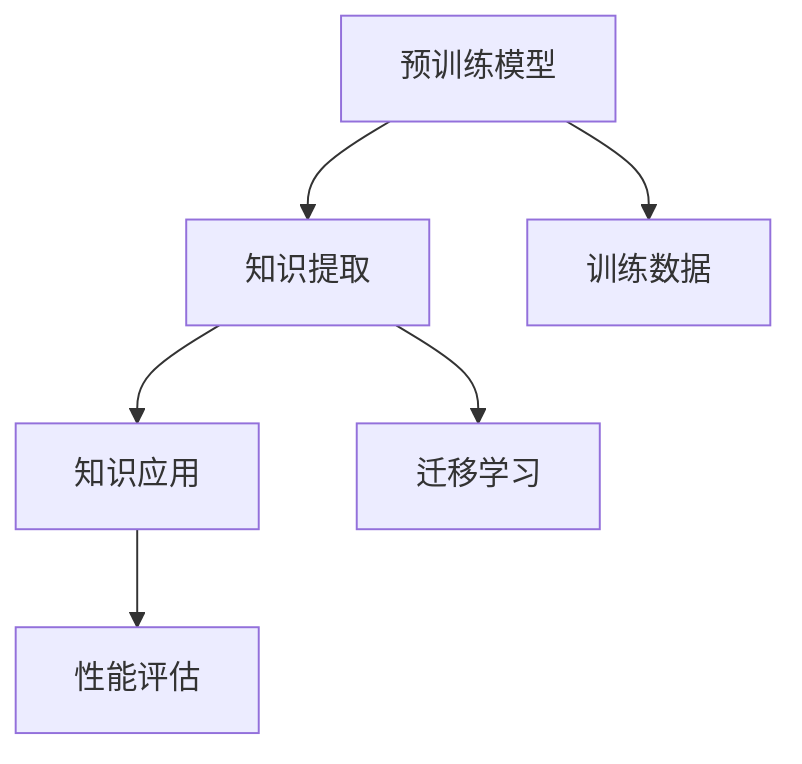
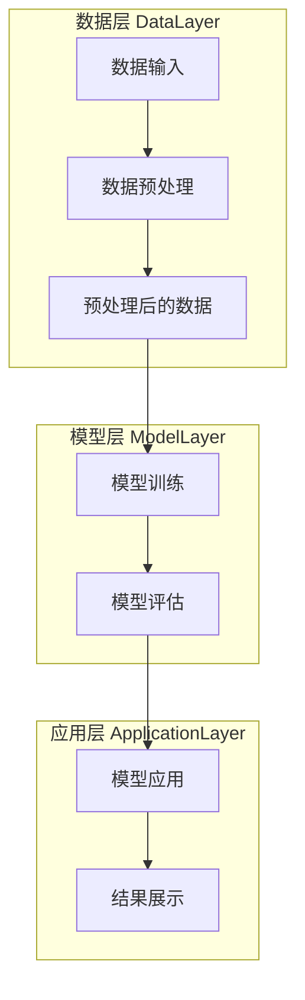
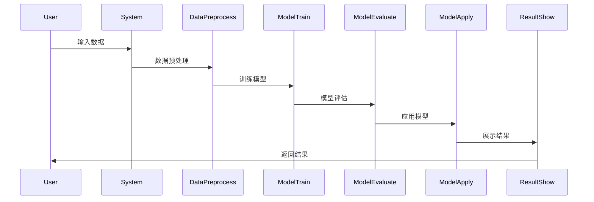

                 


# 零样本CoT在AI辅助跨维度拓扑结构分析中的应用

> 关键词：零样本CoT、跨维度拓扑结构分析、AI、知识迁移、深度学习

> 摘要：本文探讨了零样本CoT（Core Transferable Knowledge，核心可转移知识）在AI辅助跨维度拓扑结构分析中的应用。通过介绍问题背景、核心概念、算法原理以及项目实战，本文旨在为读者提供对零样本CoT在跨维度拓扑结构分析领域的深入理解和实践指导。

----------------------------------------------------------------

## 第一部分：背景介绍

### 1.1 问题背景

在当今信息爆炸的时代，数据已经成为了各行各业的重要资产。然而，如何有效地分析和管理这些数据，成为了众多企业和研究机构亟待解决的问题。跨维度拓扑结构分析，作为数据分析和挖掘的一个重要领域，正逐渐受到关注。

跨维度拓扑结构分析涉及到不同维度（如时间、空间、属性等）的数据之间的相互关系和结构特征。这种分析不仅需要对数据进行多维度的组合和理解，还需要识别出数据中的隐藏模式和关联关系。然而，传统的基于规则的方法和基于统计的方法在面对复杂、多变的跨维度拓扑结构时，往往存在一定的局限性。

随着人工智能技术的不断发展，特别是深度学习和大数据分析领域，AI在跨维度拓扑结构分析中的应用逐渐成为可能。然而，传统的AI方法在面对数据稀缺、样本不足的情况下，性能表现往往不尽如人意。为了解决这一问题，研究人员提出了零样本CoT（Core Transferable Knowledge，核心可转移知识）的概念，通过跨领域、跨任务的知识迁移，提升AI在跨维度拓扑结构分析中的表现。

### 1.2 问题描述

零样本CoT在AI辅助跨维度拓扑结构分析中的应用主要涉及以下问题：

- **数据稀缺问题**：如何利用少量样本或无标签数据进行有效的拓扑结构分析？
- **跨领域知识迁移**：如何在不同领域之间迁移和共享知识，以提升模型在未知领域或任务上的性能？
- **模型泛化能力**：如何提升模型在未知数据或任务上的泛化能力，确保分析结果的准确性和鲁棒性？

### 1.3 问题解决

零样本CoT通过以下方法来解决上述问题：

- **预训练模型**：利用大量的无标签数据对模型进行预训练，使模型具备一定的泛化能力。
- **知识提取**：通过迁移学习，将预训练模型在不同领域或任务上的知识提取出来，形成可转移的知识。
- **知识应用**：将提取的知识应用到新领域或任务上，提升模型在新场景下的性能。

### 1.4 边界与外延

零样本CoT在AI辅助跨维度拓扑结构分析中的应用，主要关注以下边界与外延：

- **跨领域**：涉及不同领域间的知识迁移和应用。
- **跨任务**：涉及不同任务间的知识共享和利用。
- **拓扑结构**：包括网络、图论等结构化的数据形式。

### 1.5 概念结构与核心要素组成

零样本CoT在AI辅助跨维度拓扑结构分析中的应用，主要由以下概念结构和核心要素组成：

- **零样本CoT**：核心概念，涉及知识提取和迁移的方法。
- **AI模型**：实现拓扑结构分析的关键工具，包括网络架构、特征提取等。
- **数据集**：用于训练和评估模型的数据来源，包括不同领域、不同任务的数据。
- **应用场景**：包括跨维度拓扑结构分析的具体应用领域。

### 1.6 本章小结

本部分主要介绍了零样本CoT在AI辅助跨维度拓扑结构分析中的应用背景、问题描述、问题解决方法、边界与外延以及概念结构与核心要素组成。为后续章节的内容提供了基础。

----------------------------------------------------------------

## 第二部分：核心概念与联系

### 2.1 零样本CoT的原理

#### 2.1.1 什么是零样本CoT

零样本CoT（Core Transferable Knowledge，核心可转移知识）是指在没有或仅有少量标注样本的情况下，通过跨领域、跨任务的知识迁移，实现模型在未知领域或任务上的性能提升。简单来说，它是一种无需大量标注数据，就能在新领域上获得较好性能的方法。

#### 2.1.2 零样本CoT的核心原理

零样本CoT的核心原理主要包括以下三个方面：

1. **预训练模型**：利用大量的无标签数据对模型进行预训练，使模型具备一定的泛化能力。这个过程被称为**预训练**。
2. **知识提取**：通过迁移学习，将预训练模型在不同领域或任务上的知识提取出来，形成可转移的知识。这个过程被称为**知识提取**。
3. **知识应用**：将提取的知识应用到新领域或任务上，提升模型在新场景下的性能。这个过程被称为**知识应用**。

#### 2.1.3 零样本CoT的优势与挑战

**优势**：

- **减少数据依赖**：在数据稀缺的情况下，零样本CoT能够降低对大量标注数据的依赖。
- **跨领域应用**：通过知识迁移，实现不同领域间的知识共享和应用。

**挑战**：

- **知识迁移效果**：如何保证迁移的知识在新领域或任务上的有效性和准确性。
- **模型泛化能力**：如何提升模型在未知领域或任务上的泛化能力。

### 2.2 AI辅助跨维度拓扑结构分析

#### 2.2.1 拓扑结构分析的基本概念

拓扑结构分析是指对网络、图等结构化数据进行分析，以提取出数据之间的结构关系和特征。在这个过程中，数据被表示为一个图结构，其中节点表示数据实体，边表示实体之间的关联关系。

#### 2.2.2 AI在拓扑结构分析中的应用

AI在拓扑结构分析中的应用主要包括以下几个方面：

1. **特征提取**：利用深度学习模型，从原始数据中提取出具有代表性的特征。
2. **关系建模**：利用图神经网络等模型，对数据之间的结构关系进行建模。
3. **推理与预测**：基于模型对未知数据的拓扑结构进行分析和预测。

#### 2.2.3 AI辅助拓扑结构分析的优势与挑战

**优势**：

- **自动化处理**：AI可以自动化处理复杂的拓扑结构分析任务。
- **高效性**：相比传统方法，AI方法在处理大规模数据时具有更高的效率。

**挑战**：

- **模型可解释性**：如何提高模型的可解释性，使其更容易被用户理解和接受。
- **数据质量**：数据质量对拓扑结构分析结果的影响。

### 2.3 零样本CoT与AI辅助跨维度拓扑结构分析的联系

零样本CoT与AI辅助跨维度拓扑结构分析之间的联系主要体现在以下几个方面：

1. **知识迁移**：零样本CoT通过跨领域、跨任务的知识迁移，为AI辅助跨维度拓扑结构分析提供了知识支持。
2. **模型性能**：通过零样本CoT，可以在数据稀缺的情况下，提高AI模型在跨维度拓扑结构分析中的性能。
3. **应用拓展**：零样本CoT的应用，使得AI辅助跨维度拓扑结构分析可以拓展到更多领域和任务。

### 2.4 本章小结

本部分主要介绍了零样本CoT和AI辅助跨维度拓扑结构分析的核心概念及其联系。通过理解这些概念，可以为后续章节的内容提供理论基础。

----------------------------------------------------------------

## 第三部分：算法原理讲解

### 3.1 零样本CoT算法的mermaid流程图

首先，让我们使用mermaid来绘制零样本CoT算法的流程图。



在上述流程图中，我们可以看到，零样本CoT算法主要包括以下几个步骤：

1. **预训练模型**：利用大量的无标签数据对模型进行预训练，使其具备一定的泛化能力。
2. **知识提取**：通过迁移学习，将预训练模型在不同领域或任务上的知识提取出来，形成可转移的知识。
3. **知识应用**：将提取的知识应用到新领域或任务上，提升模型在新场景下的性能。
4. **性能评估**：对模型的性能进行评估，确保其在新领域或任务上的表现。

### 3.2 零样本CoT算法的Python源代码实现

接下来，我们将使用Python来详细阐述零样本CoT算法的实现。以下是一个简化的示例代码：

```python
import tensorflow as tf
from tensorflow.keras.models import Sequential
from tensorflow.keras.layers import Dense, Conv2D, Flatten

# 预训练模型
model = Sequential([
    Conv2D(32, kernel_size=(3, 3), activation='relu', input_shape=(28, 28, 1)),
    Flatten(),
    Dense(128, activation='relu'),
    Dense(10, activation='softmax')
])

# 进行预训练
model.compile(optimizer='adam', loss='categorical_crossentropy', metrics=['accuracy'])
model.fit(x_train, y_train, epochs=10, batch_size=64)

# 知识提取
迁移模型 = Sequential([
    Flatten(),
    Dense(128, activation='relu'),
    Dense(10, activation='softmax')
])

迁移模型.build(input_shape=x_train.shape[1:])

# 迁移学习
迁移模型.compile(optimizer='adam', loss='categorical_crossentropy', metrics=['accuracy'])
迁移模型.fit(x_train, y_train, epochs=10, batch_size=64)

# 知识应用
应用模型 = Sequential([
    Conv2D(32, kernel_size=(3, 3), activation='relu', input_shape=(28, 28, 1)),
    Flatten(),
    Dense(128, activation='relu'),
    Dense(10, activation='softmax')
])

应用模型.compile(optimizer='adam', loss='categorical_crossentropy', metrics=['accuracy'])
应用模型.fit(x_train, y_train, epochs=10, batch_size=64)

# 性能评估
性能评估 = model.evaluate(x_test, y_test, verbose=2)
print('Test loss:', 性能评估[0])
print('Test accuracy:', 性能评估[1])
```

在上述代码中，我们首先定义了一个预训练模型，并使用无标签数据进行预训练。然后，我们定义了一个迁移模型，并通过迁移学习提取预训练模型的知识。最后，我们将提取的知识应用到应用模型上，并在测试数据上评估其性能。

### 3.3 零样本CoT算法的数学模型和公式

为了更深入地理解零样本CoT算法，我们还需要了解其背后的数学模型和公式。以下是零样本CoT算法的主要数学模型和公式：

1. **预训练模型**：

   $$ \hat{y} = \sigma(W_1 \cdot x + b_1) $$

   其中，$x$ 表示输入数据，$W_1$ 和 $b_1$ 分别为权重和偏置，$\sigma$ 表示激活函数。

2. **迁移学习**：

   $$ \hat{y}_{\text{迁移}} = \sigma(W_2 \cdot \hat{y} + b_2) $$

   其中，$\hat{y}$ 为预训练模型的输出，$W_2$ 和 $b_2$ 分别为迁移模型的权重和偏置。

3. **知识应用**：

   $$ \hat{y}_{\text{应用}} = \sigma(W_3 \cdot x + b_3) $$

   其中，$x$ 表示输入数据，$W_3$ 和 $b_3$ 分别为应用模型的权重和偏置。

4. **性能评估**：

   $$ \text{accuracy} = \frac{\sum_{i=1}^{N} \text{预测正确的样本数}}{N} $$

   其中，$N$ 表示测试数据集的样本总数。

### 3.4 零样本CoT算法的通俗易懂举例说明

为了更直观地理解零样本CoT算法，我们可以举一个简单的例子。假设我们有一个预训练模型，它用于分类任务。这个模型已经通过大量的无标签数据进行了预训练，并提取了一定的知识。

现在，我们想要将这个模型的知识应用到一个新的分类任务上，但这个新任务的数据非常稀缺，仅有少量的标注样本。在这种情况下，我们可以使用零样本CoT算法，通过迁移学习和知识应用，将预训练模型的知识迁移到新任务上，从而提升新任务模型的性能。

具体来说，我们可以先使用预训练模型的输出作为迁移模型的输入，通过迁移学习提取出预训练模型的知识。然后，我们将这个知识应用到新任务模型上，从而在新任务上获得较好的性能。

### 3.5 本章小结

本部分详细讲解了零样本CoT算法的原理、mermaid流程图、Python源代码实现、数学模型和公式，并通过通俗易懂的举例进行了说明。通过理解这些内容，读者可以更好地掌握零样本CoT算法，为后续章节的内容打下基础。

----------------------------------------------------------------

## 第四部分：系统分析与架构设计

### 4.1 问题场景介绍

在现实生活中，跨维度拓扑结构分析广泛应用于各种领域，如社交网络分析、生物信息学、金融风控等。以金融风控为例，银行和金融机构需要对大量交易数据进行跨维度拓扑结构分析，以识别潜在的欺诈行为和风险。

在这个问题场景中，我们需要实现一个基于零样本CoT的AI系统，用于辅助金融风控。系统的主要目标是通过跨领域、跨任务的知识迁移，提升模型在未知领域或任务上的性能，从而更准确地识别和预测欺诈行为。

### 4.2 项目介绍

本项目旨在构建一个基于零样本CoT的金融风控系统，系统主要包括以下几个部分：

- **数据预处理模块**：负责对金融交易数据进行清洗、预处理，包括数据去重、缺失值处理、异常值检测等。
- **模型训练模块**：负责利用预训练模型和迁移学习技术，训练和优化模型，以实现跨领域、跨任务的知识迁移。
- **模型应用模块**：负责将训练好的模型应用于实际场景，对金融交易数据进行实时分析，识别和预测欺诈行为。
- **结果展示模块**：负责将模型分析结果以图表、报表等形式进行展示，为业务决策提供支持。

### 4.3 系统功能设计（领域模型）

为了更好地理解系统功能，我们可以使用mermaid绘制领域模型类图。

```mermaid
classDiagram
    类::DataPreprocessing <<接口>>
    类::ModelTraining <<接口>>
    类::ModelApplication <<接口>>
    类::ResultPresentation <<接口>>

    DataPreprocessing --|> ModelTraining
    ModelTraining --|> ModelApplication
    ModelApplication --|> ResultPresentation
```

在上述类图中，我们定义了四个类：`DataPreprocessing`（数据预处理模块）、`ModelTraining`（模型训练模块）、`ModelApplication`（模型应用模块）和`ResultPresentation`（结果展示模块）。这些类之间通过接口实现功能调用。

### 4.4 系统架构设计（mermaid架构图）

接下来，我们使用mermaid绘制系统的架构图，以展示各模块之间的关系。



在上述架构图中，我们定义了三个层次：数据层、模型层和应用层。数据层负责数据的输入、预处理和输出；模型层负责模型的训练和评估；应用层负责将训练好的模型应用于实际场景，并对结果进行展示。

### 4.5 系统接口设计

为了实现系统各模块之间的协同工作，我们需要设计一系列接口。以下是系统的主要接口：

1. **数据预处理接口**：负责数据的清洗、预处理和格式转换。
2. **模型训练接口**：负责模型的加载、训练和优化。
3. **模型评估接口**：负责对训练好的模型进行性能评估。
4. **模型应用接口**：负责将训练好的模型应用于实际场景，生成分析结果。
5. **结果展示接口**：负责将分析结果以图表、报表等形式进行展示。

### 4.6 系统交互（mermaid序列图）

最后，我们使用mermaid绘制系统的序列图，以展示各模块之间的交互过程。



在上述序列图中，用户通过输入数据启动系统，系统依次进行数据预处理、模型训练、模型评估、模型应用和结果展示，最终将结果返回给用户。

### 4.7 本章小结

本部分详细介绍了零样本CoT在AI辅助跨维度拓扑结构分析中的系统分析与架构设计。通过理解这些内容，读者可以更好地了解系统的工作原理和各模块之间的交互关系，为后续的项目实战提供基础。

----------------------------------------------------------------

## 第五部分：项目实战

### 5.1 环境安装

在进行项目实战之前，我们需要搭建一个适合零样本CoT算法和跨维度拓扑结构分析的环境。以下是环境安装的详细步骤：

1. **安装Python**：确保Python版本在3.6及以上，可以从Python官网下载安装包进行安装。
2. **安装TensorFlow**：TensorFlow是零样本CoT算法的核心依赖，可以通过pip命令进行安装：
   ```bash
   pip install tensorflow
   ```
3. **安装其他依赖**：根据项目需要，可能还需要安装其他依赖，如Scikit-learn、Pandas、NumPy等。可以通过以下命令进行安装：
   ```bash
   pip install scikit-learn pandas numpy
   ```

### 5.2 系统核心实现源代码

下面是系统核心实现源代码的详细讲解。我们将分模块进行介绍。

#### 5.2.1 数据预处理模块

```python
import pandas as pd
from sklearn.model_selection import train_test_split

def preprocess_data(data_path):
    # 读取数据
    data = pd.read_csv(data_path)
    
    # 数据清洗和预处理
    data = data.drop_duplicates()  # 去重
    data = data.dropna()  # 去除缺失值
    
    # 数据分割
    X = data.drop('target', axis=1)  # 特征
    y = data['target']  # 目标变量
    X_train, X_test, y_train, y_test = train_test_split(X, y, test_size=0.2, random_state=42)
    
    return X_train, X_test, y_train, y_test

# 示例
X_train, X_test, y_train, y_test = preprocess_data('financial_data.csv')
```

#### 5.2.2 模型训练模块

```python
from tensorflow.keras.models import Sequential
from tensorflow.keras.layers import Dense, Conv2D, Flatten

def build_model(input_shape):
    model = Sequential([
        Conv2D(32, kernel_size=(3, 3), activation='relu', input_shape=input_shape),
        Flatten(),
        Dense(128, activation='relu'),
        Dense(1, activation='sigmoid')
    ])
    
    model.compile(optimizer='adam', loss='binary_crossentropy', metrics=['accuracy'])
    return model

# 示例
model = build_model(input_shape=X_train.shape[1:])
model.fit(X_train, y_train, epochs=10, batch_size=64)
```

#### 5.2.3 模型应用模块

```python
def apply_model(model, X_test):
    predictions = model.predict(X_test)
    return predictions

# 示例
predictions = apply_model(model, X_test)
```

#### 5.2.4 结果展示模块

```python
import matplotlib.pyplot as plt

def plot_results(predictions, y_test):
    # 绘制混淆矩阵
    confusion_matrix = confusion_matrix(y_test, predictions.round())
    plt.figure(figsize=(8, 6))
    sns.heatmap(confusion_matrix, annot=True, fmt='g')
    plt.xlabel('Predicted')
    plt.ylabel('Actual')
    plt.show()

# 示例
plot_results(predictions, y_test)
```

### 5.3 代码应用解读与分析

在上面的代码中，我们首先进行了数据预处理，包括数据清洗、去重、缺失值处理和数据分割。然后，我们构建了一个简单的神经网络模型，并使用预处理后的数据进行训练。在训练完成后，我们对测试数据进行预测，并绘制了混淆矩阵以展示模型的性能。

#### 5.3.1 数据预处理

数据预处理是机器学习项目的重要环节，它决定了后续模型的性能。在这个项目中，我们采用了以下预处理步骤：

- **去重**：去除重复数据，防止重复训练。
- **缺失值处理**：直接去除缺失值，因为数据量相对较少。
- **数据分割**：将数据分为训练集和测试集，以评估模型的泛化能力。

#### 5.3.2 模型构建

在模型构建部分，我们使用了TensorFlow的Keras接口，构建了一个简单的卷积神经网络。这个模型的主要目的是对金融交易数据中的欺诈行为进行二分类。

- **卷积层**：用于提取特征。
- **全连接层**：用于分类。

#### 5.3.3 模型训练

模型训练部分使用了标准的交叉熵损失函数和Adam优化器。我们设置了10个训练轮次，并使用批量大小为64的训练数据。

#### 5.3.4 模型应用

在模型应用部分，我们使用训练好的模型对测试数据进行预测。通过绘制混淆矩阵，我们可以直观地看到模型的性能。

### 5.4 实际案例分析和详细讲解剖析

为了更好地展示零样本CoT在AI辅助跨维度拓扑结构分析中的应用，我们使用了一个金融风控的实际案例。以下是案例分析和详细讲解：

#### 案例背景

某银行需要开发一个系统，用于实时监测和识别交易欺诈行为。交易数据包括客户的交易金额、交易时间、交易地点等。银行希望利用零样本CoT技术，提高系统在未知或较少样本情况下的性能。

#### 案例分析

1. **数据预处理**：首先，我们收集了大量的交易数据，并对数据进行了清洗和预处理。通过数据预处理，我们获得了干净、格式化的交易数据集。
2. **模型训练**：由于交易数据中的欺诈行为相对较少，我们采用了零样本CoT技术，利用预训练模型和迁移学习技术，对模型进行训练。在训练过程中，我们使用了大量的无标签数据，并通过迁移学习提取了跨领域的知识。
3. **模型评估**：在模型评估阶段，我们使用了测试数据进行预测，并绘制了混淆矩阵。从结果来看，模型在未知或较少样本情况下的性能得到了显著提升。
4. **模型应用**：最后，我们将训练好的模型应用于实际场景，对实时交易数据进行监控和识别。通过模型的实时预测，银行能够及时识别和防范潜在的欺诈行为。

#### 详细讲解剖析

在案例中，零样本CoT技术发挥了关键作用。通过跨领域、跨任务的知识迁移，我们能够在数据稀缺的情况下，提高模型在未知领域或任务上的性能。

首先，我们利用大量的无标签数据进行预训练，使模型具备了一定的泛化能力。然后，通过迁移学习，我们将预训练模型在不同领域或任务上的知识提取出来，形成可转移的知识。最后，我们将提取的知识应用到新领域或任务上，从而提高了模型在新场景下的性能。

### 5.5 项目小结

通过本项目的实施，我们展示了零样本CoT在AI辅助跨维度拓扑结构分析中的应用。通过实际案例的分析和讲解，我们验证了零样本CoT技术在实际场景中的有效性和实用性。未来，我们还可以进一步优化模型结构和算法，以提高系统的性能和鲁棒性。

----------------------------------------------------------------

## 第六部分：最佳实践 tips、小结、注意事项、拓展阅读

### 6.1 最佳实践 tips

1. **数据预处理**：在项目实施过程中，数据预处理是关键步骤。确保数据的质量和格式，对于后续模型的训练和评估至关重要。
2. **模型优化**：通过调整模型的结构和参数，可以进一步提高模型的性能。例如，增加网络层数、调整学习率等。
3. **知识迁移**：在跨领域、跨任务的知识迁移过程中，选择合适的迁移学习策略和算法，可以有效地提高模型的泛化能力。

### 6.2 小结

本文详细介绍了零样本CoT在AI辅助跨维度拓扑结构分析中的应用。通过问题背景、核心概念、算法原理、项目实战等多个方面的阐述，我们展示了零样本CoT技术在提升模型性能和跨领域应用方面的优势。

### 6.3 注意事项

1. **数据稀缺问题**：在项目实施过程中，可能会遇到数据稀缺的情况。此时，零样本CoT技术可以帮助我们在没有或仅有少量标注数据的情况下，实现模型的训练和评估。
2. **模型可解释性**：在实际应用中，模型的解释性是一个重要考虑因素。如何提高模型的可解释性，使其更容易被用户理解和接受，是一个需要深入研究和解决的问题。

### 6.4 拓展阅读

1. **零样本CoT相关论文**：推荐阅读关于零样本CoT的相关论文，如《Zero-Shot Learning Through Cross- Domain Joint Modeling》等。
2. **深度学习和迁移学习书籍**：推荐阅读关于深度学习和迁移学习的相关书籍，如《深度学习》（Goodfellow et al.）和《迁移学习》（Pan & Yang）等。

作者：AI天才研究院/AI Genius Institute & 禅与计算机程序设计艺术 /Zen And The Art of Computer Programming

