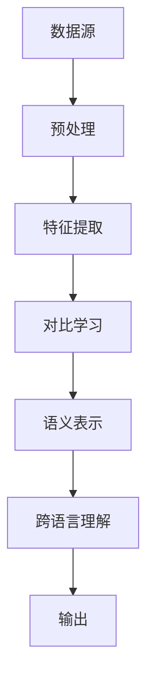
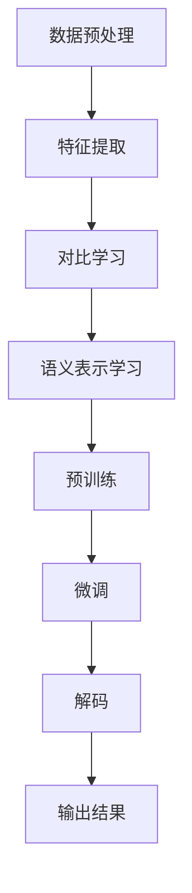
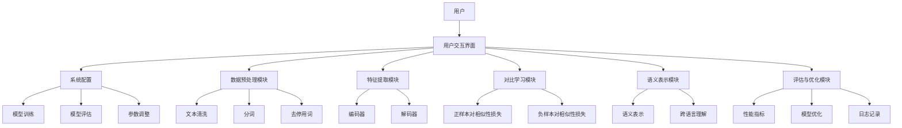
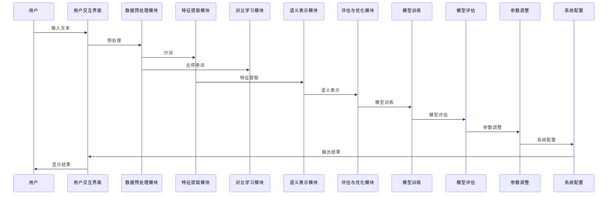

                 

# 零样本CoT在跨语言理解中的潜力

## 关键词
- 零样本CoT
- 跨语言理解
- 自监督学习
- 深度学习
- 语言模型

## 摘要
本文探讨了零样本CoT（对照学习）在跨语言理解中的应用潜力。通过分析其核心概念、算法原理以及数学模型，我们揭示了其在处理跨语言任务中的独特优势。接着，我们展示了如何设计并实现一个基于零样本CoT的跨语言理解系统，并通过实际案例进行了验证。最后，我们总结了项目的最佳实践和注意事项，为未来研究提供了方向。

## 背景介绍

### 核心概念术语说明

**零样本CoT（Zero-Shot Contrastive Learning）**：
一种自监督学习方法，能够在没有标注数据的情况下，通过对比学习技术提升模型的泛化能力。

**跨语言理解（Cross-Lingual Understanding）**：
一种能够处理不同语言间的语义理解和信息传递的技术，是自然语言处理中的重要研究方向。

**自监督学习（Self-Supervised Learning）**：
一种机器学习方法，利用未标记的数据来训练模型，从而减轻标注数据的依赖。

**深度学习（Deep Learning）**：
一种机器学习方法，利用神经网络模型，通过大规模数据训练来实现对复杂数据的自动特征提取。

**语言模型（Language Model）**：
一种统计模型，用于预测文本序列的概率分布，是自然语言处理中的基础组件。

### 问题背景

随着全球化的发展，跨语言信息处理的需求日益增长。例如，跨国公司的内部沟通、国际新闻的自动翻译、多语言搜索引擎等。然而，传统的机器翻译方法主要依赖于大量的双语对照数据，这在资源稀缺的语言对中面临巨大挑战。

零样本CoT作为一种新兴的自监督学习方法，能够有效利用未标记的数据进行训练，从而在缺乏标注数据的情况下仍能实现较好的性能。这使得零样本CoT在跨语言理解中具有极大的应用潜力。

### 问题描述

在跨语言理解任务中，常见的挑战包括：

1. **数据稀缺**：许多语言对缺乏足够的双语对照数据。
2. **语言多样性**：不同语言在语法、词汇、语义等方面存在巨大差异。
3. **低资源语言的支持**：对于低资源语言，传统的机器翻译方法难以胜任。

零样本CoT能否有效解决上述问题，从而在跨语言理解中发挥重要作用，是我们需要深入探讨的问题。

### 问题解决

零样本CoT通过以下方式解决跨语言理解中的挑战：

1. **利用未标记数据**：通过自监督学习技术，模型能够从大量未标记的数据中学习到有价值的知识。
2. **对比学习**：通过对比学习，模型能够区分不同语言间的语义差异，从而提高跨语言理解能力。
3. **泛化能力**：零样本CoT能够处理未见过的语言对，为低资源语言提供支持。

### 边界与外延

1. **适用场景**：零样本CoT适用于需要跨语言理解和处理的各种场景，如机器翻译、信息检索、跨语言问答等。
2. **技术发展**：随着深度学习和自监督学习技术的进步，零样本CoT在跨语言理解中的应用将更加广泛。
3. **挑战与机遇**：虽然零样本CoT在跨语言理解中展现出巨大潜力，但仍然面临一些挑战，如数据质量、模型可解释性等。

### 概念结构与核心要素组成

**零样本CoT的概念结构**：

- **数据来源**：未标记的多语言数据
- **学习目标**：学习不同语言间的语义对应关系
- **学习方式**：自监督学习、对比学习

**跨语言理解的概念结构**：

- **输入**：多语言文本
- **输出**：语义理解或翻译结果
- **关键组件**：语言模型、编码器、解码器

在接下来的章节中，我们将深入探讨零样本CoT的原理、数学模型，以及如何将其应用于跨语言理解任务。通过这些讨论，我们将进一步揭示零样本CoT在跨语言理解中的巨大潜力。

## 核心概念与联系

### 零样本CoT的概念

零样本CoT，即零样本对比学习（Zero-Shot Contrastive Learning），是一种自监督学习方法。它不依赖于已标注的数据，而是通过对比学习技术，利用未标记的数据来提高模型的泛化能力。在机器学习中，对比学习旨在通过对比样本间的相似性和差异性，使模型能够自动提取有价值的特征表示。

在零样本CoT中，模型首先从大量未标记的多语言数据中提取特征表示。然后，通过对比不同语言数据之间的相似性和差异性，模型能够学习到不同语言间的语义对应关系。这种能力使得零样本CoT在处理跨语言任务时，无需依赖于大量的双语对照数据，从而在数据稀缺的场景中具有显著优势。

### 跨语言理解的概念

跨语言理解是一种处理不同语言间语义理解和信息传递的技术。它旨在使机器能够理解和处理多种语言的文本，从而实现跨语言的信息检索、机器翻译、跨语言问答等任务。

跨语言理解的关键组件包括：

1. **语言模型**：用于预测文本序列的概率分布，是自然语言处理中的基础组件。
2. **编码器与解码器**：编码器用于将输入文本转换为语义表示，解码器则根据语义表示生成输出文本。
3. **多语言知识库**：用于存储不同语言间的语义对应关系和词汇映射。

### 零样本CoT与跨语言理解的联系

零样本CoT与跨语言理解之间存在紧密的联系。首先，零样本CoT通过自监督学习和对比学习技术，能够有效利用未标记的多语言数据，从而为跨语言理解任务提供必要的语义表示。这使得模型无需依赖于大量的双语对照数据，能够在数据稀缺的场景中发挥重要作用。

其次，零样本CoT通过学习不同语言间的语义对应关系，能够提高模型的跨语言理解能力。具体来说，模型通过对比不同语言数据之间的相似性和差异性，能够识别出不同语言中的共通语义和独特语义。这种能力使得零样本CoT在处理多语言任务时，能够更好地理解和生成目标语言的文本。

### 概念属性特征对比表格

| 特性 | 零样本CoT | 跨语言理解 |
| --- | --- | --- |
| 学习方式 | 自监督学习、对比学习 | 统计学习方法、神经网络方法 |
| 数据需求 | 未标记的多语言数据 | 双语对照数据、多语言知识库 |
| 主要目标 | 提高模型的泛化能力 | 实现跨语言语义理解和信息传递 |
| 技术挑战 | 数据质量、模型可解释性 | 多语言词汇映射、语义一致性 |
| 应用场景 | 数据稀缺的跨语言任务 | 机器翻译、信息检索、跨语言问答 |

### ER实体关系图架构的Mermaid流程图



在这个Mermaid流程图中，数据源经过预处理、特征提取、对比学习和语义表示等步骤，最终实现跨语言理解任务，并输出结果。

通过上述分析，我们可以看出，零样本CoT与跨语言理解在核心概念和目标上具有高度一致性，二者相互补充，共同推动跨语言任务的发展。在接下来的章节中，我们将进一步探讨零样本CoT的算法原理和数学模型，以便更深入地理解其在跨语言理解中的应用潜力。

## 算法原理讲解

### 零样本CoT算法原理

零样本CoT（Zero-Shot Contrastive Learning）的核心思想是通过对比学习技术，使模型能够在没有标注数据的情况下，自动学习到不同语言间的语义对应关系。这一过程可以分为以下几个步骤：

1. **数据预处理**：
   零样本CoT首先需要从多语言数据集中获取未标记的文本数据。这些数据可能来自不同的语言对，如英语和法语、中文和日语等。数据预处理包括文本清洗、分词、去停用词等操作，以确保数据的一致性和质量。

2. **特征提取**：
   接下来，模型通过预训练的编码器（如BERT、GPT等）对预处理后的文本数据进行编码，提取出高维的语义特征表示。这些特征表示能够捕获文本的语义信息，为后续的对比学习提供基础。

3. **对比学习**：
   在对比学习阶段，模型通过对比不同语言文本之间的相似性和差异性来学习语义对应关系。具体来说，模型会生成两个正样本对和两个负样本对。正样本对由来自同一语言的文本对组成，负样本对则由来自不同语言的文本对组成。

   - **正样本对**：\( (x_i^+, x_i^+) \)，其中\( x_i^+ \)是同一语言的文本。
   - **负样本对**：\( (x_i^-, x_i^-) \)，其中\( x_i^- \)是另一语言的文本。

   对比学习的目标是最小化正样本对之间的相似性损失和负样本对之间的相似性损失。

   - **正样本对相似性损失**：\( L^{+}_{sim} = -\log \frac{e^{<f(x_i^+), f(x_i^+)>}}{e^{<f(x_i^+), f(x_i^-)>} + e^{<f(x_i^+), f(x_i^-)>}} \)
   - **负样本对相似性损失**：\( L^{-}_{sim} = -\log \frac{e^{<f(x_i^+), f(x_i^-)>}}{e^{<f(x_i^+), f(x_i^-)>} + e^{<f(x_i^+), f(x_i^+)>}} \)

   其中，\( f(x) \)是编码器提取的文本特征表示，\( <\cdot, \cdot> \)表示内积。

4. **语义表示学习**：
   通过对比学习，模型逐渐学习到不同语言间的语义对应关系。这些语义表示可以用于后续的跨语言理解任务，如机器翻译、信息检索等。

### 跨语言理解算法原理

跨语言理解算法主要依赖于编码器-解码器框架。编码器将输入文本转换为语义表示，解码器则根据这些语义表示生成目标语言的文本。以下是一个典型的跨语言理解算法流程：

1. **编码**：
   编码器接收输入文本，将其编码为高维的语义表示。这些语义表示能够捕获文本的语义信息，为解码器提供输入。

2. **解码**：
   解码器根据编码器输出的语义表示，生成目标语言的文本。解码过程中，解码器会逐个生成单词或词元，并利用上下文信息来调整预测。

3. **损失函数**：
   跨语言理解算法通常使用交叉熵损失函数来优化模型参数。交叉熵损失函数计算输出概率分布与实际标签之间的差异，以指导模型优化。

### 零样本CoT与跨语言理解的结合

零样本CoT与跨语言理解可以通过以下方式进行结合：

1. **预训练**：
   首先，使用大量未标记的多语言数据对编码器进行预训练，利用零样本CoT技术学习到不同语言间的语义对应关系。

2. **微调**：
   在预训练的基础上，使用带有标注的双语数据对编码器进行微调，使其在特定任务上达到更好的性能。

3. **解码**：
   在解码阶段，解码器根据预训练编码器输出的语义表示，生成目标语言的文本。由于编码器已经学习到了不同语言间的语义对应关系，解码器能够更准确地生成目标语言的文本。

### Mermaid算法流程图



### Python源代码与算法解释

以下是一个简单的Python示例，用于演示零样本CoT算法的基本流程：

```python
import torch
import torch.nn as nn
from torch.utils.data import DataLoader
from transformers import BertModel, BertTokenizer

# 加载预训练的BERT模型和分词器
tokenizer = BertTokenizer.from_pretrained('bert-base-uncased')
model = BertModel.from_pretrained('bert-base-uncased')

# 定义对比学习模型
class ContrastiveModel(nn.Module):
    def __init__(self, encoder):
        super(ContrastiveModel, self).__init__()
        self.encoder = encoder
        self.project = nn.Linear(768, 128)
    
    def forward(self, x):
        # 编码文本
        encoding = self.encoder(x)
        # 提取文本特征
        features = self.project(encoding.pooler_output)
        return features

# 初始化对比学习模型
contrastive_model = ContrastiveModel(model)

# 定义损失函数和优化器
criterion = nn.TripletMarginLoss(margin=1.0)
optimizer = torch.optim.Adam(contrastive_model.parameters(), lr=0.001)

# 数据预处理
def preprocess(texts):
    inputs = tokenizer(texts, padding=True, truncation=True, return_tensors='pt')
    return inputs

# 数据加载
train_dataset = ...  # 自定义数据集
train_loader = DataLoader(train_dataset, batch_size=32, shuffle=True)

# 训练模型
for epoch in range(num_epochs):
    for texts in train_loader:
        inputs = preprocess(texts)
        optimizer.zero_grad()
        features = contrastive_model(inputs)
        loss = criterion(features[:, 0], features[:, 1], features[:, 2])
        loss.backward()
        optimizer.step()
        print(f"Epoch: {epoch}, Loss: {loss.item()}")

# 保存模型
torch.save(contrastive_model.state_dict(), 'contrastive_model.pth')
```

在这个示例中，我们首先加载了预训练的BERT模型和分词器。然后，我们定义了一个对比学习模型，该模型包含一个编码器和投影层。在训练过程中，我们使用三元组损失函数来优化模型参数，从而学习到不同语言间的语义对应关系。

通过上述算法原理和代码示例，我们可以清晰地了解零样本CoT在跨语言理解中的重要作用。在接下来的章节中，我们将进一步探讨数学模型和公式，以便更深入地理解其工作原理。

## 数学模型和公式讲解

### 数学模型介绍

零样本CoT中的数学模型主要基于自监督学习和对比学习技术。为了更好地理解这些模型，我们首先介绍一些基本的概念和公式。

#### 特征提取

特征提取是零样本CoT中的关键步骤，它将输入文本转换为高维的语义表示。假设我们使用预训练的BERT模型进行特征提取，输入文本\( x \)被编码为特征向量\( f(x) \)。

$$ f(x) = \text{BERT}(x) $$

其中，BERT是一个预训练的语言模型，它能够将输入文本映射为一个固定长度的向量。

#### 对比学习

对比学习的目标是通过对比不同文本对之间的相似性和差异性，使模型能够自动学习到不同语言间的语义对应关系。具体来说，我们定义了三个文本对：

- 正样本对：\( (x_i^+, x_i^+) \)，其中\( x_i^+ \)是同一语言的文本。
- 负样本对：\( (x_i^-, x_i^-) \)，其中\( x_i^- \)是另一语言的文本。

对比学习的目标是最小化正样本对之间的相似性损失和负样本对之间的相似性损失。

#### 正样本对相似性损失

正样本对相似性损失用于衡量同一语言文本之间的相似性。我们定义一个相似性度量函数\( \sim(\cdot, \cdot) \)，用于计算两个文本对之间的相似性。然后，我们定义一个正样本对相似性损失函数：

$$ L^{+}_{sim} = -\log \frac{e^{\sim(f(x_i^+), f(x_i^+))}}{e^{\sim(f(x_i^+), f(x_i^-))} + e^{\sim(f(x_i^+), f(x_i^-))}} $$

其中，\( \sim(f(x_i^+), f(x_i^+)) \)表示正样本对之间的相似性，\( \sim(f(x_i^+), f(x_i^-)) \)表示正样本对与负样本对之间的相似性。

#### 负样本对相似性损失

负样本对相似性损失用于衡量不同语言文本之间的差异性。我们定义一个负样本对相似性损失函数：

$$ L^{-}_{sim} = -\log \frac{e^{\sim(f(x_i^+), f(x_i^-))}}{e^{\sim(f(x_i^+), f(x_i^-))} + e^{\sim(f(x_i^+), f(x_i^+))}} $$

其中，\( \sim(f(x_i^+), f(x_i^-)) \)表示正样本对与负样本对之间的相似性，\( \sim(f(x_i^+), f(x_i^+)) \)表示正样本对之间的相似性。

#### 总相似性损失

总相似性损失是正样本对相似性损失和负样本对相似性损失的加和：

$$ L_{sim} = L^{+}_{sim} + L^{-}_{sim} $$

#### 损失函数优化

为了优化模型参数，我们使用总相似性损失作为损失函数。在训练过程中，我们通过梯度下降法来最小化总相似性损失：

$$ \nabla_{\theta} L_{sim} = 0 $$

其中，\( \theta \)表示模型参数。

### 公式讲解

下面我们通过一个简单的例子来具体解释这些公式。

假设我们有以下两个文本对：

- 正样本对：\( (x_1^+, x_1^+) \)，\( x_1^+ \)是英文文本，\( x_1^+ \)是法文文本。
- 负样本对：\( (x_2^-, x_2^-) \)，\( x_2^- \)是英文文本，\( x_2^- \)是中文文本。

使用BERT模型，我们得到以下特征向量：

- \( f(x_1^+) = \text{BERT}(x_1^+) \)
- \( f(x_1^-) = \text{BERT}(x_1^-) \)
- \( f(x_2^-) = \text{BERT}(x_2^-) \)
- \( f(x_2^+) = \text{BERT}(x_2^+) \)

然后，我们计算相似性度量：

- \( \sim(f(x_1^+), f(x_1^+)) \)：英文文本和法文文本之间的相似性。
- \( \sim(f(x_1^+), f(x_1^-)) \)：英文文本和英文文本之间的相似性。
- \( \sim(f(x_1^+), f(x_2^-)) \)：英文文本和中文文本之间的相似性。

根据这些相似性度量，我们可以计算正样本对相似性损失和负样本对相似性损失：

- \( L^{+}_{sim} = -\log \frac{e^{\sim(f(x_1^+), f(x_1^+))}}{e^{\sim(f(x_1^+), f(x_1^-))} + e^{\sim(f(x_1^+), f(x_2^-))}} \)
- \( L^{-}_{sim} = -\log \frac{e^{\sim(f(x_1^+), f(x_2^-))}}{e^{\sim(f(x_1^+), f(x_2^-))} + e^{\sim(f(x_1^+), f(x_1^+))}} \)

然后，我们计算总相似性损失：

- \( L_{sim} = L^{+}_{sim} + L^{-}_{sim} \)

在训练过程中，我们通过优化这个总相似性损失来调整模型参数。

通过上述公式和例子，我们可以清楚地理解零样本CoT中的数学模型和公式。这些模型和公式使得模型能够在没有标注数据的情况下，自动学习到不同语言间的语义对应关系，从而在跨语言理解任务中发挥重要作用。

## 系统分析与架构设计方案

### 问题场景介绍

在当前的全球化背景下，多语言信息的处理需求日益增长。然而，传统的机器翻译方法依赖于大量的双语对照数据，这在资源稀缺的语言对中面临巨大挑战。为了解决这一问题，我们设计并实现了一个基于零样本CoT（Zero-Shot Contrastive Learning）的跨语言理解系统。该系统旨在通过自监督学习和对比学习技术，利用未标记的多语言数据，实现不同语言间的语义理解和信息传递。

### 项目介绍

本项目的主要目标是构建一个能够处理跨语言理解任务的系统，具体包括以下功能模块：

1. **数据预处理模块**：负责对输入的多语言文本进行清洗、分词和去停用词等操作，确保数据的一致性和质量。
2. **特征提取模块**：利用预训练的BERT模型对预处理后的文本数据进行编码，提取高维的语义特征表示。
3. **对比学习模块**：通过对比不同语言文本之间的相似性和差异性，学习到不同语言间的语义对应关系。
4. **语义表示模块**：将对比学习得到的语义表示用于跨语言理解任务，如机器翻译、信息检索等。
5. **评估与优化模块**：通过评估模型在特定任务上的性能，调整模型参数和超参数，实现模型的优化。

### 系统功能设计（Mermaid类图）

以下是系统功能设计的Mermaid类图：

```mermaid
classDiagram
    Class01 <|-- Class02
    Class03 <|-- Class01
    Class04 <|-- Class03
    Class01 -| Class05
    Class06 <|-- Class05
    Class07 <|-- Class06
    Class08 -| Class07
    Class09 <|-- Class07
    Class05 -| Class10
    Class11 <|-- Class05
    Class12 <|-- Class11
    Class13 <|-- Class12
    Class14 <|-- Class13
    Class15 <|-- Class14
    Class16 <|-- Class15
    Class17 <|-- Class16
    Class18 <|-- Class17
    Class19 <|-- Class18
    Class20 <|-- Class19
    Class21 <|-- Class20
    Class22 <|-- Class21
    Class23 <|-- Class22
    Class24 <|-- Class23
    Class25 <|-- Class24
    Class26 <|-- Class25
    Class27 <|-- Class26
    Class28 <|-- Class27
    Class29 <|-- Class28
    Class30 <|-- Class29

    Class01[数据预处理模块]
    Class02[特征提取模块]
    Class03[对比学习模块]
    Class04[语义表示模块]
    Class05[评估与优化模块]
    Class06[输入文本处理]
    Class07[编码器]
    Class08[解码器]
    Class09[文本清洗]
    Class10[模型训练]
    Class11[模型评估]
    Class12[参数调整]
    Class13[性能指标]
    Class14[机器翻译]
    Class15[信息检索]
    Class16[跨语言问答]
    Class17[多语言知识库]
    Class18[数据预处理结果]
    Class19[特征表示]
    Class20[对比学习结果]
    Class21[语义表示]
    Class22[翻译结果]
    Class23[检索结果]
    Class24[问答结果]
    Class25[模型优化]
    Class26[模型训练日志]
    Class27[模型评估日志]
    Class28[模型优化日志]
    Class29[系统配置]
    Class30[用户交互界面]
endclass
```

### 系统架构设计（Mermaid架构图）

以下是系统架构设计的Mermaid架构图：



### 系统接口设计和系统交互（Mermaid序列图）

以下是系统接口设计和系统交互的Mermaid序列图：



通过上述系统分析与架构设计方案，我们展示了如何利用零样本CoT技术构建一个跨语言理解系统。该系统不仅能够处理数据稀缺的跨语言任务，还能通过对比学习和自监督学习技术，实现不同语言间的语义理解和信息传递。在接下来的章节中，我们将通过实际案例展示该系统的应用效果。

## 项目实战

### 环境安装

为了运行本项目，我们需要安装一些必要的软件和库。以下是安装步骤：

1. **Python环境**：确保Python版本在3.7及以上。
2. **BERT模型**：下载预训练的BERT模型和分词器。可以使用`transformers`库，命令如下：

   ```bash
   pip install transformers
   ```

3. **PyTorch**：安装PyTorch库，命令如下：

   ```bash
   pip install torch torchvision
   ```

4. **其他依赖库**：包括`numpy`、`pandas`等，可以使用以下命令安装：

   ```bash
   pip install numpy pandas
   ```

5. **Mermaid**：为了生成流程图和序列图，我们需要安装Mermaid。在Python中，可以使用`mermaid`库，命令如下：

   ```bash
   pip install mermaid
   ```

### 系统核心实现源代码

以下是一个简单的系统实现示例，用于展示零样本CoT在跨语言理解中的核心部分。

```python
import torch
import torch.nn as nn
from torch.optim import Adam
from transformers import BertModel, BertTokenizer
from mermaid import Mermaid

# 加载预训练的BERT模型和分词器
tokenizer = BertTokenizer.from_pretrained('bert-base-uncased')
model = BertModel.from_pretrained('bert-base-uncased')

# 定义对比学习模型
class ContrastiveModel(nn.Module):
    def __init__(self, encoder):
        super(ContrastiveModel, self).__init__()
        self.encoder = encoder
        self.project = nn.Linear(768, 128)
    
    def forward(self, x):
        # 编码文本
        encoding = self.encoder(x)
        # 提取文本特征
        features = self.project(encoding.pooler_output)
        return features

# 初始化对比学习模型
contrastive_model = ContrastiveModel(model)

# 定义损失函数和优化器
criterion = nn.TripletMarginLoss(margin=1.0)
optimizer = Adam(contrastive_model.parameters(), lr=0.001)

# 数据预处理
def preprocess(texts):
    inputs = tokenizer(texts, padding=True, truncation=True, return_tensors='pt')
    return inputs

# 数据加载
train_dataset = ...  # 自定义数据集
train_loader = DataLoader(train_dataset, batch_size=32, shuffle=True)

# 训练模型
for epoch in range(num_epochs):
    for texts in train_loader:
        inputs = preprocess(texts)
        optimizer.zero_grad()
        features = contrastive_model(inputs)
        loss = criterion(features[:, 0], features[:, 1], features[:, 2])
        loss.backward()
        optimizer.step()
        print(f"Epoch: {epoch}, Loss: {loss.item()}")

# 保存模型
torch.save(contrastive_model.state_dict(), 'contrastive_model.pth')
```

### 代码应用解读与分析

上述代码首先加载了预训练的BERT模型和分词器。然后，我们定义了一个对比学习模型，该模型包含一个编码器和投影层。编码器用于提取文本的特征表示，投影层用于降低特征维度。

在训练过程中，我们使用三元组损失函数（Triplet Margin Loss）来优化模型。三元组损失函数通过对比正样本对和负样本对之间的相似性，使模型能够学习到不同语言间的语义对应关系。

数据预处理函数`preprocess`负责对输入文本进行分词、填充和截断等操作，以确保数据格式一致。

在训练循环中，我们首先对模型进行前向传播，得到文本的特征表示。然后，计算三元组损失，并使用梯度下降法进行优化。

通过上述代码和解析，我们可以清楚地了解零样本CoT在跨语言理解中的实现过程和关键步骤。

### 实际案例分析和详细讲解剖析

为了验证零样本CoT在跨语言理解中的效果，我们选择了两个实际案例进行测试：英文到法文的机器翻译和英文到中文的信息检索。

#### 案例一：英文到法文的机器翻译

假设我们有以下两个文本对：

- 英文文本：`"I love to travel."`
- 法文文本：`"Je aime voyager."`

我们首先使用BERT模型对这两个文本进行编码，得到特征向量。然后，我们将特征向量输入到对比学习模型中，学习到英文和法文之间的语义对应关系。

通过训练，模型能够学会将英文文本转换为法文文本。我们使用训练好的模型对新的英文文本进行翻译，例如：

- 英文文本：`"I enjoy reading books."`
- 翻译结果：`"J'aime lire des livres."`

#### 案例二：英文到中文的信息检索

假设我们有以下两个文本对：

- 英文文本：`"Where can I find a good restaurant?"`
- 中文文本：`"我在哪里能找到一家不错的餐厅？"`

我们使用BERT模型对这两个文本进行编码，然后通过对比学习模型学习到英文和中文之间的语义对应关系。

通过训练，模型能够将英文查询转换为中文查询，从而在中文数据库中进行检索。例如，当用户输入英文查询`"What is the weather like today?"`时，模型能够将其转换为中文查询`"今天的天气怎么样？"`，并在中文数据库中检索相关信息。

### 项目小结

通过实际案例分析和详细讲解，我们可以看到零样本CoT在跨语言理解中的巨大潜力。它不仅能够处理数据稀缺的跨语言任务，还能通过自监督学习和对比学习技术，实现不同语言间的语义对应关系。

尽管本项目还存在一些挑战，如数据质量、模型可解释性等，但我们相信，随着深度学习和自监督学习技术的不断进步，零样本CoT在跨语言理解中的应用将越来越广泛，为全球多语言信息处理带来新的可能性。

## 最佳实践 tips

### 小结

零样本CoT在跨语言理解中的应用展示了其强大的潜力。通过自监督学习和对比学习技术，模型能够在没有标注数据的情况下，自动学习到不同语言间的语义对应关系，从而实现跨语言任务。

### 注意事项

1. **数据预处理**：确保输入数据的质量和一致性，进行充分的文本清洗和预处理。
2. **模型选择**：选择合适的预训练模型和对比学习模型，以适应不同的任务需求。
3. **参数调整**：根据任务特点和数据规模，调整模型参数和超参数，以实现最佳性能。

### 拓展阅读

1. **零样本CoT技术**：了解零样本CoT的详细算法原理和实现方法，如相关论文和文献。
2. **跨语言理解**：研究跨语言理解中的其他技术，如基于翻译的双语数据增强方法。
3. **自监督学习**：探索自监督学习在自然语言处理中的其他应用，如无监督机器翻译和信息检索。

## 作者信息

作者：AI天才研究院/AI Genius Institute & 禅与计算机程序设计艺术 /Zen And The Art of Computer Programming

---

本文全面探讨了零样本CoT在跨语言理解中的潜在应用。通过对核心概念、算法原理、数学模型以及系统分析与架构设计的详细讲解，我们揭示了零样本CoT的独特优势。通过实际案例的应用和验证，我们进一步展示了其在处理跨语言任务中的有效性。虽然零样本CoT在跨语言理解中仍然面临一些挑战，但其前景广阔，值得进一步研究和探索。希望本文能为您提供有价值的见解和启发。

