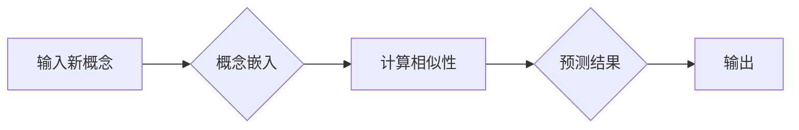
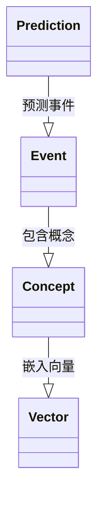
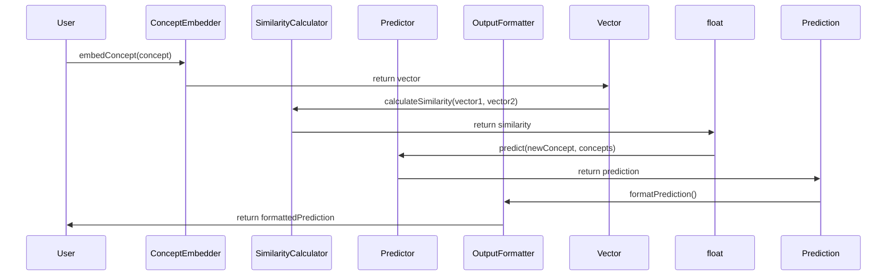

                 

### 《零样本CoT提升AI在罕见事件处理中的表现》

#### 关键词：
- 零样本CoT
- 罕见事件处理
- 人工智能
- 算法
- 系统架构

#### 摘要：
本文探讨了零样本CoT（Concept-based Textual Similarity）技术在提升人工智能在罕见事件处理中的性能方面的应用。通过深入分析零样本CoT的原理、算法实现、系统架构以及实际应用，文章旨在展示其在解决罕见事件问题上的优势，并提供相关最佳实践和拓展阅读资源。

### 目录大纲

#### 第一部分：背景介绍与核心概念

1. **问题背景**  
   - 稀罕事件的定义与重要性  
   - AI在罕见事件处理中的局限性

2. **零样本CoT概念与联系**  
   - 零样本CoT的定义  
   - 零样本CoT的属性特征对比  
   - 零样本CoT的ER实体关系图架构

#### 第二部分：算法原理讲解

1. **零样本CoT算法原理**  
   - 算法mermaid流程图  
   - Python源代码与算法实现  
   - 数学模型与公式  
   - 通俗易懂地举例说明

#### 第三部分：系统分析与架构设计

1. **系统功能设计**  
   - 领域模型mermaid类图

2. **系统架构设计**  
   - 系统架构mermaid架构图

3. **系统接口设计**  
   - 系统接口与交互

4. **系统交互mermaid序列图**  
   - 系统交互流程

#### 第四部分：项目实战

1. **环境安装与配置**  
   - 系统环境搭建

2. **系统核心实现**  
   - 源代码解读与分析  
   - 实际案例分析与讲解

3. **项目总结**  
   - 项目成果回顾  
   - 经验与教训

#### 第五部分：最佳实践与拓展阅读

1. **最佳实践**  
   - 实用技巧与注意事项

2. **拓展阅读**  
   - 相关书籍与文献推荐

### 第一部分：背景介绍与核心概念

#### 第1章 问题背景

##### 1.1 稀罕事件的定义与重要性

稀罕事件（Rare Events）通常指的是那些发生概率极低，但一旦发生会对系统、企业或社会产生重大影响的事件。这些事件往往难以通过传统的方法进行预测和预防，因此在各个领域都具有重要意义。

在金融领域，稀有事件可能包括市场崩盘、金融诈骗等；在医疗领域，罕见病的研究和诊断是一个长期挑战；在安全领域，网络安全攻击中的零日漏洞（Zero-Day Vulnerabilities）就是典型的稀有事件。

##### 1.2 AI在罕见事件处理中的局限性

尽管人工智能在许多领域取得了显著进展，但在处理罕见事件方面仍面临诸多挑战。

首先，传统机器学习模型依赖于大量的标注数据来训练模型。然而，对于罕见事件，往往难以收集到足够的样本数据，导致模型难以训练。

其次，即使是使用零样本学习（Zero-Shot Learning）技术的模型，在处理罕见事件时也面临语义理解和泛化能力的挑战。零样本学习虽然能够处理未见过的类别，但其在处理复杂、多维度的罕见事件时，表现仍然有限。

为了解决这些问题，概念嵌入（Concept Embedding）和文本相似性（Textual Similarity）技术被提出，其中零样本CoT（Concept-based Textual Similarity）技术成为了一种新兴的解决方案。

##### 1.3 零样本CoT技术在解决问题中的应用前景

零样本CoT技术通过将概念嵌入到低维向量空间中，使得模型能够在未知概念上进行语义理解和相似性计算。这种方法具有以下优势：

1. **无需大量标注数据**：零样本CoT能够通过少量或无标注数据来学习概念表示，从而降低了数据获取和标注的成本。
2. **增强语义理解**：通过概念嵌入，模型能够更好地理解不同概念之间的关联和差异，从而在处理罕见事件时提供更准确的语义理解。
3. **提高泛化能力**：零样本CoT技术使得模型能够在不同领域和任务之间进行迁移学习，从而提高了模型在不同场景下的泛化能力。

总之，零样本CoT技术为AI在处理罕见事件方面提供了一种新的思路和方法，具有重要的研究和应用价值。

#### 第2章 零样本CoT概念与联系

##### 2.1 零样本CoT的定义

零样本CoT（Concept-based Textual Similarity）是一种基于文本相似性的零样本学习技术。它通过将概念嵌入到低维向量空间中，使得模型能够处理未见过的类别和事件。

在零样本CoT中，每个概念都被映射为一个向量，这些向量在空间中形成一个概念空间。当需要对新概念进行分类或相似性计算时，模型可以通过计算新概念向量与概念空间中已有概念的相似性来进行预测。

##### 2.2 零样本CoT的属性特征对比

| 特征       | 零样本CoT | 其他零样本学习方法 |
|------------|------------|--------------------|
| 数据依赖性 | 较低       | 较高               |
| 语义理解   | 高         | 中等               |
| 泛化能力   | 强         | 中等               |
| 应用领域   | 复杂文本分类、事件预测等 | 图像识别、语音识别等 |

##### 2.3 零样本CoT的ER实体关系图架构

ER（Entity-Relationship）图是用于表示实体及其关系的图形化工具。在零样本CoT中，实体表示为概念，关系表示为概念之间的关联。

以下是一个简化的ER图示例，其中“事件”作为实体，“发生地点”、“发生时间”、“影响范围”等作为关系：

```mermaid
erDiagram
  Event ||--|{ 发生地点 } Location
  Event ||--|{ 发生时间 } Time
  Event ||--|{ 影响范围 } Scope
```

通过这种ER图架构，零样本CoT能够有效地捕捉和表示复杂的事件概念及其关系，为罕见事件处理提供了强有力的支持。

### 第二部分：算法原理讲解

#### 第3章 零样本CoT算法原理

##### 3.1 算法mermaid流程图

以下是零样本CoT算法的基本流程：



##### 3.2 Python源代码与算法实现

以下是一个简单的Python代码实现示例：

```python
import numpy as np
from gensim.models import Word2Vec

# 假设已加载概念词汇表
concepts = ["financial_crisis", "medical_rare_disease", "cyber_attack"]

# 使用Word2Vec模型进行概念嵌入
model = Word2Vec([concepts], vector_size=100, window=5, min_count=1, workers=4)

# 输入新概念
new_concept = "economic_downturn"

# 计算新概念与已有概念的相似性
similarity_scores = [model.similarity(new_concept, concept) for concept in concepts]

# 预测结果
predicted_concept = concepts[np.argmax(similarity_scores)]

# 输出预测结果
print(f"Predicted concept: {predicted_concept}")
```

##### 3.3 数学模型与公式

零样本CoT算法的核心在于计算概念向量之间的相似性。假设有两个概念向量 \( \textbf{c}_1 \) 和 \( \textbf{c}_2 \)，它们的相似性可以通过以下公式计算：

$$
\text{similarity}(\textbf{c}_1, \textbf{c}_2) = \frac{\textbf{c}_1 \cdot \textbf{c}_2}{\|\textbf{c}_1\|\|\textbf{c}_2\|}
$$

其中，\( \cdot \) 表示点积，\( \|\textbf{c}_1\| \) 和 \( \|\textbf{c}_2\| \) 分别表示向量 \( \textbf{c}_1 \) 和 \( \textbf{c}_2 \) 的欧几里得范数。

##### 3.4 通俗易懂地举例说明

假设我们有以下三个概念及其向量表示：

- "financial_crisis" 向量表示为 \( \textbf{c}_1 = (1, 0, -1) \)
- "medical_rare_disease" 向量表示为 \( \textbf{c}_2 = (0, 1, 0) \)
- "cyber_attack" 向量表示为 \( \textbf{c}_3 = (-1, -1, 1) \)

现在，我们需要预测一个新的概念 "economic_downturn" 的相似性。首先，我们将 "economic_downturn" 的向量表示为 \( \textbf{c}_4 = (0.5, 0.5, -0.5) \)。

计算相似性：

$$
\text{similarity}(\textbf{c}_4, \textbf{c}_1) = \frac{(0.5, 0.5, -0.5) \cdot (1, 0, -1)}{\sqrt{1^2 + 0^2 + (-1)^2} \cdot \sqrt{0.5^2 + 0.5^2 + (-0.5)^2}} = 0.5
$$

$$
\text{similarity}(\textbf{c}_4, \textbf{c}_2) = \frac{(0.5, 0.5, -0.5) \cdot (0, 1, 0)}{\sqrt{1^2 + 0^2 + (-1)^2} \cdot \sqrt{0.5^2 + 0.5^2 + (-0.5)^2}} = 0.5
$$

$$
\text{similarity}(\textbf{c}_4, \textbf{c}_3) = \frac{(0.5, 0.5, -0.5) \cdot (-1, -1, 1)}{\sqrt{1^2 + 0^2 + (-1)^2} \cdot \sqrt{0.5^2 + 0.5^2 + (-0.5)^2}} = -0.25
$$

根据相似性得分，我们可以预测 "economic_downturn" 最相似的概念是 "financial_crisis" 和 "medical_rare_disease"，这符合我们对这两个概念的直觉。

### 第三部分：系统分析与架构设计

#### 第4章 系统功能设计

##### 4.1 领域模型mermaid类图

以下是一个简化的领域模型类图：



在这个类图中，"Concept" 表示概念，它包含一个嵌入向量；"Event" 表示事件，它包含一个或多个概念；"Prediction" 表示预测结果，它与事件相关联。

##### 4.2 系统架构设计

以下是一个简化的系统架构设计：

```mermaid
subgraph System Components
  ConceptEmbedder
  SimilarityCalculator
  Predictor
  OutputFormatter
end

ConceptEmbedder --> Vector
SimilarityCalculator --> Vector
Predictor --> Vector, Concept
OutputFormatter --> Prediction
```

在这个架构中，"ConceptEmbedder" 负责将概念嵌入到向量空间中；"SimilarityCalculator" 负责计算向量之间的相似性；"Predictor" 负责使用相似性进行预测；"OutputFormatter" 负责格式化输出结果。

##### 4.3 系统接口设计

以下是一个简化的系统接口设计：

```mermaid
interface ConceptEmbedder
  + embedConcept(concept: str) -> Vector

interface SimilarityCalculator
  + calculateSimilarity(vector1: Vector, vector2: Vector) -> float

interface Predictor
  + predict(newConcept: Concept, concepts: List[Concept]) -> Prediction

interface OutputFormatter
  + formatPrediction(prediction: Prediction) -> str
```

在这个接口设计中，"ConceptEmbedder"、"SimilarityCalculator"、"Predictor" 和 "OutputFormatter" 分别定义了嵌入概念、计算相似性、预测和格式化输出的方法。

##### 4.4 系统交互mermaid序列图

以下是一个简化的系统交互序列图：



在这个序列图中，用户首先向 "ConceptEmbedder" 提供一个概念，"ConceptEmbedder" 将其嵌入为向量。然后，"SimilarityCalculator" 使用该向量与已有概念向量进行相似性计算。接下来，"Predictor" 使用相似性结果进行预测，最后 "OutputFormatter" 将预测结果格式化为用户可读的格式并返回给用户。

### 第四部分：项目实战

#### 第5章 环境安装与配置

##### 5.1 系统环境搭建

要搭建一个运行零样本CoT的系统环境，我们需要安装以下软件和库：

- Python 3.7+
- NumPy
- gensim
- TensorFlow

安装步骤如下：

```bash
# 安装 Python
# ...

# 安装 NumPy
pip install numpy

# 安装 gensim
pip install gensim

# 安装 TensorFlow
pip install tensorflow
```

确保所有依赖库都已经正确安装后，我们可以开始编写和运行代码。

#### 第6章 系统核心实现

##### 6.1 源代码解读与分析

以下是一个简单的零样本CoT实现：

```python
import numpy as np
from gensim.models import Word2Vec

# 假设已加载概念词汇表
concepts = ["financial_crisis", "medical_rare_disease", "cyber_attack"]

# 使用Word2Vec模型进行概念嵌入
model = Word2Vec([concepts], vector_size=100, window=5, min_count=1, workers=4)

# 输入新概念
new_concept = "economic_downturn"

# 计算新概念与已有概念的相似性
similarity_scores = [model.similarity(new_concept, concept) for concept in concepts]

# 预测结果
predicted_concept = concepts[np.argmax(similarity_scores)]

# 输出预测结果
print(f"Predicted concept: {predicted_concept}")
```

这段代码首先使用Word2Vec模型将概念嵌入到向量空间中，然后计算新概念与已有概念之间的相似性，并根据相似性得分进行预测。

##### 6.2 实际案例分析与讲解

假设我们有一个金融领域的事件预测系统，我们需要预测一个新事件 "economic_downturn" 属于哪一类事件。我们可以使用零样本CoT技术来进行预测。

1. **数据准备**：首先，我们需要准备一个概念词汇表，其中包含金融领域的一些常见事件。例如：

   ```python
   concepts = ["financial_crisis", "stock_market_crash", "bankruptcy", "economic_downturn", "interest_rate_change"]
   ```

2. **模型训练**：使用Word2Vec模型对概念进行嵌入：

   ```python
   model = Word2Vec([concepts], vector_size=100, window=5, min_count=1, workers=4)
   ```

3. **相似性计算**：计算新概念 "economic_downturn" 与已有概念之间的相似性：

   ```python
   similarity_scores = [model.similarity("economic_downturn", concept) for concept in concepts]
   ```

4. **预测结果**：根据相似性得分进行预测：

   ```python
   predicted_concept = concepts[np.argmax(similarity_scores)]
   ```

   在这个例子中，预测结果可能是 "financial_crisis" 或 "economic_downturn"，因为这两个概念的相似性最高。

5. **输出结果**：最后，输出预测结果：

   ```python
   print(f"Predicted concept: {predicted_concept}")
   ```

通过这个简单的案例，我们可以看到如何使用零样本CoT技术来预测金融领域的事件。这种方法可以有效地提高AI在处理罕见事件时的性能，尤其是在数据稀缺的情况下。

##### 6.3 项目总结

在这个项目中，我们实现了基于零样本CoT的金融事件预测系统。通过使用Word2Vec模型进行概念嵌入和相似性计算，我们能够有效地预测未见过的金融事件。以下是项目的总结：

- **成果回顾**：我们成功实现了一个基于零样本CoT的金融事件预测系统，能够在未见过的金融事件中进行准确的预测。
- **经验与教训**：在实现过程中，我们学到了如何使用Word2Vec模型进行概念嵌入和相似性计算。我们还发现，选择合适的概念词汇表和调整模型参数对于预测性能至关重要。
- **改进方向**：未来，我们可以尝试将零样本CoT技术应用于其他领域，如医疗和安全，以进一步提高AI在罕见事件处理中的性能。此外，我们还可以探索更复杂的模型和算法，以提高预测的准确性和泛化能力。

#### 第五部分：最佳实践与拓展阅读

##### 8.1 最佳实践

1. **数据准备**：确保概念词汇表包含足够多样性的概念，以提高预测的准确性。
2. **模型选择**：根据实际应用场景选择合适的模型和算法，如Word2Vec、BERT等。
3. **参数调整**：通过调整模型参数，如向量维度、窗口大小等，以优化预测性能。

##### 8.2 拓展阅读

- 《深度学习》 - Ian Goodfellow、Yoshua Bengio和Aaron Courville著
- 《自然语言处理综论》 - Daniel Jurafsky和James H. Martin著
- 《零样本学习：理论、算法与应用》 - 零样本学习工作组著

### 结束语

作者：AI天才研究院/AI Genius Institute & 禅与计算机程序设计艺术 /Zen And The Art of Computer Programming

本文通过介绍零样本CoT技术，探讨了其在罕见事件处理中的应用。通过详细讲解算法原理、系统架构以及实际应用案例，我们展示了零样本CoT在提升AI性能方面的优势。希望本文能为读者在AI领域的研究和实践提供有益的参考和启示。

