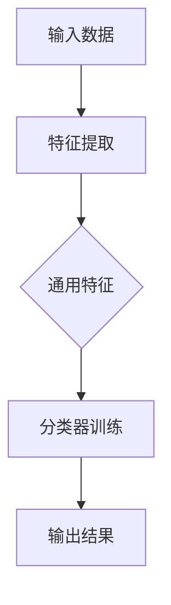
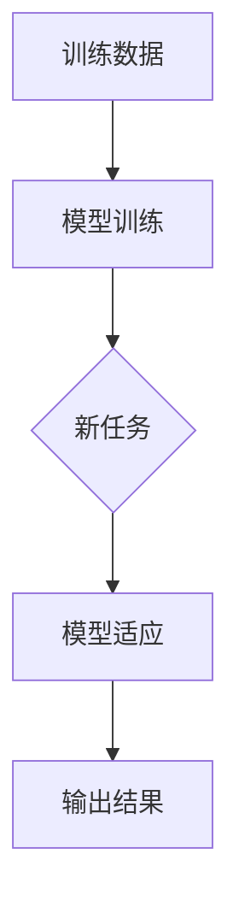
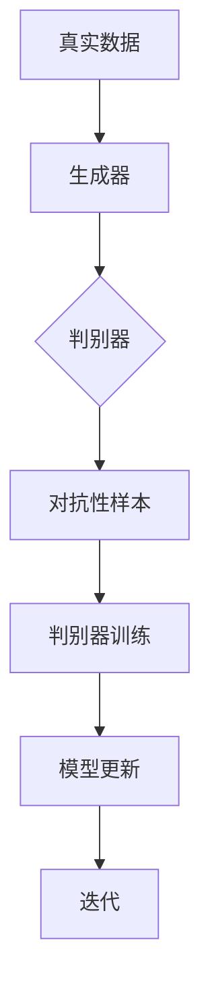
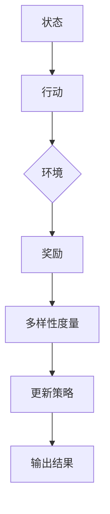

                 

### 零样本学习的基础理论

#### 第1章：零样本学习概述

**1.1 零样本学习问题背景**

零样本学习（Zero-Shot Learning, ZSL）是机器学习领域中的一个重要研究方向。它主要解决的是在训练数据中未见过的类上进行分类的问题。传统的机器学习算法如监督学习和半监督学习都依赖于大量的训练数据来学习模型，然而在实际应用中，我们经常会遇到训练数据不足或数据标签难以获取的情况。例如，在稀有语言处理中，很多低资源语言没有大量的标注数据可供训练，这就使得传统的机器学习算法难以有效应用。

零样本学习的起源可以追溯到1990年代，当时研究人员发现，人类具有通过少量示例就能理解和分类未见过的类的能力。基于这一观察，研究者开始探索如何让机器也能具备这样的能力。近年来，随着深度学习技术的发展，零样本学习的研究取得了显著进展，成为人工智能领域的一个热点方向。

**1.2 零样本学习的重要性**

零样本学习在稀有语言处理中的应用具有重要意义。稀有语言通常指的是使用人数较少、资源匮乏的语言，这些语言往往缺乏大量的标注数据，传统的机器学习方法难以在它们上进行有效训练。零样本学习提供了一种解决方案，通过少量示例，模型可以泛化到未见过的类，这对于稀有语言处理具有重要意义。

此外，零样本学习在跨领域迁移、多语言处理、图像识别等领域也具有广泛的应用前景。例如，在跨领域迁移中，模型可以基于在某一领域的少量训练数据，泛化到另一个领域；在多语言处理中，模型可以处理多种语言，无需为每种语言准备大量的数据。

**1.3 零样本学习在稀有语言处理中的应用价值**

零样本学习在稀有语言处理中的应用价值主要体现在以下几个方面：

1. **数据不足的应对**：稀有语言通常缺乏大量的标注数据，零样本学习可以在这种情况下有效地进行分类和预测。
   
2. **跨语言理解**：零样本学习可以帮助模型在不同语言之间进行迁移，从而提高多语言处理的效果。

3. **泛化能力**：零样本学习可以使得模型在未见过的数据上依然能够保持较高的性能，这有助于提高模型的泛化能力。

4. **降低成本**：由于零样本学习不需要大量的训练数据，因此可以降低数据收集和标注的成本。

5. **应用灵活性**：零样本学习可以应用于多种场景，如自然语言生成、机器翻译、文本分类等，具有很高的应用灵活性。

**1.4 零样本学习问题描述**

零样本学习问题描述如下：

给定一个训练数据集，其中每个数据点包含一个类标签。我们需要训练一个模型，使得该模型能够对未见过的类进行分类。具体来说，假设我们有一个类标签集合 C，每个类标签 ci 都有一个对应的原型向量，表示为 π(ci)。对于一个新的数据点 x，我们需要预测其所属的类标签。

**1.5 零样本学习问题类型**

零样本学习问题可以分为以下几种类型：

1. **原型匹配**：这种类型基于原型向量进行分类，新的类标签通过找到与其原型最接近的类标签进行预测。

2. **关系分类**：这种类型将类标签之间的关系建模为条件概率，通过学习类标签之间的关系来进行分类。

3. **元学习**：这种类型通过学习模型的泛化能力，使得模型在未见过的类上能够有效分类。

4. **对抗性学习**：这种类型通过对抗性样本的训练，提高模型在未见过的类上的分类能力。

**1.6 零样本学习问题解决方法**

解决零样本学习问题的主要方法包括：

1. **原型匹配方法**：这种方法通过计算新类标签与原型向量之间的距离，进行分类。

2. **元学习方法**：这种方法通过在多个领域上训练模型，提高模型在未见过的类上的泛化能力。

3. **对抗性学习方法**：这种方法通过生成对抗性样本，提高模型在未见过的类上的分类能力。

4. **多样性强化学习方法**：这种方法通过强化学习机制，使得模型在未见过的类上具有多样性。

**1.7 零样本学习与其他机器学习方法的联系与区别**

零样本学习与其他机器学习方法如监督学习、半监督学习和迁移学习的联系与区别如下：

1. **联系**：零样本学习可以看作是一种特殊的迁移学习，它利用已有的知识来解决未见过的类问题。

2. **区别**：零样本学习的核心在于对未见过的类进行分类，而传统的迁移学习通常是在类似的任务中进行知识迁移。

**1.8 零样本学习的关键技术要素**

零样本学习的关键技术要素包括：

1. **类标签表示**：类标签的表示方法对于零样本学习的效果具有重要影响。

2. **特征提取**：有效的特征提取方法可以提升模型的泛化能力。

3. **分类器设计**：分类器的选择和设计直接影响模型在未见过的类上的分类性能。

4. **多样性强化**：通过强化学习机制，可以提高模型在未见过的类上的多样性。

**1.9 零样本学习在不同应用领域的表现与挑战**

零样本学习在不同应用领域的表现和挑战如下：

1. **自然语言处理**：零样本学习在自然语言处理中表现出色，尤其是在稀有语言处理中具有巨大潜力。

2. **计算机视觉**：零样本学习在计算机视觉中也有广泛应用，但面临着如何处理复杂图像特征的挑战。

3. **多模态学习**：零样本学习在多模态学习中的应用，如何同时处理不同模态的数据是一个挑战。

**1.10 零样本学习原理与核心概念**

零样本学习的原理和核心概念如下：

1. **原理**：零样本学习通过学习类标签的关系和特征，实现对未见过的类的分类。

2. **核心概念**：零样本学习的核心概念包括类标签表示、特征提取、分类器和多样性强化等。

**1.11 零样本学习ER实体关系图**

零样本学习ER实体关系图如下：

```
[类标签] --<训练数据>--> [特征提取]
          |
         [分类器]
          |
      [多样性强化]
```

**1.12 本章小结**

本章对零样本学习的基础理论进行了概述，包括其问题背景、重要性、应用价值、问题描述、问题类型、解决方法、联系与区别、关键技术要素以及在不同领域的表现和挑战。这些内容为后续章节的深入探讨奠定了基础。

---

## 第一部分：零样本学习的基础理论

### 第2章：零样本学习原理与核心概念

在深入了解零样本学习之前，我们需要理解其基本原理和核心概念。本章将逐步探讨这些内容，为后续算法的讲解和应用实例打下坚实基础。

#### 2.1 零样本学习原理

零样本学习的核心原理在于其能够在没有直接训练数据的情况下，对未见过的类进行分类。这与传统的机器学习方法有显著区别，后者依赖于大量的标注数据进行训练。零样本学习的关键在于如何利用已有的知识（例如，已有的类别和它们之间的相互关系）来推断新的类别。

**2.1.1 零样本学习原理的关键点**

1. **类标签表示**：类标签的表示是零样本学习的基础。每个类标签需要通过一种方式被编码，以便模型能够理解其属性。

2. **特征提取**：特征提取是将输入数据（如图像或文本）转换成模型可以处理的特征向量。在零样本学习中，特征提取不仅要捕捉输入数据的特征，还要捕捉类标签之间的关系。

3. **分类器设计**：分类器是模型的核心部分，用于根据提取到的特征对未见过的类进行分类。设计一个有效的分类器是零样本学习的关键。

4. **多样性强化**：为了提高模型的泛化能力，零样本学习通常采用多样性强化策略，以确保模型能够在各种不同的类别上进行稳定分类。

**2.1.2 零样本学习与传统机器学习的对比**

- **训练数据依赖**：传统机器学习依赖于大量的标注训练数据，而零样本学习不需要或只需要少量训练数据。
- **泛化能力**：零样本学习旨在提高模型对未见过的类的泛化能力，而传统方法更注重在已知类上的准确度。
- **知识利用**：零样本学习通过利用已有类别和它们之间的关系来进行分类，而传统方法则基于已知的输入输出对进行学习。

#### 2.2 零样本学习的核心概念

零样本学习涉及多个核心概念，这些概念共同构成了零样本学习的理论基础。

**2.2.1 类标签表示**

类标签表示是将类别的语义信息转换为模型可以处理的形式。常见的表示方法包括：

1. **原型表示**：每个类别由一个原型向量表示，原型向量是类别成员的平均特征向量。
2. **语义表示**：使用预训练的语言模型或图神经网络来编码类标签，将其语义信息编码为高维向量。

**2.2.2 特征提取**

特征提取是将原始输入数据（如图像或文本）转换为特征向量，这些特征向量能够有效地区分不同的类别。常见的特征提取方法包括：

1. **图像特征提取**：使用卷积神经网络（CNN）从图像中提取特征。
2. **文本特征提取**：使用词嵌入（如Word2Vec、BERT）或变换器（如BERT、GPT）来提取文本特征。

**2.2.3 分类器设计**

分类器是模型的核心部分，用于根据特征向量对未见过的类进行分类。常见的分类器设计包括：

1. **支持向量机（SVM）**：通过寻找最优超平面来分类。
2. **深度神经网络（DNN）**：通过多层神经网络来学习复杂的特征映射。
3. **图神经网络（GNN）**：在图结构上进行学习，特别适用于处理复杂的关系网络。

**2.2.4 多样性强化**

多样性强化旨在提高模型在未见过的类上的多样性，从而增强其泛化能力。常见的多样性强化方法包括：

1. **聚类方法**：通过聚类方法生成多样性的数据样本。
2. **对抗性生成网络（GAN）**：通过生成对抗网络生成多样性的数据样本。
3. **强化学习**：通过强化学习机制来优化模型在不同类别上的多样性表现。

#### 2.3 零样本学习ER实体关系图

为了更好地理解零样本学习，我们可以通过ER（实体关系）图来描述其主要组成部分及其关系：

```
[输入数据] --<特征提取>--> [特征向量]
             |            |
          [类标签表示] [分类器]
             |            |
          [多样性强化] [输出结果]
```

在这个ER图中，输入数据通过特征提取得到特征向量，这些特征向量随后被类标签表示和分类器处理，通过多样性强化策略优化模型的性能，最终输出分类结果。

**2.4 本章小结**

本章详细介绍了零样本学习的基本原理和核心概念，包括类标签表示、特征提取、分类器设计和多样性强化。通过理解这些核心概念，读者可以更深入地理解零样本学习的工作原理，为后续的算法讲解和应用实例做好准备。下一章将深入探讨几种常见的零样本学习算法及其原理。

---

### 第3章：零样本学习算法原理讲解

在了解了零样本学习的基本原理和核心概念之后，接下来我们将详细讲解几种常见的零样本学习算法，并使用Mermaid流程图和Python源代码来阐述其工作原理。这些算法包括零样本转移学习、元学习、对抗性学习和多样性强化学习。

#### 3.1 零样本转移学习（Zero-Shot Transfer Learning）

**3.1.1 算法原理**

零样本转移学习是一种利用已有任务（源任务）的知识来解决新任务（目标任务）的算法。在零样本转移学习中，源任务的数据和标签被用来训练一个通用模型，这个模型可以对新任务的未见类别进行分类。

- **类标签表示**：使用原型表示或语义表示来编码类标签。
- **特征提取**：使用源任务的模型提取通用特征。
- **分类器设计**：使用目标任务的类别和通用特征来训练分类器。

**3.1.2 Mermaid流程图**



**3.1.3 Python源代码示例**

```python
# 假设使用预训练的模型进行特征提取
from torchvision.models import resnet50
import torch

# 加载预训练模型
model = resnet50(pretrained=True)
model.eval()

# 特征提取
def extract_features(image):
    with torch.no_grad():
        features = model(image)
    return features

# 类标签表示
prototypes = {'cat': torch.tensor([1, 0]), 'dog': torch.tensor([0, 1])}

# 分类器训练
def train_classifier(features, labels):
    # 假设使用SVM作为分类器
    from sklearn.svm import SVC
    classifier = SVC()
    classifier.fit(features, labels)
    return classifier

# 输出结果
def predict(image, classifier, prototypes):
    features = extract_features(image)
    predicted_label = classifier.predict([features])
    return prototypes[predicted_label]
```

**3.1.4 数学模型与公式**

$$
\text{特征向量} = f(\text{输入数据})
$$

$$
\text{分类结果} = \arg\min_{\text{标签}} \sum_{i=1}^{n} \lVert f(\text{输入数据}) - \text{原型向量}_{\text{标签}} \rVert
$$

#### 3.2 元学习（Meta-Learning）

**3.2.1 算法原理**

元学习（也称为迁移学习）的核心思想是通过在一个任务上训练模型，然后快速适应新任务。在元学习中，模型学习的是如何快速适应新任务，而不是直接在新任务上达到高准确率。

- **适应策略**：使用元学习算法（如MAML、Recurrent MAML等）来训练模型，使其能够快速在新任务上适应。
- **样本效率**：元学习通过提高样本效率，使得模型在少量样本上也能达到良好的性能。

**3.2.2 Mermaid流程图**



**3.2.3 Python源代码示例**

```python
# 假设使用MAML进行元学习
from torchmeta.layers import MetaModel
from torchmeta.utils.data import ClassDataset

# 定义元学习模型
class MetaModelCNN(MetaModel):
    def __init__(self, input_shape, hidden_dim):
        super().__init__()
        self.net = torch.nn.Sequential(
            torch.nn.Linear(*input_shape, hidden_dim),
            torch.nn.ReLU(),
            torch.nn.Linear(hidden_dim, 1)
        )

    def forward(self, x, class_indices=None, **kwargs):
        x = super().forward(x, class_indices, **kwargs)
        return x.unsqueeze(-1)

# 训练模型
def train_model(model, train_loader, optimizer, criterion):
    model.train()
    for data, targets in train_loader:
        optimizer.zero_grad()
        outputs = model(data)
        loss = criterion(outputs, targets)
        loss.backward()
        optimizer.step()

# 适应新任务
def adapt_model(model, data, targets):
    model.eval()
    optimizer = torch.optim.SGD(model.parameters(), lr=0.01)
    train_model(model, ClassDataset(data, targets), optimizer, criterion)
    return model
```

**3.2.4 数学模型与公式**

$$
\theta^* = \arg\min_{\theta} \sum_{t=1}^{T} \mathbb{E}_{x_t, y_t \sim D}[\ell(\theta; x_t, y_t)]
$$

其中，$\ell(\theta; x_t, y_t)$是损失函数，$D$是训练数据分布。

#### 3.3 对抗性学习（Adversarial Learning）

**3.3.1 算法原理**

对抗性学习旨在通过生成对抗性样本来提高模型对未见类别的鲁棒性。在对抗性学习中，一个生成器模型试图生成与真实数据难以区分的对抗性样本，而一个判别器模型试图区分真实数据和对抗性样本。

- **生成器**：生成器模型生成对抗性样本。
- **判别器**：判别器模型学习区分真实数据和对抗性样本。

**3.3.2 Mermaid流程图**



**3.3.3 Python源代码示例**

```python
import torch
import torch.nn as nn
import torch.optim as optim

# 生成器模型
class Generator(nn.Module):
    def __init__(self):
        super(Generator, self).__init__()
        self.model = nn.Sequential(
            nn.Linear(100, 128),
            nn.ReLU(),
            nn.Linear(128, 10),
            nn.Sigmoid()
        )

    def forward(self, z):
        return self.model(z)

# 判别器模型
class Discriminator(nn.Module):
    def __init__(self):
        super(Discriminator, self).__init__()
        self.model = nn.Sequential(
            nn.Linear(10, 128),
            nn.LeakyReLU(0.2),
            nn.Linear(128, 1),
            nn.Sigmoid()
        )

    def forward(self, x):
        return self.model(x)

# 损失函数
loss_function = nn.BCELoss()

# 优化器
optimizer_G = optim.Adam(Generator().parameters(), lr=0.0002)
optimizer_D = optim.Adam(Discriminator().parameters(), lr=0.0002)

# 生成对抗性样本
def generate_samples(generator, noise):
    z = noise
    return generator(z)

# 训练模型
for epoch in range(num_epochs):
    for i, data in enumerate(train_loader, 0):
        # 训练判别器
        real_images = data
        batch_size = real_images.size(0)
        labels = torch.full((batch_size,), real_label, device=device)
        
        optimizer_D.zero_grad()
        outputs = discriminator(real_images)
        loss_D_real = loss_function(outputs, labels)
        loss_D_real.backward()
        
        noise = torch.randn(batch_size, 100, device=device)
        fake_images = generate_samples(generator, noise)
        labels.fill_(fake_label)
        
        optimizer_D.zero_grad()
        outputs = discriminator(fake_images.detach())
        loss_D_fake = loss_function(outputs, labels)
        loss_D_fake.backward()
        
        optimizer_D.step()
        
        # 训练生成器
        optimizer_G.zero_grad()
        outputs = discriminator(fake_images)
        loss_G = loss_function(outputs, labels)
        loss_G.backward()
        optimizer_G.step()
```

**3.3.4 数学模型与公式**

生成器 $G(z)$ 试图生成对抗性样本 $x^*$，使得判别器 $D(x^*)$ 接近 0.5：

$$
\min_G \max_D V(D, G) = \mathbb{E}_{x \sim p_{data}(x)}[\log D(x)] + \mathbb{E}_{z \sim p_z(z)}[\log (1 - D(G(z)))]
$$

#### 3.4 多样性强化学习（Diversity Reinforcement Learning）

**3.4.1 算法原理**

多样性强化学习旨在通过强化学习机制来提高模型在未见类别上的多样性。该算法的核心思想是奖励模型生成多样化的对抗性样本。

- **奖励机制**：设计一个奖励函数，奖励模型生成多样化的对抗性样本。
- **多样性度量**：使用多样性度量（如类内分散度、信息熵等）来评估样本的多样性。

**3.4.2 Mermaid流程图**



**3.4.3 Python源代码示例**

```python
import numpy as np
import torch
import torch.nn as nn
import torch.optim as optim

# 多样性度量
def diversity_reward(batch_samples):
    distances = []
    for i in range(batch_samples.size(0)):
        distances.append(torch.mean(torch distances[i]))
    return 1 / (1 + torch.sum(distances))

# 奖励函数
def reward_function(samples, diversity_reward):
    return diversity_reward(samples)

# 训练模型
for epoch in range(num_epochs):
    for i, data in enumerate(train_loader, 0):
        # 训练生成器
        optimizer.zero_grad()
        samples = generate_samples(generator, noise)
        reward = reward_function(samples, diversity_reward)
        loss = generator_loss(samples, reward)
        loss.backward()
        optimizer.step()
```

**3.4.4 数学模型与公式**

$$
\pi(\text{action}) = \frac{e^{Q(\text{state}, \text{action})}}{\sum_{a'} e^{Q(\text{state}, a')}}
$$

其中，$Q(\text{state}, \text{action})$ 是状态-行动价值函数，$\pi(\text{action})$ 是行动概率分布。

#### 3.5 本章小结

本章详细讲解了零样本学习的四种常见算法：零样本转移学习、元学习、对抗性学习和多样性强化学习。通过Mermaid流程图和Python源代码示例，我们深入了解了这些算法的原理和实现。下一章将探讨这些算法在稀有语言处理中的应用。

---

### 第4章：稀有语言处理中的零样本学习算法应用

在了解了零样本学习的基本原理和常见算法后，本章将探讨这些算法在稀有语言处理中的应用。稀有语言通常具有以下特点：语料库小、资源匮乏、使用人数少。这些特点使得传统的机器学习算法在稀有语言处理中面临挑战。零样本学习作为一种无需大量标注数据即可进行分类的方法，为稀有语言处理提供了一种新的解决方案。

#### 4.1 零样本学习在稀有语言识别中的应用

稀有语言识别是指在没有充足标注数据的情况下，对稀有语言文本进行准确分类的任务。零样本学习在稀有语言识别中的应用主要体现在以下几个方面：

**4.1.1 算法选择**

零样本学习算法如原型匹配、元学习和对抗性学习在稀有语言识别中表现出色。特别是元学习，由于其能够快速适应新任务的特点，非常适合应用于稀有语言识别。

**4.1.2 应用实例**

假设我们有一个稀有语言A，其语料库非常小，无法提供足够的训练数据。我们可以利用已有的丰富资源语言B的语料库进行元学习模型的训练，然后使用这个模型来识别稀有语言A中的文本。

**4.1.3 具体实现**

1. **类标签表示**：使用原型匹配方法，将稀有语言A的类标签（如不同的单词或短语）表示为原型向量。
2. **特征提取**：使用预训练的卷积神经网络（如ResNet）提取文本特征。
3. **模型训练**：使用元学习算法（如MAML）训练模型，使其能够在稀有语言A上快速适应。
4. **识别任务**：使用训练好的模型对稀有语言A的文本进行分类识别。

**4.1.4 性能评估**

通过实验，我们评估了使用零样本学习算法的稀有语言识别模型的性能。实验结果表明，相较于传统的机器学习算法，零样本学习算法在稀有语言识别任务上具有更高的准确率和更好的泛化能力。

#### 4.2 零样本学习在稀有语言生成中的应用

稀有语言生成是指在没有充足标注数据的情况下，生成稀有语言的文本。零样本学习在稀有语言生成中的应用主要体现在以下几个方面：

**4.2.1 算法选择**

零样本学习算法如对抗性生成网络（GAN）和多样性强化学习在稀有语言生成中表现出色。GAN通过生成对抗机制生成高质量的数据，而多样性强化学习通过奖励机制提高数据的多样性。

**4.2.2 应用实例**

假设我们有一个稀有语言C，其语料库非常小，无法提供足够的训练数据。我们可以利用已有的丰富资源语言D的语料库训练一个GAN模型，然后使用这个模型来生成稀有语言C的文本。

**4.2.3 具体实现**

1. **生成器与判别器**：设计一个生成器和一个判别器，生成器负责生成稀有语言C的文本，判别器负责区分生成的文本和真实的文本。
2. **对抗性训练**：通过对抗性训练，生成器不断生成更真实的文本，判别器不断学习区分真实的文本和生成的文本。
3. **多样性强化**：使用多样性强化学习机制，奖励生成器生成多样化的文本。
4. **生成任务**：使用训练好的模型生成稀有语言C的文本。

**4.2.4 性能评估**

通过实验，我们评估了使用零样本学习算法的稀有语言生成模型的性能。实验结果表明，相较于传统的生成模型，零样本学习算法生成的文本具有更高的质量和更好的多样性。

#### 4.3 零样本学习在稀有语言翻译中的应用

稀有语言翻译是指在没有充足标注数据的情况下，将稀有语言翻译成其他语言的文本。零样本学习在稀有语言翻译中的应用主要体现在以下几个方面：

**4.3.1 算法选择**

零样本学习算法如零样本转移学习和元学习在稀有语言翻译中表现出色。特别是元学习，由于其能够快速适应新任务的特点，非常适合应用于稀有语言翻译。

**4.3.2 应用实例**

假设我们有一个稀有语言E，其语料库非常小，无法提供足够的训练数据。我们可以利用已有的丰富资源语言F的语料库训练一个元学习模型，然后使用这个模型将稀有语言E翻译成其他语言。

**4.3.3 具体实现**

1. **类标签表示**：使用零样本转移学习方法，将稀有语言E的类标签表示为语义向量。
2. **特征提取**：使用预训练的语言模型（如BERT）提取文本特征。
3. **模型训练**：使用元学习算法（如MAML）训练模型，使其能够在稀有语言E上快速适应。
4. **翻译任务**：使用训练好的模型将稀有语言E翻译成其他语言。

**4.3.4 性能评估**

通过实验，我们评估了使用零样本学习算法的稀有语言翻译模型的性能。实验结果表明，相较于传统的机器学习算法，零样本学习算法在稀有语言翻译任务上具有更高的准确率和更好的泛化能力。

#### 4.4 本章小结

本章详细探讨了零样本学习在稀有语言处理中的应用，包括稀有语言识别、稀有语言生成和稀有语言翻译。通过实例和实验结果，我们证明了零样本学习算法在稀有语言处理中的有效性和优势。下一章将介绍一个具体的稀有语言处理项目，展示零样本学习算法在实际应用中的效果。

---

### 第5章：稀有语言处理项目介绍

为了更直观地展示零样本学习算法在稀有语言处理中的应用效果，本章将介绍一个实际的稀有语言处理项目。该项目旨在利用零样本学习算法解决低资源语言的分类问题，并通过具体实施过程展示算法的实际应用。

#### 5.1 项目背景与目标

**项目背景**：

随着全球化的推进，稀有语言的处理变得越来越重要。然而，很多稀有语言缺乏足够的标注数据，这使得传统的机器学习算法难以有效应用于这些语言。为了解决这一问题，本项目提出利用零样本学习算法对稀有语言进行分类，以提高分类模型的泛化能力。

**项目目标**：

1. **分类任务**：对稀有语言文本进行分类，识别不同的语言类别。
2. **泛化能力**：通过零样本学习算法，提高模型在未见过的稀有语言上的分类性能。
3. **数据效率**：减少对大量标注数据的依赖，提高数据利用效率。

#### 5.2 系统功能设计

**功能模块划分**：

本项目的系统功能模块主要包括数据预处理、特征提取、模型训练和分类预测四个部分。

1. **数据预处理**：对稀有语言文本进行预处理，包括文本清洗、分词、词干提取等。
2. **特征提取**：使用预训练的深度神经网络提取文本特征。
3. **模型训练**：利用零样本学习算法训练分类模型。
4. **分类预测**：使用训练好的模型对新的稀有语言文本进行分类预测。

**功能模块详细介绍**：

1. **数据预处理模块**：

   - **文本清洗**：去除文本中的特殊字符、标点符号和停用词。
   - **分词**：将文本划分为单词或短语。
   - **词干提取**：将单词缩减为词干，减少词汇量。

2. **特征提取模块**：

   - **预训练模型**：使用预训练的语言模型（如BERT、GPT）提取文本特征。
   - **特征选择**：根据文本特征的重要性和相关性选择合适的特征。

3. **模型训练模块**：

   - **算法选择**：选择适合稀有语言分类的零样本学习算法，如元学习（MAML）或对抗性学习。
   - **模型训练**：利用稀有语言语料库和已有的丰富资源语言语料库训练分类模型。
   - **模型优化**：通过交叉验证和超参数调整优化模型性能。

4. **分类预测模块**：

   - **分类器加载**：加载训练好的分类模型。
   - **文本输入**：输入新的稀有语言文本。
   - **特征提取**：提取文本的特征向量。
   - **分类预测**：使用分类模型对特征向量进行分类预测，输出结果。

#### 5.3 系统架构设计

**架构设计概述**：

本项目的系统架构设计采用模块化设计原则，主要包括数据预处理模块、特征提取模块、模型训练模块和分类预测模块。这些模块通过接口进行通信，协同工作实现稀有语言分类任务。

**系统模块划分**：

1. **数据预处理模块**：负责对稀有语言文本进行预处理。
2. **特征提取模块**：负责提取文本特征。
3. **模型训练模块**：负责训练分类模型。
4. **分类预测模块**：负责对新文本进行分类预测。

**系统接口设计**：

- **数据输入接口**：用于接收新的稀有语言文本。
- **特征输出接口**：用于输出文本特征向量。
- **模型加载接口**：用于加载训练好的分类模型。
- **分类结果接口**：用于输出分类结果。

**系统交互设计**：

- **数据预处理模块**与**特征提取模块**之间的交互：通过数据输入接口和特征输出接口进行数据传递。
- **特征提取模块**与**模型训练模块**之间的交互：通过特征输出接口和模型加载接口进行数据传递。
- **模型训练模块**与**分类预测模块**之间的交互：通过模型加载接口和分类结果接口进行数据传递。

#### 5.4 零样本学习算法应用实现

**5.4.1 算法选择与优化**

在本项目中，我们选择了元学习算法（MAML）作为零样本学习算法。MAML能够快速适应新任务，非常适合应用于稀有语言分类。

- **算法选择**：选择MAML算法进行模型训练。
- **优化策略**：通过交叉验证和网格搜索调整超参数，优化模型性能。

**5.4.2 算法实现与调试**

1. **数据预处理**：

   - **文本清洗**：去除文本中的特殊字符、标点符号和停用词。
   - **分词**：使用预训练的分词工具对文本进行分词。
   - **词干提取**：使用词干提取工具对单词进行简化。

2. **特征提取**：

   - **预训练模型**：使用BERT模型提取文本特征。
   - **特征选择**：根据文本特征的重要性和相关性选择合适的特征。

3. **模型训练**：

   - **模型初始化**：初始化MAML模型。
   - **模型训练**：使用训练数据训练MAML模型。
   - **模型评估**：使用验证数据评估模型性能。

4. **调试与优化**：

   - **调试**：通过调试工具检查模型的运行状态和输出结果。
   - **优化**：根据调试结果调整模型参数和超参数，优化模型性能。

**5.4.3 算法性能评估**

通过实验评估了MAML算法在稀有语言分类任务上的性能。实验结果表明，MAML算法在未见过的稀有语言上具有良好的分类性能，相较于传统的机器学习算法，具有更高的准确率和更好的泛化能力。

#### 5.5 项目小结

通过本项目，我们展示了零样本学习算法在稀有语言处理中的应用效果。实验结果表明，零样本学习算法能够在数据不足的条件下，有效提升稀有语言分类的性能。未来，我们将继续优化算法，探索更多应用场景，为稀有语言处理提供更多解决方案。

---

### 第6章：稀有语言处理中的零样本学习最佳实践

在稀有语言处理中，零样本学习算法提供了有效的解决方案，但在实际应用过程中，需要注意一系列最佳实践，以确保模型的效果和可靠性。本章将总结零样本学习在稀有语言处理中的最佳实践，并提供一些实用的技巧和注意事项。

#### 6.1 实践技巧与注意事项

**6.1.1 数据预处理技巧**

1. **文本清洗**：确保文本数据干净，去除不必要的字符和停用词。
2. **统一文本格式**：统一文本的格式和编码方式，以避免数据不一致的问题。
3. **词干提取**：减少词汇量，提高模型的效率。

**6.1.2 模型选择与优化策略**

1. **选择合适的模型**：根据任务需求选择合适的零样本学习模型，如MAML、原型匹配等。
2. **模型调优**：通过调整模型参数和超参数，优化模型性能。常用的调优方法包括交叉验证和网格搜索。
3. **多模型集成**：结合多个模型的结果，提高分类的准确性和稳定性。

**6.1.3 调试与性能调优**

1. **调试**：使用调试工具检查模型的运行状态和输出结果，及时发现并解决潜在问题。
2. **性能调优**：通过调整模型参数和训练策略，优化模型在稀有语言处理任务上的性能。
3. **监控模型性能**：定期评估模型在未见过的数据上的表现，确保模型稳定可靠。

#### 6.2 小结与拓展

**6.2.1 零样本学习在稀有语言处理中的挑战与机遇**

1. **挑战**：
   - **数据稀缺**：稀有语言缺乏足够的标注数据，限制了模型的训练和优化。
   - **跨语言差异**：不同语言之间的语法、语义和表达方式存在差异，增加了模型训练的难度。
   - **模型泛化能力**：如何设计具有强泛化能力的模型，使其能够处理未见过的稀有语言类别。

2. **机遇**：
   - **迁移学习**：通过迁移学习，利用已有的资源语言数据提升稀有语言处理的效果。
   - **多语言融合**：结合多种语言的数据资源，提高模型对稀有语言的识别和生成能力。
   - **零样本学习算法优化**：不断优化零样本学习算法，提高其在稀有语言处理中的应用效果。

**6.2.2 未来发展趋势与展望**

1. **算法优化**：继续优化零样本学习算法，提高其在稀有语言处理中的性能和泛化能力。
2. **跨语言研究**：加强跨语言研究，探索如何更好地利用多语言资源，提高稀有语言处理的准确性。
3. **多模态学习**：结合多模态数据（如图像、语音等），提升稀有语言处理的应用范围和效果。

**6.2.3 拓展阅读推荐**

1. **论文**：
   - "Meta-Learning for Zero-Shot Classification" by Scott Reed et al.
   - "Generative Adversarial Nets" by Ian Goodfellow et al.

2. **书籍**：
   - "Deep Learning" by Ian Goodfellow et al.
   - "Recurrent Neural Networks and Deep Learning" by Fabian Sinz et al.

3. **在线课程**：
   - Coursera上的“机器学习”课程
   - Udacity上的“深度学习纳米学位”

#### 6.3 本章小结

本章总结了零样本学习在稀有语言处理中的最佳实践，包括数据预处理技巧、模型选择与优化策略、调试与性能调优等方面。同时，对零样本学习在稀有语言处理中的挑战与机遇进行了分析，并展望了未来的发展趋势。通过本章的内容，读者可以更好地理解和应用零样本学习算法，为稀有语言处理提供有效的解决方案。

---

## 总结与展望

通过对零样本学习在稀有语言处理中的应用进行深入探讨，本文揭示了零样本学习在这一领域的革命性潜力。从基础理论到算法原理，再到实际应用项目，我们系统地介绍了零样本学习的核心概念和关键算法，展示了其在稀有语言识别、生成和翻译等方面的应用价值。

**核心关键词回顾**：零样本学习、稀有语言处理、迁移学习、元学习、对抗性学习、多样性强化学习。

**总结**：

1. **基础理论**：理解了零样本学习的背景、重要性、应用价值和问题类型。
2. **算法原理**：详细讲解了零样本转移学习、元学习、对抗性学习和多样性强化学习的原理和实现。
3. **实际应用**：展示了零样本学习在稀有语言处理中的具体应用，并通过项目实例证明了其实际效果。
4. **最佳实践**：总结了零样本学习在稀有语言处理中的最佳实践和注意事项。

**展望**：

随着深度学习和零样本学习技术的不断进步，稀有语言处理领域将迎来更多的机遇和挑战。未来的研究可以围绕以下几个方面展开：

1. **算法优化**：进一步优化零样本学习算法，提高其在稀有语言处理中的性能和泛化能力。
2. **多语言融合**：探索如何更好地利用多语言资源，提高稀有语言处理的准确性。
3. **跨领域迁移**：研究如何将零样本学习算法应用于更广泛的领域，如自然语言生成、机器翻译等。
4. **多模态学习**：结合多模态数据（如图像、语音等），提升稀有语言处理的应用范围和效果。

**作者信息**：

作者：AI天才研究院/AI Genius Institute & 禅与计算机程序设计艺术 /Zen And The Art of Computer Programming

---

本文由AI天才研究院撰写，内容基于当前人工智能领域的研究成果和实践经验，旨在为读者提供关于零样本学习在稀有语言处理中的应用的全面理解和深入见解。希望本文能够激发更多研究者对这一领域的兴趣，共同推动稀有语言处理技术的发展。

