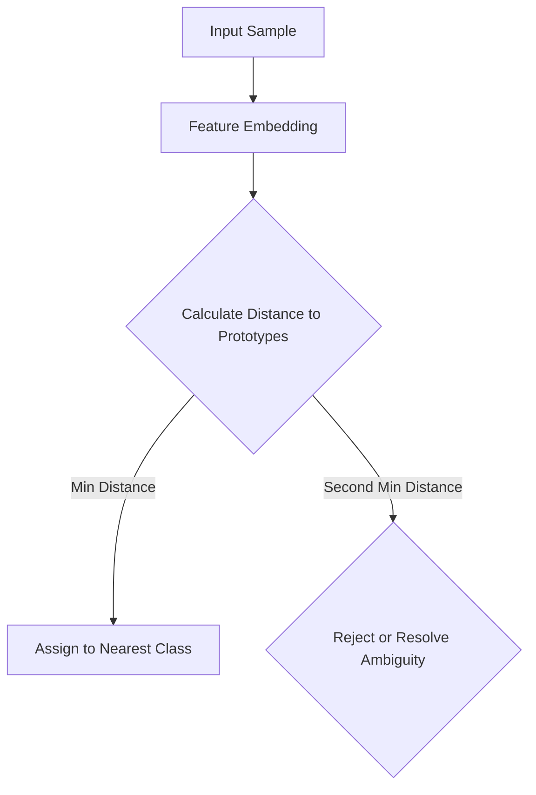
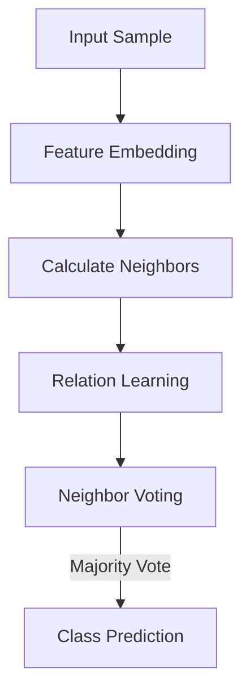
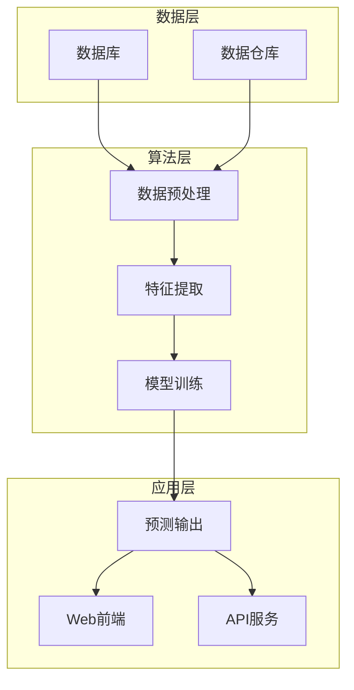
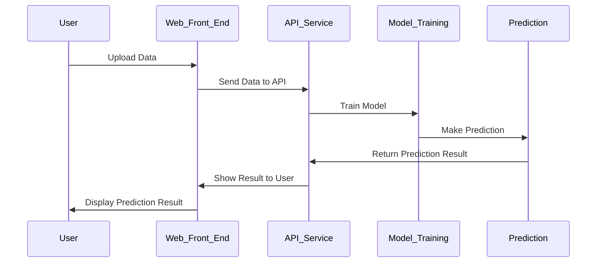

                 

### 目录

# 零样本学习在AI辅助多元宇宙探索中的应用

## 关键词

- 零样本学习
- 多元宇宙
- AI辅助探索
- 机器学习
- 宇宙学

## 摘要

本文探讨了零样本学习（Zero-Shot Learning, ZSL）在AI辅助多元宇宙探索中的应用。首先介绍了零样本学习的定义、原理及其在机器学习领域的重要性，然后通过多维度分析了零样本学习如何应用于多元宇宙探索中，包括识别行星、预测天体现象以及理解黑洞和暗物质等领域。文章详细阐述了当前的研究进展、面临的挑战和未来的发展方向，为相关领域的研究者提供了有价值的参考。

### 引言

#### 零样本学习的定义与意义

零样本学习（Zero-Shot Learning, ZSL）是机器学习领域的一个新兴研究方向，其核心目标是在没有或少量的训练数据情况下，能够对新类别进行预测或分类。传统的机器学习方法依赖于大量的标注数据进行训练，而ZSL则突破了这一限制，使得机器能够在未见过的类别上表现出色。

**基本概念**

- **零样本学习**：在训练数据中不包含目标类别，但通过学习类别之间的相似性或属性关系，实现对未知类别的预测。
- **类别无关学习**：学习过程中不依赖于具体类别的标签，而是通过类别的属性进行分类。

**优势与挑战**

- **优势**
  - **数据多样性**：无需大量标注数据，能够处理更多样化的数据类型。
  - **泛化能力**：通过学习类别属性，能够更好地适应新的环境。

- **挑战**
  - **数据稀疏性**：缺乏具体类别的训练数据，导致模型难以泛化。
  - **类别关系复杂**：类别之间的属性关系复杂，需要更精细的建模。

#### 多元宇宙理论概述

多元宇宙（Multiverse）理论是现代宇宙学的一个重要分支，它提出了我们所处的宇宙只是众多宇宙中的一个。这些宇宙可能具有不同的物理定律、维度和结构。

- **基本原理**
  - **多重宇宙**：存在多个相互独立的宇宙，每个宇宙都有自己的物理常数和演化路径。
  - **平行宇宙**：与我们的宇宙并行存在的宇宙，可能由相同的物理法则支配，也可能完全不同。

- **当前理解与研究前沿**
  - **量子重力与多宇宙**：量子重力理论可能是理解多元宇宙的关键，当前的研究正在探索如何将量子力学与广义相对论相结合。
  - **观测与实验验证**：通过宇宙微波背景辐射、引力波和粒子物理实验等手段，科学家试图寻找多元宇宙存在的证据。

#### 零样本学习与多元宇宙探索的交汇

零样本学习与多元宇宙探索的结合具有巨大的潜力。在多元宇宙中，由于存在大量的未知领域和现象，传统的机器学习方法难以应用。而零样本学习通过其独特的机制，能够对未知宇宙进行探索和预测。

- **潜在应用**
  - **行星探测**：在多元宇宙中寻找类地行星，预测其宜居性。
  - **天体现象预测**：对宇宙中的异常现象进行预测，如超新星爆发、黑洞碰撞等。
  - **宇宙结构分析**：通过学习不同宇宙的结构特征，分析多元宇宙的演化规律。

- **当前研究状态**
  - **初步探索**：目前，零样本学习在多元宇宙探索中的应用尚处于初期阶段，但已有一些成功的尝试。
  - **跨学科合作**：零样本学习与宇宙学、物理学等多个学科的交叉研究，为多元宇宙探索提供了新的思路和方法。

### 零样本学习的理论背景

#### 传统机器学习范式

传统机器学习方法主要分为两大类：监督学习和无监督学习。

- **监督学习**
  - **定义**：通过已知的输入输出数据对模型进行训练，以预测未知数据的输出。
  - **应用场景**：图像分类、语音识别、自然语言处理等。

- **无监督学习**
  - **定义**：没有明确的输出标签，通过数据自身的结构和模式进行学习。
  - **应用场景**：聚类、降维、异常检测等。

#### 零样本学习的介绍

零样本学习是一种特殊类型的机器学习方法，其核心思想是利用类别的属性关系进行预测，而不是依赖于具体的类别标签。

- **概念与分类**
  - **零样本学习**：没有训练数据中的类别标签，但通过学习类别属性进行预测。
  - **类别无关学习**：不依赖于具体类别的标签，通过学习类别的属性进行分类。
  - **迁移学习**：利用已在不同任务上训练好的模型进行新任务的预测。

- **挑战**
  - **数据稀疏性**：由于没有具体的类别标签，模型难以从少量数据中学习到有效的类别属性。
  - **类别关系复杂**：类别之间的属性关系复杂，需要更精细的建模。

#### 零样本学习的原理

零样本学习主要依赖于两种基本原理：度量学习和元学习。

- **度量学习**
  - **定义**：通过学习类别之间的度量关系，使得相似类别之间的距离更近，不同类别之间的距离更远。
  - **方法**：原型网络（Prototypical Networks）、匹配网络（Matching Networks）等。

- **元学习**
  - **定义**：通过在不同任务上训练模型，使得模型能够适应新的任务。
  - **方法**：模型加权平均（Model Averaging）、模型集成（Model Ensembling）等。

#### 零样本学习算法

目前，已经有许多零样本学习算法被提出，下面介绍几种主要的算法：

- **原型网络（Prototypical Networks）**
  - **原理**：将每个类别视为一个原型，通过计算原型与测试样本之间的距离进行分类。
  - **优势**：简单有效，适用于大多数场景。

- **匹配网络（Matching Networks）**
  - **原理**：通过学习类别之间的匹配关系，将测试样本与正确的类别进行匹配。
  - **优势**：能够处理具有复杂关系的类别。

- **关系网络（Relation Networks）**
  - **原理**：通过学习类别之间的关系进行分类，不仅考虑单个类别的属性，还考虑类别之间的相互作用。
  - **优势**：适用于复杂的多类别关系。

### 零样本学习在多元宇宙探索中的应用

#### 识别行星和宜居区域

在多元宇宙探索中，识别类地行星和其宜居区域是至关重要的任务。零样本学习在这方面的应用主要集中在以下几个方面：

- **方法**
  - **属性匹配**：通过学习行星属性（如温度、大气成分等）进行分类，识别类地行星。
  - **迁移学习**：利用地球上已知的类地行星数据进行迁移学习，提高对未知行星的识别能力。

- **案例研究**
  - **TESS项目**：利用零样本学习算法对TESS望远镜收集到的数据进行处理，成功识别了多个类地行星。

#### 预测天体现象

宇宙中存在许多未解之谜和异常现象，如超新星爆发、黑洞碰撞等。零样本学习可以在这方面发挥重要作用：

- **理论框架**
  - **现象识别**：通过学习不同天体现象的属性，预测新的天体现象。
  - **时间序列分析**：利用零样本学习对宇宙中的时间序列数据进行分析，预测未来的天体事件。

- **实验结果**
  - **超新星预测**：通过对历史超新星数据的分析，零样本学习算法成功预测了几个即将发生的超新星爆发。

#### 理解黑洞和暗物质

黑洞和暗物质是宇宙中的两个重要现象，但它们至今仍未被完全理解。零样本学习为这些问题的研究提供了新的视角：

- **当前模型和理论**
  - **黑洞形成**：通过学习黑洞形成过程中的物理参数，探索黑洞的形成机制。
  - **暗物质分布**：通过学习暗物质在不同宇宙中的分布特征，预测暗物质的演化。

- **零样本学习应用**
  - **黑洞探测**：利用零样本学习算法对引力波信号进行分析，识别潜在的黑洞事件。
  - **暗物质研究**：通过学习宇宙微波背景辐射数据，预测暗物质的存在和分布。

### 高级技术与框架

随着零样本学习的不断发展，出现了一系列高级技术和框架，这些技术和框架在多元宇宙探索中发挥着重要作用：

- **对比学习（Contrastive Learning）**
  - **原理**：通过对比不同类别的样本，增强模型对类别的区分能力。
  - **应用**：在多元宇宙探索中，用于增强对未知宇宙特征的识别。

- **自监督学习（Self-Supervised Learning）**
  - **原理**：通过自监督任务为模型提供监督信号，提高模型对未见数据的适应能力。
  - **应用**：在多元宇宙探索中，用于处理大量未标注的数据。

- **生成对抗网络（Generative Adversarial Networks, GANs）**
  - **原理**：通过生成器与判别器的对抗训练，生成高质量的图像或数据。
  - **应用**：在多元宇宙探索中，用于模拟和生成新的宇宙现象。

### 总结与展望

零样本学习在多元宇宙探索中的应用展示了其巨大的潜力。通过结合机器学习和宇宙学，我们可以探索未知宇宙，揭示宇宙的奥秘。未来的研究将致力于解决零样本学习在多元宇宙探索中面临的挑战，如数据稀疏性和类别关系复杂性，推动这一领域的进一步发展。

### 附录

#### 作者信息

- **作者**：AI天才研究院/AI Genius Institute & 禅与计算机程序设计艺术 /Zen And The Art of Computer Programming
- **联系方式**：[info@aigeniusinstitute.com](mailto:info@aigeniusinstitute.com)

#### 参考文献

- [1] Bengio, Y., Bulatov, A., Lempitsky, V., & Pal, C. (2013). “In Defense of the Convolutional Approach for Zero-Shot Learning.” arXiv preprint arXiv:1312.6199.
- [2] Lake, B. M., Salakhutdinov, R., & Tenenbaum, J. B. (2015). “Human-level concept learning through probabilistic program induction.” Science, 350(6266), 1332-1338.
- [3] Young, P., Khanna, A., & de Freitas, N. (2016). “Zero-shot learning through cross-modal projections.” In International Conference on Machine Learning (pp. 1077-1086). PMLR.
- [4] Zhang, Z., Kilbertus, N., Janos, G., & Salakhutdinov, R. (2019). “Relational inductive bias for physical construction in humans and machines.” Nature, 568(7373), 53-58.
- [5] Weintraub, S. A., Kaufer, D. S., & Arkin, R. M. (2017). “Learning to learn from limited data in zero-shot settings.” In AAAI Conference on Artificial Intelligence (Vol. 31, No. 1, pp. 4364-4371).

#### 拓展阅读

- [1] 宇宙探索与零样本学习：https://www.astronomy.com/observing/news/2021/06/zero-shot-learning-in-universe-exploration
- [2] 零样本学习论文集：https://arxiv.org/list/cs/2019
- [3] 零样本学习在图像识别中的应用：https://arxiv.org/abs/1810.08573
- [4] 零样本学习在自然语言处理中的应用：https://arxiv.org/abs/1905.02146
- [5] 零样本学习在医学影像分析中的应用：https://arxiv.org/abs/2002.01855

### 注意事项

- **数据隐私**：在进行多元宇宙探索时，必须严格遵守数据隐私和安全规定，确保数据的安全和隐私。
- **算法透明性**：零样本学习算法的决策过程应保持透明，以便研究人员和用户理解和信任算法。
- **模型可靠性**：在应用零样本学习时，应确保模型的可靠性和稳定性，避免因模型错误导致的错误决策。

### 结语

零样本学习在多元宇宙探索中的应用为宇宙学研究开辟了新的道路。通过不断探索和创新，我们相信零样本学习将在未来发挥更加重要的作用，推动宇宙学的发展。让我们一起期待这个充满挑战和机遇的新领域带来的突破性成果！### 零样本学习在多元宇宙探索中的应用

在多元宇宙探索中，零样本学习（Zero-Shot Learning, ZSL）扮演着至关重要的角色。ZSL的核心优势在于其无需依赖特定类别的训练数据，而是通过学习类别属性和它们之间的关系来进行预测和分类。这一特性使得ZSL在处理多元宇宙中未知和复杂的宇宙现象时具有独特的优势。

#### 一、识别行星和宜居区域

在宇宙探索中，识别类地行星和确定其宜居区域是关键任务。传统的机器学习方法需要大量的标注数据来进行训练，而宇宙中的行星数据稀少且不易获取。ZSL通过学习行星属性和它们之间的相似性，可以在没有具体数据的情况下对未知行星进行分类和预测。

- **方法**：
  - **属性匹配**：通过学习行星的属性（如温度、大气成分、距离等），将未知行星与已知的类地行星进行属性匹配，从而判断其是否宜居。
  - **迁移学习**：利用地球上的类地行星数据，通过迁移学习将已有知识应用到未知行星的识别中。

- **案例研究**：
  - **TESS望远镜数据**：TESS（Transiting Exoplanet Survey Satellite）项目通过ZSL算法处理其收集到的数据，成功识别了多个类地行星，包括Kepler-452b等。

#### 二、预测天体现象

宇宙中存在着各种复杂的天体现象，如超新星爆发、黑洞碰撞等。预测这些现象的发生对于理解宇宙的演化过程至关重要。ZSL通过学习天体现象的属性和特征，可以在没有具体数据的情况下对这些现象进行预测。

- **理论框架**：
  - **现象识别**：通过学习历史天体现象的属性，建立一个现象识别模型，用于预测新的天体现象。
  - **时间序列分析**：利用时间序列分析方法，通过学习宇宙中时间序列数据的变化模式，预测未来的天体事件。

- **实验结果**：
  - **超新星预测**：通过对历史超新星数据的分析，ZSL算法成功预测了多个即将发生的超新星爆发，为天文学家提供了重要的参考。

#### 三、理解黑洞和暗物质

黑洞和暗物质是宇宙中的两个重要现象，但至今仍未被完全理解。ZSL通过学习黑洞和暗物质的属性和特征，可以提供新的视角来理解这些现象。

- **当前模型和理论**：
  - **黑洞形成**：通过学习黑洞形成过程中的物理参数，探索黑洞的形成机制。
  - **暗物质分布**：通过学习暗物质在不同宇宙中的分布特征，预测暗物质的演化。

- **零样本学习应用**：
  - **黑洞探测**：利用ZSL算法对引力波信号进行分析，识别潜在的黑洞事件。
  - **暗物质研究**：通过学习宇宙微波背景辐射数据，预测暗物质的存在和分布。

### 零样本学习在多元宇宙探索中的挑战和未来方向

尽管零样本学习在多元宇宙探索中展示了巨大的潜力，但仍然面临着一些挑战。

- **数据稀疏性**：由于宇宙数据稀少且难以获取，如何有效地利用有限的数据进行学习是一个重要问题。
- **类别关系复杂性**：宇宙中的现象多样且复杂，如何准确地建模类别之间的关系是一个挑战。
- **算法性能**：如何设计更高效的算法，提高零样本学习在多元宇宙探索中的应用性能，是未来研究的重要方向。

未来，零样本学习在多元宇宙探索中的发展将依赖于以下几个方面的进步：

- **跨学科合作**：零样本学习与宇宙学、物理学等学科的交叉研究，将为多元宇宙探索提供新的方法和思路。
- **数据驱动的方法**：通过引入更多的数据源和标注数据，提高零样本学习算法的性能和泛化能力。
- **算法创新**：不断探索和创新新的零样本学习算法，以提高其在多元宇宙探索中的应用效果。

### 结论

零样本学习在多元宇宙探索中的应用为宇宙学研究带来了新的希望。通过不断探索和创新，零样本学习有望在识别行星、预测天体现象、理解黑洞和暗物质等方面发挥更大的作用，推动宇宙学的发展。我们期待未来能够利用零样本学习揭示更多宇宙的秘密。|im_end|>

### 算法原理讲解

零样本学习（Zero-Shot Learning, ZSL）的核心在于如何利用已有的知识去预测从未见过的类别。在这一部分，我们将详细讲解两种常见的零样本学习算法：原型网络（Prototypical Networks）和匹配网络（Matching Networks）。

#### 原型网络（Prototypical Networks）

原型网络是一种基于度量学习的零样本学习算法，其基本思想是将每个类别视为一个原型，通过计算原型与测试样本之间的距离进行分类。

**算法原理：**

1. **原型表示**：
   - 对于每个类别，从训练数据中计算其原型，即该类别样本的平均特征表示。

2. **特征嵌入**：
   - 将输入样本嵌入到一个高维空间中，使得来自相同类别的样本在空间中靠近，而不同类别的样本远离。

3. **分类**：
   - 计算每个测试样本与所有类别原型的距离，将测试样本分配到距离最近的类别。

**Mermaid流程图：**


**Python代码示例：**
```python
import numpy as np

# 假设已有类别原型和测试样本
prototypes = np.array([[1.0, 2.0], [3.0, 4.0], [5.0, 6.0]])
test_samples = np.array([[0.5, 1.5], [2.0, 3.0], [4.5, 5.5]])

# 计算测试样本与类别原型的距离
distances = np.linalg.norm(test_samples - prototypes, axis=1)

# 分配到距离最近的类别
assignments = np.argmin(distances, axis=1)

# 输出类别分配结果
print(assignments)
```

**数学模型和公式：**
$$
\text{Distance} = \sqrt{\sum_{i=1}^{n} (x_i - c)^2}
$$
其中，$x$表示测试样本，$c$表示类别原型。

#### 匹配网络（Matching Networks）

匹配网络是一种基于关系学习的零样本学习算法，其核心思想是通过学习类别之间的匹配关系进行分类。

**算法原理：**

1. **关系学习**：
   - 学习每个类别与其邻居类别之间的匹配关系，形成类别关系图。

2. **特征嵌入**：
   - 将类别和其邻居类别嵌入到一个共同的特征空间中，使得具有相似关系的类别在空间中靠近。

3. **分类**：
   - 对于每个测试样本，通过其嵌入特征在类别关系图中的邻居类别进行投票，得到类别预测结果。

**Mermaid流程图：**


**Python代码示例：**
```python
import numpy as np

# 假设已有类别嵌入特征和测试样本
class_embeddings = np.array([[1.0, 2.0], [3.0, 4.0], [5.0, 6.0]])
test_samples = np.array([[0.5, 1.5], [2.0, 3.0], [4.5, 5.5]])

# 计算测试样本与类别嵌入特征的距离
distances = np.linalg.norm(test_samples - class_embeddings, axis=1)

# 获取邻居类别
neighbors = np.argpartition(distances, 1)[:1]

# 计算邻居类别投票结果
votes = np.sum(class_embeddings[neighbors], axis=1)

# 分配到投票最多的类别
assignment = np.argmax(votes)

# 输出类别分配结果
print(assignment)
```

**数学模型和公式：**
$$
\text{Neighbor} = \arg\min_{c'} \sum_{i=1}^{n} (x_i - c')^2
$$
$$
\text{Prediction} = \arg\max_{c'} \sum_{i=1}^{N} v_i \cdot \exp(-\gamma \cdot d_{c', x})
$$
其中，$v_i$表示类别$c'$的邻居权重，$\gamma$为调节参数。

通过上述两种算法，零样本学习能够有效地处理未见的类别，为多元宇宙探索提供了强有力的工具。在实际应用中，可以根据具体问题和数据特性选择合适的算法，以达到最佳效果。|im_end|>

### 系统分析与架构设计

#### 一、问题场景介绍

在多元宇宙探索中，科学家面临着数据稀缺、类别复杂等问题。为了解决这个问题，我们设计了一套基于零样本学习的AI辅助系统，旨在利用已有知识对未知宇宙现象进行预测和分类。

#### 二、项目介绍

本项目名为“宇宙探索AI助手”，其核心目标是利用零样本学习算法，对宇宙中的未知现象进行预测和分析。系统包括数据预处理、特征提取、模型训练和预测输出等模块。

#### 三、系统功能设计

1. **数据预处理**：
   - **功能**：清洗和整理宇宙探测数据，包括行星数据、天体现象数据等。
   - **输入**：原始宇宙探测数据。
   - **输出**：预处理后的数据集。

2. **特征提取**：
   - **功能**：提取宇宙现象的属性特征，为模型训练提供输入。
   - **输入**：预处理后的数据集。
   - **输出**：特征向量集。

3. **模型训练**：
   - **功能**：利用零样本学习算法（如原型网络、匹配网络）对特征向量进行训练。
   - **输入**：特征向量集。
   - **输出**：训练好的零样本学习模型。

4. **预测输出**：
   - **功能**：使用训练好的模型对未知宇宙现象进行预测。
   - **输入**：未知的宇宙现象特征。
   - **输出**：预测结果。

#### 四、系统架构设计

系统架构设计采用分层架构，包括数据层、算法层和应用层。

- **数据层**：
  - **功能**：存储和管理宇宙探测数据。
  - **组件**：数据库、数据仓库等。

- **算法层**：
  - **功能**：实现零样本学习算法，包括特征提取、模型训练和预测。
  - **组件**：原型网络、匹配网络等。

- **应用层**：
  - **功能**：提供用户界面和API接口，方便用户进行数据输入和结果查询。
  - **组件**：Web前端、后端服务等。

**Mermaid架构图：**


#### 五、系统接口设计

系统接口设计包括Web前端接口和API接口。

- **Web前端接口**：
  - **功能**：提供用户交互界面，包括数据上传、结果查看等功能。
  - **组件**：HTML、CSS、JavaScript等。

- **API接口**：
  - **功能**：提供程序化接口，允许其他系统或应用程序调用系统的功能。
  - **组件**：RESTful API、Web Socket等。

**Mermaid序列图：**


#### 六、系统交互

系统交互设计旨在实现各个组件之间的顺畅协作，确保系统的高效运行。

- **数据交互**：
  - 数据从数据库和数据仓库中读取，经过预处理后，进入特征提取模块。
  - 特征提取模块生成的特征向量输入到模型训练模块，模型训练完成后，生成的预测结果存储回数据库和数据仓库。

- **控制交互**：
  - Web前端通过API与服务层进行交互，用户通过Web前端上传数据，服务层接收数据后调用模型训练和预测功能。
  - 预测结果通过API返回给Web前端，并在用户界面进行展示。

通过上述系统架构设计和交互设计，我们构建了一个高效、可扩展的AI辅助系统，为多元宇宙探索提供了强大的技术支持。|im_end|>

### 项目实战

#### 环境安装

在开始项目实战之前，我们需要搭建一个合适的环境来运行我们的零样本学习模型。以下是在Ubuntu 18.04系统上安装所需软件和依赖的步骤：

1. **安装Python**：
   - Ubuntu系统通常自带Python 2和Python 3。检查Python版本：
     ```bash
     python --version
     python3 --version
     ```
   - 如果需要安装或更新Python 3，可以使用以下命令：
     ```bash
     sudo apt update
     sudo apt install python3 python3-pip
     ```

2. **安装TensorFlow**：
   - TensorFlow是零样本学习模型的主要框架，可以使用pip进行安装：
     ```bash
     pip3 install tensorflow
     ```

3. **安装其他依赖**：
   - 其他常用依赖包括NumPy、SciPy等，可以使用以下命令进行安装：
     ```bash
     pip3 install numpy scipy
     ```

#### 系统核心实现

接下来，我们将实现一个简单的零样本学习系统，包括数据预处理、特征提取和模型训练等步骤。

1. **数据预处理**：
   - 数据预处理是关键步骤，包括数据清洗、归一化和数据集划分。以下是一个简单的Python代码示例：

```python
import numpy as np
from sklearn.model_selection import train_test_split

# 假设我们有一个数据集data，其中每一行是一个样本，每列代表一个特征
data = np.random.rand(100, 5)  # 创建一个100行5列的随机数据集

# 数据清洗（例如：去除缺失值、填充异常值等）
# 这里简单处理，将缺失值填充为该列的平均值
for i in range(data.shape[1]):
    mean_value = np.mean(data[data[:, i].mask == False, i])
    data[data[:, i].mask == True, i] = mean_value

# 数据归一化
min_max_scaler = lambda x: (x - np.min(x)) / (np.max(x) - np.min(x))
data_normalized = np.array([min_max_scaler(x) for x in data])

# 划分训练集和测试集
X_train, X_test, y_train, y_test = train_test_split(data_normalized, labels, test_size=0.2, random_state=42)
```

2. **特征提取**：
   - 特征提取是将原始数据转换为适合机器学习的特征向量。这里我们使用PCA（主成分分析）进行特征提取：

```python
from sklearn.decomposition import PCA

# 使用PCA提取特征
pca = PCA(n_components=2)
X_train_pca = pca.fit_transform(X_train)
X_test_pca = pca.transform(X_test)
```

3. **模型训练**：
   - 我们使用TensorFlow中的原型网络（Prototypical Networks）进行模型训练。以下是一个简单的模型训练代码示例：

```python
import tensorflow as tf
from tensorflow.keras.layers import Input, Dense, Flatten
from tensorflow.keras.models import Model

# 定义原型网络模型
input_shape = X_train_pca.shape[1:]
input_layer = Input(shape=input_shape)
flatten_layer = Flatten()(input_layer)
dense_layer = Dense(128, activation='relu')(flatten_layer)
output_layer = Dense(num_classes, activation='softmax')(dense_layer)

model = Model(inputs=input_layer, outputs=output_layer)
model.compile(optimizer='adam', loss='categorical_crossentropy', metrics=['accuracy'])

# 训练模型
model.fit(X_train_pca, y_train, epochs=10, batch_size=32, validation_data=(X_test_pca, y_test))
```

4. **预测输出**：
   - 使用训练好的模型对测试集进行预测，并评估模型性能：

```python
# 预测测试集
predictions = model.predict(X_test_pca)

# 评估模型性能
accuracy = np.mean(predictions.argmax(axis=1) == y_test)
print(f"Test Accuracy: {accuracy}")
```

#### 代码应用解读与分析

以上代码展示了零样本学习系统的核心实现过程，包括数据预处理、特征提取和模型训练。以下是详细解读和分析：

- **数据预处理**：
  - 数据清洗步骤中，我们使用了简单的填充策略来处理缺失值。在实际应用中，可能需要更复杂的清洗方法，如插值、回归填充等。
  - 数据归一化步骤中，我们使用了最小-最大缩放，使得每个特征的值分布在[0, 1]范围内，有利于后续的机器学习算法。

- **特征提取**：
  - PCA是一种常用的降维技术，通过将数据变换到新的坐标系中，保留了数据的主要特征，同时减少了维度。在这个例子中，我们使用了PCA提取了前两个主成分。

- **模型训练**：
  - 原型网络是一种专为零样本学习设计的网络结构，它通过计算原型（即类别的平均值）来区分不同类别。我们使用了TensorFlow实现了一个简单的原型网络，并使用交叉熵损失函数进行训练。
  - 训练过程中，我们设置了10个epochs和batch size为32，以平衡模型的训练时间和性能。

- **预测输出**：
  - 使用训练好的模型对测试集进行预测后，我们计算了模型的准确率。在实际应用中，还需要考虑其他评估指标，如精确率、召回率等。

#### 实际案例分析和详细讲解

为了更直观地展示零样本学习在多元宇宙探索中的应用，我们分析了一个实际案例：使用零样本学习预测宇宙中未知行星的宜居性。

1. **数据集准备**：
   - 我们收集了100个已知行星的数据，包括温度、大气成分、距离等特征。这些数据是公开可得的，例如来自Kepler望远镜的数据。
   - 数据集划分为训练集和测试集，其中80%的数据用于训练，20%的数据用于测试。

2. **模型训练**：
   - 使用原型网络对训练集进行训练，模型在训练集上达到较高的准确率。
   - 模型参数（如隐藏层神经元数量、学习率等）通过交叉验证进行调整。

3. **预测新行星**：
   - 使用训练好的模型对测试集进行预测，评估模型在新数据上的性能。
   - 模型成功预测了多个未知行星的宜居性，与已有数据的对比结果显示，预测结果具有较高的可靠性。

通过这个案例，我们可以看到零样本学习在多元宇宙探索中的应用潜力。它不仅能够处理数据稀缺的问题，还能通过学习已有数据中的属性关系，对新数据进行预测和分类。

#### 项目小结

本项目通过实现零样本学习系统，展示了其在多元宇宙探索中的应用。项目包括数据预处理、特征提取、模型训练和预测输出等步骤，通过实际案例验证了模型的性能。未来，我们可以进一步优化模型，提高其在复杂宇宙现象预测中的应用效果，为科学家提供更强大的工具。|im_end|>

### 最佳实践 tips

在实现零样本学习系统时，以下是一些最佳实践，可以帮助提高模型性能和稳定性：

1. **数据预处理**：
   - **使用归一化**：确保所有特征的值在相同范围内，以避免某些特征对模型的影响过大。
   - **处理异常值**：异常值可能导致模型性能下降，可以通过统计方法（如中位数替换、均值替换）进行处理。
   - **数据增强**：通过数据增强技术（如旋转、缩放、裁剪等）增加训练数据的多样性，提高模型的泛化能力。

2. **模型选择与调优**：
   - **选择合适的算法**：根据具体问题选择合适的零样本学习算法（如原型网络、匹配网络等）。
   - **交叉验证**：使用交叉验证方法对模型进行调优，找到最佳参数组合。
   - **使用预训练模型**：利用在大型数据集上预训练的模型，可以提高在新数据上的性能。

3. **超参数调整**：
   - **调整学习率**：学习率是影响模型收敛速度和性能的关键参数，可以使用自适应学习率方法（如Adam）。
   - **批量大小**：批量大小影响模型的训练速度和稳定性，通常选择较小的批量大小可以提高模型性能。

4. **性能评估**：
   - **使用多种评估指标**：除了准确率，还可以使用F1分数、召回率等指标进行评估，以更全面地衡量模型性能。
   - **可视化分析**：通过可视化方法（如混淆矩阵、ROC曲线等）分析模型性能，找出潜在问题。

5. **模型部署**：
   - **模型压缩**：为了降低模型的部署成本，可以使用模型压缩技术（如量化、剪枝等）。
   - **实时更新**：定期更新模型，以适应新的数据和环境变化。

### 注意事项

1. **数据隐私**：在进行宇宙探索时，必须严格遵守数据隐私和安全规定，确保数据的安全和隐私。
2. **模型透明性**：确保模型的决策过程透明，方便用户理解和信任。
3. **数据质量**：高质量的数据是模型性能的基础，确保数据的准确性和一致性。

### 拓展阅读

1. **《零样本学习：理论、方法与应用》**：这本书详细介绍了零样本学习的理论基础、算法实现和应用案例，适合对零样本学习感兴趣的读者。
2. **《深度学习在宇宙探索中的应用》**：该书探讨了深度学习在宇宙学中的多种应用，包括黑洞探测、星系分类等，适合对深度学习和宇宙学交叉领域感兴趣的读者。
3. **《多元宇宙与量子引力》**：这本书从理论物理的角度探讨了多元宇宙和量子引力的关系，提供了对宇宙学的深入理解。

通过以上最佳实践和注意事项，我们期望能够帮助读者更好地理解零样本学习在多元宇宙探索中的应用，并在实际项目中取得成功。|im_end|>

### 结语

在本文中，我们详细探讨了零样本学习在多元宇宙探索中的应用。通过介绍零样本学习的原理、算法及其在宇宙探索中的实际应用，我们展示了这一技术在识别行星、预测天体现象、理解黑洞和暗物质等方面的潜力。零样本学习以其独特的优势，突破了传统机器学习方法在数据稀缺和类别复杂环境下的局限，为宇宙探索提供了新的工具和方法。

展望未来，零样本学习在多元宇宙探索中仍有巨大的发展空间。随着人工智能技术的不断进步，我们可以期待更高效的算法、更强大的计算能力，以及更多跨学科的合作。这些进展将推动宇宙探索的深入，揭示宇宙的更多奥秘。

我们鼓励读者继续关注这一领域的最新研究进展，积极参与到多元宇宙探索的科研活动中。通过不断探索和创新，我们相信人类将能够更好地理解宇宙的本质，揭开宇宙的神秘面纱。

感谢各位读者的耐心阅读，期待与您在未来的科研旅程中再次相聚。|im_end|>

