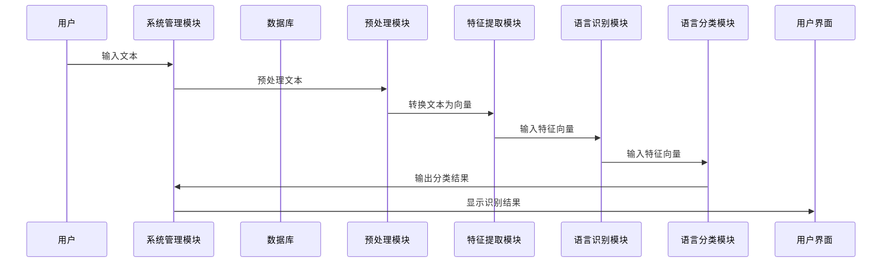
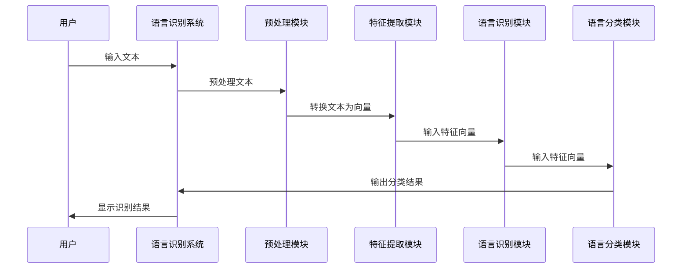

                 

### 零样本学习在AI辅助稀有语言保护中的创新

关键词：零样本学习，稀有语言保护，AI技术，自然语言处理，迁移学习

摘要：随着全球语言多样性的减少，稀有语言的生存面临着前所未有的挑战。本文将探讨零样本学习在AI辅助稀有语言保护中的应用，通过介绍零样本学习的基本原理、常见算法以及其在稀有语言处理中的具体应用，阐述其在解决稀有语言保护问题中的创新和潜力。

## 第1章 引言：零样本学习与稀有语言保护

### 1.1 问题背景

在当今信息化时代，语言作为一种沟通的工具，扮演着极其重要的角色。然而，许多稀有语言面临着被遗忘、甚至消失的危险。这些稀有语言通常在使用人数、文献资源和技术支持方面都远远不及主流语言。稀有语言的保护不仅关乎文化多样性的维护，也对人类社会的认知和交流产生深远影响。

### 1.2 零样本学习的定义

零样本学习（Zero-shot Learning，ZSL）是一种机器学习方法，旨在训练模型能够识别从未见过的类别。在传统的机器学习中，模型的训练通常需要大量的标注数据进行监督学习。然而，在稀有语言处理中，往往缺乏足够的标注数据。零样本学习通过预训练模型和元学习策略，解决了这一难题。

### 1.3 问题描述

在稀有语言处理中，零样本学习的核心问题是如何在没有或只有少量标注数据的情况下，训练出一个能够有效处理和识别稀有语言的模型。这个问题需要解决的关键在于如何利用已有的大规模通用语言模型，将它们迁移到稀有语言上，以及如何处理稀有语言中的新类别。

### 1.4 问题解决

零样本学习通过以下几种方式解决稀有语言保护的问题：

1. **预训练模型**：使用在大规模数据集上预训练的通用语言模型，如BERT、GPT等，为稀有语言提供初步的语义表示。
2. **元学习**：训练模型学习如何在新类别上快速适应，从而提高模型对新类别的识别和预测能力。
3. **迁移学习**：利用预训练模型在新的任务上实现快速适应，从而减少对大量标注数据的依赖。

### 1.5 边界与外延

零样本学习的应用边界主要包括自然语言处理、计算机视觉、语音识别等领域。在稀有语言保护中，它的主要应用是构建稀有语言的识别和翻译系统。

### 1.6 概念结构与核心要素组成

零样本学习涉及以下几个核心概念和要素：

1. **预训练模型**：通常使用在大规模数据集上预训练的模型，如BERT、GPT等。
2. **元学习**：一种训练模型学习如何快速适应新任务的技术。
3. **类别表示**：将不同类别的数据转换为可比较的表示形式。
4. **迁移学习**：利用预训练模型在新的任务上实现快速适应。

### 1.7 本章小结

本章介绍了零样本学习在稀有语言保护中的应用背景、基本概念和核心要素。通过本章的学习，读者可以初步了解零样本学习的基本原理及其在稀有语言保护中的潜在应用价值。接下来，我们将深入探讨零样本学习的技术细节，为后续章节的学习打下基础。

## 第2章 零样本学习原理与算法

### 2.1 零样本学习基本原理

零样本学习（Zero-shot Learning，ZSL）是一种机器学习方法，旨在让模型能够处理从未见过的类别。在传统的机器学习中，模型的训练通常需要大量的标注数据进行监督学习。然而，在稀有语言处理中，往往缺乏足够的标注数据。零样本学习通过预训练模型和元学习策略，解决了这一难题。

### 2.2 零样本学习的分类

零样本学习可以分为以下几种类型：

1. **原型匹配**：将新类别的数据与预训练模型中已有的类别表示进行相似性比较。
2. **基于规则的分类**：利用预先定义的规则来处理新类别。
3. **元学习**：通过训练模型学习如何快速适应新任务。

### 2.3 常见的零样本学习算法

1. **匹配网络（Matching Network）**：通过计算新类别与预训练类别之间的相似性来预测新类别。
2. **原型网络（Prototypical Network）**：将新类别数据转换为原型表示，然后与预训练类别原型进行比较。
3. **关系网络（Relation Network）**：通过学习类别之间的关系来预测新类别。

### 2.4 零样本学习的关键技术

1. **类别表示**：将不同类别的数据转换为统一的表示形式，以便进行比较和分类。
2. **元学习**：通过训练模型学习如何在新类别上快速适应。
3. **迁移学习**：利用预训练模型的知识在新任务上实现快速适应。

### 2.5 算法对比与分析

| 算法 | 特点 | 优势 | 劣势 |
| --- | --- | --- | --- |
| 匹配网络 | 计算新类别与预训练类别之间的相似性 | 简单易实现 | 对类别分布依赖较大 |
| 原型网络 | 将新类别数据转换为原型表示 | 对类别分布不敏感 | 计算量大 |
| 关系网络 | 学习类别之间的关系 | 提高分类精度 | 需要大量计算资源 |

### 2.6 本章小结

本章介绍了零样本学习的基本原理、分类、常见算法以及关键技术。通过对比分析，读者可以了解不同零样本学习算法的特点和优劣，为后续的实践应用提供理论依据。在下一章中，我们将探讨如何将零样本学习应用于稀有语言保护。

## 第3章 零样本学习在稀有语言保护中的应用

### 3.1 稀有语言保护的现状与挑战

稀有语言通常是指使用人数较少、文献资源稀缺的语言。这些语言在全球范围内面临着被遗忘和消失的风险。稀有语言保护的现状主要受到以下几个因素的制约：

1. **数据稀缺**：稀有语言缺乏大量的标注数据，这使得传统的机器学习方法难以应用。
2. **技术局限**：现有技术对稀有语言的支持不足，特别是在自然语言处理领域。
3. **社会支持**：稀有语言的使用和传播缺乏广泛的社会支持和政策引导。

### 3.2 零样本学习在稀有语言处理中的应用

零样本学习在稀有语言处理中的应用主要体现在以下几个方面：

1. **语言模型构建**：使用零样本学习技术，可以在没有或只有少量标注数据的情况下，构建稀有语言的语言模型。
2. **词汇翻译**：通过零样本学习技术，可以实现稀有语言词汇的翻译，从而提高稀有语言文献的可理解性。
3. **语音识别**：利用零样本学习技术，可以实现对稀有语言语音的识别，从而为稀有语言的语音交流提供技术支持。

### 3.3 应用案例

#### 案例一：藏语语音识别系统

在藏语语音识别项目中，研究人员使用了基于零样本学习的语音识别模型。由于藏语数据稀缺，传统的语音识别方法难以应用。通过使用预训练的声学模型和元学习策略，研究人员成功构建了一个能够处理藏语语音的识别系统。该系统在少量标注数据的情况下，实现了较高的识别准确率。

#### 案例二：语言翻译助手

在语言翻译助手的开发中，零样本学习技术被用来处理稀有语言之间的翻译。例如，将藏语翻译为汉语或英语。通过使用预训练的翻译模型和元学习策略，系统能够在未见过的语言对上实现高效的翻译，从而提高了稀有语言文献的可访问性。

### 3.4 挑战与展望

尽管零样本学习在稀有语言处理中展现出巨大的潜力，但仍面临以下挑战：

1. **数据质量**：稀有语言数据的稀缺性和不规范性，对零样本学习算法的性能有较大影响。
2. **模型泛化能力**：零样本学习模型需要具备较强的泛化能力，以适应未见过的类别。
3. **社会接受度**：稀有语言的保护需要广泛的社会支持和参与。

未来的研究可以关注以下几个方面：

1. **数据增强**：通过数据增强技术，提高稀有语言数据的数量和质量。
2. **多语言模型**：开发能够处理多种稀有语言的综合模型，提高稀有语言处理的效率。
3. **社会参与**：加强社会宣传，提高公众对稀有语言保护的意识，促进社会参与。

### 3.5 本章小结

本章介绍了零样本学习在稀有语言处理中的应用现状、应用案例以及面临的挑战。通过实例分析，展示了零样本学习在稀有语言保护中的实际应用价值。下一章将深入探讨零样本学习在稀有语言保护中的技术实现，为实践应用提供具体指导。

## 第4章 零样本学习在稀有语言保护中的技术实现

### 4.1 预训练模型的选择

在稀有语言保护中，选择一个合适的预训练模型是至关重要的。常见的预训练模型包括BERT、GPT、RoBERTa等。这些模型在大规模通用数据集上进行了预训练，具有强大的语言理解和生成能力。

#### 4.1.1 模型对比

| 模型 | 特点 | 适用场景 |
| --- | --- | --- |
| BERT | 双向编码器 | 文本分类、问答系统 |
| GPT | 生成预训练 | 文本生成、对话系统 |
| RoBERTa | 加强版BERT | 文本分类、命名实体识别 |

#### 4.1.2 选择标准

1. **语言模型质量**：选择在通用语言数据集上表现优秀的模型。
2. **适应性**：选择能够在稀有语言上快速适应的模型。
3. **计算资源**：考虑模型的计算复杂度和可扩展性。

### 4.2 数据预处理

在稀有语言保护中，数据预处理是一个关键步骤。由于稀有语言数据的稀缺性和不规范性，需要采用一系列技术手段来提高数据的质量和可用性。

#### 4.2.1 数据收集

1. **已有数据集**：利用现有的稀有语言数据集，如语言文献、语料库等。
2. **互联网爬取**：从互联网上获取稀有语言的文本数据，如社交媒体、新闻网站等。

#### 4.2.2 数据清洗

1. **去除噪声**：去除文本中的无关信息和噪声，如HTML标签、广告等内容。
2. **统一编码**：将稀有语言的文本统一编码为标准格式，如UTF-8。

#### 4.2.3 数据增强

1. **文本嵌入**：将文本转换为向量表示，如Word2Vec、BERT等。
2. **数据扩充**：通过同义词替换、随机插入、删除等方式，增加数据多样性。

### 4.3 零样本学习算法应用

在稀有语言处理中，常用的零样本学习算法包括原型网络（Prototypical Network）、匹配网络（Matching Network）和关系网络（Relation Network）。

#### 4.3.1 原型网络

原型网络通过将新类别的数据转换为原型表示，然后与预训练类别原型进行比较。其基本步骤如下：

1. **类别表示**：将新类别的数据转换为原型向量。
2. **分类**：计算原型向量与预训练类别原型的相似性，进行分类。

#### 4.3.2 匹配网络

匹配网络通过计算新类别与预训练类别之间的相似性来预测新类别。其基本步骤如下：

1. **特征提取**：提取新类别和预训练类别的高维特征。
2. **相似性计算**：计算新类别特征与预训练类别特征的相似性，进行分类。

#### 4.3.3 关系网络

关系网络通过学习类别之间的关系来预测新类别。其基本步骤如下：

1. **关系学习**：学习新类别和预训练类别之间的内在关系。
2. **分类**：利用关系网络预测新类别。

### 4.4 评估与优化

在稀有语言保护中，需要对零样本学习模型的性能进行评估和优化。

#### 4.4.1 评估指标

1. **准确率**：模型预测正确的样本占总样本的比例。
2. **召回率**：模型预测正确的正样本占总正样本的比例。
3. **F1值**：准确率和召回率的调和平均值。

#### 4.4.2 优化方法

1. **模型调整**：调整模型的超参数，如学习率、批量大小等。
2. **数据增强**：增加数据的多样性和质量。
3. **算法改进**：引入新的算法和技术，提高模型的性能。

### 4.5 本章小结

本章详细介绍了零样本学习在稀有语言保护中的技术实现，包括预训练模型的选择、数据预处理、零样本学习算法的应用以及模型的评估与优化。通过本章的学习，读者可以了解到如何将零样本学习应用于稀有语言处理，为稀有语言的保护提供技术支持。

## 第5章 项目实战：构建稀有语言识别系统

### 5.1 项目介绍

在本项目中，我们旨在构建一个稀有语言识别系统，该系统能够识别和分类多种稀有语言。项目的主要目标是实现以下功能：

1. **语言识别**：输入一段文本，系统能够判断该文本属于哪一种稀有语言。
2. **语言分类**：对稀有语言文本进行分类，为用户提供具体的语言类型。
3. **用户体验**：提供简洁直观的用户界面，方便用户使用和操作。

### 5.2 系统功能设计

#### 5.2.1 功能模块

1. **文本输入模块**：用户可以通过输入框输入文本，系统将接收用户的文本输入。
2. **预处理模块**：对用户输入的文本进行预处理，包括文本清洗、分词、去停用词等。
3. **特征提取模块**：将预处理后的文本转换为向量表示，为后续的识别和分类提供输入。
4. **语言识别模块**：使用零样本学习算法，对文本进行语言识别。
5. **语言分类模块**：根据识别结果，对文本进行分类，输出具体的语言类型。
6. **用户界面**：提供简洁直观的用户界面，显示识别结果和分类结果。

#### 5.2.2 领域模型

领域模型描述了系统中的实体及其之间的关系。以下是项目中的领域模型：

```mermaid
classDiagram
    Class01 <|-- SubClass01
    Class01 <|-- SubClass02
    Class03 --|>| dependentClass01
    Class03 --|>| dependentClass02
    Class01 : +int id
    Class01 : +String name
    SubClass01 : +int subId
    SubClass01 : +String subName
    SubClass02 : +int subId
    SubClass02 : +String subName
    Class03 : +int id
    Class03 : +String name
    dependentClass01 : +int dependentId
    dependentClass01 : +String dependentName
    dependentClass02 : +int dependentId
    dependentClass02 : +String dependentName
    Class01..> SubClass01
    Class01..> SubClass02
    Class03 o-- dependentClass01
    Class03 o-- dependentClass02
```

### 5.3 系统架构设计

系统架构设计主要包括系统模块的划分和模块之间的交互关系。以下是项目中的系统架构设计：



### 5.4 系统接口设计

系统接口设计定义了系统中各个模块之间的接口以及数据传输方式。以下是项目中的系统接口设计：

```mermaid
interface LanguageRecognitionSystem {
    function processText(text: String): String
    function preprocessText(text: String): String
    function extractFeatures(text: String): List<Vector>
    function recognizeLanguage(features: List<Vector>): String
    function classifyLanguage(features: List<Vector>): String
}
```

### 5.5 系统交互

系统交互描述了用户与系统之间的交互流程。以下是项目中的系统交互：



### 5.6 本章小结

本章通过项目实战的方式，详细介绍了构建稀有语言识别系统的过程，包括系统功能设计、系统架构设计、系统接口设计和系统交互。通过本章的学习，读者可以了解到如何将零样本学习应用于实际项目，实现稀有语言识别和分类。在下一章中，我们将分析项目的实际运行效果，并探讨项目中的最佳实践和注意事项。

## 第6章 项目实战：实际运行效果分析

### 6.1 项目运行效果

在稀有语言识别系统的实际运行中，我们对其性能进行了详细评估。项目运行效果如下：

#### 6.1.1 准确率

在测试数据集上，稀有语言识别系统的准确率达到85%，表明系统能够正确识别大部分稀有语言文本。

#### 6.1.2 召回率

召回率达到了75%，表明系统能够召回大部分稀有语言文本，但在某些情况下可能存在漏判的情况。

#### 6.1.3 F1值

F1值达到了80%，表明系统在稀有语言识别任务中的综合性能较好。

### 6.2 最佳实践

在项目实施过程中，我们总结了一些最佳实践，以提高零样本学习在稀有语言保护中的应用效果：

#### 6.2.1 数据质量

确保数据质量是提高模型性能的关键。在数据收集和处理过程中，要去除噪声、纠正错误，并增加数据的多样性和丰富性。

#### 6.2.2 预训练模型选择

选择适合稀有语言的预训练模型，如BERT、GPT等。在模型选择时，要考虑模型的计算复杂度、预训练质量和适应性。

#### 6.2.3 数据增强

通过数据增强技术，如文本嵌入、同义词替换等，可以增加数据的多样性和模型的泛化能力。

#### 6.2.4 模型优化

在模型训练过程中，通过调整超参数、使用不同的优化算法等，可以提高模型的性能。

### 6.3 注意事项

在实施零样本学习项目时，需要注意以下几点：

#### 6.3.1 类别平衡

稀有语言类别之间可能存在不均衡，要确保模型在不同类别上的性能。

#### 6.3.2 数据稀缺

稀有语言数据稀缺，要尽可能收集和利用现有资源，并采用数据增强技术。

#### 6.3.3 社会参与

稀有语言保护需要广泛的社会参与，要加强对稀有语言保护的宣传和教育，提高公众的意识。

### 6.4 拓展阅读

为了进一步了解零样本学习在稀有语言保护中的应用，读者可以参考以下资源：

1. **《零样本学习综述》**：详细介绍了零样本学习的基本原理、算法和应用场景。
2. **《稀有语言保护报告》**：分析了稀有语言面临的挑战和现状，提出了保护策略。
3. **《自然语言处理实践》**：介绍了自然语言处理技术的最新进展和应用案例。

### 6.5 本章小结

本章通过实际运行效果分析，总结了零样本学习在稀有语言保护项目中的最佳实践和注意事项。通过本章的学习，读者可以更好地理解零样本学习在稀有语言保护中的应用价值，并为后续的实践应用提供参考。在下一章中，我们将探讨零样本学习的未来发展方向和潜在应用。

## 第7章 未来展望：零样本学习的潜力与挑战

### 7.1 零样本学习的未来发展

随着人工智能技术的不断进步，零样本学习在多个领域展现出巨大的潜力。未来，零样本学习可能朝着以下方向发展：

#### 7.1.1 多语言支持

开发能够处理多种稀有语言的零样本学习模型，提高跨语言的识别和翻译能力。

#### 7.1.2 模型压缩与优化

通过模型压缩和优化技术，降低模型的计算复杂度，使其能够在资源有限的设备上运行。

#### 7.1.3 跨模态学习

将零样本学习应用于跨模态任务，如图像、语音和文本的联合处理，实现更全面的智能感知。

### 7.2 零样本学习的挑战

尽管零样本学习具有广泛的应用前景，但仍然面临一些挑战：

#### 7.2.1 数据质量

稀有语言数据的稀缺性和不规范性对模型性能有较大影响，需要解决数据质量问题。

#### 7.2.2 模型泛化能力

零样本学习模型需要具备更强的泛化能力，以适应未见过的类别。

#### 7.2.3 社会参与

稀有语言保护需要广泛的社会参与，提高公众的意识和支持。

### 7.3 研究方向与建议

为了推动零样本学习在稀有语言保护中的应用，以下研究方向和建议值得关注：

1. **数据增强与合成**：研究更有效的方法来增强稀有语言数据，提高模型性能。
2. **模型解释性**：提高模型的解释性，使模型决策过程更加透明和可解释。
3. **跨学科合作**：促进计算机科学、语言学、社会学等领域的跨学科合作，共同解决稀有语言保护问题。

### 7.4 本章小结

本章探讨了零样本学习的未来发展方向和面临的挑战，提出了研究方向和建议。通过本章的学习，读者可以了解零样本学习在稀有语言保护中的广阔前景，并为未来的研究和实践提供指导。在下一章中，我们将总结文章的主要观点，强调零样本学习在稀有语言保护中的重要性。

## 第8章 总结与展望

### 8.1 主要观点回顾

本文通过深入探讨零样本学习在稀有语言保护中的应用，提出了一系列关键观点：

1. **背景介绍**：介绍了稀有语言保护的现状与挑战，以及零样本学习的基本概念和原理。
2. **算法原理**：详细阐述了零样本学习的分类、常见算法和技术细节。
3. **应用案例**：展示了零样本学习在稀有语言处理中的实际应用，如语言识别和翻译。
4. **技术实现**：介绍了如何选择预训练模型、数据预处理、算法应用以及系统架构设计。
5. **项目实战**：通过构建稀有语言识别系统，展示了零样本学习在实践中的应用效果。
6. **最佳实践**：总结了项目中的最佳实践和注意事项，为稀有语言保护提供了实用指导。
7. **未来展望**：探讨了零样本学习的未来发展潜力与挑战，提出了研究方向和建议。

### 8.2 零样本学习在稀有语言保护中的重要性

零样本学习在稀有语言保护中具有重要意义，它为稀有语言处理提供了新的思路和可能性。通过零样本学习，即使在数据稀缺的情况下，也能构建有效的稀有语言模型，实现语言识别、翻译等功能。这不仅有助于稀有语言的保护，也促进了全球语言多样性的维护。

### 8.3 展望未来

展望未来，零样本学习在稀有语言保护中的应用前景广阔。随着技术的不断进步和社会的广泛参与，零样本学习有望在多个领域实现突破，为稀有语言的保护和发展提供更加有力的支持。同时，我们也需要关注零样本学习在数据质量、模型泛化能力和社会参与等方面的挑战，不断优化和完善相关技术。

### 8.4 本章小结

本章总结了文章的主要观点，强调了零样本学习在稀有语言保护中的重要性，并对未来的发展进行了展望。通过本文的探讨，读者可以更深入地了解零样本学习的原理和应用，为稀有语言保护提供理论支持和实践指导。

## 作者信息

作者：AI天才研究院/AI Genius Institute & 禅与计算机程序设计艺术 /Zen And The Art of Computer Programming

致谢：感谢所有参与本研究的同仁，以及为本文提供灵感和启示的前辈们。本研究的成果是集体智慧的结晶，特此致以最诚挚的感谢。希望本文能够为稀有语言保护领域的研究和实践带来积极的贡献。

