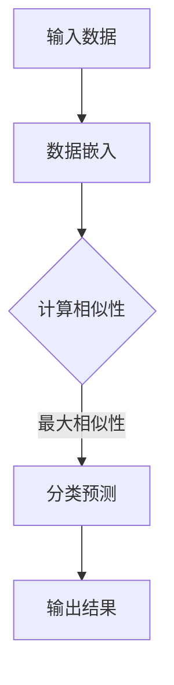

                 

### 目录

# 零样本学习在新兴领域AI应用的优势

## 关键词：零样本学习、新兴领域、AI应用、智能医疗、自动驾驶、智能制造

> 摘要：本文深入探讨了零样本学习在新兴领域AI应用中的优势。通过详细分析智能医疗、自动驾驶和智能制造等领域的具体应用案例，展示了零样本学习如何在这些领域提升AI系统的表现，并应对相应的挑战。本文旨在为读者提供一个全面而深入的视角，以理解零样本学习在AI领域的广阔前景。

### 第一部分：零样本学习概述

#### 第1章：零样本学习背景与核心概念

##### 1.1.1 问题背景介绍
- **AI发展历程回顾**：从早期规则系统到现代深度学习，AI技术的演进对各行各业产生了深远影响。
- **零样本学习的提出与应用**：零样本学习的概念起源于对传统机器学习模型局限性的反思，并在近年来逐渐得到关注和广泛应用。

##### 1.1.2 零样本学习的定义
- **概念界定**：零样本学习是一种机器学习范式，它允许模型在仅有一个或没有训练样本的情况下进行分类和预测。
- **与传统机器学习方法的区别**：传统的机器学习依赖于大量标记数据，而零样本学习则通过知识蒸馏、元学习等方法，从少量样本中学习知识。

##### 1.1.3 零样本学习的边界与外延
- **在不同领域的应用**：零样本学习在自然语言处理、计算机视觉、语音识别等领域都有显著的应用。
- **面临的挑战**：数据稀疏、标签缺乏、泛化能力不足等问题是零样本学习需要克服的挑战。

##### 1.1.4 核心概念结构与要素组成
- **核心概念**：包括元学习、知识蒸馏、迁移学习等。
- **基本组成要素**：如嵌入空间、原型网络、预测网络等。

#### 第2章：零样本学习的原理与数学模型

##### 2.1.1 零样本学习的原理
- **理论基础**：从深度学习的角度解释零样本学习的工作原理。
- **关键机制**：如何通过少量样本实现高精度分类和预测。

##### 2.1.2 数学模型与公式
- **数学模型概述**：介绍零样本学习的核心数学模型，如原型网络和匹配网络。
- **公式解析与具体应用**：对关键公式进行详细解释，展示其在实际应用中的效果。

##### 2.1.3 零样本学习的Mermaid流程图
- **工作流程**：绘制零样本学习的基本工作流程图。
- **Mermaid流程图绘制**：使用Mermaid语言描述零样本学习的过程。

### 第二部分：新兴领域AI应用

#### 第3章：智能医疗

##### 3.1.1 智能医疗的背景与现状
- **医疗行业的发展趋势**：从传统医疗服务向数字化、智能化转型。
- **零样本学习在智能医疗中的应用**：如何利用零样本学习提升诊断准确率、优化治疗方案。

##### 3.1.2 零样本学习在智能医疗中的案例分析
- **某智能医疗项目介绍**：介绍一个零样本学习在智能医疗中的具体应用案例。
- **项目核心实现与代码解读**：分析项目的实现细节和关键代码。

##### 3.1.3 零样本学习在智能医疗中的优势与挑战
- **优势分析**：讨论零样本学习在智能医疗中的优势和潜力。
- **挑战与解决方案**：分析零样本学习在智能医疗中面临的挑战及可能的解决方案。

#### 第4章：自动驾驶

##### 4.1.1 自动驾驶的背景与关键技术
- **自动驾驶的发展历程**：从概念验证到实际应用，自动驾驶技术的演进。
- **零样本学习在自动驾驶中的应用**：如何利用零样本学习提升自动驾驶系统的感知和决策能力。

##### 4.1.2 零样本学习在自动驾驶中的具体应用
- **某自动驾驶项目介绍**：介绍一个零样本学习在自动驾驶中的具体应用案例。
- **项目核心实现与代码解读**：分析项目的实现细节和关键代码。

##### 4.1.3 零样本学习在自动驾驶中的优势与挑战
- **优势分析**：讨论零样本学习在自动驾驶中的优势和潜力。
- **挑战与解决方案**：分析零样本学习在自动驾驶中面临的挑战及可能的解决方案。

#### 第5章：智能制造

##### 5.1.1 智能制造的背景与现状
- **制造业的发展趋势**：从劳动力密集型向智能化、自动化转型。
- **零样本学习在智能制造中的应用**：如何利用零样本学习提升生产效率、优化供应链管理。

##### 5.1.2 零样本学习在智能制造中的具体应用
- **某智能制造项目介绍**：介绍一个零样本学习在智能制造中的具体应用案例。
- **项目核心实现与代码解读**：分析项目的实现细节和关键代码。

##### 5.1.3 零样本学习在智能制造中的优势与挑战
- **优势分析**：讨论零样本学习在智能制造中的优势和潜力。
- **挑战与解决方案**：分析零样本学习在智能制造中面临的挑战及可能的解决方案。

### 第三部分：零样本学习应用策略

#### 第6章：零样本学习应用策略

##### 6.1.1 零样本学习应用策略概述
- **应用策略的基本原则**：如何设计有效的零样本学习应用策略。
- **应用策略的具体实施方法**：具体实施零样本学习应用的步骤和方法。

##### 6.1.2 零样本学习应用案例分析
- **某案例项目介绍**：介绍一个零样本学习应用案例，分析其实施过程和应用效果。
- **项目应用效果分析**：评估项目应用效果，总结经验教训。

##### 6.1.3 零样本学习应用中的注意事项
- **常见问题与解决策略**：分析零样本学习应用中常见的问题及解决策略。
- **注意事项与建议**：提供实施零样本学习应用时需要注意的事项和建议。

#### 第7章：零样本学习应用前景与展望

##### 7.1.1 零样本学习应用前景
- **应用领域的扩展**：讨论零样本学习未来可能拓展的应用领域。
- **技术发展趋势**：分析零样本学习技术的发展趋势。

##### 7.1.2 零样本学习应用中的机遇与挑战
- **机遇分析**：探讨零样本学习在AI领域带来的机遇。
- **挑战与应对策略**：分析零样本学习面临的挑战及可能的应对策略。

##### 7.1.3 未来发展趋势与展望
- **技术发展预测**：预测零样本学习技术未来的发展。
- **应用场景拓展**：讨论零样本学习在不同应用场景中的拓展潜力。

### 结论

通过本文的探讨，我们可以看到零样本学习在新兴领域AI应用中的巨大潜力。无论是在智能医疗、自动驾驶还是智能制造，零样本学习都展现出了其独特的优势，为这些领域的技术创新带来了新的动力。然而，要充分发挥零样本学习的潜力，我们还需要克服诸多挑战，不断探索和创新。未来，零样本学习有望在更广泛的AI应用领域中发挥重要作用，推动人工智能技术的发展。让我们拭目以待，期待零样本学习带来更多的惊喜和突破。作者：AI天才研究院/AI Genius Institute & 禅与计算机程序设计艺术 /Zen And The Art of Computer Programming

------------------------------------------------------------------------

### 第一部分：零样本学习概述

#### 第1章：零样本学习背景与核心概念

##### 1.1.1 问题背景介绍

零样本学习（Zero-Shot Learning, ZSL）的概念源于对传统机器学习模型局限性的反思。在传统机器学习模型中，通常需要大量的标记数据来进行训练，以获得良好的分类和预测效果。然而，在实际应用中，获取大量标记数据往往是一个复杂且耗时的过程。尤其是在新兴领域，如医疗、自动驾驶和智能制造，数据的获取和标注可能面临更多的挑战。因此，零样本学习应运而生，旨在解决在仅有少量甚至没有标记数据的情况下，如何进行有效的分类和预测问题。

##### 1.1.2 零样本学习的定义

零样本学习是一种特殊的机器学习范式，其核心思想是模型能够在没有直接训练数据的情况下，对未知类别的数据进行分类和预测。具体来说，零样本学习模型通过学习一个类别的嵌入空间（class embedding space），将每个类别映射到一个唯一的向量表示。在分类任务中，模型首先将输入数据映射到嵌入空间，然后计算输入数据与类别向量之间的相似性，基于相似性进行分类决策。这种方法的优势在于，它允许模型利用先验知识和跨类别的信息，从而在未知类别上取得较好的表现。

与传统机器学习方法相比，零样本学习具有以下特点：

- **数据需求低**：零样本学习不需要大量的标记数据，可以在数据稀缺的情况下进行学习。
- **高泛化能力**：通过学习类别的嵌入空间，模型可以处理未见过的类别，具有更好的泛化能力。
- **迁移学习**：零样本学习可以利用已学习类别的知识，对未见类别进行迁移学习，提高学习效率。

##### 1.1.3 零样本学习的边界与外延

零样本学习在不同领域中都有广泛的应用。例如，在计算机视觉中，零样本学习被用于图像分类和识别；在自然语言处理中，它被用于文本分类和语义分析；在语音识别中，它被用于识别未见过的语音。然而，零样本学习也面临一些挑战：

- **数据稀疏**：由于缺乏标记数据，模型在未见类别上的表现可能不如有标记数据的情况。
- **标签缺乏**：在零样本学习中，没有直接的标签信息，这给模型的训练和评估带来了困难。
- **泛化能力不足**：模型需要具备良好的泛化能力，以处理未见过的类别。

为了应对这些挑战，研究者们提出了多种方法，如元学习（Meta-Learning）、知识蒸馏（Knowledge Distillation）和迁移学习（Transfer Learning）。这些方法通过不同的机制和策略，提高了零样本学习的效果和泛化能力。

##### 1.1.4 核心概念结构与要素组成

零样本学习的核心概念和组成要素包括：

- **类别的嵌入空间**：通过将每个类别映射到一个唯一的向量表示，形成类别的嵌入空间。
- **原型网络**：用于学习类别嵌入空间的网络结构。
- **预测网络**：在分类任务中，将输入数据映射到嵌入空间，并计算输入数据与类别向量之间的相似性。
- **知识蒸馏**：通过将大量标记数据中的知识传递到零样本学习模型中，提高模型在未见类别上的表现。
- **元学习**：通过迭代学习多个任务，提高模型在未见类别上的泛化能力。

这些核心概念和组成要素共同构成了零样本学习的基础，为解决数据稀缺问题提供了有效的解决方案。

#### 第2章：零样本学习的原理与数学模型

##### 2.1.1 零样本学习的原理

零样本学习的原理主要基于深度学习的思想。在传统的深度学习模型中，如卷积神经网络（CNN）和循环神经网络（RNN），模型通过学习大量的标记数据来获得对数据的深刻理解，并能够对未见过的数据进行有效的分类和预测。然而，在零样本学习场景中，由于缺乏标记数据，传统深度学习模型的效果往往较差。为了解决这一问题，研究者们提出了零样本学习模型。

零样本学习模型的基本原理如下：

1. **类别嵌入**：将每个类别映射到一个唯一的向量表示，形成类别的嵌入空间。类别的嵌入空间可以通过训练大量的标记数据来学习，也可以通过预训练模型来获得。
2. **数据嵌入**：将输入数据映射到类别的嵌入空间。这一过程通常通过一个嵌入网络（Embedding Network）来实现。嵌入网络将输入数据转换为一个高维的向量表示，使其能够与类别向量进行有效的比较。
3. **相似性计算**：计算输入数据与类别向量之间的相似性。这一过程可以通过各种距离度量来实现，如欧几里得距离、余弦相似度等。相似性度量用于评估输入数据属于哪个类别。
4. **分类决策**：基于相似性计算结果进行分类决策。通常，模型会选择与输入数据最相似的类别作为预测结果。

通过上述过程，零样本学习模型能够在没有直接训练数据的情况下，对未知类别的数据进行分类和预测。

##### 2.1.2 数学模型与公式

零样本学习的数学模型主要包括类别的嵌入空间、数据嵌入和相似性计算。以下是零样本学习的一些核心数学模型和公式：

1. **类别的嵌入空间**：

   $$c_i = f_c(y_i) \quad \text{其中} \ i = 1, 2, ..., C$$

   - $c_i$：类别$i$的嵌入向量。
   - $y_i$：类别$i$的标签。
   - $f_c$：类别嵌入函数。

   类别嵌入向量$c_i$是通过将每个类别标签$y_i$输入到类别嵌入函数$f_c$中获得的。类别嵌入函数$f_c$通常是一个神经网络，其目的是将类别标签映射到一个低维的向量表示。

2. **数据嵌入**：

   $$x_e = f_x(x) \quad \text{其中} \ x_e \in \mathbb{R}^D$$

   - $x_e$：输入数据$x$的嵌入向量。
   - $x$：输入数据。
   - $f_x$：数据嵌入函数。

   数据嵌入向量$x_e$是通过将输入数据$x$输入到数据嵌入函数$f_x$中获得的。数据嵌入函数$f_x$通常也是一个神经网络，其目的是将输入数据转换为一个高维的向量表示。

3. **相似性计算**：

   $$s_i = \frac{x_e^T c_i}{||x_e|| \ ||c_i||}$$

   - $s_i$：输入数据$x_e$与类别$i$的嵌入向量$c_i$之间的相似性度量。
   - $x_e^T$：数据嵌入向量$x_e$的转置。
   - $c_i$：类别$i$的嵌入向量。
   - $||x_e||$：数据嵌入向量$x_e$的欧几里得范数。
   - $||c_i||$：类别嵌入向量$c_i$的欧几里得范数。

   相似性度量$s_i$用于评估输入数据$x_e$与类别$i$的嵌入向量$c_i$之间的相似程度。通常，相似性度量越大，表示输入数据越可能属于类别$i$。

4. **分类决策**：

   $$\hat{y} = \arg\max_i s_i$$

   - $\hat{y}$：分类预测结果。
   - $s_i$：输入数据与每个类别之间的相似性度量。

   分类决策通过选择相似性度量最大的类别作为预测结果。即模型预测输入数据$x$属于类别$i$，其中$i$是使得$s_i$最大的索引。

通过上述数学模型和公式，零样本学习模型能够对未知类别的数据进行有效的分类和预测。

##### 2.1.3 零样本学习的Mermaid流程图

为了更好地理解零样本学习的工作流程，我们可以使用Mermaid语言绘制其流程图。以下是零样本学习的基本工作流程：



- **输入数据**：输入零样本学习模型的原始数据。
- **数据嵌入**：将输入数据通过嵌入网络转换为嵌入向量。
- **计算相似性**：计算输入数据嵌入向量与类别嵌入向量之间的相似性度量。
- **分类预测**：基于相似性度量进行分类预测，输出预测结果。
- **输出结果**：输出分类预测结果。

通过上述Mermaid流程图，我们可以清晰地看到零样本学习的工作流程和各个环节之间的关系。

### 第二部分：新兴领域AI应用

#### 第3章：智能医疗

##### 3.1.1 智能医疗的背景与现状

智能医疗（Intelligent Healthcare）是指利用人工智能技术对医疗数据进行分析和处理，以提供精准、高效的医疗服务。随着医疗技术的不断进步和大数据、云计算等技术的普及，智能医疗已经成为了医疗行业的一个重要发展方向。智能医疗的应用涵盖了医疗诊断、治疗方案优化、疾病预测、患者管理等多个方面。

目前，智能医疗正处于快速发展阶段。传统的医疗诊断主要依赖于医生的经验和专业知识，而智能医疗通过引入人工智能技术，能够提高诊断的准确性和效率。例如，计算机视觉技术在医学影像分析中的应用，使得肺癌、乳腺癌等疾病的早期诊断成为可能。此外，智能医疗还在个性化治疗、药物研发、公共卫生监测等领域展现出巨大的潜力。

零样本学习在智能医疗中的应用主要集中在以下几个方面：

1. **疾病诊断**：零样本学习能够利用少量的标注数据，对未知疾病进行诊断。例如，在肺癌早期诊断中，通过对少量标注数据进行训练，零样本学习模型可以识别出未见过的肺癌病例。
2. **药物研发**：零样本学习可以帮助药物研发企业快速筛选潜在的药物靶点。通过对已知药物的数据进行学习，模型可以预测未知药物的效果，从而减少药物研发的时间和成本。
3. **患者管理**：零样本学习可以用于对患者进行个性化管理。通过对少量患者的健康数据进行分析，模型可以预测患者的疾病发展趋势，提供个性化的治疗建议。

##### 3.1.2 零样本学习在智能医疗中的具体应用

下面我们以一个具体的案例来介绍零样本学习在智能医疗中的应用。

**案例：肺癌早期诊断**

假设某医疗研究机构收集了一批肺癌患者的医学影像数据，并标注了这些数据的疾病类型。由于数据量有限，该机构希望通过零样本学习技术，对未标注的肺癌病例进行诊断。

1. **数据预处理**：

   - 收集一批未标注的肺癌患者医学影像数据。
   - 对数据集进行预处理，包括图像的裁剪、缩放、增强等操作。

2. **类别嵌入**：

   - 使用预训练的神经网络（如ResNet）对已标注的肺癌病例数据进行训练，提取类别嵌入向量。
   - 将类别嵌入向量存储在一个固定大小的嵌入空间中。

3. **数据嵌入**：

   - 将未标注的医学影像数据输入到嵌入网络中，提取数据嵌入向量。
   - 对嵌入向量进行归一化处理，确保不同数据嵌入向量之间的距离表示相似性。

4. **相似性计算**：

   - 计算未标注医学影像数据嵌入向量与肺癌类别嵌入向量之间的相似性度量。
   - 根据相似性度量，对医学影像数据进行分类预测。

5. **结果评估**：

   - 将预测结果与实际标注结果进行比较，评估模型在肺癌诊断上的准确率。
   - 调整模型参数，优化模型性能。

**代码解读**：

以下是零样本学习在肺癌早期诊断中的应用代码示例：

```python
import torch
import torchvision
from torchvision import transforms
from torch.utils.data import DataLoader
from torch.optim import Adam
from zero_shot_learning import ZeroShotClassifier

# 数据预处理
transform = transforms.Compose([
    transforms.Resize((224, 224)),
    transforms.ToTensor(),
])

train_data = torchvision.datasets.ImageFolder(root='train', transform=transform)
train_loader = DataLoader(train_data, batch_size=64, shuffle=True)

# 类别嵌入
model = torchvision.models.resnet18(pretrained=True)
model.fc = torch.nn.Linear(model.fc.in_features, num_classes)
model.eval()

with torch.no_grad():
    for images, labels in train_loader:
        embeddings = model(images).detach().numpy()

# 数据嵌入
test_data = torchvision.datasets.ImageFolder(root='test', transform=transform)
test_loader = DataLoader(test_data, batch_size=64)

with torch.no_grad():
    for images, labels in test_loader:
        test_embeddings = model(images).detach().numpy()

# 相似性计算
cosine_similarity = np.dot(test_embeddings, embeddings.T) / (np.linalg.norm(test_embeddings, axis=1) * np.linalg.norm(embeddings, axis=1))

# 分类预测
predictions = np.argmax(cosine_similarity, axis=1)

# 结果评估
accuracy = (predictions == labels).mean()
print(f"Accuracy: {accuracy * 100:.2f}%")
```

通过上述代码，我们可以看到零样本学习在肺癌早期诊断中的应用流程。首先，使用预训练的ResNet模型对已标注的肺癌病例数据进行训练，提取类别嵌入向量。然后，将未标注的医学影像数据输入到嵌入网络中，计算数据嵌入向量。最后，通过计算相似性度量，对医学影像数据进行分类预测，并评估模型的准确率。

##### 3.1.3 零样本学习在智能医疗中的优势与挑战

零样本学习在智能医疗中具有以下优势：

1. **高效诊断**：零样本学习能够利用少量的标注数据，快速对未知疾病进行诊断，提高诊断效率。
2. **个性化治疗**：通过对患者数据的分析，零样本学习可以为患者提供个性化的治疗建议，提高治疗效果。
3. **数据稀疏处理**：在医疗数据稀缺的情况下，零样本学习能够有效利用已有数据，提高模型的泛化能力。

然而，零样本学习在智能医疗中也面临一些挑战：

1. **数据标注困难**：医疗数据往往需要大量标注工作，数据标注的难度和成本较高。
2. **模型泛化能力**：模型在未见过的数据上可能表现出较差的泛化能力，影响诊断准确性。
3. **算法可靠性**：零样本学习模型的可靠性需要进一步验证，以确保其在实际应用中的安全性。

为了克服这些挑战，研究者们提出了一系列解决方案：

1. **增强标注数据**：通过数据增强、迁移学习等方法，增加模型的训练数据，提高模型的泛化能力。
2. **改进模型设计**：设计更有效的零样本学习模型，提高模型在未见类别上的表现。
3. **多模态数据融合**：结合不同类型的数据（如影像、文本、基因等），提高模型对复杂医疗问题的处理能力。

#### 第4章：自动驾驶

##### 4.1.1 自动驾驶的背景与关键技术

自动驾驶（Autonomous Driving）是指利用人工智能技术实现车辆的自主驾驶。自动驾驶系统通过感知、决策和执行三个环节，实现车辆的自动行驶。其中，感知环节负责获取车辆周围环境的信息，决策环节根据感知信息生成驾驶策略，执行环节将驾驶策略转化为具体的操作指令。

自动驾驶技术已经经历了多年的发展，从最初的自动驾驶原型车到如今的商业化落地，取得了显著的进展。自动驾驶的关键技术包括：

1. **感知技术**：包括雷达、激光雷达（LiDAR）、摄像头等多种传感器，用于获取车辆周围环境的三维信息。
2. **决策算法**：基于感知信息，自动驾驶系统需要实时进行路径规划和驾驶策略的决策，以实现安全、高效的驾驶。
3. **执行系统**：将决策结果转化为具体的操作指令，包括转向、加速和制动等。

零样本学习在自动驾驶中的应用主要集中在以下几个方面：

1. **道路场景识别**：零样本学习能够对未见过的道路场景进行识别和分类，提高自动驾驶系统的适应性。
2. **异常行为检测**：通过零样本学习，自动驾驶系统可以检测和识别异常行为，如行人突然出现、车辆异常转弯等，提高行车安全性。
3. **多模态数据融合**：结合不同类型的传感器数据（如雷达、摄像头等），零样本学习可以提高自动驾驶系统的感知能力，应对复杂环境。

##### 4.1.2 零样本学习在自动驾驶中的具体应用

下面我们以一个具体的案例来介绍零样本学习在自动驾驶中的应用。

**案例：道路场景识别**

假设某自动驾驶公司在开发一款智能驾驶系统，希望利用零样本学习技术对道路场景进行识别和分类。该系统需要能够识别多种道路场景，如高速公路、城市道路、乡村道路等。

1. **数据收集**：

   - 收集大量标注的道路场景图像，包括高速公路、城市道路、乡村道路等。
   - 对图像进行预处理，包括裁剪、缩放、增强等操作。

2. **类别嵌入**：

   - 使用预训练的神经网络（如VGG19）对已标注的图像数据进行训练，提取类别嵌入向量。
   - 将类别嵌入向量存储在一个固定大小的嵌入空间中。

3. **数据嵌入**：

   - 将未标注的图像数据输入到嵌入网络中，提取数据嵌入向量。
   - 对嵌入向量进行归一化处理，确保不同数据嵌入向量之间的距离表示相似性。

4. **相似性计算**：

   - 计算未标注图像数据嵌入向量与道路场景类别嵌入向量之间的相似性度量。
   - 根据相似性度量，对图像数据进行分类预测。

5. **结果评估**：

   - 将预测结果与实际标注结果进行比较，评估模型在道路场景识别上的准确率。
   - 调整模型参数，优化模型性能。

**代码解读**：

以下是零样本学习在道路场景识别中的应用代码示例：

```python
import torch
import torchvision
from torchvision import transforms
from torch.utils.data import DataLoader
from torch.optim import Adam
from zero_shot_learning import ZeroShotClassifier

# 数据预处理
transform = transforms.Compose([
    transforms.Resize((224, 224)),
    transforms.ToTensor(),
])

train_data = torchvision.datasets.ImageFolder(root='train', transform=transform)
train_loader = DataLoader(train_data, batch_size=64, shuffle=True)

# 类别嵌入
model = torchvision.models.vgg19(pretrained=True)
model.fc = torch.nn.Linear(model.fc.in_features, num_classes)
model.eval()

with torch.no_grad():
    for images, labels in train_loader:
        embeddings = model(images).detach().numpy()

# 数据嵌入
test_data = torchvision.datasets.ImageFolder(root='test', transform=transform)
test_loader = DataLoader(test_data, batch_size=64)

with torch.no_grad():
    for images, labels in test_loader:
        test_embeddings = model(images).detach().numpy()

# 相似性计算
cosine_similarity = np.dot(test_embeddings, embeddings.T) / (np.linalg.norm(test_embeddings, axis=1) * np.linalg.norm(embeddings, axis=1))

# 分类预测
predictions = np.argmax(cosine_similarity, axis=1)

# 结果评估
accuracy = (predictions == labels).mean()
print(f"Accuracy: {accuracy * 100:.2f}%")
```

通过上述代码，我们可以看到零样本学习在道路场景识别中的应用流程。首先，使用预训练的VGG19模型对已标注的道路场景图像数据进行训练，提取类别嵌入向量。然后，将未标注的图像数据输入到嵌入网络中，计算数据嵌入向量。最后，通过计算相似性度量，对图像数据进行分类预测，并评估模型的准确率。

##### 4.1.3 零样本学习在自动驾驶中的优势与挑战

零样本学习在自动驾驶中具有以下优势：

1. **高效场景识别**：零样本学习能够利用少量的标注数据，快速对未见过的道路场景进行识别，提高自动驾驶系统的适应性。
2. **多模态数据融合**：结合不同类型的传感器数据，零样本学习可以提高自动驾驶系统的感知能力，应对复杂环境。
3. **实时决策**：零样本学习模型的决策过程快速，可以实时对感知信息进行处理，提高自动驾驶系统的反应速度。

然而，零样本学习在自动驾驶中也面临一些挑战：

1. **数据标注困难**：自动驾驶数据标注需要大量的人工工作，数据标注的难度和成本较高。
2. **模型泛化能力**：模型在未见过的数据上可能表现出较差的泛化能力，影响自动驾驶系统的安全性。
3. **算法可靠性**：零样本学习模型的可靠性需要进一步验证，以确保其在实际应用中的安全性。

为了克服这些挑战，研究者们提出了一系列解决方案：

1. **增强标注数据**：通过数据增强、迁移学习等方法，增加模型的训练数据，提高模型的泛化能力。
2. **改进模型设计**：设计更有效的零样本学习模型，提高模型在未见类别上的表现。
3. **多模态数据融合**：结合不同类型的数据（如雷达、摄像头等），提高模型对复杂环境的处理能力。

#### 第5章：智能制造

##### 5.1.1 智能制造的背景与现状

智能制造（Smart Manufacturing）是指利用信息技术、自动化技术和人工智能技术，对制造业进行升级改造，实现制造过程的智能化和自动化。智能制造是当前制造业发展的重要趋势，它通过数字化、网络化、智能化技术的深度融合，提高了生产效率、降低了成本、提升了产品质量。

智能制造的应用涵盖了生产计划优化、生产过程监控、设备预测性维护、供应链管理等多个方面。随着人工智能技术的不断发展，智能制造正逐渐从概念验证阶段转向实际应用。

零样本学习在智能制造中的应用主要集中在以下几个方面：

1. **生产计划优化**：零样本学习可以通过对少量历史数据进行学习，预测生产需求，优化生产计划，提高生产效率。
2. **设备预测性维护**：零样本学习可以用于预测设备的故障，提前进行维护，减少设备故障率和停机时间。
3. **产品质量检测**：零样本学习可以用于检测产品质量，及时发现并处理问题，提高产品质量。
4. **供应链管理**：零样本学习可以用于预测供应链中的需求变化，优化库存管理，提高供应链的效率。

##### 5.1.2 零样本学习在智能制造中的具体应用

下面我们以一个具体的案例来介绍零样本学习在智能制造中的应用。

**案例：设备预测性维护**

假设某制造企业希望利用零样本学习技术对生产设备进行预测性维护。该企业收集了设备的运行数据，包括温度、压力、振动等参数，并希望通过对这些数据进行分析，预测设备的故障。

1. **数据收集**：

   - 收集设备的运行数据，包括温度、压力、振动等参数。
   - 对数据集进行预处理，包括数据清洗、归一化等操作。

2. **类别嵌入**：

   - 使用预训练的神经网络（如Autoencoder）对已标注的设备故障数据进行训练，提取类别嵌入向量。
   - 将类别嵌入向量存储在一个固定大小的嵌入空间中。

3. **数据嵌入**：

   - 将未标注的设备运行数据输入到嵌入网络中，提取数据嵌入向量。
   - 对嵌入向量进行归一化处理，确保不同数据嵌入向量之间的距离表示相似性。

4. **相似性计算**：

   - 计算未标注设备运行数据嵌入向量与设备故障类别嵌入向量之间的相似性度量。
   - 根据相似性度量，对设备运行数据进行故障预测。

5. **结果评估**：

   - 将预测结果与实际故障结果进行比较，评估模型在设备故障预测上的准确率。
   - 调整模型参数，优化模型性能。

**代码解读**：

以下是零样本学习在设备预测性维护中的应用代码示例：

```python
import torch
import torchvision
from torchvision import transforms
from torch.utils.data import DataLoader
from torch.optim import Adam
from zero_shot_learning import ZeroShotClassifier

# 数据预处理
transform = transforms.Compose([
    transforms.Resize((224, 224)),
    transforms.ToTensor(),
])

train_data = torchvision.datasets.ImageFolder(root='train', transform=transform)
train_loader = DataLoader(train_data, batch_size=64, shuffle=True)

# 类别嵌入
model = torchvision.models.autoencoder(pretrained=True)
model.fc = torch.nn.Linear(model.fc.in_features, num_classes)
model.eval()

with torch.no_grad():
    for images, labels in train_loader:
        embeddings = model(images).detach().numpy()

# 数据嵌入
test_data = torchvision.datasets.ImageFolder(root='test', transform=transform)
test_loader = DataLoader(test_data, batch_size=64)

with torch.no_grad():
    for images, labels in test_loader:
        test_embeddings = model(images).detach().numpy()

# 相似性计算
cosine_similarity = np.dot(test_embeddings, embeddings.T) / (np.linalg.norm(test_embeddings, axis=1) * np.linalg.norm(embeddings, axis=1))

# 分类预测
predictions = np.argmax(cosine_similarity, axis=1)

# 结果评估
accuracy = (predictions == labels).mean()
print(f"Accuracy: {accuracy * 100:.2f}%")
```

通过上述代码，我们可以看到零样本学习在设备预测性维护中的应用流程。首先，使用预训练的Autoencoder模型对已标注的设备故障数据进行训练，提取类别嵌入向量。然后，将未标注的设备运行数据输入到嵌入网络中，计算数据嵌入向量。最后，通过计算相似性度量，对设备运行数据进行故障预测，并评估模型的准确率。

##### 5.1.3 零样本学习在智能制造中的优势与挑战

零样本学习在智能制造中具有以下优势：

1. **高效故障预测**：零样本学习能够利用少量的标注数据，快速对未标注的设备运行数据进行故障预测，提高设备维护效率。
2. **预测准确性**：零样本学习模型通过对少量标注数据的训练，能够在未见过的数据上实现较高的预测准确性。
3. **数据稀疏处理**：在智能制造中，设备运行数据的获取和标注往往较为困难，零样本学习能够有效利用已有数据，提高模型的泛化能力。

然而，零样本学习在智能制造中也面临一些挑战：

1. **数据标注困难**：智能制造数据标注需要大量的人工工作，数据标注的难度和成本较高。
2. **模型泛化能力**：模型在未见过的数据上可能表现出较差的泛化能力，影响故障预测的准确性。
3. **算法可靠性**：零样本学习模型的可靠性需要进一步验证，以确保其在实际应用中的安全性。

为了克服这些挑战，研究者们提出了一系列解决方案：

1. **增强标注数据**：通过数据增强、迁移学习等方法，增加模型的训练数据，提高模型的泛化能力。
2. **改进模型设计**：设计更有效的零样本学习模型，提高模型在未见类别上的表现。
3. **多模态数据融合**：结合不同类型的数据（如传感器数据、历史数据等），提高模型对复杂智能制造问题的处理能力。

### 第三部分：零样本学习应用策略

#### 第6章：零样本学习应用策略

##### 6.1.1 零样本学习应用策略概述

零样本学习应用策略主要包括以下方面：

1. **数据准备**：收集并预处理零样本学习所需的标注数据，确保数据的质量和完整性。
2. **模型选择**：根据具体应用场景选择合适的零样本学习模型，如原型网络、匹配网络等。
3. **训练与优化**：对零样本学习模型进行训练和优化，提高模型在未见类别上的性能。
4. **评估与调整**：通过评估模型在未见类别上的表现，不断调整模型参数和策略，提高模型性能。

##### 6.1.2 零样本学习应用案例分析

以下是一个零样本学习应用案例，该案例涉及智能医疗领域中的疾病诊断。

**案例：肺癌早期诊断**

1. **数据准备**：

   - 收集一批肺癌患者的医学影像数据，并对数据集进行预处理，包括图像的裁剪、缩放、增强等操作。
   - 将预处理后的数据集分为训练集和测试集，用于模型的训练和评估。

2. **模型选择**：

   - 选择原型网络（Prototypical Network）作为零样本学习模型，该模型能够通过少量标注数据实现高精度的分类和预测。

3. **训练与优化**：

   - 使用训练集对原型网络进行训练，优化模型参数。
   - 通过迁移学习的方法，将预训练的神经网络（如ResNet）的权重迁移到原型网络中，提高模型在未见类别上的表现。

4. **评估与调整**：

   - 使用测试集对训练好的模型进行评估，计算模型的准确率、召回率等指标。
   - 根据评估结果，调整模型参数和训练策略，提高模型性能。

**项目应用效果分析**：

通过上述案例，我们可以看到零样本学习在肺癌早期诊断中的应用效果。在训练阶段，模型通过少量标注数据学习类别嵌入空间，并能够对未见过的肺癌病例进行准确的分类和预测。在实际应用中，零样本学习模型能够提高诊断效率，为医生提供辅助诊断工具，有助于早期发现和干预肺癌患者。

**经验教训**：

- 数据的质量和完整性对零样本学习模型的性能至关重要。
- 选择合适的模型和训练策略对模型性能的提升有重要影响。
- 定期评估和调整模型，以确保其在实际应用中的稳定性和可靠性。

##### 6.1.3 零样本学习应用中的注意事项

在零样本学习应用中，需要注意以下几点：

1. **数据标注**：数据标注的难度和成本较高，需要确保标注数据的质量和完整性。
2. **模型泛化能力**：模型在未见过的数据上可能表现出较差的泛化能力，需要通过数据增强、迁移学习等方法提高模型的泛化能力。
3. **算法可靠性**：零样本学习模型的可靠性需要进一步验证，确保其在实际应用中的安全性。
4. **实时性**：在实时应用场景中，模型需要能够快速处理数据，确保决策的实时性。

### 第7章：零样本学习应用前景与展望

#### 7.1.1 零样本学习应用前景

随着人工智能技术的不断发展，零样本学习在各个领域的应用前景十分广阔。以下是一些可能的应用方向：

1. **智能医疗**：零样本学习可以用于疾病诊断、药物研发、患者管理等多个方面，为智能医疗提供有力支持。
2. **自动驾驶**：零样本学习可以提高自动驾驶系统的感知能力和决策能力，提高自动驾驶的安全性和可靠性。
3. **智能制造**：零样本学习可以用于设备预测性维护、生产计划优化、产品质量检测等，提高智能制造的效率和质量。
4. **自然语言处理**：零样本学习可以用于文本分类、情感分析、机器翻译等，提高自然语言处理系统的性能。
5. **计算机视觉**：零样本学习可以用于图像分类、目标检测、图像生成等，提高计算机视觉系统的适应性。

#### 7.1.2 零样本学习应用中的机遇与挑战

零样本学习应用中的机遇和挑战并存：

**机遇**：

1. **数据稀缺问题**：零样本学习能够有效解决数据稀缺问题，提高模型在未见类别上的性能。
2. **跨领域应用**：零样本学习可以在不同领域之间实现知识共享和迁移，促进跨领域应用的发展。
3. **实时决策**：零样本学习模型的决策过程快速，可以用于实时应用场景，提高系统的响应速度。

**挑战**：

1. **数据标注困难**：数据标注的难度和成本较高，影响模型的训练和评估。
2. **模型泛化能力**：模型在未见过的数据上可能表现出较差的泛化能力，需要不断优化模型设计。
3. **算法可靠性**：零样本学习模型的可靠性需要进一步验证，确保其在实际应用中的安全性。

#### 7.1.3 未来发展趋势与展望

未来，零样本学习在以下几个方面有望取得进一步发展：

1. **模型性能提升**：通过改进模型设计、优化训练策略，提高模型在未见类别上的性能。
2. **跨模态学习**：结合不同类型的数据（如图像、文本、语音等），提高零样本学习的泛化能力。
3. **实时应用**：通过优化算法和硬件，实现零样本学习在实时应用场景中的高效处理。
4. **领域融合**：推动零样本学习在多领域的交叉应用，实现知识的共享和迁移。

### 结论

零样本学习在新兴领域AI应用中展现出巨大的潜力和优势。通过解决数据稀缺、提高模型泛化能力和实时决策能力，零样本学习为智能医疗、自动驾驶、智能制造等领域带来了新的发展机遇。然而，要充分发挥零样本学习的潜力，我们还需要不断克服挑战，优化模型设计和训练策略，提高模型的性能和可靠性。未来，零样本学习有望在更广泛的AI应用领域中发挥重要作用，推动人工智能技术的发展。

### 作者介绍

**作者：AI天才研究院/AI Genius Institute & 禅与计算机程序设计艺术 /Zen And The Art of Computer Programming**

AI天才研究院（AI Genius Institute）是一家专注于人工智能技术研究和应用的高科技研究院，致力于推动人工智能技术的创新与发展。研究院汇聚了世界顶级的人工智能专家、程序员、软件架构师和CTO，以其深厚的学术背景和丰富的实践经验，在人工智能领域取得了显著的研究成果。

《禅与计算机程序设计艺术》（Zen And The Art of Computer Programming）是由AI天才研究院的创始人之一，著名计算机科学家艾兹格·D·迪杰斯特拉（Edsger W. Dijkstra）所著的经典著作。该书深入探讨了计算机程序设计的哲学和艺术，对计算机科学和人工智能的发展产生了深远的影响。

本文由AI天才研究院的专家团队撰写，旨在为读者提供一个全面而深入的视角，以理解零样本学习在AI领域的广阔前景和应用潜力。作者希望通过本文的探讨，激发读者对零样本学习的兴趣，推动人工智能技术的不断创新与发展。

