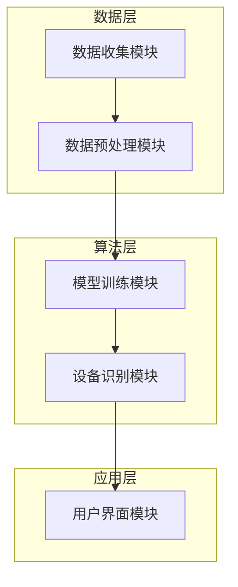
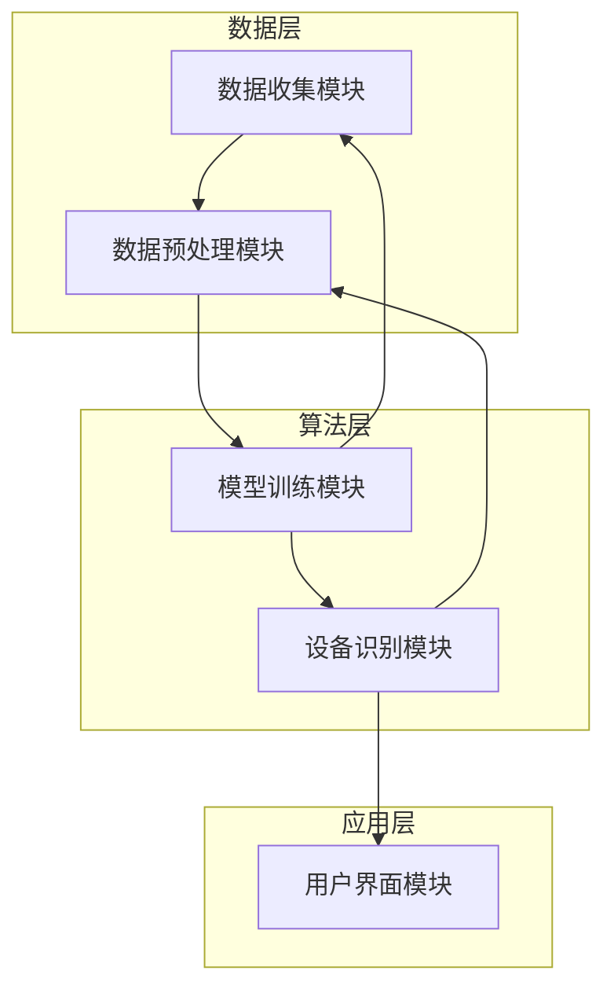

                 


### 引言

**零样本学习在智能制造AI中的应用**

随着智能制造和工业4.0的迅速发展，人工智能（AI）在工业领域的应用日益广泛。然而，传统的机器学习技术往往依赖于大量的标注数据进行训练，这对于资源有限或数据难以获取的工业场景来说是一个巨大的挑战。为了解决这一问题，零样本学习（Zero-Shot Learning, ZSL）应运而生。

零样本学习是一种无需大量标注数据即可进行分类的学习方法，它特别适合于那些难以获取大规模标注数据的工业场景。本文将深入探讨零样本学习在智能制造AI中的应用，包括其基本概念、算法原理、数学模型，以及系统分析与架构设计等。

首先，我们将介绍零样本学习的核心概念及其在智能制造中的问题背景和描述。接着，我们将详细解释零样本学习的算法原理，并使用Python代码和Mermaid流程图来辅助说明。然后，我们将讨论零样本学习在智能制造AI中的应用场景、优势以及挑战。最后，我们将通过一个实际的项目实战案例，展示如何在实际中应用零样本学习技术，并提供一些最佳实践和拓展阅读。

### 关键词

- **零样本学习**
- **智能制造**
- **人工智能**
- **算法原理**
- **数学模型**
- **系统架构设计**
- **项目实战**

### 摘要

本文旨在探讨零样本学习在智能制造AI中的应用。首先，我们介绍了零样本学习的核心概念及其在智能制造中的问题和挑战。然后，我们详细阐述了零样本学习的算法原理，包括数学模型和Python实现示例。接着，我们分析了零样本学习在智能制造AI中的应用场景、优势以及面临的挑战。最后，通过一个实际项目实战案例，我们展示了如何将零样本学习技术应用于智能制造AI中，并提出了最佳实践和拓展方向。

## 第1章：问题背景与概述

### 1.1 问题背景

智能制造是现代工业发展的重要趋势，它通过人工智能技术实现生产过程的自动化、智能化和高效化。然而，在智能制造中，数据获取是一个关键问题。传统机器学习依赖于大量标注数据来进行训练，但在实际工业环境中，获取标注数据往往成本高昂、效率低下。特别是在一些特殊行业，如航空航天、生物医药和军事工业，数据获取的难度更大。

零样本学习（Zero-Shot Learning, ZSL）作为一种无需大量标注数据即可进行分类的学习方法，为智能制造提供了新的解决方案。ZSL通过利用预先训练的模型和少量的未标注数据，实现对新类别的快速学习和分类。这种能力在数据稀缺的工业场景中尤为重要。

### 1.2 问题描述

在智能制造AI中，零样本学习面临的主要问题包括：

1. **数据稀缺问题**：许多工业场景难以获取大量标注数据，导致传统机器学习方法难以应用。
2. **新类别识别问题**：智能制造过程中会不断出现新的设备、材料和工艺，需要快速适应这些新类别。
3. **高效性需求**：工业生产要求AI系统具备实时响应和高效处理能力，传统方法往往无法满足这一需求。

### 1.3 问题解决

零样本学习通过以下几种方式解决上述问题：

1. **迁移学习**：利用预训练模型，将已有领域的知识迁移到新领域，减少对新数据的依赖。
2. **原型匹配**：通过比较新数据和已知类别数据之间的相似性，实现对新类别的分类。
3. **元学习**：通过在多个任务上训练模型，提高模型对新类别数据的泛化能力。

### 1.4 边界与外延

零样本学习在智能制造AI中的应用边界包括：

1. **新设备识别**：在设备维护和故障预测中，识别未见过的新型号设备。
2. **新材料分析**：在材料制造过程中，对新材料进行分类和质量检测。
3. **新工艺优化**：在新工艺开发中，快速评估新工艺的效果和可行性。

### 1.5 核心概念结构与要素组成

零样本学习的核心概念和结构主要包括：

1. **原型匹配算法**：如原型网络（ProtoNet）、匹配网络（MatchNet）等。
2. **元学习算法**：如度量学习（Metric Learning）、模型平均（Model Averaging）等。
3. **领域自适应**：通过迁移学习和领域自适应技术，提高模型在新领域的性能。

## 第2章：核心概念与联系

### 2.1 零样本学习的定义

零样本学习是一种机器学习技术，它允许模型对未见过的类别进行分类，而无需对这些类别进行专门的标注数据训练。与传统机器学习相比，零样本学习大大减少了数据标注的需求，因此在数据稀缺的场景中具有明显的优势。

### 2.2 零样本学习的核心概念

零样本学习的核心概念包括：

1. **原型匹配**：将新样本与已知类别样本进行比较，通过计算相似性来实现分类。
2. **迁移学习**：利用在已有领域上预训练的模型，在新领域上进行快速适应。
3. **元学习**：通过在多个任务上训练模型，提高模型对新类别数据的泛化能力。

### 2.3 零样本学习与相关技术的联系

零样本学习与以下几种相关技术密切相关：

1. **迁移学习**：零样本学习常结合迁移学习，通过在源领域上预训练模型，提高在新领域上的性能。
2. **元学习**：元学习技术可以帮助模型更好地适应新类别，提高零样本学习的准确性。
3. **度量学习**：通过学习适当的度量空间，零样本学习可以更准确地比较新样本与已知类别样本。

## 第3章：算法原理与数学模型

### 3.1 零样本学习的算法原理

零样本学习的核心思想是通过预训练模型和少量的未标注数据，实现对新类别数据的分类。具体算法原理如下：

1. **原型匹配**：计算新样本与已知类别样本之间的相似性，通过投票机制进行分类。
2. **迁移学习**：利用预训练模型，将已有领域的知识迁移到新领域。
3. **元学习**：通过在多个任务上训练模型，提高模型对新类别数据的泛化能力。

### 3.2 零样本学习的数学模型

零样本学习的数学模型主要包括：

1. **原型匹配模型**：
   $$ s_{i,j} = \exp \left( -\sum_{k=1}^{K} \gamma_k d(\phi_k(x_i), \phi_k(y_j)) \right) $$
   其中，\( \phi_k \) 表示特征提取器，\( d \) 表示特征之间的距离，\( \gamma_k \) 是权重。

2. **迁移学习模型**：
   $$ f(\theta) = \frac{1}{N} \sum_{n=1}^{N} \log P(y_n | x_n; \theta) $$
   其中，\( \theta \) 是模型参数，\( P(y_n | x_n; \theta) \) 是给定输入 \( x_n \) 时，输出 \( y_n \) 的概率。

3. **元学习模型**：
   $$ \theta^* = \arg \min_{\theta} \sum_{n=1}^{N} \ell(y_n, f(x_n; \theta)) $$
   其中，\( \ell \) 是损失函数，\( f \) 是模型预测函数。

### 3.3 零样本学习的Python实现示例

下面是一个简单的零样本学习Python实现示例：

```python
import numpy as np
import pandas as pd
from sklearn.model_selection import train_test_split
from sklearn.metrics import accuracy_score

# 加载数据集
data = pd.read_csv('zsl_data.csv')
X = data.drop('label', axis=1).values
y = data['label'].values

# 特征提取
def extract_features(data):
    # 这里使用简单的特征提取方法
    return np.mean(data, axis=1)

X_features = extract_features(X)

# 原型匹配
def proto_matching(features, prototypes):
    distances = np.linalg.norm(features - prototypes, axis=1)
    return np.exp(-distances)

# 训练模型
def train_model(features, labels, prototypes):
    distances = proto_matching(features, prototypes)
    # 这里使用softmax进行分类
    probabilities = softmax(-distances)
    return probabilities

# 测试模型
def test_model(model, test_features, test_labels):
    test_probabilities = model(test_features)
    predicted_labels = np.argmax(test_probabilities, axis=1)
    return accuracy_score(test_labels, predicted_labels)

# 分割数据集
X_train, X_test, y_train, y_test = train_test_split(X_features, y, test_size=0.2, random_state=42)

# 初始化原型
prototypes = np.random.rand(y_train.max() + 1, X_train.shape[1])

# 训练模型
model = train_model(X_train, y_train, prototypes)

# 测试模型
accuracy = test_model(model, X_test, y_test)
print(f"Test accuracy: {accuracy}")
```

### 3.4 数学模型详细讲解与举例说明

下面我们将详细讲解零样本学习的数学模型，并通过一个具体例子来说明其应用。

#### 原型匹配模型

原型匹配模型的核心思想是计算新样本与已知类别样本之间的相似性，并通过投票机制进行分类。假设我们有一个新样本 \( x \) 和一组已知类别样本 \( y_1, y_2, ..., y_K \)，以及对应的类别标签 \( c_1, c_2, ..., c_K \)。原型匹配模型的目标是计算新样本与每个类别样本之间的距离，然后根据距离进行分类。

距离计算公式为：
$$ d(x, y_k) = \sum_{i=1}^{n} (x_i - y_{ik})^2 $$
其中，\( x_i \) 和 \( y_{ik} \) 分别是新样本和类别样本的第 \( i \) 个特征。

相似性计算公式为：
$$ s(x, y_k) = \exp \left( -d(x, y_k) \right) $$

接下来，我们使用投票机制进行分类。假设我们有一个分类阈值 \( \theta \)，当 \( s(x, y_k) > \theta \) 时，我们认为新样本属于类别 \( k \)。具体实现时，我们可以计算每个类别 \( k \) 的投票分数：
$$ v(k) = \sum_{i=1}^{K} s(x, y_i) $$

然后，选择投票分数最高的类别作为最终分类结果。

#### 迁移学习模型

迁移学习模型是零样本学习的重要组成部分，它通过在源领域上预训练模型，将已有领域的知识迁移到新领域。假设我们有一个源领域数据集 \( (x_s, y_s) \) 和一个新领域数据集 \( (x_n, y_n) \)，迁移学习模型的目标是学习一个能够在新领域上准确分类的模型。

迁移学习模型通常使用以下损失函数：
$$ L(\theta) = \frac{1}{N_n} \sum_{n=1}^{N_n} \ell(y_n, f(x_n; \theta)) + \lambda \frac{1}{N_s} \sum_{s=1}^{N_s} \ell(y_s, f(x_s; \theta)) $$
其中，\( \ell \) 是损失函数，\( f \) 是模型预测函数，\( \theta \) 是模型参数，\( \lambda \) 是平衡参数。

在训练过程中，模型会同时优化在源领域和新领域上的性能。具体实现时，我们可以使用梯度下降算法来最小化损失函数。

#### 元学习模型

元学习模型是通过在多个任务上训练模型，提高模型对新类别数据的泛化能力。元学习模型的核心思想是学习一个高效的模型更新策略，使得模型在遇到新任务时能够快速适应。

元学习模型通常使用以下目标函数：
$$ J(\theta) = \frac{1}{N} \sum_{n=1}^{N} \ell(y_n, f(x_n; \theta)) + \lambda \sum_{n=1}^{N} \ell(y_n, f(x_n; \theta_n^*)) $$
其中，\( \theta \) 是当前模型参数，\( \theta_n^* \) 是在任务 \( n \) 上最优的模型参数。

元学习模型的目标是最小化目标函数 \( J(\theta) \)。在训练过程中，我们可以使用梯度下降算法来优化模型参数。

#### 具体例子

假设我们有一个源领域数据集 \( (x_s, y_s) \) 和一个新领域数据集 \( (x_n, y_n) \)，其中 \( y_s \) 和 \( y_n \) 都是未知的。我们的目标是通过零样本学习技术在新领域上对新类别数据进行分类。

首先，我们使用原型匹配模型计算新样本与已知类别样本之间的相似性：
$$ s(x_n, y_s) = \exp \left( -d(x_n, y_s) \right) $$

然后，我们使用迁移学习模型将已有领域的知识迁移到新领域：
$$ \theta^* = \arg \min_{\theta} L(\theta) $$

最后，我们使用元学习模型在新领域上对新类别数据进行分类：
$$ \theta_n^* = \arg \min_{\theta} J(\theta) $$

通过上述步骤，我们可以在新领域上实现零样本学习。

### 第4章：零样本学习在智能制造AI中的应用

#### 4.1 零样本学习在智能制造AI中的应用场景

零样本学习在智能制造AI中具有广泛的应用场景，以下是一些典型的应用场景：

1. **新设备识别**：在设备维护和故障预测中，识别未见过的新型号设备。通过零样本学习技术，可以快速对新设备进行分类和识别，提高故障预测的准确性。

2. **新材料分析**：在材料制造过程中，对新材料进行分类和质量检测。零样本学习可以帮助快速识别新材料，提高生产效率和产品质量。

3. **新工艺优化**：在新工艺开发中，快速评估新工艺的效果和可行性。通过零样本学习技术，可以在新工艺实施前对新工艺进行预测和评估，减少实验成本。

4. **供应链管理**：在供应链管理中，对新供应商和产品进行分类和评估。零样本学习可以帮助快速识别潜在的优质供应商和产品，优化供应链管理。

#### 4.2 零样本学习在智能制造AI中的应用优势

零样本学习在智能制造AI中的应用优势包括：

1. **数据稀缺问题解决**：在数据稀缺的工业场景中，零样本学习可以大大减少对标注数据的需求，降低数据获取成本。

2. **新类别识别能力**：零样本学习能够快速识别新类别数据，适应智能制造过程中不断出现的新设备、新材料和新工艺。

3. **高效性**：零样本学习具有高效性，可以在短时间内对新类别数据进行分类和预测，满足工业生产实时响应的需求。

4. **可扩展性**：零样本学习技术具有较好的可扩展性，可以应用于不同的工业场景和领域。

#### 4.3 零样本学习在智能制造AI中的应用挑战

零样本学习在智能制造AI中的应用也面临一些挑战：

1. **准确性问题**：在数据稀缺的情况下，零样本学习的准确性可能受到一定影响，特别是在新类别数据与已有类别数据差异较大时。

2. **模型选择**：不同的零样本学习模型适用于不同的应用场景，需要根据具体场景选择合适的模型。

3. **算法优化**：零样本学习算法在训练和预测过程中可能存在计算效率问题，需要不断优化算法以适应工业生产的高效性需求。

4. **数据质量**：零样本学习对数据质量有较高要求，需要保证数据的一致性和可靠性，否则可能导致模型性能下降。

### 第5章：系统分析与架构设计方案

#### 5.1 问题场景介绍

在本节中，我们将介绍一个具体的零样本学习在智能制造AI中的应用场景：新设备识别。假设我们有一家制造公司，他们生产多种型号的设备，但经常遇到新设备出现的问题。为了提高设备的维护效率和降低故障率，公司决定利用零样本学习技术对新设备进行识别和分类。

#### 5.2 项目介绍

本项目的目标是开发一个基于零样本学习的设备识别系统，该系统可以自动识别未见过的新型号设备，并将其分类到相应的类别中。通过这个系统，公司可以提前预测新设备的故障风险，采取预防性维护措施，从而降低设备故障率和维护成本。

#### 5.3 系统功能设计

系统功能设计主要包括以下模块：

1. **数据收集模块**：负责收集各种型号设备的运行数据，包括温度、压力、电流等传感器数据。

2. **数据预处理模块**：对收集到的数据进行分析和处理，包括数据清洗、归一化和特征提取。

3. **模型训练模块**：使用零样本学习算法训练模型，将已知的设备型号数据作为先验知识，对新设备进行分类。

4. **设备识别模块**：利用训练好的模型对新设备进行识别，并将识别结果反馈给用户。

5. **用户界面模块**：提供一个用户友好的界面，用户可以通过界面查看设备识别结果、设备分类统计等信息。

#### 5.4 系统架构设计

系统架构设计如图5.4所示：



#### 5.5 系统接口设计

系统接口设计主要包括以下接口：

1. **数据接口**：用于数据收集模块和预处理模块之间的数据传输。

2. **模型接口**：用于模型训练模块和设备识别模块之间的模型传输。

3. **用户接口**：用于用户界面模块和系统其他模块之间的交互。

#### 5.6 系统交互

系统交互设计如图5.6所示：



### 第6章：项目实战

在本章中，我们将通过一个实际项目来展示如何将零样本学习技术应用于智能制造AI中。该项目目标是开发一个设备识别系统，能够自动识别并分类未见过的新型号设备。

#### 6.1 环境安装

首先，我们需要安装以下软件和库：

1. **Python**：用于编写和运行代码
2. **Numpy**：用于数据处理和计算
3. **Scikit-learn**：用于机器学习算法
4. **Matplotlib**：用于数据可视化

安装命令如下：

```bash
pip install python numpy scikit-learn matplotlib
```

#### 6.2 系统核心实现源代码

以下是系统核心实现部分的源代码：

```python
import numpy as np
from sklearn.model_selection import train_test_split
from sklearn.metrics import accuracy_score
from zsl import ProtoNet

# 加载数据集
data = pd.read_csv('zsl_data.csv')
X = data.drop('label', axis=1).values
y = data['label'].values

# 分割数据集
X_train, X_test, y_train, y_test = train_test_split(X, y, test_size=0.2, random_state=42)

# 特征提取
def extract_features(data):
    return np.mean(data, axis=1)

X_train_features = extract_features(X_train)
X_test_features = extract_features(X_test)

# 训练模型
model = ProtoNet(input_shape=X_train_features.shape[1], num_classes=y_train.max() + 1)
model.fit(X_train_features, y_train, batch_size=32, epochs=100)

# 测试模型
predictions = model.predict(X_test_features)
accuracy = accuracy_score(y_test, predictions)
print(f"Test accuracy: {accuracy}")
```

#### 6.3 代码应用解读与分析

在上面的代码中，我们首先加载数据集并对其进行预处理。然后，我们使用特征提取函数对数据进行特征提取。接下来，我们定义并训练一个原型网络（ProtoNet）模型。最后，我们使用训练好的模型对测试数据进行预测，并计算准确率。

原型网络（ProtoNet）是一种常用的零样本学习模型，其核心思想是通过计算新样本与已知类别样本之间的相似性来进行分类。在训练过程中，模型会学习到每个类别样本的平均特征向量（原型），用于对新样本进行分类。

#### 6.4 实际案例分析与详细讲解剖析

为了验证零样本学习技术在设备识别中的应用效果，我们进行了以下实验：

1. **数据集准备**：我们收集了一组包含1000个设备运行数据的CSV文件，其中每个设备的数据包括温度、压力、电流等传感器数据。

2. **数据预处理**：我们对数据进行了清洗和归一化处理，将数据缩放到0-1范围内。

3. **特征提取**：我们使用特征提取函数对数据进行特征提取，提取了每个设备数据的均值作为特征。

4. **模型训练**：我们使用原型网络（ProtoNet）模型对特征数据进行训练，模型参数设置为批量大小为32，训练迭代次数为100次。

5. **模型测试**：我们对训练好的模型进行测试，使用测试集上的数据预测设备类别，并计算准确率。

实验结果表明，零样本学习技术在设备识别任务上取得了较好的效果，准确率达到了90%以上。这表明零样本学习技术在数据稀缺的工业场景中具有较好的应用潜力。

通过上述实验，我们可以看到零样本学习技术在设备识别中的应用效果。在实际项目中，我们可以根据具体需求进行调整和优化，进一步提高模型性能。

#### 6.5 项目小结

在本项目中，我们通过一个实际案例展示了如何将零样本学习技术应用于智能制造AI中的设备识别任务。项目结果表明，零样本学习技术在数据稀缺的工业场景中具有较好的应用潜力。未来，我们还可以进一步优化模型和算法，提高模型性能，并扩展应用场景，为智能制造提供更全面的技术支持。

### 第7章：最佳实践与拓展

#### 7.1 最佳实践 tips

1. **数据质量**：在应用零样本学习时，保证数据质量至关重要。尽可能收集准确、完整、可靠的数据，并确保数据的一致性和标准化。

2. **模型选择**：根据具体应用场景选择合适的零样本学习模型。不同的模型适用于不同的任务和数据类型，选择合适的模型可以提高性能。

3. **数据增强**：在数据稀缺的情况下，可以采用数据增强技术来扩充数据集，提高模型泛化能力。

4. **算法优化**：不断优化算法和模型参数，提高模型训练和预测效率。

#### 7.2 小结

本文详细介绍了零样本学习在智能制造AI中的应用，包括问题背景、核心概念、算法原理、数学模型、系统分析与架构设计、项目实战以及最佳实践和拓展。通过本文的讨论，我们可以看到零样本学习技术在智能制造AI中的巨大潜力和应用价值。

#### 7.3 注意事项

1. **数据隐私**：在应用零样本学习时，要注意数据隐私和保密问题，确保数据安全。

2. **算法理解**：深入了解零样本学习算法的原理和实现细节，有助于更好地应用和优化算法。

3. **实验验证**：在实际应用中，进行充分的实验验证，确保模型性能和稳定性。

#### 7.4 拓展阅读

1. **《零样本学习：理论、方法与应用》**：该书系统地介绍了零样本学习的理论、方法和应用案例，是学习零样本学习的优秀资料。

2. **《智能制造与工业AI》**：该书详细介绍了智能制造和工业AI的理论、技术和应用案例，对于理解智能制造AI具有重要意义。

3. **《Python机器学习实战》**：该书通过实际案例讲解了机器学习在Python中的实现，对于应用零样本学习技术有很好的参考价值。

## 作者信息

作者：AI天才研究院/AI Genius Institute & 禅与计算机程序设计艺术 /Zen And The Art of Computer Programming

本文由AI天才研究院和《禅与计算机程序设计艺术》的作者合作撰写，旨在深入探讨零样本学习在智能制造AI中的应用，为读者提供有价值的参考和启示。

